# Research-LLM factor comparison — `2025-04`

Comparing the **factor output of different research LLMs** on three axes (raw factor quality → factors as ML features → factors through the full agentic fund). The panel, IS/OOS split, horizon and model hyper-parameters are held identical across preruns — the *only* variable is the factor set.

## Preruns compared

| prerun | research_model | usable_factors | dropped_factors |
| --- | --- | --- | --- |
| gpt4omini120650 | gpt-4o-mini | 66 | 0 |
| gpt5.4mini120650 | gpt-5.4-mini | 69 | 0 |
| main | seed library | 78 | 10 |

> Dropped factors declare fields the current data doesn't have yet (e.g. fundamentals); they light up unchanged once that data is downloaded.

*Usable vs awaiting-data factors per research model*

## Key findings

- **Best ML-combined OOS Sharpe:** `gpt5.4mini120650` with `random_forest` (OOS Sharpe = 20.116).
- **Mean OOS Sharpe across models, by research set:** `gpt4omini120650` = 9.519, `gpt5.4mini120650` = 9.241, `main` = 1.687.
- **Highest mean single-factor |IC| (h=6):** `gpt4omini120650` (mean |IC| = 0.0267).
- **Most diverse zoo (highest effective/raw factor ratio):** `gpt5.4mini120650` (eff 53.5 of 69, ratio 0.77).
- **Best selection-deflated single-factor |IC|:** `gpt4omini120650` (deflated |IC| = 0.0931 from 64 factors tried).

## 1. Single-factor IC (raw factor quality)

Per-underlying time-series Spearman rank-IC of every researched factor, recomputed on the shared panel at horizons h=1, h=6, h=60. The per-underlying IC correlates each factor's value vector with the underlying's own forward-return vector (pooled across underlyings); the cross-sectional IC ranks across underlyings per timestamp.

| prerun | n_factors | mean_abs_ic_1 | mean_abs_ic_6 | mean_abs_ic_60 | mean_abs_icir_6 | best_factor_h6 | best_abs_ic_h6 |
| --- | --- | --- | --- | --- | --- | --- | --- |
| gpt4omini120650 | 66 | 0.0352 | 0.0267 | 0.0123 | 0.9577 | limit_order_book_imbalance_surge | 0.1008 |
| gpt5.4mini120650 | 69 | 0.021 | 0.0172 | 0.0098 | 0.8921 | lstm_flow_price_mismatch | 0.0876 |
| main | 78 | 0.0198 | 0.0166 | 0.0119 | 0.7169 | alpha_066 | 0.0446 |

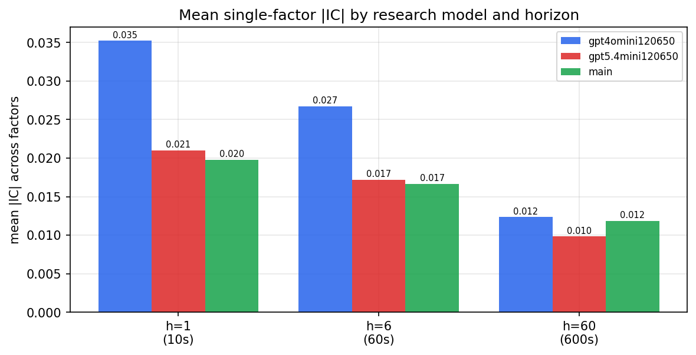

*Mean |IC| by research model and horizon*

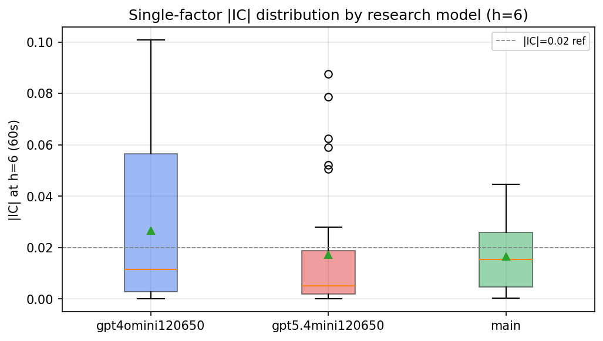

*Per-factor |IC| distribution by research model*

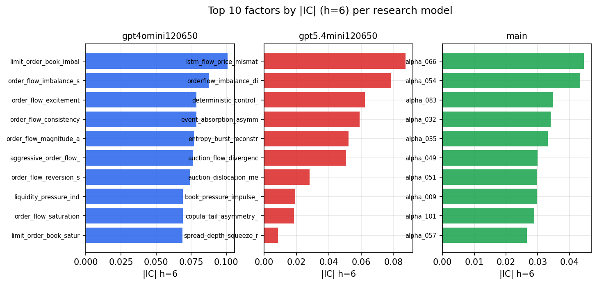

*Top factors by |IC| per research model*

## 2. Factor diversity & redundancy

Pairwise correlation of each zoo's *signals*. `eff_n_factors` is the effective number of independent factors (participation ratio of the correlation eigenvalues); `eff_ratio` and `redundancy` summarise how much unique information the zoo holds vs. how much is duplicated; `n_clusters` groups factors at |corr| ≥ 0.7.

| prerun | n_factors | eff_n_factors | eff_ratio | mean_abs_corr | n_clusters | redundancy |
| --- | --- | --- | --- | --- | --- | --- |
| gpt4omini120650 | 66 | 30.6401 | 0.4642 | 0.044 | 56 | 0.5358 |
| gpt5.4mini120650 | 69 | 53.4551 | 0.7747 | 0.0116 | 63 | 0.2253 |
| main | 78 | 38.16 | 0.4892 | 0.0361 | 70 | 0.5108 |

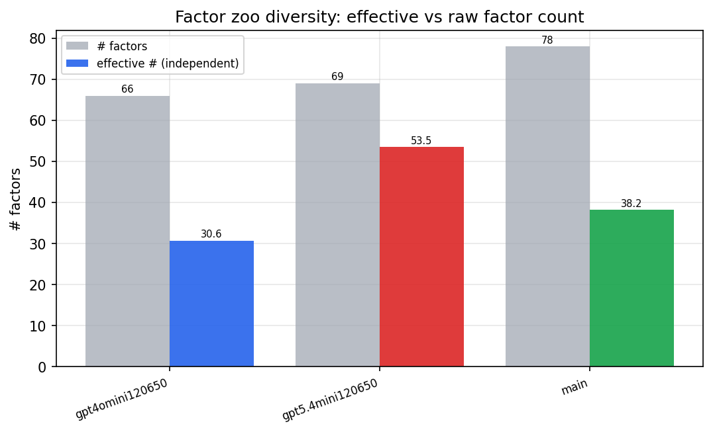

*Effective vs raw factor count per research model*

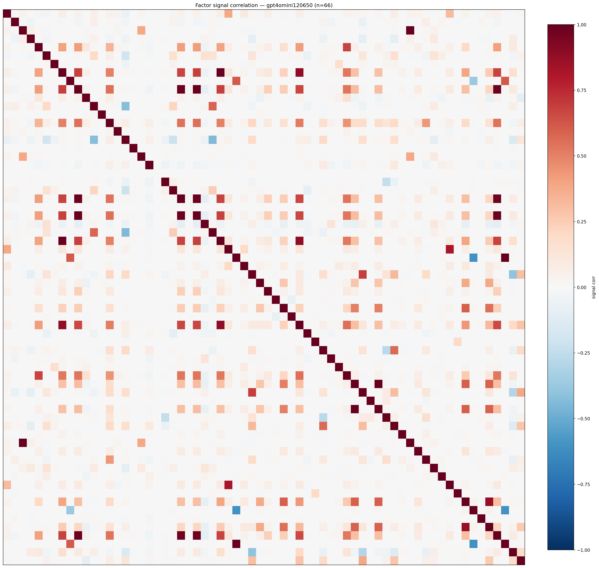

*Signal correlation matrix — gpt4omini120650*

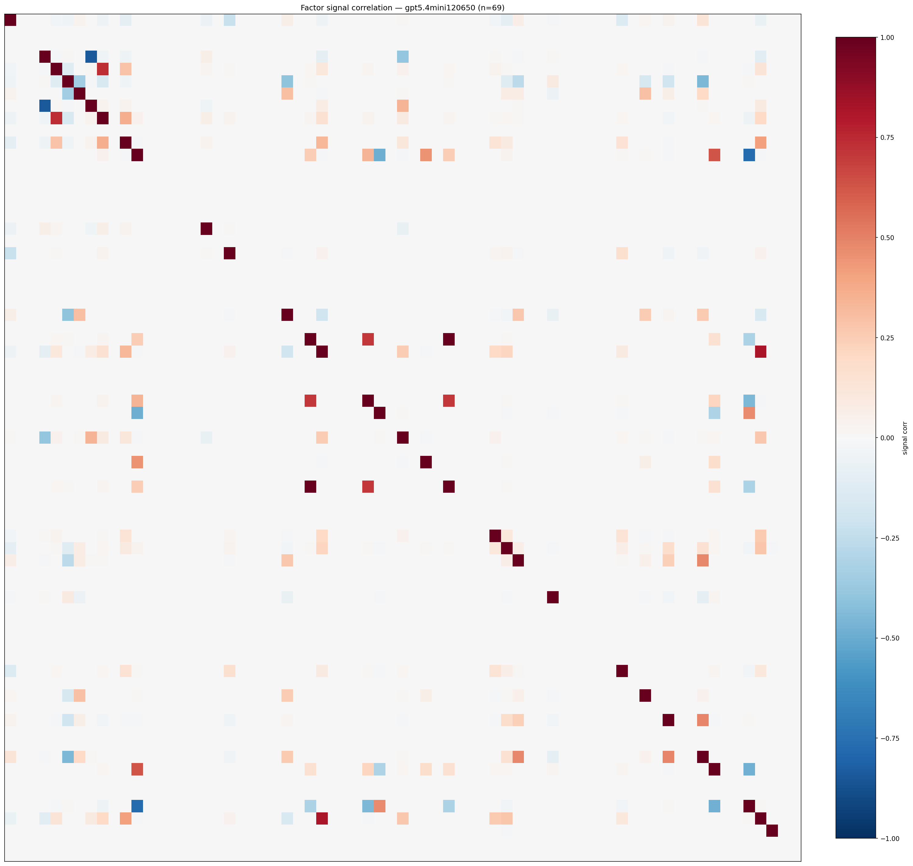

*Signal correlation matrix — gpt5.4mini120650*

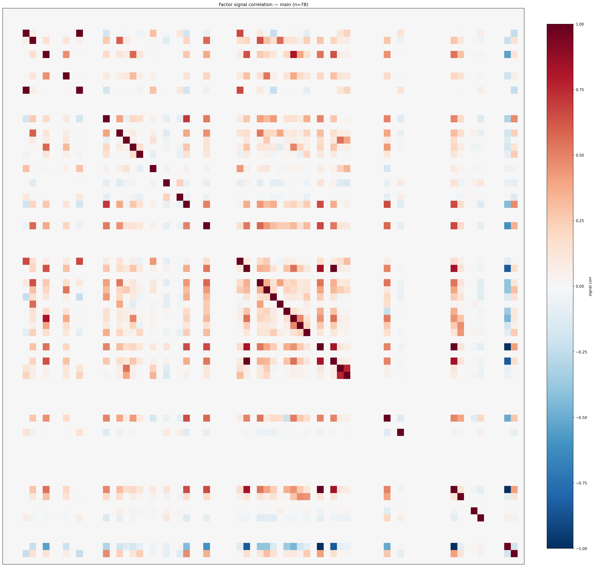

*Signal correlation matrix — main*

## 3. Deflation & model-based importance

`deflated_best_ic` haircuts each zoo's best |IC| for the number of factors tried (`ic_n_tested`) — a bigger zoo's best factor is more likely to be lucky. `lasso_n_nonzero` / `lasso_sparsity` show how many factors a sparse linear model actually keeps (model-view redundancy).

| prerun | best_ic | deflated_best_ic | deflated_best_t | ic_n_tested | ic_n_obs | lasso_n_nonzero | lasso_sparsity |
| --- | --- | --- | --- | --- | --- | --- | --- |
| gpt4omini120650 | 0.1008 | 0.0931 | 35.1812 | 64 | 142739 | 5 | 0.9242 |
| gpt5.4mini120650 | 0.0876 | 0.0807 | 30.4859 | 31 | 142739 | 20 | 0.7101 |
| main | 0.0446 | 0.0375 | 14.1524 | 38 | 142739 | 5 | 0.9359 |

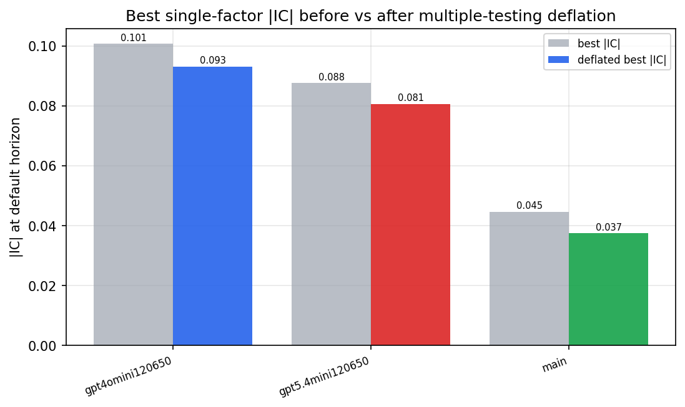

*Best |IC| before vs after multiple-testing deflation*

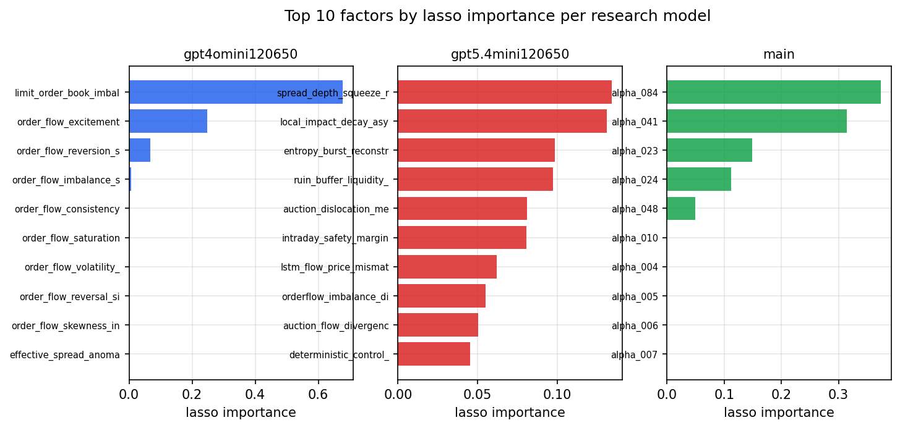

*Top factors by lasso importance per zoo*

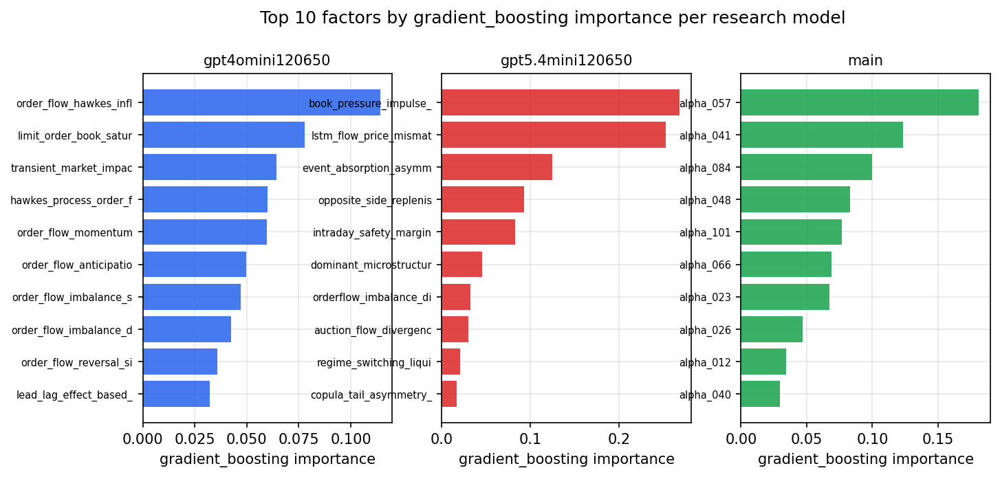

*Top factors by gradient_boosting importance per zoo*

## 4. ML-combined signal — per-underlying vectorised backtest

Each model combines a prerun's factors into ONE signal (fit `factors → forward return` on IS, predict per (bar, underlying)), then that combined signal is run through a simple vectorised backtest — `position(signal) × the underlying's own forward return` — on the held-out OOS tail (+ an equal-weight ensemble). No cross-sectional ranking.

> Config: position=**threshold** (t=1.0, z-score `expanding`), aggregation=**portfolio**, fit-standardise=**per_underlying**, horizon=6.

| prerun | model | n_factors_used | oos_ic | oos_sharpe | is_sharpe | oos_ann_return | oos_max_drawdown |
| --- | --- | --- | --- | --- | --- | --- | --- |
| gpt4omini120650 | linear_regression | 66 | 0.0871 | 10.9045 | 36.26 | 0.4631 | -0.0209 |
| gpt4omini120650 | ridge | 66 | 0.0875 | 11.7527 | 36.1346 | 0.5009 | -0.0202 |
| gpt4omini120650 | lasso | 66 | 0.089 | 13.3085 | 38.3286 | 0.5659 | -0.0185 |
| gpt4omini120650 | elastic_net | 66 | 0.0891 | 13.1059 | 38.3762 | 0.5585 | -0.019 |
| gpt4omini120650 | random_forest | 66 | 0.0928 | 17.9506 | 42.9584 | 0.8253 | -0.0105 |
| gpt4omini120650 | gradient_boosting | 66 | 0.0906 | 0.9543 | 12.801 | 0.0332 | -0.0101 |
| gpt4omini120650 | xgboost | 66 | 0.0998 | 5.6617 | 18.5817 | 0.2272 | -0.0131 |
| gpt4omini120650 | lightgbm | 66 | 0.091 | 0.1731 | 17.7043 | 0.0079 | -0.0166 |
| gpt4omini120650 | ensemble | 66 | 0.0938 | 11.8637 | 31.3255 | 0.6192 | -0.019 |
| gpt5.4mini120650 | linear_regression | 69 | 0.0856 | 5.7862 | 31.1468 | 0.3305 | -0.0111 |
| gpt5.4mini120650 | ridge | 69 | 0.0858 | 5.817 | 30.5051 | 0.3323 | -0.0111 |
| gpt5.4mini120650 | lasso | 69 | 0.0853 | 13.2058 | 32.7379 | 0.7233 | -0.0081 |
| gpt5.4mini120650 | elastic_net | 69 | 0.0853 | 13.2058 | 32.7379 | 0.7233 | -0.0081 |
| gpt5.4mini120650 | random_forest | 69 | 0.1085 | 20.1158 | 33.7677 | 0.8485 | -0.0129 |
| gpt5.4mini120650 | gradient_boosting | 69 | 0.105 | 6.3128 | 15.1994 | 0.2154 | -0.0044 |
| gpt5.4mini120650 | xgboost | 69 | 0.1078 | 4.2072 | 19.8866 | 0.1829 | -0.0168 |
| gpt5.4mini120650 | lightgbm | 69 | 0.0985 | 2.0066 | 16.4608 | 0.0763 | -0.0148 |
| gpt5.4mini120650 | ensemble | 69 | 0.1111 | 12.5113 | 32.3102 | 0.7194 | -0.0104 |
| main | linear_regression | 78 | 0.0111 | -2.426 | 11.6226 | -0.0741 | -0.0094 |
| main | ridge | 78 | 0.0121 | -2.1331 | 11.6238 | -0.069 | -0.0095 |
| main | lasso | 78 | 0.0193 | 3.5023 | 12.75 | 0.1941 | -0.0133 |
| main | elastic_net | 78 | 0.0189 | 3.8155 | 12.1637 | 0.21 | -0.0133 |
| main | random_forest | 78 | 0.0236 | 3.989 | 20.1973 | 0.1605 | -0.0065 |
| main | gradient_boosting | 78 | 0.0191 | 1.8233 | 18.5672 | 0.0569 | -0.0084 |
| main | xgboost | 78 | 0.0198 | 3.0354 | 21.1165 | 0.1168 | -0.0094 |
| main | lightgbm | 78 | 0.0173 | 2.5945 | 22.0225 | 0.0902 | -0.007 |
| main | ensemble | 78 | 0.0204 | 0.9818 | 22.1828 | 0.0478 | -0.0129 |

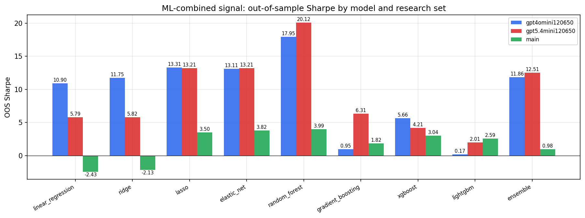

*ML-combined OOS Sharpe by model and research set*

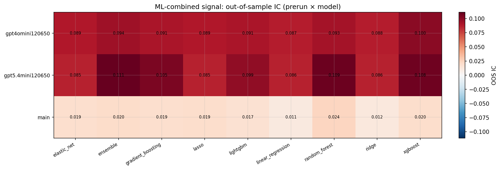

*ML-combined OOS IC (prerun × model)*

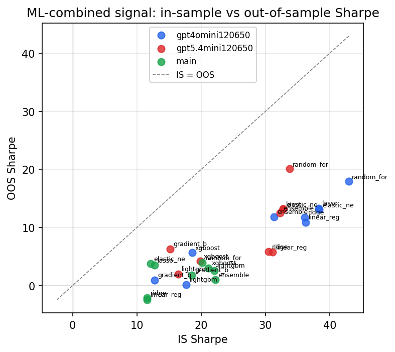

*IS vs OOS Sharpe (overfitting diagnostic)*

---
*Generated by `run_model_comparison.py`. Tables: `*.csv`; interactive: `comparison.ipynb`.*
