# Research-LLM factor comparison — `2025-05`

Comparing the **factor output of different research LLMs** on three axes (raw factor quality → factors as ML features → factors through the full agentic fund). The panel, IS/OOS split, horizon and model hyper-parameters are held identical across preruns — the *only* variable is the factor set.

## Preruns compared

| prerun | research_model | usable_factors | dropped_factors |
| --- | --- | --- | --- |
| gpt4omini120650 | gpt-4o-mini | 66 | 0 |
| gpt5.4mini120650 | gpt-5.4-mini | 69 | 0 |
| main | seed library | 78 | 10 |

> Dropped factors declare fields the current data doesn't have yet (e.g. fundamentals); they light up unchanged once that data is downloaded.

*Usable vs awaiting-data factors per research model*

## Key findings

- **Best ML-combined OOS Sharpe:** `gpt5.4mini120650` with `random_forest` (OOS Sharpe = 36.358).
- **Mean OOS Sharpe across models, by research set:** `gpt5.4mini120650` = 18.945, `gpt4omini120650` = 4.172, `main` = 2.581.
- **Highest mean single-factor |IC| (h=6):** `gpt4omini120650` (mean |IC| = 0.0221).
- **Most diverse zoo (highest effective/raw factor ratio):** `gpt5.4mini120650` (eff 53.0 of 69, ratio 0.77).
- **Best selection-deflated single-factor |IC|:** `gpt4omini120650` (deflated |IC| = 0.0917 from 64 factors tried).

## 1. Single-factor IC (raw factor quality)

Per-underlying time-series Spearman rank-IC of every researched factor, recomputed on the shared panel at horizons h=1, h=6, h=60. The per-underlying IC correlates each factor's value vector with the underlying's own forward-return vector (pooled across underlyings); the cross-sectional IC ranks across underlyings per timestamp.

| prerun | n_factors | mean_abs_ic_1 | mean_abs_ic_6 | mean_abs_ic_60 | mean_abs_icir_6 | best_factor_h6 | best_abs_ic_h6 |
| --- | --- | --- | --- | --- | --- | --- | --- |
| gpt4omini120650 | 66 | 0.0313 | 0.0221 | 0.0123 | 0.9069 | limit_order_book_imbalance_surge | 0.0992 |
| gpt5.4mini120650 | 69 | 0.0187 | 0.0152 | 0.0099 | 0.8935 | orderflow_imbalance_divergence | 0.0753 |
| main | 78 | 0.0211 | 0.018 | 0.0096 | 0.8431 | alpha_066 | 0.056 |

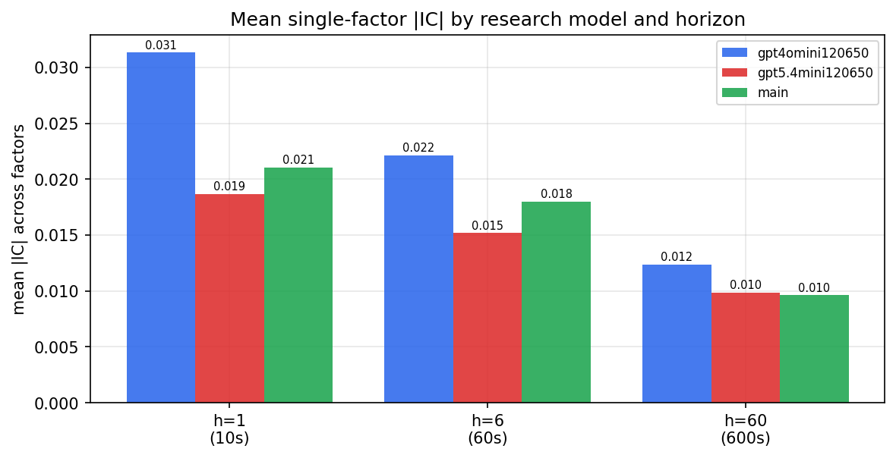

*Mean |IC| by research model and horizon*

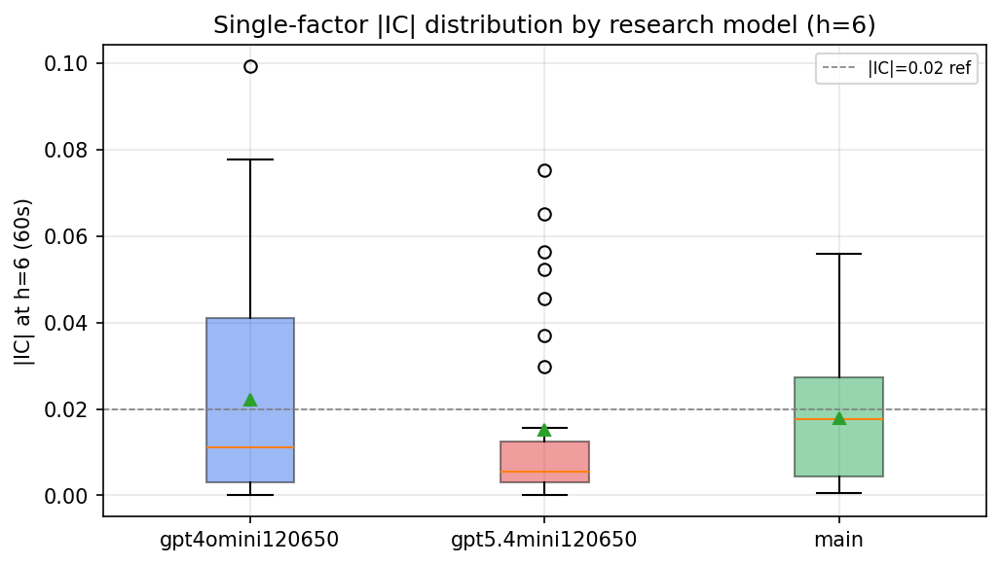

*Per-factor |IC| distribution by research model*

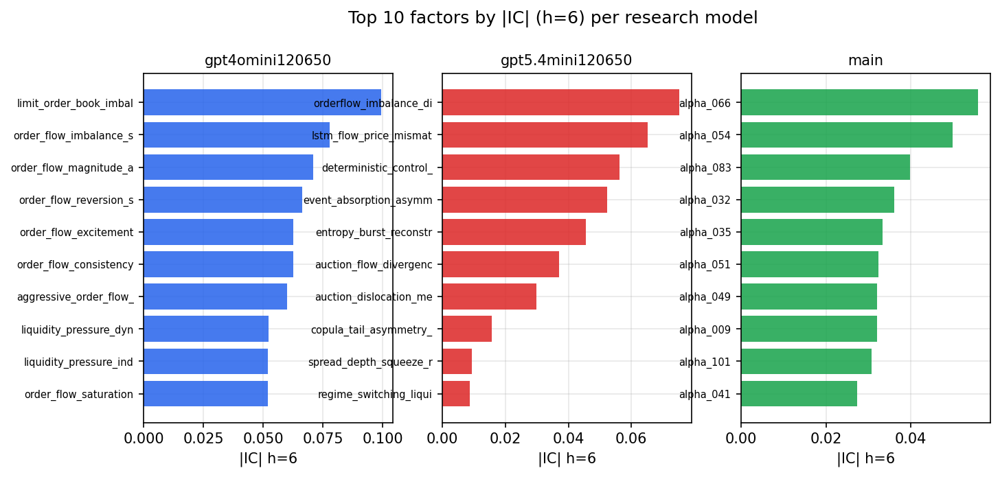

*Top factors by |IC| per research model*

## 2. Factor diversity & redundancy

Pairwise correlation of each zoo's *signals*. `eff_n_factors` is the effective number of independent factors (participation ratio of the correlation eigenvalues); `eff_ratio` and `redundancy` summarise how much unique information the zoo holds vs. how much is duplicated; `n_clusters` groups factors at |corr| ≥ 0.7.

| prerun | n_factors | eff_n_factors | eff_ratio | mean_abs_corr | n_clusters | redundancy |
| --- | --- | --- | --- | --- | --- | --- |
| gpt4omini120650 | 66 | 30.1838 | 0.4573 | 0.0445 | 53 | 0.5427 |
| gpt5.4mini120650 | 69 | 53.0348 | 0.7686 | 0.0117 | 63 | 0.2314 |
| main | 78 | 38.7061 | 0.4962 | 0.0352 | 69 | 0.5038 |

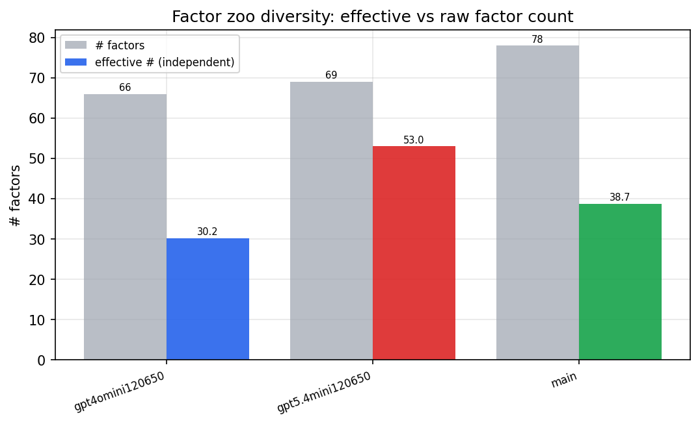

*Effective vs raw factor count per research model*

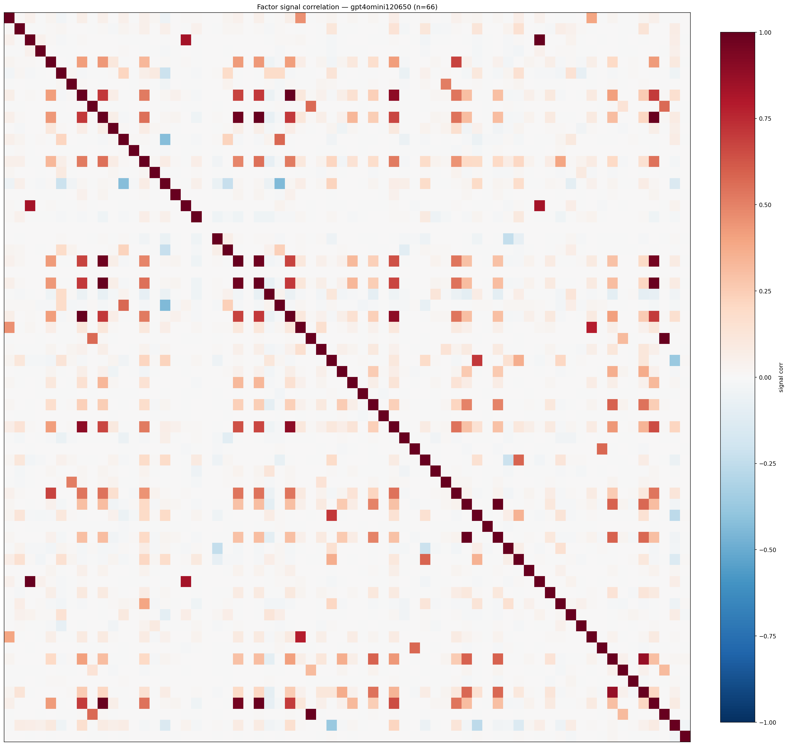

*Signal correlation matrix — gpt4omini120650*

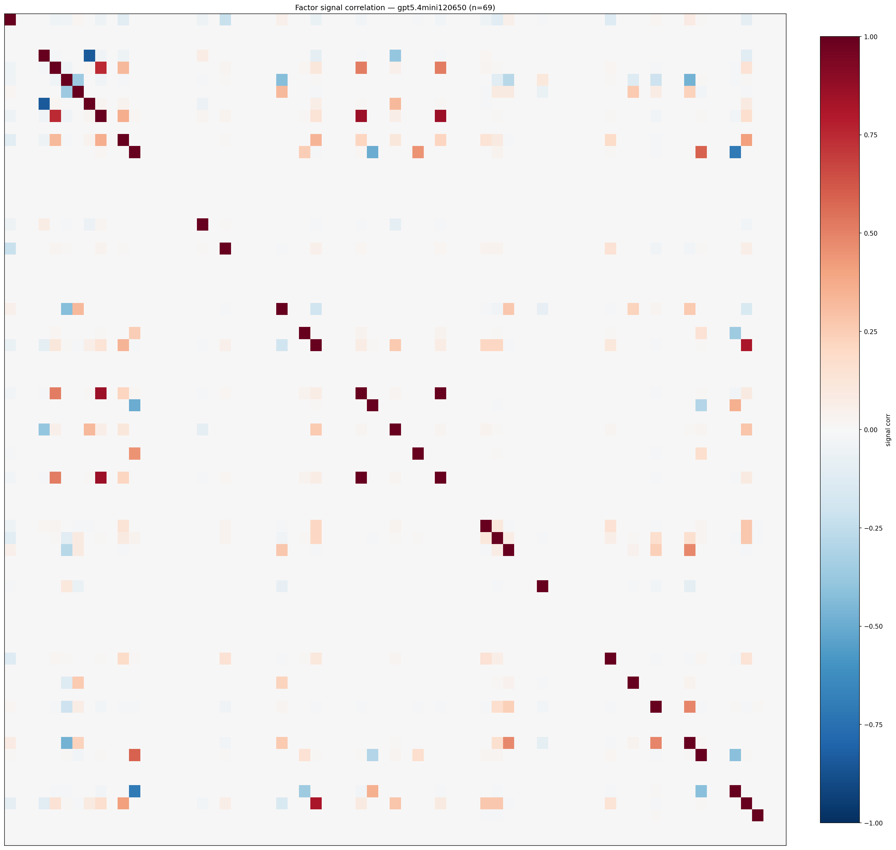

*Signal correlation matrix — gpt5.4mini120650*

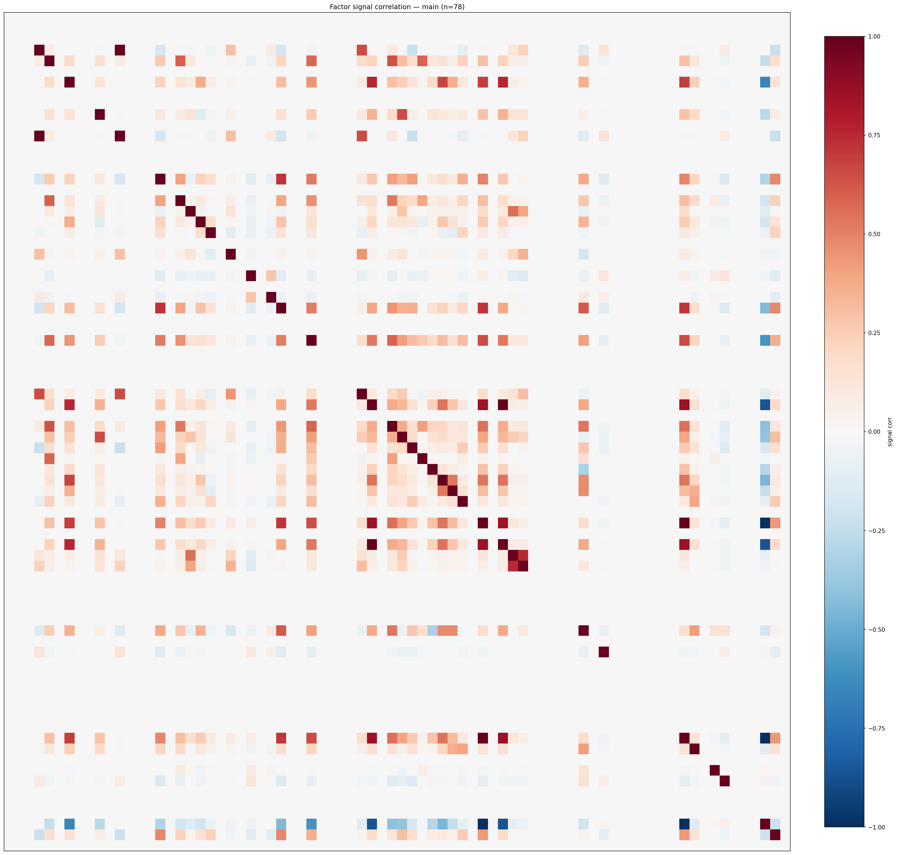

*Signal correlation matrix — main*

## 3. Deflation & model-based importance

`deflated_best_ic` haircuts each zoo's best |IC| for the number of factors tried (`ic_n_tested`) — a bigger zoo's best factor is more likely to be lucky. `lasso_n_nonzero` / `lasso_sparsity` show how many factors a sparse linear model actually keeps (model-view redundancy).

| prerun | best_ic | deflated_best_ic | deflated_best_t | ic_n_tested | ic_n_obs | lasso_n_nonzero | lasso_sparsity |
| --- | --- | --- | --- | --- | --- | --- | --- |
| gpt4omini120650 | 0.0992 | 0.0917 | 34.9136 | 64 | 145078 | 9 | 0.8636 |
| gpt5.4mini120650 | 0.0753 | 0.0684 | 26.0678 | 31 | 145078 | 21 | 0.6957 |
| main | 0.056 | 0.0489 | 18.6141 | 38 | 145078 | 10 | 0.8718 |

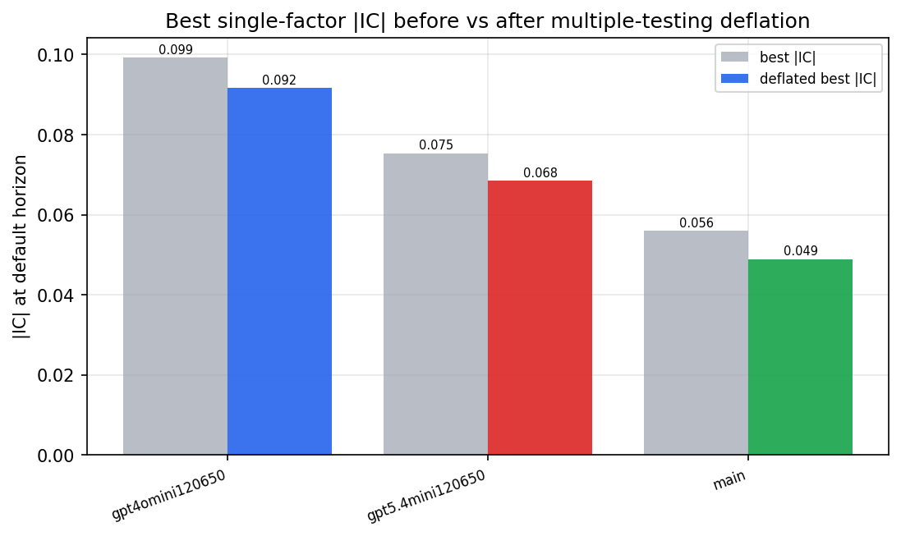

*Best |IC| before vs after multiple-testing deflation*

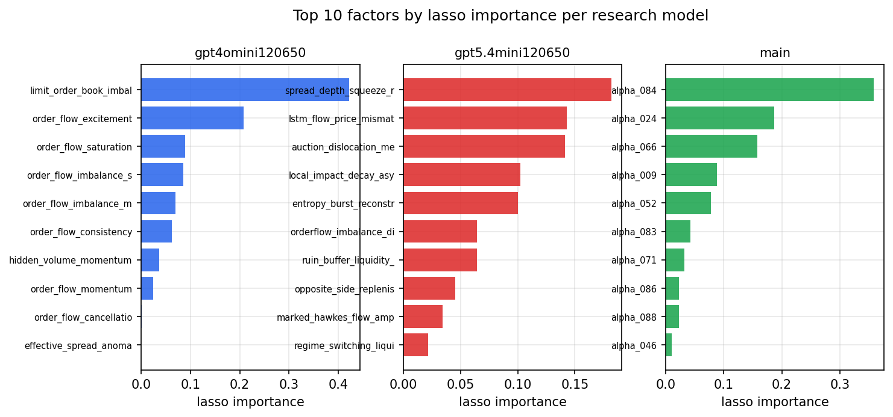

*Top factors by lasso importance per zoo*

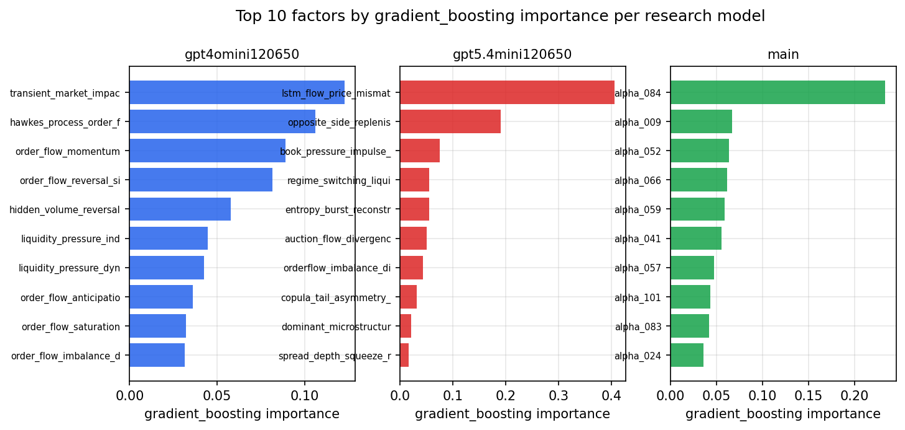

*Top factors by gradient_boosting importance per zoo*

## 4. ML-combined signal — per-underlying vectorised backtest

Each model combines a prerun's factors into ONE signal (fit `factors → forward return` on IS, predict per (bar, underlying)), then that combined signal is run through a simple vectorised backtest — `position(signal) × the underlying's own forward return` — on the held-out OOS tail (+ an equal-weight ensemble). No cross-sectional ranking.

> Config: position=**threshold** (t=1.0, z-score `expanding`), aggregation=**portfolio**, fit-standardise=**per_underlying**, horizon=6.

| prerun | model | n_factors_used | oos_ic | oos_sharpe | is_sharpe | oos_ann_return | oos_max_drawdown |
| --- | --- | --- | --- | --- | --- | --- | --- |
| gpt4omini120650 | linear_regression | 66 | 0.0939 | -4.1452 | 17.8421 | -0.0104 | -0.0016 |
| gpt4omini120650 | ridge | 66 | 0.0945 | -4.4119 | 17.8663 | -0.0112 | -0.0015 |
| gpt4omini120650 | lasso | 66 | 0.1094 | 6.9287 | 19.7841 | 0.1008 | -0.0033 |
| gpt4omini120650 | elastic_net | 66 | 0.11 | 7.0618 | 20.2015 | 0.1032 | -0.0032 |
| gpt4omini120650 | random_forest | 66 | 0.1212 | 25.3521 | 22.8448 | 0.4247 | -0.0016 |
| gpt4omini120650 | gradient_boosting | 66 | 0.1179 | -4.7828 | 11.8822 | -0.0296 | -0.0028 |
| gpt4omini120650 | xgboost | 66 | 0.1234 | 3.0556 | 20.6154 | 0.0501 | -0.0034 |
| gpt4omini120650 | lightgbm | 66 | 0.1315 | 4.0581 | 21.111 | 0.063 | -0.0019 |
| gpt4omini120650 | ensemble | 66 | 0.1244 | 4.4292 | 23.6161 | 0.0761 | -0.0028 |
| gpt5.4mini120650 | linear_regression | 69 | 0.1116 | 16.3805 | 18.3863 | 0.2936 | -0.002 |
| gpt5.4mini120650 | ridge | 69 | 0.1115 | 17.1888 | 18.5287 | 0.3089 | -0.002 |
| gpt5.4mini120650 | lasso | 69 | 0.1122 | 23.8101 | 21.6818 | 0.5137 | -0.0033 |
| gpt5.4mini120650 | elastic_net | 69 | 0.1114 | 24.8367 | 21.724 | 0.5374 | -0.0033 |
| gpt5.4mini120650 | random_forest | 69 | 0.1377 | 36.3583 | 24.4457 | 0.6954 | -0.0023 |
| gpt5.4mini120650 | gradient_boosting | 69 | 0.1322 | 4.2089 | 13.2707 | 0.0268 | -0.0012 |
| gpt5.4mini120650 | xgboost | 69 | 0.1421 | 19.167 | 21.1766 | 0.3398 | -0.0022 |
| gpt5.4mini120650 | lightgbm | 69 | 0.1519 | 1.1231 | 21.6561 | 0.0206 | -0.0038 |
| gpt5.4mini120650 | ensemble | 69 | 0.138 | 27.4339 | 25.7588 | 0.5468 | -0.0022 |
| main | linear_regression | 78 | 0.0026 | 2.0713 | 8.892 | 0.011 | -0.0015 |
| main | ridge | 78 | 0.0042 | 3.7375 | 8.7247 | 0.0197 | -0.0012 |
| main | lasso | 78 | 0.0115 | 3.501 | 7.0346 | 0.021 | -0.0014 |
| main | elastic_net | 78 | 0.0115 | 3.3574 | 7.0074 | 0.0202 | -0.0014 |
| main | random_forest | 78 | 0.0335 | 1.9638 | 13.0349 | 0.011 | -0.0009 |
| main | gradient_boosting | 78 | 0.017 | -1.0317 | 11.7402 | -0.0021 | -0.0005 |
| main | xgboost | 78 | 0.0181 | 4.6565 | 16.5145 | 0.015 | -0.0003 |
| main | lightgbm | 78 | 0.0271 | 2.6778 | 24.8454 | 0.0104 | -0.001 |
| main | ensemble | 78 | 0.0112 | 2.2959 | 17.9533 | 0.0095 | -0.001 |

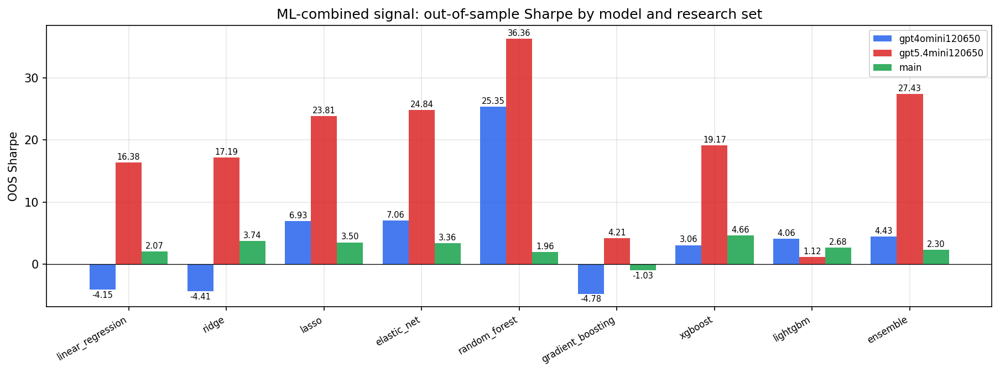

*ML-combined OOS Sharpe by model and research set*

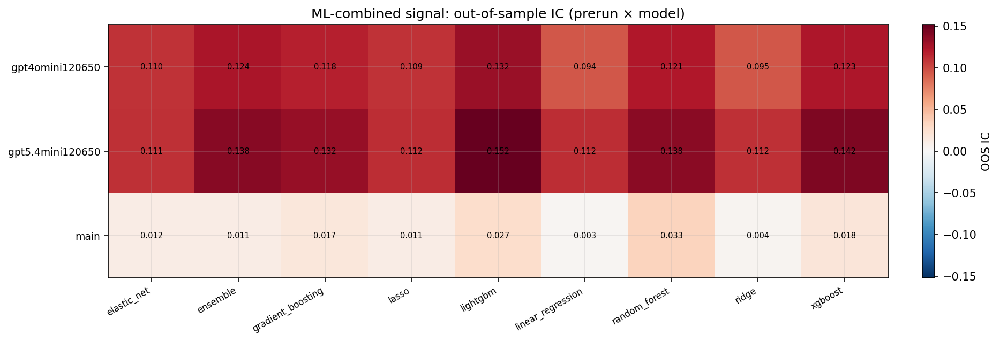

*ML-combined OOS IC (prerun × model)*

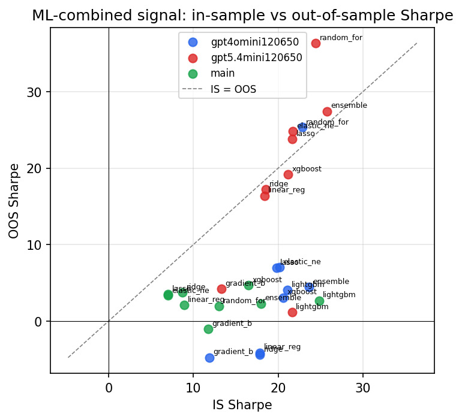

*IS vs OOS Sharpe (overfitting diagnostic)*

---
*Generated by `run_model_comparison.py`. Tables: `*.csv`; interactive: `comparison.ipynb`.*
