# Research-LLM factor comparison — `2025-06`

Comparing the **factor output of different research LLMs** on three axes (raw factor quality → factors as ML features → factors through the full agentic fund). The panel, IS/OOS split, horizon and model hyper-parameters are held identical across preruns — the *only* variable is the factor set.

## Preruns compared

| prerun | research_model | usable_factors | dropped_factors |
| --- | --- | --- | --- |
| gpt4omini120650 | gpt-4o-mini | 66 | 0 |
| gpt5.4mini120650 | gpt-5.4-mini | 69 | 0 |
| main | seed library | 78 | 10 |

> Dropped factors declare fields the current data doesn't have yet (e.g. fundamentals); they light up unchanged once that data is downloaded.

*Usable vs awaiting-data factors per research model*

## Key findings

- **Best ML-combined OOS Sharpe:** `gpt4omini120650` with `elastic_net` (OOS Sharpe = 61.378).
- **Mean OOS Sharpe across models, by research set:** `gpt4omini120650` = 25.772, `gpt5.4mini120650` = 13.035, `main` = -0.828.
- **Highest mean single-factor |IC| (h=6):** `gpt4omini120650` (mean |IC| = 0.0199).
- **Most diverse zoo (highest effective/raw factor ratio):** `gpt5.4mini120650` (eff 53.0 of 69, ratio 0.77).
- **Best selection-deflated single-factor |IC|:** `gpt4omini120650` (deflated |IC| = 0.0917 from 64 factors tried).

## 1. Single-factor IC (raw factor quality)

Per-underlying time-series Spearman rank-IC of every researched factor, recomputed on the shared panel at horizons h=1, h=6, h=60. The per-underlying IC correlates each factor's value vector with the underlying's own forward-return vector (pooled across underlyings); the cross-sectional IC ranks across underlyings per timestamp.

| prerun | n_factors | mean_abs_ic_1 | mean_abs_ic_6 | mean_abs_ic_60 | mean_abs_icir_6 | best_factor_h6 | best_abs_ic_h6 |
| --- | --- | --- | --- | --- | --- | --- | --- |
| gpt4omini120650 | 66 | 0.0281 | 0.0199 | 0.0114 | 0.8736 | limit_order_book_imbalance_surge | 0.0994 |
| gpt5.4mini120650 | 69 | 0.0189 | 0.0159 | 0.0098 | 0.9601 | orderflow_imbalance_divergence | 0.0882 |
| main | 78 | 0.0216 | 0.019 | 0.0085 | 0.9026 | alpha_066 | 0.0568 |

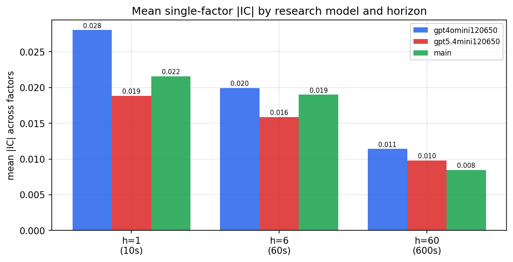

*Mean |IC| by research model and horizon*

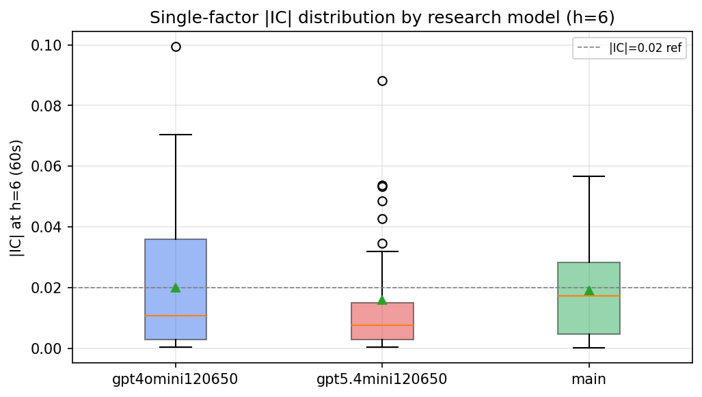

*Per-factor |IC| distribution by research model*

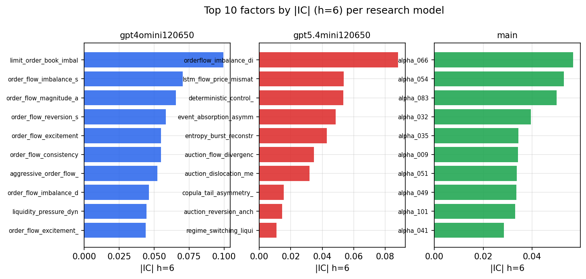

*Top factors by |IC| per research model*

## 2. Factor diversity & redundancy

Pairwise correlation of each zoo's *signals*. `eff_n_factors` is the effective number of independent factors (participation ratio of the correlation eigenvalues); `eff_ratio` and `redundancy` summarise how much unique information the zoo holds vs. how much is duplicated; `n_clusters` groups factors at |corr| ≥ 0.7.

| prerun | n_factors | eff_n_factors | eff_ratio | mean_abs_corr | n_clusters | redundancy |
| --- | --- | --- | --- | --- | --- | --- |
| gpt4omini120650 | 66 | 31.1286 | 0.4716 | 0.0434 | 55 | 0.5284 |
| gpt5.4mini120650 | 69 | 53.0241 | 0.7685 | 0.0118 | 63 | 0.2315 |
| main | 78 | 38.6153 | 0.4951 | 0.0354 | 71 | 0.5049 |

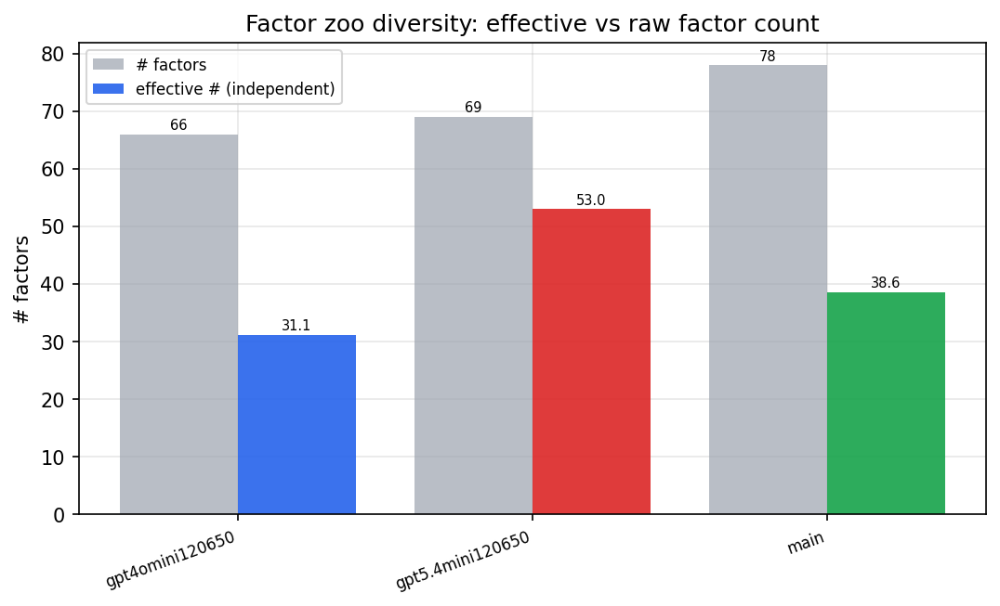

*Effective vs raw factor count per research model*

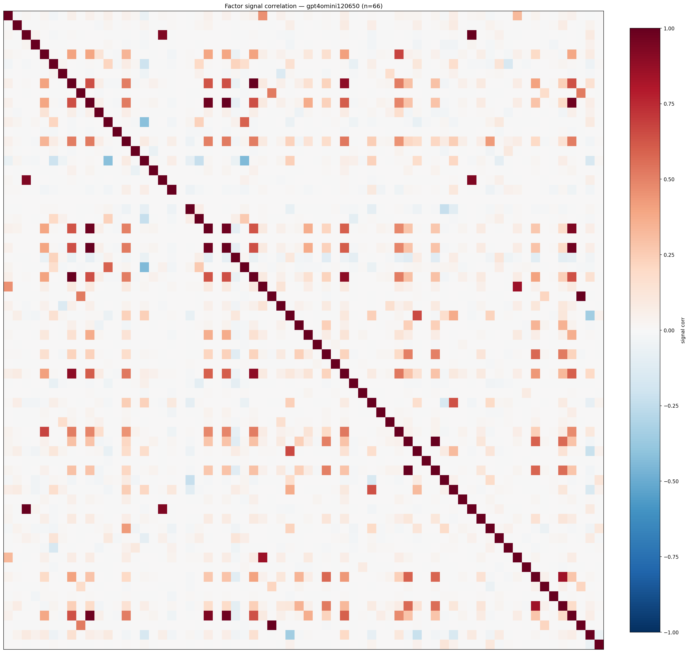

*Signal correlation matrix — gpt4omini120650*

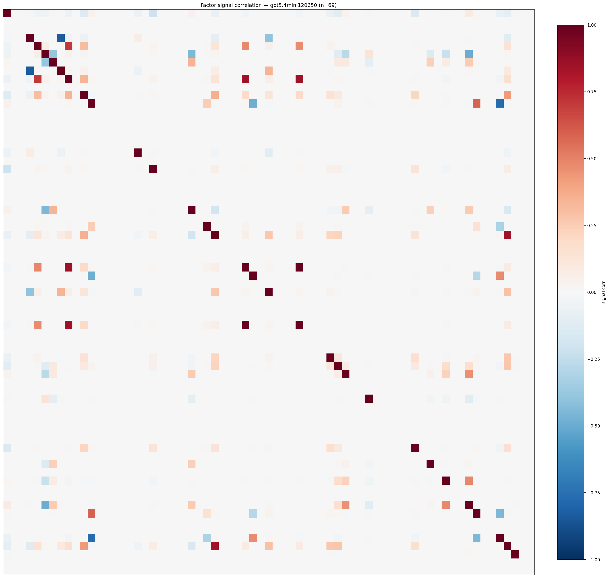

*Signal correlation matrix — gpt5.4mini120650*

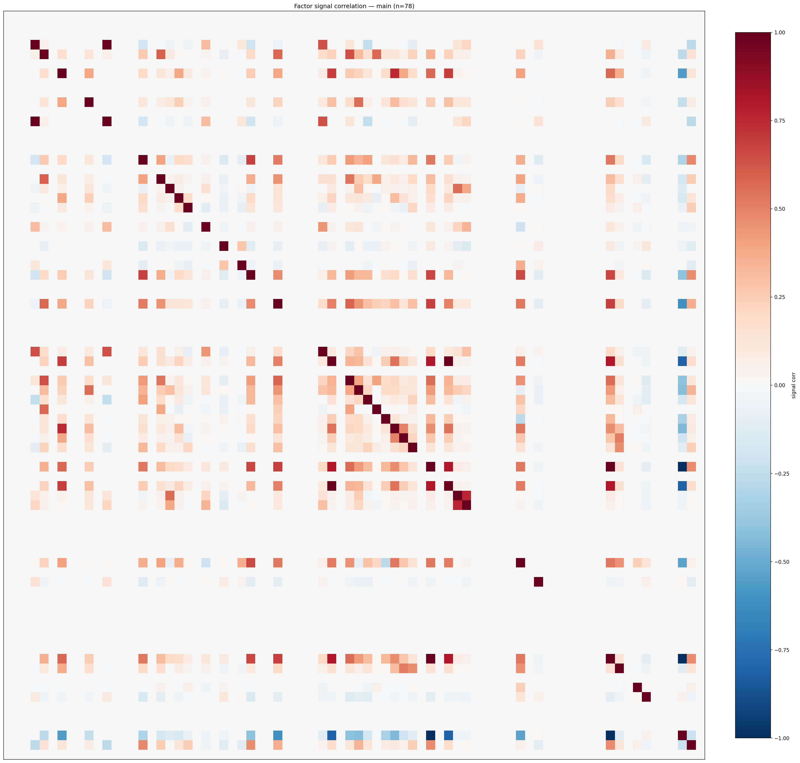

*Signal correlation matrix — main*

## 3. Deflation & model-based importance

`deflated_best_ic` haircuts each zoo's best |IC| for the number of factors tried (`ic_n_tested`) — a bigger zoo's best factor is more likely to be lucky. `lasso_n_nonzero` / `lasso_sparsity` show how many factors a sparse linear model actually keeps (model-view redundancy).

| prerun | best_ic | deflated_best_ic | deflated_best_t | ic_n_tested | ic_n_obs | lasso_n_nonzero | lasso_sparsity |
| --- | --- | --- | --- | --- | --- | --- | --- |
| gpt4omini120650 | 0.0994 | 0.0917 | 34.6629 | 64 | 142738 | 6 | 0.9091 |
| gpt5.4mini120650 | 0.0882 | 0.0813 | 30.7167 | 31 | 142738 | 12 | 0.8261 |
| main | 0.0568 | 0.0497 | 18.7613 | 38 | 142738 | 3 | 0.9615 |

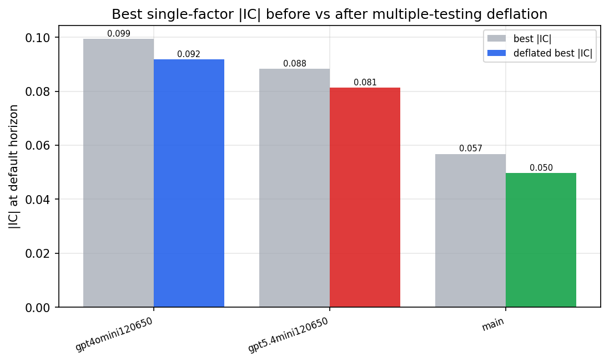

*Best |IC| before vs after multiple-testing deflation*

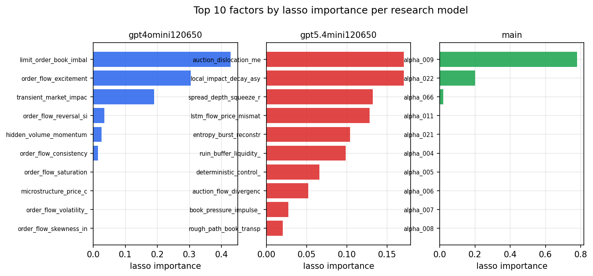

*Top factors by lasso importance per zoo*

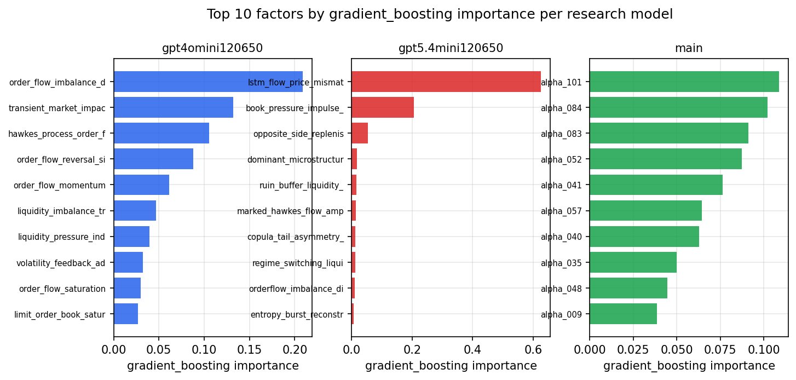

*Top factors by gradient_boosting importance per zoo*

## 4. ML-combined signal — per-underlying vectorised backtest

Each model combines a prerun's factors into ONE signal (fit `factors → forward return` on IS, predict per (bar, underlying)), then that combined signal is run through a simple vectorised backtest — `position(signal) × the underlying's own forward return` — on the held-out OOS tail (+ an equal-weight ensemble). No cross-sectional ranking.

> Config: position=**threshold** (t=1.0, z-score `expanding`), aggregation=**portfolio**, fit-standardise=**per_underlying**, horizon=6.

| prerun | model | n_factors_used | oos_ic | oos_sharpe | is_sharpe | oos_ann_return | oos_max_drawdown |
| --- | --- | --- | --- | --- | --- | --- | --- |
| gpt4omini120650 | linear_regression | 66 | 0.0958 | 24.7175 | 17.67 | 0.4109 | -0.0011 |
| gpt4omini120650 | ridge | 66 | 0.1006 | 25.9178 | 18.0782 | 0.4263 | -0.0011 |
| gpt4omini120650 | lasso | 66 | 0.1251 | 60.7582 | 35.7136 | 0.5738 | -0.0009 |
| gpt4omini120650 | elastic_net | 66 | 0.125 | 61.3784 | 38.1223 | 0.5685 | -0.001 |
| gpt4omini120650 | random_forest | 66 | 0.1025 | 11.2089 | 11.9746 | 0.1259 | -0.001 |
| gpt4omini120650 | gradient_boosting | 66 | 0.1092 | 4.1436 | 11.4065 | 0.0259 | -0.001 |
| gpt4omini120650 | xgboost | 66 | 0.1123 | 7.6294 | 14.3397 | 0.1313 | -0.0013 |
| gpt4omini120650 | lightgbm | 66 | 0.1196 | 6.3942 | 16.4422 | 0.0916 | -0.0013 |
| gpt4omini120650 | ensemble | 66 | 0.1221 | 29.8041 | 19.2598 | 0.4925 | -0.0014 |
| gpt5.4mini120650 | linear_regression | 69 | 0.088 | -0.9041 | 8.7765 | -0.0058 | -0.0014 |
| gpt5.4mini120650 | ridge | 69 | 0.0884 | -0.9678 | 9.3436 | -0.0065 | -0.0015 |
| gpt5.4mini120650 | lasso | 69 | 0.0928 | 21.8172 | 14.866 | 0.3459 | -0.0028 |
| gpt5.4mini120650 | elastic_net | 69 | 0.0926 | 19.1676 | 12.4058 | 0.2893 | -0.0028 |
| gpt5.4mini120650 | random_forest | 69 | 0.1403 | 33.5462 | 23.2629 | 0.5895 | -0.002 |
| gpt5.4mini120650 | gradient_boosting | 69 | 0.1334 | 1.9155 | 9.3534 | 0.014 | -0.0019 |
| gpt5.4mini120650 | xgboost | 69 | 0.1497 | 17.3419 | 14.3629 | 0.1794 | -0.0011 |
| gpt5.4mini120650 | lightgbm | 69 | 0.1706 | 5.49 | 17.7575 | 0.0349 | -0.0011 |
| gpt5.4mini120650 | ensemble | 69 | 0.1309 | 19.9109 | 18.5942 | 0.3149 | -0.0029 |
| main | linear_regression | 78 | 0.0193 | -1.1852 | 4.3031 | -0.0064 | -0.0015 |
| main | ridge | 78 | 0.0247 | 1.1947 | 3.7398 | 0.0068 | -0.0012 |
| main | lasso | 78 | 0.0413 | 0.8239 | 4.5962 | 0.0062 | -0.0021 |
| main | elastic_net | 78 | 0.0406 | 0.8373 | 4.5433 | 0.0063 | -0.0022 |
| main | random_forest | 78 | 0.0476 | 0.1234 | 10.4894 | 0.0007 | -0.0018 |
| main | gradient_boosting | 78 | 0.0368 | -0.9721 | 10.7495 | -0.0017 | -0.0005 |
| main | xgboost | 78 | 0.0219 | -2.6173 | 14.6114 | -0.0062 | -0.0007 |
| main | lightgbm | 78 | 0.0345 | -1.4006 | 20.1276 | -0.0059 | -0.0017 |
| main | ensemble | 78 | 0.0376 | -4.2537 | 14.989 | -0.0265 | -0.0029 |

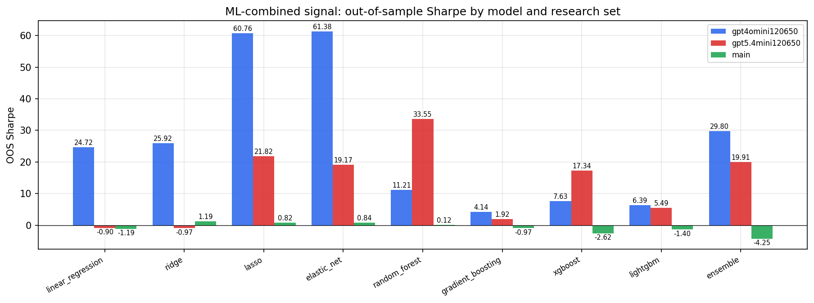

*ML-combined OOS Sharpe by model and research set*

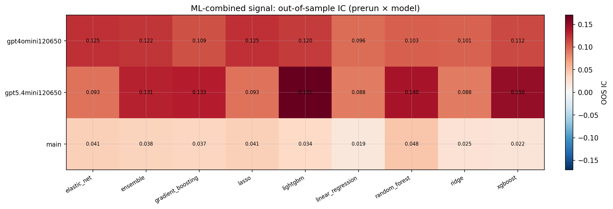

*ML-combined OOS IC (prerun × model)*

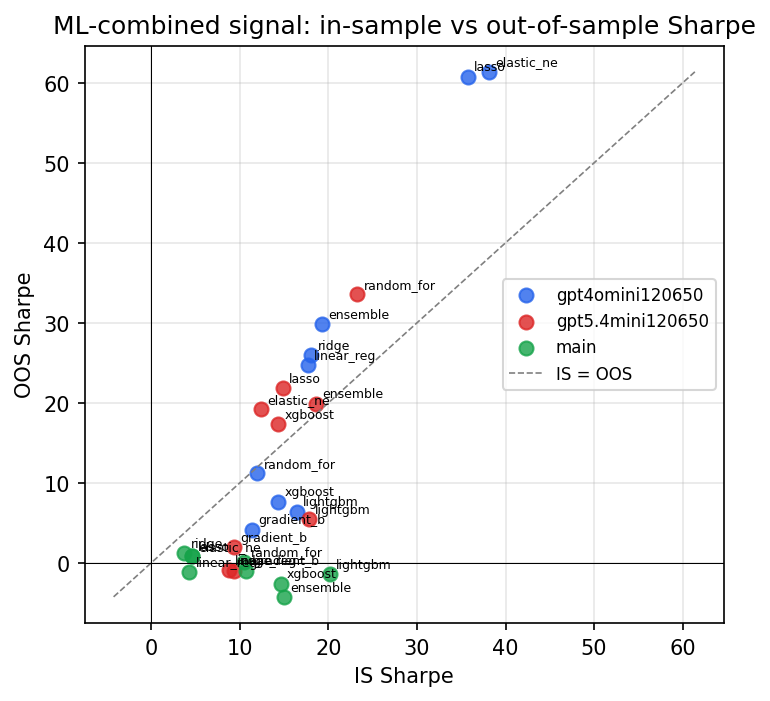

*IS vs OOS Sharpe (overfitting diagnostic)*

---
*Generated by `run_model_comparison.py`. Tables: `*.csv`; interactive: `comparison.ipynb`.*
