# Research-LLM factor comparison — `2025-07`

Comparing the **factor output of different research LLMs** on three axes (raw factor quality → factors as ML features → factors through the full agentic fund). The panel, IS/OOS split, horizon and model hyper-parameters are held identical across preruns — the *only* variable is the factor set.

## Preruns compared

| prerun | research_model | usable_factors | dropped_factors |
| --- | --- | --- | --- |
| gpt4omini120650 | gpt-4o-mini | 66 | 0 |
| gpt5.4mini120650 | gpt-5.4-mini | 69 | 0 |
| main | seed library | 78 | 10 |

> Dropped factors declare fields the current data doesn't have yet (e.g. fundamentals); they light up unchanged once that data is downloaded.

*Usable vs awaiting-data factors per research model*

## Key findings

- **Best ML-combined OOS Sharpe:** `gpt4omini120650` with `random_forest` (OOS Sharpe = 42.707).
- **Mean OOS Sharpe across models, by research set:** `gpt4omini120650` = 29.461, `gpt5.4mini120650` = 22.541, `main` = 13.524.
- **Highest mean single-factor |IC| (h=6):** `main` (mean |IC| = 0.0415).
- **Most diverse zoo (highest effective/raw factor ratio):** `gpt5.4mini120650` (eff 53.4 of 69, ratio 0.77).
- **Best selection-deflated single-factor |IC|:** `main` (deflated |IC| = 0.4228 from 37 factors tried).

## 1. Single-factor IC (raw factor quality)

Per-underlying time-series Spearman rank-IC of every researched factor, recomputed on the shared panel at horizons h=1, h=6, h=60. The per-underlying IC correlates each factor's value vector with the underlying's own forward-return vector (pooled across underlyings); the cross-sectional IC ranks across underlyings per timestamp.

| prerun | n_factors | mean_abs_ic_1 | mean_abs_ic_6 | mean_abs_ic_60 | mean_abs_icir_6 | best_factor_h6 | best_abs_ic_h6 |
| --- | --- | --- | --- | --- | --- | --- | --- |
| gpt4omini120650 | 66 | 0.029 | 0.0205 | 0.0106 | 1.1161 | limit_order_book_imbalance_surge | 0.1242 |
| gpt5.4mini120650 | 69 | 0.0256 | 0.0212 | 0.0096 | 1.2284 | orderflow_imbalance_divergence | 0.1081 |
| main | 78 | 0.0403 | 0.0415 | 0.0123 | 1.5921 | alpha_066 | 0.4299 |

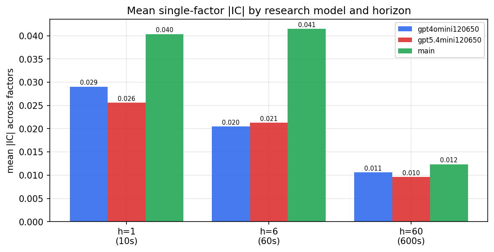

*Mean |IC| by research model and horizon*

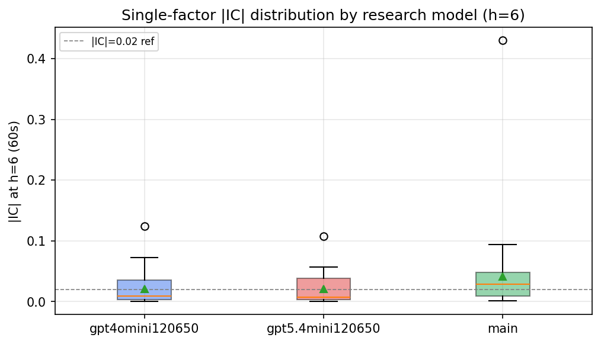

*Per-factor |IC| distribution by research model*

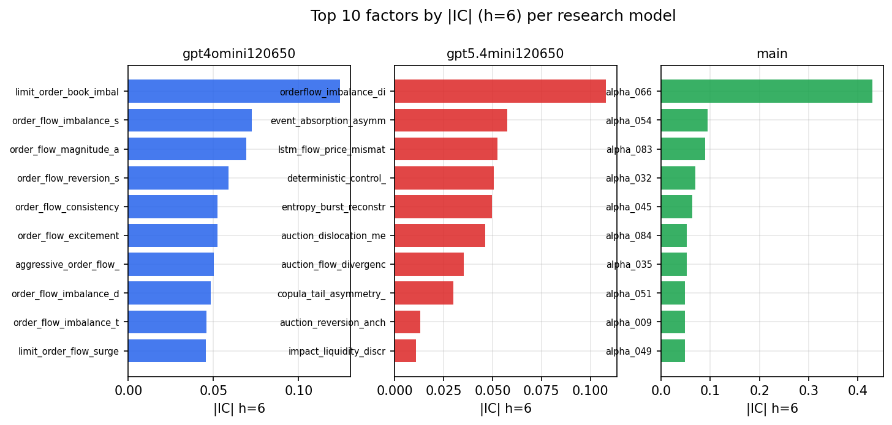

*Top factors by |IC| per research model*

## 2. Factor diversity & redundancy

Pairwise correlation of each zoo's *signals*. `eff_n_factors` is the effective number of independent factors (participation ratio of the correlation eigenvalues); `eff_ratio` and `redundancy` summarise how much unique information the zoo holds vs. how much is duplicated; `n_clusters` groups factors at |corr| ≥ 0.7.

| prerun | n_factors | eff_n_factors | eff_ratio | mean_abs_corr | n_clusters | redundancy |
| --- | --- | --- | --- | --- | --- | --- |
| gpt4omini120650 | 66 | 29.2921 | 0.4438 | 0.046 | 53 | 0.5562 |
| gpt5.4mini120650 | 69 | 53.3673 | 0.7734 | 0.0122 | 65 | 0.2266 |
| main | 78 | 33.3972 | 0.4282 | 0.0427 | 62 | 0.5718 |

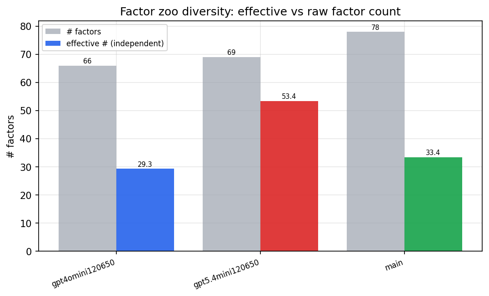

*Effective vs raw factor count per research model*

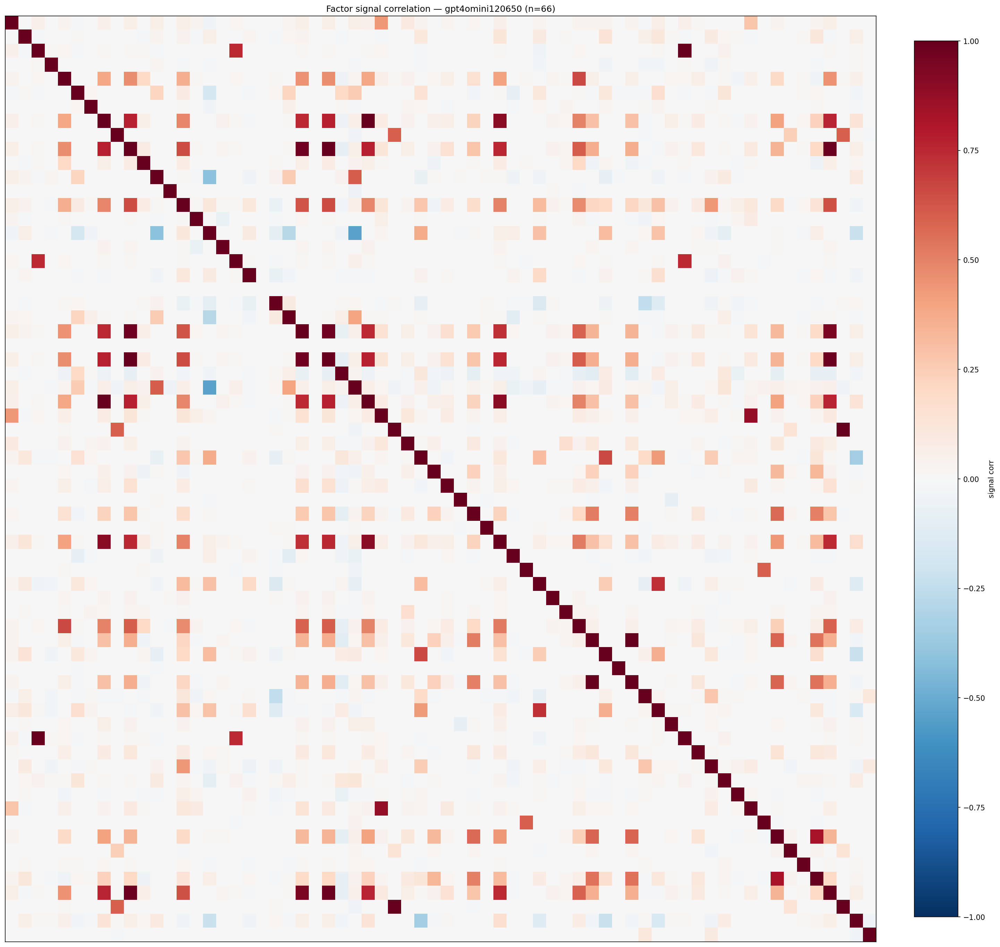

*Signal correlation matrix — gpt4omini120650*

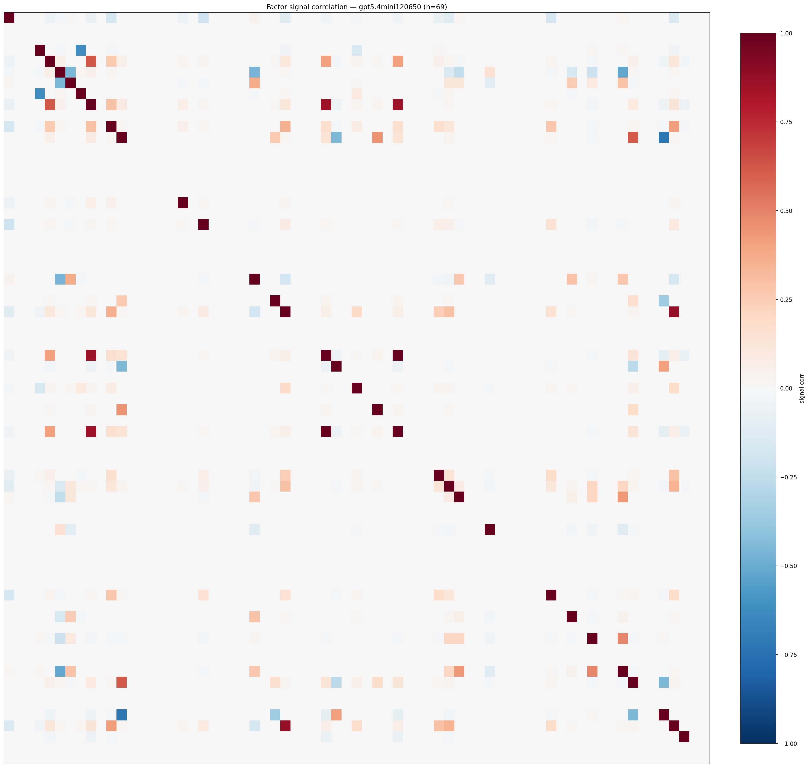

*Signal correlation matrix — gpt5.4mini120650*

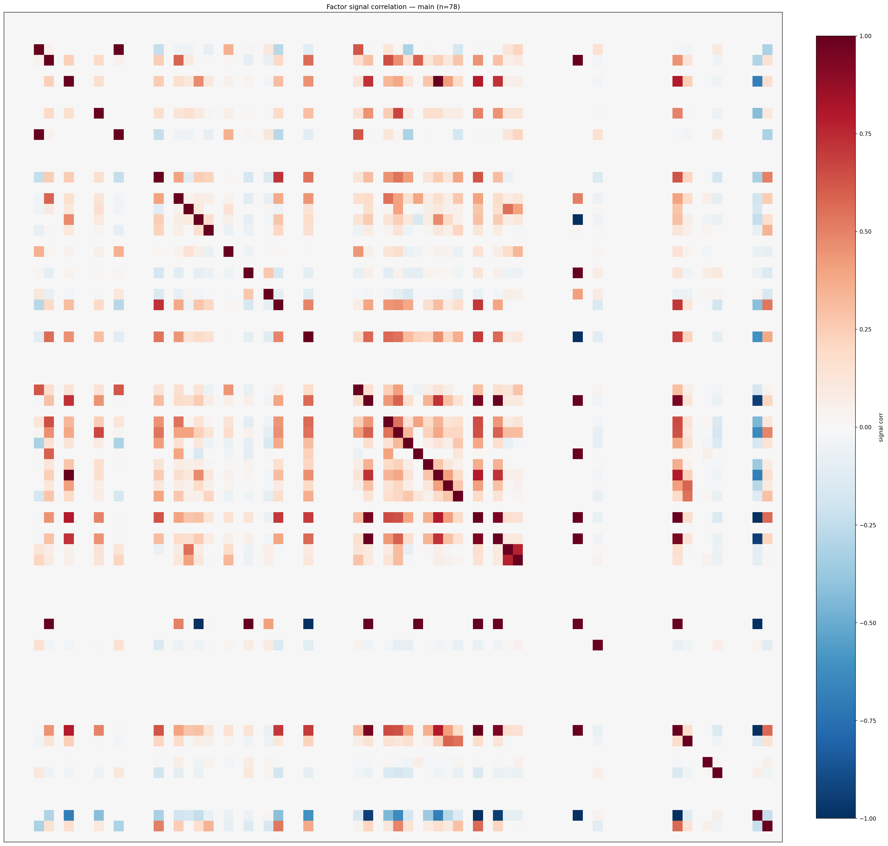

*Signal correlation matrix — main*

## 3. Deflation & model-based importance

`deflated_best_ic` haircuts each zoo's best |IC| for the number of factors tried (`ic_n_tested`) — a bigger zoo's best factor is more likely to be lucky. `lasso_n_nonzero` / `lasso_sparsity` show how many factors a sparse linear model actually keeps (model-view redundancy).

| prerun | best_ic | deflated_best_ic | deflated_best_t | ic_n_tested | ic_n_obs | lasso_n_nonzero | lasso_sparsity |
| --- | --- | --- | --- | --- | --- | --- | --- |
| gpt4omini120650 | 0.1242 | 0.1166 | 44.2309 | 64 | 143999 | 11 | 0.8333 |
| gpt5.4mini120650 | 0.1081 | 0.1014 | 38.4876 | 24 | 143999 | 0 | 1.0 |
| main | 0.4299 | 0.4228 | 160.4458 | 37 | 143999 | 3 | 0.9615 |

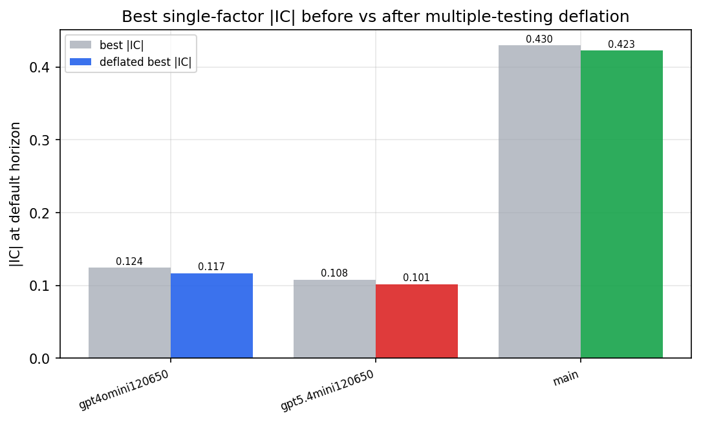

*Best |IC| before vs after multiple-testing deflation*

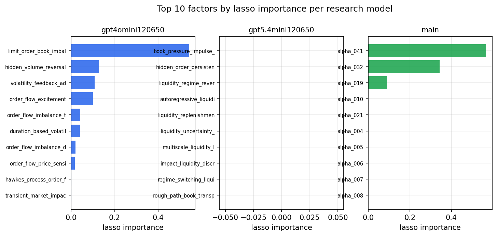

*Top factors by lasso importance per zoo*

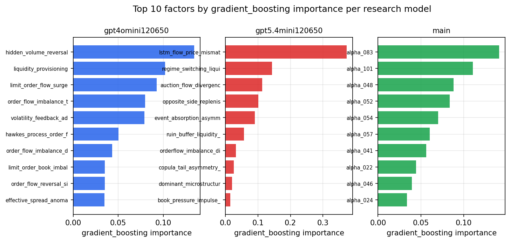

*Top factors by gradient_boosting importance per zoo*

## 4. ML-combined signal — per-underlying vectorised backtest

Each model combines a prerun's factors into ONE signal (fit `factors → forward return` on IS, predict per (bar, underlying)), then that combined signal is run through a simple vectorised backtest — `position(signal) × the underlying's own forward return` — on the held-out OOS tail (+ an equal-weight ensemble). No cross-sectional ranking.

> Config: position=**threshold** (t=1.0, z-score `expanding`), aggregation=**portfolio**, fit-standardise=**per_underlying**, horizon=6.

| prerun | model | n_factors_used | oos_ic | oos_sharpe | is_sharpe | oos_ann_return | oos_max_drawdown |
| --- | --- | --- | --- | --- | --- | --- | --- |
| gpt4omini120650 | linear_regression | 66 | 0.131 | 34.7896 | 27.207 | 0.5663 | -0.0009 |
| gpt4omini120650 | ridge | 66 | 0.1357 | 40.347 | 28.5666 | 0.5518 | -0.0011 |
| gpt4omini120650 | lasso | 66 | 0.1402 | 41.7449 | 46.4591 | 0.568 | -0.0019 |
| gpt4omini120650 | elastic_net | 66 | 0.1402 | 41.7449 | 46.4591 | 0.568 | -0.0019 |
| gpt4omini120650 | random_forest | 66 | 0.1486 | 42.7074 | 38.7884 | 0.7115 | -0.0024 |
| gpt4omini120650 | gradient_boosting | 66 | 0.1303 | 0.95 | 12.5082 | 0.0062 | -0.0022 |
| gpt4omini120650 | xgboost | 66 | 0.1434 | 14.6697 | 19.8533 | 0.1331 | -0.0012 |
| gpt4omini120650 | lightgbm | 66 | 0.1543 | 7.0085 | 17.4629 | 0.08 | -0.0016 |
| gpt4omini120650 | ensemble | 66 | 0.1473 | 41.1864 | 29.843 | 0.578 | -0.0019 |
| gpt5.4mini120650 | linear_regression | 69 | 0.123 | 21.8663 | 15.864 | 0.3905 | -0.0024 |
| gpt5.4mini120650 | ridge | 69 | 0.1204 | 19.9696 | 15.6528 | 0.3816 | -0.003 |
| gpt5.4mini120650 | lasso | 69 | 0.1159 | 24.8156 | 20.9042 | 0.461 | -0.0015 |
| gpt5.4mini120650 | elastic_net | 69 | 0.1159 | 24.8156 | 20.9042 | 0.461 | -0.0015 |
| gpt5.4mini120650 | random_forest | 69 | 0.1474 | 40.9462 | 39.3205 | 0.6801 | -0.0017 |
| gpt5.4mini120650 | gradient_boosting | 69 | 0.1367 | 1.9738 | 11.9021 | 0.0149 | -0.0018 |
| gpt5.4mini120650 | xgboost | 69 | 0.1616 | 21.3708 | 29.4771 | 0.3343 | -0.0025 |
| gpt5.4mini120650 | lightgbm | 69 | 0.1749 | 11.7403 | 21.7803 | 0.176 | -0.0023 |
| gpt5.4mini120650 | ensemble | 69 | 0.1571 | 35.3694 | 33.3347 | 0.5937 | -0.0024 |
| main | linear_regression | 78 | 0.056 | 15.4513 | 15.1332 | 0.2439 | -0.0016 |
| main | ridge | 78 | 0.0606 | 16.5089 | 14.7266 | 0.255 | -0.0014 |
| main | lasso | 78 | 0.0754 | 19.4624 | 14.2341 | 0.2074 | -0.0015 |
| main | elastic_net | 78 | 0.0757 | 16.8768 | 14.4259 | 0.2025 | -0.0022 |
| main | random_forest | 78 | 0.0676 | 16.7417 | 17.3176 | 0.2954 | -0.0017 |
| main | gradient_boosting | 78 | 0.0664 | 3.5165 | 12.2197 | 0.0201 | -0.0005 |
| main | xgboost | 78 | 0.0618 | 7.8865 | 13.7743 | 0.0566 | -0.0008 |
| main | lightgbm | 78 | 0.0619 | 6.646 | 14.4617 | 0.0552 | -0.001 |
| main | ensemble | 78 | 0.0679 | 18.6215 | 18.0963 | 0.284 | -0.0013 |

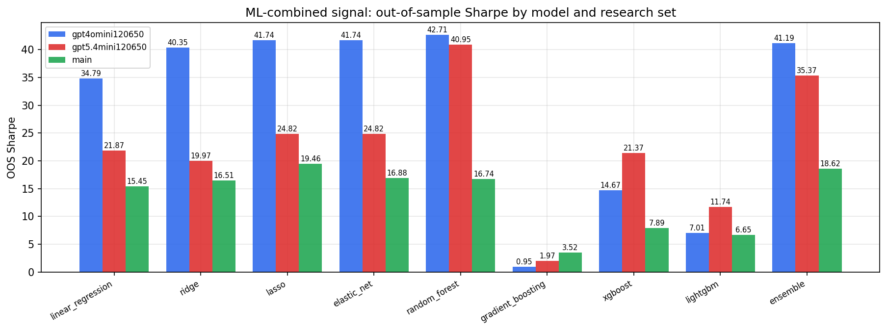

*ML-combined OOS Sharpe by model and research set*

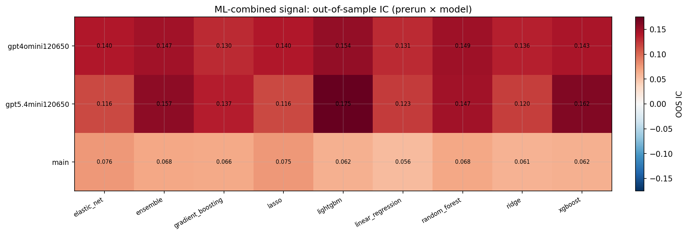

*ML-combined OOS IC (prerun × model)*

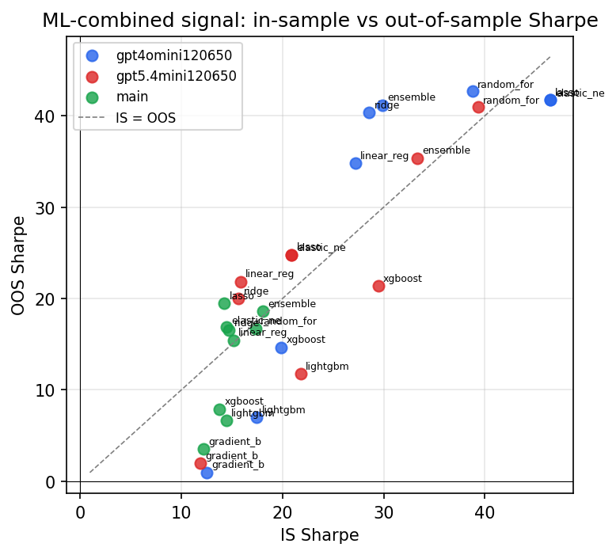

*IS vs OOS Sharpe (overfitting diagnostic)*

---
*Generated by `run_model_comparison.py`. Tables: `*.csv`; interactive: `comparison.ipynb`.*
