# Research-LLM factor comparison — `2025-08`

Comparing the **factor output of different research LLMs** on three axes (raw factor quality → factors as ML features → factors through the full agentic fund). The panel, IS/OOS split, horizon and model hyper-parameters are held identical across preruns — the *only* variable is the factor set.

## Preruns compared

| prerun | research_model | usable_factors | dropped_factors |
| --- | --- | --- | --- |
| gpt4omini120650 | gpt-4o-mini | 66 | 0 |
| gpt5.4mini120650 | gpt-5.4-mini | 69 | 0 |
| main | seed library | 78 | 10 |

> Dropped factors declare fields the current data doesn't have yet (e.g. fundamentals); they light up unchanged once that data is downloaded.

*Usable vs awaiting-data factors per research model*

## Key findings

- **Best ML-combined OOS Sharpe:** `gpt4omini120650` with `random_forest` (OOS Sharpe = 50.552).
- **Mean OOS Sharpe across models, by research set:** `gpt4omini120650` = 28.553, `gpt5.4mini120650` = 14.433, `main` = 12.996.
- **Highest mean single-factor |IC| (h=6):** `main` (mean |IC| = 0.0344).
- **Most diverse zoo (highest effective/raw factor ratio):** `gpt5.4mini120650` (eff 53.4 of 69, ratio 0.77).
- **Best selection-deflated single-factor |IC|:** `gpt4omini120650` (deflated |IC| = 0.1162 from 64 factors tried).

## 1. Single-factor IC (raw factor quality)

Per-underlying time-series Spearman rank-IC of every researched factor, recomputed on the shared panel at horizons h=1, h=6, h=60. The per-underlying IC correlates each factor's value vector with the underlying's own forward-return vector (pooled across underlyings); the cross-sectional IC ranks across underlyings per timestamp.

| prerun | n_factors | mean_abs_ic_1 | mean_abs_ic_6 | mean_abs_ic_60 | mean_abs_icir_6 | best_factor_h6 | best_abs_ic_h6 |
| --- | --- | --- | --- | --- | --- | --- | --- |
| gpt4omini120650 | 66 | 0.0282 | 0.022 | 0.0115 | 1.1223 | limit_order_book_imbalance_surge | 0.1238 |
| gpt5.4mini120650 | 69 | 0.02 | 0.0168 | 0.0091 | 1.1489 | orderflow_imbalance_divergence | 0.1181 |
| main | 78 | 0.0332 | 0.0344 | 0.0138 | 1.4983 | alpha_054 | 0.0988 |

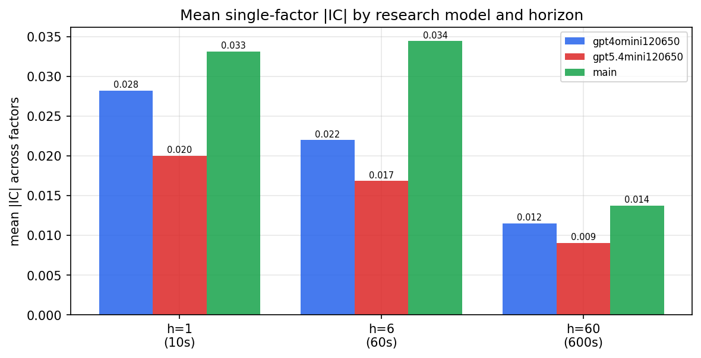

*Mean |IC| by research model and horizon*

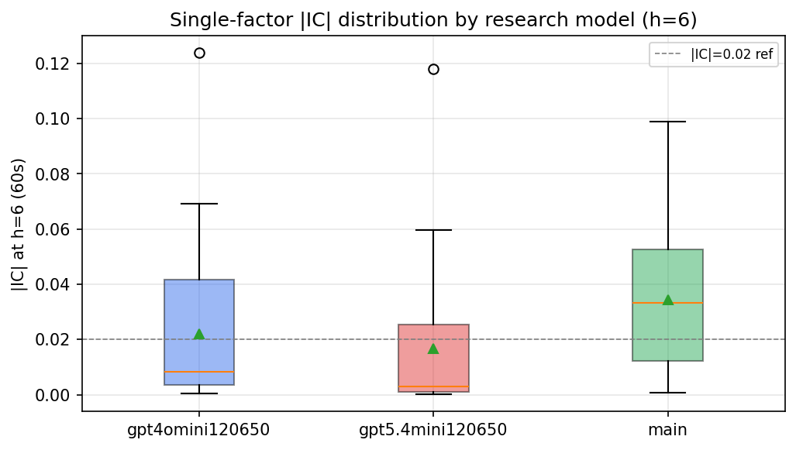

*Per-factor |IC| distribution by research model*

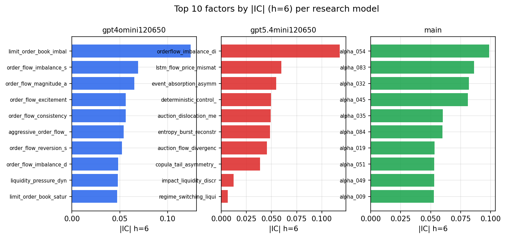

*Top factors by |IC| per research model*

## 2. Factor diversity & redundancy

Pairwise correlation of each zoo's *signals*. `eff_n_factors` is the effective number of independent factors (participation ratio of the correlation eigenvalues); `eff_ratio` and `redundancy` summarise how much unique information the zoo holds vs. how much is duplicated; `n_clusters` groups factors at |corr| ≥ 0.7.

| prerun | n_factors | eff_n_factors | eff_ratio | mean_abs_corr | n_clusters | redundancy |
| --- | --- | --- | --- | --- | --- | --- |
| gpt4omini120650 | 66 | 29.5035 | 0.447 | 0.045 | 52 | 0.553 |
| gpt5.4mini120650 | 69 | 53.3786 | 0.7736 | 0.0119 | 64 | 0.2264 |
| main | 78 | 35.3531 | 0.4532 | 0.0389 | 71 | 0.5468 |

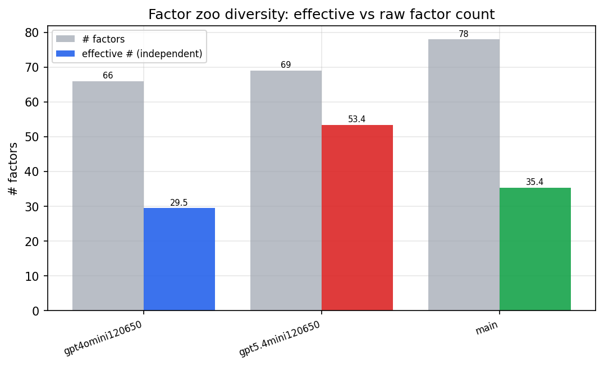

*Effective vs raw factor count per research model*

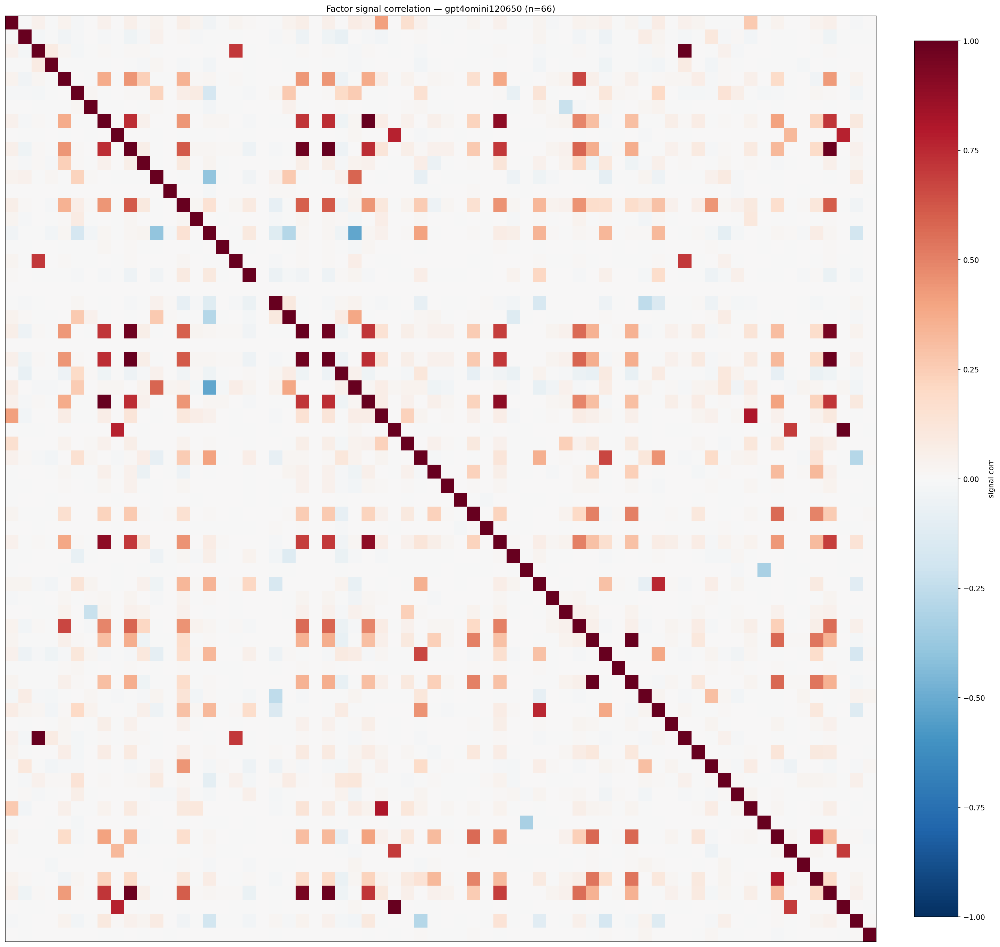

*Signal correlation matrix — gpt4omini120650*

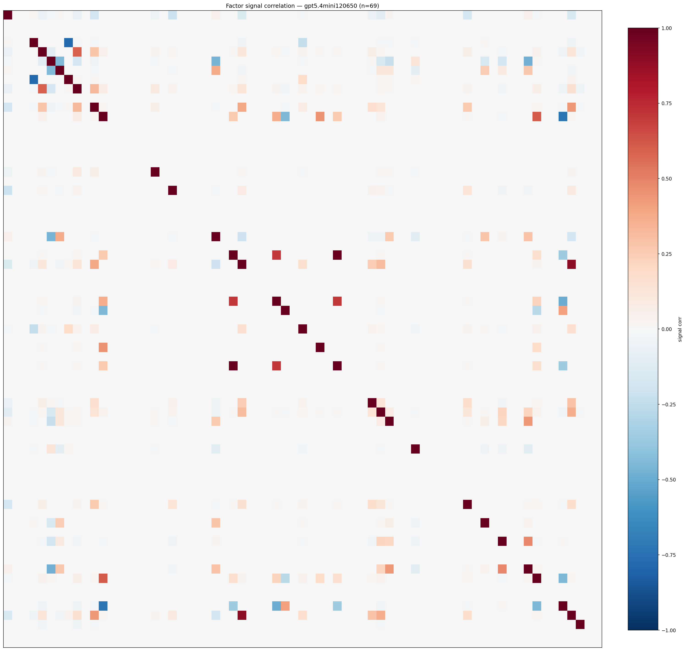

*Signal correlation matrix — gpt5.4mini120650*

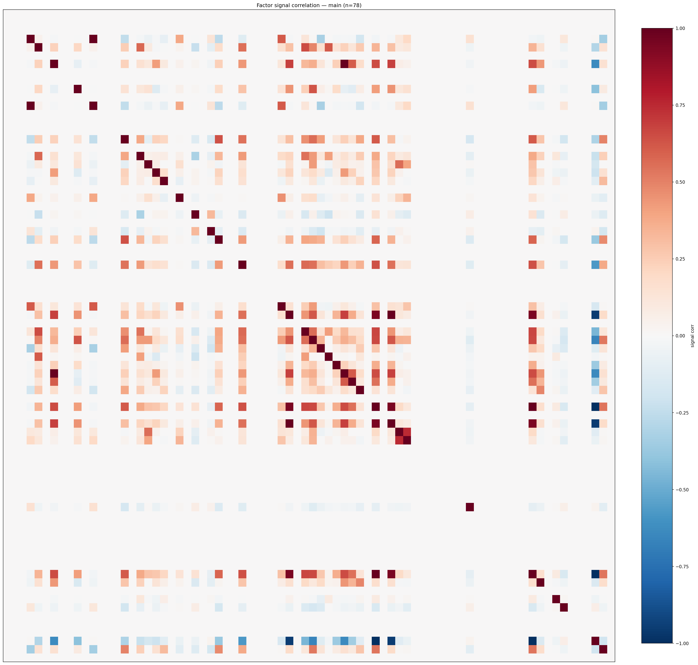

*Signal correlation matrix — main*

## 3. Deflation & model-based importance

`deflated_best_ic` haircuts each zoo's best |IC| for the number of factors tried (`ic_n_tested`) — a bigger zoo's best factor is more likely to be lucky. `lasso_n_nonzero` / `lasso_sparsity` show how many factors a sparse linear model actually keeps (model-view redundancy).

| prerun | best_ic | deflated_best_ic | deflated_best_t | ic_n_tested | ic_n_obs | lasso_n_nonzero | lasso_sparsity |
| --- | --- | --- | --- | --- | --- | --- | --- |
| gpt4omini120650 | 0.1238 | 0.1162 | 44.4594 | 64 | 146339 | 2 | 0.9697 |
| gpt5.4mini120650 | 0.1181 | 0.1112 | 42.545 | 31 | 146339 | 11 | 0.8406 |
| main | 0.0988 | 0.0918 | 35.1101 | 37 | 146339 | 8 | 0.8974 |

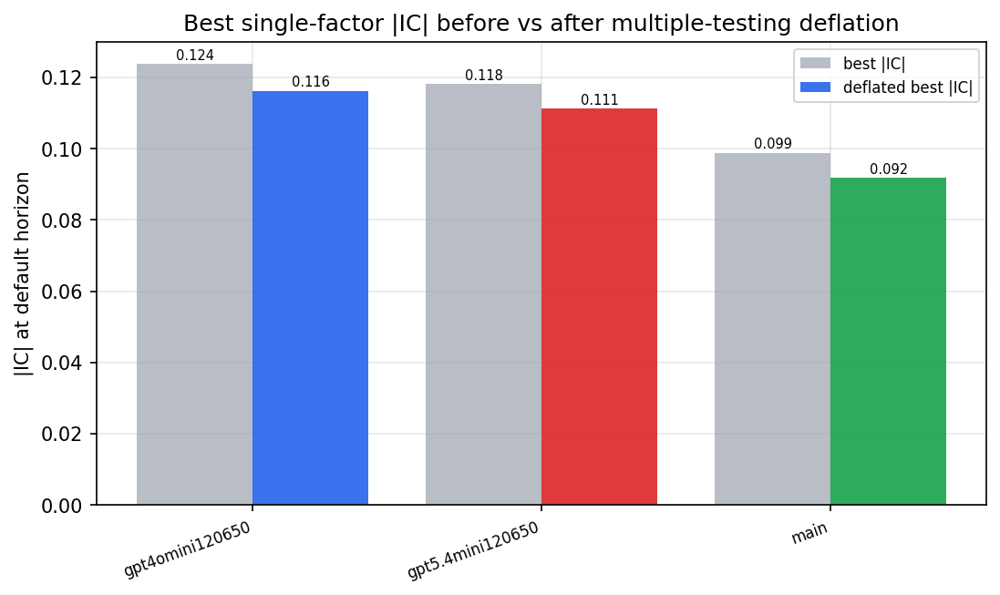

*Best |IC| before vs after multiple-testing deflation*

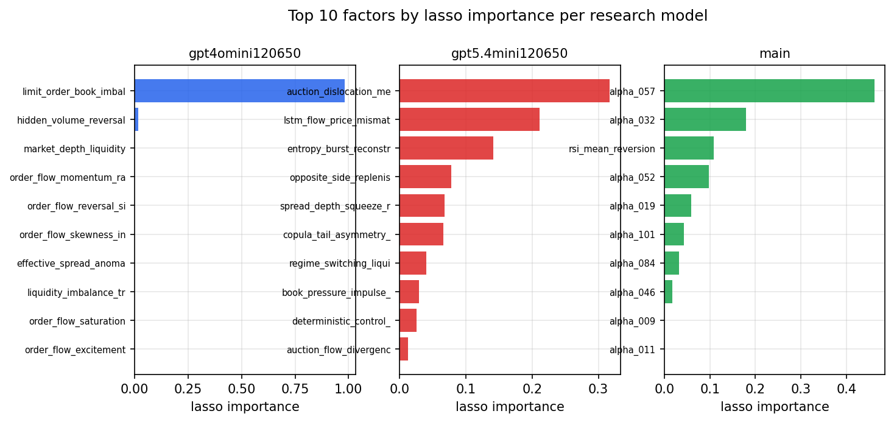

*Top factors by lasso importance per zoo*

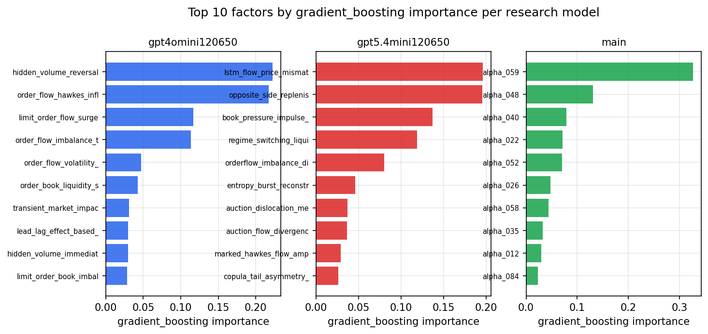

*Top factors by gradient_boosting importance per zoo*

## 4. ML-combined signal — per-underlying vectorised backtest

Each model combines a prerun's factors into ONE signal (fit `factors → forward return` on IS, predict per (bar, underlying)), then that combined signal is run through a simple vectorised backtest — `position(signal) × the underlying's own forward return` — on the held-out OOS tail (+ an equal-weight ensemble). No cross-sectional ranking.

> Config: position=**threshold** (t=1.0, z-score `expanding`), aggregation=**portfolio**, fit-standardise=**per_underlying**, horizon=6.

| prerun | model | n_factors_used | oos_ic | oos_sharpe | is_sharpe | oos_ann_return | oos_max_drawdown |
| --- | --- | --- | --- | --- | --- | --- | --- |
| gpt4omini120650 | linear_regression | 66 | 0.1538 | 40.1736 | 32.7778 | 0.4169 | -0.001 |
| gpt4omini120650 | ridge | 66 | 0.1537 | 39.2866 | 34.2197 | 0.4052 | -0.0013 |
| gpt4omini120650 | lasso | 66 | 0.129 | 44.6356 | 34.1487 | 0.341 | -0.0019 |
| gpt4omini120650 | elastic_net | 66 | 0.129 | 44.6356 | 34.1816 | 0.341 | -0.0019 |
| gpt4omini120650 | random_forest | 66 | 0.1415 | 50.5523 | 34.3597 | 0.5526 | -0.0016 |
| gpt4omini120650 | gradient_boosting | 66 | 0.1197 | 0.0315 | 9.8034 | 0.0002 | -0.0024 |
| gpt4omini120650 | xgboost | 66 | 0.1473 | -1.826 | 16.93 | -0.0211 | -0.0048 |
| gpt4omini120650 | lightgbm | 66 | 0.1568 | -0.6382 | 17.0346 | -0.0082 | -0.0032 |
| gpt4omini120650 | ensemble | 66 | 0.1528 | 40.1275 | 31.414 | 0.3988 | -0.0011 |
| gpt5.4mini120650 | linear_regression | 69 | 0.1413 | 16.883 | 26.9811 | 0.2832 | -0.0032 |
| gpt5.4mini120650 | ridge | 69 | 0.1413 | 16.7775 | 26.9509 | 0.2814 | -0.0032 |
| gpt5.4mini120650 | lasso | 69 | 0.1431 | 16.7331 | 25.6082 | 0.2798 | -0.0032 |
| gpt5.4mini120650 | elastic_net | 69 | 0.1431 | 15.71 | 25.0579 | 0.262 | -0.0032 |
| gpt5.4mini120650 | random_forest | 69 | 0.1574 | 33.1435 | 39.1774 | 0.5505 | -0.0032 |
| gpt5.4mini120650 | gradient_boosting | 69 | 0.1447 | 0.2688 | 11.099 | 0.0019 | -0.0019 |
| gpt5.4mini120650 | xgboost | 69 | 0.1774 | 11.6358 | 26.0258 | 0.1012 | -0.0013 |
| gpt5.4mini120650 | lightgbm | 69 | 0.1807 | 1.683 | 21.2686 | 0.0176 | -0.0025 |
| gpt5.4mini120650 | ensemble | 69 | 0.175 | 17.0653 | 28.172 | 0.2898 | -0.0032 |
| main | linear_regression | 78 | 0.0719 | 15.2888 | 18.3618 | 0.2114 | -0.0017 |
| main | ridge | 78 | 0.0742 | 15.8566 | 19.2624 | 0.2209 | -0.0017 |
| main | lasso | 78 | 0.0878 | 13.1798 | 15.4683 | 0.1592 | -0.0027 |
| main | elastic_net | 78 | 0.088 | 12.9954 | 15.2199 | 0.1576 | -0.0027 |
| main | random_forest | 78 | 0.0738 | 20.9811 | 20.8398 | 0.3051 | -0.0016 |
| main | gradient_boosting | 78 | 0.0754 | 4.4812 | 12.6792 | 0.047 | -0.0012 |
| main | xgboost | 78 | 0.0716 | 9.558 | 17.3747 | 0.0741 | -0.001 |
| main | lightgbm | 78 | 0.0582 | 7.0901 | 19.2168 | 0.081 | -0.0014 |
| main | ensemble | 78 | 0.0812 | 17.5322 | 20.0378 | 0.277 | -0.0013 |

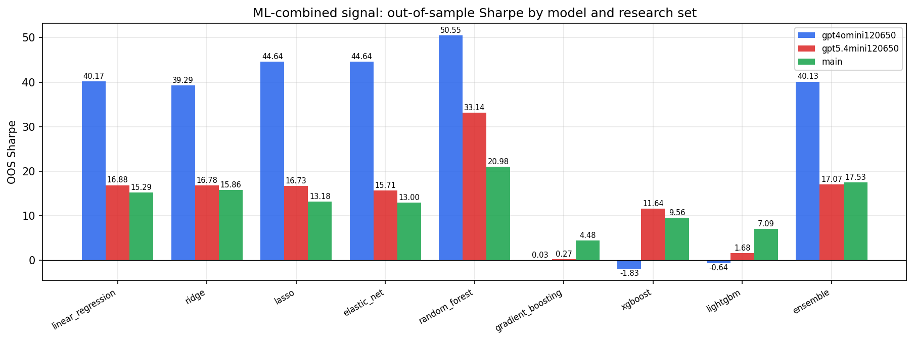

*ML-combined OOS Sharpe by model and research set*

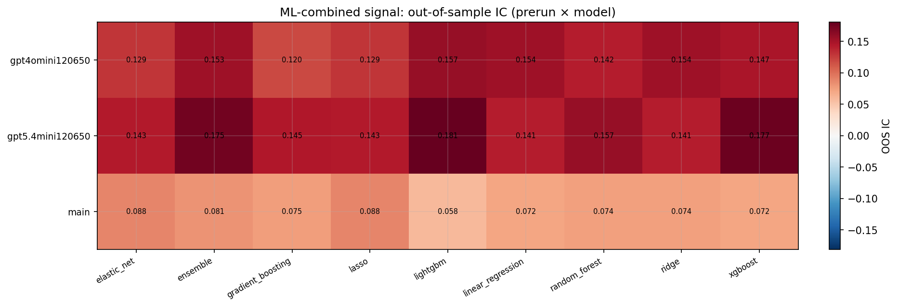

*ML-combined OOS IC (prerun × model)*

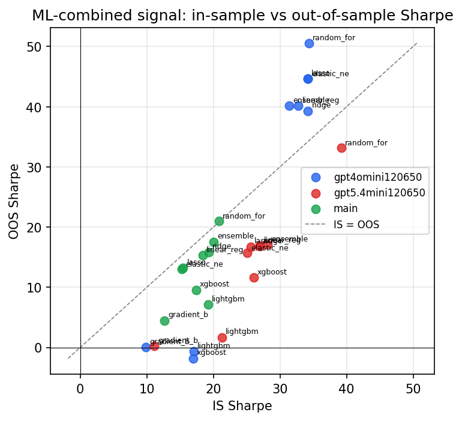

*IS vs OOS Sharpe (overfitting diagnostic)*

---
*Generated by `run_model_comparison.py`. Tables: `*.csv`; interactive: `comparison.ipynb`.*
