# Research-LLM factor comparison — `2025-09`

Comparing the **factor output of different research LLMs** on three axes (raw factor quality → factors as ML features → factors through the full agentic fund). The panel, IS/OOS split, horizon and model hyper-parameters are held identical across preruns — the *only* variable is the factor set.

## Preruns compared

| prerun | research_model | usable_factors | dropped_factors |
| --- | --- | --- | --- |
| gpt4omini120650 | gpt-4o-mini | 66 | 0 |
| gpt5.4mini120650 | gpt-5.4-mini | 69 | 0 |
| main | seed library | 78 | 10 |

> Dropped factors declare fields the current data doesn't have yet (e.g. fundamentals); they light up unchanged once that data is downloaded.

*Usable vs awaiting-data factors per research model*

## Key findings

- **Best ML-combined OOS Sharpe:** `gpt4omini120650` with `elastic_net` (OOS Sharpe = 63.392).
- **Mean OOS Sharpe across models, by research set:** `gpt4omini120650` = 37.824, `gpt5.4mini120650` = 16.590, `main` = 4.462.
- **Highest mean single-factor |IC| (h=6):** `main` (mean |IC| = 0.0347).
- **Most diverse zoo (highest effective/raw factor ratio):** `gpt5.4mini120650` (eff 56.9 of 69, ratio 0.83).
- **Best selection-deflated single-factor |IC|:** `gpt4omini120650` (deflated |IC| = 0.1250 from 64 factors tried).

## 1. Single-factor IC (raw factor quality)

Per-underlying time-series Spearman rank-IC of every researched factor, recomputed on the shared panel at horizons h=1, h=6, h=60. The per-underlying IC correlates each factor's value vector with the underlying's own forward-return vector (pooled across underlyings); the cross-sectional IC ranks across underlyings per timestamp.

| prerun | n_factors | mean_abs_ic_1 | mean_abs_ic_6 | mean_abs_ic_60 | mean_abs_icir_6 | best_factor_h6 | best_abs_ic_h6 |
| --- | --- | --- | --- | --- | --- | --- | --- |
| gpt4omini120650 | 66 | 0.0321 | 0.0275 | 0.0142 | 1.2169 | limit_order_book_imbalance_surge | 0.1324 |
| gpt5.4mini120650 | 69 | 0.0217 | 0.0221 | 0.0108 | 1.3234 | orderflow_imbalance_divergence | 0.123 |
| main | 78 | 0.0326 | 0.0347 | 0.0151 | 1.7608 | alpha_054 | 0.1047 |

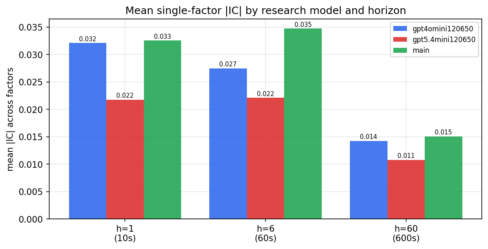

*Mean |IC| by research model and horizon*

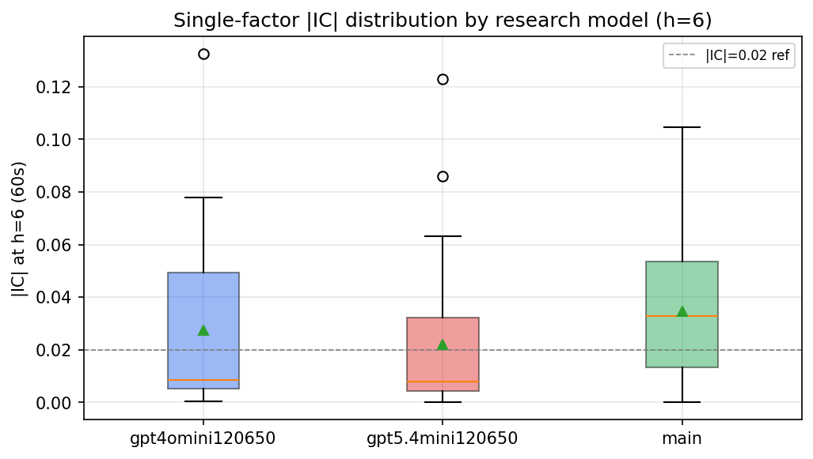

*Per-factor |IC| distribution by research model*

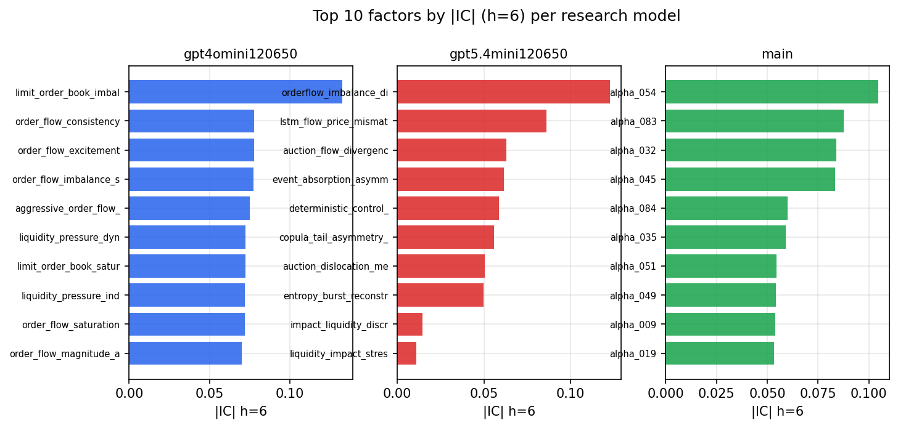

*Top factors by |IC| per research model*

## 2. Factor diversity & redundancy

Pairwise correlation of each zoo's *signals*. `eff_n_factors` is the effective number of independent factors (participation ratio of the correlation eigenvalues); `eff_ratio` and `redundancy` summarise how much unique information the zoo holds vs. how much is duplicated; `n_clusters` groups factors at |corr| ≥ 0.7.

| prerun | n_factors | eff_n_factors | eff_ratio | mean_abs_corr | n_clusters | redundancy |
| --- | --- | --- | --- | --- | --- | --- |
| gpt4omini120650 | 66 | 30.0265 | 0.4549 | 0.0442 | 53 | 0.5451 |
| gpt5.4mini120650 | 69 | 56.934 | 0.8251 | 0.0099 | 66 | 0.1749 |
| main | 78 | 33.8768 | 0.4343 | 0.0439 | 60 | 0.5657 |

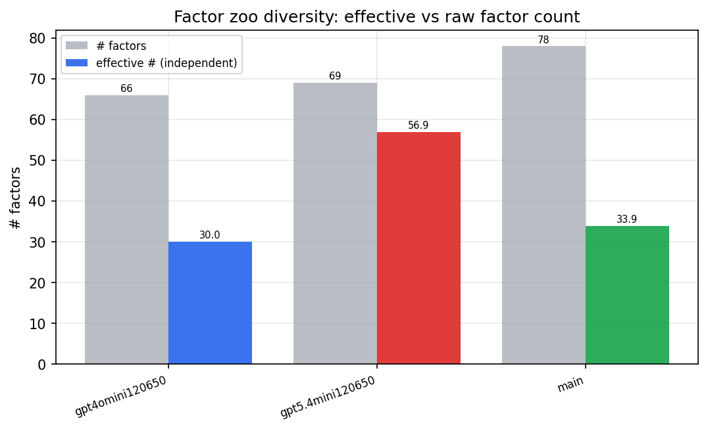

*Effective vs raw factor count per research model*

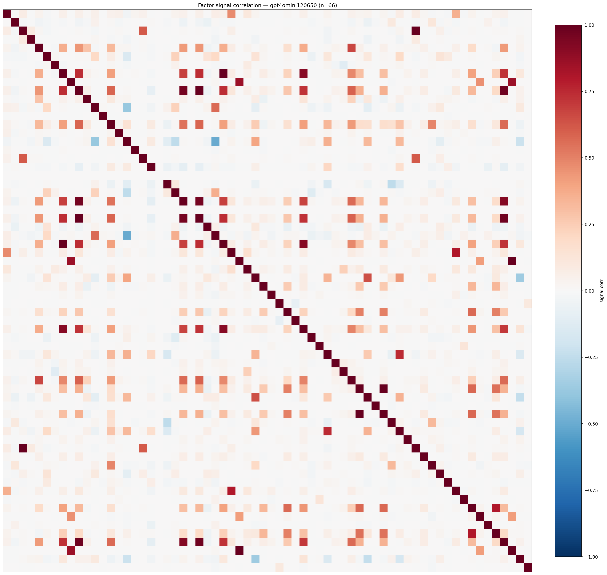

*Signal correlation matrix — gpt4omini120650*

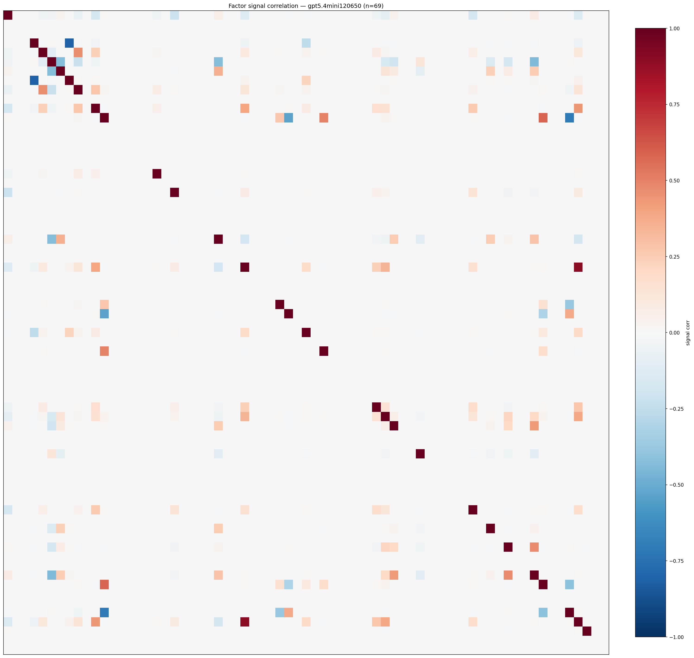

*Signal correlation matrix — gpt5.4mini120650*

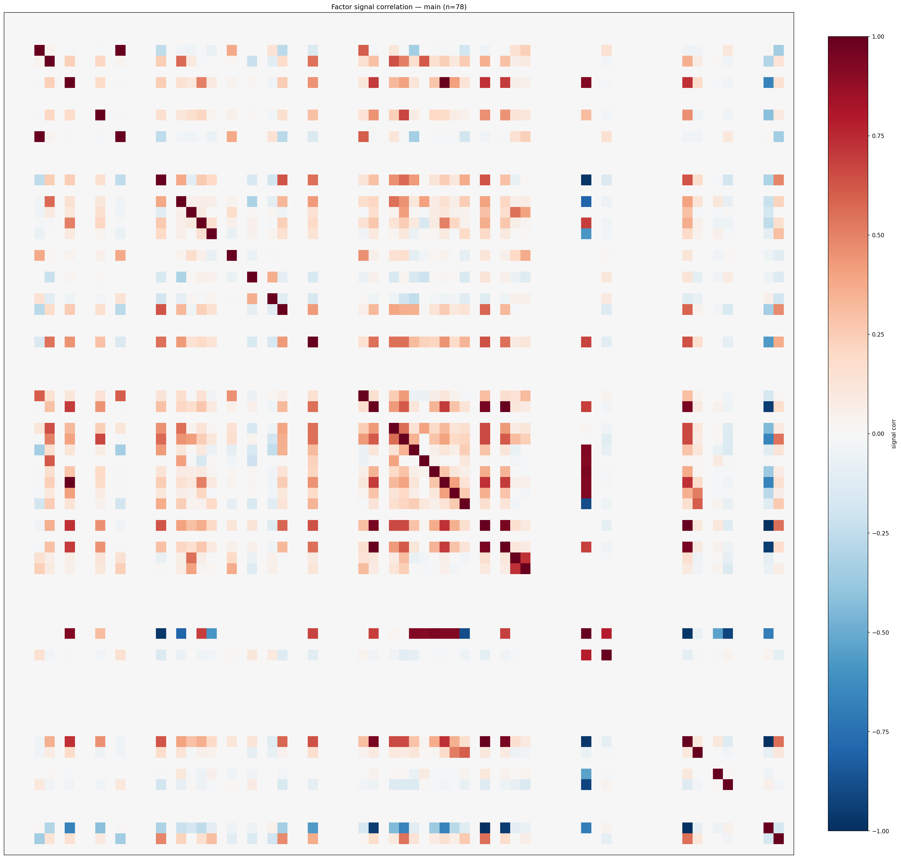

*Signal correlation matrix — main*

## 3. Deflation & model-based importance

`deflated_best_ic` haircuts each zoo's best |IC| for the number of factors tried (`ic_n_tested`) — a bigger zoo's best factor is more likely to be lucky. `lasso_n_nonzero` / `lasso_sparsity` show how many factors a sparse linear model actually keeps (model-view redundancy).

| prerun | best_ic | deflated_best_ic | deflated_best_t | ic_n_tested | ic_n_obs | lasso_n_nonzero | lasso_sparsity |
| --- | --- | --- | --- | --- | --- | --- | --- |
| gpt4omini120650 | 0.1324 | 0.125 | 48.1826 | 64 | 148679 | 40 | 0.3939 |
| gpt5.4mini120650 | 0.123 | 0.1162 | 44.7963 | 31 | 148679 | 9 | 0.8696 |
| main | 0.1047 | 0.0977 | 37.6838 | 37 | 148679 | 4 | 0.9487 |

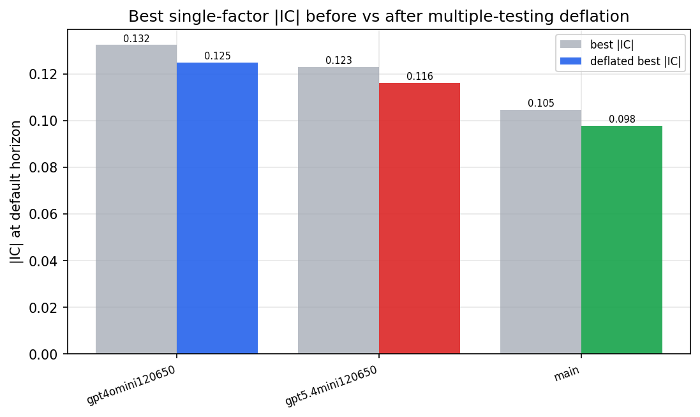

*Best |IC| before vs after multiple-testing deflation*

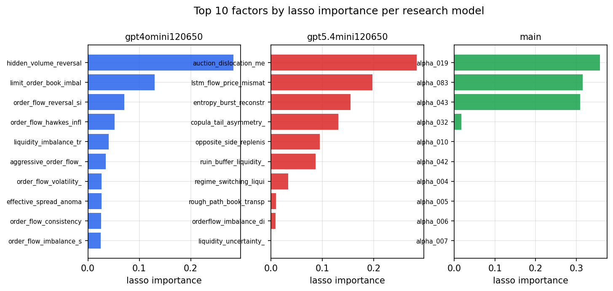

*Top factors by lasso importance per zoo*

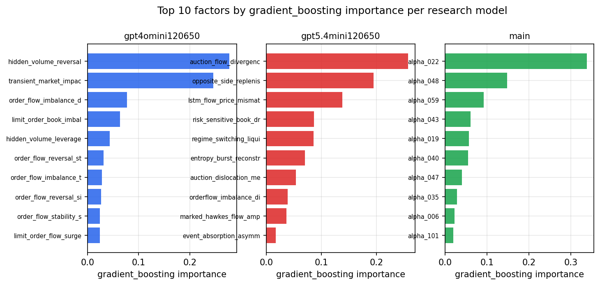

*Top factors by gradient_boosting importance per zoo*

## 4. ML-combined signal — per-underlying vectorised backtest

Each model combines a prerun's factors into ONE signal (fit `factors → forward return` on IS, predict per (bar, underlying)), then that combined signal is run through a simple vectorised backtest — `position(signal) × the underlying's own forward return` — on the held-out OOS tail (+ an equal-weight ensemble). No cross-sectional ranking.

> Config: position=**threshold** (t=1.0, z-score `expanding`), aggregation=**portfolio**, fit-standardise=**per_underlying**, horizon=6.

| prerun | model | n_factors_used | oos_ic | oos_sharpe | is_sharpe | oos_ann_return | oos_max_drawdown |
| --- | --- | --- | --- | --- | --- | --- | --- |
| gpt4omini120650 | linear_regression | 66 | 0.1767 | 47.3346 | 31.0261 | 0.5142 | -0.0011 |
| gpt4omini120650 | ridge | 66 | 0.1783 | 49.0164 | 31.973 | 0.5551 | -0.001 |
| gpt4omini120650 | lasso | 66 | 0.1418 | 58.5357 | 22.8189 | 0.4178 | -0.0005 |
| gpt4omini120650 | elastic_net | 66 | 0.1585 | 63.3918 | 24.9107 | 0.4693 | -0.0004 |
| gpt4omini120650 | random_forest | 66 | 0.1636 | 49.7473 | 34.7498 | 0.7043 | -0.002 |
| gpt4omini120650 | gradient_boosting | 66 | 0.151 | 3.1528 | 12.1179 | 0.0154 | -0.0009 |
| gpt4omini120650 | xgboost | 66 | 0.163 | 6.0892 | 19.1654 | 0.0395 | -0.0018 |
| gpt4omini120650 | lightgbm | 66 | 0.1857 | 5.4072 | 16.9853 | 0.0818 | -0.002 |
| gpt4omini120650 | ensemble | 66 | 0.1727 | 57.7367 | 27.297 | 0.5163 | -0.0012 |
| gpt5.4mini120650 | linear_regression | 69 | 0.1517 | 30.631 | 12.925 | 0.3098 | -0.0016 |
| gpt5.4mini120650 | ridge | 69 | 0.1497 | 22.2535 | 12.1527 | 0.2671 | -0.0021 |
| gpt5.4mini120650 | lasso | 69 | 0.1457 | 16.9421 | 10.332 | 0.1794 | -0.0021 |
| gpt5.4mini120650 | elastic_net | 69 | nan | nan | nan | nan | nan |
| gpt5.4mini120650 | random_forest | 69 | 0.1921 | 53.3925 | 25.4197 | 0.6704 | -0.0019 |
| gpt5.4mini120650 | gradient_boosting | 69 | 0.1672 | -2.8326 | 7.6999 | -0.0186 | -0.0024 |
| gpt5.4mini120650 | xgboost | 69 | 0.2057 | -3.063 | 15.9288 | -0.0254 | -0.0042 |
| gpt5.4mini120650 | lightgbm | 69 | 0.2108 | 1.9691 | 14.7806 | 0.0202 | -0.0028 |
| gpt5.4mini120650 | ensemble | 69 | 0.1922 | 13.43 | 15.6072 | 0.1081 | -0.0016 |
| main | linear_regression | 78 | 0.0301 | 5.6658 | 17.6715 | 0.0356 | -0.001 |
| main | ridge | 78 | 0.0335 | 8.7166 | 18.4394 | 0.1726 | -0.0031 |
| main | lasso | 78 | 0.0403 | 8.3242 | 18.4614 | 0.2146 | -0.004 |
| main | elastic_net | 78 | 0.0398 | 8.2675 | 18.2497 | 0.2109 | -0.0041 |
| main | random_forest | 78 | 0.0325 | 5.5455 | 17.873 | 0.1056 | -0.0043 |
| main | gradient_boosting | 78 | 0.0213 | 0.038 | 10.0636 | 0.0003 | -0.0025 |
| main | xgboost | 78 | 0.0211 | -3.6607 | 14.5702 | -0.0437 | -0.0063 |
| main | lightgbm | 78 | 0.0297 | 1.3673 | 17.4202 | 0.0165 | -0.0036 |
| main | ensemble | 78 | 0.0373 | 5.8911 | 18.9187 | 0.1217 | -0.0039 |

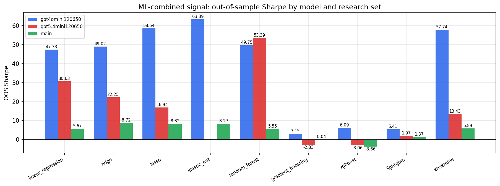

*ML-combined OOS Sharpe by model and research set*

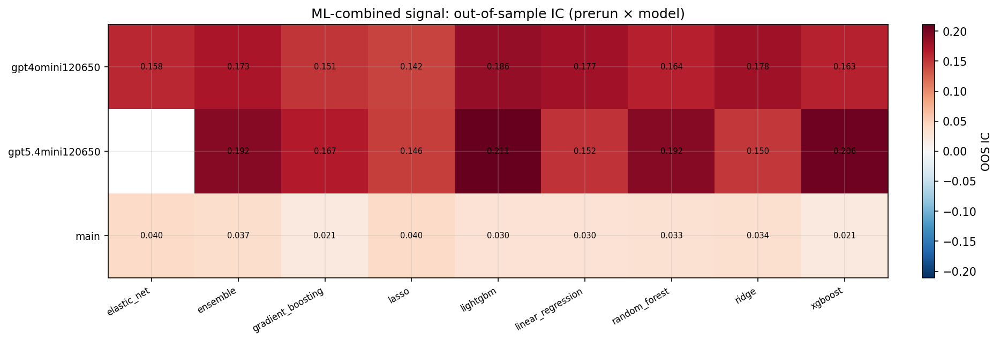

*ML-combined OOS IC (prerun × model)*

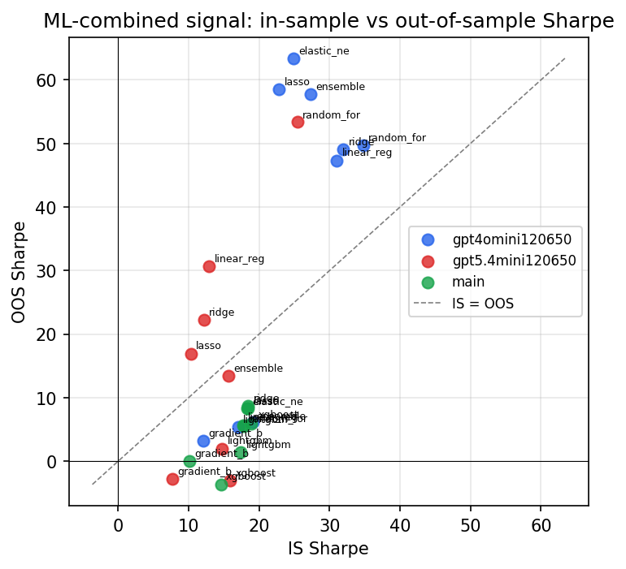

*IS vs OOS Sharpe (overfitting diagnostic)*

---
*Generated by `run_model_comparison.py`. Tables: `*.csv`; interactive: `comparison.ipynb`.*
