# Research-LLM factor comparison — `2025-10`

Comparing the **factor output of different research LLMs** on three axes (raw factor quality → factors as ML features → factors through the full agentic fund). The panel, IS/OOS split, horizon and model hyper-parameters are held identical across preruns — the *only* variable is the factor set.

## Preruns compared

| prerun | research_model | usable_factors | dropped_factors |
| --- | --- | --- | --- |
| gpt4omini120650 | gpt-4o-mini | 66 | 0 |
| gpt5.4mini120650 | gpt-5.4-mini | 69 | 0 |
| main | seed library | 78 | 10 |

> Dropped factors declare fields the current data doesn't have yet (e.g. fundamentals); they light up unchanged once that data is downloaded.

*Usable vs awaiting-data factors per research model*

## Key findings

- **Best ML-combined OOS Sharpe:** `gpt4omini120650` with `lasso` (OOS Sharpe = 65.001).
- **Mean OOS Sharpe across models, by research set:** `gpt4omini120650` = 34.316, `main` = 15.481, `gpt5.4mini120650` = 15.026.
- **Highest mean single-factor |IC| (h=6):** `main` (mean |IC| = 0.0476).
- **Most diverse zoo (highest effective/raw factor ratio):** `gpt5.4mini120650` (eff 57.9 of 69, ratio 0.84).
- **Best selection-deflated single-factor |IC|:** `main` (deflated |IC| = 0.3453 from 37 factors tried).

## 1. Single-factor IC (raw factor quality)

Per-underlying time-series Spearman rank-IC of every researched factor, recomputed on the shared panel at horizons h=1, h=6, h=60. The per-underlying IC correlates each factor's value vector with the underlying's own forward-return vector (pooled across underlyings); the cross-sectional IC ranks across underlyings per timestamp.

| prerun | n_factors | mean_abs_ic_1 | mean_abs_ic_6 | mean_abs_ic_60 | mean_abs_icir_6 | best_factor_h6 | best_abs_ic_h6 |
| --- | --- | --- | --- | --- | --- | --- | --- |
| gpt4omini120650 | 66 | 0.0382 | 0.0327 | 0.0153 | 1.6455 | limit_order_book_imbalance_surge | 0.1335 |
| gpt5.4mini120650 | 69 | 0.025 | 0.0254 | 0.0124 | 1.5063 | orderflow_imbalance_divergence | 0.1289 |
| main | 78 | 0.0321 | 0.0476 | 0.0141 | 1.5793 | alpha_066 | 0.3522 |

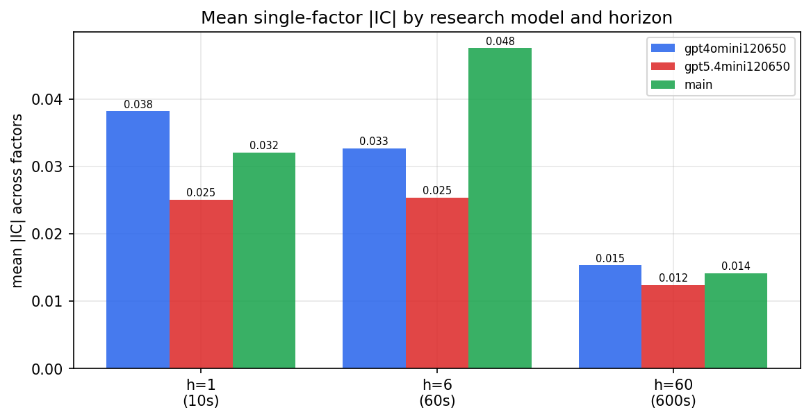

*Mean |IC| by research model and horizon*

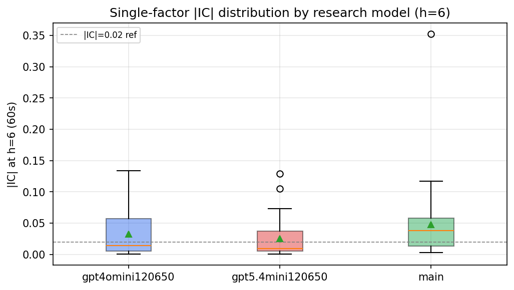

*Per-factor |IC| distribution by research model*

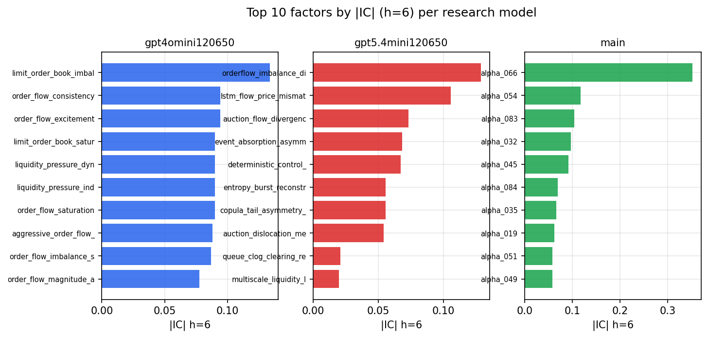

*Top factors by |IC| per research model*

## 2. Factor diversity & redundancy

Pairwise correlation of each zoo's *signals*. `eff_n_factors` is the effective number of independent factors (participation ratio of the correlation eigenvalues); `eff_ratio` and `redundancy` summarise how much unique information the zoo holds vs. how much is duplicated; `n_clusters` groups factors at |corr| ≥ 0.7.

| prerun | n_factors | eff_n_factors | eff_ratio | mean_abs_corr | n_clusters | redundancy |
| --- | --- | --- | --- | --- | --- | --- |
| gpt4omini120650 | 66 | 30.4137 | 0.4608 | 0.0437 | 53 | 0.5392 |
| gpt5.4mini120650 | 69 | 57.8967 | 0.8391 | 0.0094 | 68 | 0.1609 |
| main | 78 | 32.3692 | 0.415 | 0.0454 | 66 | 0.585 |

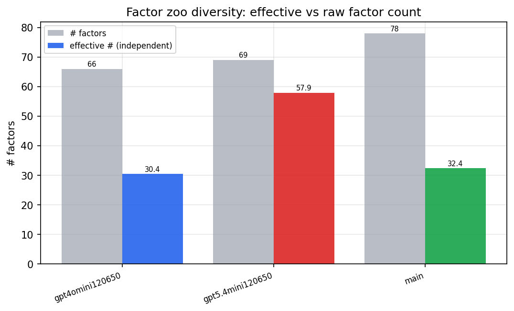

*Effective vs raw factor count per research model*

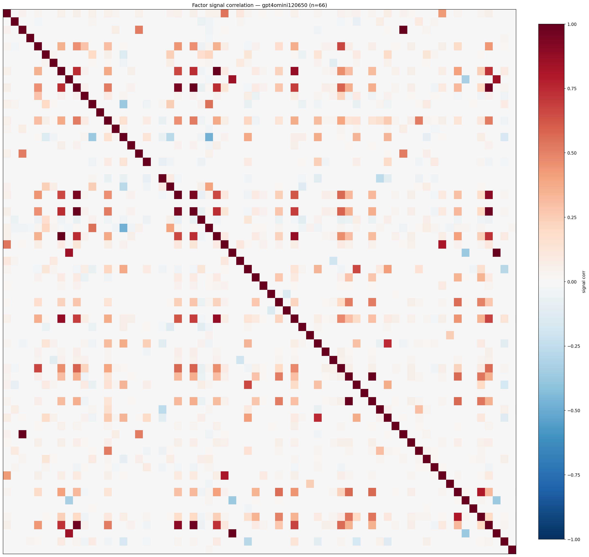

*Signal correlation matrix — gpt4omini120650*

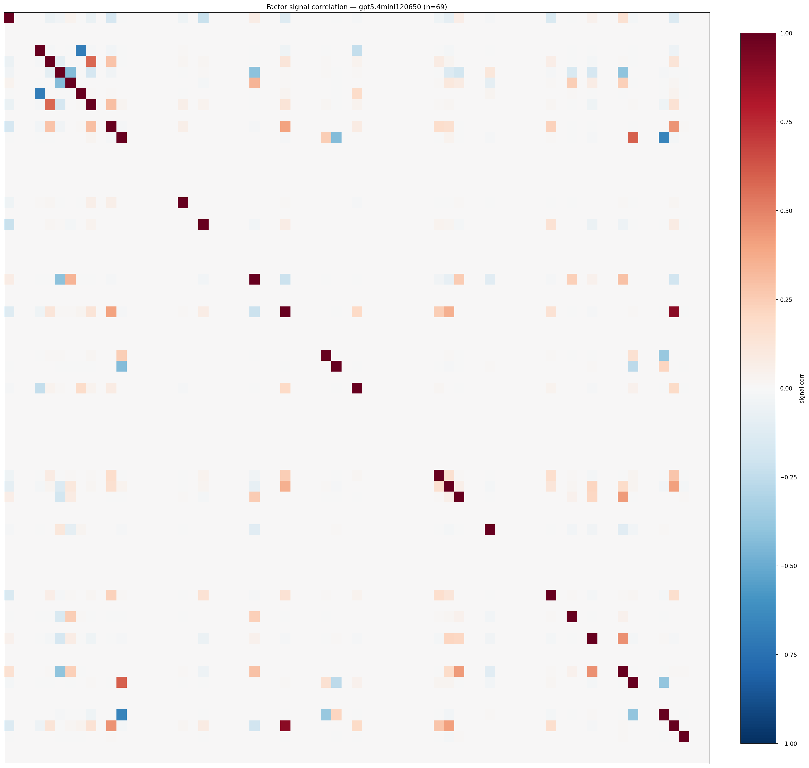

*Signal correlation matrix — gpt5.4mini120650*

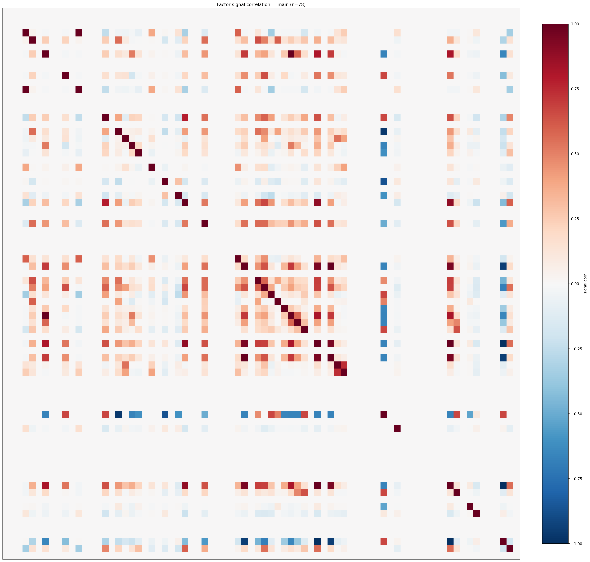

*Signal correlation matrix — main*

## 3. Deflation & model-based importance

`deflated_best_ic` haircuts each zoo's best |IC| for the number of factors tried (`ic_n_tested`) — a bigger zoo's best factor is more likely to be lucky. `lasso_n_nonzero` / `lasso_sparsity` show how many factors a sparse linear model actually keeps (model-view redundancy).

| prerun | best_ic | deflated_best_ic | deflated_best_t | ic_n_tested | ic_n_obs | lasso_n_nonzero | lasso_sparsity |
| --- | --- | --- | --- | --- | --- | --- | --- |
| gpt4omini120650 | 0.1335 | 0.1261 | 49.1914 | 64 | 152099 | 9 | 0.8636 |
| gpt5.4mini120650 | 0.1289 | 0.1221 | 47.6364 | 31 | 152099 | 20 | 0.7101 |
| main | 0.3522 | 0.3453 | 134.6659 | 37 | 152099 | 6 | 0.9231 |

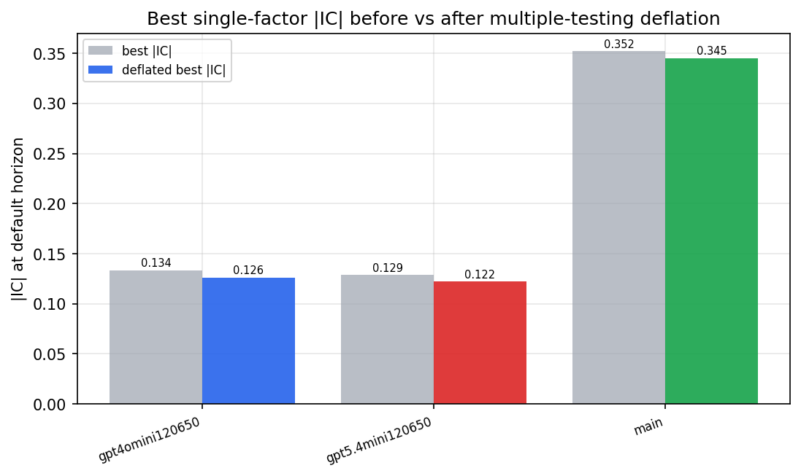

*Best |IC| before vs after multiple-testing deflation*

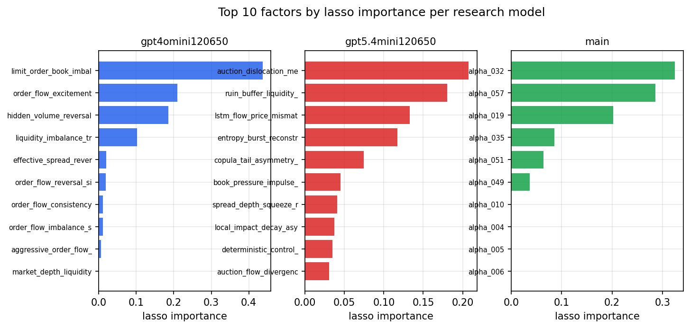

*Top factors by lasso importance per zoo*

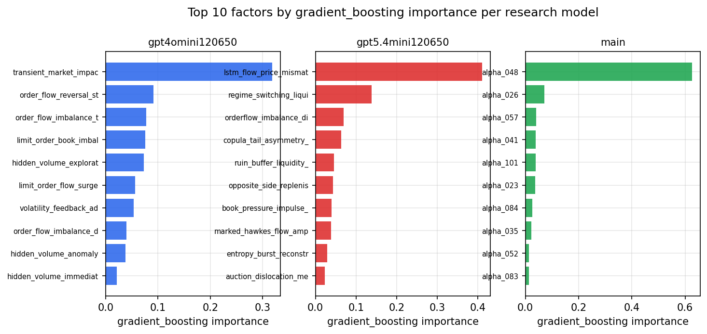

*Top factors by gradient_boosting importance per zoo*

## 4. ML-combined signal — per-underlying vectorised backtest

Each model combines a prerun's factors into ONE signal (fit `factors → forward return` on IS, predict per (bar, underlying)), then that combined signal is run through a simple vectorised backtest — `position(signal) × the underlying's own forward return` — on the held-out OOS tail (+ an equal-weight ensemble). No cross-sectional ranking.

> Config: position=**threshold** (t=1.0, z-score `expanding`), aggregation=**portfolio**, fit-standardise=**per_underlying**, horizon=6.

| prerun | model | n_factors_used | oos_ic | oos_sharpe | is_sharpe | oos_ann_return | oos_max_drawdown |
| --- | --- | --- | --- | --- | --- | --- | --- |
| gpt4omini120650 | linear_regression | 66 | 0.1649 | 29.7209 | 49.8275 | 0.1881 | -0.001 |
| gpt4omini120650 | ridge | 66 | 0.1659 | 30.5071 | 49.1775 | 0.1893 | -0.001 |
| gpt4omini120650 | lasso | 66 | 0.1661 | 65.0011 | 59.155 | 0.5968 | -0.0006 |
| gpt4omini120650 | elastic_net | 66 | 0.1666 | 64.0668 | 52.2051 | 0.6007 | -0.0007 |
| gpt4omini120650 | random_forest | 66 | 0.1604 | 52.8541 | 38.3723 | 0.7212 | -0.0015 |
| gpt4omini120650 | gradient_boosting | 66 | 0.1506 | 2.9801 | 7.7819 | 0.0192 | -0.0017 |
| gpt4omini120650 | xgboost | 66 | 0.1705 | 13.5722 | 13.8283 | 0.1119 | -0.0021 |
| gpt4omini120650 | lightgbm | 66 | 0.1783 | 6.6379 | 16.4782 | 0.0649 | -0.0022 |
| gpt4omini120650 | ensemble | 66 | 0.1721 | 43.5001 | 28.6762 | 0.4847 | -0.0017 |
| gpt5.4mini120650 | linear_regression | 69 | 0.1364 | 24.2952 | 20.4007 | 0.4353 | -0.004 |
| gpt5.4mini120650 | ridge | 69 | 0.1353 | 25.4606 | 21.367 | 0.4647 | -0.0041 |
| gpt5.4mini120650 | lasso | 69 | nan | nan | nan | nan | nan |
| gpt5.4mini120650 | elastic_net | 69 | nan | nan | nan | nan | nan |
| gpt5.4mini120650 | random_forest | 69 | 0.1833 | 46.2763 | 37.23 | 0.737 | -0.0021 |
| gpt5.4mini120650 | gradient_boosting | 69 | 0.1589 | -4.4965 | 6.6906 | -0.013 | -0.0013 |
| gpt5.4mini120650 | xgboost | 69 | 0.1915 | 10.8137 | 17.0928 | 0.1559 | -0.0014 |
| gpt5.4mini120650 | lightgbm | 69 | 0.1979 | 6.9761 | 15.6368 | 0.0978 | -0.0015 |
| gpt5.4mini120650 | ensemble | 69 | 0.1628 | -4.1465 | 4.7137 | -0.01 | -0.0011 |
| main | linear_regression | 78 | 0.0626 | 15.0217 | 14.7866 | 0.184 | -0.0016 |
| main | ridge | 78 | 0.0671 | 16.8598 | 15.8244 | 0.2004 | -0.0015 |
| main | lasso | 78 | 0.0798 | 22.147 | 16.5421 | 0.2716 | -0.0016 |
| main | elastic_net | 78 | 0.0801 | 21.7803 | 16.5662 | 0.2667 | -0.0016 |
| main | random_forest | 78 | 0.0876 | 19.2294 | 18.497 | 0.2451 | -0.0013 |
| main | gradient_boosting | 78 | 0.0817 | 14.0219 | 12.4073 | 0.1222 | -0.001 |
| main | xgboost | 78 | 0.0764 | 7.5021 | 14.5911 | 0.084 | -0.0018 |
| main | lightgbm | 78 | 0.0727 | 5.8871 | 17.0754 | 0.052 | -0.0017 |
| main | ensemble | 78 | 0.0816 | 16.8763 | 17.0707 | 0.2039 | -0.0015 |

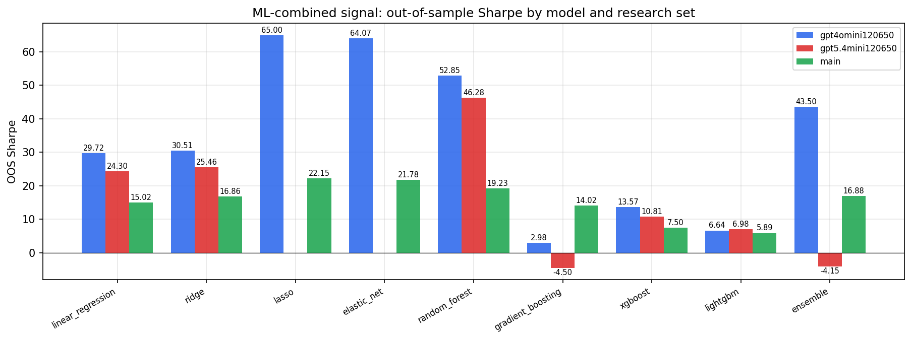

*ML-combined OOS Sharpe by model and research set*

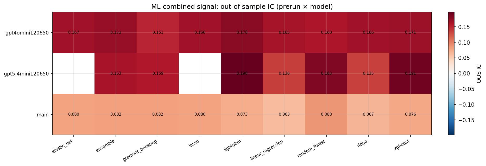

*ML-combined OOS IC (prerun × model)*

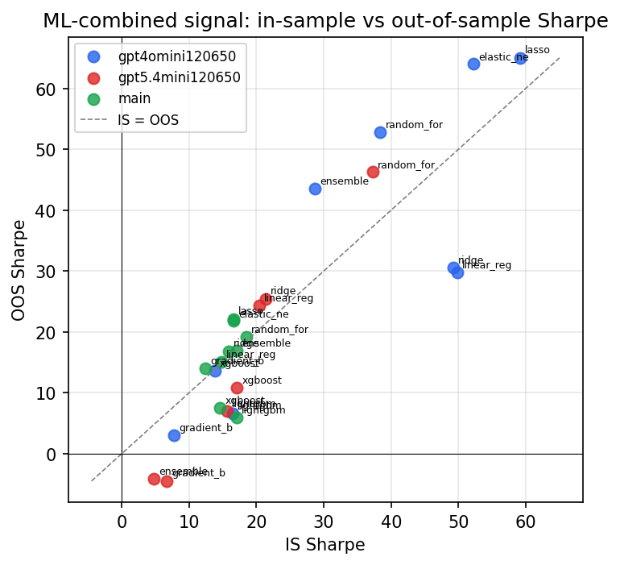

*IS vs OOS Sharpe (overfitting diagnostic)*

---
*Generated by `run_model_comparison.py`. Tables: `*.csv`; interactive: `comparison.ipynb`.*
