# Research-LLM factor comparison — `2025-11`

Comparing the **factor output of different research LLMs** on three axes (raw factor quality → factors as ML features → factors through the full agentic fund). The panel, IS/OOS split, horizon and model hyper-parameters are held identical across preruns — the *only* variable is the factor set.

## Preruns compared

| prerun | research_model | usable_factors | dropped_factors |
| --- | --- | --- | --- |
| gpt4omini120650 | gpt-4o-mini | 66 | 0 |
| gpt5.4mini120650 | gpt-5.4-mini | 69 | 0 |
| main | seed library | 78 | 10 |

> Dropped factors declare fields the current data doesn't have yet (e.g. fundamentals); they light up unchanged once that data is downloaded.

*Usable vs awaiting-data factors per research model*

## Key findings

- **Best ML-combined OOS Sharpe:** `gpt4omini120650` with `elastic_net` (OOS Sharpe = 48.853).
- **Mean OOS Sharpe across models, by research set:** `gpt4omini120650` = 34.598, `gpt5.4mini120650` = 29.249, `main` = 15.944.
- **Highest mean single-factor |IC| (h=6):** `main` (mean |IC| = 0.0371).
- **Most diverse zoo (highest effective/raw factor ratio):** `gpt5.4mini120650` (eff 53.7 of 69, ratio 0.78).
- **Best selection-deflated single-factor |IC|:** `gpt4omini120650` (deflated |IC| = 0.1299 from 64 factors tried).

## 1. Single-factor IC (raw factor quality)

Per-underlying time-series Spearman rank-IC of every researched factor, recomputed on the shared panel at horizons h=1, h=6, h=60. The per-underlying IC correlates each factor's value vector with the underlying's own forward-return vector (pooled across underlyings); the cross-sectional IC ranks across underlyings per timestamp.

| prerun | n_factors | mean_abs_ic_1 | mean_abs_ic_6 | mean_abs_ic_60 | mean_abs_icir_6 | best_factor_h6 | best_abs_ic_h6 |
| --- | --- | --- | --- | --- | --- | --- | --- |
| gpt4omini120650 | 66 | 0.0396 | 0.0336 | 0.0147 | 2.0896 | limit_order_book_imbalance_surge | 0.1374 |
| gpt5.4mini120650 | 69 | 0.0248 | 0.0246 | 0.0143 | 1.7934 | orderflow_imbalance_divergence | 0.1302 |
| main | 78 | 0.0304 | 0.0371 | 0.0147 | 1.4123 | alpha_054 | 0.1141 |

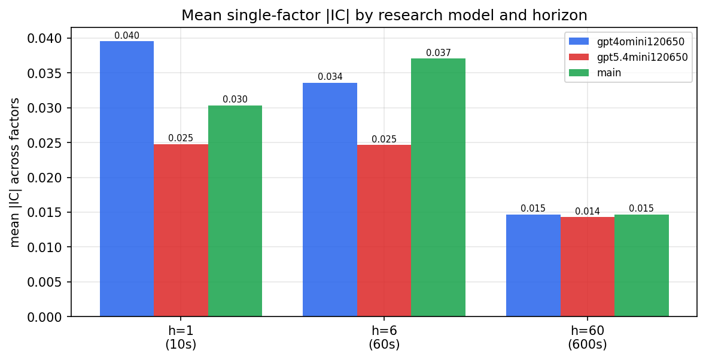

*Mean |IC| by research model and horizon*

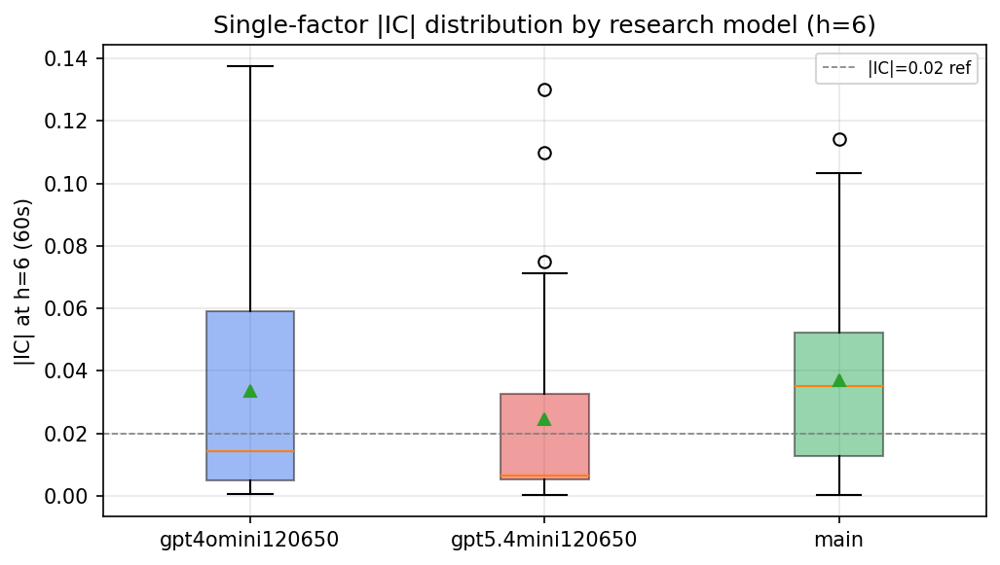

*Per-factor |IC| distribution by research model*

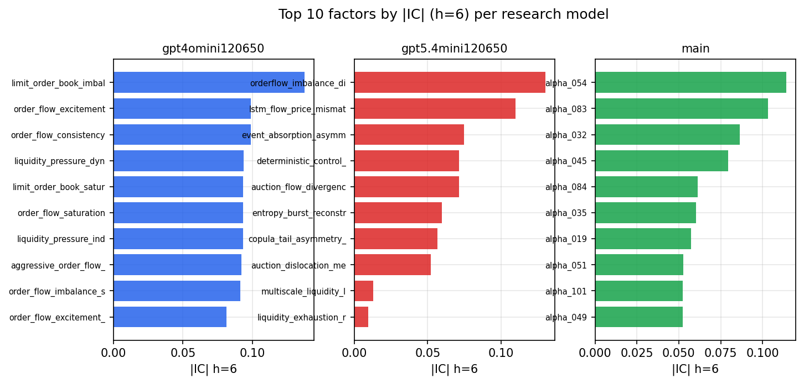

*Top factors by |IC| per research model*

## 2. Factor diversity & redundancy

Pairwise correlation of each zoo's *signals*. `eff_n_factors` is the effective number of independent factors (participation ratio of the correlation eigenvalues); `eff_ratio` and `redundancy` summarise how much unique information the zoo holds vs. how much is duplicated; `n_clusters` groups factors at |corr| ≥ 0.7.

| prerun | n_factors | eff_n_factors | eff_ratio | mean_abs_corr | n_clusters | redundancy |
| --- | --- | --- | --- | --- | --- | --- |
| gpt4omini120650 | 66 | 30.0806 | 0.4558 | 0.0449 | 53 | 0.5442 |
| gpt5.4mini120650 | 69 | 53.7157 | 0.7785 | 0.0118 | 64 | 0.2215 |
| main | 78 | 33.8334 | 0.4338 | 0.0409 | 66 | 0.5662 |

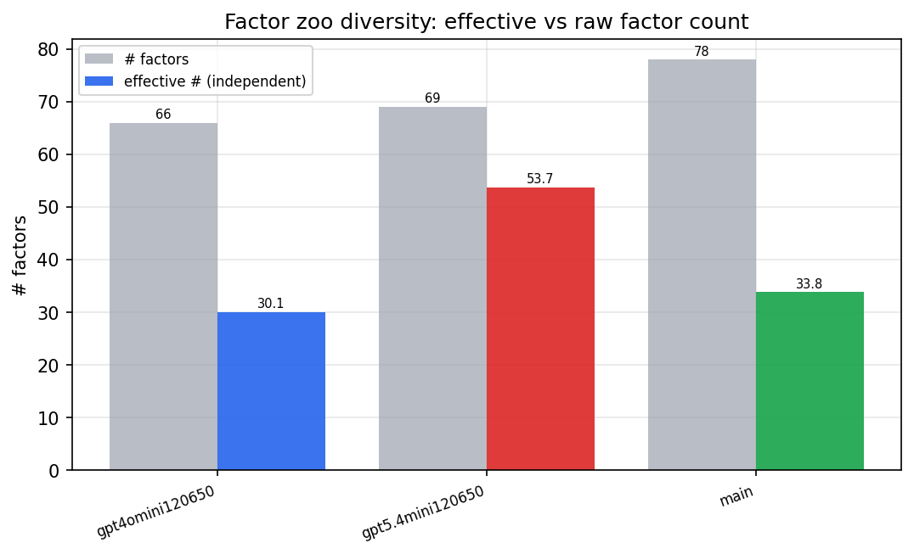

*Effective vs raw factor count per research model*

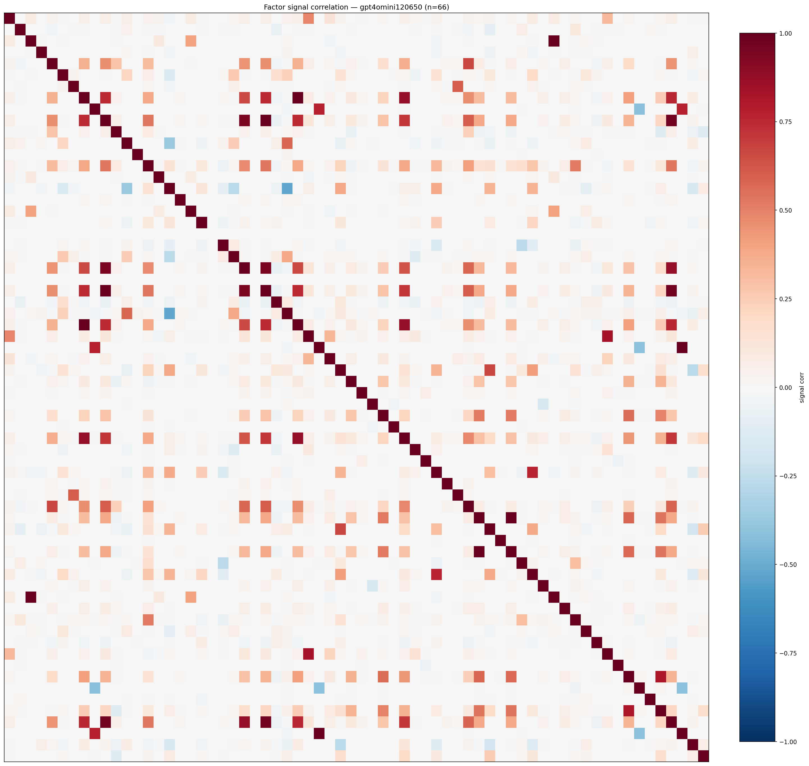

*Signal correlation matrix — gpt4omini120650*

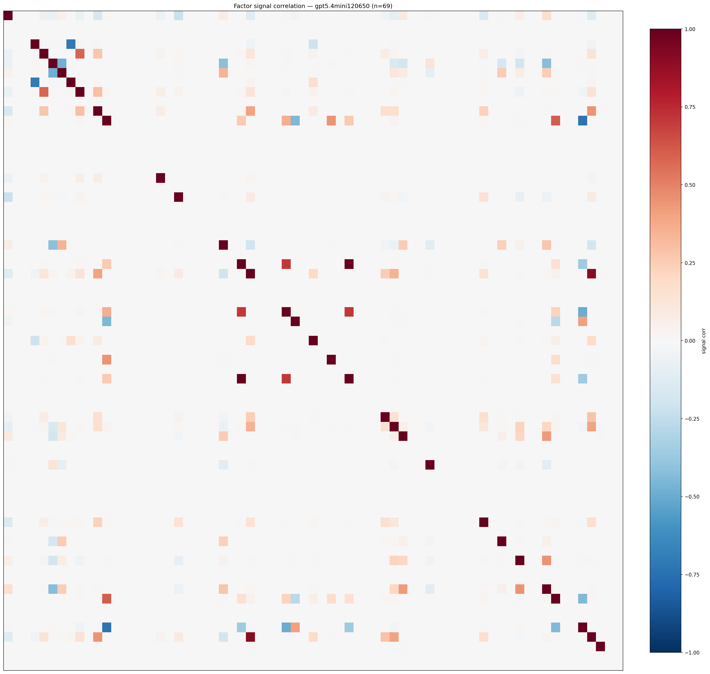

*Signal correlation matrix — gpt5.4mini120650*

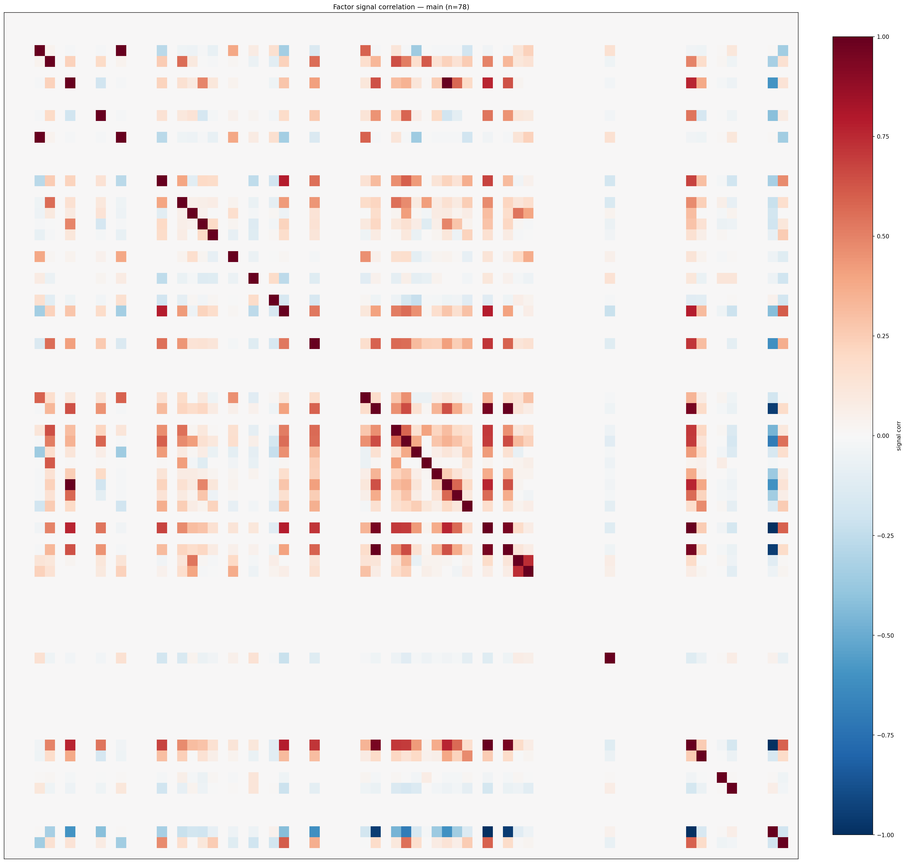

*Signal correlation matrix — main*

## 3. Deflation & model-based importance

`deflated_best_ic` haircuts each zoo's best |IC| for the number of factors tried (`ic_n_tested`) — a bigger zoo's best factor is more likely to be lucky. `lasso_n_nonzero` / `lasso_sparsity` show how many factors a sparse linear model actually keeps (model-view redundancy).

| prerun | best_ic | deflated_best_ic | deflated_best_t | ic_n_tested | ic_n_obs | lasso_n_nonzero | lasso_sparsity |
| --- | --- | --- | --- | --- | --- | --- | --- |
| gpt4omini120650 | 0.1374 | 0.1299 | 49.6778 | 64 | 146339 | 15 | 0.7727 |
| gpt5.4mini120650 | 0.1302 | 0.1233 | 47.1745 | 31 | 146339 | 14 | 0.7971 |
| main | 0.1141 | 0.1071 | 40.9734 | 36 | 146339 | 9 | 0.8846 |

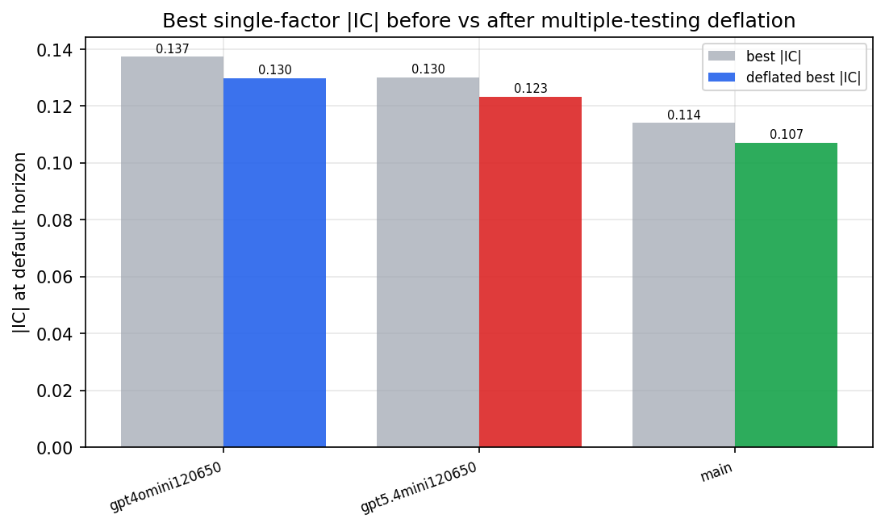

*Best |IC| before vs after multiple-testing deflation*

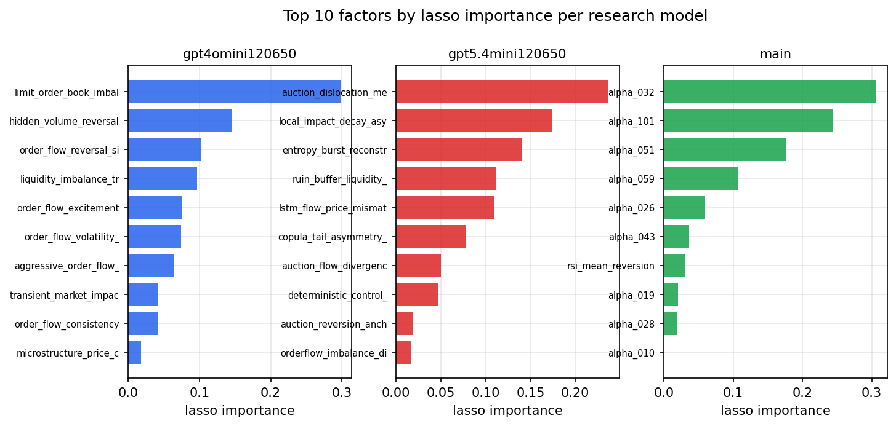

*Top factors by lasso importance per zoo*

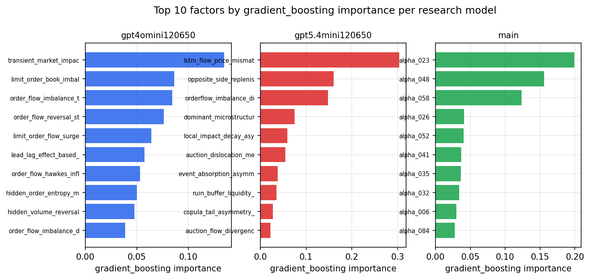

*Top factors by gradient_boosting importance per zoo*

## 4. ML-combined signal — per-underlying vectorised backtest

Each model combines a prerun's factors into ONE signal (fit `factors → forward return` on IS, predict per (bar, underlying)), then that combined signal is run through a simple vectorised backtest — `position(signal) × the underlying's own forward return` — on the held-out OOS tail (+ an equal-weight ensemble). No cross-sectional ranking.

> Config: position=**threshold** (t=1.0, z-score `expanding`), aggregation=**portfolio**, fit-standardise=**per_underlying**, horizon=6.

| prerun | model | n_factors_used | oos_ic | oos_sharpe | is_sharpe | oos_ann_return | oos_max_drawdown |
| --- | --- | --- | --- | --- | --- | --- | --- |
| gpt4omini120650 | linear_regression | 66 | 0.1653 | 37.0474 | 53.7373 | 0.482 | -0.0013 |
| gpt4omini120650 | ridge | 66 | 0.1657 | 40.784 | 53.3973 | 0.4955 | -0.0012 |
| gpt4omini120650 | lasso | 66 | 0.168 | 46.5852 | 62.435 | 0.5089 | -0.0012 |
| gpt4omini120650 | elastic_net | 66 | 0.1674 | 48.853 | 61.2212 | 0.5018 | -0.0012 |
| gpt4omini120650 | random_forest | 66 | 0.1753 | 44.3995 | 51.569 | 0.5784 | -0.0016 |
| gpt4omini120650 | gradient_boosting | 66 | 0.1657 | 7.9679 | 9.8049 | 0.0734 | -0.0004 |
| gpt4omini120650 | xgboost | 66 | 0.1829 | 30.2772 | 25.4128 | 0.3196 | -0.001 |
| gpt4omini120650 | lightgbm | 66 | 0.1893 | 14.66 | 21.2581 | 0.1595 | -0.0009 |
| gpt4omini120650 | ensemble | 66 | 0.1802 | 40.8113 | 37.8066 | 0.5573 | -0.0012 |
| gpt5.4mini120650 | linear_regression | 69 | 0.1481 | 21.9392 | 33.931 | 0.3923 | -0.0019 |
| gpt5.4mini120650 | ridge | 69 | 0.148 | 22.0047 | 33.9537 | 0.3937 | -0.0019 |
| gpt5.4mini120650 | lasso | 69 | 0.1509 | 22.4357 | 33.4753 | 0.4035 | -0.0019 |
| gpt5.4mini120650 | elastic_net | 69 | 0.1504 | 22.6779 | 33.5873 | 0.4083 | -0.0019 |
| gpt5.4mini120650 | random_forest | 69 | 0.1953 | 46.2506 | 50.8948 | 0.7975 | -0.0015 |
| gpt5.4mini120650 | gradient_boosting | 69 | 0.1826 | 14.4888 | 17.8503 | 0.1874 | -0.0009 |
| gpt5.4mini120650 | xgboost | 69 | 0.2085 | 40.7554 | 38.3237 | 0.5827 | -0.0007 |
| gpt5.4mini120650 | lightgbm | 69 | 0.215 | 37.1279 | 28.3516 | 0.3024 | -0.001 |
| gpt5.4mini120650 | ensemble | 69 | 0.1878 | 35.5635 | 38.1951 | 0.6078 | -0.0009 |
| main | linear_regression | 78 | 0.062 | 16.2321 | 20.6117 | 0.1519 | -0.0009 |
| main | ridge | 78 | 0.0635 | 16.3716 | 21.4743 | 0.1532 | -0.0009 |
| main | lasso | 78 | 0.0633 | 17.8198 | 18.4199 | 0.143 | -0.0013 |
| main | elastic_net | 78 | 0.0632 | 17.8344 | 18.4298 | 0.143 | -0.0013 |
| main | random_forest | 78 | 0.0694 | 16.6185 | 21.5019 | 0.1987 | -0.0012 |
| main | gradient_boosting | 78 | 0.0626 | 13.6125 | 18.5231 | 0.0746 | -0.001 |
| main | xgboost | 78 | 0.062 | 14.1364 | 21.6335 | 0.1195 | -0.0014 |
| main | lightgbm | 78 | 0.0603 | 11.0232 | 20.7838 | 0.0826 | -0.0012 |
| main | ensemble | 78 | 0.0682 | 19.8484 | 20.4349 | 0.1788 | -0.0014 |

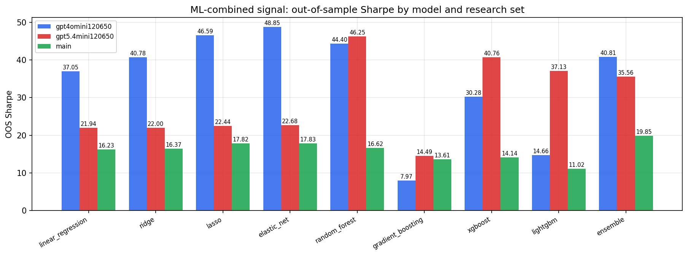

*ML-combined OOS Sharpe by model and research set*

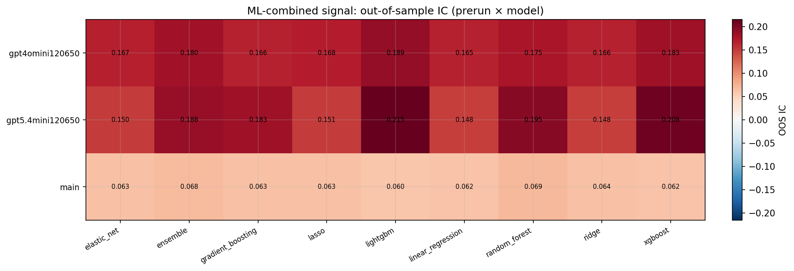

*ML-combined OOS IC (prerun × model)*

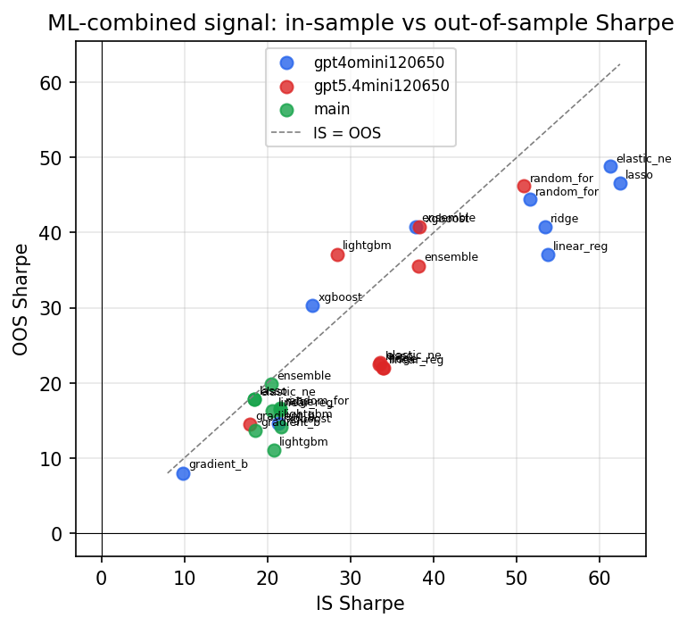

*IS vs OOS Sharpe (overfitting diagnostic)*

---
*Generated by `run_model_comparison.py`. Tables: `*.csv`; interactive: `comparison.ipynb`.*
