# Research-LLM factor comparison — `2025-12`

Comparing the **factor output of different research LLMs** on three axes (raw factor quality → factors as ML features → factors through the full agentic fund). The panel, IS/OOS split, horizon and model hyper-parameters are held identical across preruns — the *only* variable is the factor set.

## Preruns compared

| prerun | research_model | usable_factors | dropped_factors |
| --- | --- | --- | --- |
| gpt4omini120650 | gpt-4o-mini | 66 | 0 |
| gpt5.4mini120650 | gpt-5.4-mini | 69 | 0 |
| main | seed library | 78 | 10 |

> Dropped factors declare fields the current data doesn't have yet (e.g. fundamentals); they light up unchanged once that data is downloaded.

*Usable vs awaiting-data factors per research model*

## Key findings

- **Best ML-combined OOS Sharpe:** `gpt5.4mini120650` with `ensemble` (OOS Sharpe = 55.557).
- **Mean OOS Sharpe across models, by research set:** `gpt4omini120650` = 32.225, `gpt5.4mini120650` = 32.091, `main` = 7.168.
- **Highest mean single-factor |IC| (h=6):** `main` (mean |IC| = 0.0438).
- **Most diverse zoo (highest effective/raw factor ratio):** `gpt5.4mini120650` (eff 54.5 of 69, ratio 0.79).
- **Best selection-deflated single-factor |IC|:** `gpt4omini120650` (deflated |IC| = 0.1291 from 64 factors tried).

## 1. Single-factor IC (raw factor quality)

Per-underlying time-series Spearman rank-IC of every researched factor, recomputed on the shared panel at horizons h=1, h=6, h=60. The per-underlying IC correlates each factor's value vector with the underlying's own forward-return vector (pooled across underlyings); the cross-sectional IC ranks across underlyings per timestamp.

| prerun | n_factors | mean_abs_ic_1 | mean_abs_ic_6 | mean_abs_ic_60 | mean_abs_icir_6 | best_factor_h6 | best_abs_ic_h6 |
| --- | --- | --- | --- | --- | --- | --- | --- |
| gpt4omini120650 | 66 | 0.0378 | 0.0314 | 0.0137 | 1.8251 | limit_order_book_imbalance_surge | 0.1366 |
| gpt5.4mini120650 | 69 | 0.0233 | 0.0237 | 0.0115 | 1.7146 | orderflow_imbalance_divergence | 0.1308 |
| main | 78 | 0.0293 | 0.0438 | 0.0193 | 1.5896 | alpha_054 | 0.1157 |

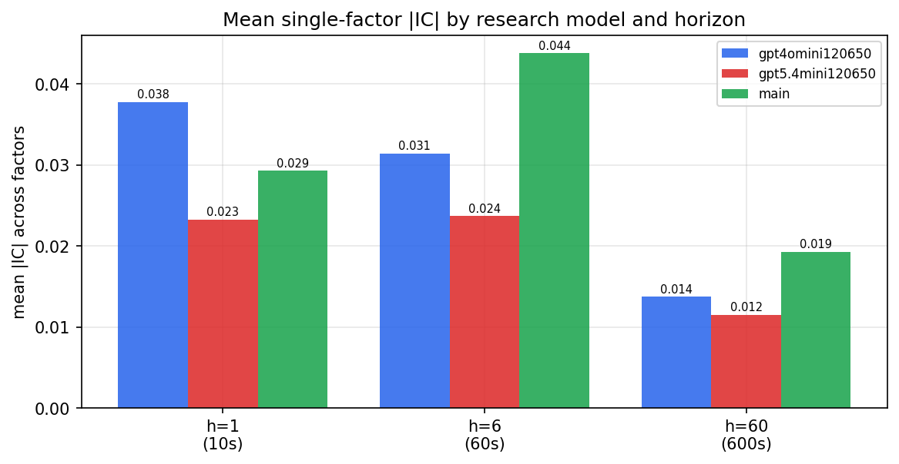

*Mean |IC| by research model and horizon*

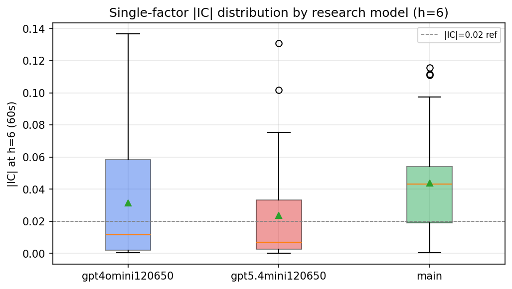

*Per-factor |IC| distribution by research model*

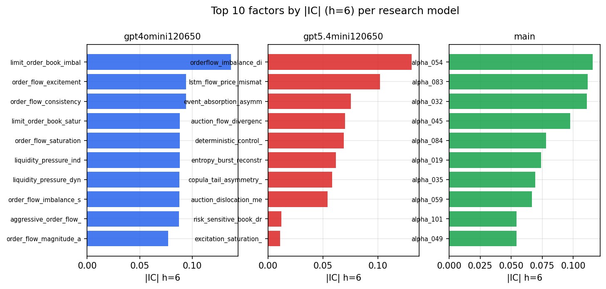

*Top factors by |IC| per research model*

## 2. Factor diversity & redundancy

Pairwise correlation of each zoo's *signals*. `eff_n_factors` is the effective number of independent factors (participation ratio of the correlation eigenvalues); `eff_ratio` and `redundancy` summarise how much unique information the zoo holds vs. how much is duplicated; `n_clusters` groups factors at |corr| ≥ 0.7.

| prerun | n_factors | eff_n_factors | eff_ratio | mean_abs_corr | n_clusters | redundancy |
| --- | --- | --- | --- | --- | --- | --- |
| gpt4omini120650 | 66 | 30.3782 | 0.4603 | 0.044 | 53 | 0.5397 |
| gpt5.4mini120650 | 69 | 54.4745 | 0.7895 | 0.0113 | 65 | 0.2105 |
| main | 78 | 32.9277 | 0.4222 | 0.0417 | 66 | 0.5778 |

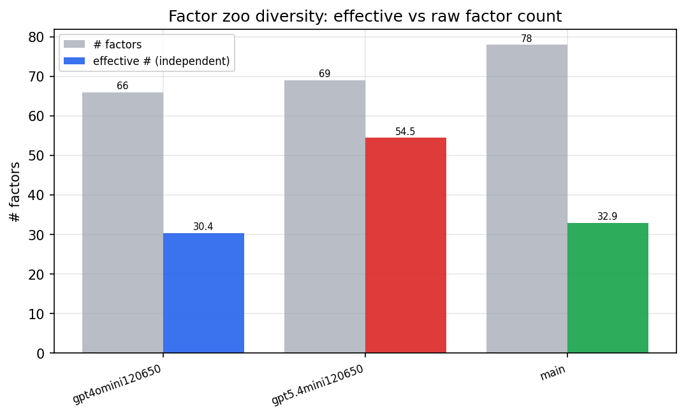

*Effective vs raw factor count per research model*

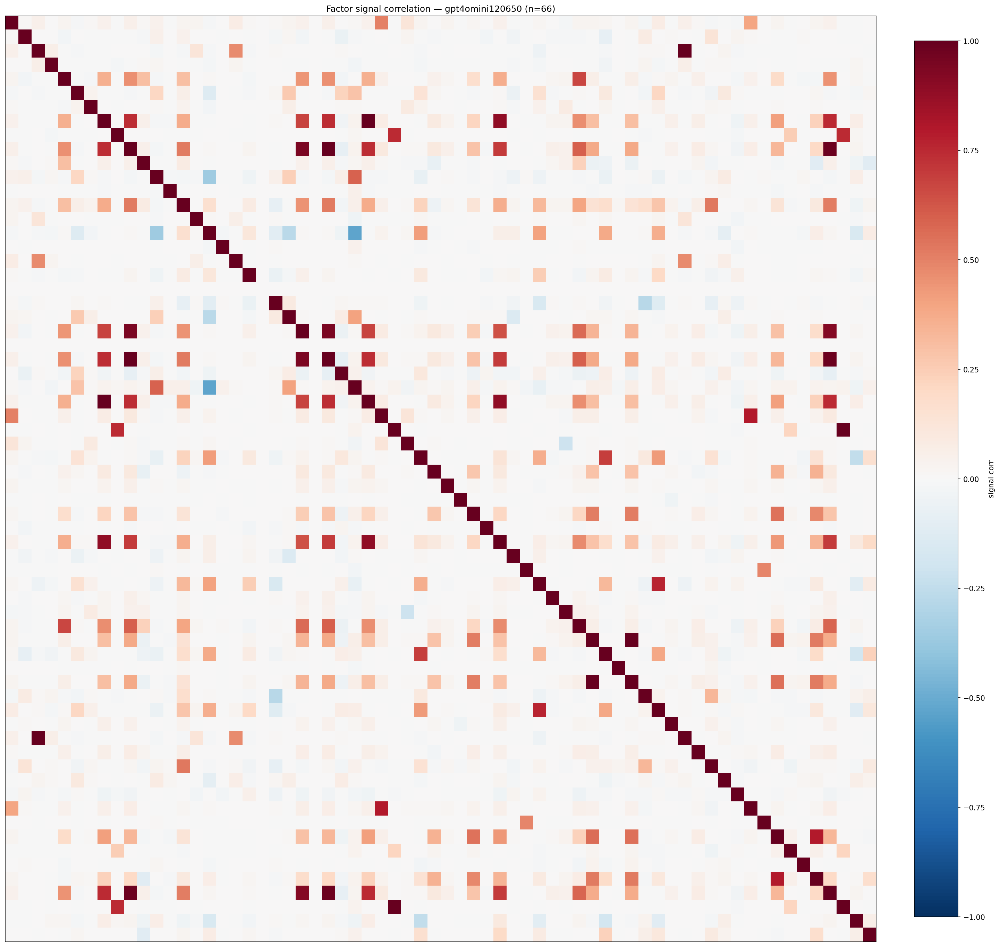

*Signal correlation matrix — gpt4omini120650*

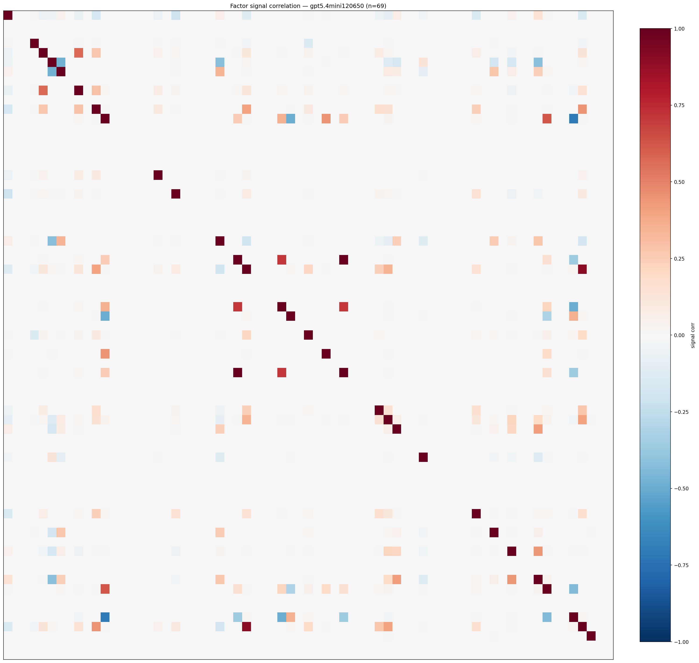

*Signal correlation matrix — gpt5.4mini120650*

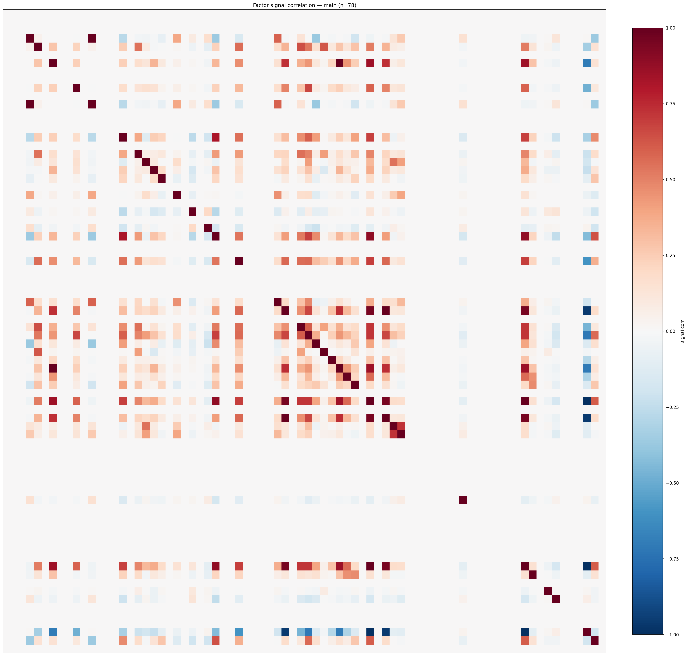

*Signal correlation matrix — main*

## 3. Deflation & model-based importance

`deflated_best_ic` haircuts each zoo's best |IC| for the number of factors tried (`ic_n_tested`) — a bigger zoo's best factor is more likely to be lucky. `lasso_n_nonzero` / `lasso_sparsity` show how many factors a sparse linear model actually keeps (model-view redundancy).

| prerun | best_ic | deflated_best_ic | deflated_best_t | ic_n_tested | ic_n_obs | lasso_n_nonzero | lasso_sparsity |
| --- | --- | --- | --- | --- | --- | --- | --- |
| gpt4omini120650 | 0.1366 | 0.1291 | 49.6048 | 64 | 147599 | 5 | 0.9242 |
| gpt5.4mini120650 | 0.1308 | 0.124 | 47.6473 | 31 | 147599 | 8 | 0.8841 |
| main | 0.1157 | 0.1087 | 41.7751 | 36 | 147599 | 4 | 0.9487 |

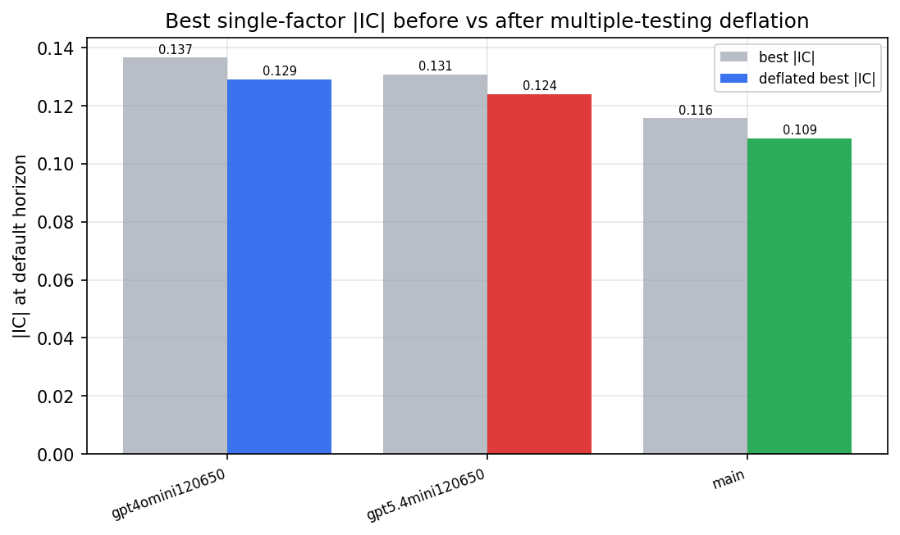

*Best |IC| before vs after multiple-testing deflation*

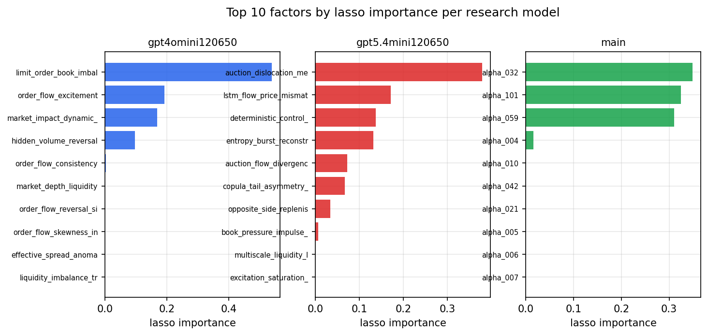

*Top factors by lasso importance per zoo*

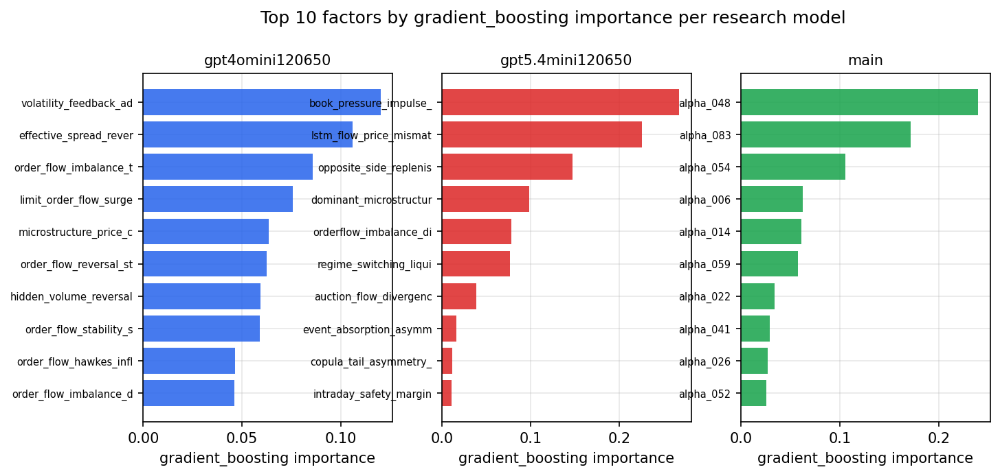

*Top factors by gradient_boosting importance per zoo*

## 4. ML-combined signal — per-underlying vectorised backtest

Each model combines a prerun's factors into ONE signal (fit `factors → forward return` on IS, predict per (bar, underlying)), then that combined signal is run through a simple vectorised backtest — `position(signal) × the underlying's own forward return` — on the held-out OOS tail (+ an equal-weight ensemble). No cross-sectional ranking.

> Config: position=**threshold** (t=1.0, z-score `expanding`), aggregation=**portfolio**, fit-standardise=**per_underlying**, horizon=6.

| prerun | model | n_factors_used | oos_ic | oos_sharpe | is_sharpe | oos_ann_return | oos_max_drawdown |
| --- | --- | --- | --- | --- | --- | --- | --- |
| gpt4omini120650 | linear_regression | 66 | 0.1859 | 39.1079 | 38.6742 | 0.4837 | -0.0013 |
| gpt4omini120650 | ridge | 66 | 0.1845 | 40.1875 | 45.9734 | 0.4914 | -0.0014 |
| gpt4omini120650 | lasso | 66 | 0.1837 | 54.8386 | 58.6854 | 0.5202 | -0.0011 |
| gpt4omini120650 | elastic_net | 66 | 0.1837 | 54.8386 | 58.6854 | 0.5202 | -0.0011 |
| gpt4omini120650 | random_forest | 66 | 0.1816 | 54.5265 | 36.6337 | 0.5902 | -0.0009 |
| gpt4omini120650 | gradient_boosting | 66 | 0.1571 | -0.0128 | 10.0744 | -0.0001 | -0.0011 |
| gpt4omini120650 | xgboost | 66 | 0.1897 | 5.8322 | 23.9534 | 0.0512 | -0.0014 |
| gpt4omini120650 | lightgbm | 66 | 0.1976 | 3.2455 | 18.5349 | 0.0297 | -0.0012 |
| gpt4omini120650 | ensemble | 66 | 0.19 | 37.4627 | 30.8933 | 0.5129 | -0.0014 |
| gpt5.4mini120650 | linear_regression | 69 | 0.1716 | 30.7142 | 26.3954 | 0.3725 | -0.0018 |
| gpt5.4mini120650 | ridge | 69 | 0.1698 | 32.102 | 26.9235 | 0.3953 | -0.0018 |
| gpt5.4mini120650 | lasso | 69 | nan | nan | nan | nan | nan |
| gpt5.4mini120650 | elastic_net | 69 | nan | nan | nan | nan | nan |
| gpt5.4mini120650 | random_forest | 69 | 0.2165 | 50.6018 | 40.0925 | 0.7632 | -0.0018 |
| gpt5.4mini120650 | gradient_boosting | 69 | 0.1955 | 6.3817 | 21.0662 | 0.0284 | -0.0007 |
| gpt5.4mini120650 | xgboost | 69 | 0.2247 | 31.0267 | 23.7201 | 0.2435 | -0.0009 |
| gpt5.4mini120650 | lightgbm | 69 | 0.2337 | 18.2554 | 17.8801 | 0.1105 | -0.0009 |
| gpt5.4mini120650 | ensemble | 69 | 0.2234 | 55.5568 | 32.4817 | 0.6018 | -0.0014 |
| main | linear_regression | 78 | 0.0753 | 0.8558 | 12.7008 | 0.0049 | -0.0015 |
| main | ridge | 78 | 0.0774 | 13.6534 | 13.5263 | 0.1843 | -0.0016 |
| main | lasso | 78 | 0.0837 | 14.0147 | 15.6396 | 0.2193 | -0.002 |
| main | elastic_net | 78 | 0.0838 | 14.9587 | 15.8053 | 0.2283 | -0.002 |
| main | random_forest | 78 | 0.0843 | 5.9235 | 19.2152 | 0.134 | -0.0051 |
| main | gradient_boosting | 78 | 0.0886 | 1.8834 | 10.3112 | 0.0117 | -0.0021 |
| main | xgboost | 78 | 0.0843 | 1.4324 | 14.8061 | 0.009 | -0.0021 |
| main | lightgbm | 78 | 0.0786 | -1.0264 | 17.9081 | -0.0099 | -0.0034 |
| main | ensemble | 78 | 0.0859 | 12.8176 | 18.699 | 0.1742 | -0.0017 |

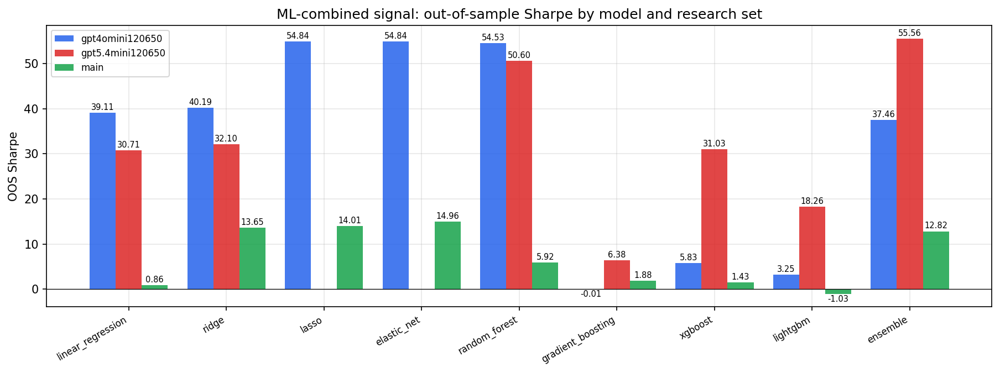

*ML-combined OOS Sharpe by model and research set*

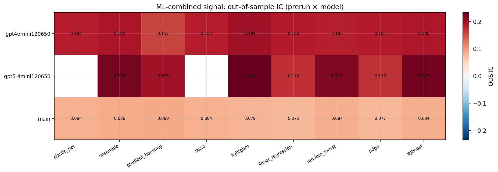

*ML-combined OOS IC (prerun × model)*

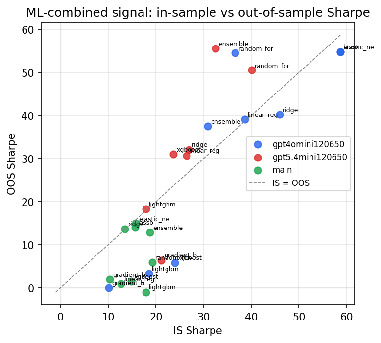

*IS vs OOS Sharpe (overfitting diagnostic)*

---
*Generated by `run_model_comparison.py`. Tables: `*.csv`; interactive: `comparison.ipynb`.*
