# Research-LLM factor comparison — `2026-01`

Comparing the **factor output of different research LLMs** on three axes (raw factor quality → factors as ML features → factors through the full agentic fund). The panel, IS/OOS split, horizon and model hyper-parameters are held identical across preruns — the *only* variable is the factor set.

## Preruns compared

| prerun | research_model | usable_factors | dropped_factors |
| --- | --- | --- | --- |
| gpt4omini120650 | gpt-4o-mini | 66 | 0 |
| gpt5.4mini120650 | gpt-5.4-mini | 69 | 0 |
| main | seed library | 77 | 11 |

> Dropped factors declare fields the current data doesn't have yet (e.g. fundamentals); they light up unchanged once that data is downloaded.

*Usable vs awaiting-data factors per research model*

## Key findings

- **Best ML-combined OOS Sharpe:** `gpt4omini120650` with `lasso` (OOS Sharpe = 86.157).
- **Mean OOS Sharpe across models, by research set:** `gpt5.4mini120650` = 53.603, `gpt4omini120650` = 50.094, `main` = 12.549.
- **Highest mean single-factor |IC| (h=6):** `main` (mean |IC| = 0.0409).
- **Most diverse zoo (highest effective/raw factor ratio):** `gpt5.4mini120650` (eff 54.4 of 69, ratio 0.79).
- **Best selection-deflated single-factor |IC|:** `gpt5.4mini120650` (deflated |IC| = 0.1387 from 30 factors tried).

## 1. Single-factor IC (raw factor quality)

Per-underlying time-series Spearman rank-IC of every researched factor, recomputed on the shared panel at horizons h=1, h=6, h=60. The per-underlying IC correlates each factor's value vector with the underlying's own forward-return vector (pooled across underlyings); the cross-sectional IC ranks across underlyings per timestamp.

| prerun | n_factors | mean_abs_ic_1 | mean_abs_ic_6 | mean_abs_ic_60 | mean_abs_icir_6 | best_factor_h6 | best_abs_ic_h6 |
| --- | --- | --- | --- | --- | --- | --- | --- |
| gpt4omini120650 | 66 | 0.0395 | 0.0362 | 0.0174 | 1.9908 | limit_order_book_imbalance_surge | 0.1402 |
| gpt5.4mini120650 | 69 | 0.025 | 0.0261 | 0.0132 | 1.8548 | orderflow_imbalance_divergence | 0.1456 |
| main | 77 | 0.0277 | 0.0409 | 0.0142 | 1.485 | alpha_054 | 0.1112 |

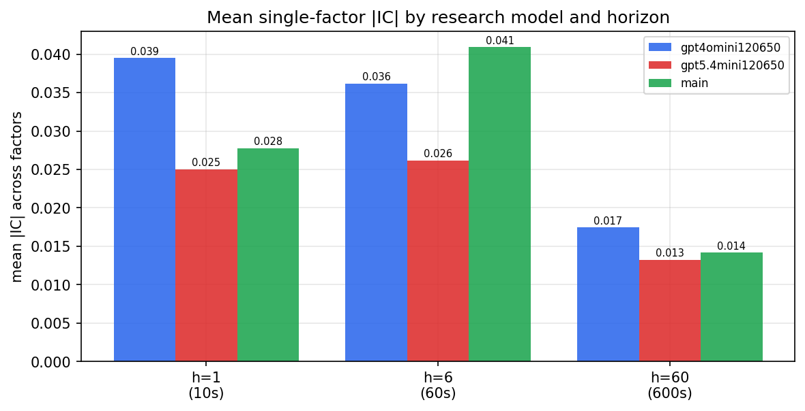

*Mean |IC| by research model and horizon*

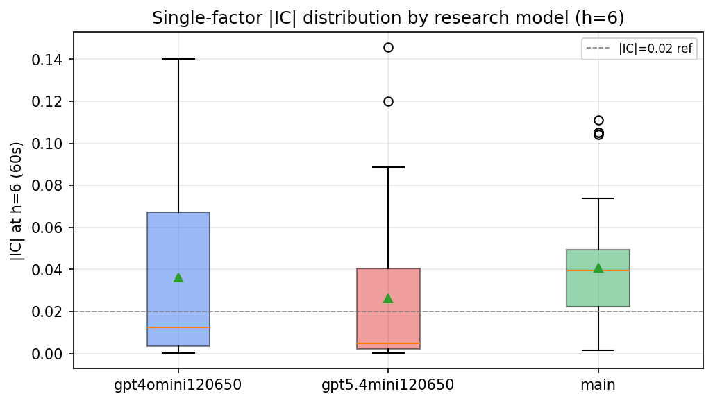

*Per-factor |IC| distribution by research model*

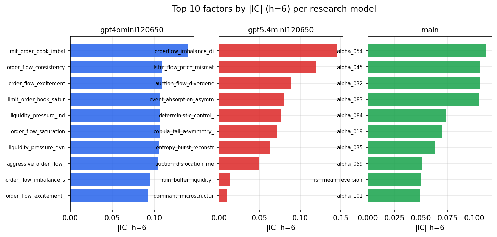

*Top factors by |IC| per research model*

## 2. Factor diversity & redundancy

Pairwise correlation of each zoo's *signals*. `eff_n_factors` is the effective number of independent factors (participation ratio of the correlation eigenvalues); `eff_ratio` and `redundancy` summarise how much unique information the zoo holds vs. how much is duplicated; `n_clusters` groups factors at |corr| ≥ 0.7.

| prerun | n_factors | eff_n_factors | eff_ratio | mean_abs_corr | n_clusters | redundancy |
| --- | --- | --- | --- | --- | --- | --- |
| gpt4omini120650 | 66 | 30.2176 | 0.4578 | 0.0439 | 53 | 0.5422 |
| gpt5.4mini120650 | 69 | 54.3783 | 0.7881 | 0.0111 | 65 | 0.2119 |
| main | 77 | 32.4676 | 0.4217 | 0.0427 | 66 | 0.5783 |

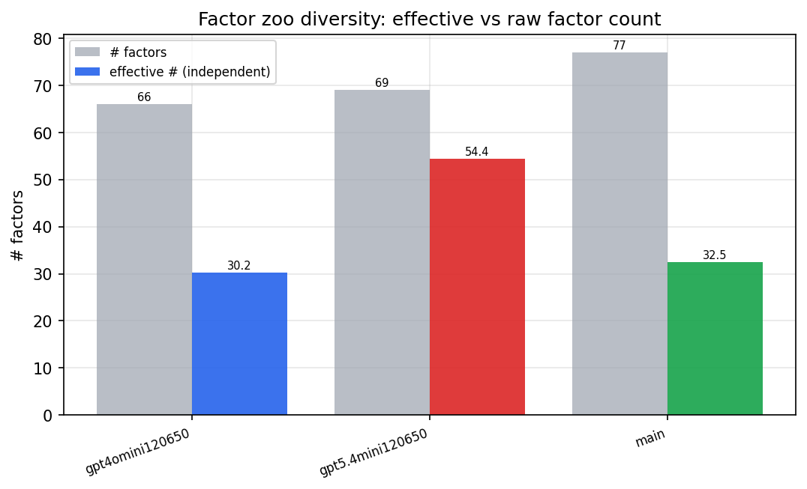

*Effective vs raw factor count per research model*

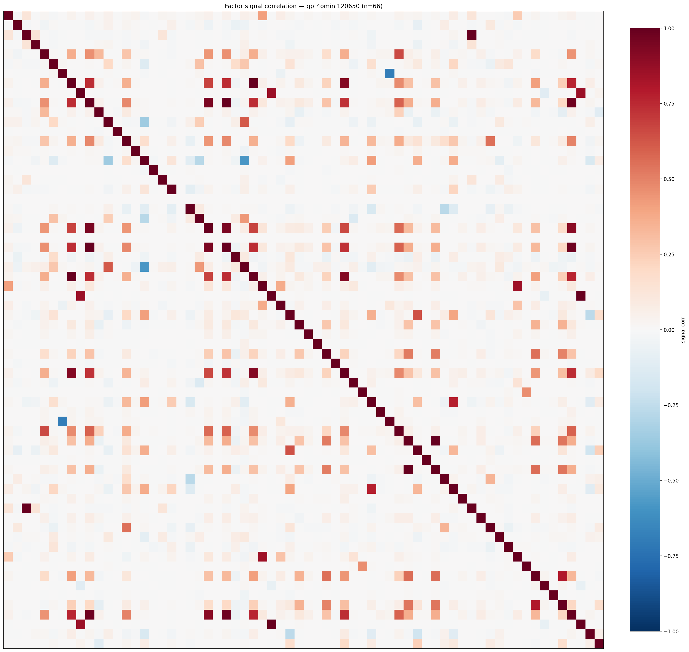

*Signal correlation matrix — gpt4omini120650*

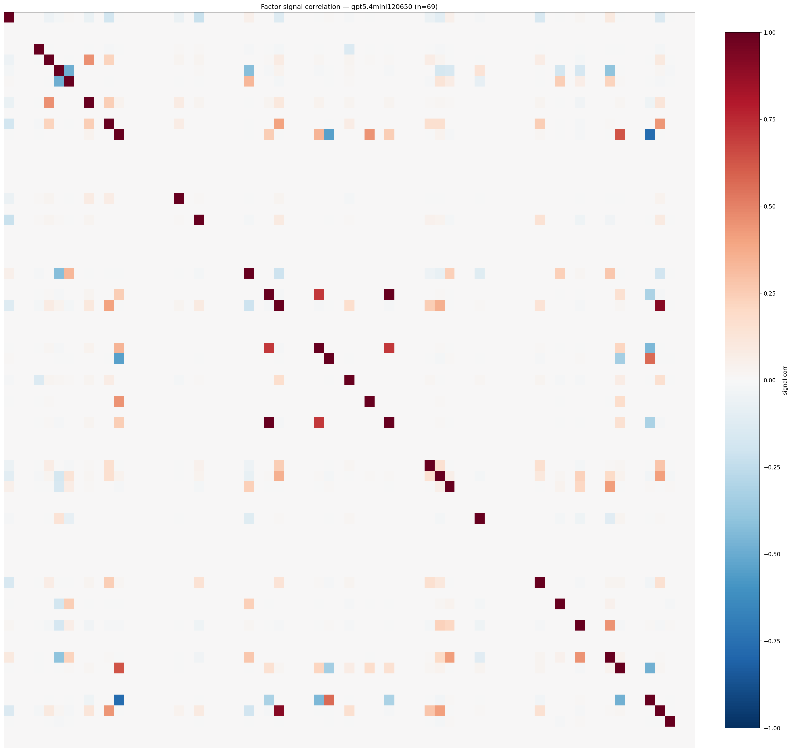

*Signal correlation matrix — gpt5.4mini120650*

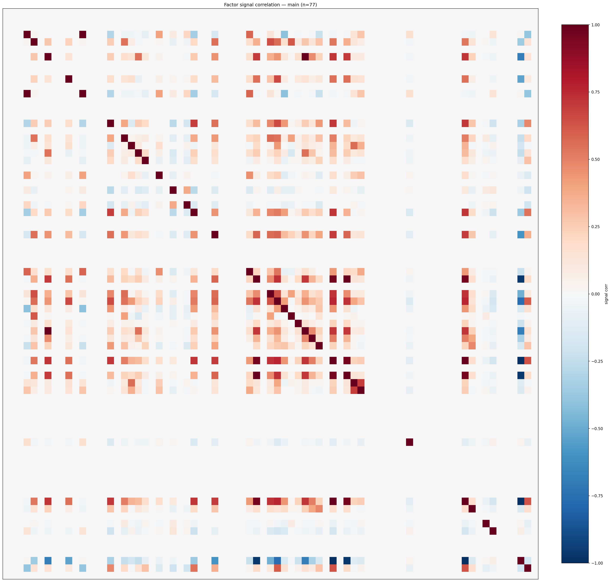

*Signal correlation matrix — main*

## 3. Deflation & model-based importance

`deflated_best_ic` haircuts each zoo's best |IC| for the number of factors tried (`ic_n_tested`) — a bigger zoo's best factor is more likely to be lucky. `lasso_n_nonzero` / `lasso_sparsity` show how many factors a sparse linear model actually keeps (model-view redundancy).

| prerun | best_ic | deflated_best_ic | deflated_best_t | ic_n_tested | ic_n_obs | lasso_n_nonzero | lasso_sparsity |
| --- | --- | --- | --- | --- | --- | --- | --- |
| gpt4omini120650 | 0.1402 | 0.1325 | 49.6798 | 64 | 140579 | 6 | 0.9091 |
| gpt5.4mini120650 | 0.1456 | 0.1387 | 51.9871 | 30 | 140579 | 0 | 1.0 |
| main | 0.1112 | 0.104 | 38.9979 | 36 | 140579 | 6 | 0.9221 |

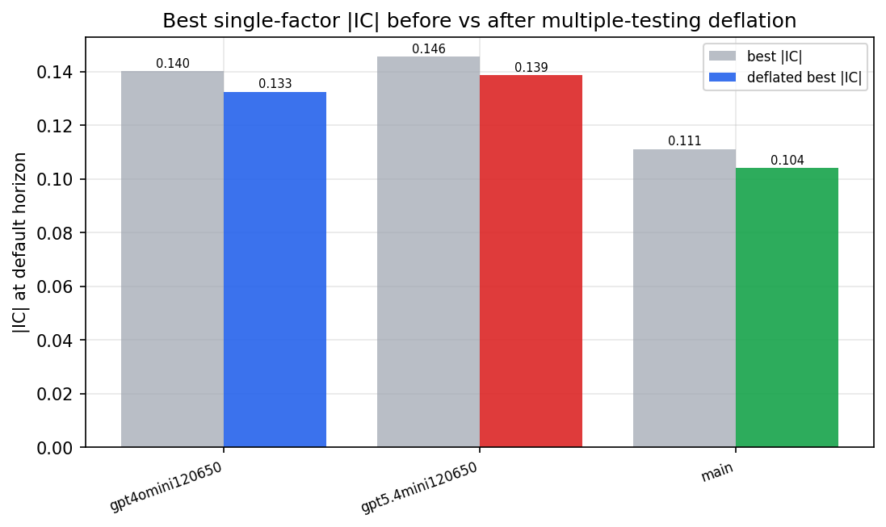

*Best |IC| before vs after multiple-testing deflation*

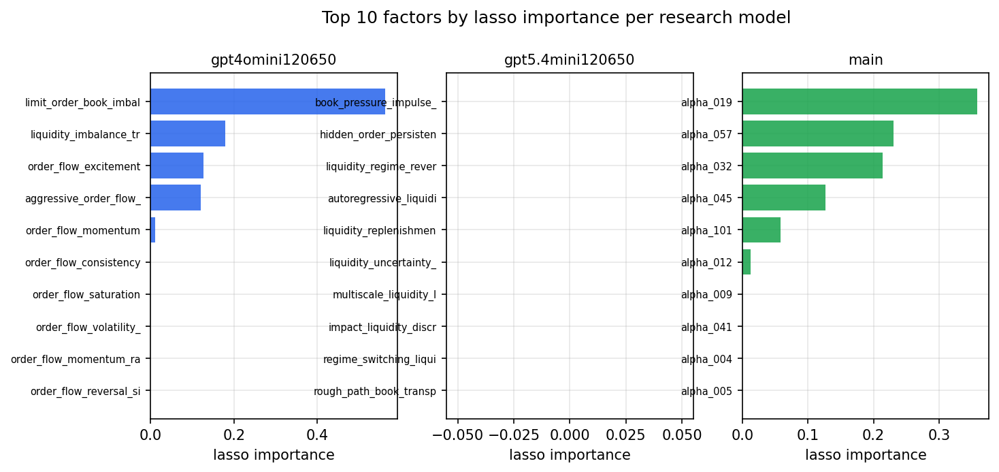

*Top factors by lasso importance per zoo*

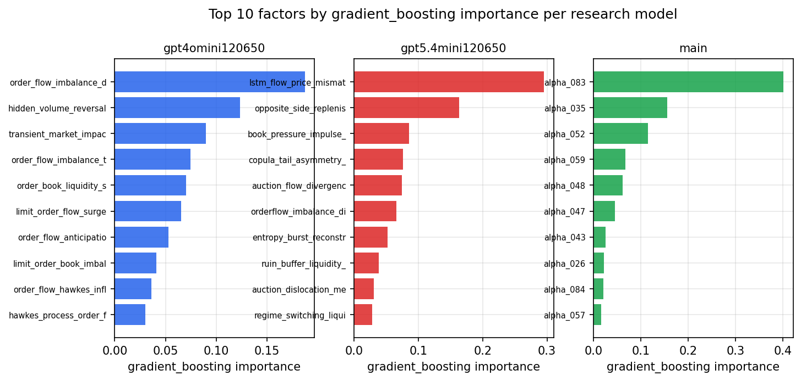

*Top factors by gradient_boosting importance per zoo*

## 4. ML-combined signal — per-underlying vectorised backtest

Each model combines a prerun's factors into ONE signal (fit `factors → forward return` on IS, predict per (bar, underlying)), then that combined signal is run through a simple vectorised backtest — `position(signal) × the underlying's own forward return` — on the held-out OOS tail (+ an equal-weight ensemble). No cross-sectional ranking.

> Config: position=**threshold** (t=1.0, z-score `expanding`), aggregation=**portfolio**, fit-standardise=**per_underlying**, horizon=6.

| prerun | model | n_factors_used | oos_ic | oos_sharpe | is_sharpe | oos_ann_return | oos_max_drawdown |
| --- | --- | --- | --- | --- | --- | --- | --- |
| gpt4omini120650 | linear_regression | 66 | 0.1915 | 59.1459 | 41.3499 | 0.6197 | -0.0009 |
| gpt4omini120650 | ridge | 66 | 0.194 | 61.1227 | 43.1147 | 0.6377 | -0.0009 |
| gpt4omini120650 | lasso | 66 | 0.1974 | 86.1574 | 55.9832 | 0.6519 | -0.0005 |
| gpt4omini120650 | elastic_net | 66 | 0.1974 | 86.1574 | 55.9832 | 0.6519 | -0.0005 |
| gpt4omini120650 | random_forest | 66 | 0.2007 | 83.959 | 36.8735 | 0.8404 | -0.0009 |
| gpt4omini120650 | gradient_boosting | 66 | 0.1806 | -3.9399 | 8.1509 | -0.0235 | -0.0029 |
| gpt4omini120650 | xgboost | 66 | 0.2058 | 2.4624 | 15.0853 | 0.0165 | -0.0015 |
| gpt4omini120650 | lightgbm | 66 | 0.2043 | 4.0389 | 15.2509 | 0.0364 | -0.0024 |
| gpt4omini120650 | ensemble | 66 | 0.2066 | 71.7419 | 29.5216 | 0.6839 | -0.0009 |
| gpt5.4mini120650 | linear_regression | 69 | 0.1868 | 53.7558 | 31.6896 | 0.6806 | -0.0018 |
| gpt5.4mini120650 | ridge | 69 | 0.1854 | 54.4304 | 31.7936 | 0.7035 | -0.0018 |
| gpt5.4mini120650 | lasso | 69 | 0.186 | 60.3219 | 34.5147 | 0.7456 | -0.0014 |
| gpt5.4mini120650 | elastic_net | 69 | 0.186 | 60.3219 | 34.5147 | 0.7456 | -0.0014 |
| gpt5.4mini120650 | random_forest | 69 | 0.2353 | 69.229 | 46.1785 | 0.9267 | -0.0018 |
| gpt5.4mini120650 | gradient_boosting | 69 | 0.2206 | -1.4859 | 10.1504 | -0.0055 | -0.0008 |
| gpt5.4mini120650 | xgboost | 69 | 0.2411 | 56.8079 | 26.4885 | 0.5304 | -0.0007 |
| gpt5.4mini120650 | lightgbm | 69 | 0.2421 | 53.3876 | 23.0511 | 0.3827 | -0.0007 |
| gpt5.4mini120650 | ensemble | 69 | 0.2307 | 75.6586 | 33.2325 | 0.8966 | -0.0018 |
| main | linear_regression | 77 | 0.0686 | 21.4229 | 12.7792 | 0.2557 | -0.0013 |
| main | ridge | 77 | 0.0719 | 19.8397 | 15.0985 | 0.2492 | -0.0016 |
| main | lasso | 77 | 0.0747 | 17.4642 | 16.5937 | 0.2637 | -0.002 |
| main | elastic_net | 77 | 0.0753 | 17.5639 | 16.6507 | 0.265 | -0.002 |
| main | random_forest | 77 | 0.0759 | 14.8547 | 16.9633 | 0.2026 | -0.0022 |
| main | gradient_boosting | 77 | 0.0666 | 3.9077 | 6.8981 | 0.0188 | -0.0006 |
| main | xgboost | 77 | 0.0661 | 1.1872 | 11.7612 | 0.0044 | -0.0011 |
| main | lightgbm | 77 | 0.0642 | -1.445 | 15.224 | -0.0111 | -0.0029 |
| main | ensemble | 77 | 0.0757 | 18.1471 | 17.4768 | 0.2263 | -0.0022 |

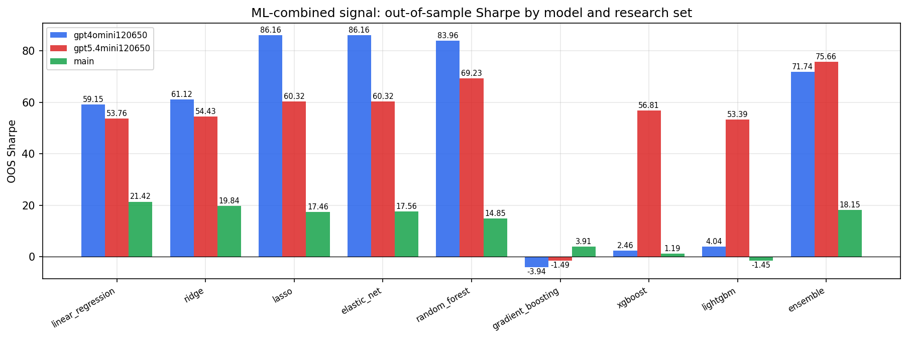

*ML-combined OOS Sharpe by model and research set*

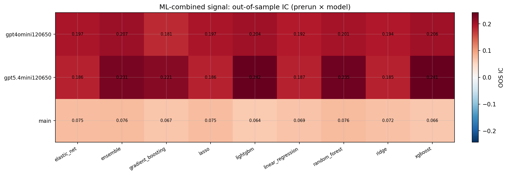

*ML-combined OOS IC (prerun × model)*

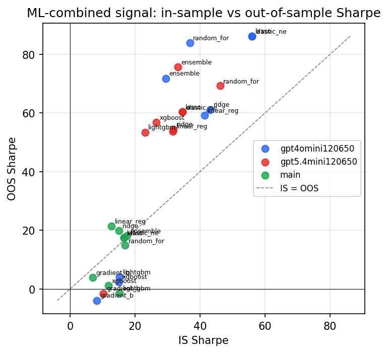

*IS vs OOS Sharpe (overfitting diagnostic)*

---
*Generated by `run_model_comparison.py`. Tables: `*.csv`; interactive: `comparison.ipynb`.*
