# Research-LLM factor comparison — `2026-02`

Comparing the **factor output of different research LLMs** on three axes (raw factor quality → factors as ML features → factors through the full agentic fund). The panel, IS/OOS split, horizon and model hyper-parameters are held identical across preruns — the *only* variable is the factor set.

## Preruns compared

| prerun | research_model | usable_factors | dropped_factors |
| --- | --- | --- | --- |
| gpt4omini120650 | gpt-4o-mini | 66 | 0 |
| gpt5.4mini120650 | gpt-5.4-mini | 69 | 0 |
| main | seed library | 77 | 11 |

> Dropped factors declare fields the current data doesn't have yet (e.g. fundamentals); they light up unchanged once that data is downloaded.

*Usable vs awaiting-data factors per research model*

## Key findings

- **Best ML-combined OOS Sharpe:** `gpt5.4mini120650` with `ensemble` (OOS Sharpe = 53.293).
- **Mean OOS Sharpe across models, by research set:** `gpt5.4mini120650` = 42.980, `gpt4omini120650` = 38.171, `main` = 11.244.
- **Highest mean single-factor |IC| (h=6):** `main` (mean |IC| = 0.0449).
- **Most diverse zoo (highest effective/raw factor ratio):** `gpt5.4mini120650` (eff 54.1 of 69, ratio 0.78).
- **Best selection-deflated single-factor |IC|:** `gpt5.4mini120650` (deflated |IC| = 0.1474 from 31 factors tried).

## 1. Single-factor IC (raw factor quality)

Per-underlying time-series Spearman rank-IC of every researched factor, recomputed on the shared panel at horizons h=1, h=6, h=60. The per-underlying IC correlates each factor's value vector with the underlying's own forward-return vector (pooled across underlyings); the cross-sectional IC ranks across underlyings per timestamp.

| prerun | n_factors | mean_abs_ic_1 | mean_abs_ic_6 | mean_abs_ic_60 | mean_abs_icir_6 | best_factor_h6 | best_abs_ic_h6 |
| --- | --- | --- | --- | --- | --- | --- | --- |
| gpt4omini120650 | 66 | 0.0437 | 0.0402 | 0.0209 | 1.9758 | limit_order_book_imbalance_surge | 0.144 |
| gpt5.4mini120650 | 69 | 0.026 | 0.0266 | 0.0154 | 1.9082 | orderflow_imbalance_divergence | 0.1544 |
| main | 77 | 0.0295 | 0.0449 | 0.0142 | 1.7954 | alpha_054 | 0.1226 |

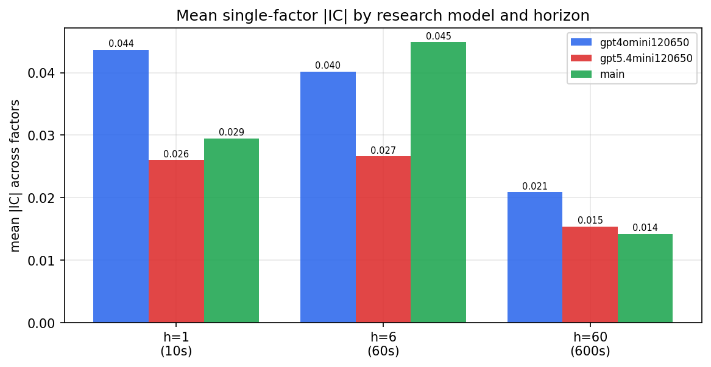

*Mean |IC| by research model and horizon*

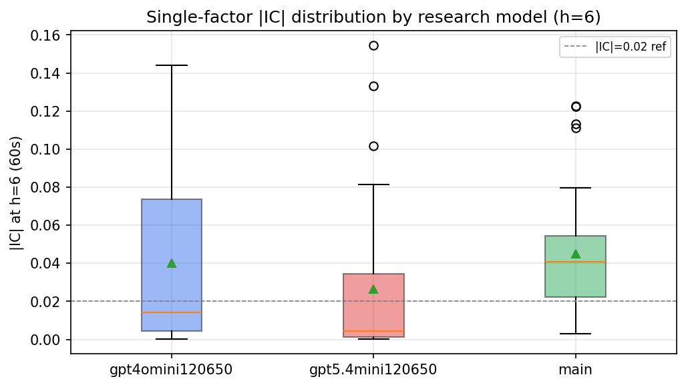

*Per-factor |IC| distribution by research model*

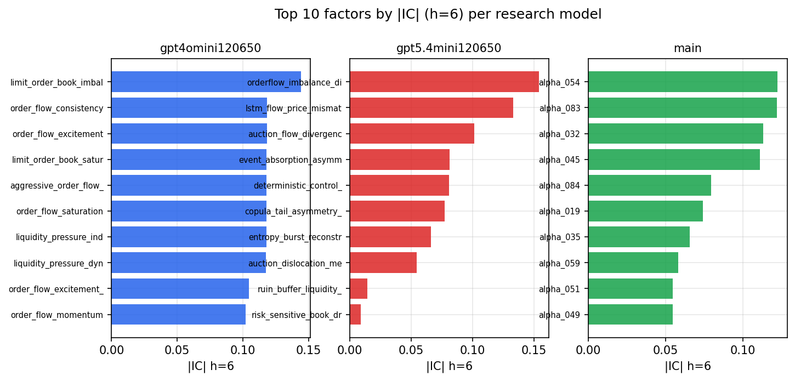

*Top factors by |IC| per research model*

## 2. Factor diversity & redundancy

Pairwise correlation of each zoo's *signals*. `eff_n_factors` is the effective number of independent factors (participation ratio of the correlation eigenvalues); `eff_ratio` and `redundancy` summarise how much unique information the zoo holds vs. how much is duplicated; `n_clusters` groups factors at |corr| ≥ 0.7.

| prerun | n_factors | eff_n_factors | eff_ratio | mean_abs_corr | n_clusters | redundancy |
| --- | --- | --- | --- | --- | --- | --- |
| gpt4omini120650 | 66 | 31.1178 | 0.4715 | 0.0422 | 53 | 0.5285 |
| gpt5.4mini120650 | 69 | 54.1198 | 0.7843 | 0.0115 | 65 | 0.2157 |
| main | 77 | 29.6256 | 0.3847 | 0.0464 | 63 | 0.6153 |

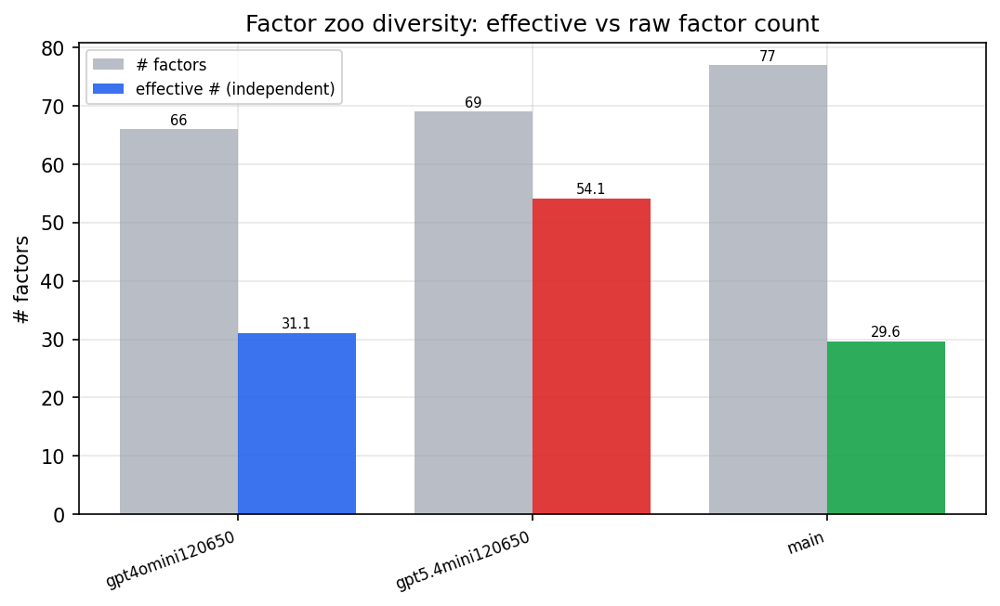

*Effective vs raw factor count per research model*

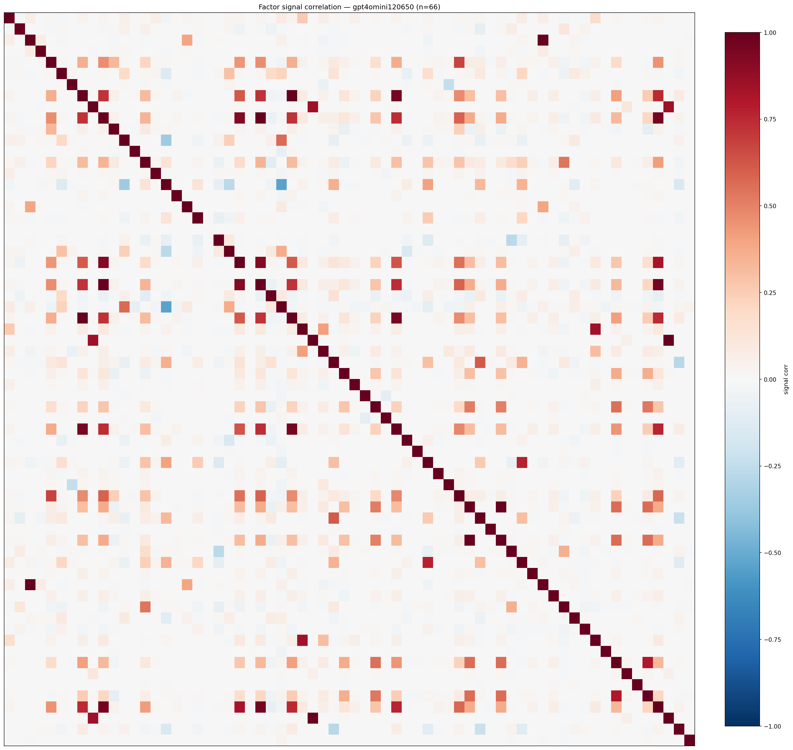

*Signal correlation matrix — gpt4omini120650*

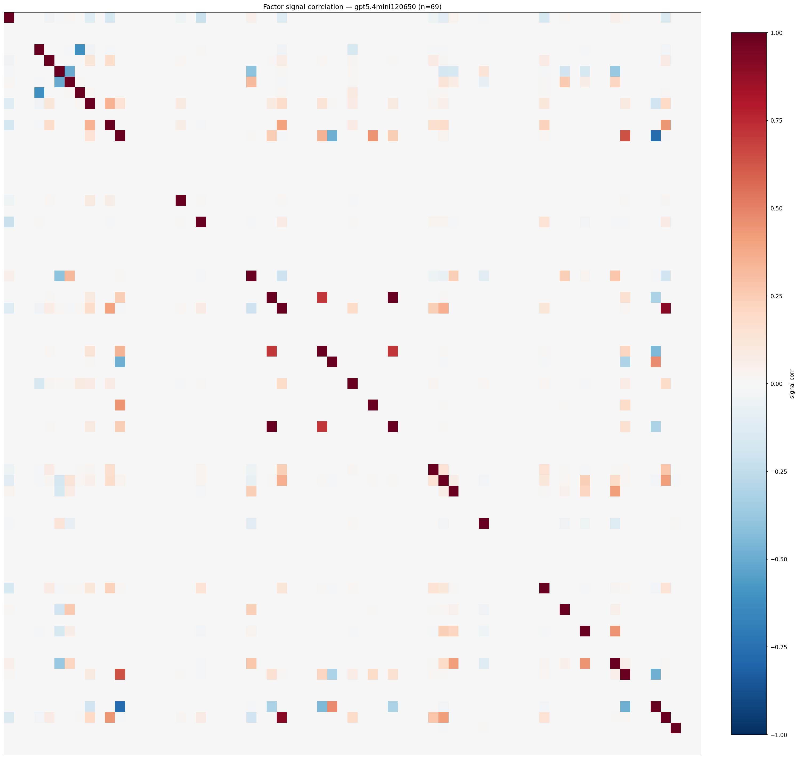

*Signal correlation matrix — gpt5.4mini120650*

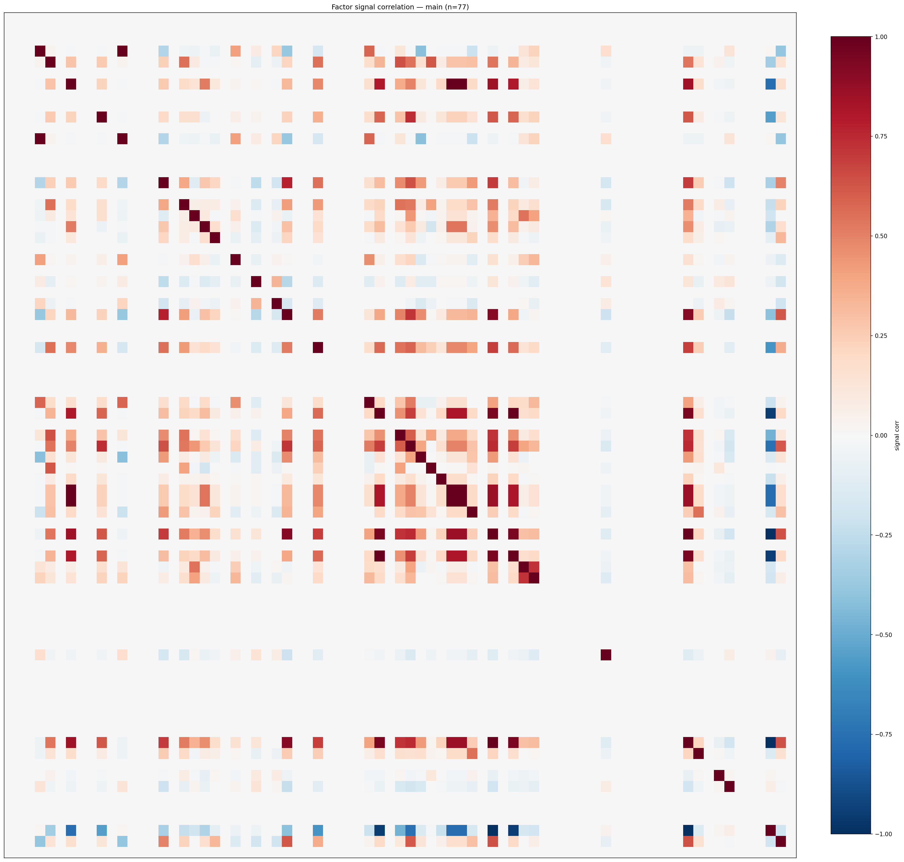

*Signal correlation matrix — main*

## 3. Deflation & model-based importance

`deflated_best_ic` haircuts each zoo's best |IC| for the number of factors tried (`ic_n_tested`) — a bigger zoo's best factor is more likely to be lucky. `lasso_n_nonzero` / `lasso_sparsity` show how many factors a sparse linear model actually keeps (model-view redundancy).

| prerun | best_ic | deflated_best_ic | deflated_best_t | ic_n_tested | ic_n_obs | lasso_n_nonzero | lasso_sparsity |
| --- | --- | --- | --- | --- | --- | --- | --- |
| gpt4omini120650 | 0.144 | 0.1363 | 51.3158 | 64 | 141659 | 12 | 0.8182 |
| gpt5.4mini120650 | 0.1544 | 0.1474 | 55.4906 | 31 | 141659 | 8 | 0.8841 |
| main | 0.1226 | 0.1155 | 43.4807 | 36 | 141659 | 14 | 0.8182 |

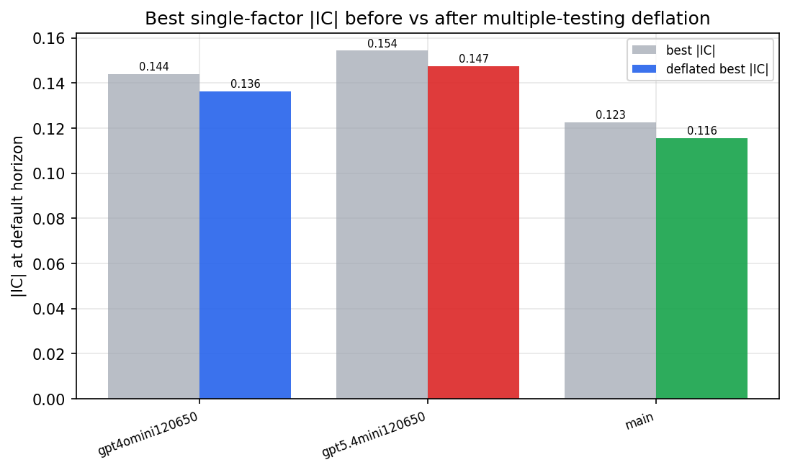

*Best |IC| before vs after multiple-testing deflation*

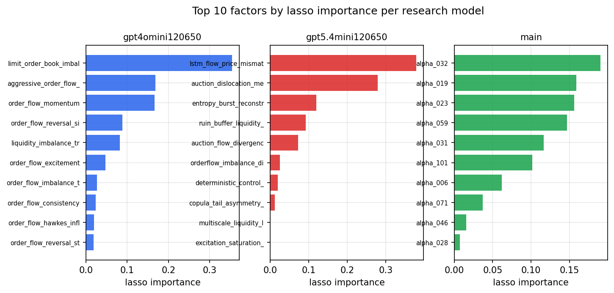

*Top factors by lasso importance per zoo*

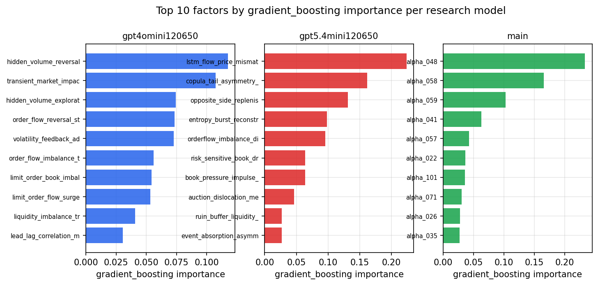

*Top factors by gradient_boosting importance per zoo*

## 4. ML-combined signal — per-underlying vectorised backtest

Each model combines a prerun's factors into ONE signal (fit `factors → forward return` on IS, predict per (bar, underlying)), then that combined signal is run through a simple vectorised backtest — `position(signal) × the underlying's own forward return` — on the held-out OOS tail (+ an equal-weight ensemble). No cross-sectional ranking.

> Config: position=**threshold** (t=1.0, z-score `expanding`), aggregation=**portfolio**, fit-standardise=**per_underlying**, horizon=6.

| prerun | model | n_factors_used | oos_ic | oos_sharpe | is_sharpe | oos_ann_return | oos_max_drawdown |
| --- | --- | --- | --- | --- | --- | --- | --- |
| gpt4omini120650 | linear_regression | 66 | 0.2078 | 45.1155 | 59.2548 | 0.6618 | -0.0018 |
| gpt4omini120650 | ridge | 66 | 0.2071 | 39.9248 | 58.5951 | 0.6607 | -0.0023 |
| gpt4omini120650 | lasso | 66 | 0.1985 | 52.7409 | 59.7926 | 0.711 | -0.001 |
| gpt4omini120650 | elastic_net | 66 | 0.1985 | 52.7409 | 59.7926 | 0.711 | -0.001 |
| gpt4omini120650 | random_forest | 66 | 0.2151 | 44.0889 | 50.4565 | 0.8406 | -0.0026 |
| gpt4omini120650 | gradient_boosting | 66 | 0.1969 | 26.0189 | 25.7262 | 0.1612 | -0.0005 |
| gpt4omini120650 | xgboost | 66 | 0.2237 | 31.6283 | 36.2899 | 0.5812 | -0.0026 |
| gpt4omini120650 | lightgbm | 66 | 0.2252 | 16.276 | 28.4013 | 0.2561 | -0.0028 |
| gpt4omini120650 | ensemble | 66 | 0.2161 | 35.0054 | 41.1881 | 0.698 | -0.0027 |
| gpt5.4mini120650 | linear_regression | 69 | 0.2013 | 40.2449 | 41.5961 | 0.5897 | -0.0021 |
| gpt5.4mini120650 | ridge | 69 | 0.201 | 40.2553 | 40.8955 | 0.5906 | -0.0021 |
| gpt5.4mini120650 | lasso | 69 | 0.2021 | 43.1563 | 40.5629 | 0.6072 | -0.0016 |
| gpt5.4mini120650 | elastic_net | 69 | 0.2013 | 43.7293 | 41.5128 | 0.616 | -0.0016 |
| gpt5.4mini120650 | random_forest | 69 | 0.2356 | 51.2869 | 55.9072 | 0.8525 | -0.0026 |
| gpt5.4mini120650 | gradient_boosting | 69 | 0.2274 | 29.8562 | 49.0488 | 0.2443 | -0.0011 |
| gpt5.4mini120650 | xgboost | 69 | 0.249 | 44.7152 | 48.7667 | 0.6861 | -0.0021 |
| gpt5.4mini120650 | lightgbm | 69 | 0.2516 | 40.2841 | 41.1828 | 0.5458 | -0.0021 |
| gpt5.4mini120650 | ensemble | 69 | 0.2403 | 53.2934 | 50.0214 | 0.7892 | -0.0022 |
| main | linear_regression | 77 | 0.0693 | 17.0573 | 21.2051 | 0.236 | -0.0017 |
| main | ridge | 77 | 0.0691 | 17.1882 | 20.9782 | 0.239 | -0.0017 |
| main | lasso | 77 | 0.0802 | 18.1444 | 22.0137 | 0.296 | -0.0018 |
| main | elastic_net | 77 | 0.0802 | 18.1444 | 22.0137 | 0.296 | -0.0018 |
| main | random_forest | 77 | 0.0782 | 15.6468 | 22.1572 | 0.224 | -0.0012 |
| main | gradient_boosting | 77 | 0.0822 | -0.7167 | 15.3086 | -0.0055 | -0.003 |
| main | xgboost | 77 | 0.0667 | 0.6136 | 21.5014 | 0.0083 | -0.0033 |
| main | lightgbm | 77 | 0.0724 | 0.8023 | 20.148 | 0.0081 | -0.002 |
| main | ensemble | 77 | 0.076 | 14.3195 | 22.7604 | 0.2296 | -0.0017 |

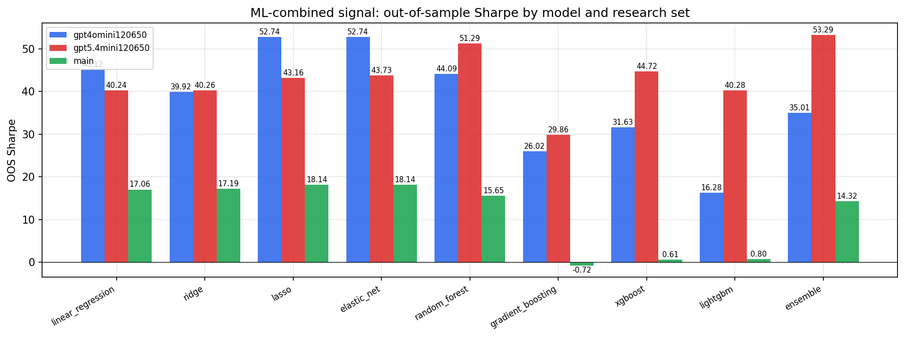

*ML-combined OOS Sharpe by model and research set*

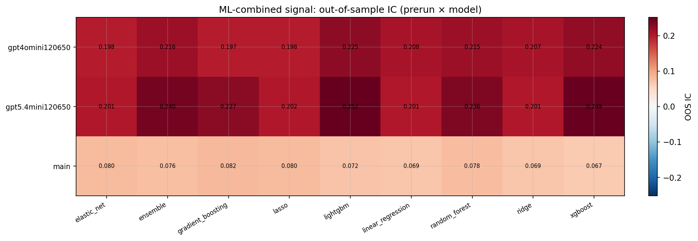

*ML-combined OOS IC (prerun × model)*

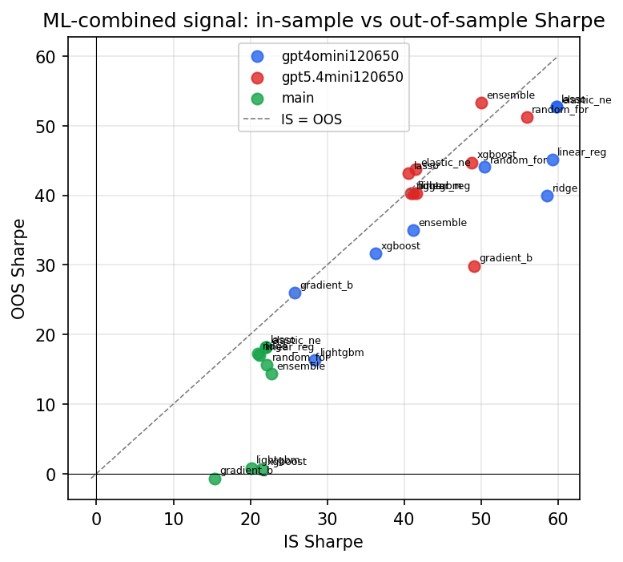

*IS vs OOS Sharpe (overfitting diagnostic)*

---
*Generated by `run_model_comparison.py`. Tables: `*.csv`; interactive: `comparison.ipynb`.*
