# Research-LLM factor comparison — `2026-03`

Comparing the **factor output of different research LLMs** on three axes (raw factor quality → factors as ML features → factors through the full agentic fund). The panel, IS/OOS split, horizon and model hyper-parameters are held identical across preruns — the *only* variable is the factor set.

## Preruns compared

| prerun | research_model | usable_factors | dropped_factors |
| --- | --- | --- | --- |
| gpt4omini120650 | gpt-4o-mini | 66 | 0 |
| gpt5.4mini120650 | gpt-5.4-mini | 69 | 0 |
| main | seed library | 77 | 11 |

> Dropped factors declare fields the current data doesn't have yet (e.g. fundamentals); they light up unchanged once that data is downloaded.

*Usable vs awaiting-data factors per research model*

## Key findings

- **Best ML-combined OOS Sharpe:** `gpt4omini120650` with `lasso` (OOS Sharpe = 53.415).
- **Mean OOS Sharpe across models, by research set:** `gpt5.4mini120650` = 34.220, `gpt4omini120650` = 33.595, `main` = 2.819.
- **Highest mean single-factor |IC| (h=6):** `gpt4omini120650` (mean |IC| = 0.0408).
- **Most diverse zoo (highest effective/raw factor ratio):** `gpt5.4mini120650` (eff 54.7 of 69, ratio 0.79).
- **Best selection-deflated single-factor |IC|:** `gpt5.4mini120650` (deflated |IC| = 0.1321 from 31 factors tried).

## 1. Single-factor IC (raw factor quality)

Per-underlying time-series Spearman rank-IC of every researched factor, recomputed on the shared panel at horizons h=1, h=6, h=60. The per-underlying IC correlates each factor's value vector with the underlying's own forward-return vector (pooled across underlyings); the cross-sectional IC ranks across underlyings per timestamp.

| prerun | n_factors | mean_abs_ic_1 | mean_abs_ic_6 | mean_abs_ic_60 | mean_abs_icir_6 | best_factor_h6 | best_abs_ic_h6 |
| --- | --- | --- | --- | --- | --- | --- | --- |
| gpt4omini120650 | 66 | 0.0486 | 0.0408 | 0.0184 | 2.4777 | limit_order_book_imbalance_surge | 0.132 |
| gpt5.4mini120650 | 69 | 0.0284 | 0.0269 | 0.0142 | 1.9077 | lstm_flow_price_mismatch | 0.139 |
| main | 77 | 0.0326 | 0.0321 | 0.0117 | 1.4284 | alpha_054 | 0.0961 |

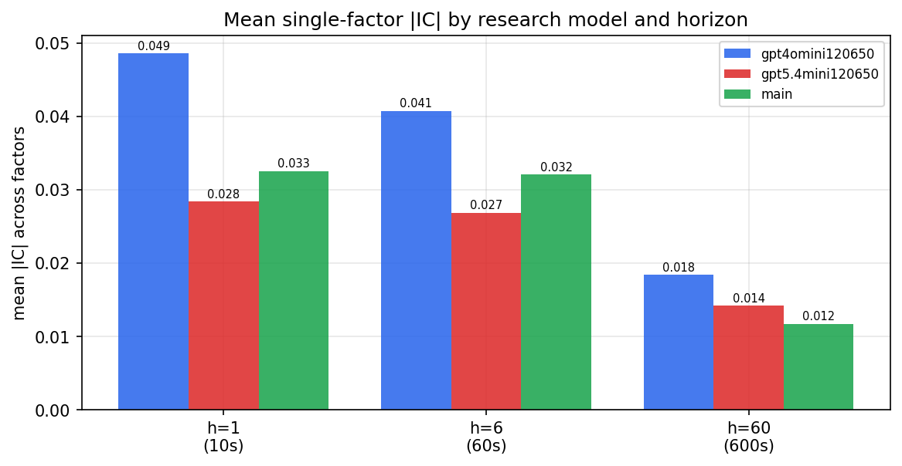

*Mean |IC| by research model and horizon*

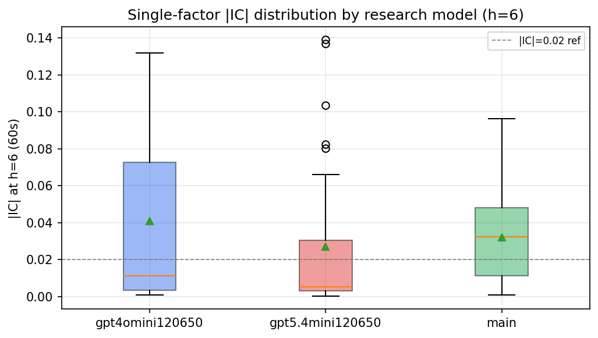

*Per-factor |IC| distribution by research model*

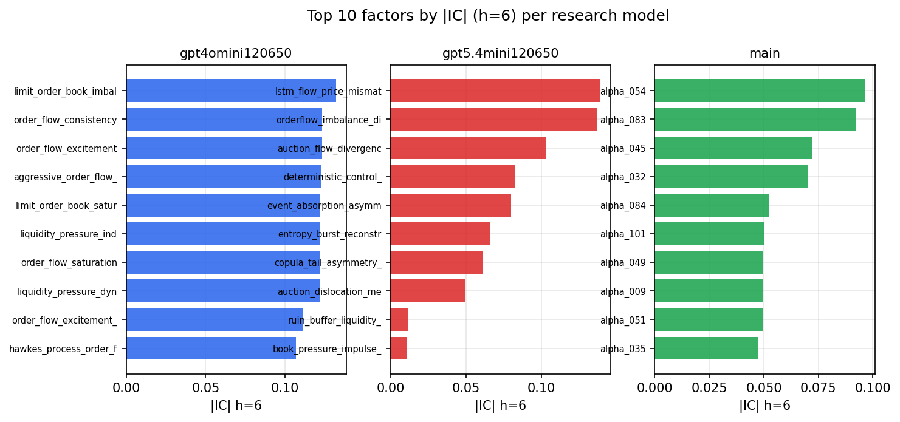

*Top factors by |IC| per research model*

## 2. Factor diversity & redundancy

Pairwise correlation of each zoo's *signals*. `eff_n_factors` is the effective number of independent factors (participation ratio of the correlation eigenvalues); `eff_ratio` and `redundancy` summarise how much unique information the zoo holds vs. how much is duplicated; `n_clusters` groups factors at |corr| ≥ 0.7.

| prerun | n_factors | eff_n_factors | eff_ratio | mean_abs_corr | n_clusters | redundancy |
| --- | --- | --- | --- | --- | --- | --- |
| gpt4omini120650 | 66 | 29.9827 | 0.4543 | 0.043 | 52 | 0.5457 |
| gpt5.4mini120650 | 69 | 54.6657 | 0.7923 | 0.0111 | 65 | 0.2077 |
| main | 77 | 33.8795 | 0.44 | 0.0407 | 67 | 0.56 |

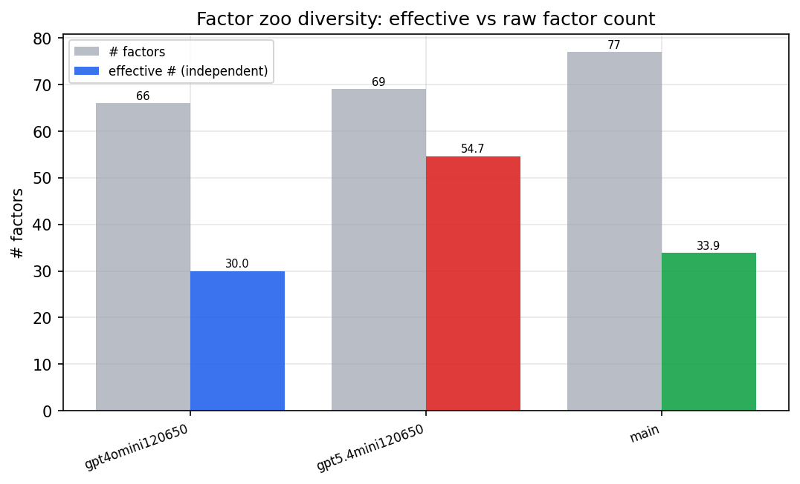

*Effective vs raw factor count per research model*

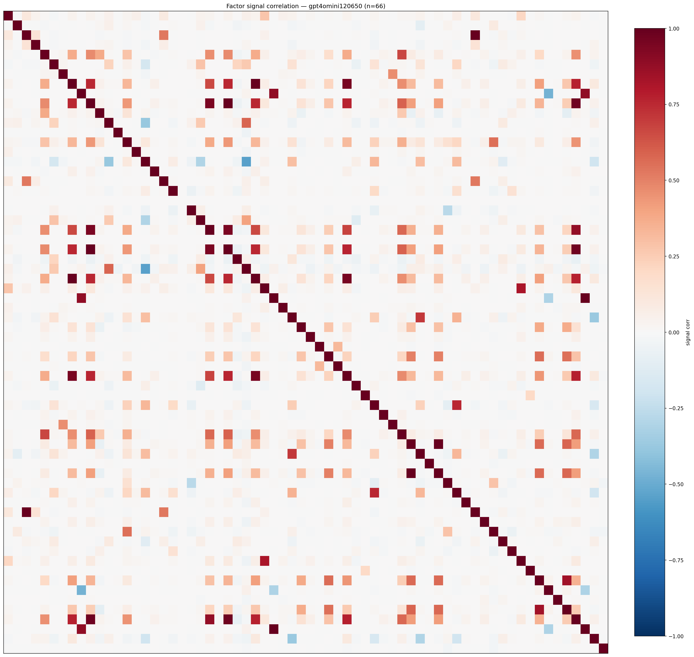

*Signal correlation matrix — gpt4omini120650*

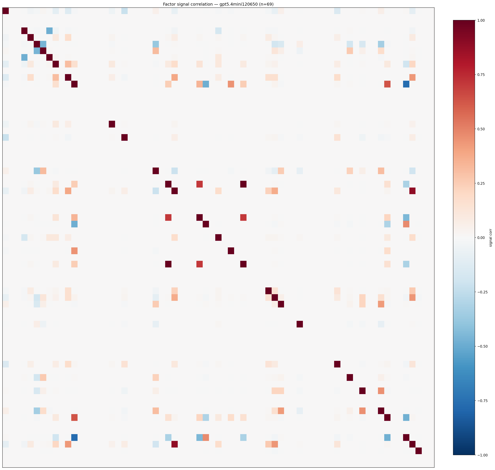

*Signal correlation matrix — gpt5.4mini120650*

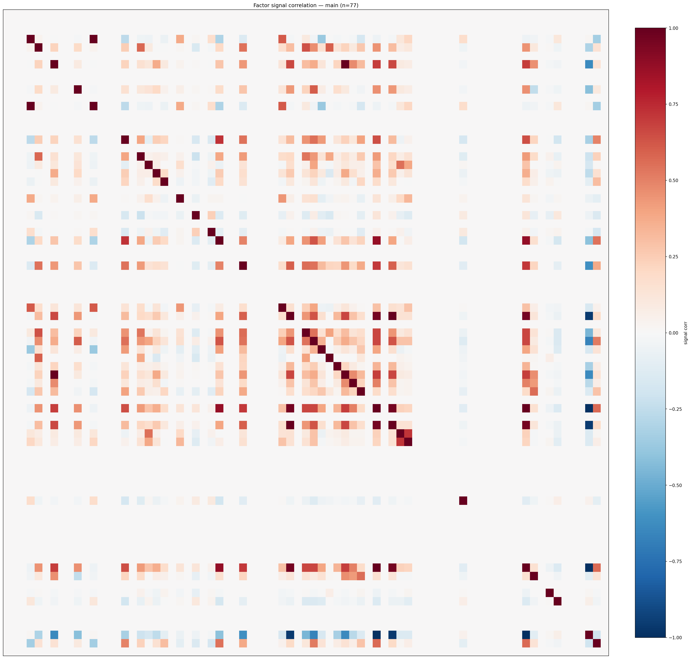

*Signal correlation matrix — main*

## 3. Deflation & model-based importance

`deflated_best_ic` haircuts each zoo's best |IC| for the number of factors tried (`ic_n_tested`) — a bigger zoo's best factor is more likely to be lucky. `lasso_n_nonzero` / `lasso_sparsity` show how many factors a sparse linear model actually keeps (model-view redundancy).

| prerun | best_ic | deflated_best_ic | deflated_best_t | ic_n_tested | ic_n_obs | lasso_n_nonzero | lasso_sparsity |
| --- | --- | --- | --- | --- | --- | --- | --- |
| gpt4omini120650 | 0.132 | 0.1243 | 46.9741 | 64 | 142739 | 8 | 0.8788 |
| gpt5.4mini120650 | 0.139 | 0.1321 | 49.8952 | 31 | 142739 | 17 | 0.7536 |
| main | 0.0961 | 0.089 | 33.6408 | 36 | 142739 | 0 | 1.0 |

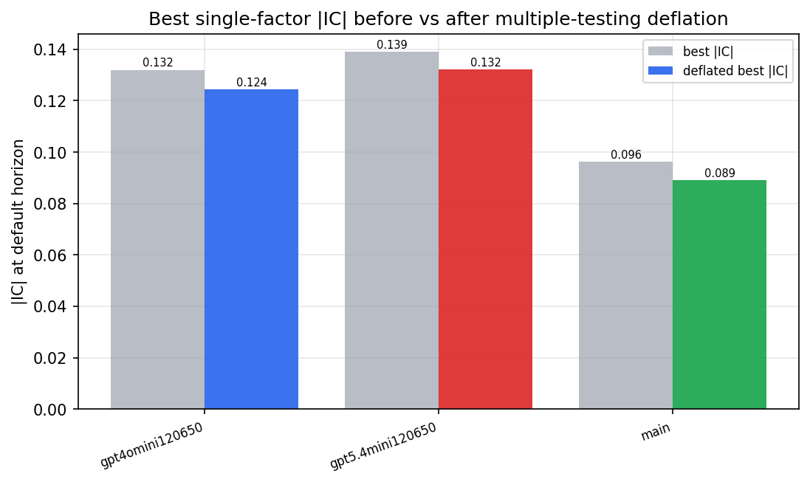

*Best |IC| before vs after multiple-testing deflation*

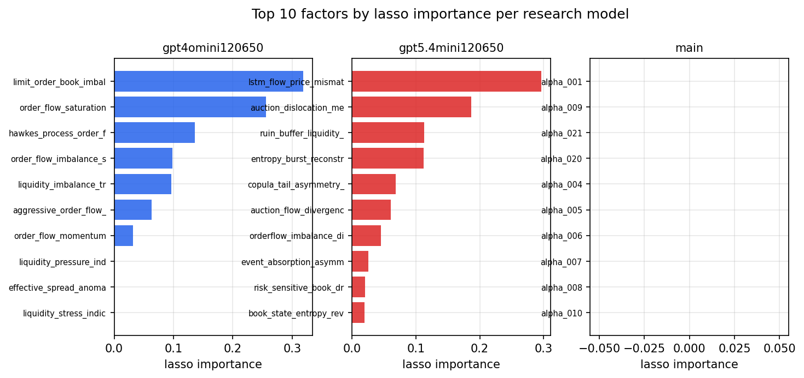

*Top factors by lasso importance per zoo*

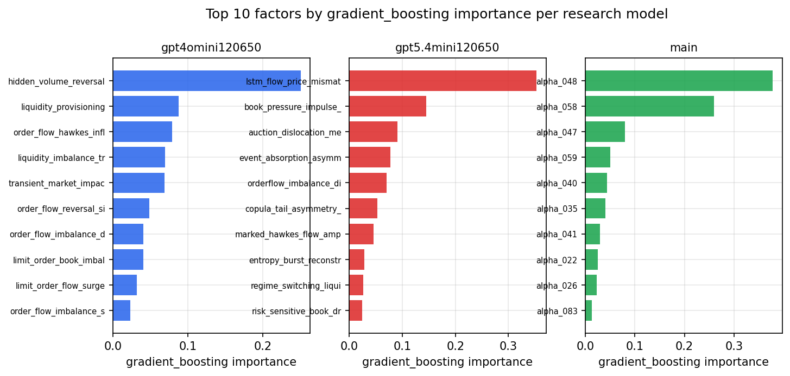

*Top factors by gradient_boosting importance per zoo*

## 4. ML-combined signal — per-underlying vectorised backtest

Each model combines a prerun's factors into ONE signal (fit `factors → forward return` on IS, predict per (bar, underlying)), then that combined signal is run through a simple vectorised backtest — `position(signal) × the underlying's own forward return` — on the held-out OOS tail (+ an equal-weight ensemble). No cross-sectional ranking.

> Config: position=**threshold** (t=1.0, z-score `expanding`), aggregation=**portfolio**, fit-standardise=**per_underlying**, horizon=6.

| prerun | model | n_factors_used | oos_ic | oos_sharpe | is_sharpe | oos_ann_return | oos_max_drawdown |
| --- | --- | --- | --- | --- | --- | --- | --- |
| gpt4omini120650 | linear_regression | 66 | 0.1647 | 47.358 | 44.7576 | 0.6189 | -0.0007 |
| gpt4omini120650 | ridge | 66 | 0.1665 | 45.3705 | 43.445 | 0.6328 | -0.0007 |
| gpt4omini120650 | lasso | 66 | 0.1598 | 53.4154 | 60.016 | 1.1125 | -0.0009 |
| gpt4omini120650 | elastic_net | 66 | 0.1598 | 53.4154 | 60.016 | 1.1125 | -0.0009 |
| gpt4omini120650 | random_forest | 66 | 0.1579 | 41.1878 | 40.4833 | 0.9699 | -0.0017 |
| gpt4omini120650 | gradient_boosting | 66 | 0.1436 | 7.5964 | 13.7461 | 0.148 | -0.0031 |
| gpt4omini120650 | xgboost | 66 | 0.1644 | 11.7998 | 24.7072 | 0.303 | -0.0024 |
| gpt4omini120650 | lightgbm | 66 | 0.1526 | 10.7163 | 21.9716 | 0.3202 | -0.004 |
| gpt4omini120650 | ensemble | 66 | 0.1644 | 31.4934 | 36.5898 | 0.9999 | -0.0018 |
| gpt5.4mini120650 | linear_regression | 69 | 0.1748 | 39.998 | 28.1422 | 1.1169 | -0.0015 |
| gpt5.4mini120650 | ridge | 69 | 0.1749 | 39.7454 | 28.1529 | 1.1248 | -0.0015 |
| gpt5.4mini120650 | lasso | 69 | 0.1763 | 39.0455 | 27.6709 | 1.136 | -0.0015 |
| gpt5.4mini120650 | elastic_net | 69 | 0.1764 | 40.742 | 27.6788 | 1.143 | -0.0015 |
| gpt5.4mini120650 | random_forest | 69 | 0.192 | 47.5819 | 44.1193 | 1.3842 | -0.0016 |
| gpt5.4mini120650 | gradient_boosting | 69 | 0.1761 | 6.418 | 19.6845 | 0.1109 | -0.0024 |
| gpt5.4mini120650 | xgboost | 69 | 0.1971 | 31.3639 | 30.5887 | 0.6157 | -0.0015 |
| gpt5.4mini120650 | lightgbm | 69 | 0.1892 | 17.5829 | 26.1915 | 0.2887 | -0.0018 |
| gpt5.4mini120650 | ensemble | 69 | 0.1972 | 45.502 | 36.6369 | 1.2122 | -0.0015 |
| main | linear_regression | 77 | 0.0296 | 5.2077 | 21.6407 | 0.0609 | -0.0023 |
| main | ridge | 77 | 0.0337 | 3.8812 | 21.461 | 0.1002 | -0.0045 |
| main | lasso | 77 | 0.0337 | 1.1266 | 20.2778 | 0.0399 | -0.0085 |
| main | elastic_net | 77 | 0.0342 | 1.2295 | 20.3935 | 0.0434 | -0.0085 |
| main | random_forest | 77 | 0.0252 | 3.1694 | 18.3496 | 0.1059 | -0.0068 |
| main | gradient_boosting | 77 | 0.0283 | 3.9656 | 13.2282 | 0.0711 | -0.0053 |
| main | xgboost | 77 | 0.0309 | 3.2721 | 15.4636 | 0.0721 | -0.0061 |
| main | lightgbm | 77 | 0.0282 | 0.3676 | 17.3785 | 0.0046 | -0.0041 |
| main | ensemble | 77 | 0.0314 | 3.1481 | 20.7496 | 0.0947 | -0.0072 |

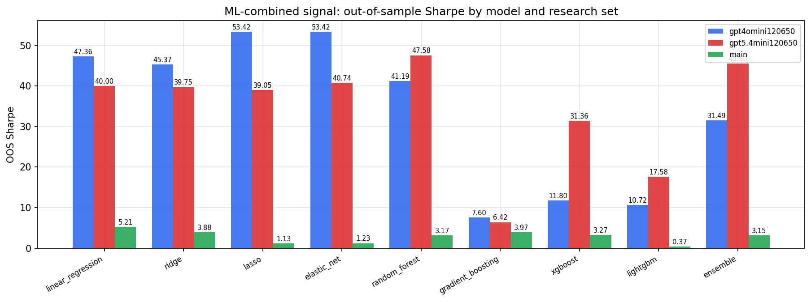

*ML-combined OOS Sharpe by model and research set*

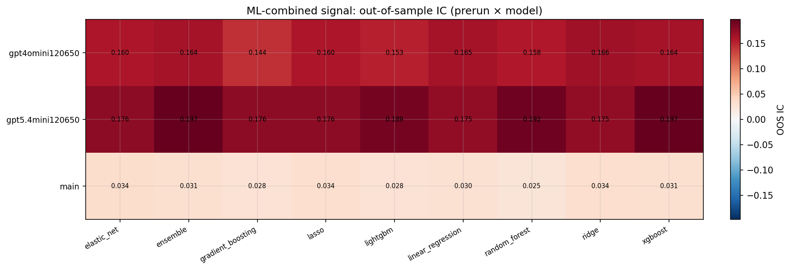

*ML-combined OOS IC (prerun × model)*

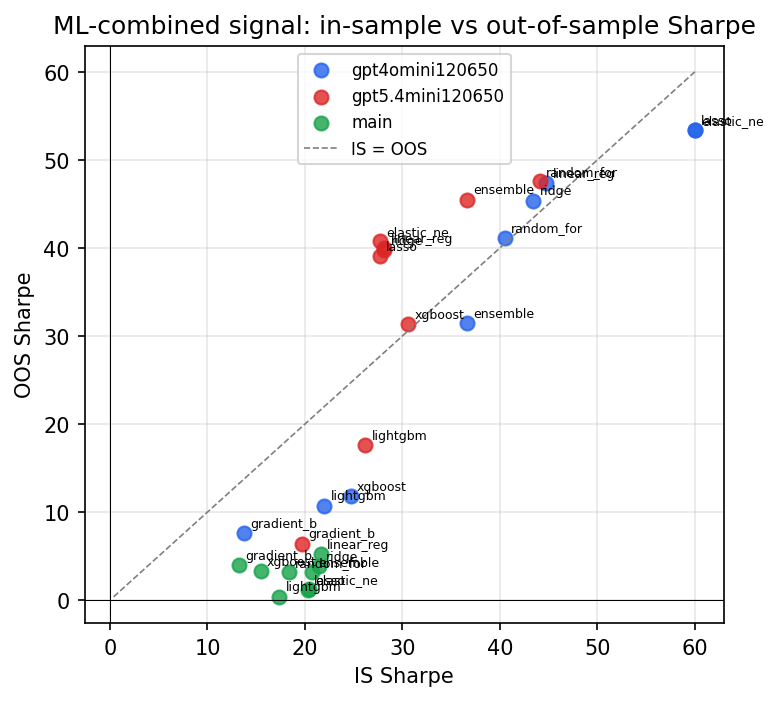

*IS vs OOS Sharpe (overfitting diagnostic)*

---
*Generated by `run_model_comparison.py`. Tables: `*.csv`; interactive: `comparison.ipynb`.*
