# Research-LLM factor comparison — `2026-04`

Comparing the **factor output of different research LLMs** on three axes (raw factor quality → factors as ML features → factors through the full agentic fund). The panel, IS/OOS split, horizon and model hyper-parameters are held identical across preruns — the *only* variable is the factor set.

## Preruns compared

| prerun | research_model | usable_factors | dropped_factors |
| --- | --- | --- | --- |
| gpt4omini120650 | gpt-4o-mini | 66 | 0 |
| gpt5.4mini120650 | gpt-5.4-mini | 69 | 0 |
| main | seed library | 77 | 11 |

> Dropped factors declare fields the current data doesn't have yet (e.g. fundamentals); they light up unchanged once that data is downloaded.

*Usable vs awaiting-data factors per research model*

## Key findings

- **Best ML-combined OOS Sharpe:** `gpt4omini120650` with `random_forest` (OOS Sharpe = 45.747).
- **Mean OOS Sharpe across models, by research set:** `gpt4omini120650` = 14.585, `gpt5.4mini120650` = 14.446, `main` = 5.972.
- **Highest mean single-factor |IC| (h=6):** `gpt4omini120650` (mean |IC| = 0.0368).
- **Most diverse zoo (highest effective/raw factor ratio):** `gpt5.4mini120650` (eff 55.0 of 69, ratio 0.80).
- **Best selection-deflated single-factor |IC|:** `gpt4omini120650` (deflated |IC| = 0.1251 from 64 factors tried).

## 1. Single-factor IC (raw factor quality)

Per-underlying time-series Spearman rank-IC of every researched factor, recomputed on the shared panel at horizons h=1, h=6, h=60. The per-underlying IC correlates each factor's value vector with the underlying's own forward-return vector (pooled across underlyings); the cross-sectional IC ranks across underlyings per timestamp.

| prerun | n_factors | mean_abs_ic_1 | mean_abs_ic_6 | mean_abs_ic_60 | mean_abs_icir_6 | best_factor_h6 | best_abs_ic_h6 |
| --- | --- | --- | --- | --- | --- | --- | --- |
| gpt4omini120650 | 66 | 0.0472 | 0.0368 | 0.016 | 1.8798 | limit_order_book_imbalance_surge | 0.1326 |
| gpt5.4mini120650 | 69 | 0.0278 | 0.0243 | 0.011 | 1.5282 | orderflow_imbalance_divergence | 0.1253 |
| main | 77 | 0.0332 | 0.0321 | 0.0121 | 1.4799 | alpha_054 | 0.0927 |

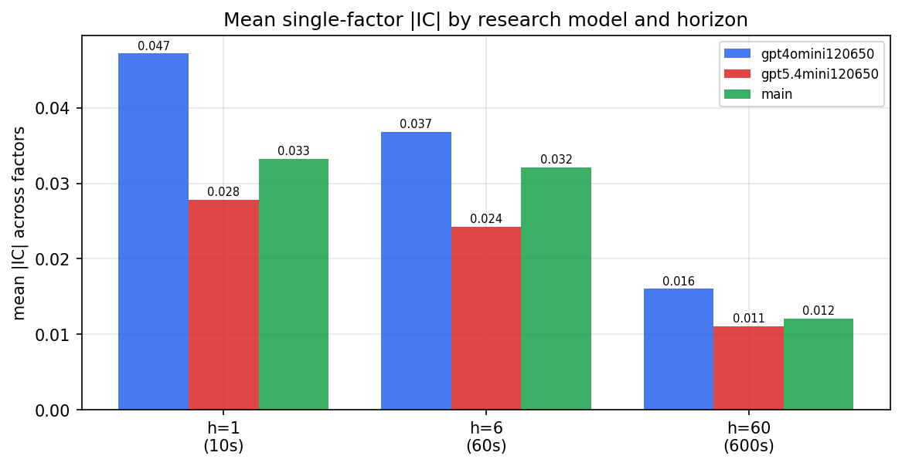

*Mean |IC| by research model and horizon*

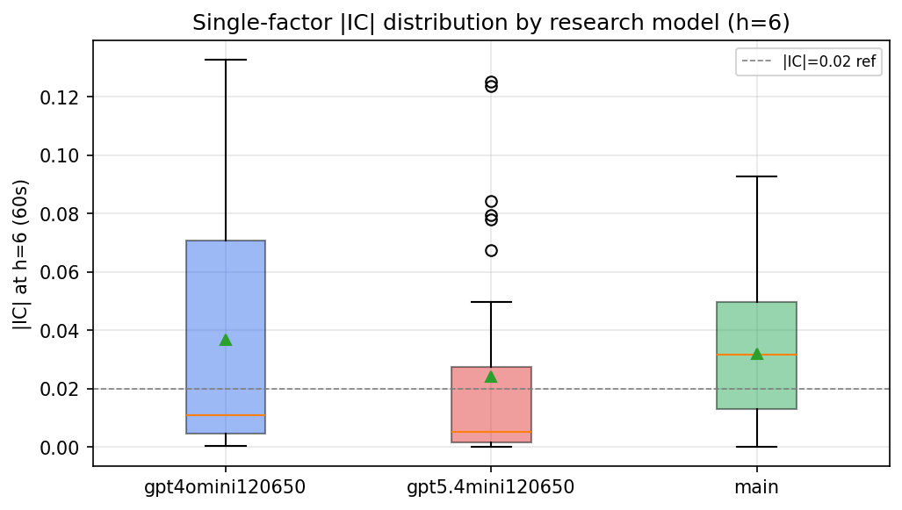

*Per-factor |IC| distribution by research model*

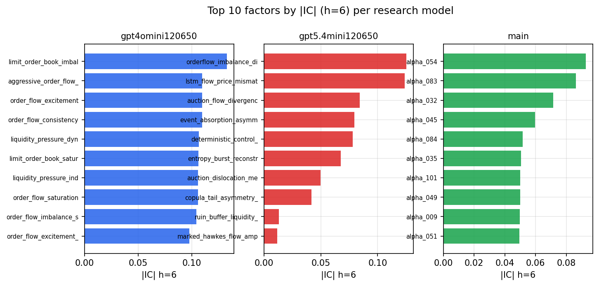

*Top factors by |IC| per research model*

## 2. Factor diversity & redundancy

Pairwise correlation of each zoo's *signals*. `eff_n_factors` is the effective number of independent factors (participation ratio of the correlation eigenvalues); `eff_ratio` and `redundancy` summarise how much unique information the zoo holds vs. how much is duplicated; `n_clusters` groups factors at |corr| ≥ 0.7.

| prerun | n_factors | eff_n_factors | eff_ratio | mean_abs_corr | n_clusters | redundancy |
| --- | --- | --- | --- | --- | --- | --- |
| gpt4omini120650 | 66 | 29.5464 | 0.4477 | 0.0435 | 51 | 0.5523 |
| gpt5.4mini120650 | 69 | 54.9862 | 0.7969 | 0.011 | 65 | 0.2031 |
| main | 77 | 34.6103 | 0.4495 | 0.0396 | 67 | 0.5505 |

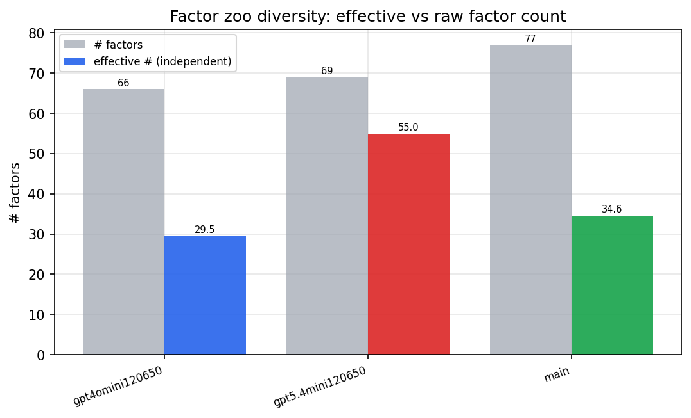

*Effective vs raw factor count per research model*

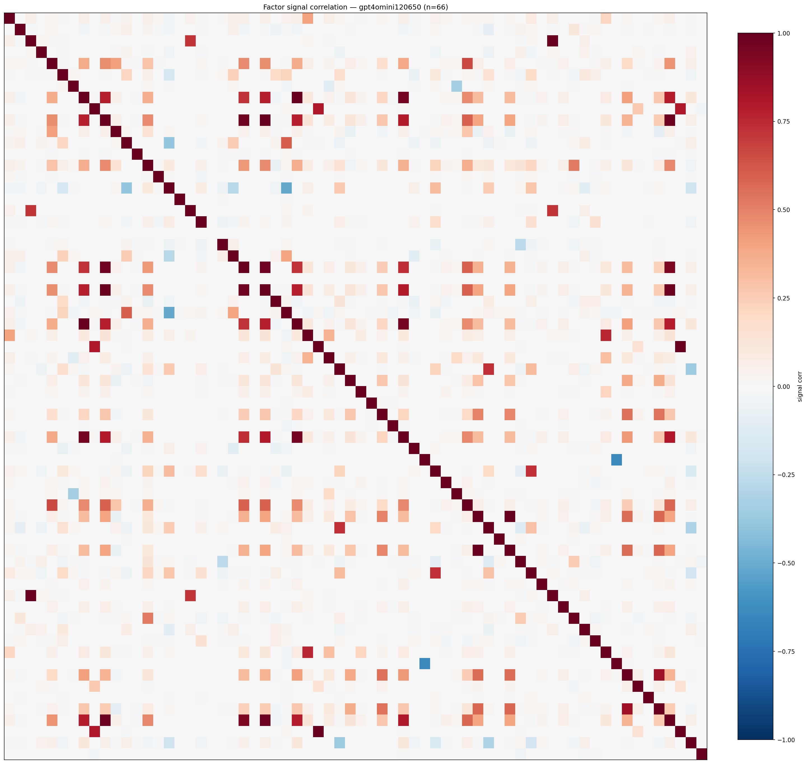

*Signal correlation matrix — gpt4omini120650*

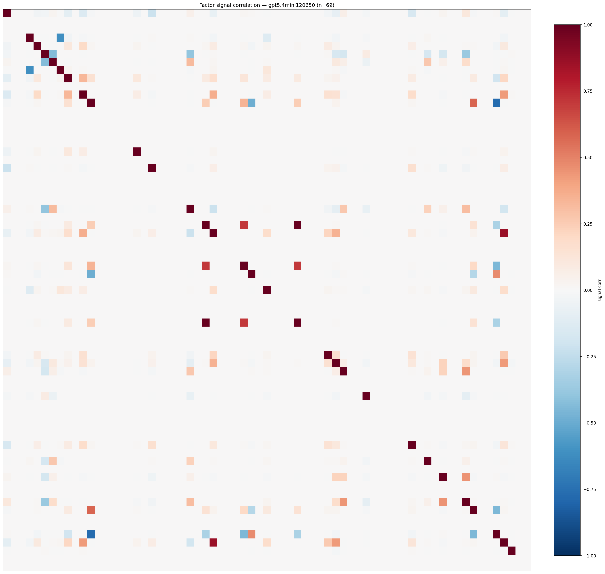

*Signal correlation matrix — gpt5.4mini120650*

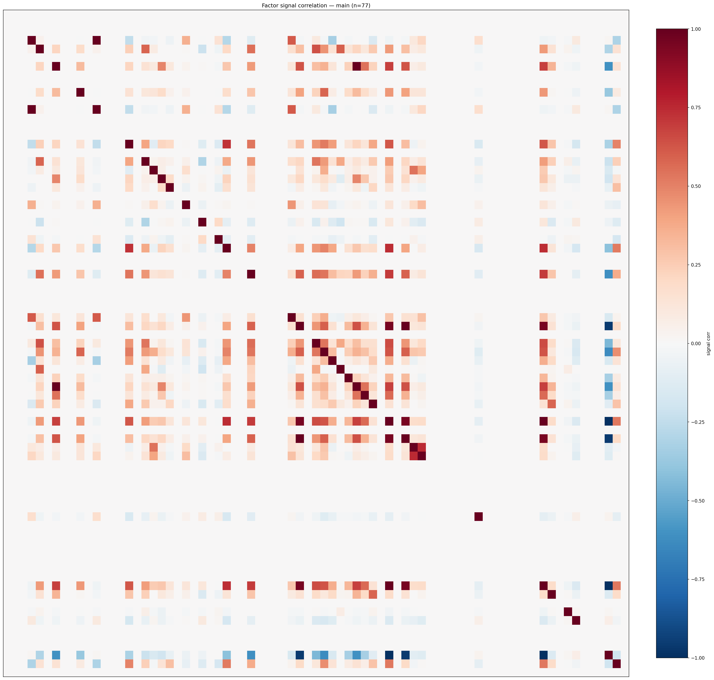

*Signal correlation matrix — main*

## 3. Deflation & model-based importance

`deflated_best_ic` haircuts each zoo's best |IC| for the number of factors tried (`ic_n_tested`) — a bigger zoo's best factor is more likely to be lucky. `lasso_n_nonzero` / `lasso_sparsity` show how many factors a sparse linear model actually keeps (model-view redundancy).

| prerun | best_ic | deflated_best_ic | deflated_best_t | ic_n_tested | ic_n_obs | lasso_n_nonzero | lasso_sparsity |
| --- | --- | --- | --- | --- | --- | --- | --- |
| gpt4omini120650 | 0.1326 | 0.1251 | 47.6405 | 64 | 145079 | 8 | 0.8788 |
| gpt5.4mini120650 | 0.1253 | 0.1184 | 45.0859 | 31 | 145079 | 14 | 0.7971 |
| main | 0.0927 | 0.0857 | 32.6336 | 36 | 145079 | 7 | 0.9091 |

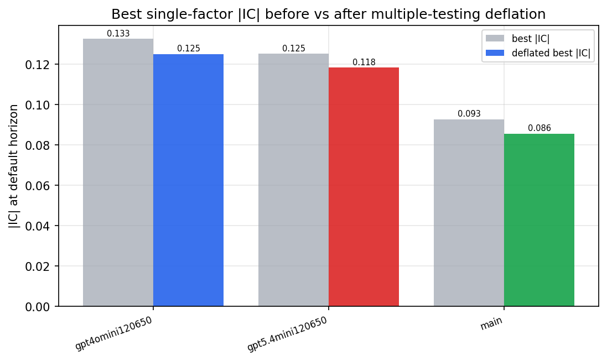

*Best |IC| before vs after multiple-testing deflation*

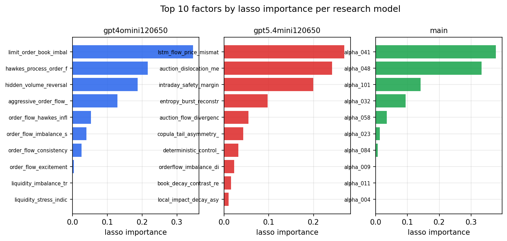

*Top factors by lasso importance per zoo*

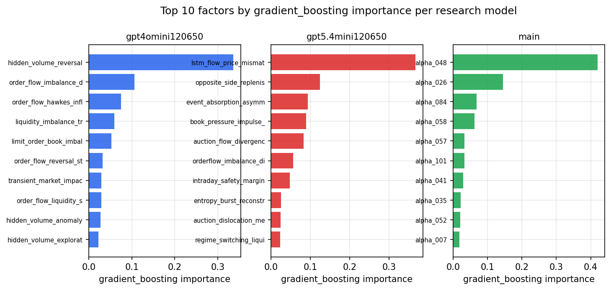

*Top factors by gradient_boosting importance per zoo*

## 4. ML-combined signal — per-underlying vectorised backtest

Each model combines a prerun's factors into ONE signal (fit `factors → forward return` on IS, predict per (bar, underlying)), then that combined signal is run through a simple vectorised backtest — `position(signal) × the underlying's own forward return` — on the held-out OOS tail (+ an equal-weight ensemble). No cross-sectional ranking.

> Config: position=**threshold** (t=1.0, z-score `expanding`), aggregation=**portfolio**, fit-standardise=**per_underlying**, horizon=6.

| prerun | model | n_factors_used | oos_ic | oos_sharpe | is_sharpe | oos_ann_return | oos_max_drawdown |
| --- | --- | --- | --- | --- | --- | --- | --- |
| gpt4omini120650 | linear_regression | 66 | 0.1487 | 1.3156 | 35.8617 | 0.0025 | -0.0005 |
| gpt4omini120650 | ridge | 66 | 0.1479 | 1.9989 | 35.3242 | 0.0039 | -0.0004 |
| gpt4omini120650 | lasso | 66 | 0.1462 | 29.1202 | 36.3351 | 0.4702 | -0.0017 |
| gpt4omini120650 | elastic_net | 66 | 0.145 | 29.4104 | 35.915 | 0.4934 | -0.0018 |
| gpt4omini120650 | random_forest | 66 | 0.1504 | 45.7472 | 38.2378 | 0.7648 | -0.0012 |
| gpt4omini120650 | gradient_boosting | 66 | 0.147 | -0.0947 | 17.7477 | -0.0007 | -0.0015 |
| gpt4omini120650 | xgboost | 66 | 0.1673 | 3.1329 | 22.5673 | 0.032 | -0.0011 |
| gpt4omini120650 | lightgbm | 66 | 0.1809 | 0.4366 | 19.2422 | 0.0071 | -0.0036 |
| gpt4omini120650 | ensemble | 66 | 0.1603 | 20.1952 | 30.5107 | 0.3136 | -0.0018 |
| gpt5.4mini120650 | linear_regression | 69 | 0.149 | 17.2383 | 29.6918 | 0.3222 | -0.0026 |
| gpt5.4mini120650 | ridge | 69 | 0.1464 | 17.2938 | 29.379 | 0.3241 | -0.0026 |
| gpt5.4mini120650 | lasso | 69 | 0.1524 | 15.7378 | 28.4711 | 0.2927 | -0.0027 |
| gpt5.4mini120650 | elastic_net | 69 | 0.1511 | 16.5895 | 29.7632 | 0.3098 | -0.0026 |
| gpt5.4mini120650 | random_forest | 69 | 0.1686 | 30.8885 | 34.1552 | 0.6637 | -0.0032 |
| gpt5.4mini120650 | gradient_boosting | 69 | 0.1541 | 1.2748 | 15.2219 | 0.0146 | -0.0015 |
| gpt5.4mini120650 | xgboost | 69 | 0.1909 | 9.5358 | 27.2594 | 0.1489 | -0.0024 |
| gpt5.4mini120650 | lightgbm | 69 | 0.2026 | 4.7052 | 24.1397 | 0.0529 | -0.0017 |
| gpt5.4mini120650 | ensemble | 69 | 0.1775 | 16.7496 | 31.0776 | 0.3176 | -0.0032 |
| main | linear_regression | 77 | 0.0508 | 6.5068 | 11.6231 | 0.0899 | -0.0034 |
| main | ridge | 77 | 0.0547 | 7.0448 | 11.3077 | 0.1024 | -0.0036 |
| main | lasso | 77 | nan | nan | nan | nan | nan |
| main | elastic_net | 77 | 0.0036 | 16.2036 | 12.9626 | 0.1535 | -0.0017 |
| main | random_forest | 77 | 0.0557 | 7.67 | 14.6048 | 0.0977 | -0.0021 |
| main | gradient_boosting | 77 | 0.0548 | -0.9256 | 10.4544 | -0.0041 | -0.0016 |
| main | xgboost | 77 | 0.0595 | 1.1467 | 15.2428 | 0.0077 | -0.0016 |
| main | lightgbm | 77 | 0.0648 | -0.4298 | 17.4085 | -0.0045 | -0.0039 |
| main | ensemble | 77 | 0.0623 | 10.5567 | 16.7563 | 0.1202 | -0.0023 |

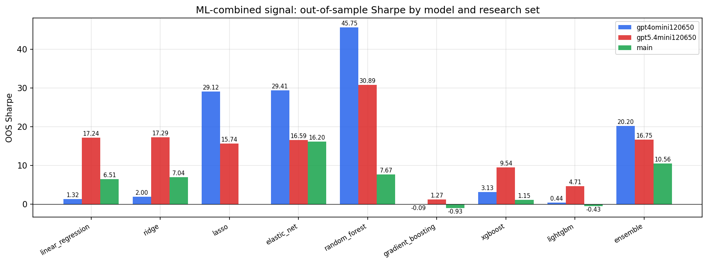

*ML-combined OOS Sharpe by model and research set*

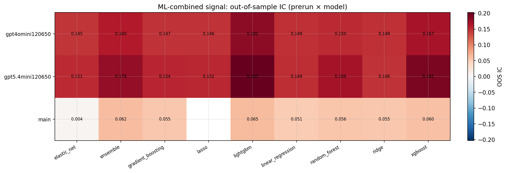

*ML-combined OOS IC (prerun × model)*

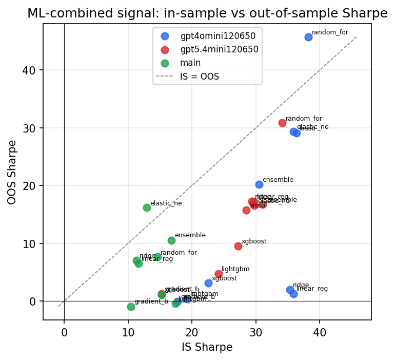

*IS vs OOS Sharpe (overfitting diagnostic)*

---
*Generated by `run_model_comparison.py`. Tables: `*.csv`; interactive: `comparison.ipynb`.*
