# Research-LLM factor comparison — `2026-05`

Comparing the **factor output of different research LLMs** on three axes (raw factor quality → factors as ML features → factors through the full agentic fund). The panel, IS/OOS split, horizon and model hyper-parameters are held identical across preruns — the *only* variable is the factor set.

## Preruns compared

| prerun | research_model | usable_factors | dropped_factors |
| --- | --- | --- | --- |
| gpt4omini120650 | gpt-4o-mini | 66 | 0 |
| gpt5.4mini120650 | gpt-5.4-mini | 69 | 0 |
| main | seed library | 77 | 11 |

> Dropped factors declare fields the current data doesn't have yet (e.g. fundamentals); they light up unchanged once that data is downloaded.

*Usable vs awaiting-data factors per research model*

## Key findings

- **Best ML-combined OOS Sharpe:** `gpt4omini120650` with `random_forest` (OOS Sharpe = 43.287).
- **Mean OOS Sharpe across models, by research set:** `gpt4omini120650` = 20.469, `gpt5.4mini120650` = 19.278, `main` = 4.754.
- **Highest mean single-factor |IC| (h=6):** `gpt4omini120650` (mean |IC| = 0.0346).
- **Most diverse zoo (highest effective/raw factor ratio):** `gpt5.4mini120650` (eff 55.0 of 69, ratio 0.80).
- **Best selection-deflated single-factor |IC|:** `gpt4omini120650` (deflated |IC| = 0.1202 from 64 factors tried).

## 1. Single-factor IC (raw factor quality)

Per-underlying time-series Spearman rank-IC of every researched factor, recomputed on the shared panel at horizons h=1, h=6, h=60. The per-underlying IC correlates each factor's value vector with the underlying's own forward-return vector (pooled across underlyings); the cross-sectional IC ranks across underlyings per timestamp.

| prerun | n_factors | mean_abs_ic_1 | mean_abs_ic_6 | mean_abs_ic_60 | mean_abs_icir_6 | best_factor_h6 | best_abs_ic_h6 |
| --- | --- | --- | --- | --- | --- | --- | --- |
| gpt4omini120650 | 66 | 0.0456 | 0.0346 | 0.0151 | 1.6413 | limit_order_book_imbalance_surge | 0.1277 |
| gpt5.4mini120650 | 69 | 0.0279 | 0.0246 | 0.0135 | 1.4594 | lstm_flow_price_mismatch | 0.1174 |
| main | 77 | 0.0299 | 0.0274 | 0.012 | 1.114 | alpha_054 | 0.0835 |

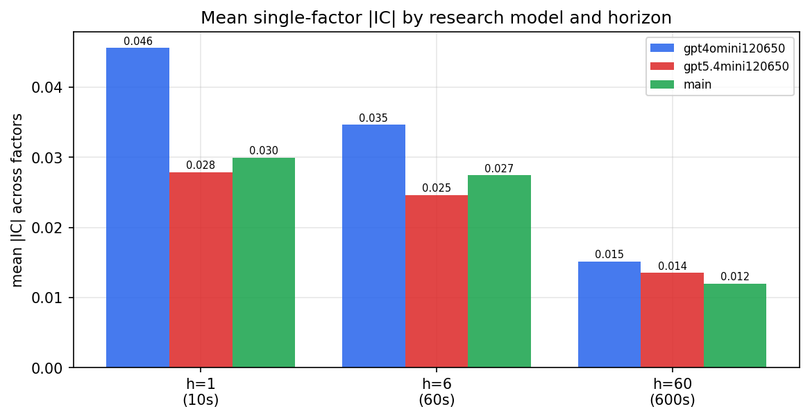

*Mean |IC| by research model and horizon*

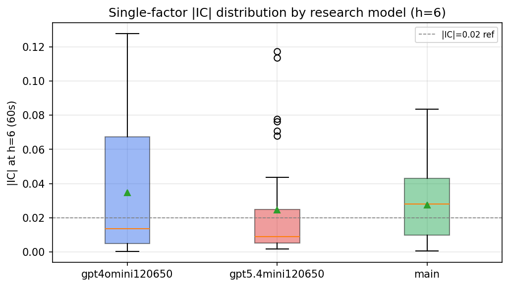

*Per-factor |IC| distribution by research model*

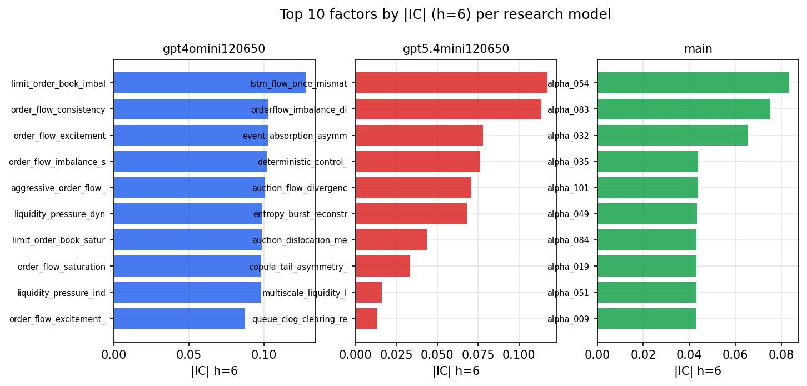

*Top factors by |IC| per research model*

## 2. Factor diversity & redundancy

Pairwise correlation of each zoo's *signals*. `eff_n_factors` is the effective number of independent factors (participation ratio of the correlation eigenvalues); `eff_ratio` and `redundancy` summarise how much unique information the zoo holds vs. how much is duplicated; `n_clusters` groups factors at |corr| ≥ 0.7.

| prerun | n_factors | eff_n_factors | eff_ratio | mean_abs_corr | n_clusters | redundancy |
| --- | --- | --- | --- | --- | --- | --- |
| gpt4omini120650 | 66 | 29.4568 | 0.4463 | 0.0445 | 52 | 0.5537 |
| gpt5.4mini120650 | 69 | 54.9869 | 0.7969 | 0.0111 | 65 | 0.2031 |
| main | 77 | 34.0396 | 0.4421 | 0.0403 | 67 | 0.5579 |

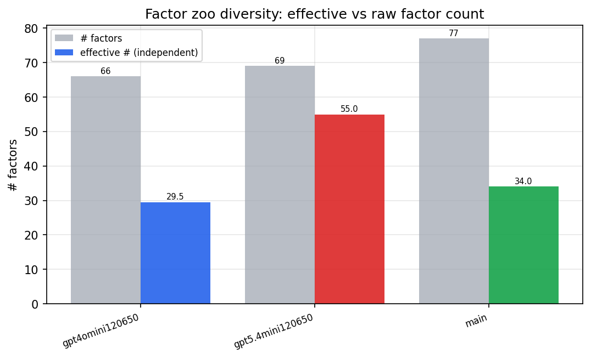

*Effective vs raw factor count per research model*

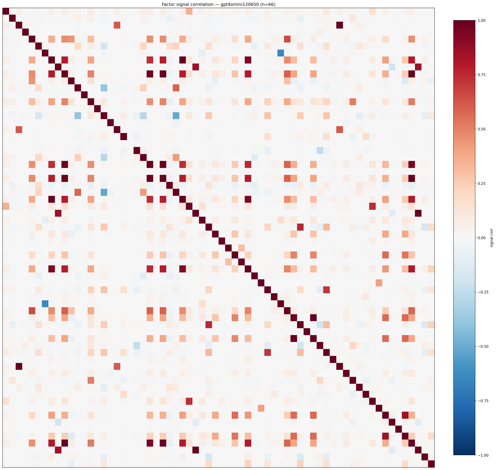

*Signal correlation matrix — gpt4omini120650*

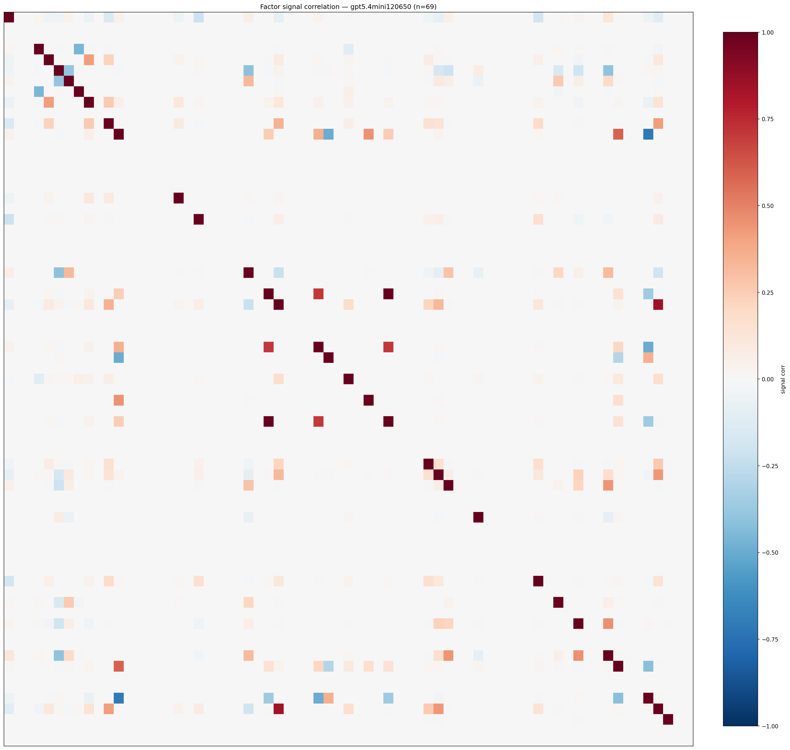

*Signal correlation matrix — gpt5.4mini120650*

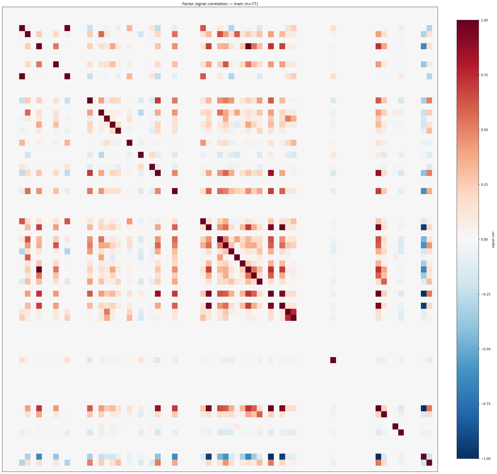

*Signal correlation matrix — main*

## 3. Deflation & model-based importance

`deflated_best_ic` haircuts each zoo's best |IC| for the number of factors tried (`ic_n_tested`) — a bigger zoo's best factor is more likely to be lucky. `lasso_n_nonzero` / `lasso_sparsity` show how many factors a sparse linear model actually keeps (model-view redundancy).

| prerun | best_ic | deflated_best_ic | deflated_best_t | ic_n_tested | ic_n_obs | lasso_n_nonzero | lasso_sparsity |
| --- | --- | --- | --- | --- | --- | --- | --- |
| gpt4omini120650 | 0.1277 | 0.1202 | 46.1424 | 64 | 147419 | 10 | 0.8485 |
| gpt5.4mini120650 | 0.1174 | 0.1105 | 42.4453 | 31 | 147419 | 8 | 0.8841 |
| main | 0.0835 | 0.0765 | 29.3677 | 36 | 147419 | 3 | 0.961 |

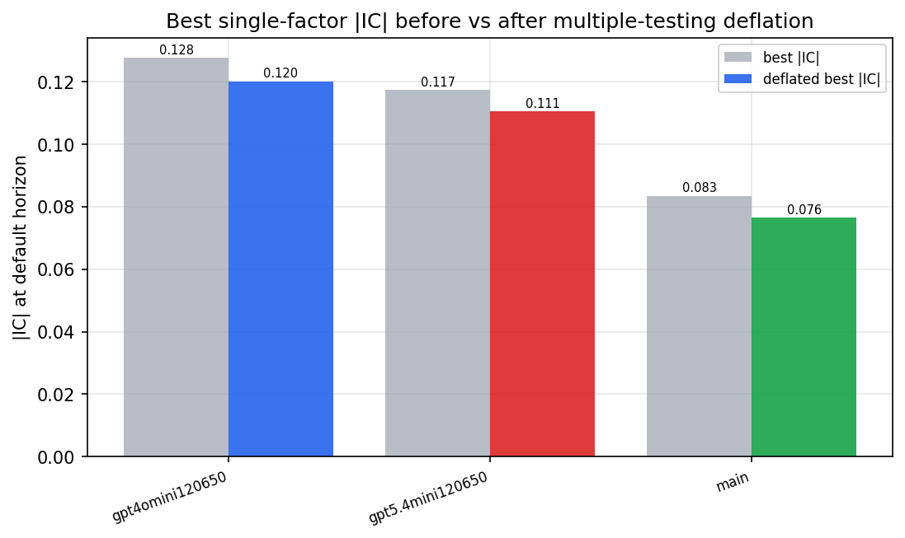

*Best |IC| before vs after multiple-testing deflation*

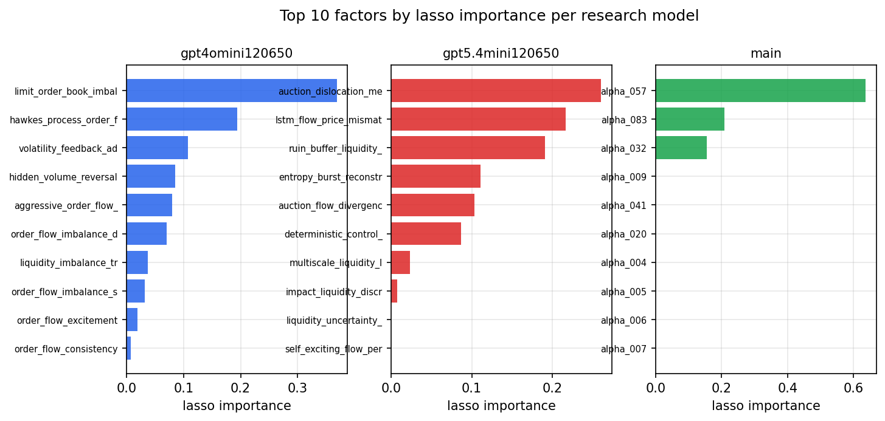

*Top factors by lasso importance per zoo*

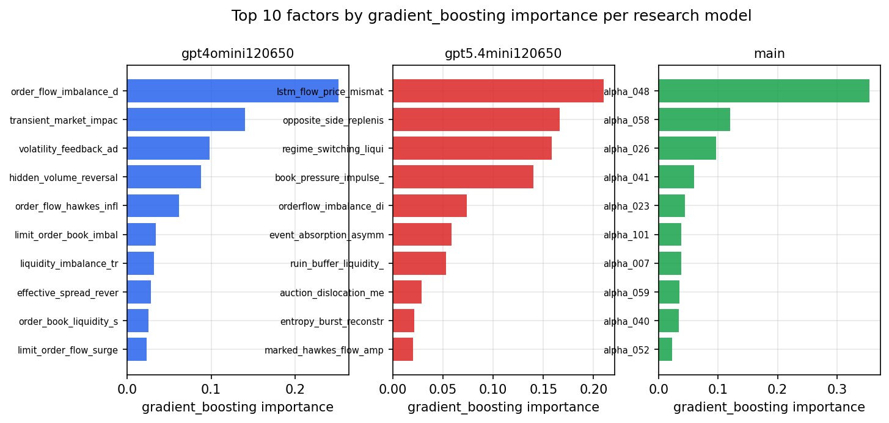

*Top factors by gradient_boosting importance per zoo*

## 4. ML-combined signal — per-underlying vectorised backtest

Each model combines a prerun's factors into ONE signal (fit `factors → forward return` on IS, predict per (bar, underlying)), then that combined signal is run through a simple vectorised backtest — `position(signal) × the underlying's own forward return` — on the held-out OOS tail (+ an equal-weight ensemble). No cross-sectional ranking.

> Config: position=**threshold** (t=1.0, z-score `expanding`), aggregation=**portfolio**, fit-standardise=**per_underlying**, horizon=6.

| prerun | model | n_factors_used | oos_ic | oos_sharpe | is_sharpe | oos_ann_return | oos_max_drawdown |
| --- | --- | --- | --- | --- | --- | --- | --- |
| gpt4omini120650 | linear_regression | 66 | 0.1563 | 24.1482 | 29.7349 | 0.4377 | -0.0017 |
| gpt4omini120650 | ridge | 66 | 0.1552 | 23.2249 | 29.1107 | 0.4501 | -0.0019 |
| gpt4omini120650 | lasso | 66 | 0.1457 | 33.4001 | 30.749 | 0.4859 | -0.0011 |
| gpt4omini120650 | elastic_net | 66 | 0.1488 | 31.6872 | 31.0944 | 0.5319 | -0.0011 |
| gpt4omini120650 | random_forest | 66 | 0.1492 | 43.2868 | 38.0162 | 0.8455 | -0.0015 |
| gpt4omini120650 | gradient_boosting | 66 | 0.1444 | 1.7137 | 8.8695 | 0.0283 | -0.0028 |
| gpt4omini120650 | xgboost | 66 | 0.1618 | 1.3318 | 11.9193 | 0.024 | -0.0034 |
| gpt4omini120650 | lightgbm | 66 | 0.1756 | 1.8971 | 13.9918 | 0.0371 | -0.0034 |
| gpt4omini120650 | ensemble | 66 | 0.1591 | 23.5318 | 25.9638 | 0.5021 | -0.0016 |
| gpt5.4mini120650 | linear_regression | 69 | 0.1565 | 23.9911 | 25.6999 | 0.388 | -0.0015 |
| gpt5.4mini120650 | ridge | 69 | 0.1539 | 23.205 | 25.0494 | 0.3707 | -0.0015 |
| gpt5.4mini120650 | lasso | 69 | 0.1559 | 23.3184 | 26.6923 | 0.376 | -0.0016 |
| gpt5.4mini120650 | elastic_net | 69 | 0.1556 | 23.0829 | 25.601 | 0.3696 | -0.0015 |
| gpt5.4mini120650 | random_forest | 69 | 0.1752 | 37.6696 | 35.4197 | 0.8377 | -0.0024 |
| gpt5.4mini120650 | gradient_boosting | 69 | 0.1619 | -0.0922 | 12.2234 | -0.0011 | -0.0039 |
| gpt5.4mini120650 | xgboost | 69 | 0.1973 | 13.2178 | 21.4681 | 0.1773 | -0.0019 |
| gpt5.4mini120650 | lightgbm | 69 | 0.2012 | 5.2716 | 17.4999 | 0.0542 | -0.0023 |
| gpt5.4mini120650 | ensemble | 69 | 0.1855 | 23.836 | 27.4942 | 0.4375 | -0.0026 |
| main | linear_regression | 77 | 0.0419 | 5.9603 | 11.4983 | 0.1045 | -0.0029 |
| main | ridge | 77 | 0.0441 | 6.81 | 11.596 | 0.1219 | -0.0033 |
| main | lasso | 77 | 0.0543 | 7.7522 | 13.0826 | 0.1136 | -0.0033 |
| main | elastic_net | 77 | 0.0549 | 8.4508 | 13.2842 | 0.1234 | -0.0033 |
| main | random_forest | 77 | 0.0453 | 3.5546 | 18.5632 | 0.0645 | -0.0029 |
| main | gradient_boosting | 77 | 0.0429 | 0.0576 | 8.1827 | 0.0003 | -0.0014 |
| main | xgboost | 77 | 0.039 | 0.8014 | 13.4878 | 0.0096 | -0.0032 |
| main | lightgbm | 77 | 0.0412 | 2.4006 | 15.5338 | 0.0256 | -0.003 |
| main | ensemble | 77 | 0.0491 | 6.9941 | 17.8184 | 0.1125 | -0.0022 |

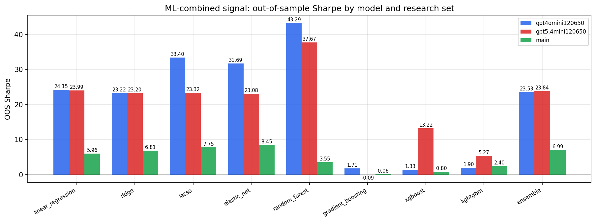

*ML-combined OOS Sharpe by model and research set*

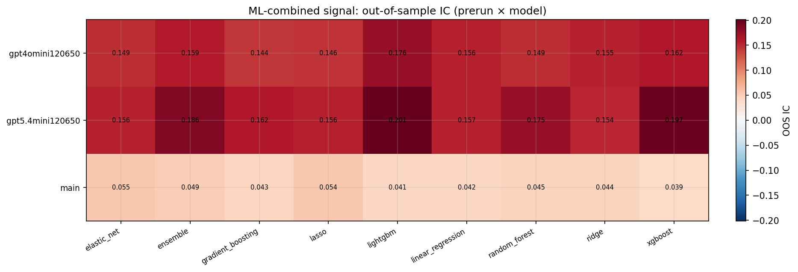

*ML-combined OOS IC (prerun × model)*

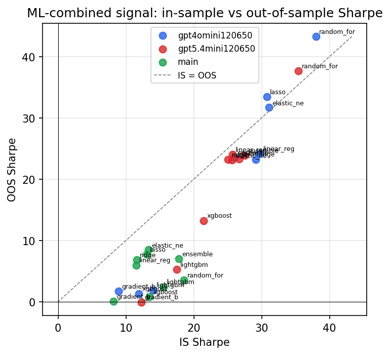

*IS vs OOS Sharpe (overfitting diagnostic)*

---
*Generated by `run_model_comparison.py`. Tables: `*.csv`; interactive: `comparison.ipynb`.*
