# Research-LLM factor comparison — `2026-06`

Comparing the **factor output of different research LLMs** on three axes (raw factor quality → factors as ML features → factors through the full agentic fund). The panel, IS/OOS split, horizon and model hyper-parameters are held identical across preruns — the *only* variable is the factor set.

## Preruns compared

| prerun | research_model | usable_factors | dropped_factors |
| --- | --- | --- | --- |
| gpt4omini120650 | gpt-4o-mini | 66 | 0 |
| gpt5.4mini120650 | gpt-5.4-mini | 69 | 0 |
| main | seed library | 77 | 11 |

> Dropped factors declare fields the current data doesn't have yet (e.g. fundamentals); they light up unchanged once that data is downloaded.

*Usable vs awaiting-data factors per research model*

## Key findings

- **Best ML-combined OOS Sharpe:** `gpt5.4mini120650` with `ensemble` (OOS Sharpe = 54.638).
- **Mean OOS Sharpe across models, by research set:** `gpt5.4mini120650` = 41.569, `main` = 29.741, `gpt4omini120650` = 28.095.
- **Highest mean single-factor |IC| (h=6):** `gpt4omini120650` (mean |IC| = 0.0320).
- **Most diverse zoo (highest effective/raw factor ratio):** `gpt5.4mini120650` (eff 53.6 of 69, ratio 0.78).
- **Best selection-deflated single-factor |IC|:** `gpt4omini120650` (deflated |IC| = 0.1251 from 64 factors tried).

## 1. Single-factor IC (raw factor quality)

Per-underlying time-series Spearman rank-IC of every researched factor, recomputed on the shared panel at horizons h=1, h=6, h=60. The per-underlying IC correlates each factor's value vector with the underlying's own forward-return vector (pooled across underlyings); the cross-sectional IC ranks across underlyings per timestamp.

| prerun | n_factors | mean_abs_ic_1 | mean_abs_ic_6 | mean_abs_ic_60 | mean_abs_icir_6 | best_factor_h6 | best_abs_ic_h6 |
| --- | --- | --- | --- | --- | --- | --- | --- |
| gpt4omini120650 | 66 | 0.0424 | 0.032 | 0.0154 | 1.3146 | limit_order_book_imbalance_surge | 0.1343 |
| gpt5.4mini120650 | 69 | 0.0281 | 0.0234 | 0.0146 | 1.2823 | orderflow_imbalance_divergence | 0.1167 |
| main | 77 | 0.0275 | 0.0314 | 0.0134 | 1.0722 | alpha_054 | 0.0878 |

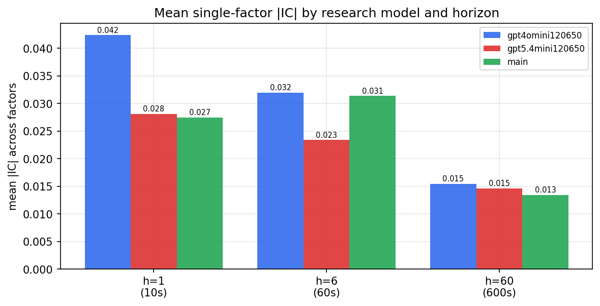

*Mean |IC| by research model and horizon*

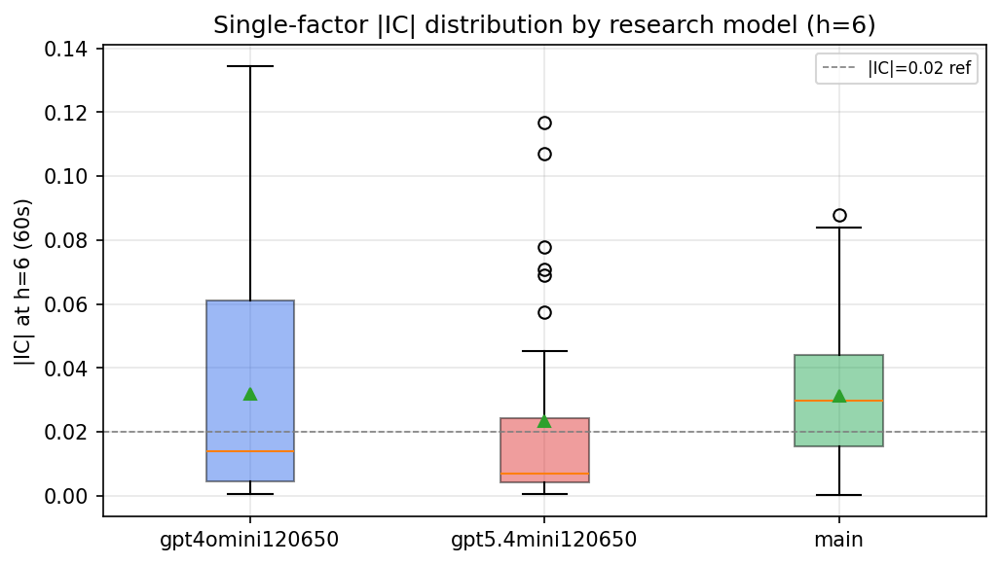

*Per-factor |IC| distribution by research model*

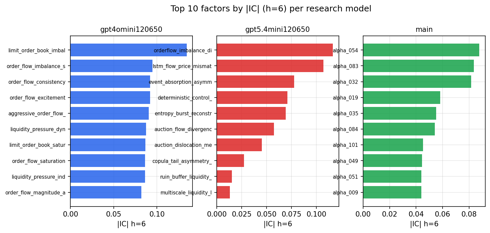

*Top factors by |IC| per research model*

## 2. Factor diversity & redundancy

Pairwise correlation of each zoo's *signals*. `eff_n_factors` is the effective number of independent factors (participation ratio of the correlation eigenvalues); `eff_ratio` and `redundancy` summarise how much unique information the zoo holds vs. how much is duplicated; `n_clusters` groups factors at |corr| ≥ 0.7.

| prerun | n_factors | eff_n_factors | eff_ratio | mean_abs_corr | n_clusters | redundancy |
| --- | --- | --- | --- | --- | --- | --- |
| gpt4omini120650 | 66 | 29.6874 | 0.4498 | 0.0461 | 54 | 0.5502 |
| gpt5.4mini120650 | 69 | 53.5648 | 0.7763 | 0.0113 | 65 | 0.2237 |
| main | 77 | 34.7865 | 0.4518 | 0.0391 | 67 | 0.5482 |

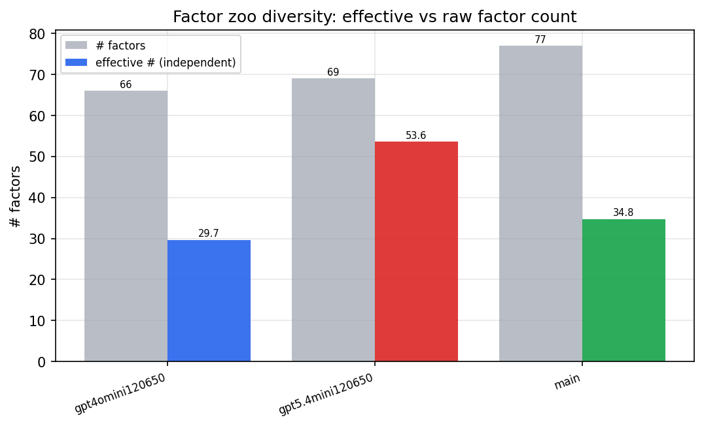

*Effective vs raw factor count per research model*

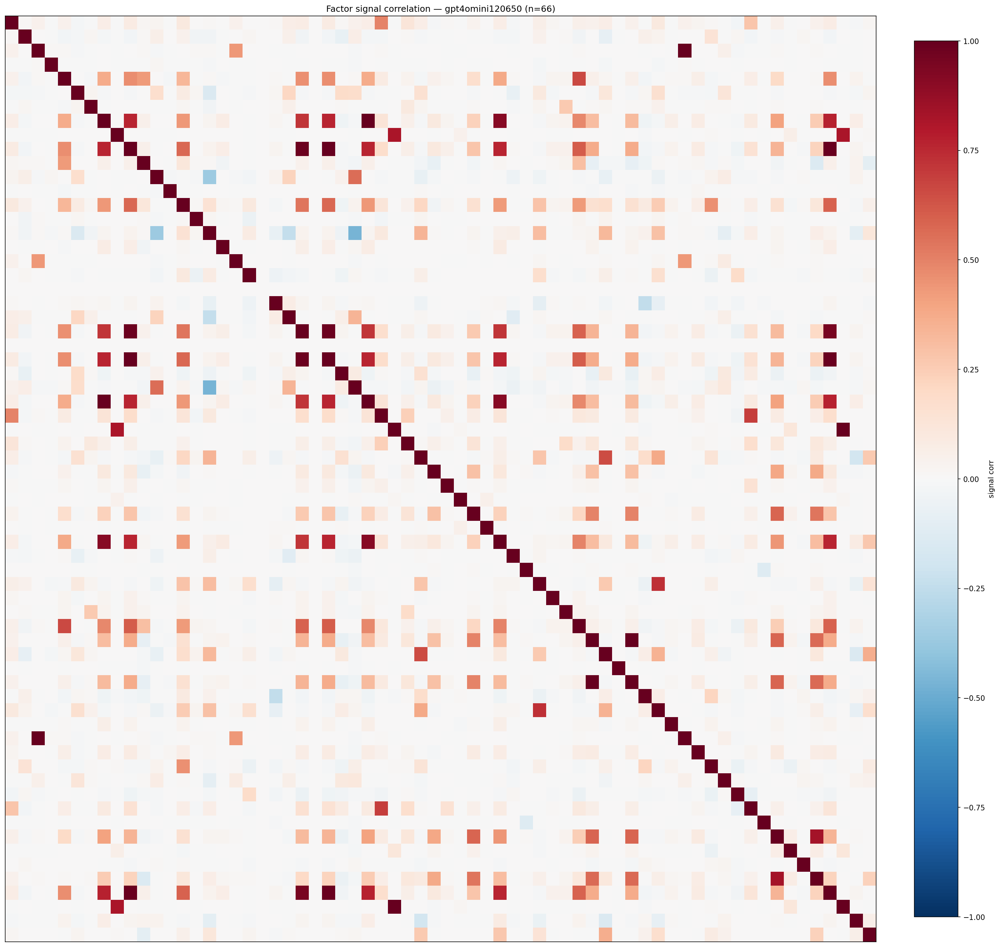

*Signal correlation matrix — gpt4omini120650*

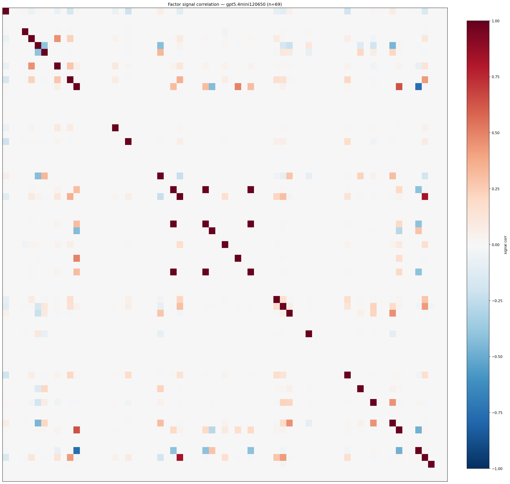

*Signal correlation matrix — gpt5.4mini120650*

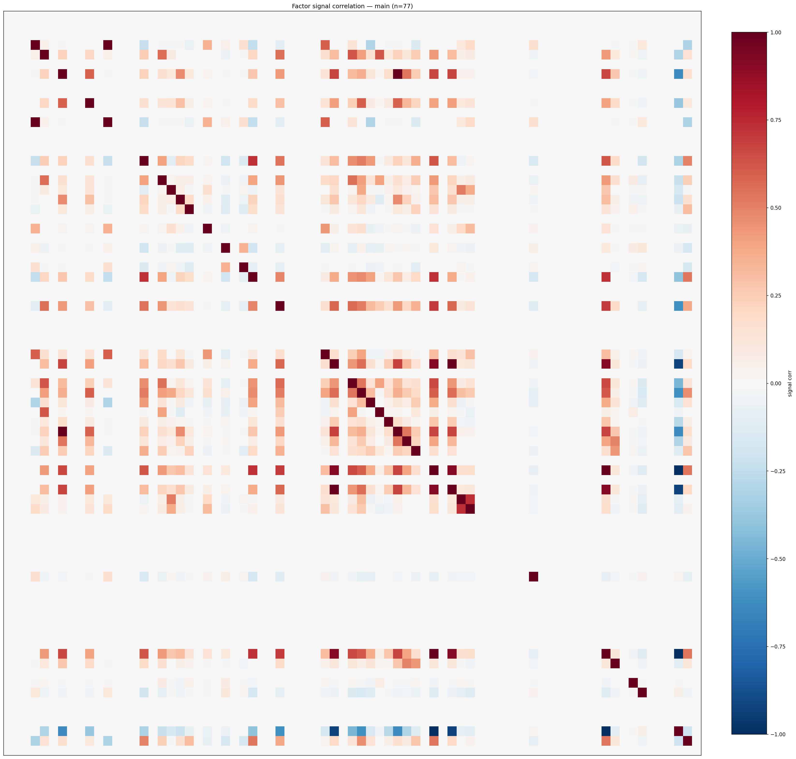

*Signal correlation matrix — main*

## 3. Deflation & model-based importance

`deflated_best_ic` haircuts each zoo's best |IC| for the number of factors tried (`ic_n_tested`) — a bigger zoo's best factor is more likely to be lucky. `lasso_n_nonzero` / `lasso_sparsity` show how many factors a sparse linear model actually keeps (model-view redundancy).

| prerun | best_ic | deflated_best_ic | deflated_best_t | ic_n_tested | ic_n_obs | lasso_n_nonzero | lasso_sparsity |
| --- | --- | --- | --- | --- | --- | --- | --- |
| gpt4omini120650 | 0.1343 | 0.1251 | 39.2142 | 64 | 98279 | 7 | 0.8939 |
| gpt5.4mini120650 | 0.1167 | 0.1084 | 33.9712 | 30 | 98279 | 22 | 0.6812 |
| main | 0.0878 | 0.0793 | 24.859 | 36 | 98279 | 5 | 0.9351 |

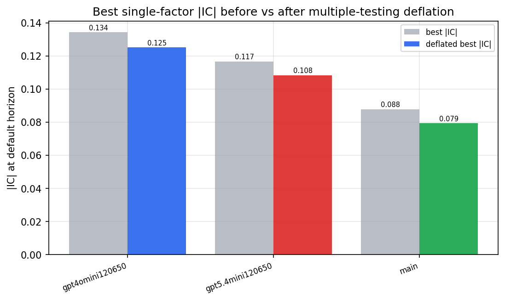

*Best |IC| before vs after multiple-testing deflation*

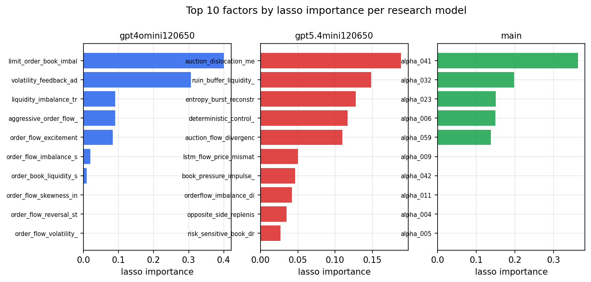

*Top factors by lasso importance per zoo*

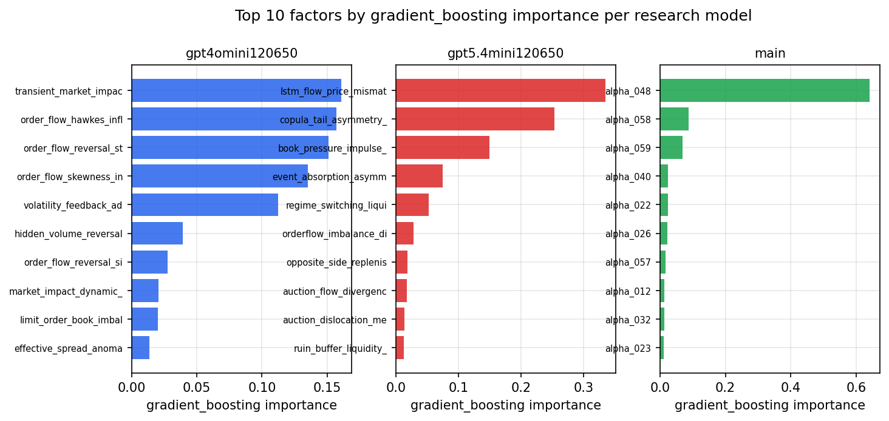

*Top factors by gradient_boosting importance per zoo*

## 4. ML-combined signal — per-underlying vectorised backtest

Each model combines a prerun's factors into ONE signal (fit `factors → forward return` on IS, predict per (bar, underlying)), then that combined signal is run through a simple vectorised backtest — `position(signal) × the underlying's own forward return` — on the held-out OOS tail (+ an equal-weight ensemble). No cross-sectional ranking.

> Config: position=**threshold** (t=1.0, z-score `expanding`), aggregation=**portfolio**, fit-standardise=**per_underlying**, horizon=6.

| prerun | model | n_factors_used | oos_ic | oos_sharpe | is_sharpe | oos_ann_return | oos_max_drawdown |
| --- | --- | --- | --- | --- | --- | --- | --- |
| gpt4omini120650 | linear_regression | 66 | 0.1243 | 23.721 | 29.966 | 0.3642 | -0.0007 |
| gpt4omini120650 | ridge | 66 | 0.1244 | 21.997 | 30.461 | 0.3463 | -0.0007 |
| gpt4omini120650 | lasso | 66 | 0.126 | 24.1082 | 25.3778 | 0.3665 | -0.0007 |
| gpt4omini120650 | elastic_net | 66 | 0.1237 | 24.5625 | 26.6795 | 0.3754 | -0.0007 |
| gpt4omini120650 | random_forest | 66 | 0.1238 | 51.7551 | 36.8725 | 0.6081 | -0.0003 |
| gpt4omini120650 | gradient_boosting | 66 | 0.1027 | 15.8844 | 10.1369 | 0.0648 | -0.0002 |
| gpt4omini120650 | xgboost | 66 | 0.1215 | 30.0256 | 20.1165 | 0.2101 | -0.0003 |
| gpt4omini120650 | lightgbm | 66 | 0.1239 | 28.4151 | 17.4304 | 0.1922 | -0.0002 |
| gpt4omini120650 | ensemble | 66 | 0.1256 | 32.3892 | 27.6506 | 0.4425 | -0.0004 |
| gpt5.4mini120650 | linear_regression | 69 | 0.106 | 45.9785 | 35.3533 | 0.519 | -0.0004 |
| gpt5.4mini120650 | ridge | 69 | 0.1038 | 37.8838 | 35.1109 | 0.4541 | -0.0004 |
| gpt5.4mini120650 | lasso | 69 | 0.1073 | 48.6752 | 32.0882 | 0.5301 | -0.0003 |
| gpt5.4mini120650 | elastic_net | 69 | 0.1064 | 44.1129 | 34.9202 | 0.4876 | -0.0003 |
| gpt5.4mini120650 | random_forest | 69 | 0.1573 | 52.3142 | 36.9849 | 0.9571 | -0.0006 |
| gpt5.4mini120650 | gradient_boosting | 69 | 0.1355 | 29.538 | 13.0256 | 0.1162 | -0.0001 |
| gpt5.4mini120650 | xgboost | 69 | 0.1567 | 28.6475 | 26.2462 | 0.1453 | -0.0001 |
| gpt5.4mini120650 | lightgbm | 69 | 0.1628 | 32.3314 | 18.3611 | 0.1924 | -0.0002 |
| gpt5.4mini120650 | ensemble | 69 | 0.1453 | 54.6384 | 31.3136 | 0.6708 | -0.0004 |
| main | linear_regression | 77 | 0.0869 | 33.1729 | 11.4231 | 0.4114 | -0.0006 |
| main | ridge | 77 | 0.0902 | 39.2275 | 11.6747 | 0.5208 | -0.0006 |
| main | lasso | 77 | 0.1232 | 45.241 | 10.9945 | 0.6818 | -0.0005 |
| main | elastic_net | 77 | 0.1232 | 41.7486 | 11.0131 | 0.702 | -0.0006 |
| main | random_forest | 77 | 0.0883 | 41.0627 | 14.6583 | 0.503 | -0.0008 |
| main | gradient_boosting | 77 | 0.0804 | 13.1731 | 8.3667 | 0.0448 | -0.0001 |
| main | xgboost | 77 | 0.0572 | 5.7582 | 14.4247 | 0.0203 | -0.0002 |
| main | lightgbm | 77 | 0.0118 | -0.7986 | 15.8104 | -0.0066 | -0.0006 |
| main | ensemble | 77 | 0.1088 | 49.084 | 16.2929 | 0.6062 | -0.0006 |

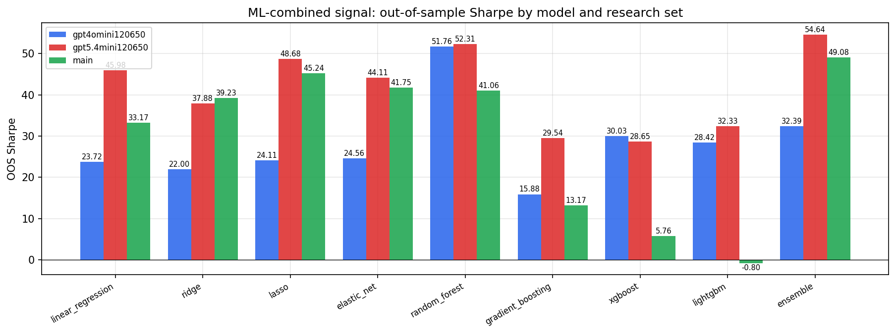

*ML-combined OOS Sharpe by model and research set*

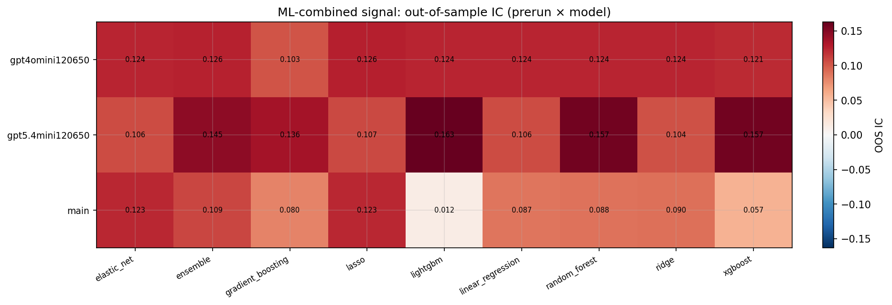

*ML-combined OOS IC (prerun × model)*

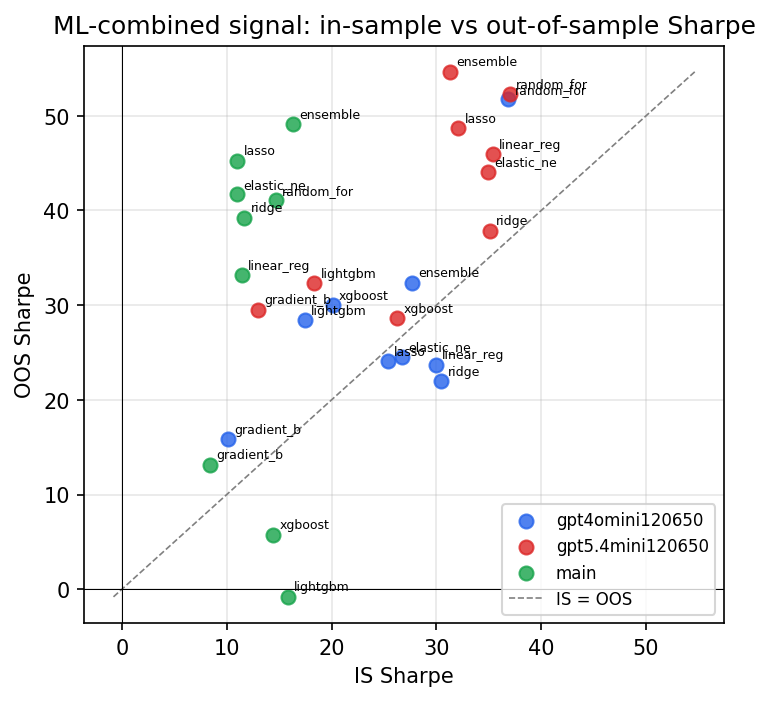

*IS vs OOS Sharpe (overfitting diagnostic)*

---
*Generated by `run_model_comparison.py`. Tables: `*.csv`; interactive: `comparison.ipynb`.*
