# Research-LLM factor comparison — `2024-03`

Comparing the **factor output of different research LLMs** on three axes (raw factor quality → factors as ML features → factors through the full agentic fund). The panel, IS/OOS split, horizon and model hyper-parameters are held identical across preruns — the *only* variable is the factor set.

## Preruns compared

| prerun | research_model | usable_factors | dropped_factors |
| --- | --- | --- | --- |
| gpt4omini120650 | gpt-4o-mini | 66 | 0 |
| gpt5.4mini120650 | gpt-5.4-mini | 69 | 0 |
| main | seed library | 78 | 10 |

> Dropped factors declare fields the current data doesn't have yet (e.g. fundamentals); they light up unchanged once that data is downloaded.

*Usable vs awaiting-data factors per research model*

## Key findings

- **Best ML-combined OOS Sharpe:** `gpt5.4mini120650` with `xgboost` (OOS Sharpe = 4.269).
- **Mean OOS Sharpe across models, by research set:** `gpt5.4mini120650` = 2.929, `gpt4omini120650` = 1.520, `main` = -0.375.
- **Highest mean single-factor |IC| (h=6):** `main` (mean |IC| = 0.0061).
- **Most diverse zoo (highest effective/raw factor ratio):** `gpt5.4mini120650` (eff 48.4 of 69, ratio 0.70).
- **Best selection-deflated single-factor |IC|:** `gpt5.4mini120650` (deflated |IC| = 0.0086 from 31 factors tried).

## 1. Single-factor IC (raw factor quality)

Per-underlying time-series Spearman rank-IC of every researched factor, recomputed on the shared panel at horizons h=1, h=6, h=60. The per-underlying IC correlates each factor's value vector with the underlying's own forward-return vector (pooled across underlyings); the cross-sectional IC ranks across underlyings per timestamp.

| prerun | n_factors | mean_abs_ic_1 | mean_abs_ic_6 | mean_abs_ic_60 | mean_abs_icir_6 | best_factor_h6 | best_abs_ic_h6 |
| --- | --- | --- | --- | --- | --- | --- | --- |
| gpt4omini120650 | 66 | 0.0042 | 0.004 | 0.0063 | 0.2536 | order_flow_momentum | 0.0126 |
| gpt5.4mini120650 | 69 | 0.0027 | 0.006 | 0.0085 | 0.3455 | auction_reversion_anchor_gap | 0.0156 |
| main | 78 | 0.0069 | 0.0061 | 0.0048 | 0.4523 | alpha_006 | 0.013 |

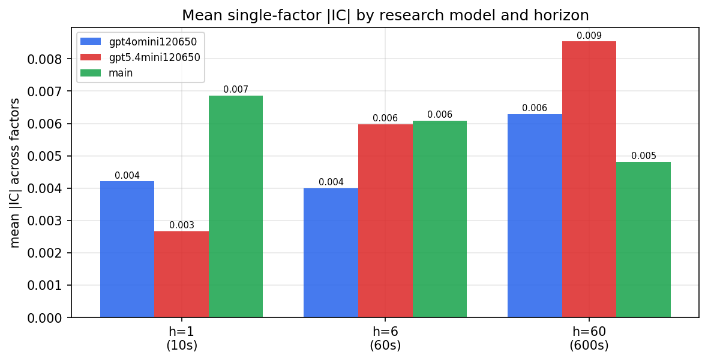

*Mean |IC| by research model and horizon*

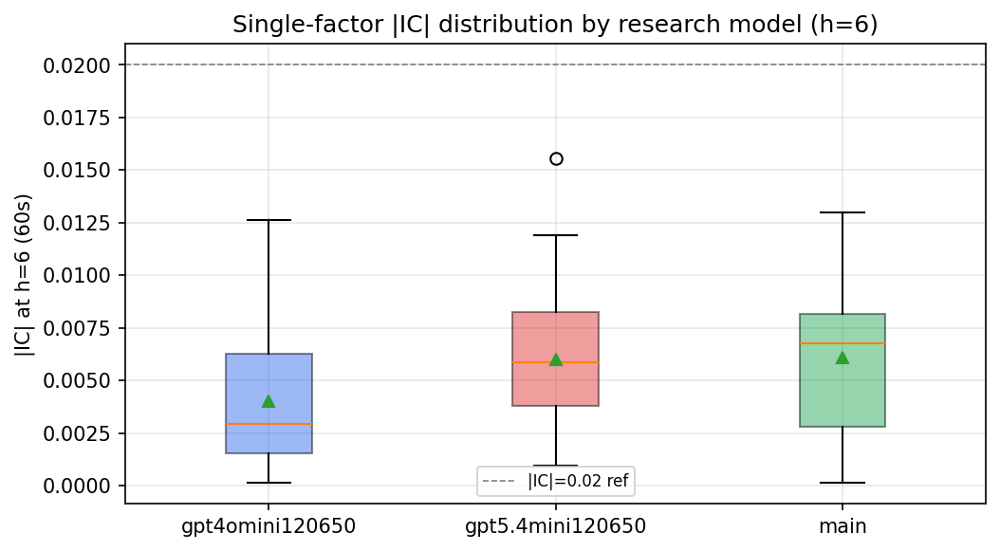

*Per-factor |IC| distribution by research model*

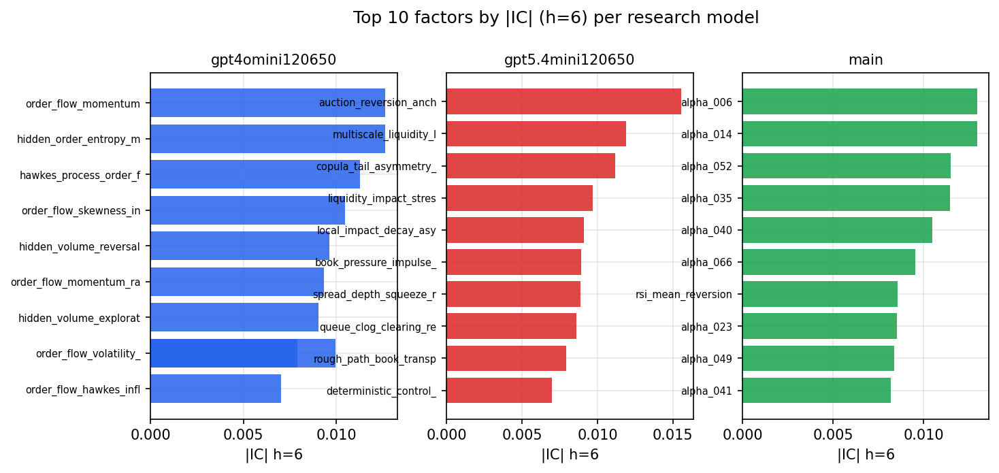

*Top factors by |IC| per research model*

## 2. Factor diversity & redundancy

Pairwise correlation of each zoo's *signals*. `eff_n_factors` is the effective number of independent factors (participation ratio of the correlation eigenvalues); `eff_ratio` and `redundancy` summarise how much unique information the zoo holds vs. how much is duplicated; `n_clusters` groups factors at |corr| ≥ 0.7.

| prerun | n_factors | eff_n_factors | eff_ratio | mean_abs_corr | n_clusters | redundancy |
| --- | --- | --- | --- | --- | --- | --- |
| gpt4omini120650 | 66 | 24.391 | 0.3696 | 0.0559 | 48 | 0.6304 |
| gpt5.4mini120650 | 69 | 48.4272 | 0.7018 | 0.0134 | 62 | 0.2982 |
| main | 78 | 41.7505 | 0.5353 | 0.0295 | 71 | 0.4647 |

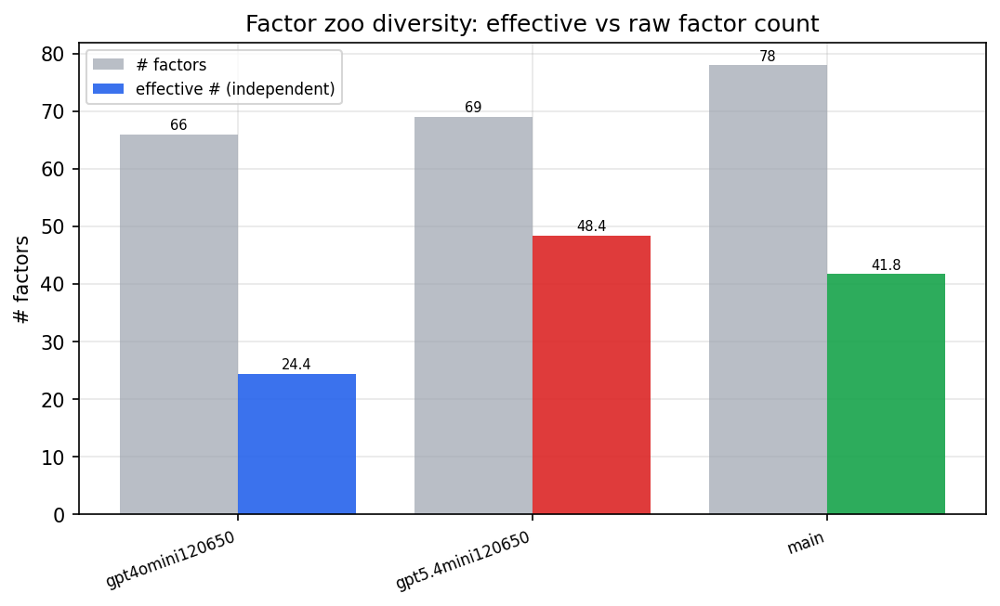

*Effective vs raw factor count per research model*

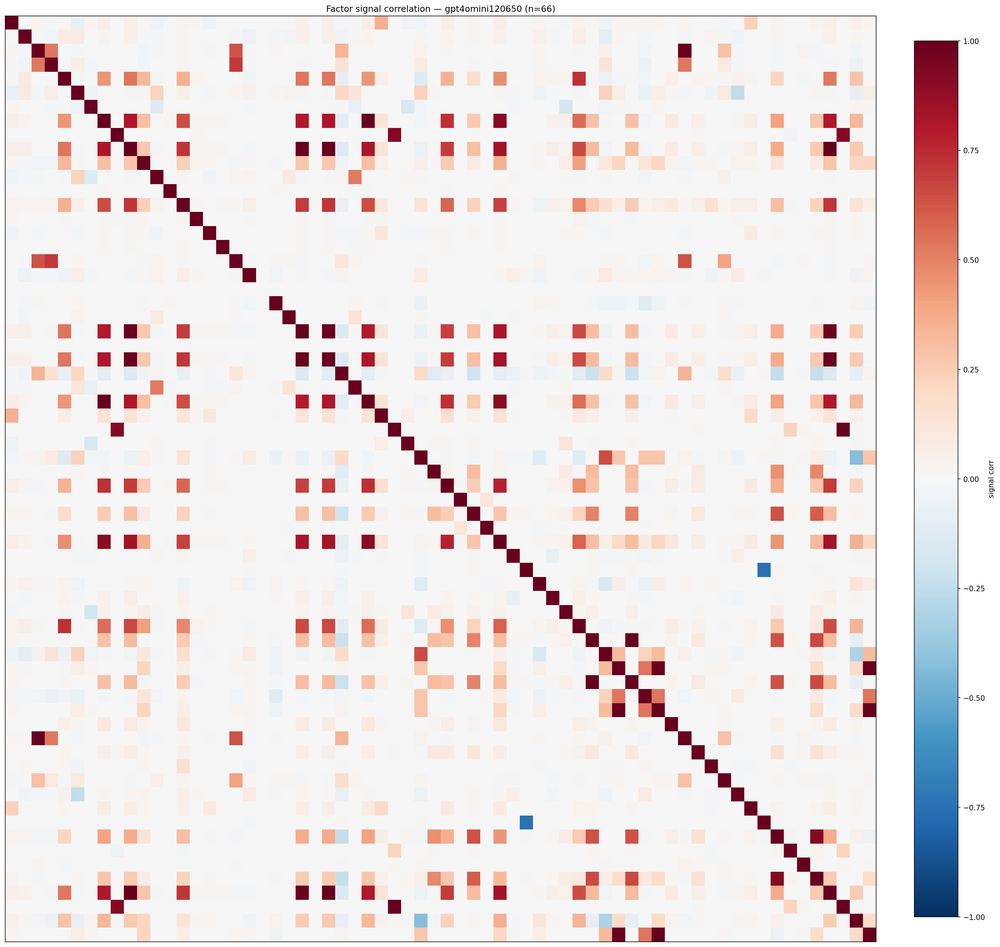

*Signal correlation matrix — gpt4omini120650*

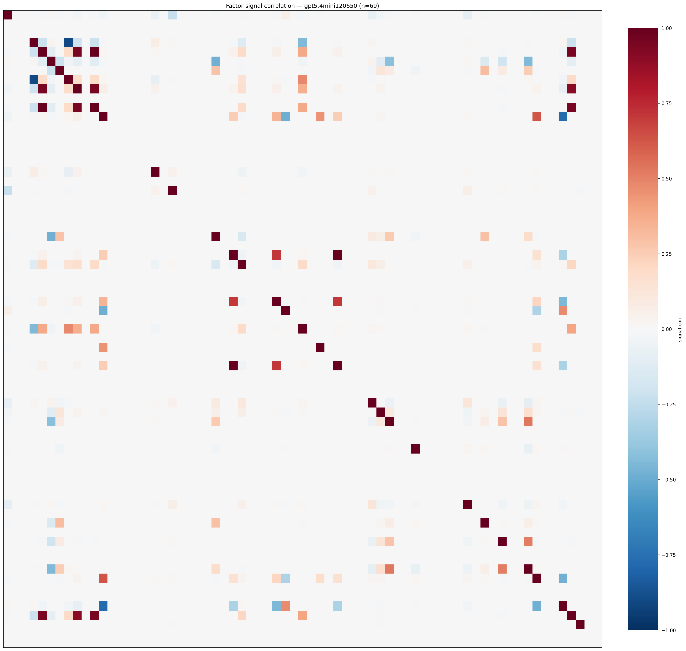

*Signal correlation matrix — gpt5.4mini120650*

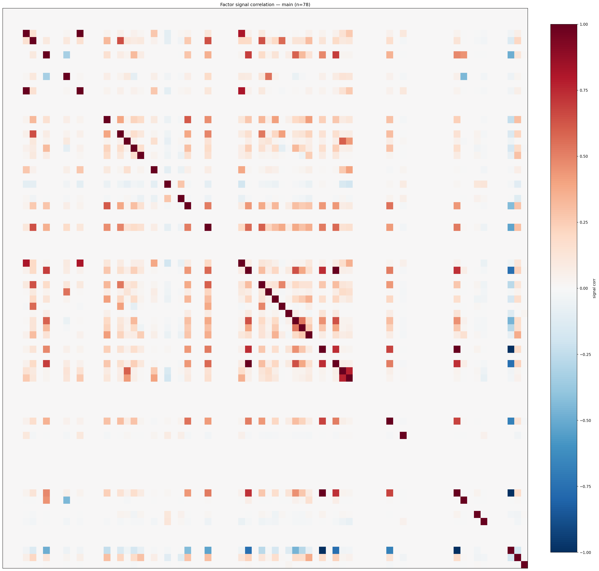

*Signal correlation matrix — main*

## 3. Deflation & model-based importance

`deflated_best_ic` haircuts each zoo's best |IC| for the number of factors tried (`ic_n_tested`) — a bigger zoo's best factor is more likely to be lucky. `lasso_n_nonzero` / `lasso_sparsity` show how many factors a sparse linear model actually keeps (model-view redundancy).

| prerun | best_ic | deflated_best_ic | deflated_best_t | ic_n_tested | ic_n_obs | lasso_n_nonzero | lasso_sparsity |
| --- | --- | --- | --- | --- | --- | --- | --- |
| gpt4omini120650 | 0.0126 | 0.005 | 1.889 | 64 | 142739 | 0 | 1.0 |
| gpt5.4mini120650 | 0.0156 | 0.0086 | 3.2572 | 31 | 142739 | 3 | 0.9565 |
| main | 0.013 | 0.0058 | 2.2046 | 38 | 142739 | 4 | 0.9487 |

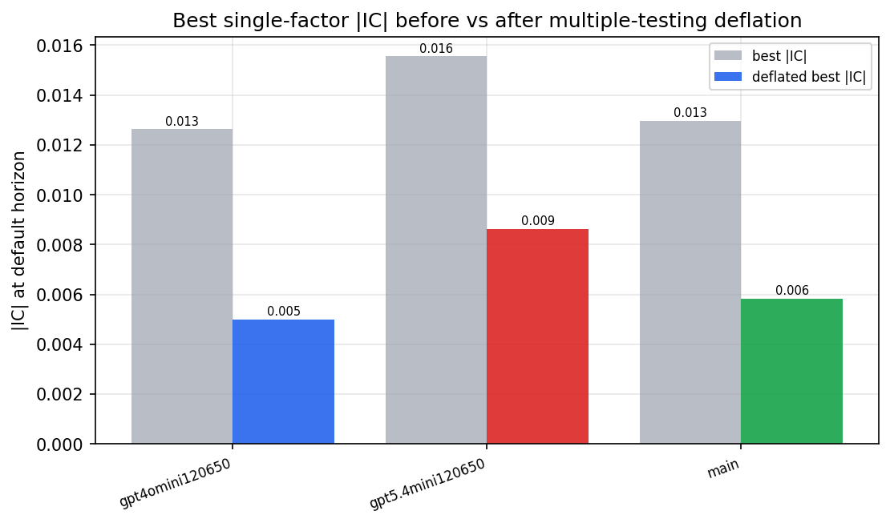

*Best |IC| before vs after multiple-testing deflation*

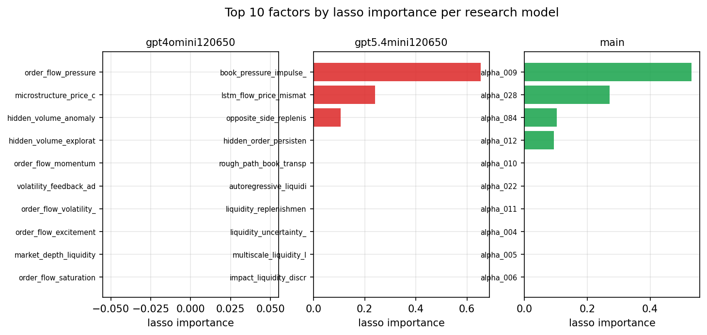

*Top factors by lasso importance per zoo*

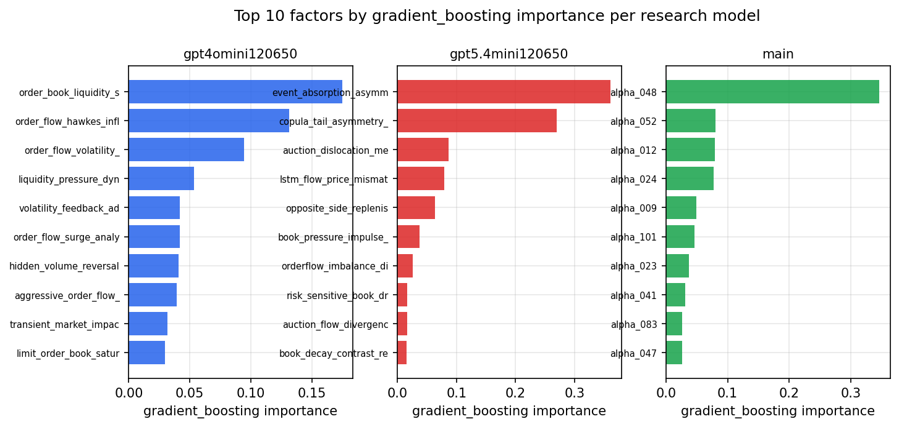

*Top factors by gradient_boosting importance per zoo*

## 4. ML-combined signal — per-underlying vectorised backtest

Each model combines a prerun's factors into ONE signal (fit `factors → forward return` on IS, predict per (bar, underlying)), then that combined signal is run through a simple vectorised backtest — `position(signal) × the underlying's own forward return` — on the held-out OOS tail (+ an equal-weight ensemble). No cross-sectional ranking.

> Config: position=**threshold** (t=1.0, z-score `expanding`), aggregation=**portfolio**, fit-standardise=**per_underlying**, horizon=6.

| prerun | model | n_factors_used | oos_ic | oos_sharpe | is_sharpe | oos_ann_return | oos_max_drawdown |
| --- | --- | --- | --- | --- | --- | --- | --- |
| gpt4omini120650 | linear_regression | 66 | -0.0058 | 4.0071 | 4.6735 | 0.0845 | -0.0012 |
| gpt4omini120650 | ridge | 66 | -0.0049 | 3.4765 | 3.9911 | 0.0741 | -0.0017 |
| gpt4omini120650 | lasso | 66 | nan | nan | nan | nan | nan |
| gpt4omini120650 | elastic_net | 66 | nan | nan | nan | nan | nan |
| gpt4omini120650 | random_forest | 66 | -0.0014 | -0.5377 | 8.8032 | -0.036 | -0.0204 |
| gpt4omini120650 | gradient_boosting | 66 | -0.0064 | 3.7663 | 8.1483 | 0.1508 | -0.0055 |
| gpt4omini120650 | xgboost | 66 | -0.003 | 1.2983 | 11.819 | 0.08 | -0.016 |
| gpt4omini120650 | lightgbm | 66 | -0.0102 | -1.5316 | 15.5922 | -0.1012 | -0.0194 |
| gpt4omini120650 | ensemble | 66 | -0.0098 | 0.1608 | 12.359 | 0.0102 | -0.014 |
| gpt5.4mini120650 | linear_regression | 69 | 0.0073 | 3.3294 | 9.887 | 0.1494 | -0.0107 |
| gpt5.4mini120650 | ridge | 69 | 0.0082 | 3.6519 | 10.0772 | 0.1684 | -0.0092 |
| gpt5.4mini120650 | lasso | 69 | 0.0098 | 2.3084 | 9.7045 | 0.0903 | -0.009 |
| gpt5.4mini120650 | elastic_net | 69 | 0.0099 | 3.1308 | 9.6839 | 0.1628 | -0.0101 |
| gpt5.4mini120650 | random_forest | 69 | 0.0017 | 1.1521 | 8.9926 | 0.0776 | -0.0134 |
| gpt5.4mini120650 | gradient_boosting | 69 | 0.0062 | 2.408 | 10.1689 | 0.1082 | -0.0102 |
| gpt5.4mini120650 | xgboost | 69 | 0.0083 | 4.2689 | 11.1423 | 0.2621 | -0.0118 |
| gpt5.4mini120650 | lightgbm | 69 | 0.0139 | 2.4745 | 14.2703 | 0.1318 | -0.0089 |
| gpt5.4mini120650 | ensemble | 69 | 0.0086 | 3.6387 | 11.9689 | 0.2229 | -0.0116 |
| main | linear_regression | 78 | -0.0053 | -0.7615 | 10.2542 | -0.0378 | -0.0168 |
| main | ridge | 78 | -0.0071 | -2.2526 | 10.3817 | -0.1006 | -0.0194 |
| main | lasso | 78 | -0.0066 | -0.8844 | 9.279 | -0.0391 | -0.0146 |
| main | elastic_net | 78 | -0.0066 | -0.7661 | 9.2868 | -0.0338 | -0.0142 |
| main | random_forest | 78 | 0.0023 | 3.2903 | 12.2073 | 0.1495 | -0.0113 |
| main | gradient_boosting | 78 | 0.0011 | 0.1792 | 13.5752 | 0.0058 | -0.0124 |
| main | xgboost | 78 | -0.0005 | -2.7425 | 14.7047 | -0.1005 | -0.0168 |
| main | lightgbm | 78 | 0.0069 | 1.4439 | 19.1032 | 0.0503 | -0.0105 |
| main | ensemble | 78 | -0.0006 | -0.8817 | 13.7654 | -0.0388 | -0.0162 |

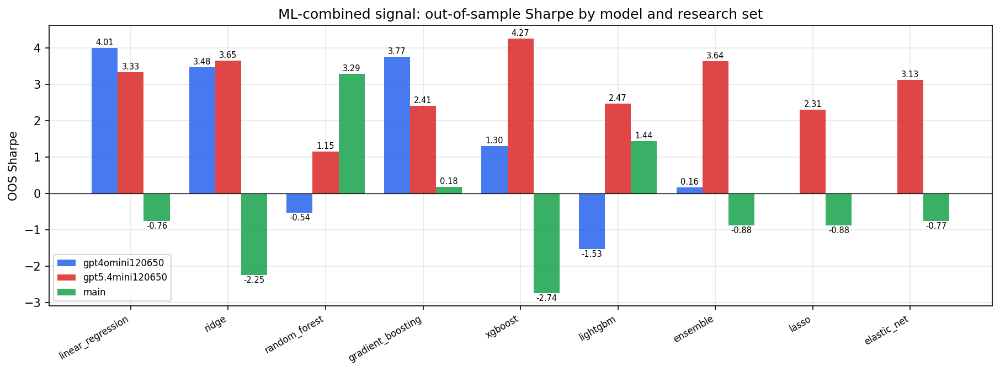

*ML-combined OOS Sharpe by model and research set*

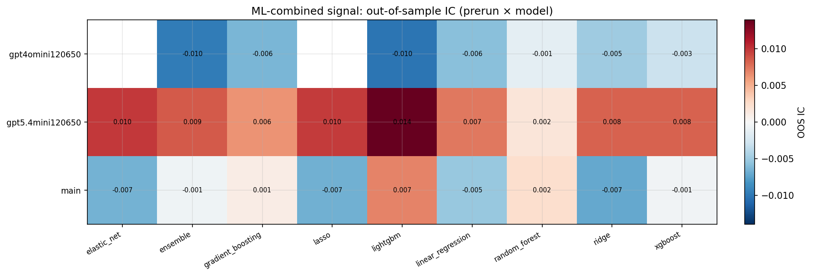

*ML-combined OOS IC (prerun × model)*

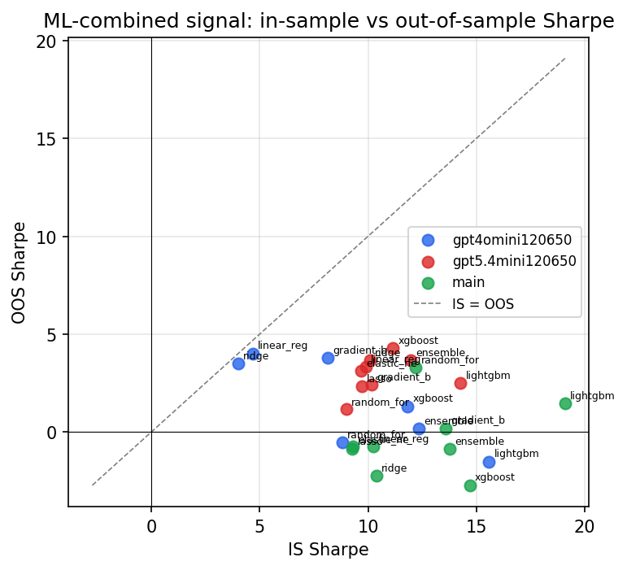

*IS vs OOS Sharpe (overfitting diagnostic)*

---
*Generated by `run_model_comparison.py`. Tables: `*.csv`; interactive: `comparison.ipynb`.*
