# Research-LLM factor comparison — `2024-04`

Comparing the **factor output of different research LLMs** on three axes (raw factor quality → factors as ML features → factors through the full agentic fund). The panel, IS/OOS split, horizon and model hyper-parameters are held identical across preruns — the *only* variable is the factor set.

## Preruns compared

| prerun | research_model | usable_factors | dropped_factors |
| --- | --- | --- | --- |
| gpt4omini120650 | gpt-4o-mini | 66 | 0 |
| gpt5.4mini120650 | gpt-5.4-mini | 69 | 0 |
| main | seed library | 78 | 10 |

> Dropped factors declare fields the current data doesn't have yet (e.g. fundamentals); they light up unchanged once that data is downloaded.

*Usable vs awaiting-data factors per research model*

## Key findings

- **Best ML-combined OOS Sharpe:** `gpt4omini120650` with `xgboost` (OOS Sharpe = 2.057).
- **Mean OOS Sharpe across models, by research set:** `gpt4omini120650` = -0.742, `main` = -1.581, `gpt5.4mini120650` = -2.048.
- **Highest mean single-factor |IC| (h=6):** `gpt5.4mini120650` (mean |IC| = 0.0065).
- **Most diverse zoo (highest effective/raw factor ratio):** `gpt5.4mini120650` (eff 46.7 of 69, ratio 0.68).
- **Best selection-deflated single-factor |IC|:** `gpt4omini120650` (deflated |IC| = 0.0083 from 64 factors tried).

## 1. Single-factor IC (raw factor quality)

Per-underlying time-series Spearman rank-IC of every researched factor, recomputed on the shared panel at horizons h=1, h=6, h=60. The per-underlying IC correlates each factor's value vector with the underlying's own forward-return vector (pooled across underlyings); the cross-sectional IC ranks across underlyings per timestamp.

| prerun | n_factors | mean_abs_ic_1 | mean_abs_ic_6 | mean_abs_ic_60 | mean_abs_icir_6 | best_factor_h6 | best_abs_ic_h6 |
| --- | --- | --- | --- | --- | --- | --- | --- |
| gpt4omini120650 | 66 | 0.0071 | 0.0048 | 0.0056 | 0.3259 | order_flow_skewness_indicator | 0.0159 |
| gpt5.4mini120650 | 69 | 0.0041 | 0.0065 | 0.0053 | 0.4289 | auction_reversion_anchor_gap | 0.0148 |
| main | 78 | 0.0105 | 0.0055 | 0.0037 | 0.3928 | alpha_035 | 0.0141 |

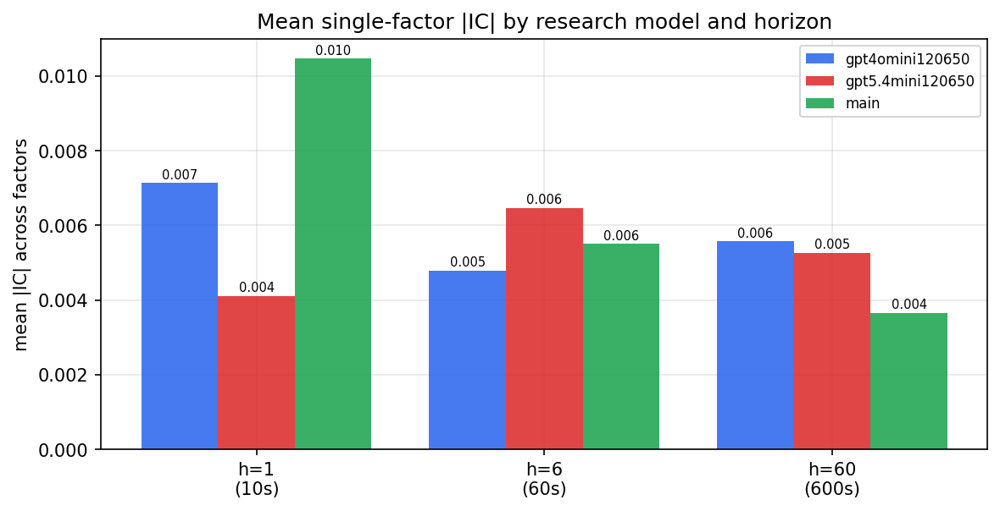

*Mean |IC| by research model and horizon*

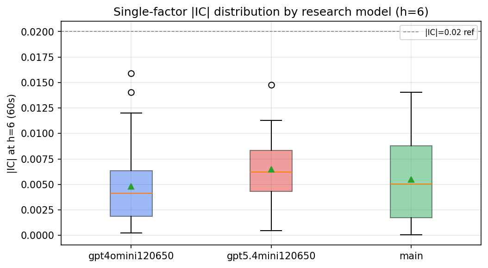

*Per-factor |IC| distribution by research model*

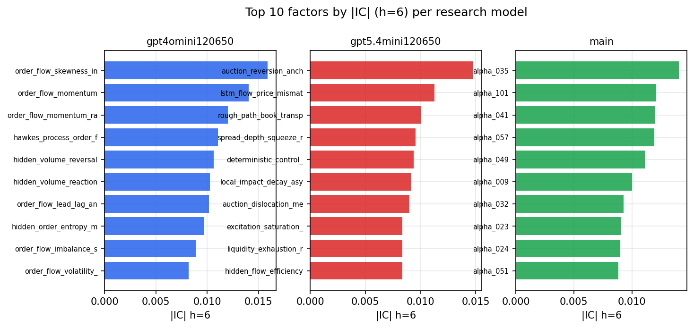

*Top factors by |IC| per research model*

## 2. Factor diversity & redundancy

Pairwise correlation of each zoo's *signals*. `eff_n_factors` is the effective number of independent factors (participation ratio of the correlation eigenvalues); `eff_ratio` and `redundancy` summarise how much unique information the zoo holds vs. how much is duplicated; `n_clusters` groups factors at |corr| ≥ 0.7.

| prerun | n_factors | eff_n_factors | eff_ratio | mean_abs_corr | n_clusters | redundancy |
| --- | --- | --- | --- | --- | --- | --- |
| gpt4omini120650 | 66 | 24.306 | 0.3683 | 0.0562 | 49 | 0.6317 |
| gpt5.4mini120650 | 69 | 46.6715 | 0.6764 | 0.0141 | 62 | 0.3236 |
| main | 78 | 41.899 | 0.5372 | 0.0297 | 71 | 0.4628 |

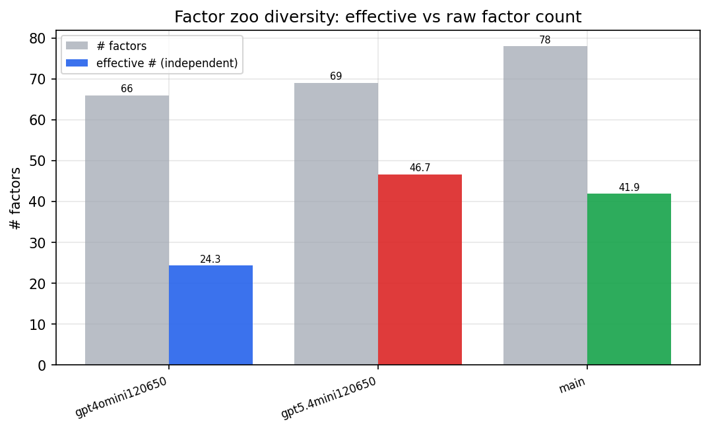

*Effective vs raw factor count per research model*

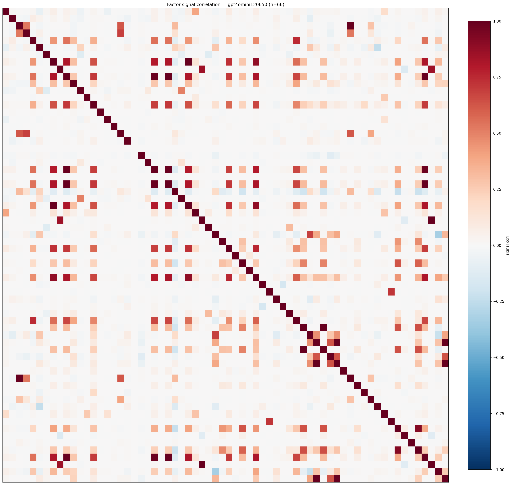

*Signal correlation matrix — gpt4omini120650*

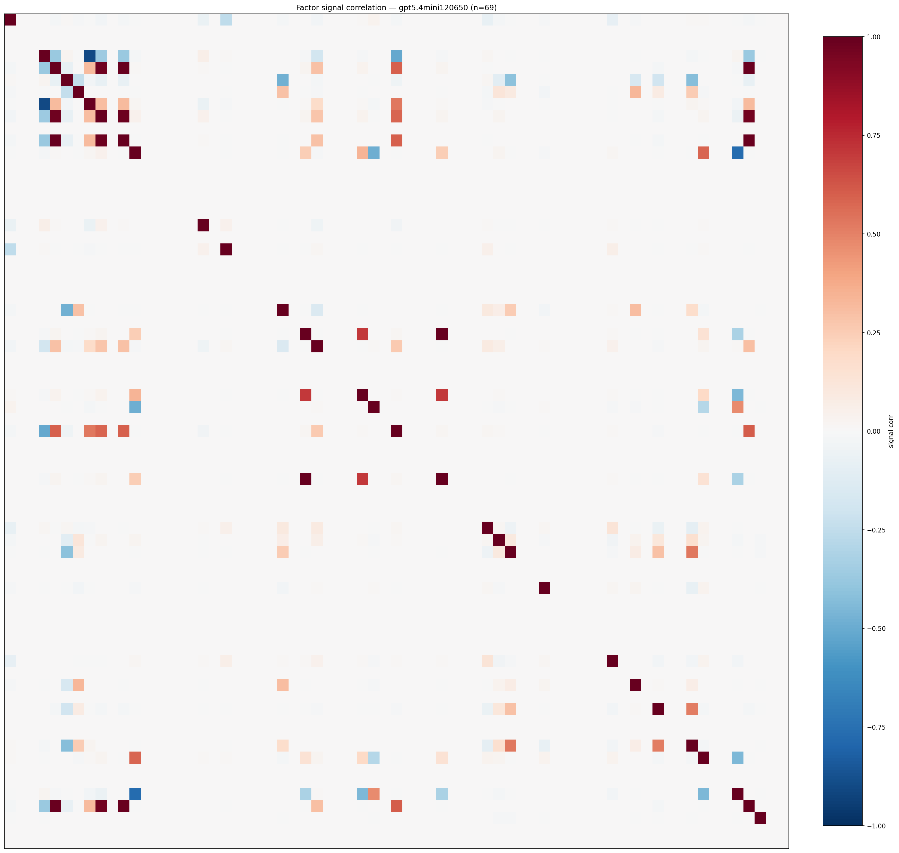

*Signal correlation matrix — gpt5.4mini120650*

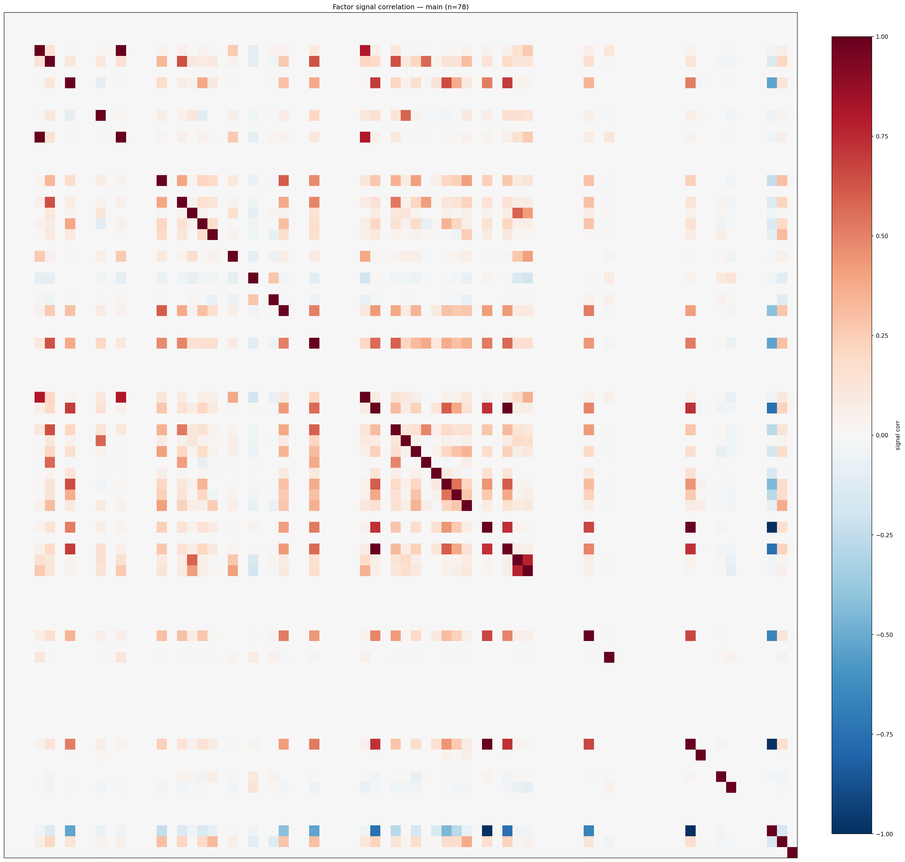

*Signal correlation matrix — main*

## 3. Deflation & model-based importance

`deflated_best_ic` haircuts each zoo's best |IC| for the number of factors tried (`ic_n_tested`) — a bigger zoo's best factor is more likely to be lucky. `lasso_n_nonzero` / `lasso_sparsity` show how many factors a sparse linear model actually keeps (model-view redundancy).

| prerun | best_ic | deflated_best_ic | deflated_best_t | ic_n_tested | ic_n_obs | lasso_n_nonzero | lasso_sparsity |
| --- | --- | --- | --- | --- | --- | --- | --- |
| gpt4omini120650 | 0.0159 | 0.0083 | 3.1724 | 64 | 145079 | 12 | 0.8182 |
| gpt5.4mini120650 | 0.0148 | 0.0079 | 3.0119 | 31 | 145079 | 0 | 1.0 |
| main | 0.0141 | 0.007 | 2.6574 | 38 | 145079 | 0 | 1.0 |

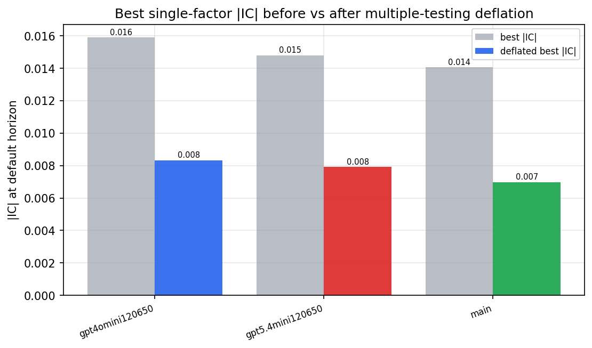

*Best |IC| before vs after multiple-testing deflation*

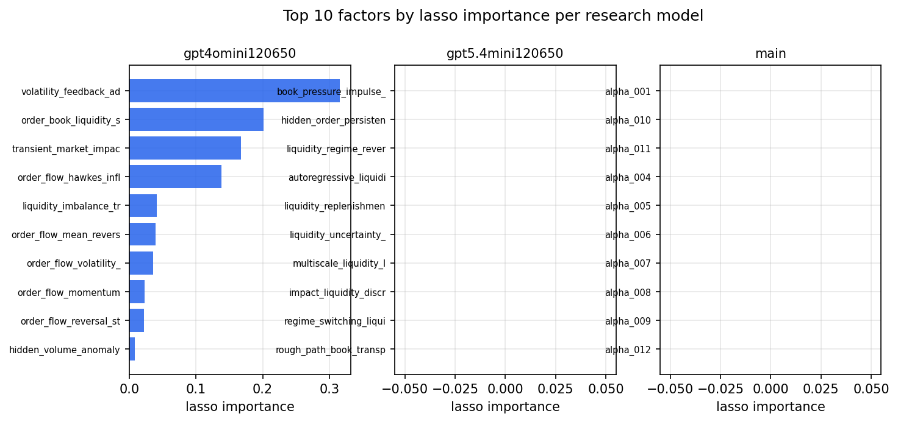

*Top factors by lasso importance per zoo*

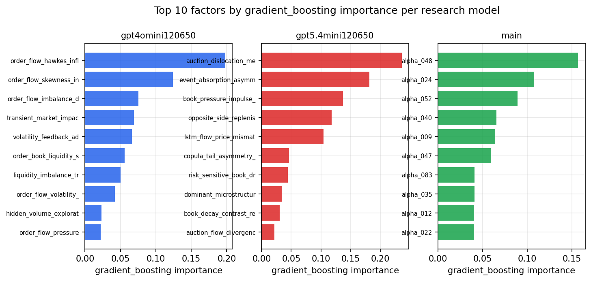

*Top factors by gradient_boosting importance per zoo*

## 4. ML-combined signal — per-underlying vectorised backtest

Each model combines a prerun's factors into ONE signal (fit `factors → forward return` on IS, predict per (bar, underlying)), then that combined signal is run through a simple vectorised backtest — `position(signal) × the underlying's own forward return` — on the held-out OOS tail (+ an equal-weight ensemble). No cross-sectional ranking.

> Config: position=**threshold** (t=1.0, z-score `expanding`), aggregation=**portfolio**, fit-standardise=**per_underlying**, horizon=6.

| prerun | model | n_factors_used | oos_ic | oos_sharpe | is_sharpe | oos_ann_return | oos_max_drawdown |
| --- | --- | --- | --- | --- | --- | --- | --- |
| gpt4omini120650 | linear_regression | 66 | -0.0019 | -2.0653 | 4.0812 | -0.2126 | -0.0323 |
| gpt4omini120650 | ridge | 66 | -0.0021 | -1.4656 | 4.5635 | -0.1448 | -0.0355 |
| gpt4omini120650 | lasso | 66 | -0.0002 | -1.4448 | 3.1024 | -0.1385 | -0.0339 |
| gpt4omini120650 | elastic_net | 66 | 0.0007 | -1.0107 | 2.4464 | -0.0971 | -0.0294 |
| gpt4omini120650 | random_forest | 66 | -0.0097 | 0.4756 | 8.8026 | 0.0431 | -0.015 |
| gpt4omini120650 | gradient_boosting | 66 | 0.0039 | -0.28 | 9.2044 | -0.0172 | -0.0157 |
| gpt4omini120650 | xgboost | 66 | 0.0079 | 2.0567 | 12.0711 | 0.1075 | -0.0083 |
| gpt4omini120650 | lightgbm | 66 | 0.008 | -0.0879 | 14.7322 | -0.004 | -0.0094 |
| gpt4omini120650 | ensemble | 66 | 0.0019 | -2.8553 | 9.8633 | -0.2874 | -0.031 |
| gpt5.4mini120650 | linear_regression | 69 | -0.0075 | -3.6749 | 7.9896 | -0.2019 | -0.0302 |
| gpt5.4mini120650 | ridge | 69 | -0.007 | -3.9741 | 7.4055 | -0.2145 | -0.0285 |
| gpt5.4mini120650 | lasso | 69 | nan | nan | nan | nan | nan |
| gpt5.4mini120650 | elastic_net | 69 | nan | nan | nan | nan | nan |
| gpt5.4mini120650 | random_forest | 69 | -0.0096 | -1.3675 | 8.786 | -0.1268 | -0.0303 |
| gpt5.4mini120650 | gradient_boosting | 69 | 0.0061 | -2.5442 | 9.2245 | -0.1695 | -0.0174 |
| gpt5.4mini120650 | xgboost | 69 | -0.0032 | -1.41 | 10.5491 | -0.1026 | -0.0233 |
| gpt5.4mini120650 | lightgbm | 69 | -0.0041 | -0.5279 | 14.2044 | -0.0392 | -0.0183 |
| gpt5.4mini120650 | ensemble | 69 | -0.0068 | -0.8362 | 11.346 | -0.0672 | -0.0229 |
| main | linear_regression | 78 | -0.0099 | -1.5484 | 8.1602 | -0.0868 | -0.0197 |
| main | ridge | 78 | -0.0085 | -1.1803 | 8.377 | -0.0695 | -0.0227 |
| main | lasso | 78 | nan | nan | nan | nan | nan |
| main | elastic_net | 78 | nan | nan | nan | nan | nan |
| main | random_forest | 78 | -0.0114 | -2.4529 | 15.8938 | -0.1324 | -0.0266 |
| main | gradient_boosting | 78 | -0.0127 | -3.0649 | 13.2755 | -0.1461 | -0.0258 |
| main | xgboost | 78 | -0.0081 | -1.395 | 18.4169 | -0.0707 | -0.0258 |
| main | lightgbm | 78 | -0.0058 | 0.2797 | 20.9524 | 0.0098 | -0.0147 |
| main | ensemble | 78 | -0.0114 | -1.7039 | 17.204 | -0.0975 | -0.0293 |

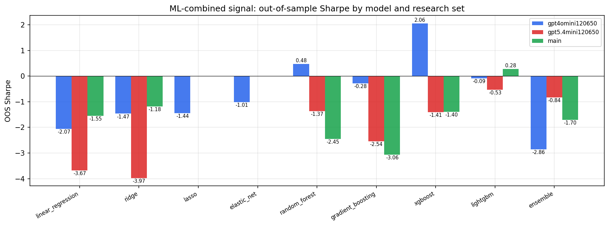

*ML-combined OOS Sharpe by model and research set*

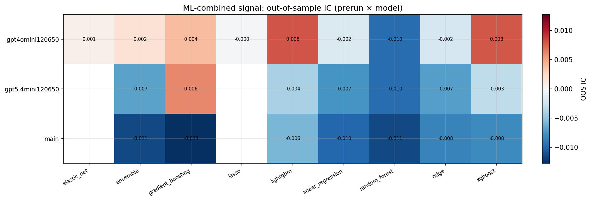

*ML-combined OOS IC (prerun × model)*

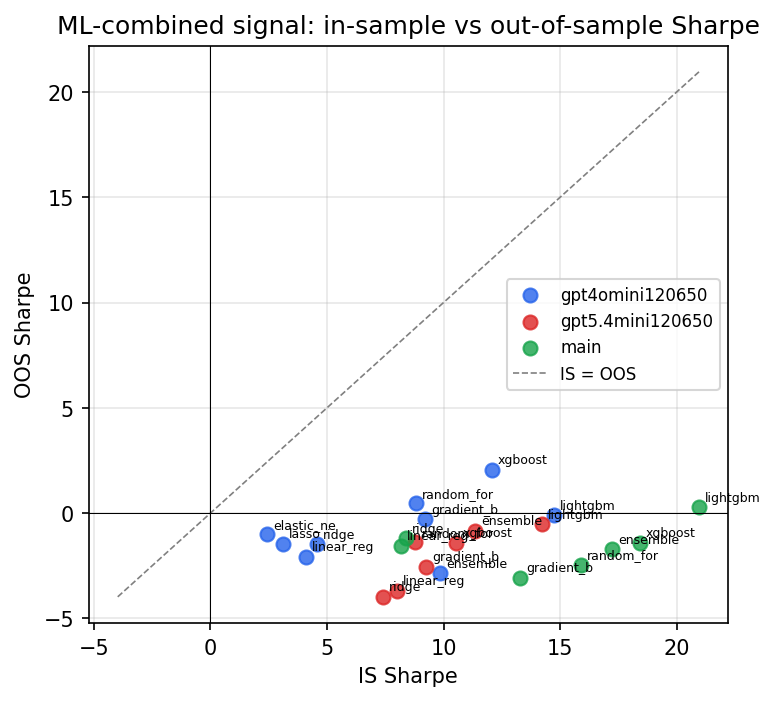

*IS vs OOS Sharpe (overfitting diagnostic)*

---
*Generated by `run_model_comparison.py`. Tables: `*.csv`; interactive: `comparison.ipynb`.*
