# Research-LLM factor comparison — `2024-05`

Comparing the **factor output of different research LLMs** on three axes (raw factor quality → factors as ML features → factors through the full agentic fund). The panel, IS/OOS split, horizon and model hyper-parameters are held identical across preruns — the *only* variable is the factor set.

## Preruns compared

| prerun | research_model | usable_factors | dropped_factors |
| --- | --- | --- | --- |
| gpt4omini120650 | gpt-4o-mini | 66 | 0 |
| gpt5.4mini120650 | gpt-5.4-mini | 69 | 0 |
| main | seed library | 78 | 10 |

> Dropped factors declare fields the current data doesn't have yet (e.g. fundamentals); they light up unchanged once that data is downloaded.

*Usable vs awaiting-data factors per research model*

## Key findings

- **Best ML-combined OOS Sharpe:** `gpt4omini120650` with `xgboost` (OOS Sharpe = 4.768).
- **Mean OOS Sharpe across models, by research set:** `gpt4omini120650` = 2.150, `gpt5.4mini120650` = 1.306, `main` = -3.095.
- **Highest mean single-factor |IC| (h=6):** `main` (mean |IC| = 0.0078).
- **Most diverse zoo (highest effective/raw factor ratio):** `gpt5.4mini120650` (eff 50.1 of 69, ratio 0.73).
- **Best selection-deflated single-factor |IC|:** `main` (deflated |IC| = 0.0112 from 38 factors tried).

## 1. Single-factor IC (raw factor quality)

Per-underlying time-series Spearman rank-IC of every researched factor, recomputed on the shared panel at horizons h=1, h=6, h=60. The per-underlying IC correlates each factor's value vector with the underlying's own forward-return vector (pooled across underlyings); the cross-sectional IC ranks across underlyings per timestamp.

| prerun | n_factors | mean_abs_ic_1 | mean_abs_ic_6 | mean_abs_ic_60 | mean_abs_icir_6 | best_factor_h6 | best_abs_ic_h6 |
| --- | --- | --- | --- | --- | --- | --- | --- |
| gpt4omini120650 | 66 | 0.0073 | 0.0072 | 0.0072 | 0.5053 | order_flow_momentum | 0.0178 |
| gpt5.4mini120650 | 69 | 0.0044 | 0.0059 | 0.0052 | 0.4711 | lstm_flow_price_mismatch | 0.017 |
| main | 78 | 0.0103 | 0.0078 | 0.0041 | 0.5956 | alpha_035 | 0.0182 |

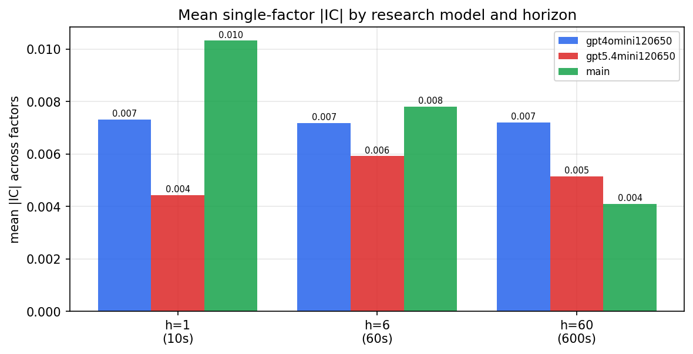

*Mean |IC| by research model and horizon*

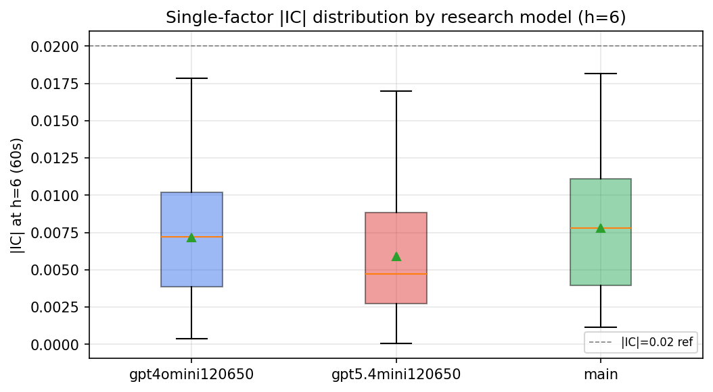

*Per-factor |IC| distribution by research model*

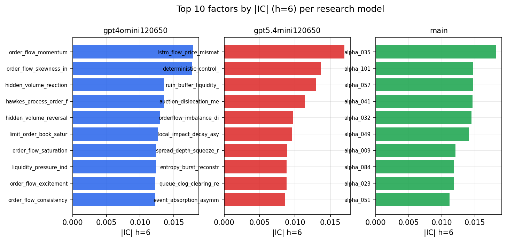

*Top factors by |IC| per research model*

## 2. Factor diversity & redundancy

Pairwise correlation of each zoo's *signals*. `eff_n_factors` is the effective number of independent factors (participation ratio of the correlation eigenvalues); `eff_ratio` and `redundancy` summarise how much unique information the zoo holds vs. how much is duplicated; `n_clusters` groups factors at |corr| ≥ 0.7.

| prerun | n_factors | eff_n_factors | eff_ratio | mean_abs_corr | n_clusters | redundancy |
| --- | --- | --- | --- | --- | --- | --- |
| gpt4omini120650 | 66 | 25.1002 | 0.3803 | 0.0549 | 50 | 0.6197 |
| gpt5.4mini120650 | 69 | 50.1106 | 0.7262 | 0.012 | 65 | 0.2738 |
| main | 78 | 42.4914 | 0.5448 | 0.0289 | 71 | 0.4552 |

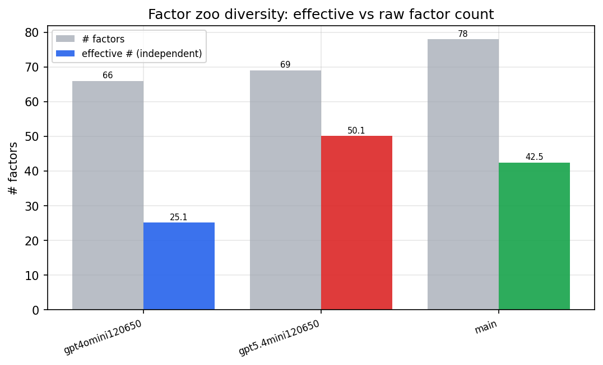

*Effective vs raw factor count per research model*

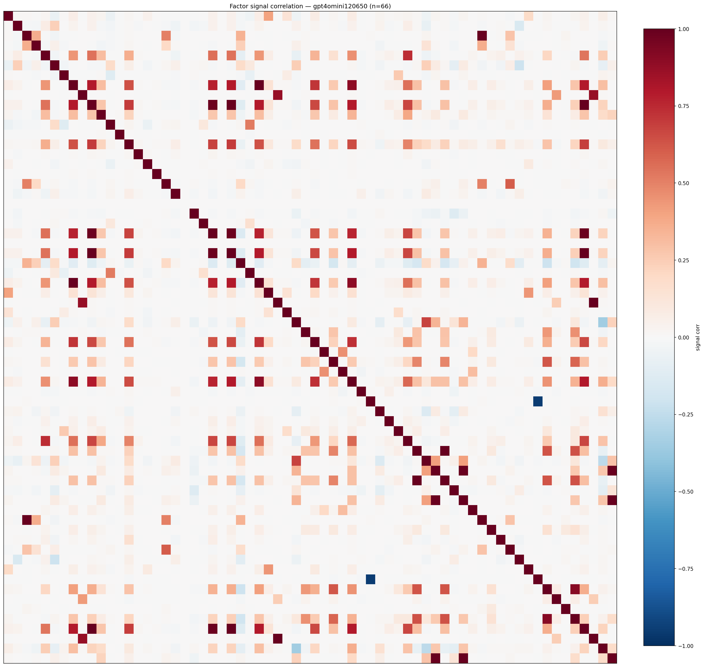

*Signal correlation matrix — gpt4omini120650*

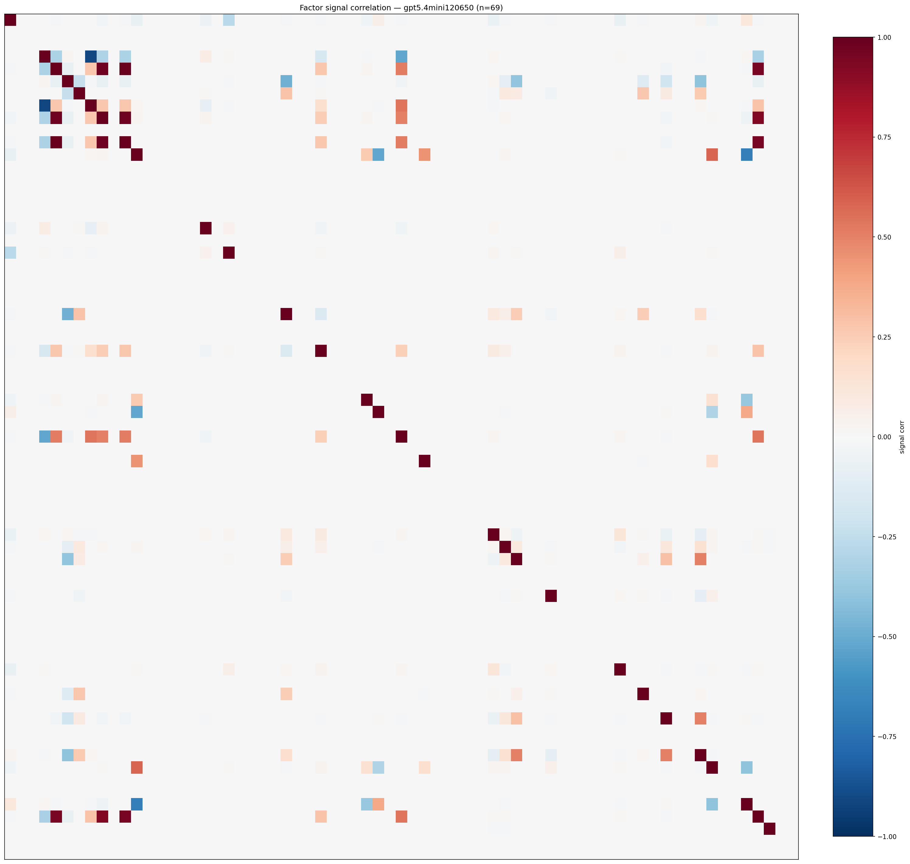

*Signal correlation matrix — gpt5.4mini120650*

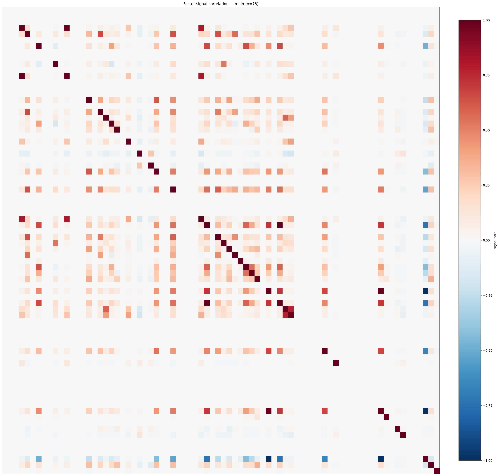

*Signal correlation matrix — main*

## 3. Deflation & model-based importance

`deflated_best_ic` haircuts each zoo's best |IC| for the number of factors tried (`ic_n_tested`) — a bigger zoo's best factor is more likely to be lucky. `lasso_n_nonzero` / `lasso_sparsity` show how many factors a sparse linear model actually keeps (model-view redundancy).

| prerun | best_ic | deflated_best_ic | deflated_best_t | ic_n_tested | ic_n_obs | lasso_n_nonzero | lasso_sparsity |
| --- | --- | --- | --- | --- | --- | --- | --- |
| gpt4omini120650 | 0.0178 | 0.0104 | 4.0175 | 64 | 149759 | 0 | 1.0 |
| gpt5.4mini120650 | 0.017 | 0.0102 | 3.9461 | 31 | 149759 | 0 | 1.0 |
| main | 0.0182 | 0.0112 | 4.3305 | 38 | 149759 | 0 | 1.0 |

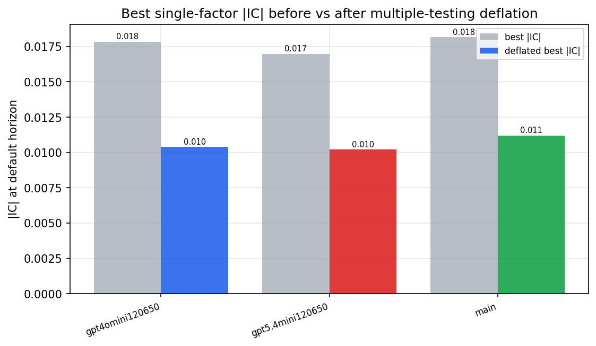

*Best |IC| before vs after multiple-testing deflation*

*Top factors by lasso importance per zoo*

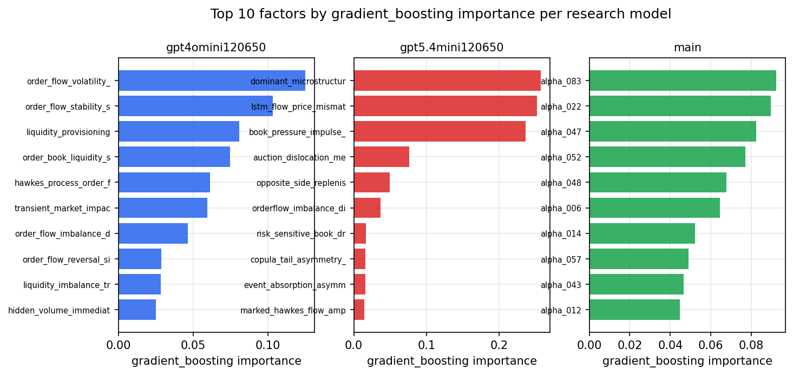

*Top factors by gradient_boosting importance per zoo*

## 4. ML-combined signal — per-underlying vectorised backtest

Each model combines a prerun's factors into ONE signal (fit `factors → forward return` on IS, predict per (bar, underlying)), then that combined signal is run through a simple vectorised backtest — `position(signal) × the underlying's own forward return` — on the held-out OOS tail (+ an equal-weight ensemble). No cross-sectional ranking.

> Config: position=**threshold** (t=1.0, z-score `expanding`), aggregation=**portfolio**, fit-standardise=**per_underlying**, horizon=6.

| prerun | model | n_factors_used | oos_ic | oos_sharpe | is_sharpe | oos_ann_return | oos_max_drawdown |
| --- | --- | --- | --- | --- | --- | --- | --- |
| gpt4omini120650 | linear_regression | 66 | 0.0075 | -0.8411 | 7.357 | -0.0639 | -0.0296 |
| gpt4omini120650 | ridge | 66 | 0.0076 | -0.8404 | 7.4333 | -0.0634 | -0.0282 |
| gpt4omini120650 | lasso | 66 | nan | nan | nan | nan | nan |
| gpt4omini120650 | elastic_net | 66 | nan | nan | nan | nan | nan |
| gpt4omini120650 | random_forest | 66 | 0.0037 | 1.8699 | 10.5882 | 0.0915 | -0.0133 |
| gpt4omini120650 | gradient_boosting | 66 | 0.0158 | 4.1281 | 11.077 | 0.1457 | -0.0053 |
| gpt4omini120650 | xgboost | 66 | 0.0053 | 4.768 | 14.5653 | 0.2262 | -0.0067 |
| gpt4omini120650 | lightgbm | 66 | 0.0023 | 4.6606 | 17.2033 | 0.1902 | -0.0083 |
| gpt4omini120650 | ensemble | 66 | 0.0089 | 1.3047 | 14.2557 | 0.061 | -0.0083 |
| gpt5.4mini120650 | linear_regression | 69 | 0.0009 | 0.087 | 4.7056 | 0.0031 | -0.0078 |
| gpt5.4mini120650 | ridge | 69 | 0.0007 | 0.5547 | 5.0001 | 0.0207 | -0.0084 |
| gpt5.4mini120650 | lasso | 69 | nan | nan | nan | nan | nan |
| gpt5.4mini120650 | elastic_net | 69 | nan | nan | nan | nan | nan |
| gpt5.4mini120650 | random_forest | 69 | 0.0136 | 1.5853 | 10.5704 | 0.0914 | -0.0168 |
| gpt5.4mini120650 | gradient_boosting | 69 | 0.004 | 0.1539 | 9.5324 | 0.0049 | -0.0081 |
| gpt5.4mini120650 | xgboost | 69 | 0.0173 | 1.6058 | 13.8311 | 0.083 | -0.0158 |
| gpt5.4mini120650 | lightgbm | 69 | 0.0145 | 3.0943 | 17.3434 | 0.0996 | -0.0072 |
| gpt5.4mini120650 | ensemble | 69 | 0.0062 | 2.0634 | 13.7834 | 0.0558 | -0.0075 |
| main | linear_regression | 78 | -0.0038 | -4.5575 | 6.782 | -0.2237 | -0.0261 |
| main | ridge | 78 | -0.0016 | -6.3497 | 6.153 | -0.2924 | -0.0307 |
| main | lasso | 78 | nan | nan | 2.9063 | nan | nan |
| main | elastic_net | 78 | nan | nan | 2.9063 | nan | nan |
| main | random_forest | 78 | 0.0036 | -2.5538 | 17.3315 | -0.1244 | -0.0232 |
| main | gradient_boosting | 78 | 0.0091 | -3.1552 | 16.7552 | -0.0667 | -0.0085 |
| main | xgboost | 78 | 0.0028 | -1.4747 | 21.8641 | -0.0495 | -0.0134 |
| main | lightgbm | 78 | 0.0024 | 0.1138 | 28.8167 | 0.004 | -0.011 |
| main | ensemble | 78 | -0.0011 | -3.6846 | 18.0589 | -0.1338 | -0.0156 |

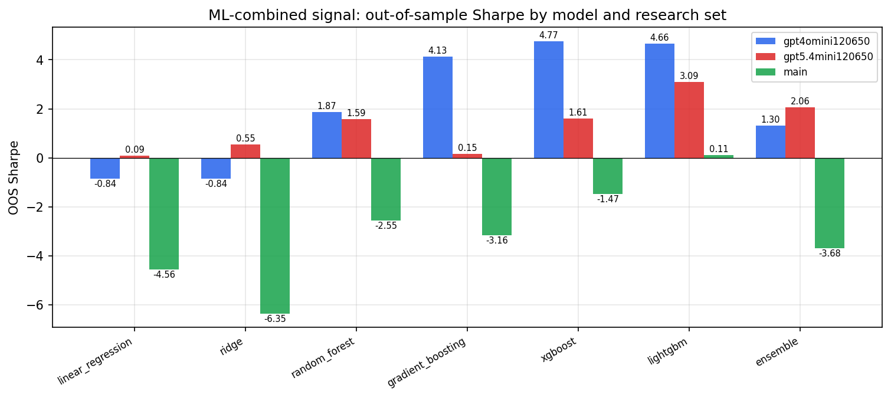

*ML-combined OOS Sharpe by model and research set*

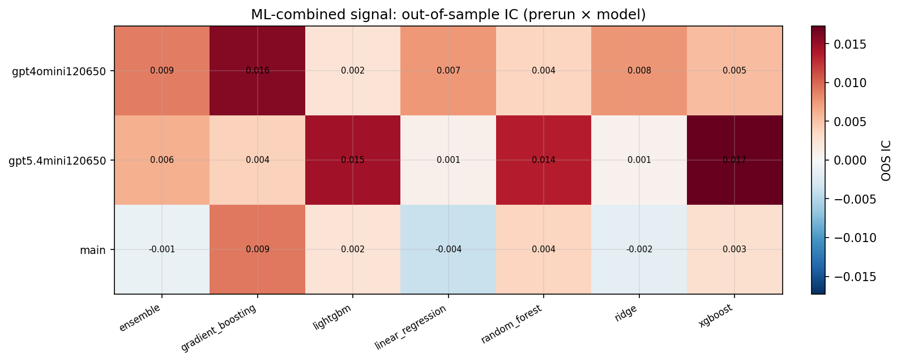

*ML-combined OOS IC (prerun × model)*

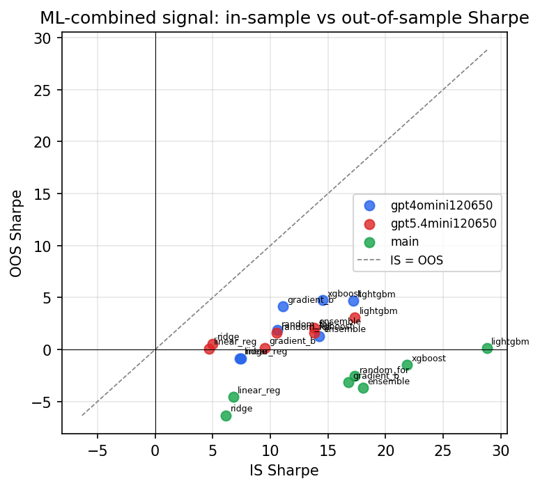

*IS vs OOS Sharpe (overfitting diagnostic)*

---
*Generated by `run_model_comparison.py`. Tables: `*.csv`; interactive: `comparison.ipynb`.*
