# Research-LLM factor comparison — `2024-06`

Comparing the **factor output of different research LLMs** on three axes (raw factor quality → factors as ML features → factors through the full agentic fund). The panel, IS/OOS split, horizon and model hyper-parameters are held identical across preruns — the *only* variable is the factor set.

## Preruns compared

| prerun | research_model | usable_factors | dropped_factors |
| --- | --- | --- | --- |
| gpt4omini120650 | gpt-4o-mini | 66 | 0 |
| gpt5.4mini120650 | gpt-5.4-mini | 69 | 0 |
| main | seed library | 78 | 10 |

> Dropped factors declare fields the current data doesn't have yet (e.g. fundamentals); they light up unchanged once that data is downloaded.

*Usable vs awaiting-data factors per research model*

## Key findings

- **Best ML-combined OOS Sharpe:** `main` with `linear_regression` (OOS Sharpe = 7.929).
- **Mean OOS Sharpe across models, by research set:** `gpt5.4mini120650` = 1.849, `gpt4omini120650` = 1.227, `main` = 0.821.
- **Highest mean single-factor |IC| (h=6):** `gpt5.4mini120650` (mean |IC| = 0.0068).
- **Most diverse zoo (highest effective/raw factor ratio):** `gpt5.4mini120650` (eff 48.6 of 69, ratio 0.70).
- **Best selection-deflated single-factor |IC|:** `gpt5.4mini120650` (deflated |IC| = 0.0112 from 31 factors tried).

## 1. Single-factor IC (raw factor quality)

Per-underlying time-series Spearman rank-IC of every researched factor, recomputed on the shared panel at horizons h=1, h=6, h=60. The per-underlying IC correlates each factor's value vector with the underlying's own forward-return vector (pooled across underlyings); the cross-sectional IC ranks across underlyings per timestamp.

| prerun | n_factors | mean_abs_ic_1 | mean_abs_ic_6 | mean_abs_ic_60 | mean_abs_icir_6 | best_factor_h6 | best_abs_ic_h6 |
| --- | --- | --- | --- | --- | --- | --- | --- |
| gpt4omini120650 | 66 | 0.0075 | 0.0058 | 0.0062 | 0.4163 | order_flow_momentum | 0.0165 |
| gpt5.4mini120650 | 69 | 0.0046 | 0.0068 | 0.0077 | 0.3766 | multiscale_liquidity_leadlag_reversal | 0.018 |
| main | 78 | 0.0082 | 0.0055 | 0.0024 | 0.3944 | alpha_057 | 0.0132 |

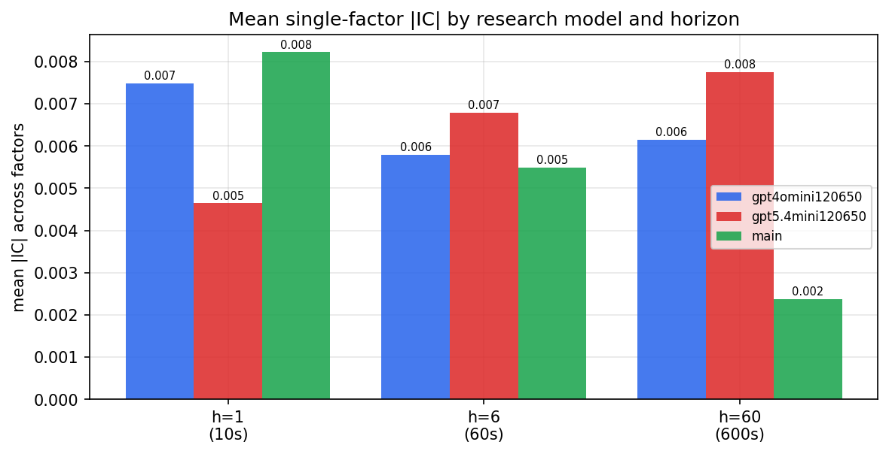

*Mean |IC| by research model and horizon*

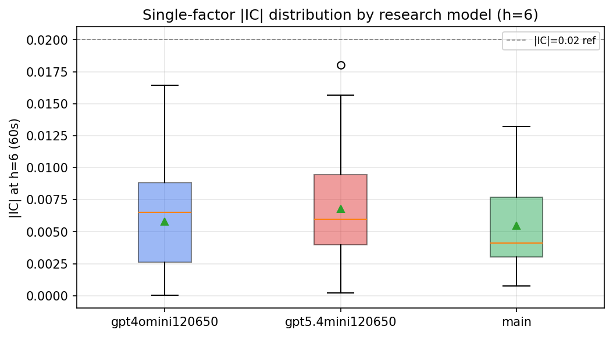

*Per-factor |IC| distribution by research model*

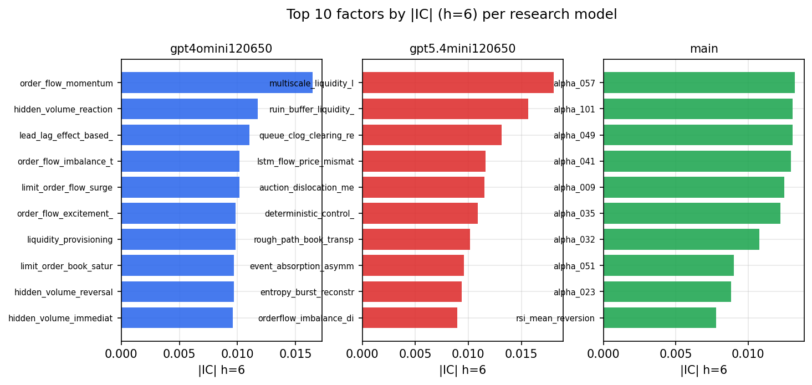

*Top factors by |IC| per research model*

## 2. Factor diversity & redundancy

Pairwise correlation of each zoo's *signals*. `eff_n_factors` is the effective number of independent factors (participation ratio of the correlation eigenvalues); `eff_ratio` and `redundancy` summarise how much unique information the zoo holds vs. how much is duplicated; `n_clusters` groups factors at |corr| ≥ 0.7.

| prerun | n_factors | eff_n_factors | eff_ratio | mean_abs_corr | n_clusters | redundancy |
| --- | --- | --- | --- | --- | --- | --- |
| gpt4omini120650 | 66 | 25.4472 | 0.3856 | 0.0534 | 51 | 0.6144 |
| gpt5.4mini120650 | 69 | 48.634 | 0.7048 | 0.0132 | 62 | 0.2952 |
| main | 78 | 42.4322 | 0.544 | 0.029 | 71 | 0.456 |

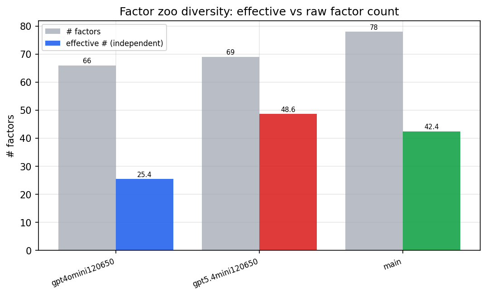

*Effective vs raw factor count per research model*

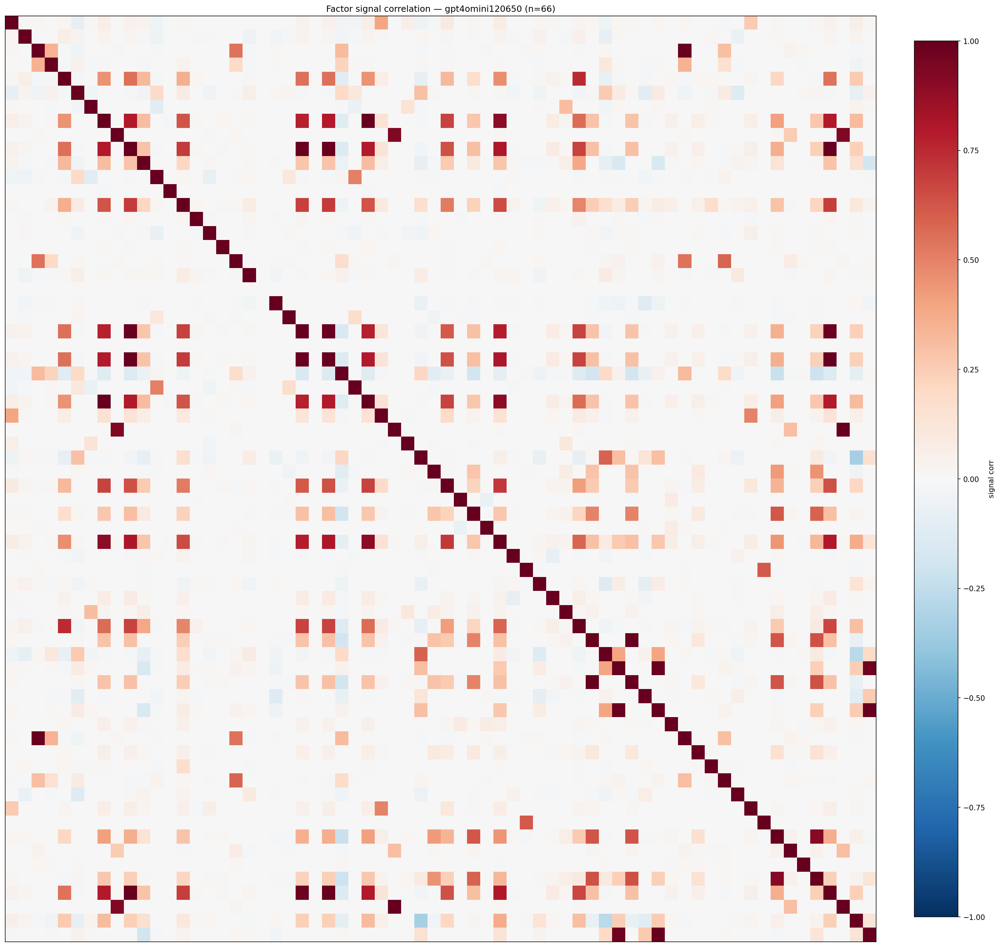

*Signal correlation matrix — gpt4omini120650*

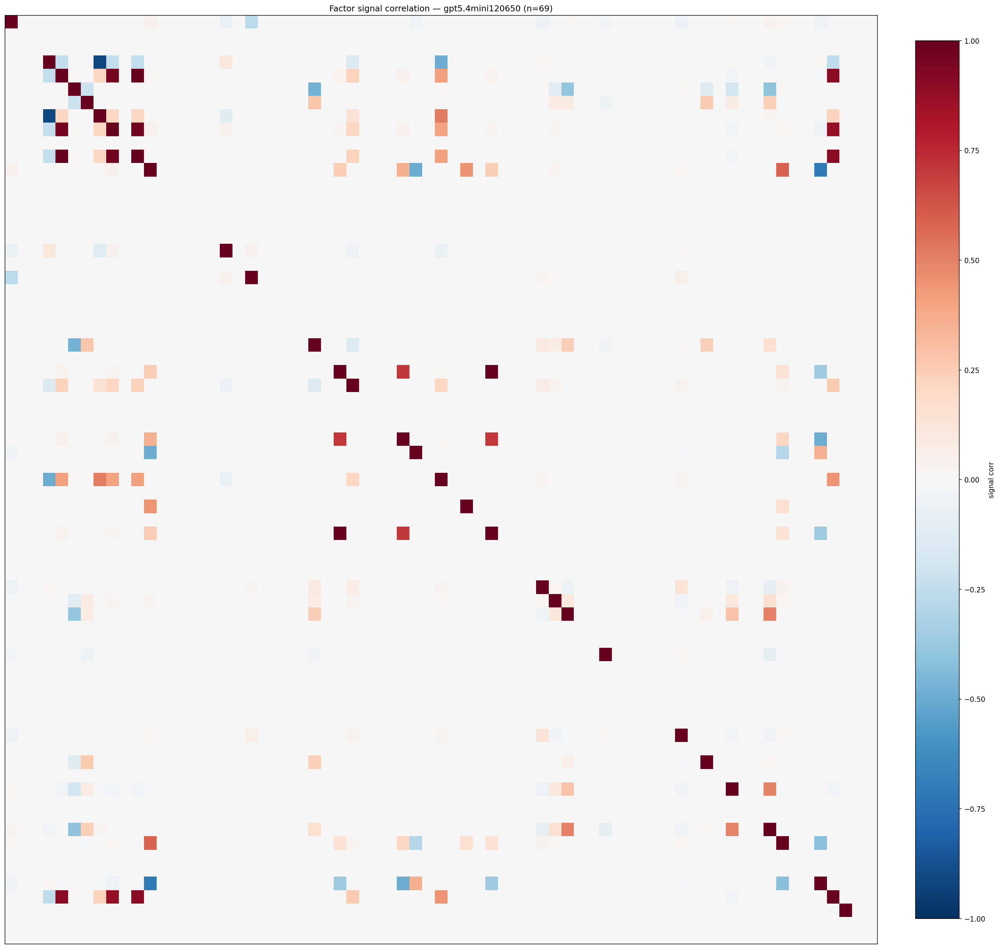

*Signal correlation matrix — gpt5.4mini120650*

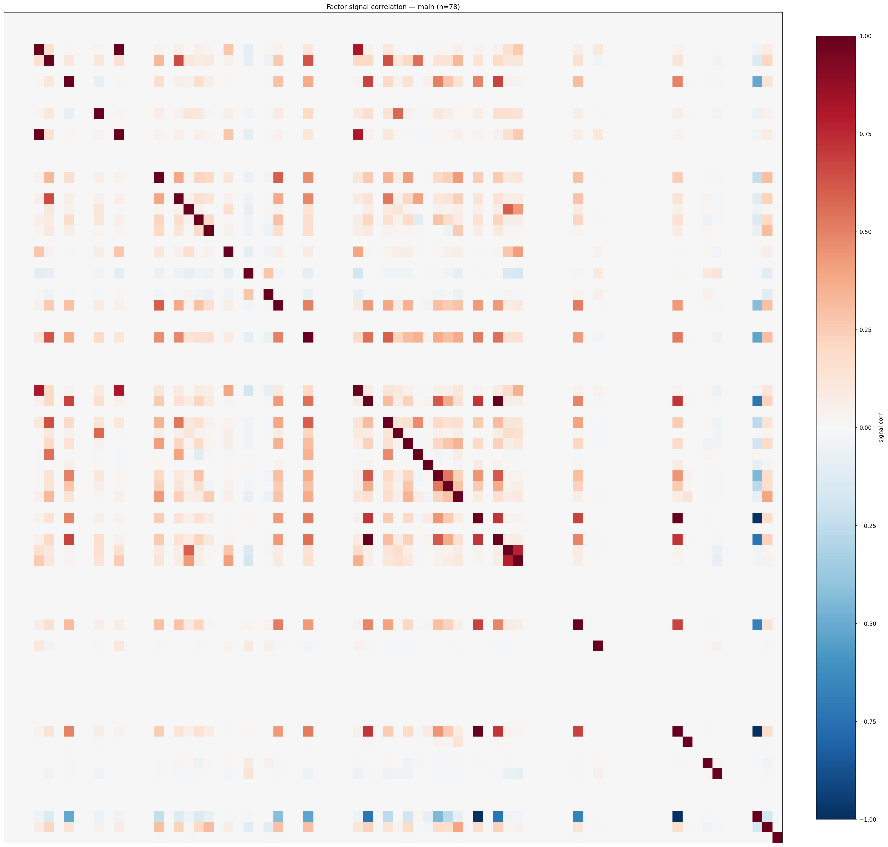

*Signal correlation matrix — main*

## 3. Deflation & model-based importance

`deflated_best_ic` haircuts each zoo's best |IC| for the number of factors tried (`ic_n_tested`) — a bigger zoo's best factor is more likely to be lucky. `lasso_n_nonzero` / `lasso_sparsity` show how many factors a sparse linear model actually keeps (model-view redundancy).

| prerun | best_ic | deflated_best_ic | deflated_best_t | ic_n_tested | ic_n_obs | lasso_n_nonzero | lasso_sparsity |
| --- | --- | --- | --- | --- | --- | --- | --- |
| gpt4omini120650 | 0.0165 | 0.0089 | 3.4348 | 64 | 147419 | 0 | 1.0 |
| gpt5.4mini120650 | 0.018 | 0.0112 | 4.3068 | 31 | 147419 | 0 | 1.0 |
| main | 0.0132 | 0.0062 | 2.3749 | 38 | 147419 | 0 | 1.0 |

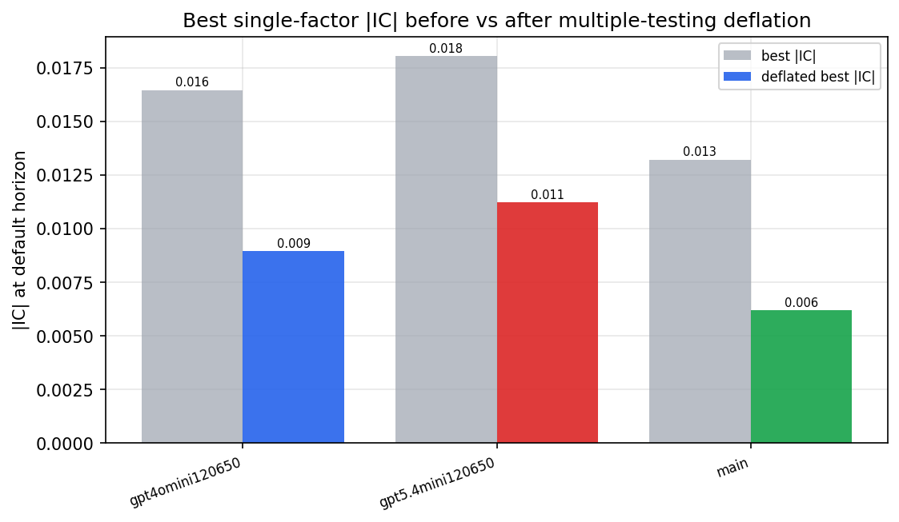

*Best |IC| before vs after multiple-testing deflation*

*Top factors by lasso importance per zoo*

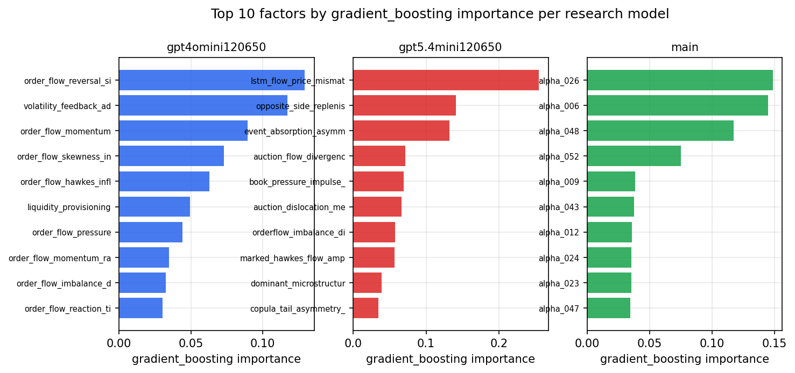

*Top factors by gradient_boosting importance per zoo*

## 4. ML-combined signal — per-underlying vectorised backtest

Each model combines a prerun's factors into ONE signal (fit `factors → forward return` on IS, predict per (bar, underlying)), then that combined signal is run through a simple vectorised backtest — `position(signal) × the underlying's own forward return` — on the held-out OOS tail (+ an equal-weight ensemble). No cross-sectional ranking.

> Config: position=**threshold** (t=1.0, z-score `expanding`), aggregation=**portfolio**, fit-standardise=**per_underlying**, horizon=6.

| prerun | model | n_factors_used | oos_ic | oos_sharpe | is_sharpe | oos_ann_return | oos_max_drawdown |
| --- | --- | --- | --- | --- | --- | --- | --- |
| gpt4omini120650 | linear_regression | 66 | 0.0 | 2.3581 | 6.6777 | 0.0752 | -0.005 |
| gpt4omini120650 | ridge | 66 | -0.0015 | 1.4675 | 5.6937 | 0.0477 | -0.0062 |
| gpt4omini120650 | lasso | 66 | nan | nan | nan | nan | nan |
| gpt4omini120650 | elastic_net | 66 | nan | nan | nan | nan | nan |
| gpt4omini120650 | random_forest | 66 | 0.0 | -0.8094 | 10.0305 | -0.0214 | -0.0087 |
| gpt4omini120650 | gradient_boosting | 66 | -0.0048 | -4.0233 | 9.8193 | -0.0626 | -0.0066 |
| gpt4omini120650 | xgboost | 66 | -0.0005 | 3.3212 | 12.4229 | 0.0703 | -0.0038 |
| gpt4omini120650 | lightgbm | 66 | 0.0021 | 2.1705 | 15.7553 | 0.0655 | -0.005 |
| gpt4omini120650 | ensemble | 66 | 0.0022 | 4.1026 | 11.9012 | 0.1474 | -0.0045 |
| gpt5.4mini120650 | linear_regression | 69 | 0.0125 | 7.0981 | 4.1072 | 0.2956 | -0.0045 |
| gpt5.4mini120650 | ridge | 69 | 0.013 | 6.2717 | 4.6943 | 0.2565 | -0.0061 |
| gpt5.4mini120650 | lasso | 69 | nan | nan | nan | nan | nan |
| gpt5.4mini120650 | elastic_net | 69 | nan | nan | nan | nan | nan |
| gpt5.4mini120650 | random_forest | 69 | -0.011 | 3.3683 | 8.1318 | 0.1127 | -0.0047 |
| gpt5.4mini120650 | gradient_boosting | 69 | 0.0002 | -3.6815 | 7.9648 | -0.0338 | -0.0036 |
| gpt5.4mini120650 | xgboost | 69 | -0.0103 | -0.1897 | 11.4915 | -0.0043 | -0.0056 |
| gpt5.4mini120650 | lightgbm | 69 | -0.0099 | -0.1906 | 15.0064 | -0.0037 | -0.0065 |
| gpt5.4mini120650 | ensemble | 69 | 0.0128 | 0.2671 | 7.144 | 0.0016 | -0.0007 |
| main | linear_regression | 78 | 0.0007 | 7.9288 | 7.3728 | 0.3231 | -0.008 |
| main | ridge | 78 | 0.0013 | 7.498 | 6.9507 | 0.3093 | -0.0063 |
| main | lasso | 78 | -0.0112 | 4.7014 | 3.9475 | 0.1398 | -0.0033 |
| main | elastic_net | 78 | -0.0112 | 4.7014 | 3.9475 | 0.1398 | -0.0033 |
| main | random_forest | 78 | 0.0033 | -2.1114 | 16.0844 | -0.121 | -0.0163 |
| main | gradient_boosting | 78 | 0.003 | -4.9408 | 13.4245 | -0.0914 | -0.0097 |
| main | xgboost | 78 | 0.002 | -6.3511 | 17.4211 | -0.1935 | -0.0182 |
| main | lightgbm | 78 | -0.0004 | -5.5107 | 24.7407 | -0.1501 | -0.0153 |
| main | ensemble | 78 | -0.0021 | 1.4718 | 14.3726 | 0.0589 | -0.0091 |

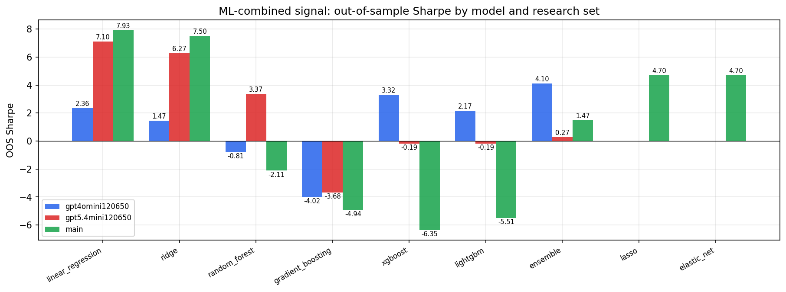

*ML-combined OOS Sharpe by model and research set*

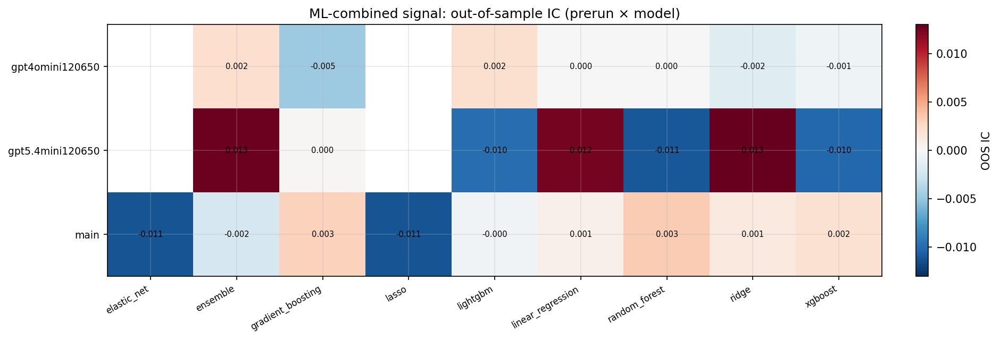

*ML-combined OOS IC (prerun × model)*

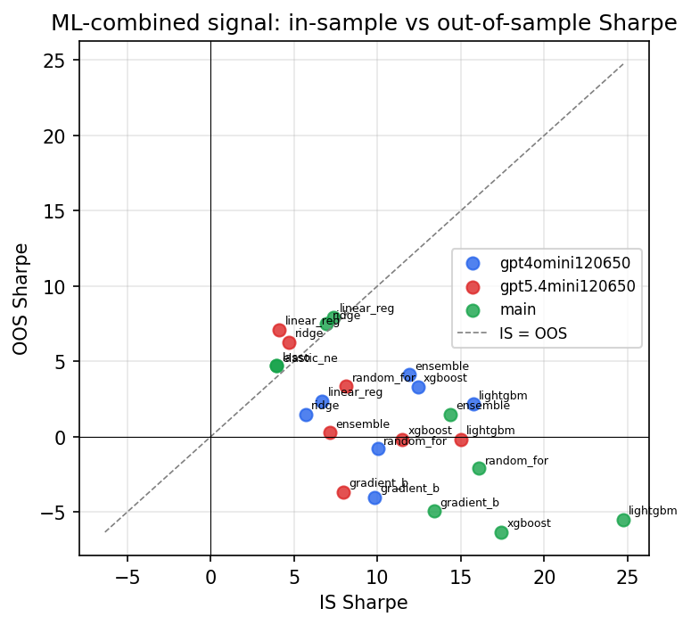

*IS vs OOS Sharpe (overfitting diagnostic)*

---
*Generated by `run_model_comparison.py`. Tables: `*.csv`; interactive: `comparison.ipynb`.*
