# Research-LLM factor comparison — `2024-07`

Comparing the **factor output of different research LLMs** on three axes (raw factor quality → factors as ML features → factors through the full agentic fund). The panel, IS/OOS split, horizon and model hyper-parameters are held identical across preruns — the *only* variable is the factor set.

## Preruns compared

| prerun | research_model | usable_factors | dropped_factors |
| --- | --- | --- | --- |
| gpt4omini120650 | gpt-4o-mini | 66 | 0 |
| gpt5.4mini120650 | gpt-5.4-mini | 69 | 0 |
| main | seed library | 78 | 10 |

> Dropped factors declare fields the current data doesn't have yet (e.g. fundamentals); they light up unchanged once that data is downloaded.

*Usable vs awaiting-data factors per research model*

## Key findings

- **Best ML-combined OOS Sharpe:** `gpt5.4mini120650` with `ensemble` (OOS Sharpe = 4.626).
- **Mean OOS Sharpe across models, by research set:** `gpt5.4mini120650` = 1.748, `gpt4omini120650` = 0.377, `main` = -2.188.
- **Highest mean single-factor |IC| (h=6):** `gpt5.4mini120650` (mean |IC| = 0.0051).
- **Most diverse zoo (highest effective/raw factor ratio):** `gpt5.4mini120650` (eff 47.7 of 69, ratio 0.69).
- **Best selection-deflated single-factor |IC|:** `gpt4omini120650` (deflated |IC| = 0.0088 from 64 factors tried).

## 1. Single-factor IC (raw factor quality)

Per-underlying time-series Spearman rank-IC of every researched factor, recomputed on the shared panel at horizons h=1, h=6, h=60. The per-underlying IC correlates each factor's value vector with the underlying's own forward-return vector (pooled across underlyings); the cross-sectional IC ranks across underlyings per timestamp.

| prerun | n_factors | mean_abs_ic_1 | mean_abs_ic_6 | mean_abs_ic_60 | mean_abs_icir_6 | best_factor_h6 | best_abs_ic_h6 |
| --- | --- | --- | --- | --- | --- | --- | --- |
| gpt4omini120650 | 66 | 0.0041 | 0.0046 | 0.0057 | 0.3295 | order_flow_momentum | 0.0164 |
| gpt5.4mini120650 | 69 | 0.0039 | 0.0051 | 0.005 | 0.3829 | ruin_buffer_liquidity_tilt | 0.0151 |
| main | 78 | 0.0034 | 0.0045 | 0.0038 | 0.3206 | rsi_mean_reversion | 0.0142 |

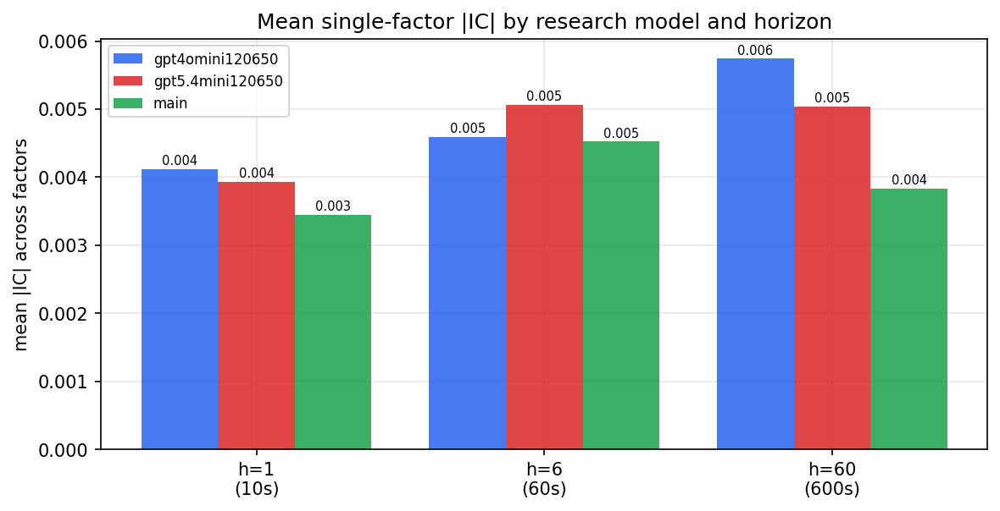

*Mean |IC| by research model and horizon*

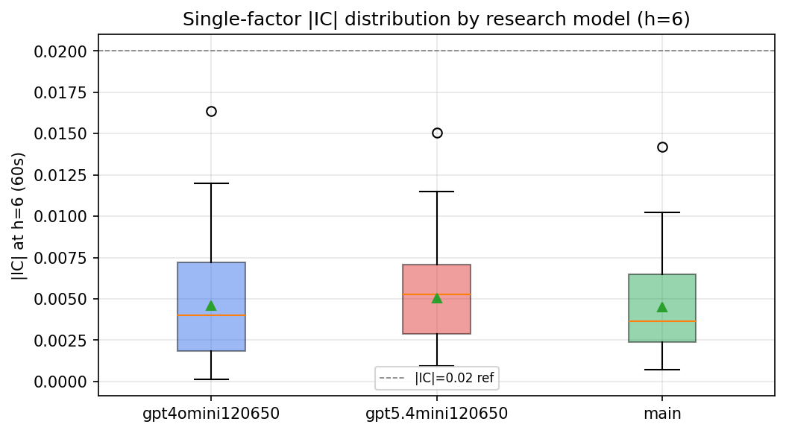

*Per-factor |IC| distribution by research model*

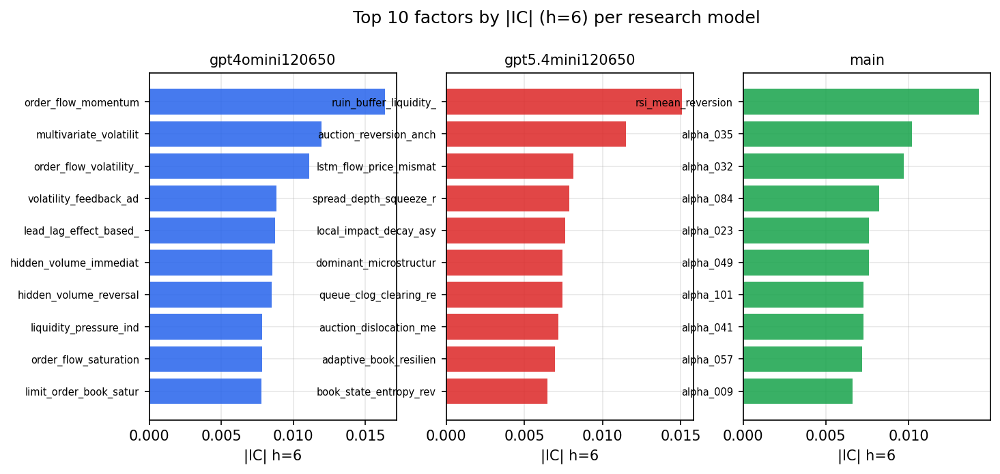

*Top factors by |IC| per research model*

## 2. Factor diversity & redundancy

Pairwise correlation of each zoo's *signals*. `eff_n_factors` is the effective number of independent factors (participation ratio of the correlation eigenvalues); `eff_ratio` and `redundancy` summarise how much unique information the zoo holds vs. how much is duplicated; `n_clusters` groups factors at |corr| ≥ 0.7.

| prerun | n_factors | eff_n_factors | eff_ratio | mean_abs_corr | n_clusters | redundancy |
| --- | --- | --- | --- | --- | --- | --- |
| gpt4omini120650 | 66 | 26.0107 | 0.3941 | 0.0535 | 52 | 0.6059 |
| gpt5.4mini120650 | 69 | 47.7267 | 0.6917 | 0.0138 | 62 | 0.3083 |
| main | 78 | 42.6001 | 0.5462 | 0.0286 | 71 | 0.4538 |

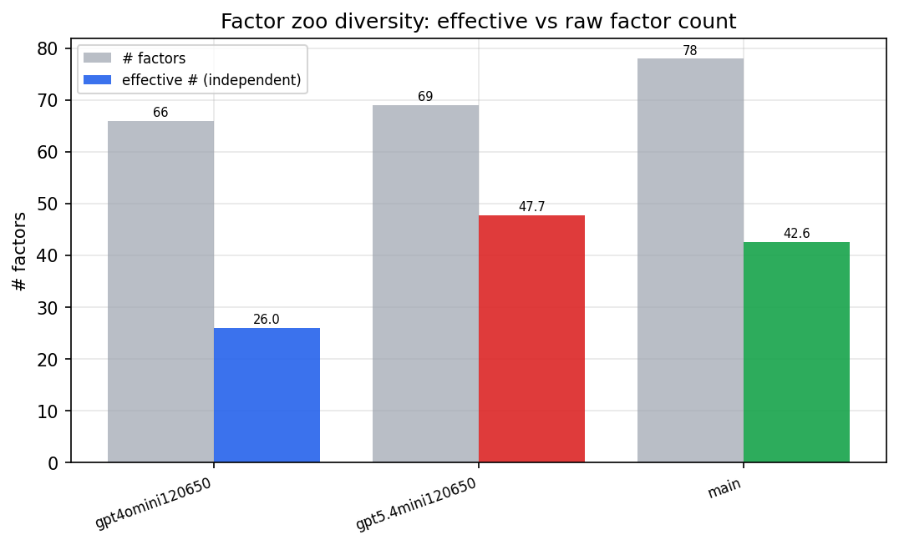

*Effective vs raw factor count per research model*

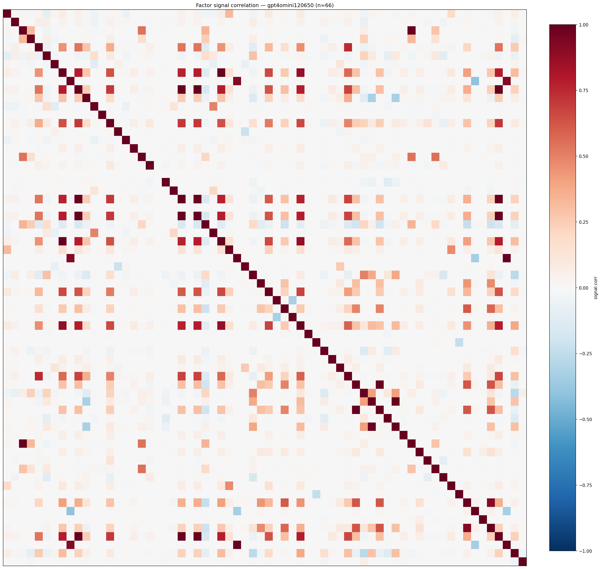

*Signal correlation matrix — gpt4omini120650*

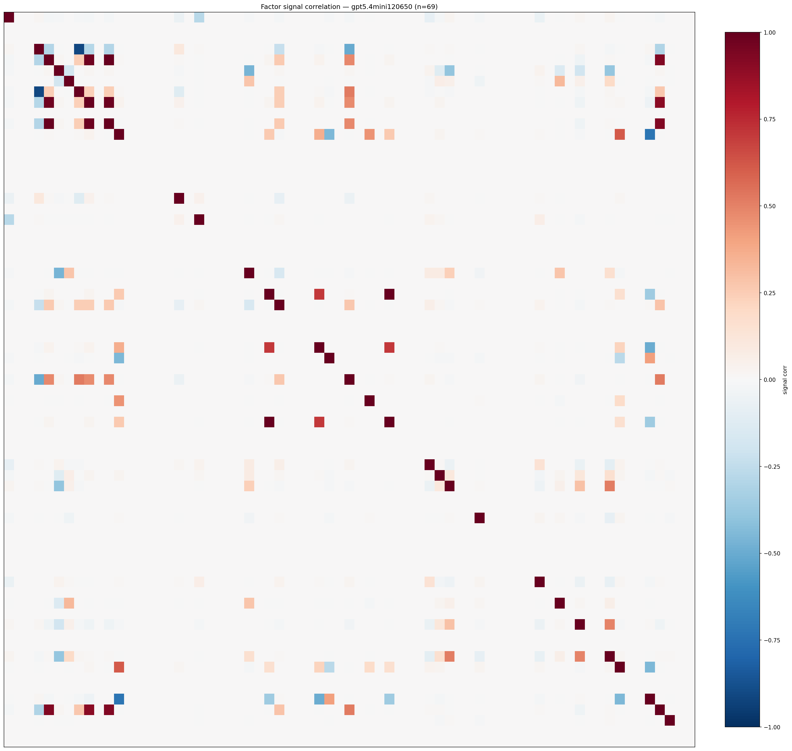

*Signal correlation matrix — gpt5.4mini120650*

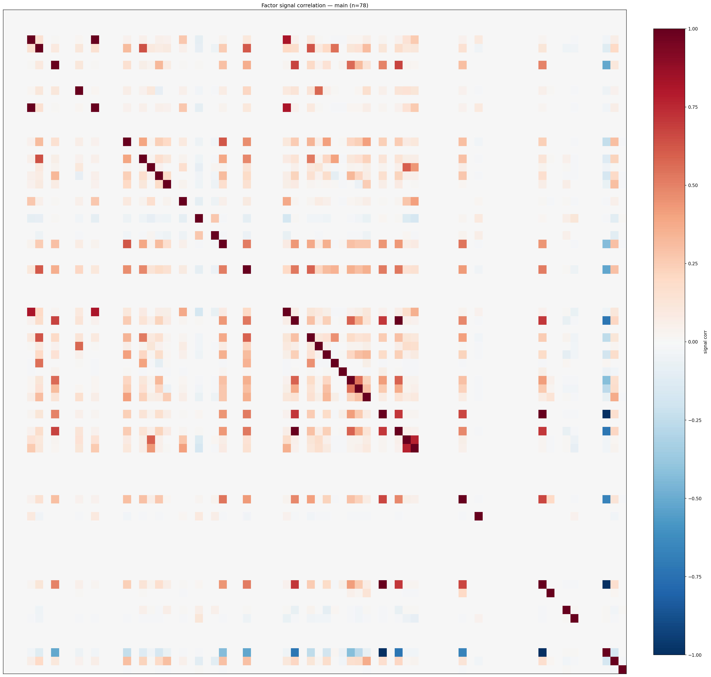

*Signal correlation matrix — main*

## 3. Deflation & model-based importance

`deflated_best_ic` haircuts each zoo's best |IC| for the number of factors tried (`ic_n_tested`) — a bigger zoo's best factor is more likely to be lucky. `lasso_n_nonzero` / `lasso_sparsity` show how many factors a sparse linear model actually keeps (model-view redundancy).

| prerun | best_ic | deflated_best_ic | deflated_best_t | ic_n_tested | ic_n_obs | lasso_n_nonzero | lasso_sparsity |
| --- | --- | --- | --- | --- | --- | --- | --- |
| gpt4omini120650 | 0.0164 | 0.0088 | 3.3737 | 64 | 146339 | 0 | 1.0 |
| gpt5.4mini120650 | 0.0151 | 0.0082 | 3.1396 | 31 | 146339 | 0 | 1.0 |
| main | 0.0142 | 0.0072 | 2.7429 | 38 | 146339 | 0 | 1.0 |

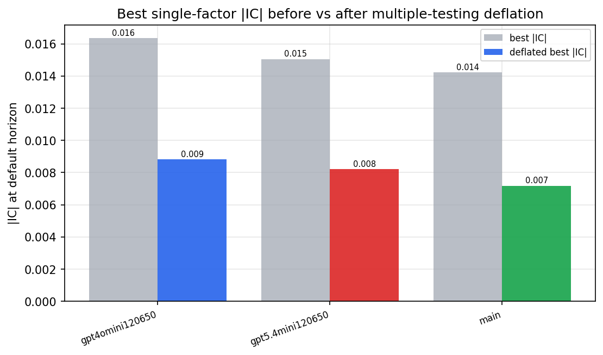

*Best |IC| before vs after multiple-testing deflation*

*Top factors by lasso importance per zoo*

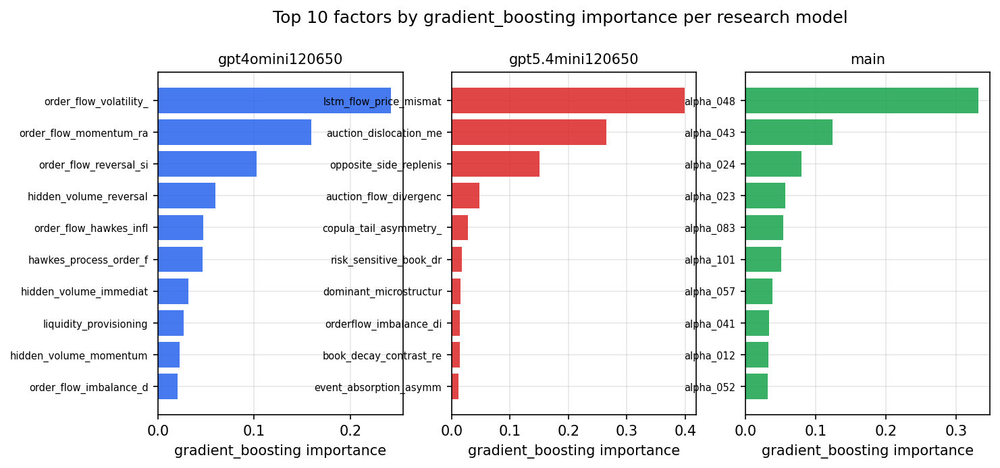

*Top factors by gradient_boosting importance per zoo*

## 4. ML-combined signal — per-underlying vectorised backtest

Each model combines a prerun's factors into ONE signal (fit `factors → forward return` on IS, predict per (bar, underlying)), then that combined signal is run through a simple vectorised backtest — `position(signal) × the underlying's own forward return` — on the held-out OOS tail (+ an equal-weight ensemble). No cross-sectional ranking.

> Config: position=**threshold** (t=1.0, z-score `expanding`), aggregation=**portfolio**, fit-standardise=**per_underlying**, horizon=6.

| prerun | model | n_factors_used | oos_ic | oos_sharpe | is_sharpe | oos_ann_return | oos_max_drawdown |
| --- | --- | --- | --- | --- | --- | --- | --- |
| gpt4omini120650 | linear_regression | 66 | -0.0106 | 0.0444 | 8.2872 | 0.0051 | -0.0379 |
| gpt4omini120650 | ridge | 66 | -0.0107 | 0.0916 | 8.2514 | 0.0105 | -0.0417 |
| gpt4omini120650 | lasso | 66 | -0.0137 | -2.4834 | 6.2799 | -0.2552 | -0.0488 |
| gpt4omini120650 | elastic_net | 66 | -0.0134 | -2.1523 | 6.2639 | -0.2235 | -0.0477 |
| gpt4omini120650 | random_forest | 66 | -0.0176 | -0.0179 | 8.6205 | -0.0021 | -0.0503 |
| gpt4omini120650 | gradient_boosting | 66 | -0.0222 | 3.2779 | 8.4328 | 0.2472 | -0.0156 |
| gpt4omini120650 | xgboost | 66 | -0.0128 | 3.8109 | 10.2978 | 0.3085 | -0.0176 |
| gpt4omini120650 | lightgbm | 66 | -0.0098 | 0.4581 | 17.1202 | 0.0372 | -0.0227 |
| gpt4omini120650 | ensemble | 66 | -0.0131 | 0.366 | 10.3899 | 0.0419 | -0.04 |
| gpt5.4mini120650 | linear_regression | 69 | -0.0172 | 2.2396 | 6.3642 | 0.2218 | -0.0148 |
| gpt5.4mini120650 | ridge | 69 | -0.0171 | 1.7802 | 6.4619 | 0.1754 | -0.0161 |
| gpt5.4mini120650 | lasso | 69 | nan | nan | nan | nan | nan |
| gpt5.4mini120650 | elastic_net | 69 | nan | nan | nan | nan | nan |
| gpt5.4mini120650 | random_forest | 69 | -0.0121 | -0.2562 | 7.8875 | -0.0208 | -0.028 |
| gpt5.4mini120650 | gradient_boosting | 69 | -0.0141 | 1.5616 | 6.886 | 0.0544 | -0.0096 |
| gpt5.4mini120650 | xgboost | 69 | -0.0088 | 1.1964 | 9.5035 | 0.0445 | -0.0102 |
| gpt5.4mini120650 | lightgbm | 69 | -0.0147 | 1.0923 | 12.8508 | 0.0326 | -0.005 |
| gpt5.4mini120650 | ensemble | 69 | -0.0169 | 4.6256 | 10.7281 | 0.3409 | -0.0135 |
| main | linear_regression | 78 | -0.0138 | -1.8793 | 12.218 | -0.0611 | -0.0092 |
| main | ridge | 78 | -0.0142 | -3.1415 | 11.329 | -0.0957 | -0.0106 |
| main | lasso | 78 | -0.0233 | -5.6804 | 9.6134 | -0.1864 | -0.0174 |
| main | elastic_net | 78 | -0.0234 | -5.2653 | 9.9662 | -0.1724 | -0.0161 |
| main | random_forest | 78 | -0.0218 | -2.1919 | 11.459 | -0.1354 | -0.0252 |
| main | gradient_boosting | 78 | -0.0205 | -0.0474 | 15.391 | -0.0024 | -0.0107 |
| main | xgboost | 78 | -0.021 | -0.5878 | 16.868 | -0.0371 | -0.014 |
| main | lightgbm | 78 | -0.0181 | -0.3627 | 19.2662 | -0.0212 | -0.019 |
| main | ensemble | 78 | -0.0217 | -0.5336 | 16.6468 | -0.0289 | -0.0119 |

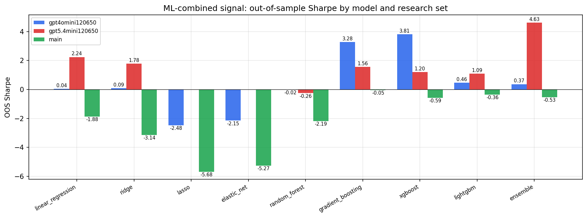

*ML-combined OOS Sharpe by model and research set*

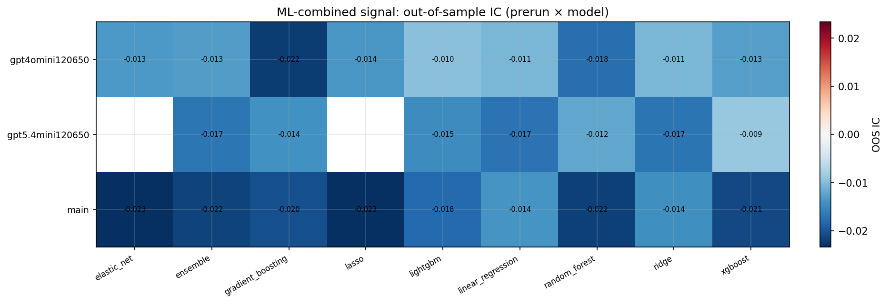

*ML-combined OOS IC (prerun × model)*

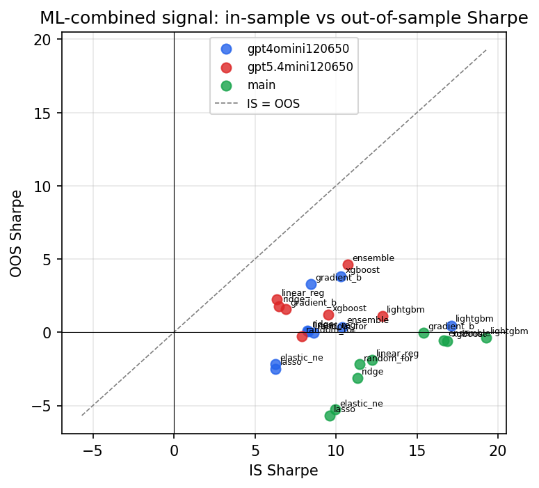

*IS vs OOS Sharpe (overfitting diagnostic)*

---
*Generated by `run_model_comparison.py`. Tables: `*.csv`; interactive: `comparison.ipynb`.*
