# Research-LLM factor comparison — `2024-08`

Comparing the **factor output of different research LLMs** on three axes (raw factor quality → factors as ML features → factors through the full agentic fund). The panel, IS/OOS split, horizon and model hyper-parameters are held identical across preruns — the *only* variable is the factor set.

## Preruns compared

| prerun | research_model | usable_factors | dropped_factors |
| --- | --- | --- | --- |
| gpt4omini120650 | gpt-4o-mini | 66 | 0 |
| gpt5.4mini120650 | gpt-5.4-mini | 69 | 0 |
| main | seed library | 78 | 10 |

> Dropped factors declare fields the current data doesn't have yet (e.g. fundamentals); they light up unchanged once that data is downloaded.

*Usable vs awaiting-data factors per research model*

## Key findings

- **Best ML-combined OOS Sharpe:** `main` with `ridge` (OOS Sharpe = 7.151).
- **Mean OOS Sharpe across models, by research set:** `main` = 2.546, `gpt4omini120650` = 0.882, `gpt5.4mini120650` = -3.489.
- **Highest mean single-factor |IC| (h=6):** `main` (mean |IC| = 0.0060).
- **Most diverse zoo (highest effective/raw factor ratio):** `gpt5.4mini120650` (eff 44.3 of 69, ratio 0.64).
- **Best selection-deflated single-factor |IC|:** `gpt4omini120650` (deflated |IC| = 0.0098 from 64 factors tried).

## 1. Single-factor IC (raw factor quality)

Per-underlying time-series Spearman rank-IC of every researched factor, recomputed on the shared panel at horizons h=1, h=6, h=60. The per-underlying IC correlates each factor's value vector with the underlying's own forward-return vector (pooled across underlyings); the cross-sectional IC ranks across underlyings per timestamp.

| prerun | n_factors | mean_abs_ic_1 | mean_abs_ic_6 | mean_abs_ic_60 | mean_abs_icir_6 | best_factor_h6 | best_abs_ic_h6 |
| --- | --- | --- | --- | --- | --- | --- | --- |
| gpt4omini120650 | 66 | 0.0057 | 0.0056 | 0.0043 | 0.3204 | order_flow_momentum | 0.0174 |
| gpt5.4mini120650 | 69 | 0.0049 | 0.0046 | 0.005 | 0.2548 | lstm_flow_price_mismatch | 0.0152 |
| main | 78 | 0.0055 | 0.006 | 0.0034 | 0.3302 | alpha_035 | 0.0146 |

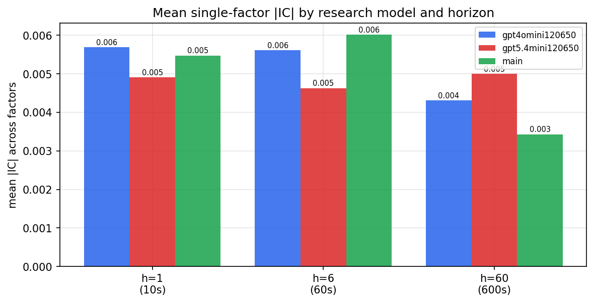

*Mean |IC| by research model and horizon*

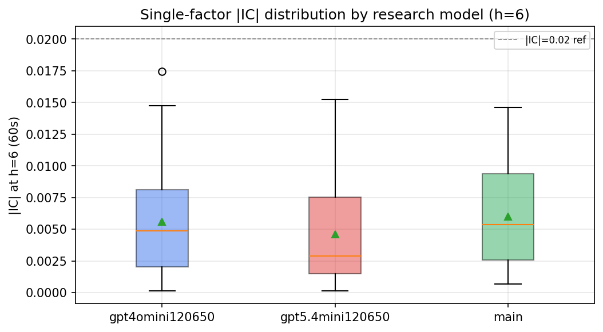

*Per-factor |IC| distribution by research model*

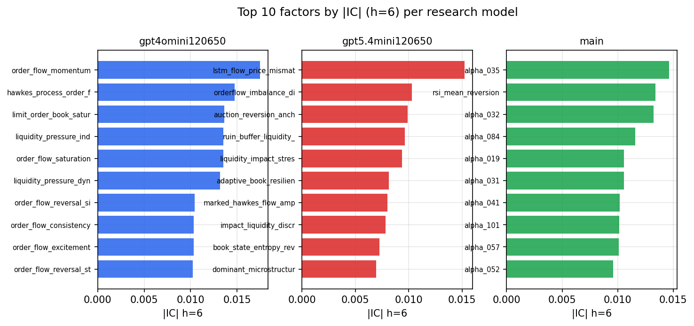

*Top factors by |IC| per research model*

## 2. Factor diversity & redundancy

Pairwise correlation of each zoo's *signals*. `eff_n_factors` is the effective number of independent factors (participation ratio of the correlation eigenvalues); `eff_ratio` and `redundancy` summarise how much unique information the zoo holds vs. how much is duplicated; `n_clusters` groups factors at |corr| ≥ 0.7.

| prerun | n_factors | eff_n_factors | eff_ratio | mean_abs_corr | n_clusters | redundancy |
| --- | --- | --- | --- | --- | --- | --- |
| gpt4omini120650 | 66 | 25.1353 | 0.3808 | 0.0564 | 52 | 0.6192 |
| gpt5.4mini120650 | 69 | 44.3475 | 0.6427 | 0.0163 | 62 | 0.3573 |
| main | 78 | 42.1276 | 0.5401 | 0.0293 | 70 | 0.4599 |

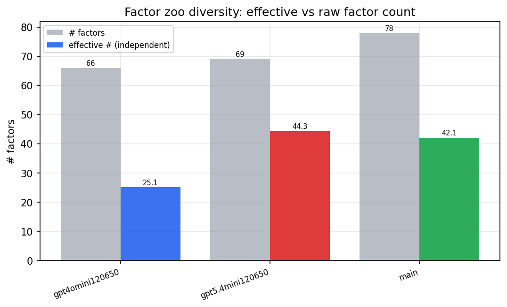

*Effective vs raw factor count per research model*

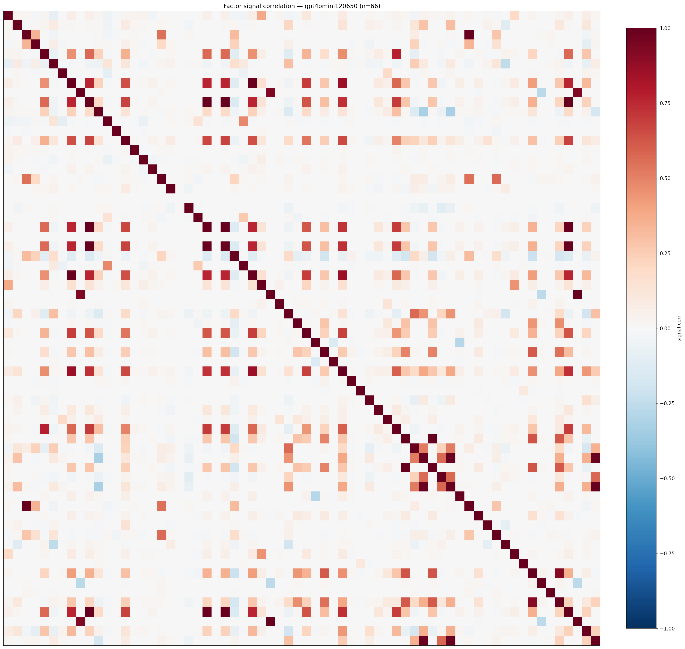

*Signal correlation matrix — gpt4omini120650*

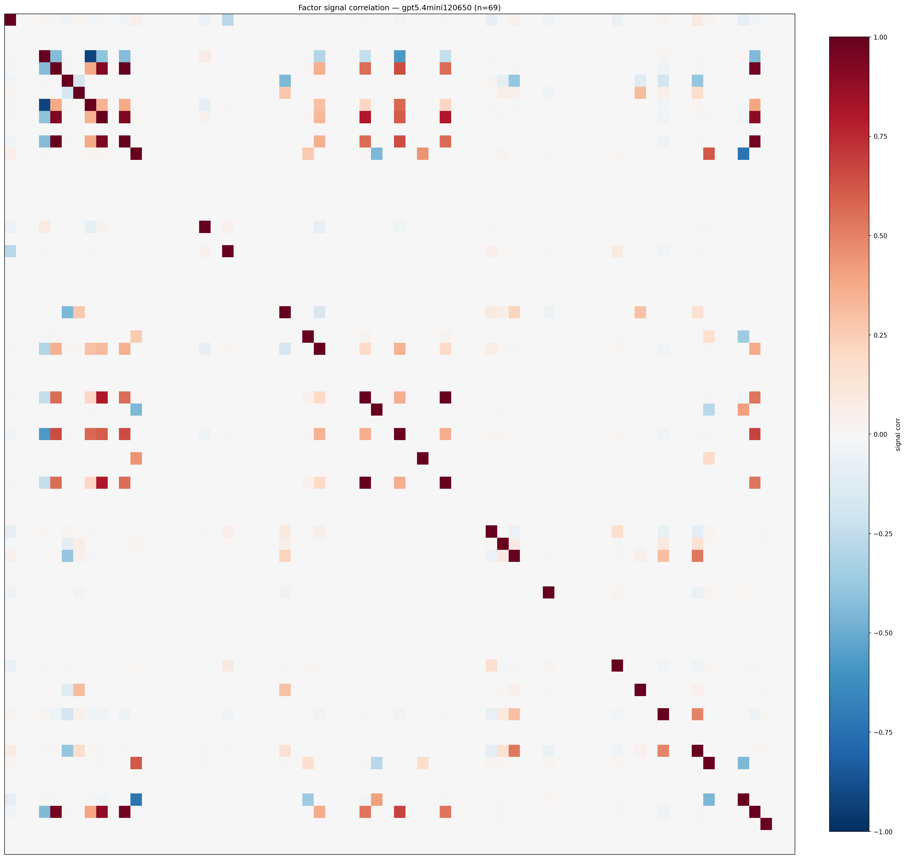

*Signal correlation matrix — gpt5.4mini120650*

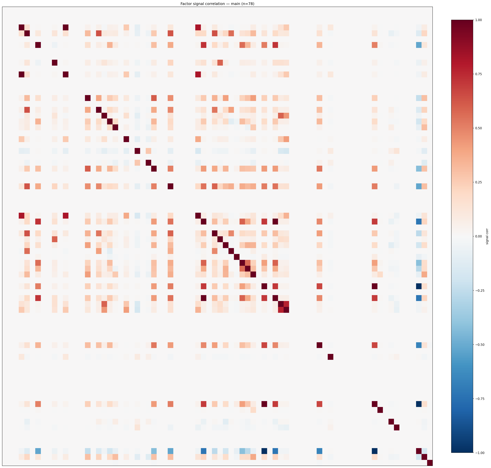

*Signal correlation matrix — main*

## 3. Deflation & model-based importance

`deflated_best_ic` haircuts each zoo's best |IC| for the number of factors tried (`ic_n_tested`) — a bigger zoo's best factor is more likely to be lucky. `lasso_n_nonzero` / `lasso_sparsity` show how many factors a sparse linear model actually keeps (model-view redundancy).

| prerun | best_ic | deflated_best_ic | deflated_best_t | ic_n_tested | ic_n_obs | lasso_n_nonzero | lasso_sparsity |
| --- | --- | --- | --- | --- | --- | --- | --- |
| gpt4omini120650 | 0.0174 | 0.0098 | 3.734 | 64 | 143998 | 11 | 0.8333 |
| gpt5.4mini120650 | 0.0152 | 0.0083 | 3.1571 | 31 | 143998 | 0 | 1.0 |
| main | 0.0146 | 0.0075 | 2.8462 | 38 | 143998 | 4 | 0.9487 |

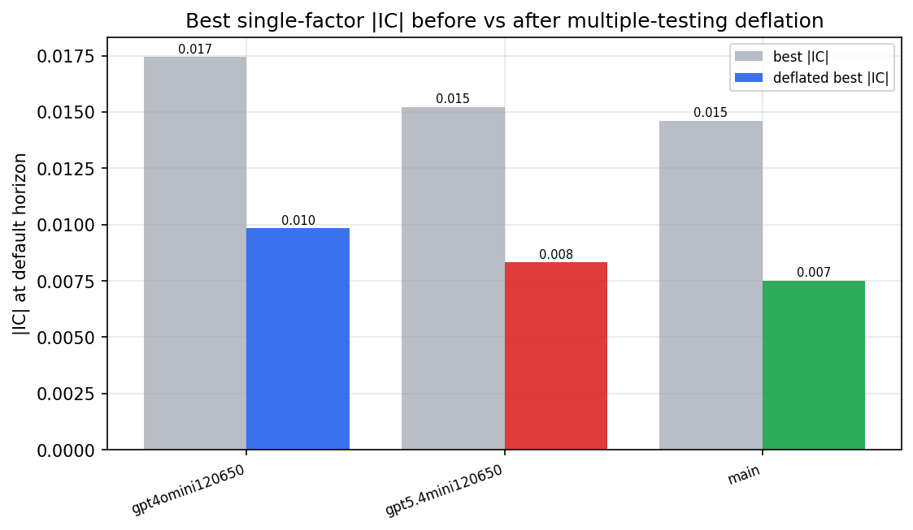

*Best |IC| before vs after multiple-testing deflation*

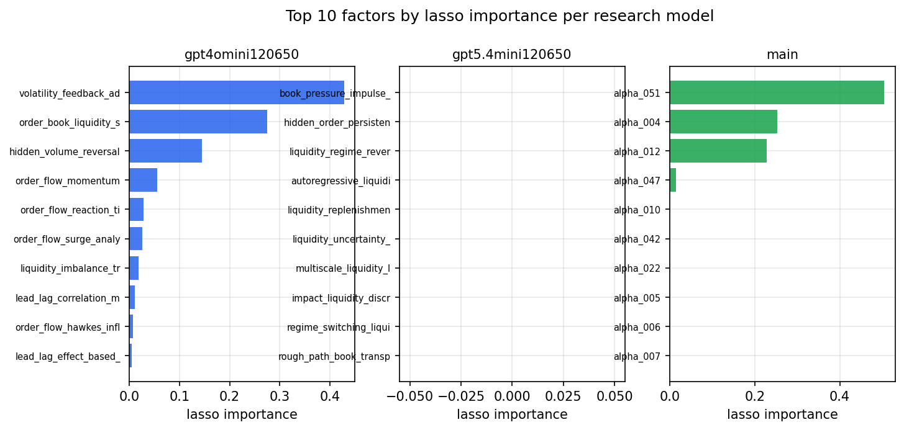

*Top factors by lasso importance per zoo*

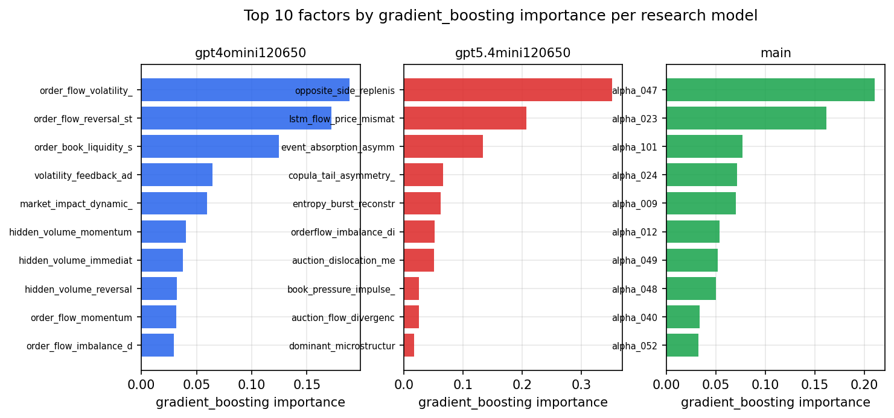

*Top factors by gradient_boosting importance per zoo*

## 4. ML-combined signal — per-underlying vectorised backtest

Each model combines a prerun's factors into ONE signal (fit `factors → forward return` on IS, predict per (bar, underlying)), then that combined signal is run through a simple vectorised backtest — `position(signal) × the underlying's own forward return` — on the held-out OOS tail (+ an equal-weight ensemble). No cross-sectional ranking.

> Config: position=**threshold** (t=1.0, z-score `expanding`), aggregation=**portfolio**, fit-standardise=**per_underlying**, horizon=6.

| prerun | model | n_factors_used | oos_ic | oos_sharpe | is_sharpe | oos_ann_return | oos_max_drawdown |
| --- | --- | --- | --- | --- | --- | --- | --- |
| gpt4omini120650 | linear_regression | 66 | -0.0187 | 1.38 | 11.444 | 0.147 | -0.0172 |
| gpt4omini120650 | ridge | 66 | -0.0169 | 1.5906 | 11.1217 | 0.1691 | -0.0168 |
| gpt4omini120650 | lasso | 66 | -0.0155 | 0.7669 | 9.2066 | 0.0783 | -0.0184 |
| gpt4omini120650 | elastic_net | 66 | -0.0151 | 1.5362 | 8.6357 | 0.1559 | -0.0186 |
| gpt4omini120650 | random_forest | 66 | -0.0099 | 3.4652 | 15.3915 | 0.4844 | -0.0253 |
| gpt4omini120650 | gradient_boosting | 66 | -0.0099 | -0.3818 | 9.6091 | -0.0223 | -0.0176 |
| gpt4omini120650 | xgboost | 66 | -0.0101 | 0.5267 | 16.0747 | 0.0482 | -0.0268 |
| gpt4omini120650 | lightgbm | 66 | -0.0023 | -0.6757 | 24.8024 | -0.0709 | -0.0302 |
| gpt4omini120650 | ensemble | 66 | -0.0204 | -0.2682 | 17.7463 | -0.0325 | -0.0277 |
| gpt5.4mini120650 | linear_regression | 69 | -0.0226 | -8.4875 | 5.8161 | -0.4559 | -0.0402 |
| gpt5.4mini120650 | ridge | 69 | -0.0248 | -7.0036 | 6.2256 | -0.2449 | -0.0212 |
| gpt5.4mini120650 | lasso | 69 | -0.0208 | -2.2096 | 6.252 | -0.1123 | -0.0199 |
| gpt5.4mini120650 | elastic_net | 69 | -0.0213 | -2.2414 | 6.3105 | -0.1205 | -0.0201 |
| gpt5.4mini120650 | random_forest | 69 | -0.0133 | -2.4096 | 13.1187 | -0.1704 | -0.0331 |
| gpt5.4mini120650 | gradient_boosting | 69 | -0.0149 | -4.2625 | 8.8099 | -0.189 | -0.0207 |
| gpt5.4mini120650 | xgboost | 69 | -0.0108 | 0.9405 | 13.7161 | 0.0502 | -0.0108 |
| gpt5.4mini120650 | lightgbm | 69 | -0.01 | -0.4056 | 19.7514 | -0.0164 | -0.0132 |
| gpt5.4mini120650 | ensemble | 69 | -0.0223 | -5.3198 | 15.0554 | -0.2788 | -0.034 |
| main | linear_regression | 78 | -0.0076 | 6.4795 | 12.9678 | 0.207 | -0.0036 |
| main | ridge | 78 | -0.0096 | 7.1506 | 13.522 | 0.2272 | -0.0032 |
| main | lasso | 78 | nan | nan | nan | nan | nan |
| main | elastic_net | 78 | -0.0256 | -0.8976 | 8.4515 | -0.0821 | -0.0307 |
| main | random_forest | 78 | -0.0116 | -0.6138 | 18.0106 | -0.0393 | -0.0136 |
| main | gradient_boosting | 78 | -0.0131 | 2.5754 | 17.5935 | 0.1179 | -0.0093 |
| main | xgboost | 78 | -0.0053 | -0.6889 | 26.0786 | -0.0437 | -0.0139 |
| main | lightgbm | 78 | -0.0001 | 5.3435 | 35.5631 | 0.317 | -0.0126 |
| main | ensemble | 78 | -0.014 | 1.023 | 26.5544 | 0.0564 | -0.0134 |

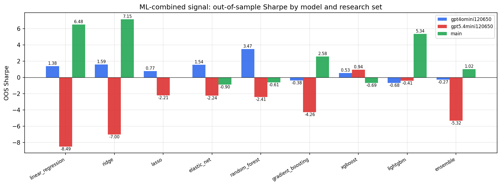

*ML-combined OOS Sharpe by model and research set*

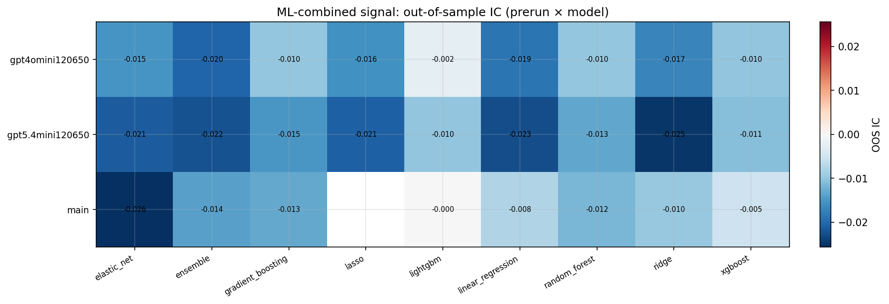

*ML-combined OOS IC (prerun × model)*

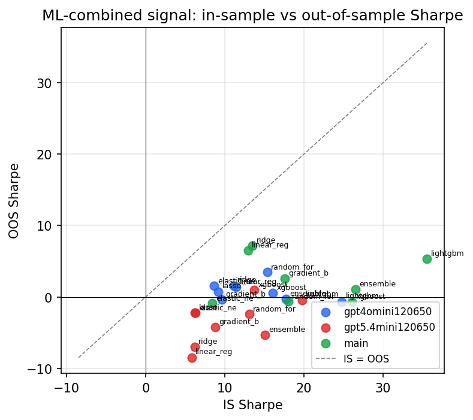

*IS vs OOS Sharpe (overfitting diagnostic)*

---
*Generated by `run_model_comparison.py`. Tables: `*.csv`; interactive: `comparison.ipynb`.*
