# Research-LLM factor comparison — `2024-09`

Comparing the **factor output of different research LLMs** on three axes (raw factor quality → factors as ML features → factors through the full agentic fund). The panel, IS/OOS split, horizon and model hyper-parameters are held identical across preruns — the *only* variable is the factor set.

## Preruns compared

| prerun | research_model | usable_factors | dropped_factors |
| --- | --- | --- | --- |
| gpt4omini120650 | gpt-4o-mini | 66 | 0 |
| gpt5.4mini120650 | gpt-5.4-mini | 69 | 0 |
| main | seed library | 78 | 10 |

> Dropped factors declare fields the current data doesn't have yet (e.g. fundamentals); they light up unchanged once that data is downloaded.

*Usable vs awaiting-data factors per research model*

## Key findings

- **Best ML-combined OOS Sharpe:** `gpt4omini120650` with `gradient_boosting` (OOS Sharpe = 4.416).
- **Mean OOS Sharpe across models, by research set:** `gpt4omini120650` = 3.221, `main` = 1.691, `gpt5.4mini120650` = -1.642.
- **Highest mean single-factor |IC| (h=6):** `main` (mean |IC| = 0.0094).
- **Most diverse zoo (highest effective/raw factor ratio):** `gpt5.4mini120650` (eff 41.1 of 69, ratio 0.60).
- **Best selection-deflated single-factor |IC|:** `gpt4omini120650` (deflated |IC| = 0.0170 from 64 factors tried).

## 1. Single-factor IC (raw factor quality)

Per-underlying time-series Spearman rank-IC of every researched factor, recomputed on the shared panel at horizons h=1, h=6, h=60. The per-underlying IC correlates each factor's value vector with the underlying's own forward-return vector (pooled across underlyings); the cross-sectional IC ranks across underlyings per timestamp.

| prerun | n_factors | mean_abs_ic_1 | mean_abs_ic_6 | mean_abs_ic_60 | mean_abs_icir_6 | best_factor_h6 | best_abs_ic_h6 |
| --- | --- | --- | --- | --- | --- | --- | --- |
| gpt4omini120650 | 66 | 0.0077 | 0.008 | 0.0051 | 0.4436 | hawkes_process_order_flow_indicator | 0.0246 |
| gpt5.4mini120650 | 69 | 0.0053 | 0.0058 | 0.0059 | 0.4208 | lstm_flow_price_mismatch | 0.0206 |
| main | 78 | 0.0101 | 0.0094 | 0.0054 | 0.556 | alpha_052 | 0.0222 |

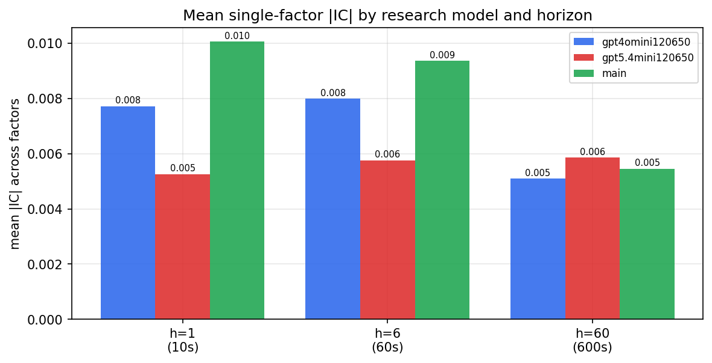

*Mean |IC| by research model and horizon*

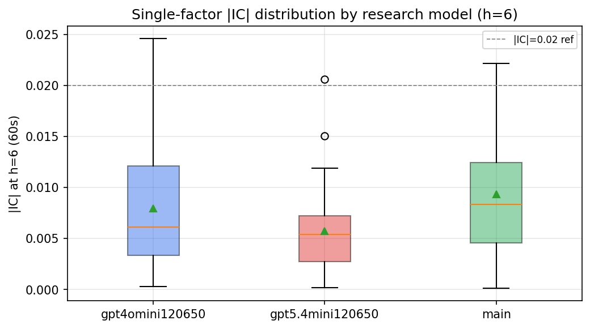

*Per-factor |IC| distribution by research model*

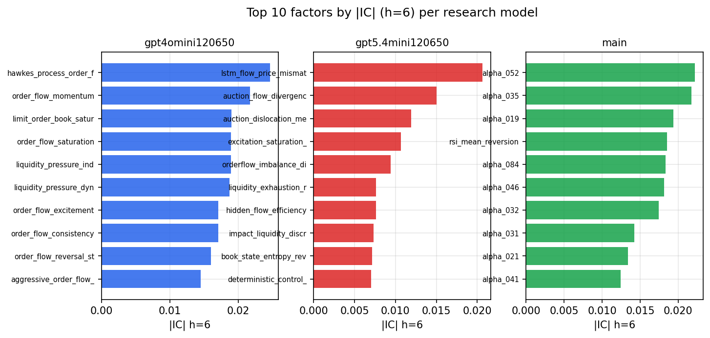

*Top factors by |IC| per research model*

## 2. Factor diversity & redundancy

Pairwise correlation of each zoo's *signals*. `eff_n_factors` is the effective number of independent factors (participation ratio of the correlation eigenvalues); `eff_ratio` and `redundancy` summarise how much unique information the zoo holds vs. how much is duplicated; `n_clusters` groups factors at |corr| ≥ 0.7.

| prerun | n_factors | eff_n_factors | eff_ratio | mean_abs_corr | n_clusters | redundancy |
| --- | --- | --- | --- | --- | --- | --- |
| gpt4omini120650 | 66 | 25.6836 | 0.3891 | 0.0549 | 52 | 0.6109 |
| gpt5.4mini120650 | 69 | 41.0832 | 0.5954 | 0.0176 | 61 | 0.4046 |
| main | 78 | 42.2454 | 0.5416 | 0.0291 | 70 | 0.4584 |

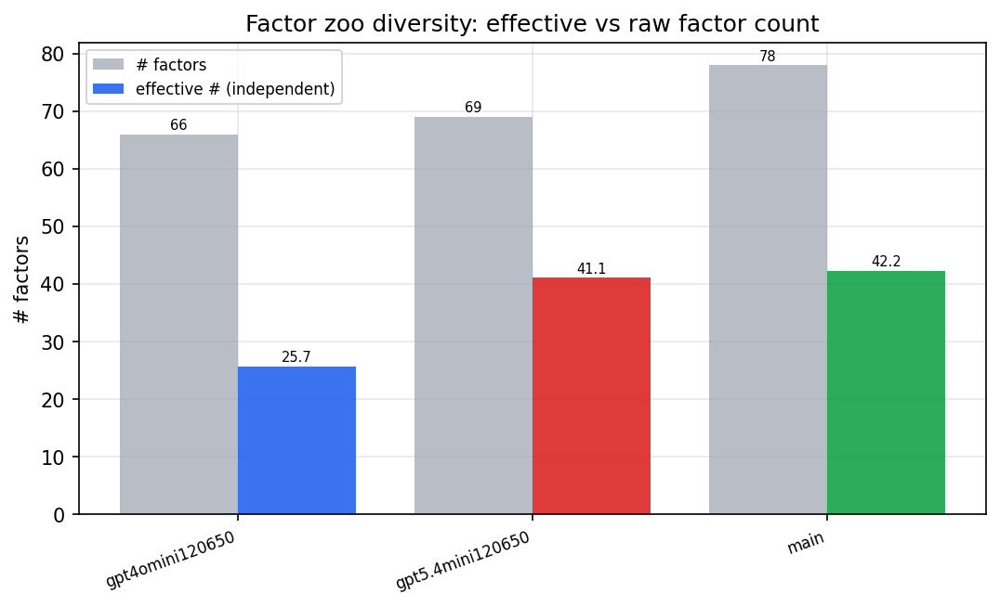

*Effective vs raw factor count per research model*

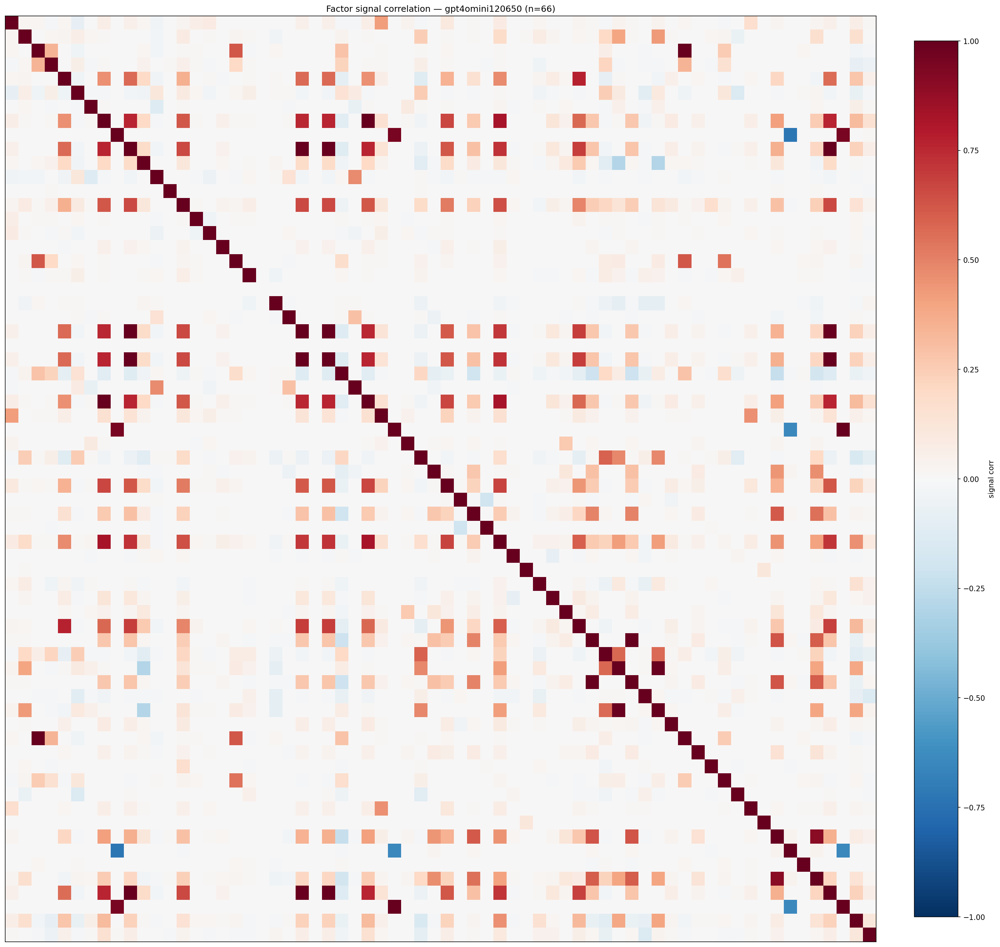

*Signal correlation matrix — gpt4omini120650*

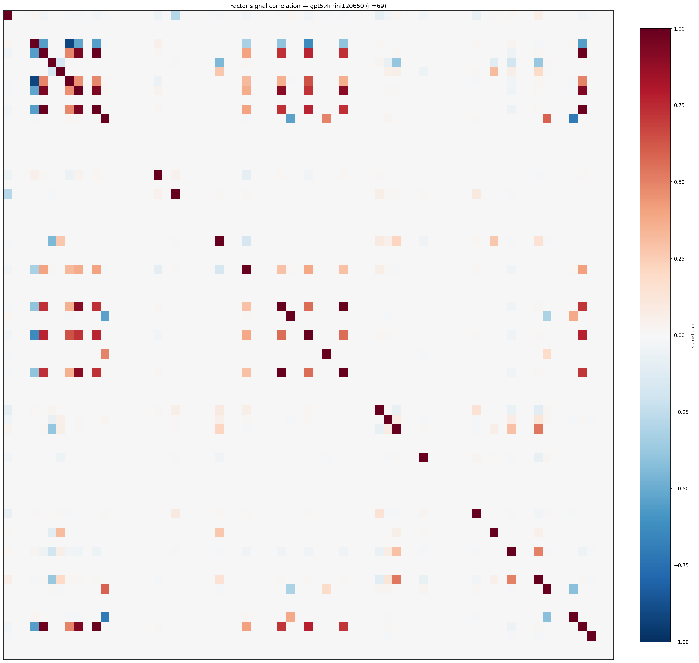

*Signal correlation matrix — gpt5.4mini120650*

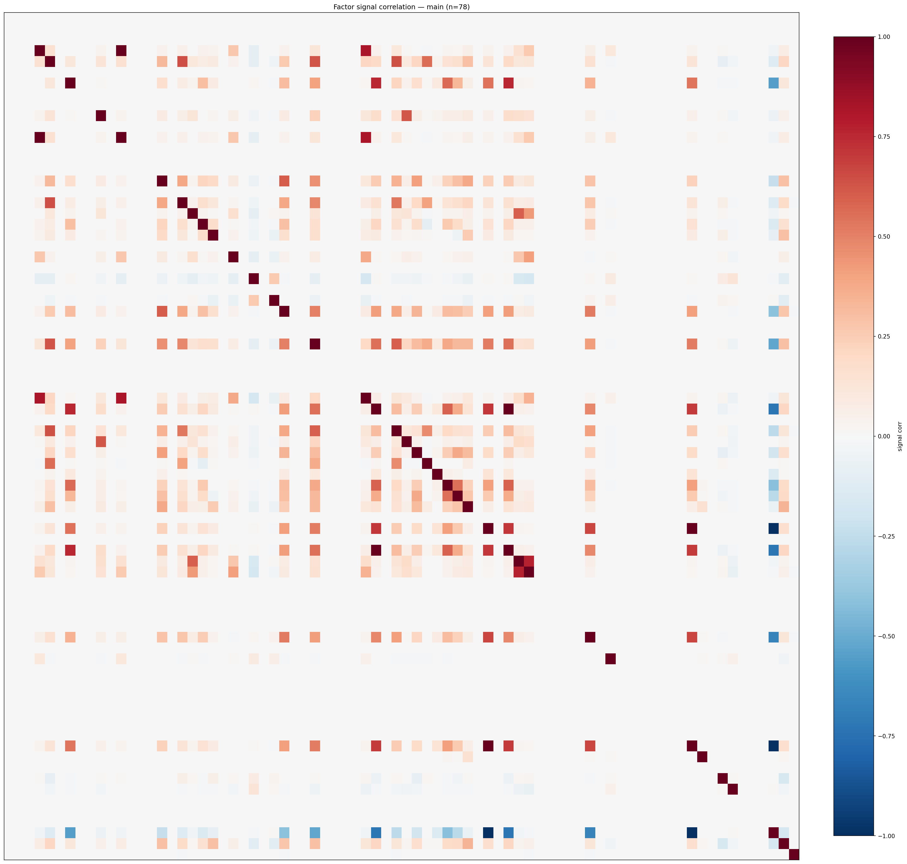

*Signal correlation matrix — main*

## 3. Deflation & model-based importance

`deflated_best_ic` haircuts each zoo's best |IC| for the number of factors tried (`ic_n_tested`) — a bigger zoo's best factor is more likely to be lucky. `lasso_n_nonzero` / `lasso_sparsity` show how many factors a sparse linear model actually keeps (model-view redundancy).

| prerun | best_ic | deflated_best_ic | deflated_best_t | ic_n_tested | ic_n_obs | lasso_n_nonzero | lasso_sparsity |
| --- | --- | --- | --- | --- | --- | --- | --- |
| gpt4omini120650 | 0.0246 | 0.017 | 6.4533 | 64 | 143997 | 4 | 0.9394 |
| gpt5.4mini120650 | 0.0206 | 0.0137 | 5.2051 | 31 | 143997 | 0 | 1.0 |
| main | 0.0222 | 0.0151 | 5.7131 | 38 | 143997 | 0 | 1.0 |

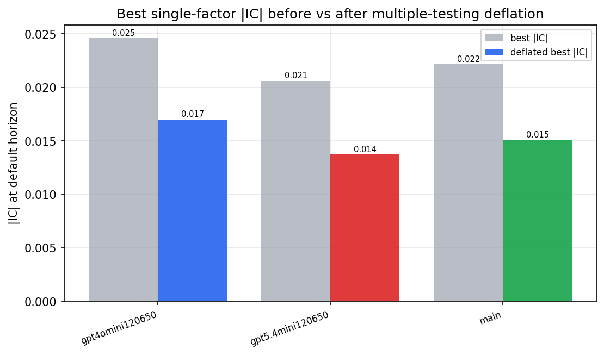

*Best |IC| before vs after multiple-testing deflation*

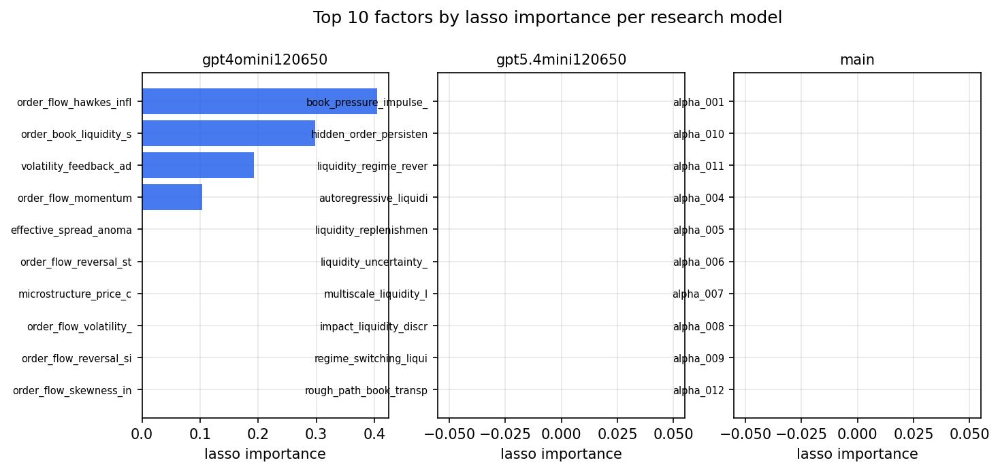

*Top factors by lasso importance per zoo*

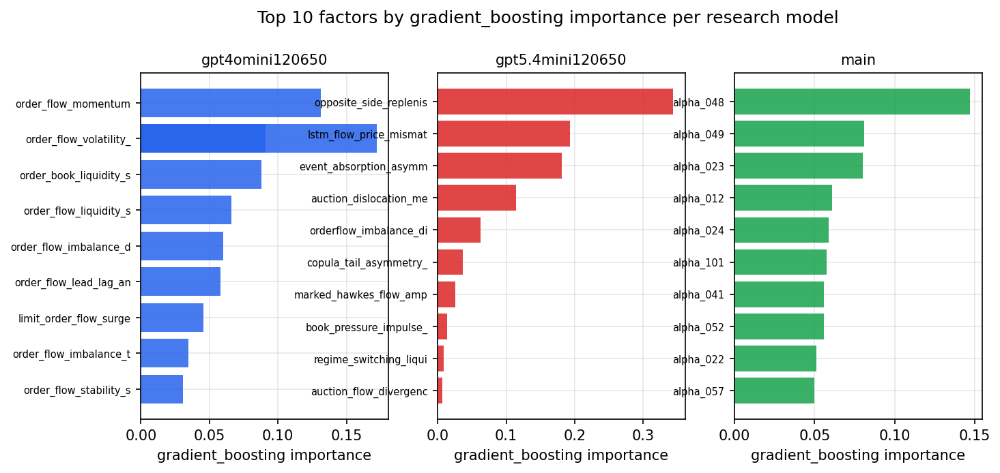

*Top factors by gradient_boosting importance per zoo*

## 4. ML-combined signal — per-underlying vectorised backtest

Each model combines a prerun's factors into ONE signal (fit `factors → forward return` on IS, predict per (bar, underlying)), then that combined signal is run through a simple vectorised backtest — `position(signal) × the underlying's own forward return` — on the held-out OOS tail (+ an equal-weight ensemble). No cross-sectional ranking.

> Config: position=**threshold** (t=1.0, z-score `expanding`), aggregation=**portfolio**, fit-standardise=**per_underlying**, horizon=6.

| prerun | model | n_factors_used | oos_ic | oos_sharpe | is_sharpe | oos_ann_return | oos_max_drawdown |
| --- | --- | --- | --- | --- | --- | --- | --- |
| gpt4omini120650 | linear_regression | 66 | 0.0087 | 2.8038 | 4.8513 | 0.3016 | -0.0127 |
| gpt4omini120650 | ridge | 66 | 0.0119 | 2.7761 | 4.4522 | 0.2969 | -0.0119 |
| gpt4omini120650 | lasso | 66 | 0.0215 | 3.9649 | 2.7263 | 0.3906 | -0.0121 |
| gpt4omini120650 | elastic_net | 66 | 0.0202 | 3.4007 | 2.5778 | 0.3353 | -0.0133 |
| gpt4omini120650 | random_forest | 66 | -0.0175 | 3.2701 | 11.1055 | 0.3138 | -0.0113 |
| gpt4omini120650 | gradient_boosting | 66 | 0.0036 | 4.4156 | 9.8424 | 0.4237 | -0.0067 |
| gpt4omini120650 | xgboost | 66 | -0.0066 | 1.7852 | 12.1824 | 0.1692 | -0.0113 |
| gpt4omini120650 | lightgbm | 66 | -0.0074 | 2.7232 | 17.9961 | 0.2658 | -0.0112 |
| gpt4omini120650 | ensemble | 66 | 0.0115 | 3.8458 | 11.8339 | 0.4015 | -0.011 |
| gpt5.4mini120650 | linear_regression | 69 | 0.0018 | -0.8258 | 1.8408 | -0.0013 | -0.0003 |
| gpt5.4mini120650 | ridge | 69 | -0.0005 | -0.8258 | 1.6158 | -0.0013 | -0.0003 |
| gpt5.4mini120650 | lasso | 69 | nan | nan | nan | nan | nan |
| gpt5.4mini120650 | elastic_net | 69 | nan | nan | nan | nan | nan |
| gpt5.4mini120650 | random_forest | 69 | -0.0044 | 4.2583 | 8.7984 | 0.4742 | -0.0137 |
| gpt5.4mini120650 | gradient_boosting | 69 | -0.0196 | -1.6087 | 8.8307 | -0.0374 | -0.0075 |
| gpt5.4mini120650 | xgboost | 69 | -0.0134 | -4.2769 | 12.76 | -0.144 | -0.0172 |
| gpt5.4mini120650 | lightgbm | 69 | -0.0163 | -6.0504 | 18.5058 | -0.2944 | -0.0343 |
| gpt5.4mini120650 | ensemble | 69 | -0.0114 | -2.1633 | 14.2904 | -0.0835 | -0.0174 |
| main | linear_regression | 78 | -0.0 | 1.0779 | 10.5876 | 0.0059 | -0.0006 |
| main | ridge | 78 | -0.0006 | 2.6417 | 10.2751 | 0.0147 | -0.0006 |
| main | lasso | 78 | -0.0061 | 1.4261 | 8.0617 | 0.0077 | -0.0006 |
| main | elastic_net | 78 | -0.0061 | 1.4261 | 8.0617 | 0.0077 | -0.0006 |
| main | random_forest | 78 | 0.002 | 4.104 | 20.1593 | 0.2265 | -0.0127 |
| main | gradient_boosting | 78 | 0.0068 | 1.3991 | 19.2592 | 0.0254 | -0.0039 |
| main | xgboost | 78 | 0.0051 | 1.0611 | 20.5125 | 0.0209 | -0.0041 |
| main | lightgbm | 78 | 0.0054 | 0.0916 | 31.0263 | 0.003 | -0.0071 |
| main | ensemble | 78 | 0.0014 | 1.9891 | 21.9607 | 0.0558 | -0.0055 |

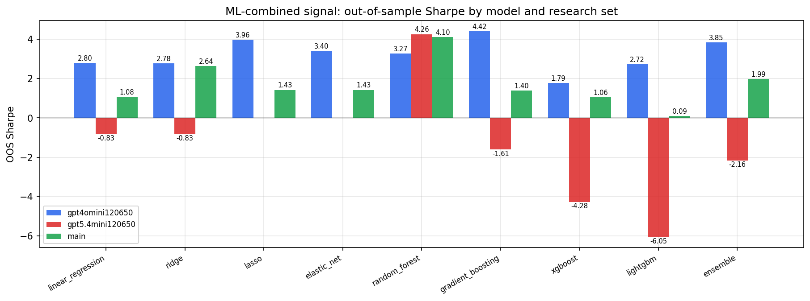

*ML-combined OOS Sharpe by model and research set*

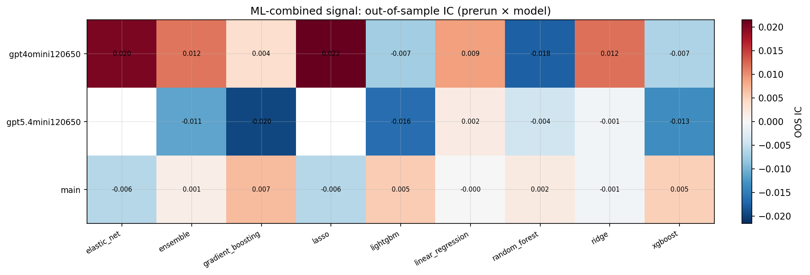

*ML-combined OOS IC (prerun × model)*

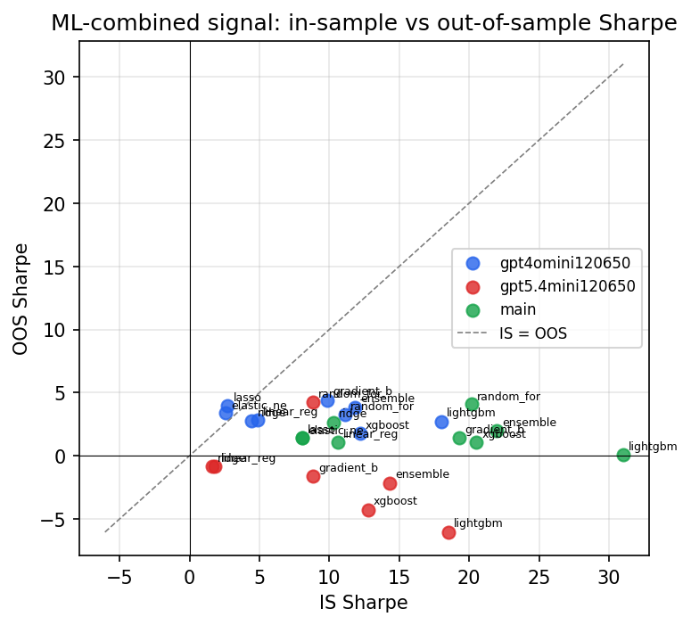

*IS vs OOS Sharpe (overfitting diagnostic)*

---
*Generated by `run_model_comparison.py`. Tables: `*.csv`; interactive: `comparison.ipynb`.*
