# Research-LLM factor comparison — `2024-10`

Comparing the **factor output of different research LLMs** on three axes (raw factor quality → factors as ML features → factors through the full agentic fund). The panel, IS/OOS split, horizon and model hyper-parameters are held identical across preruns — the *only* variable is the factor set.

## Preruns compared

| prerun | research_model | usable_factors | dropped_factors |
| --- | --- | --- | --- |
| gpt4omini120650 | gpt-4o-mini | 66 | 0 |
| gpt5.4mini120650 | gpt-5.4-mini | 69 | 0 |
| main | seed library | 78 | 10 |

> Dropped factors declare fields the current data doesn't have yet (e.g. fundamentals); they light up unchanged once that data is downloaded.

*Usable vs awaiting-data factors per research model*

## Key findings

- **Best ML-combined OOS Sharpe:** `main` with `gradient_boosting` (OOS Sharpe = 3.088).
- **Mean OOS Sharpe across models, by research set:** `main` = 1.000, `gpt4omini120650` = -1.653, `gpt5.4mini120650` = -2.081.
- **Highest mean single-factor |IC| (h=6):** `main` (mean |IC| = 0.0092).
- **Most diverse zoo (highest effective/raw factor ratio):** `gpt5.4mini120650` (eff 41.6 of 69, ratio 0.60).
- **Best selection-deflated single-factor |IC|:** `main` (deflated |IC| = 0.0122 from 38 factors tried).

## 1. Single-factor IC (raw factor quality)

Per-underlying time-series Spearman rank-IC of every researched factor, recomputed on the shared panel at horizons h=1, h=6, h=60. The per-underlying IC correlates each factor's value vector with the underlying's own forward-return vector (pooled across underlyings); the cross-sectional IC ranks across underlyings per timestamp.

| prerun | n_factors | mean_abs_ic_1 | mean_abs_ic_6 | mean_abs_ic_60 | mean_abs_icir_6 | best_factor_h6 | best_abs_ic_h6 |
| --- | --- | --- | --- | --- | --- | --- | --- |
| gpt4omini120650 | 66 | 0.0099 | 0.0074 | 0.0054 | 0.3853 | hidden_order_entropy_magnitude_signal | 0.0168 |
| gpt5.4mini120650 | 69 | 0.006 | 0.006 | 0.0089 | 0.3653 | liquidity_impact_stress_ratio | 0.016 |
| main | 78 | 0.0135 | 0.0092 | 0.0051 | 0.546 | alpha_046 | 0.0192 |

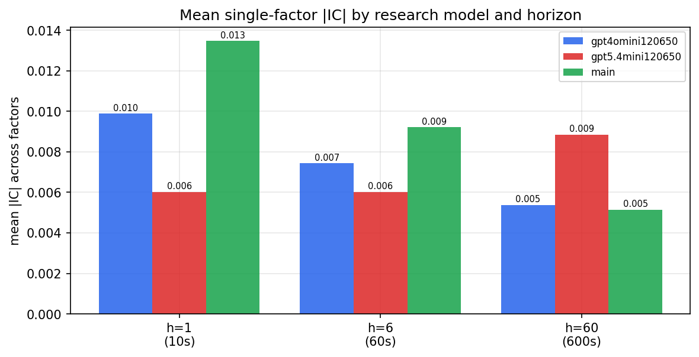

*Mean |IC| by research model and horizon*

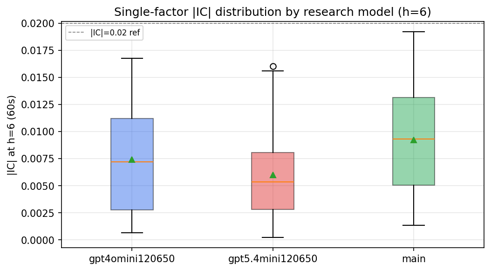

*Per-factor |IC| distribution by research model*

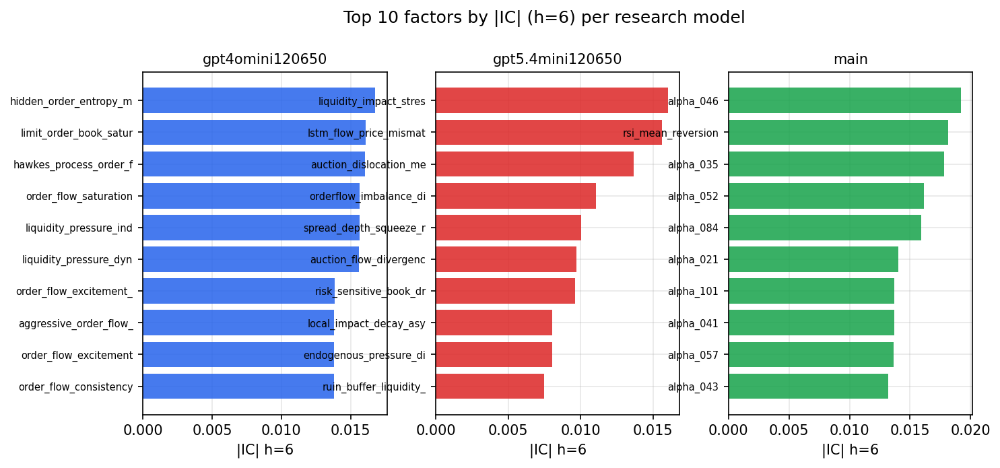

*Top factors by |IC| per research model*

## 2. Factor diversity & redundancy

Pairwise correlation of each zoo's *signals*. `eff_n_factors` is the effective number of independent factors (participation ratio of the correlation eigenvalues); `eff_ratio` and `redundancy` summarise how much unique information the zoo holds vs. how much is duplicated; `n_clusters` groups factors at |corr| ≥ 0.7.

| prerun | n_factors | eff_n_factors | eff_ratio | mean_abs_corr | n_clusters | redundancy |
| --- | --- | --- | --- | --- | --- | --- |
| gpt4omini120650 | 66 | 26.1653 | 0.3964 | 0.0533 | 51 | 0.6036 |
| gpt5.4mini120650 | 69 | 41.6492 | 0.6036 | 0.0165 | 63 | 0.3964 |
| main | 78 | 42.2234 | 0.5413 | 0.0295 | 70 | 0.4587 |

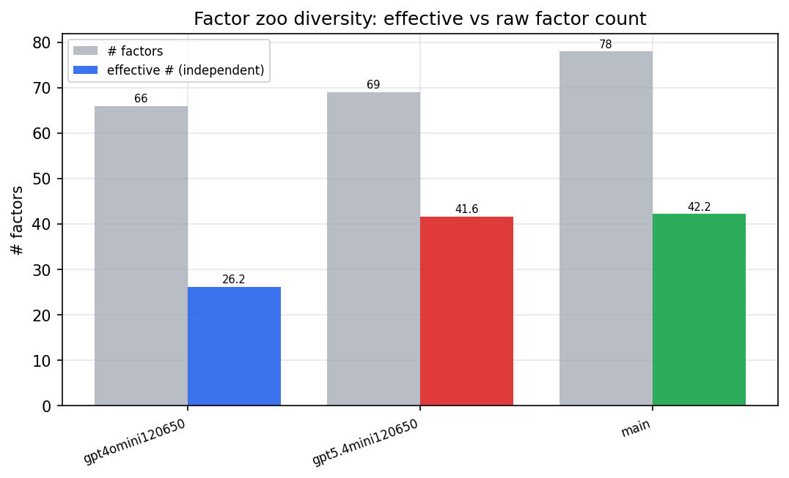

*Effective vs raw factor count per research model*

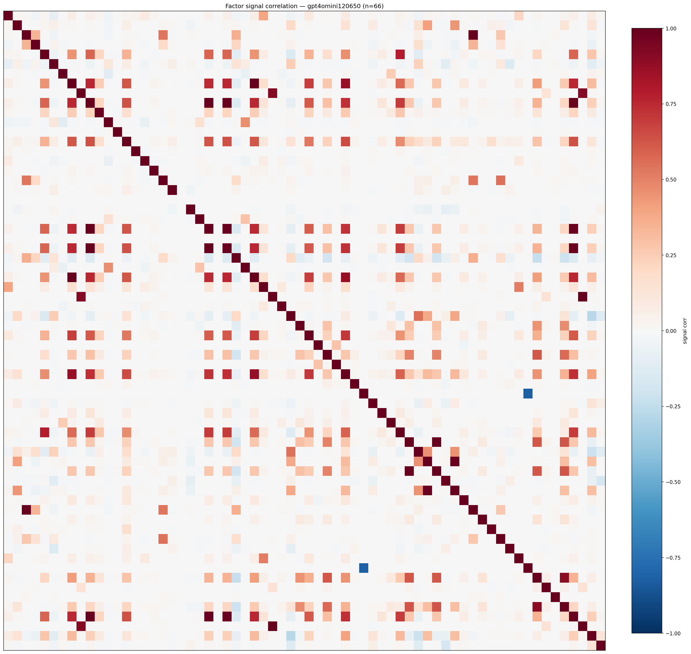

*Signal correlation matrix — gpt4omini120650*

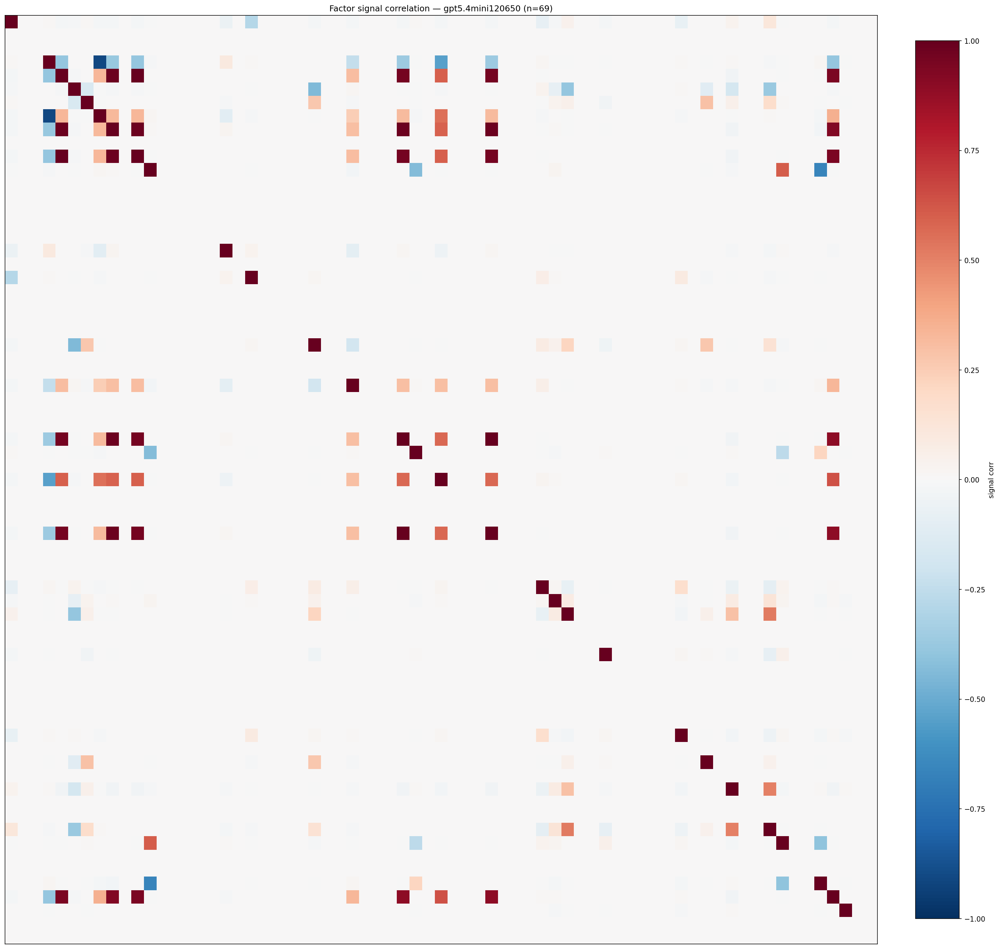

*Signal correlation matrix — gpt5.4mini120650*

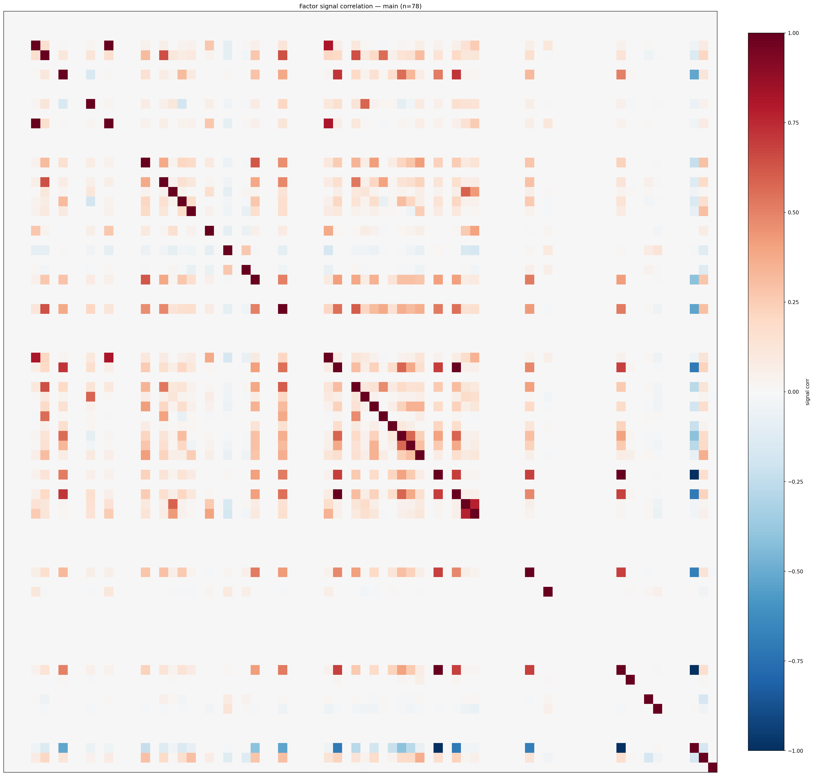

*Signal correlation matrix — main*

## 3. Deflation & model-based importance

`deflated_best_ic` haircuts each zoo's best |IC| for the number of factors tried (`ic_n_tested`) — a bigger zoo's best factor is more likely to be lucky. `lasso_n_nonzero` / `lasso_sparsity` show how many factors a sparse linear model actually keeps (model-view redundancy).

| prerun | best_ic | deflated_best_ic | deflated_best_t | ic_n_tested | ic_n_obs | lasso_n_nonzero | lasso_sparsity |
| --- | --- | --- | --- | --- | --- | --- | --- |
| gpt4omini120650 | 0.0168 | 0.0093 | 3.5561 | 64 | 147417 | 0 | 1.0 |
| gpt5.4mini120650 | 0.016 | 0.0092 | 3.5404 | 31 | 147417 | 0 | 1.0 |
| main | 0.0192 | 0.0122 | 4.6804 | 38 | 147417 | 0 | 1.0 |

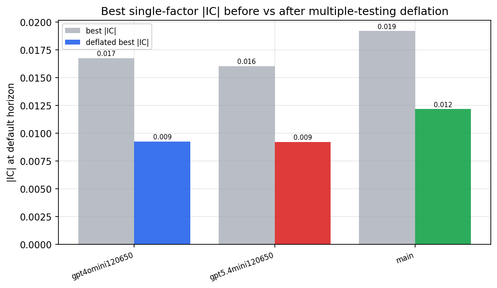

*Best |IC| before vs after multiple-testing deflation*

*Top factors by lasso importance per zoo*

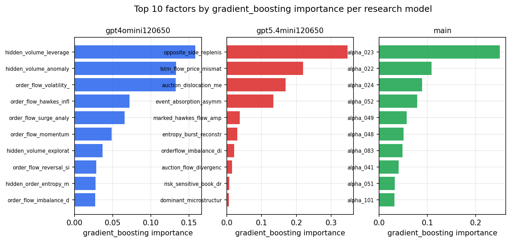

*Top factors by gradient_boosting importance per zoo*

## 4. ML-combined signal — per-underlying vectorised backtest

Each model combines a prerun's factors into ONE signal (fit `factors → forward return` on IS, predict per (bar, underlying)), then that combined signal is run through a simple vectorised backtest — `position(signal) × the underlying's own forward return` — on the held-out OOS tail (+ an equal-weight ensemble). No cross-sectional ranking.

> Config: position=**threshold** (t=1.0, z-score `expanding`), aggregation=**portfolio**, fit-standardise=**per_underlying**, horizon=6.

| prerun | model | n_factors_used | oos_ic | oos_sharpe | is_sharpe | oos_ann_return | oos_max_drawdown |
| --- | --- | --- | --- | --- | --- | --- | --- |
| gpt4omini120650 | linear_regression | 66 | -0.0052 | -2.1136 | 6.1571 | -0.188 | -0.0245 |
| gpt4omini120650 | ridge | 66 | -0.005 | -1.6 | 5.7803 | -0.1446 | -0.0213 |
| gpt4omini120650 | lasso | 66 | nan | nan | nan | nan | nan |
| gpt4omini120650 | elastic_net | 66 | nan | nan | nan | nan | nan |
| gpt4omini120650 | random_forest | 66 | -0.0036 | 0.5996 | 7.3629 | 0.048 | -0.017 |
| gpt4omini120650 | gradient_boosting | 66 | -0.0064 | -2.298 | 9.0176 | -0.1153 | -0.0162 |
| gpt4omini120650 | xgboost | 66 | -0.0036 | -3.256 | 10.5785 | -0.1793 | -0.0201 |
| gpt4omini120650 | lightgbm | 66 | -0.0092 | -2.6745 | 15.4023 | -0.1446 | -0.0158 |
| gpt4omini120650 | ensemble | 66 | -0.0023 | -0.2299 | 10.2876 | -0.0156 | -0.0168 |
| gpt5.4mini120650 | linear_regression | 69 | 0.0084 | -4.664 | 4.0772 | -0.1262 | -0.0126 |
| gpt5.4mini120650 | ridge | 69 | 0.0092 | 0.5557 | 6.4588 | 0.0032 | -0.0014 |
| gpt5.4mini120650 | lasso | 69 | 0.0016 | -5.0836 | 2.9243 | -0.2521 | -0.0234 |
| gpt5.4mini120650 | elastic_net | 69 | 0.0016 | -5.0943 | 2.9633 | -0.2527 | -0.0234 |
| gpt5.4mini120650 | random_forest | 69 | -0.0038 | -2.0351 | 7.5661 | -0.1486 | -0.0179 |
| gpt5.4mini120650 | gradient_boosting | 69 | -0.0082 | 0.3545 | 8.8707 | 0.0213 | -0.0136 |
| gpt5.4mini120650 | xgboost | 69 | -0.0084 | -0.5056 | 10.5009 | -0.0325 | -0.0127 |
| gpt5.4mini120650 | lightgbm | 69 | -0.0033 | -1.6322 | 16.3633 | -0.076 | -0.0134 |
| gpt5.4mini120650 | ensemble | 69 | 0.0009 | -0.6205 | 10.8734 | -0.0386 | -0.0158 |
| main | linear_regression | 78 | 0.0033 | 1.2725 | 6.6547 | 0.0012 | -0.0001 |
| main | ridge | 78 | 0.0051 | 2.1763 | 7.2846 | 0.0022 | -0.0001 |
| main | lasso | 78 | nan | nan | nan | nan | nan |
| main | elastic_net | 78 | nan | nan | nan | nan | nan |
| main | random_forest | 78 | 0.0034 | 1.673 | 14.7393 | 0.0618 | -0.0072 |
| main | gradient_boosting | 78 | 0.0012 | 3.0876 | 14.2446 | 0.0718 | -0.0067 |
| main | xgboost | 78 | 0.0044 | 1.7365 | 18.4143 | 0.04 | -0.0072 |
| main | lightgbm | 78 | 0.0018 | -1.7366 | 21.5429 | -0.0391 | -0.0064 |
| main | ensemble | 78 | 0.0109 | -1.2106 | 10.6706 | -0.0046 | -0.0011 |

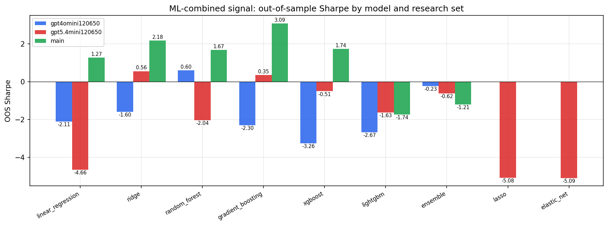

*ML-combined OOS Sharpe by model and research set*

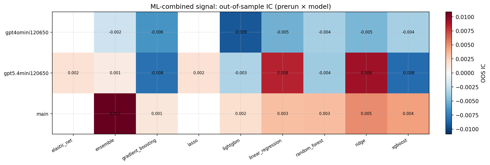

*ML-combined OOS IC (prerun × model)*

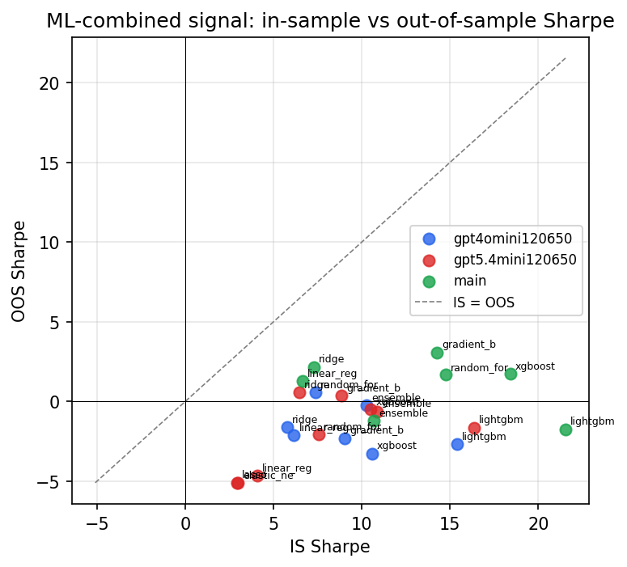

*IS vs OOS Sharpe (overfitting diagnostic)*

---
*Generated by `run_model_comparison.py`. Tables: `*.csv`; interactive: `comparison.ipynb`.*
