# Research-LLM factor comparison — `2024-11`

Comparing the **factor output of different research LLMs** on three axes (raw factor quality → factors as ML features → factors through the full agentic fund). The panel, IS/OOS split, horizon and model hyper-parameters are held identical across preruns — the *only* variable is the factor set.

## Preruns compared

| prerun | research_model | usable_factors | dropped_factors |
| --- | --- | --- | --- |
| gpt4omini120650 | gpt-4o-mini | 66 | 0 |
| gpt5.4mini120650 | gpt-5.4-mini | 69 | 0 |
| main | seed library | 78 | 10 |

> Dropped factors declare fields the current data doesn't have yet (e.g. fundamentals); they light up unchanged once that data is downloaded.

*Usable vs awaiting-data factors per research model*

## Key findings

- **Best ML-combined OOS Sharpe:** `gpt4omini120650` with `lightgbm` (OOS Sharpe = 7.697).
- **Mean OOS Sharpe across models, by research set:** `gpt4omini120650` = 6.011, `gpt5.4mini120650` = 3.756, `main` = -1.050.
- **Highest mean single-factor |IC| (h=6):** `main` (mean |IC| = 0.0068).
- **Most diverse zoo (highest effective/raw factor ratio):** `gpt5.4mini120650` (eff 44.2 of 69, ratio 0.64).
- **Best selection-deflated single-factor |IC|:** `main` (deflated |IC| = 0.0095 from 38 factors tried).

## 1. Single-factor IC (raw factor quality)

Per-underlying time-series Spearman rank-IC of every researched factor, recomputed on the shared panel at horizons h=1, h=6, h=60. The per-underlying IC correlates each factor's value vector with the underlying's own forward-return vector (pooled across underlyings); the cross-sectional IC ranks across underlyings per timestamp.

| prerun | n_factors | mean_abs_ic_1 | mean_abs_ic_6 | mean_abs_ic_60 | mean_abs_icir_6 | best_factor_h6 | best_abs_ic_h6 |
| --- | --- | --- | --- | --- | --- | --- | --- |
| gpt4omini120650 | 66 | 0.0065 | 0.0042 | 0.0049 | 0.2769 | order_flow_volatility_surge | 0.0122 |
| gpt5.4mini120650 | 69 | 0.0066 | 0.006 | 0.0076 | 0.2928 | spread_depth_squeeze_reversion | 0.0136 |
| main | 78 | 0.0116 | 0.0068 | 0.0057 | 0.4341 | alpha_046 | 0.0166 |

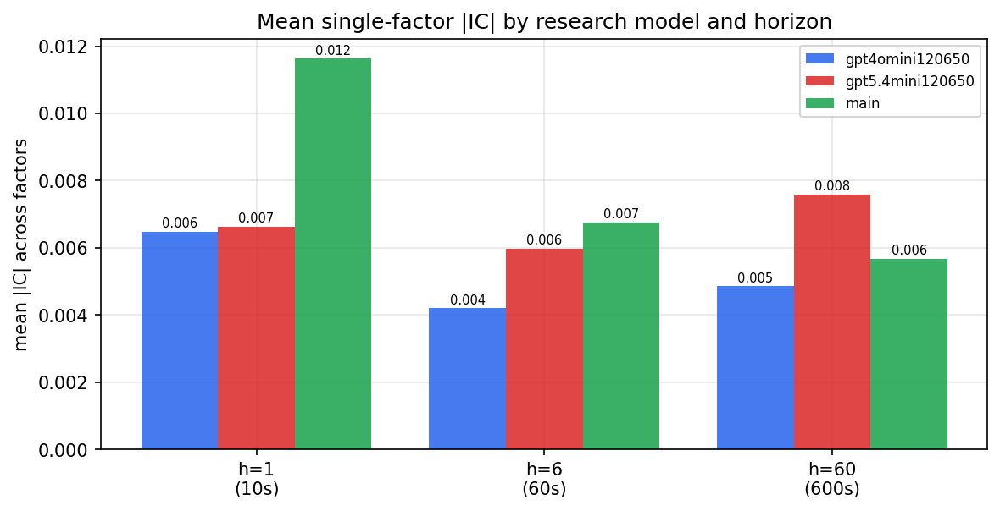

*Mean |IC| by research model and horizon*

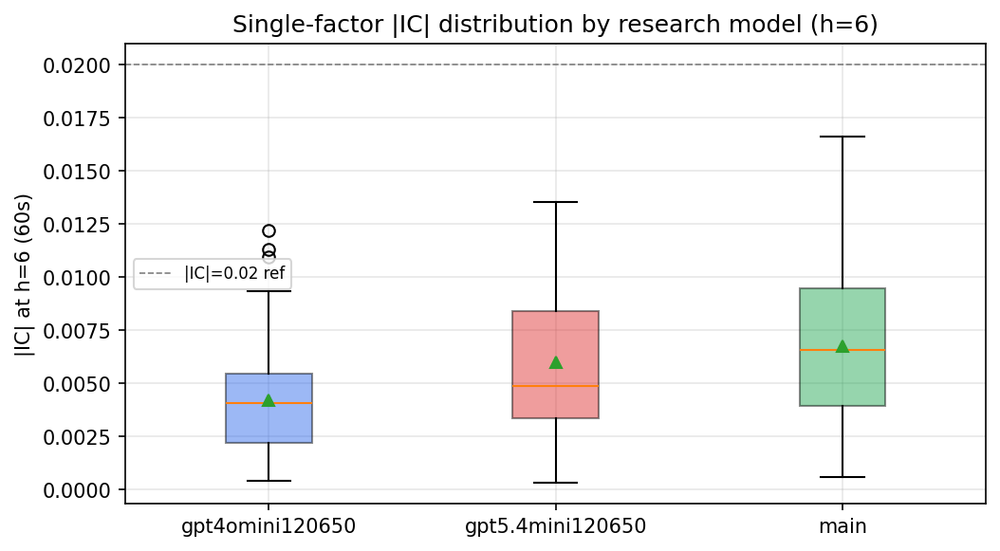

*Per-factor |IC| distribution by research model*

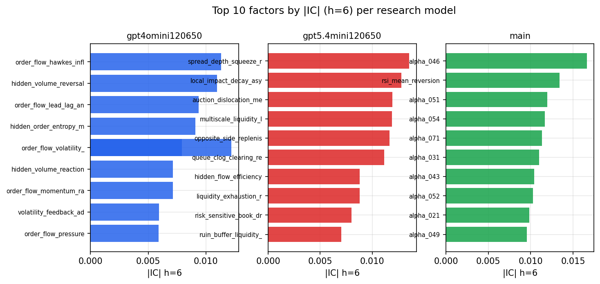

*Top factors by |IC| per research model*

## 2. Factor diversity & redundancy

Pairwise correlation of each zoo's *signals*. `eff_n_factors` is the effective number of independent factors (participation ratio of the correlation eigenvalues); `eff_ratio` and `redundancy` summarise how much unique information the zoo holds vs. how much is duplicated; `n_clusters` groups factors at |corr| ≥ 0.7.

| prerun | n_factors | eff_n_factors | eff_ratio | mean_abs_corr | n_clusters | redundancy |
| --- | --- | --- | --- | --- | --- | --- |
| gpt4omini120650 | 66 | 25.8424 | 0.3916 | 0.0534 | 53 | 0.6084 |
| gpt5.4mini120650 | 69 | 44.1634 | 0.64 | 0.0162 | 62 | 0.36 |
| main | 78 | 42.3887 | 0.5434 | 0.0292 | 70 | 0.4566 |

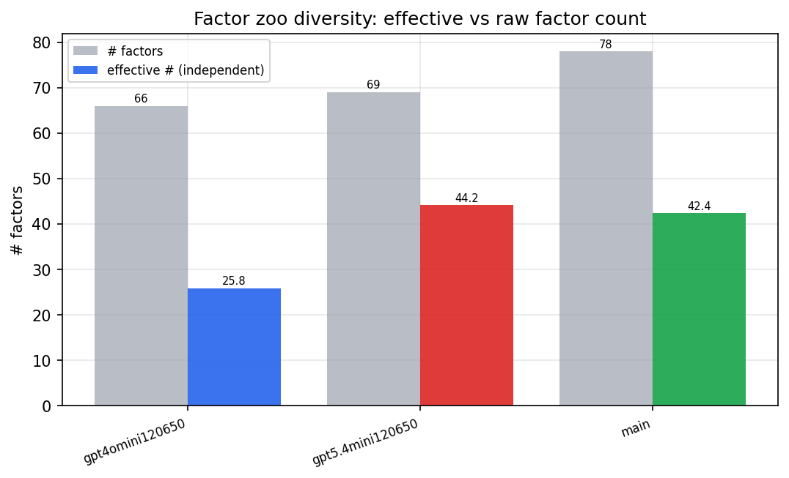

*Effective vs raw factor count per research model*

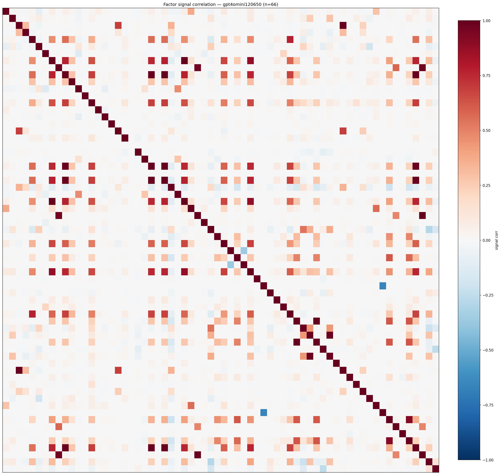

*Signal correlation matrix — gpt4omini120650*

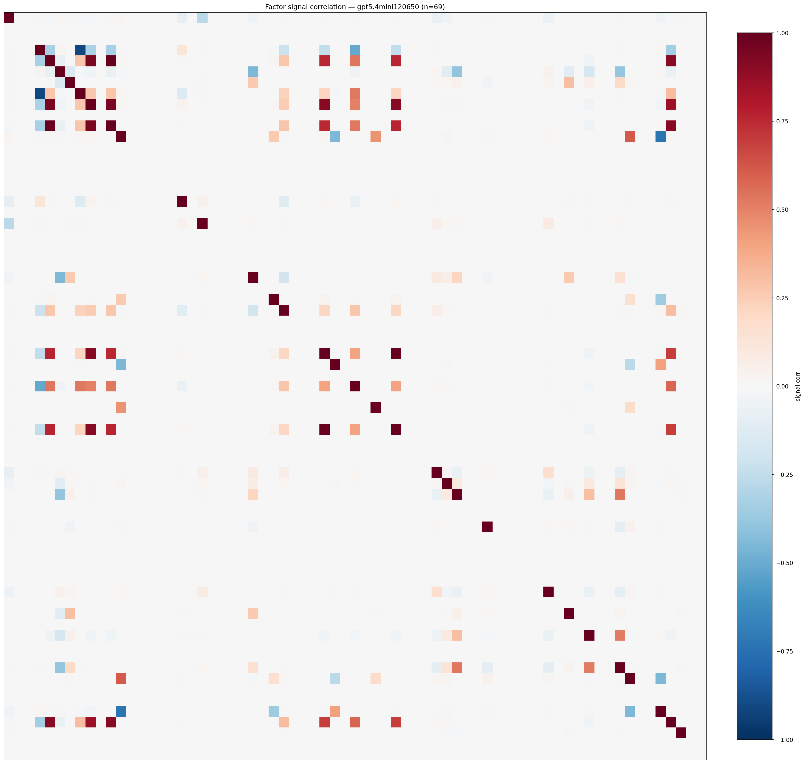

*Signal correlation matrix — gpt5.4mini120650*

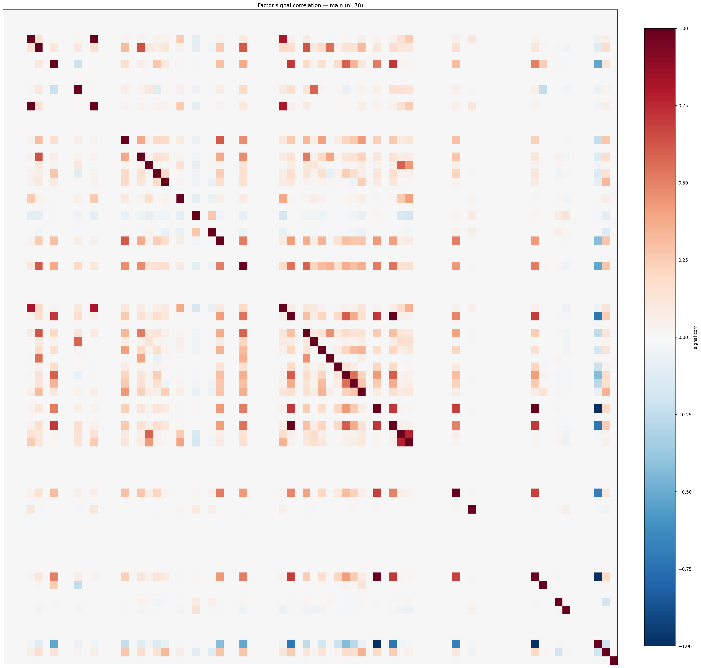

*Signal correlation matrix — main*

## 3. Deflation & model-based importance

`deflated_best_ic` haircuts each zoo's best |IC| for the number of factors tried (`ic_n_tested`) — a bigger zoo's best factor is more likely to be lucky. `lasso_n_nonzero` / `lasso_sparsity` show how many factors a sparse linear model actually keeps (model-view redundancy).

| prerun | best_ic | deflated_best_ic | deflated_best_t | ic_n_tested | ic_n_obs | lasso_n_nonzero | lasso_sparsity |
| --- | --- | --- | --- | --- | --- | --- | --- |
| gpt4omini120650 | 0.0122 | 0.0046 | 1.7493 | 64 | 143998 | 0 | 1.0 |
| gpt5.4mini120650 | 0.0136 | 0.0066 | 2.5216 | 31 | 143998 | 0 | 1.0 |
| main | 0.0166 | 0.0095 | 3.6161 | 38 | 143998 | 0 | 1.0 |

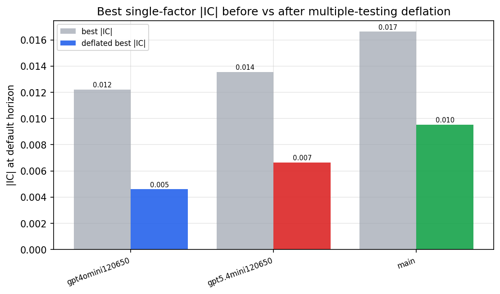

*Best |IC| before vs after multiple-testing deflation*

*Top factors by lasso importance per zoo*

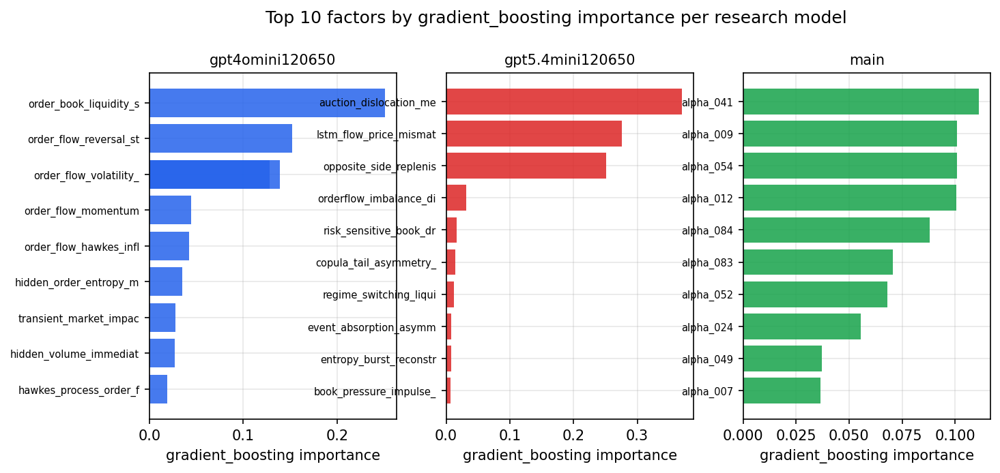

*Top factors by gradient_boosting importance per zoo*

## 4. ML-combined signal — per-underlying vectorised backtest

Each model combines a prerun's factors into ONE signal (fit `factors → forward return` on IS, predict per (bar, underlying)), then that combined signal is run through a simple vectorised backtest — `position(signal) × the underlying's own forward return` — on the held-out OOS tail (+ an equal-weight ensemble). No cross-sectional ranking.

> Config: position=**threshold** (t=1.0, z-score `expanding`), aggregation=**portfolio**, fit-standardise=**per_underlying**, horizon=6.

| prerun | model | n_factors_used | oos_ic | oos_sharpe | is_sharpe | oos_ann_return | oos_max_drawdown |
| --- | --- | --- | --- | --- | --- | --- | --- |
| gpt4omini120650 | linear_regression | 66 | 0.0037 | 4.5604 | 1.0678 | 0.1987 | -0.0006 |
| gpt4omini120650 | ridge | 66 | 0.0037 | 4.3737 | -1.0076 | 0.1398 | -0.0007 |
| gpt4omini120650 | lasso | 66 | nan | nan | nan | nan | nan |
| gpt4omini120650 | elastic_net | 66 | nan | nan | nan | nan | nan |
| gpt4omini120650 | random_forest | 66 | -0.0128 | 5.3624 | 7.8625 | 0.4242 | -0.0087 |
| gpt4omini120650 | gradient_boosting | 66 | -0.0049 | 6.6696 | 11.0254 | 0.4445 | -0.0045 |
| gpt4omini120650 | xgboost | 66 | -0.0055 | 6.4471 | 11.9447 | 0.5268 | -0.0054 |
| gpt4omini120650 | lightgbm | 66 | -0.0007 | 7.6973 | 17.4921 | 0.6265 | -0.0034 |
| gpt4omini120650 | ensemble | 66 | 0.0034 | 6.9668 | 12.7193 | 0.5902 | -0.007 |
| gpt5.4mini120650 | linear_regression | 69 | 0.0088 | -1.5733 | 1.7727 | -0.0015 | -0.0002 |
| gpt5.4mini120650 | ridge | 69 | 0.0086 | -1.1968 | 1.1783 | -0.0016 | -0.0003 |
| gpt5.4mini120650 | lasso | 69 | nan | nan | nan | nan | nan |
| gpt5.4mini120650 | elastic_net | 69 | nan | nan | nan | nan | nan |
| gpt5.4mini120650 | random_forest | 69 | -0.0001 | 3.2563 | 6.6675 | 0.2933 | -0.0177 |
| gpt5.4mini120650 | gradient_boosting | 69 | -0.0035 | 6.2395 | 8.3227 | 0.3742 | -0.0023 |
| gpt5.4mini120650 | xgboost | 69 | -0.0078 | 7.1589 | 10.3081 | 0.5198 | -0.0027 |
| gpt5.4mini120650 | lightgbm | 69 | -0.0092 | 7.233 | 16.8008 | 0.5088 | -0.002 |
| gpt5.4mini120650 | ensemble | 69 | -0.0082 | 5.1722 | 7.8947 | 0.3457 | -0.0017 |
| main | linear_regression | 78 | 0.009 | -0.3687 | 12.88 | -0.0122 | -0.0125 |
| main | ridge | 78 | 0.0099 | 0.3976 | 12.9125 | 0.0132 | -0.0109 |
| main | lasso | 78 | 0.0044 | 0.1639 | 10.3584 | 0.0055 | -0.0101 |
| main | elastic_net | 78 | 0.0043 | 0.3513 | 10.1051 | 0.0118 | -0.0103 |
| main | random_forest | 78 | 0.008 | 0.8783 | 11.9435 | 0.0293 | -0.0073 |
| main | gradient_boosting | 78 | 0.0049 | -3.1507 | 15.1546 | -0.1187 | -0.0117 |
| main | xgboost | 78 | 0.01 | -1.1208 | 17.8711 | -0.0335 | -0.0084 |
| main | lightgbm | 78 | 0.0051 | -4.0987 | 26.5761 | -0.0977 | -0.0123 |
| main | ensemble | 78 | 0.01 | -2.4995 | 19.3943 | -0.0761 | -0.01 |

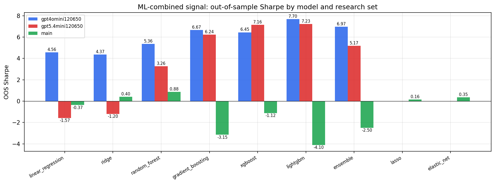

*ML-combined OOS Sharpe by model and research set*

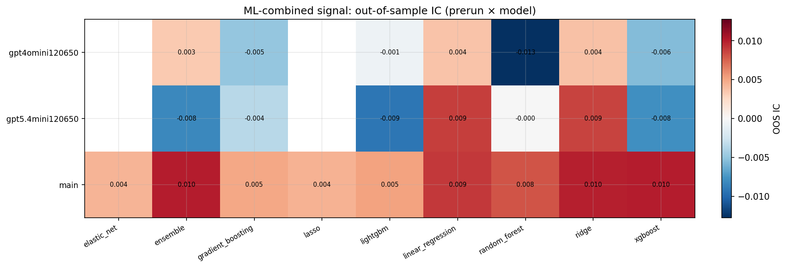

*ML-combined OOS IC (prerun × model)*

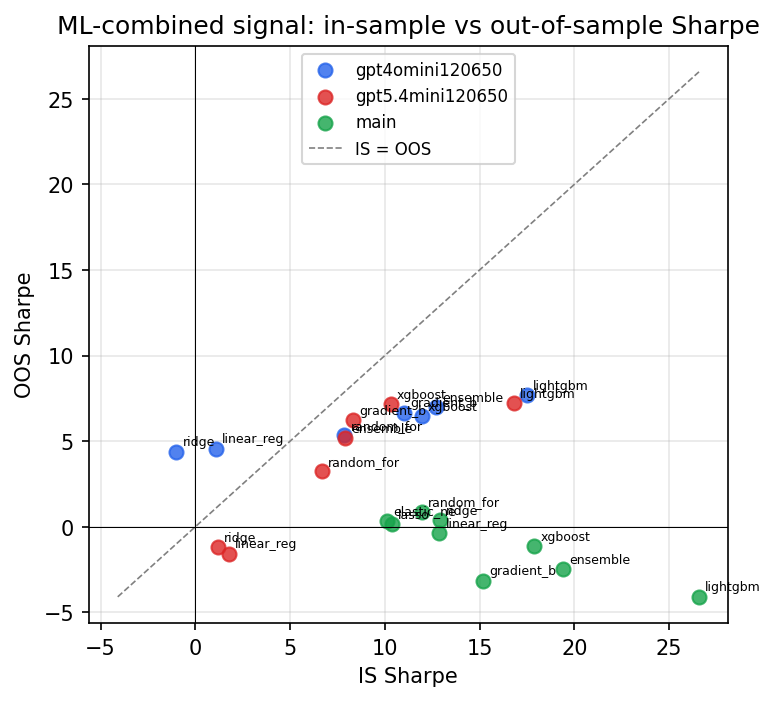

*IS vs OOS Sharpe (overfitting diagnostic)*

---
*Generated by `run_model_comparison.py`. Tables: `*.csv`; interactive: `comparison.ipynb`.*
