# Research-LLM factor comparison — `2024-12`

Comparing the **factor output of different research LLMs** on three axes (raw factor quality → factors as ML features → factors through the full agentic fund). The panel, IS/OOS split, horizon and model hyper-parameters are held identical across preruns — the *only* variable is the factor set.

## Preruns compared

| prerun | research_model | usable_factors | dropped_factors |
| --- | --- | --- | --- |
| gpt4omini120650 | gpt-4o-mini | 66 | 0 |
| gpt5.4mini120650 | gpt-5.4-mini | 69 | 0 |
| main | seed library | 78 | 10 |

> Dropped factors declare fields the current data doesn't have yet (e.g. fundamentals); they light up unchanged once that data is downloaded.

*Usable vs awaiting-data factors per research model*

## Key findings

- **Best ML-combined OOS Sharpe:** `main` with `gradient_boosting` (OOS Sharpe = 6.170).
- **Mean OOS Sharpe across models, by research set:** `main` = 2.005, `gpt4omini120650` = 0.199, `gpt5.4mini120650` = -3.274.
- **Highest mean single-factor |IC| (h=6):** `gpt5.4mini120650` (mean |IC| = 0.0047).
- **Most diverse zoo (highest effective/raw factor ratio):** `gpt5.4mini120650` (eff 48.9 of 69, ratio 0.71).
- **Best selection-deflated single-factor |IC|:** `gpt5.4mini120650` (deflated |IC| = 0.0133 from 31 factors tried).

## 1. Single-factor IC (raw factor quality)

Per-underlying time-series Spearman rank-IC of every researched factor, recomputed on the shared panel at horizons h=1, h=6, h=60. The per-underlying IC correlates each factor's value vector with the underlying's own forward-return vector (pooled across underlyings); the cross-sectional IC ranks across underlyings per timestamp.

| prerun | n_factors | mean_abs_ic_1 | mean_abs_ic_6 | mean_abs_ic_60 | mean_abs_icir_6 | best_factor_h6 | best_abs_ic_h6 |
| --- | --- | --- | --- | --- | --- | --- | --- |
| gpt4omini120650 | 66 | 0.0036 | 0.0027 | 0.0049 | 0.1796 | order_flow_momentum | 0.0097 |
| gpt5.4mini120650 | 69 | 0.0037 | 0.0047 | 0.0088 | 0.4255 | multiscale_liquidity_leadlag_reversal | 0.0201 |
| main | 78 | 0.0065 | 0.0033 | 0.0036 | 0.2078 | alpha_046 | 0.009 |

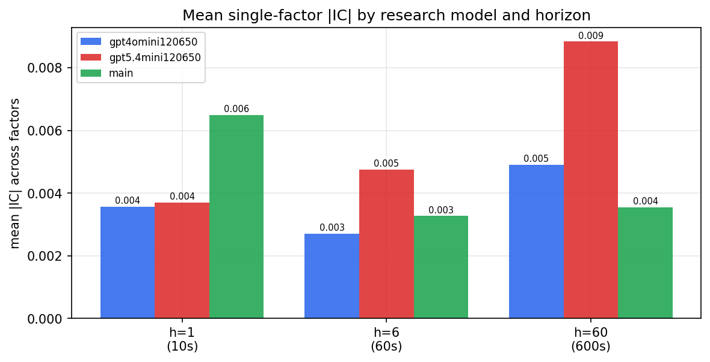

*Mean |IC| by research model and horizon*

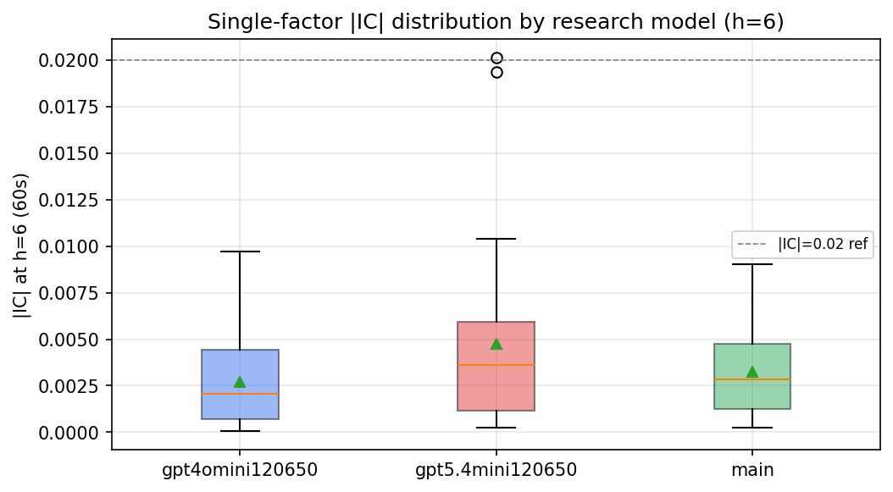

*Per-factor |IC| distribution by research model*

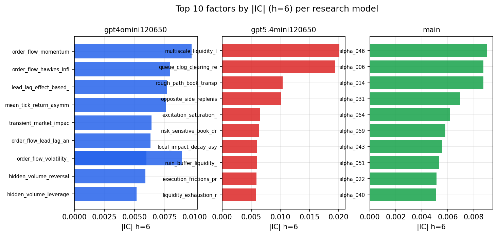

*Top factors by |IC| per research model*

## 2. Factor diversity & redundancy

Pairwise correlation of each zoo's *signals*. `eff_n_factors` is the effective number of independent factors (participation ratio of the correlation eigenvalues); `eff_ratio` and `redundancy` summarise how much unique information the zoo holds vs. how much is duplicated; `n_clusters` groups factors at |corr| ≥ 0.7.

| prerun | n_factors | eff_n_factors | eff_ratio | mean_abs_corr | n_clusters | redundancy |
| --- | --- | --- | --- | --- | --- | --- |
| gpt4omini120650 | 66 | 25.7207 | 0.3897 | 0.0536 | 51 | 0.6103 |
| gpt5.4mini120650 | 69 | 48.9039 | 0.7088 | 0.0134 | 62 | 0.2912 |
| main | 78 | 42.2686 | 0.5419 | 0.0292 | 70 | 0.4581 |

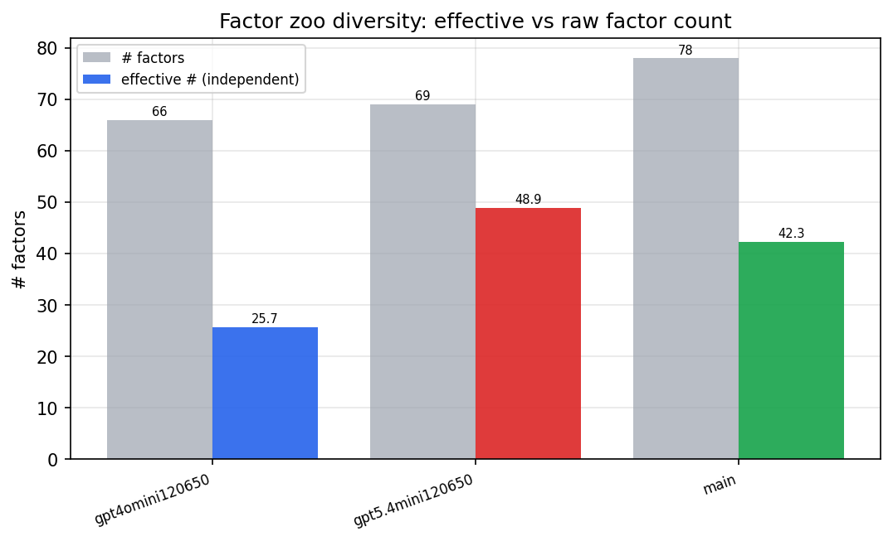

*Effective vs raw factor count per research model*

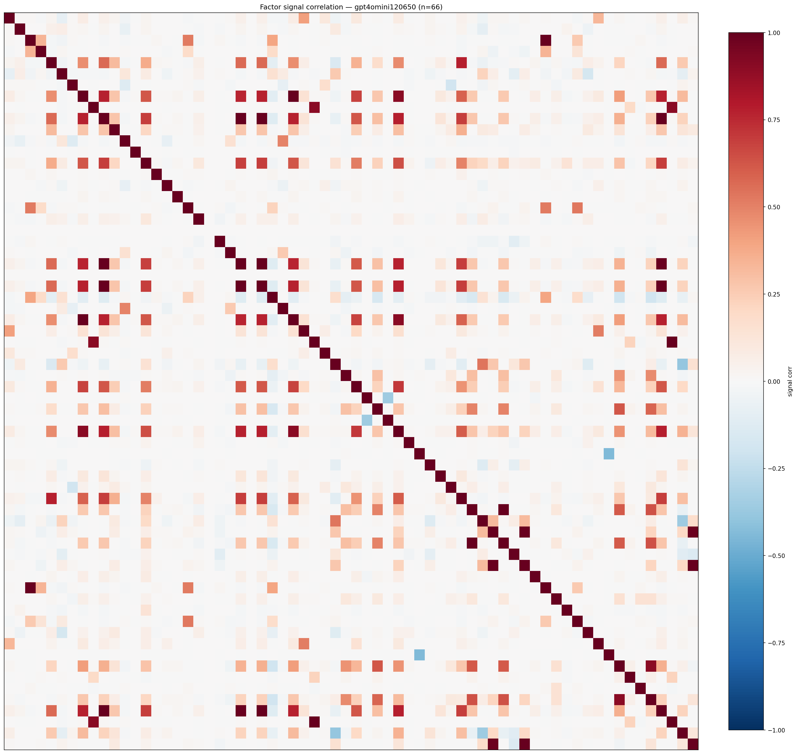

*Signal correlation matrix — gpt4omini120650*

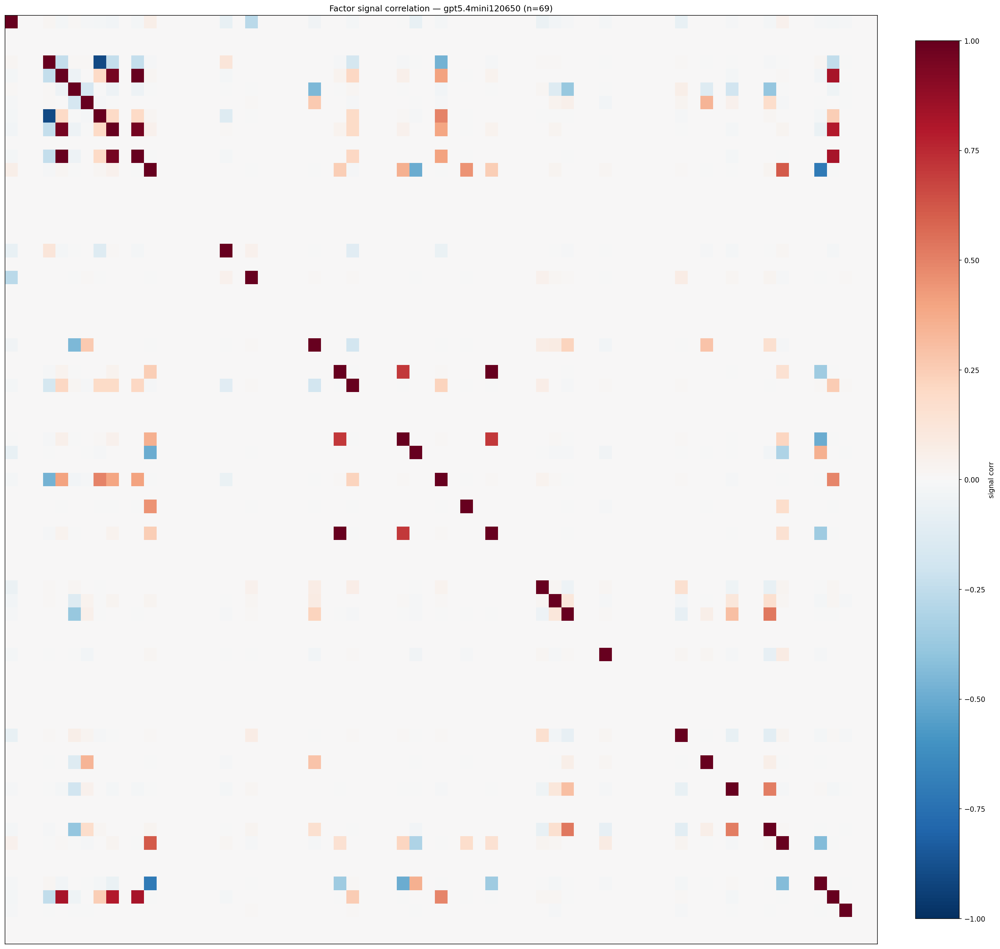

*Signal correlation matrix — gpt5.4mini120650*

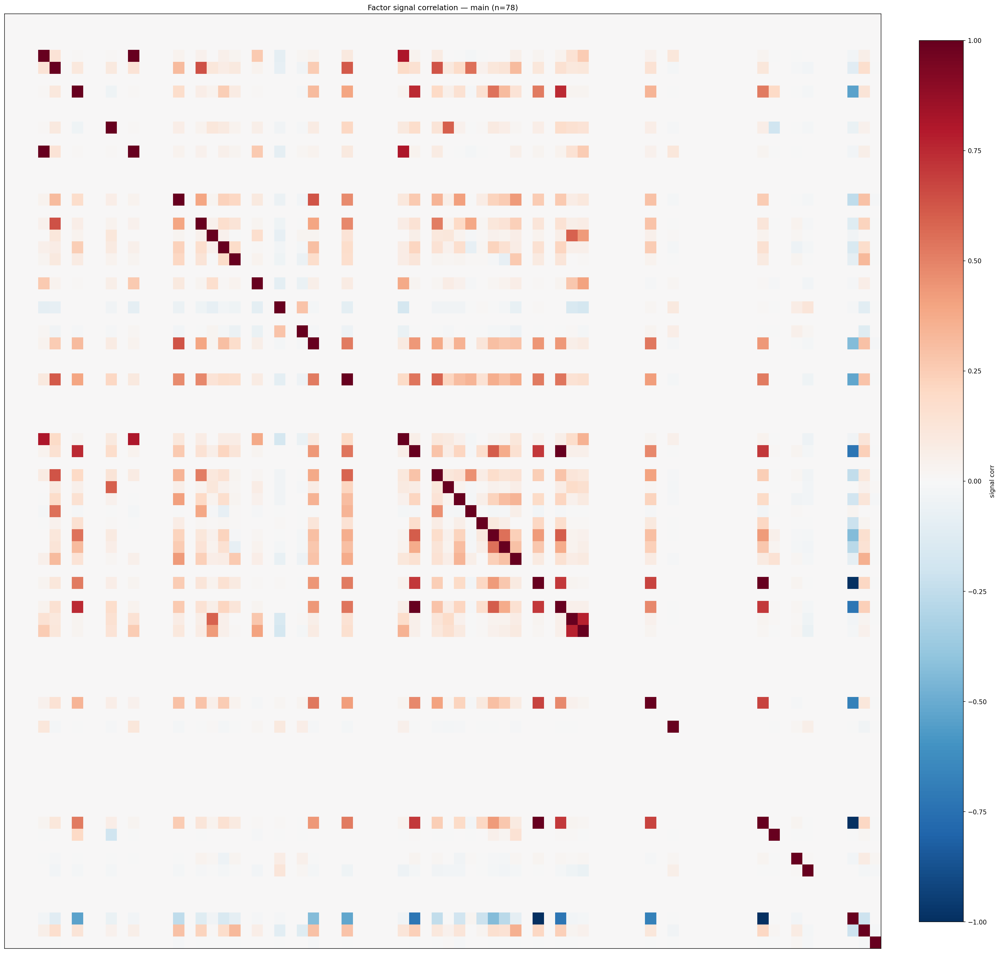

*Signal correlation matrix — main*

## 3. Deflation & model-based importance

`deflated_best_ic` haircuts each zoo's best |IC| for the number of factors tried (`ic_n_tested`) — a bigger zoo's best factor is more likely to be lucky. `lasso_n_nonzero` / `lasso_sparsity` show how many factors a sparse linear model actually keeps (model-view redundancy).

| prerun | best_ic | deflated_best_ic | deflated_best_t | ic_n_tested | ic_n_obs | lasso_n_nonzero | lasso_sparsity |
| --- | --- | --- | --- | --- | --- | --- | --- |
| gpt4omini120650 | 0.0097 | 0.0022 | 0.8545 | 64 | 147599 | 0 | 1.0 |
| gpt5.4mini120650 | 0.0201 | 0.0133 | 5.109 | 31 | 147599 | 0 | 1.0 |
| main | 0.009 | 0.002 | 0.7699 | 38 | 147599 | 0 | 1.0 |

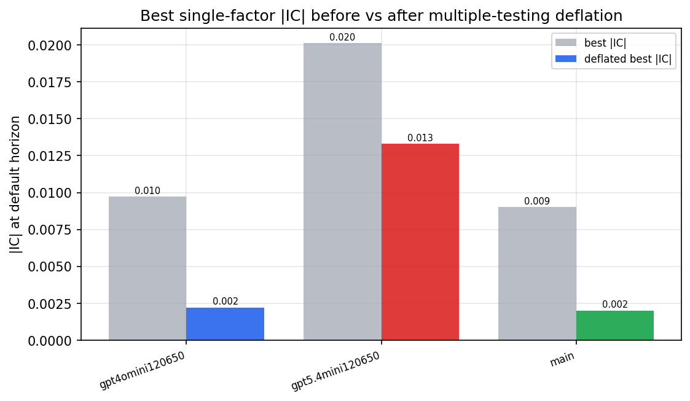

*Best |IC| before vs after multiple-testing deflation*

*Top factors by lasso importance per zoo*

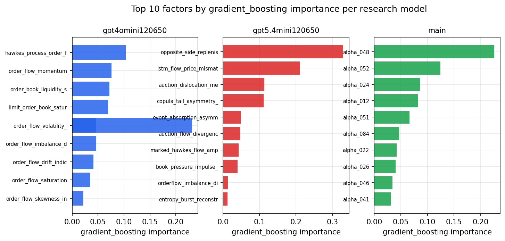

*Top factors by gradient_boosting importance per zoo*

## 4. ML-combined signal — per-underlying vectorised backtest

Each model combines a prerun's factors into ONE signal (fit `factors → forward return` on IS, predict per (bar, underlying)), then that combined signal is run through a simple vectorised backtest — `position(signal) × the underlying's own forward return` — on the held-out OOS tail (+ an equal-weight ensemble). No cross-sectional ranking.

> Config: position=**threshold** (t=1.0, z-score `expanding`), aggregation=**portfolio**, fit-standardise=**per_underlying**, horizon=6.

| prerun | model | n_factors_used | oos_ic | oos_sharpe | is_sharpe | oos_ann_return | oos_max_drawdown |
| --- | --- | --- | --- | --- | --- | --- | --- |
| gpt4omini120650 | linear_regression | 66 | 0.0081 | 2.7754 | 8.025 | 0.2164 | -0.0155 |
| gpt4omini120650 | ridge | 66 | 0.008 | 3.2906 | 7.8814 | 0.2598 | -0.0142 |
| gpt4omini120650 | lasso | 66 | 0.0053 | -0.2299 | 6.5033 | -0.0233 | -0.0313 |
| gpt4omini120650 | elastic_net | 66 | 0.0052 | -0.2341 | 6.3293 | -0.0237 | -0.0311 |
| gpt4omini120650 | random_forest | 66 | -0.0052 | -0.9946 | 6.9025 | -0.0785 | -0.0229 |
| gpt4omini120650 | gradient_boosting | 66 | -0.0049 | -3.6164 | 9.9259 | -0.1643 | -0.0202 |
| gpt4omini120650 | xgboost | 66 | -0.0042 | -0.0261 | 12.429 | -0.0019 | -0.0236 |
| gpt4omini120650 | lightgbm | 66 | 0.0074 | 1.621 | 17.1141 | 0.1138 | -0.0174 |
| gpt4omini120650 | ensemble | 66 | 0.0072 | -0.7962 | 12.1631 | -0.0678 | -0.0243 |
| gpt5.4mini120650 | linear_regression | 69 | 0.002 | -0.3946 | 4.237 | -0.0264 | -0.0193 |
| gpt5.4mini120650 | ridge | 69 | -0.0002 | -1.0485 | 3.1945 | -0.0677 | -0.0198 |
| gpt5.4mini120650 | lasso | 69 | -0.0023 | -1.3075 | 1.3347 | -0.0736 | -0.019 |
| gpt5.4mini120650 | elastic_net | 69 | -0.0023 | -1.3584 | 1.4209 | -0.0763 | -0.019 |
| gpt5.4mini120650 | random_forest | 69 | -0.0024 | -5.4905 | 5.9171 | -0.3049 | -0.0347 |
| gpt5.4mini120650 | gradient_boosting | 69 | -0.0041 | -8.2241 | 8.6885 | -0.3349 | -0.0282 |
| gpt5.4mini120650 | xgboost | 69 | 0.0033 | -3.8961 | 10.311 | -0.1574 | -0.0179 |
| gpt5.4mini120650 | lightgbm | 69 | 0.005 | -2.8868 | 15.1001 | -0.1123 | -0.0165 |
| gpt5.4mini120650 | ensemble | 69 | -0.0005 | -4.8585 | 9.8425 | -0.2863 | -0.0253 |
| main | linear_regression | 78 | -0.0048 | 0.4544 | 11.3703 | 0.0299 | -0.0132 |
| main | ridge | 78 | -0.0052 | -0.2505 | 12.3714 | -0.0159 | -0.0129 |
| main | lasso | 78 | nan | nan | nan | nan | nan |
| main | elastic_net | 78 | nan | nan | nan | nan | nan |
| main | random_forest | 78 | 0.0041 | 3.3739 | 15.3659 | 0.1802 | -0.0122 |
| main | gradient_boosting | 78 | 0.005 | 6.1705 | 15.1336 | 0.2585 | -0.0084 |
| main | xgboost | 78 | 0.0063 | 2.0009 | 20.9925 | 0.1007 | -0.0128 |
| main | lightgbm | 78 | 0.0034 | 3.2365 | 24.9808 | 0.2046 | -0.0166 |
| main | ensemble | 78 | 0.0053 | -0.948 | 3.8915 | -0.0024 | -0.0007 |

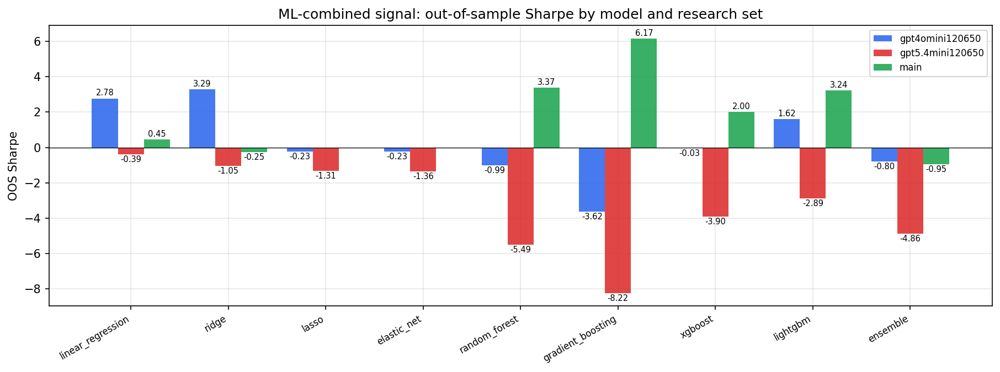

*ML-combined OOS Sharpe by model and research set*

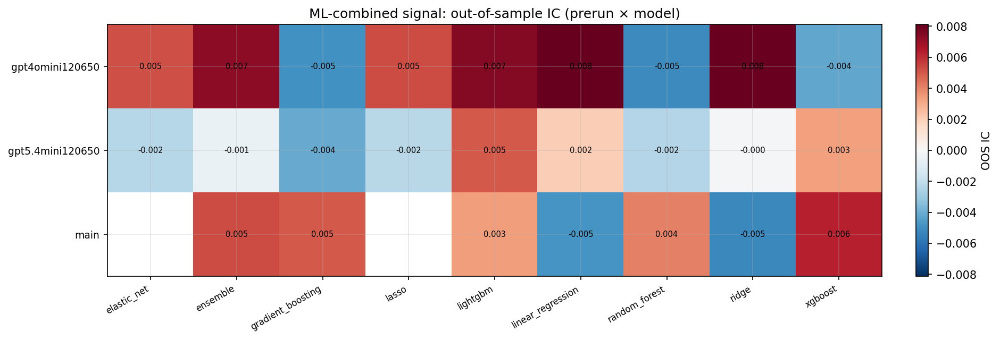

*ML-combined OOS IC (prerun × model)*

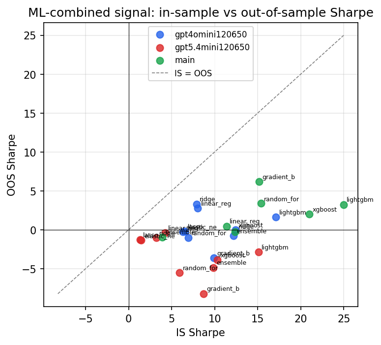

*IS vs OOS Sharpe (overfitting diagnostic)*

---
*Generated by `run_model_comparison.py`. Tables: `*.csv`; interactive: `comparison.ipynb`.*
