# Research-LLM factor comparison — `2025-02`

Comparing the **factor output of different research LLMs** on three axes (raw factor quality → factors as ML features → factors through the full agentic fund). The panel, IS/OOS split, horizon and model hyper-parameters are held identical across preruns — the *only* variable is the factor set.

## Preruns compared

| prerun | research_model | usable_factors | dropped_factors |
| --- | --- | --- | --- |
| gpt4omini120650 | gpt-4o-mini | 66 | 0 |
| gpt5.4mini120650 | gpt-5.4-mini | 69 | 0 |
| main | seed library | 78 | 10 |

> Dropped factors declare fields the current data doesn't have yet (e.g. fundamentals); they light up unchanged once that data is downloaded.

*Usable vs awaiting-data factors per research model*

## Key findings

- **Best ML-combined OOS Sharpe:** `main` with `ensemble` (OOS Sharpe = 3.386).
- **Mean OOS Sharpe across models, by research set:** `gpt4omini120650` = -1.392, `main` = -1.697, `gpt5.4mini120650` = -3.478.
- **Highest mean single-factor |IC| (h=6):** `gpt5.4mini120650` (mean |IC| = 0.0058).
- **Most diverse zoo (highest effective/raw factor ratio):** `gpt5.4mini120650` (eff 47.2 of 69, ratio 0.68).
- **Best selection-deflated single-factor |IC|:** `gpt5.4mini120650` (deflated |IC| = 0.0099 from 31 factors tried).

## 1. Single-factor IC (raw factor quality)

Per-underlying time-series Spearman rank-IC of every researched factor, recomputed on the shared panel at horizons h=1, h=6, h=60. The per-underlying IC correlates each factor's value vector with the underlying's own forward-return vector (pooled across underlyings); the cross-sectional IC ranks across underlyings per timestamp.

| prerun | n_factors | mean_abs_ic_1 | mean_abs_ic_6 | mean_abs_ic_60 | mean_abs_icir_6 | best_factor_h6 | best_abs_ic_h6 |
| --- | --- | --- | --- | --- | --- | --- | --- |
| gpt4omini120650 | 66 | 0.0031 | 0.0038 | 0.0057 | 0.2329 | order_flow_volatility_surge | 0.015 |
| gpt5.4mini120650 | 69 | 0.0039 | 0.0058 | 0.0074 | 0.2535 | multiscale_liquidity_leadlag_reversal | 0.0169 |
| main | 78 | 0.0046 | 0.0039 | 0.0041 | 0.2005 | alpha_006 | 0.0131 |

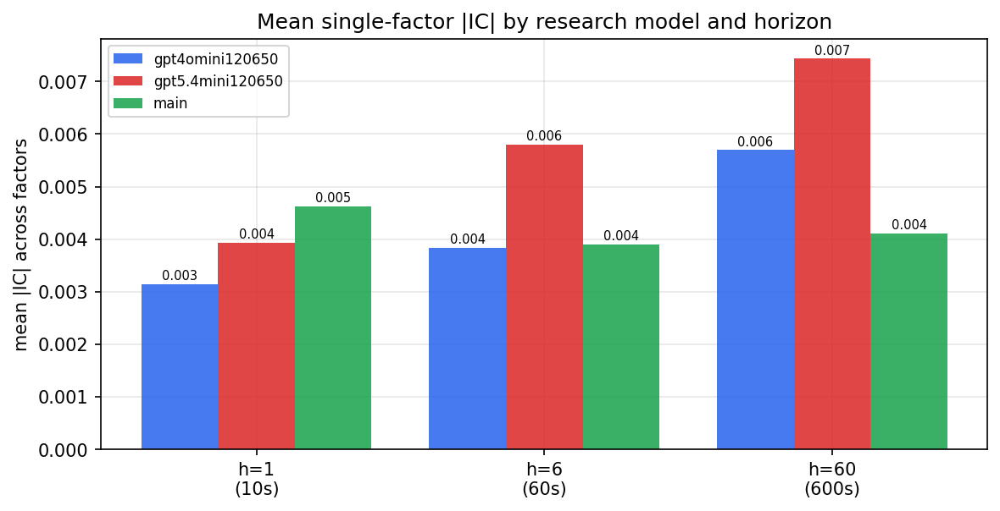

*Mean |IC| by research model and horizon*

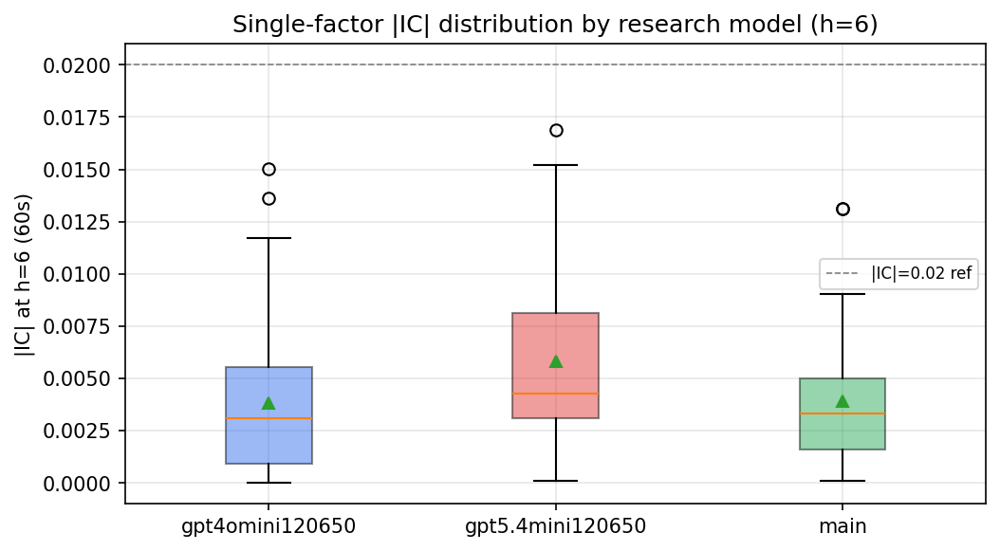

*Per-factor |IC| distribution by research model*

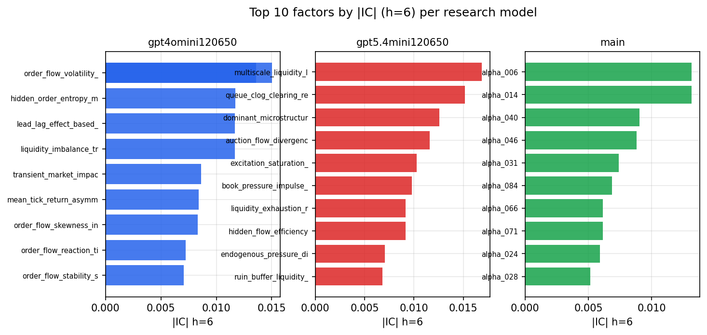

*Top factors by |IC| per research model*

## 2. Factor diversity & redundancy

Pairwise correlation of each zoo's *signals*. `eff_n_factors` is the effective number of independent factors (participation ratio of the correlation eigenvalues); `eff_ratio` and `redundancy` summarise how much unique information the zoo holds vs. how much is duplicated; `n_clusters` groups factors at |corr| ≥ 0.7.

| prerun | n_factors | eff_n_factors | eff_ratio | mean_abs_corr | n_clusters | redundancy |
| --- | --- | --- | --- | --- | --- | --- |
| gpt4omini120650 | 66 | 26.4584 | 0.4009 | 0.0513 | 52 | 0.5991 |
| gpt5.4mini120650 | 69 | 47.181 | 0.6838 | 0.0142 | 62 | 0.3162 |
| main | 78 | 42.593 | 0.5461 | 0.0288 | 71 | 0.4539 |

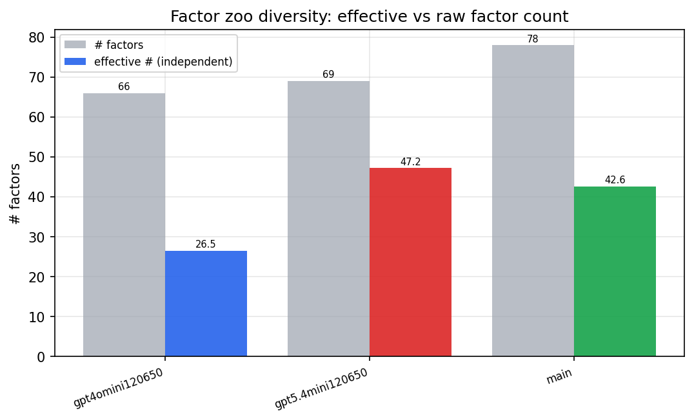

*Effective vs raw factor count per research model*

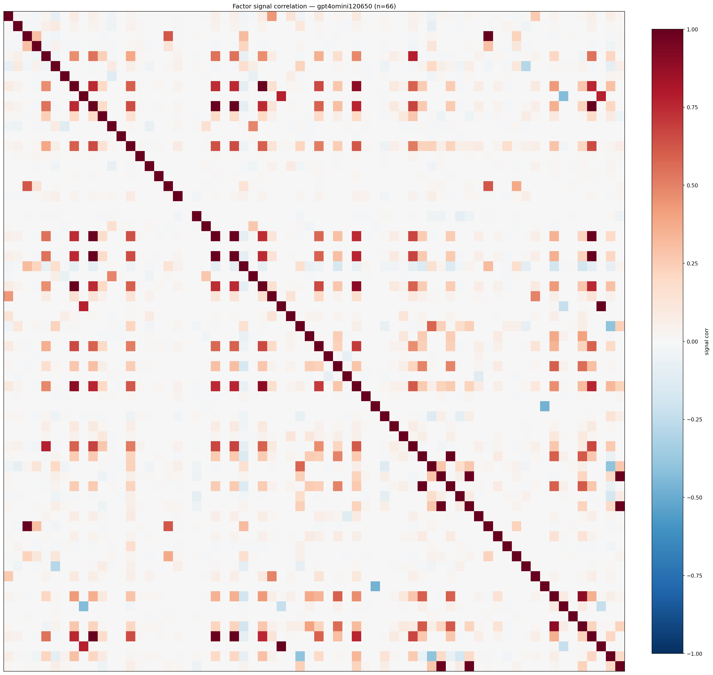

*Signal correlation matrix — gpt4omini120650*

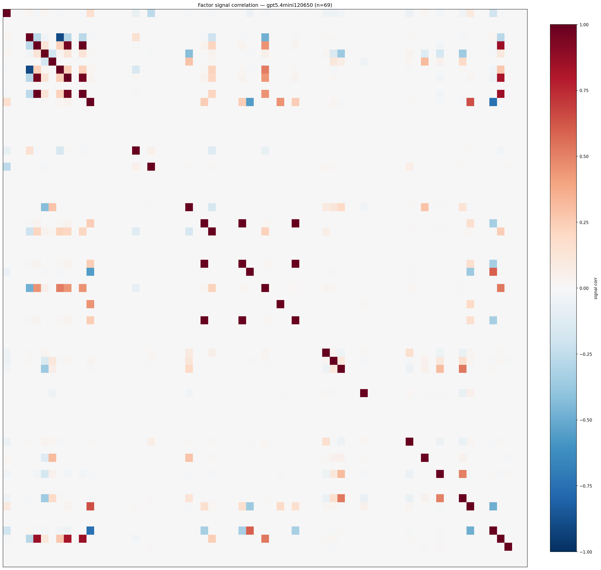

*Signal correlation matrix — gpt5.4mini120650*

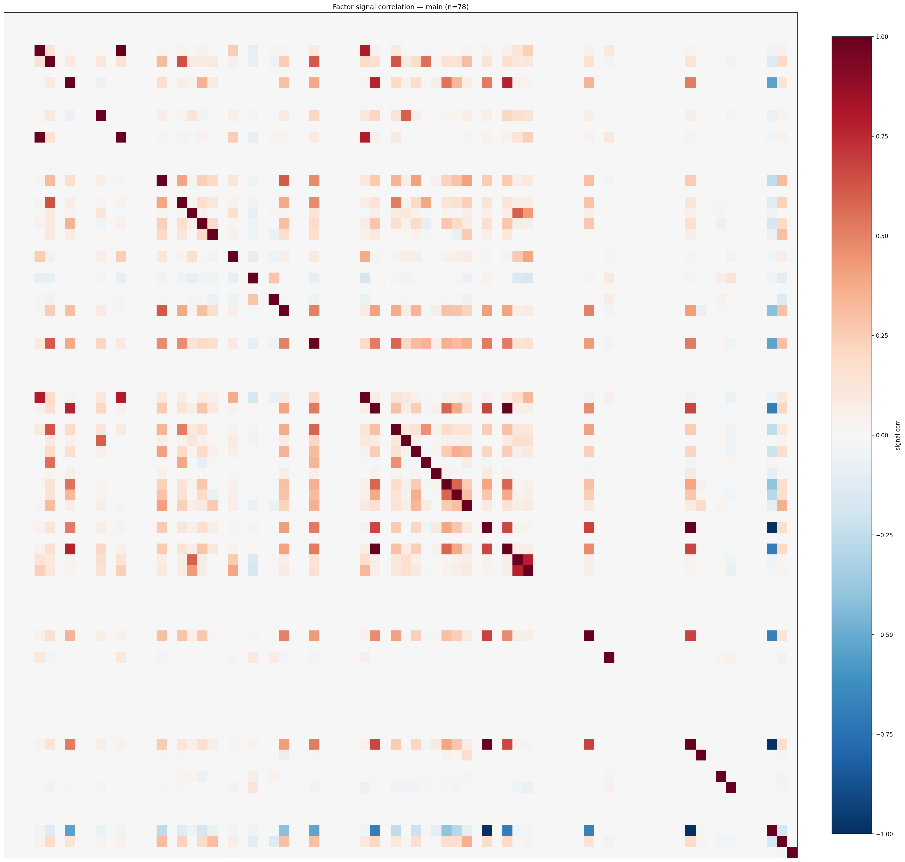

*Signal correlation matrix — main*

## 3. Deflation & model-based importance

`deflated_best_ic` haircuts each zoo's best |IC| for the number of factors tried (`ic_n_tested`) — a bigger zoo's best factor is more likely to be lucky. `lasso_n_nonzero` / `lasso_sparsity` show how many factors a sparse linear model actually keeps (model-view redundancy).

| prerun | best_ic | deflated_best_ic | deflated_best_t | ic_n_tested | ic_n_obs | lasso_n_nonzero | lasso_sparsity |
| --- | --- | --- | --- | --- | --- | --- | --- |
| gpt4omini120650 | 0.015 | 0.0073 | 2.7249 | 64 | 139319 | 0 | 1.0 |
| gpt5.4mini120650 | 0.0169 | 0.0099 | 3.6782 | 31 | 139319 | 0 | 1.0 |
| main | 0.0131 | 0.0059 | 2.2069 | 38 | 139319 | 0 | 1.0 |

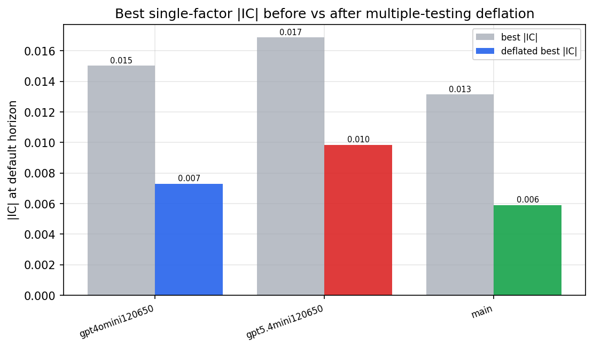

*Best |IC| before vs after multiple-testing deflation*

*Top factors by lasso importance per zoo*

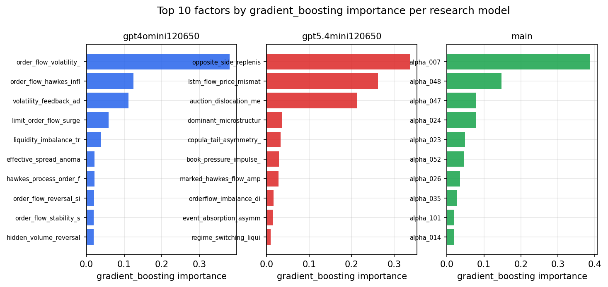

*Top factors by gradient_boosting importance per zoo*

## 4. ML-combined signal — per-underlying vectorised backtest

Each model combines a prerun's factors into ONE signal (fit `factors → forward return` on IS, predict per (bar, underlying)), then that combined signal is run through a simple vectorised backtest — `position(signal) × the underlying's own forward return` — on the held-out OOS tail (+ an equal-weight ensemble). No cross-sectional ranking.

> Config: position=**threshold** (t=1.0, z-score `expanding`), aggregation=**portfolio**, fit-standardise=**per_underlying**, horizon=6.

| prerun | model | n_factors_used | oos_ic | oos_sharpe | is_sharpe | oos_ann_return | oos_max_drawdown |
| --- | --- | --- | --- | --- | --- | --- | --- |
| gpt4omini120650 | linear_regression | 66 | 0.0056 | -1.8623 | 6.1554 | -0.1425 | -0.0172 |
| gpt4omini120650 | ridge | 66 | 0.0064 | -0.6283 | 6.0862 | -0.0493 | -0.0148 |
| gpt4omini120650 | lasso | 66 | nan | nan | nan | nan | nan |
| gpt4omini120650 | elastic_net | 66 | nan | nan | nan | nan | nan |
| gpt4omini120650 | random_forest | 66 | 0.0026 | -4.0108 | 8.7202 | -0.2195 | -0.0261 |
| gpt4omini120650 | gradient_boosting | 66 | 0.0029 | 0.636 | 9.0748 | 0.0245 | -0.0115 |
| gpt4omini120650 | xgboost | 66 | -0.0016 | -0.7825 | 13.1935 | -0.0386 | -0.0146 |
| gpt4omini120650 | lightgbm | 66 | -0.0056 | -2.3447 | 16.3588 | -0.1104 | -0.0147 |
| gpt4omini120650 | ensemble | 66 | 0.0069 | -0.7523 | 9.4321 | -0.0274 | -0.0095 |
| gpt5.4mini120650 | linear_regression | 69 | -0.0053 | -5.9941 | 10.1216 | -0.524 | -0.0529 |
| gpt5.4mini120650 | ridge | 69 | -0.0042 | -5.8275 | 9.9727 | -0.5095 | -0.051 |
| gpt5.4mini120650 | lasso | 69 | 0.0007 | -3.5743 | 4.5322 | -0.3215 | -0.0602 |
| gpt5.4mini120650 | elastic_net | 69 | 0.0007 | -3.4522 | 4.4982 | -0.3097 | -0.0597 |
| gpt5.4mini120650 | random_forest | 69 | -0.0139 | -5.3375 | 9.6977 | -0.4616 | -0.0625 |
| gpt5.4mini120650 | gradient_boosting | 69 | -0.0039 | 0.2998 | 8.4992 | 0.0048 | -0.0042 |
| gpt5.4mini120650 | xgboost | 69 | -0.0042 | 0.3767 | 10.2852 | 0.014 | -0.0119 |
| gpt5.4mini120650 | lightgbm | 69 | -0.0061 | -2.894 | 13.4896 | -0.0825 | -0.0147 |
| gpt5.4mini120650 | ensemble | 69 | -0.0038 | -4.8992 | 12.1758 | -0.4087 | -0.0599 |
| main | linear_regression | 78 | -0.0111 | -4.511 | 9.1386 | -0.2468 | -0.0285 |
| main | ridge | 78 | -0.0114 | -5.0391 | 8.3459 | -0.2775 | -0.0265 |
| main | lasso | 78 | nan | nan | nan | nan | nan |
| main | elastic_net | 78 | nan | nan | nan | nan | nan |
| main | random_forest | 78 | -0.0037 | -0.4593 | 12.8219 | -0.0248 | -0.016 |
| main | gradient_boosting | 78 | -0.0048 | -2.4161 | 15.0697 | -0.0439 | -0.0072 |
| main | xgboost | 78 | -0.0045 | -6.1313 | 14.1917 | -0.2129 | -0.0215 |
| main | lightgbm | 78 | 0.0076 | 3.2914 | 19.7672 | 0.0928 | -0.0068 |
| main | ensemble | 78 | -0.0126 | 3.3857 | 6.3938 | 0.0056 | -0.0003 |

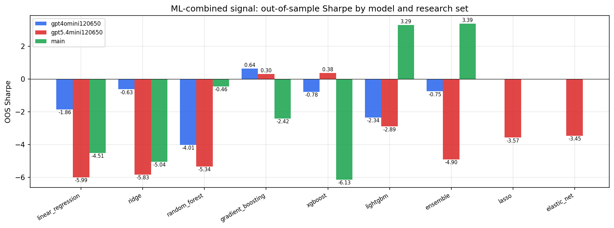

*ML-combined OOS Sharpe by model and research set*

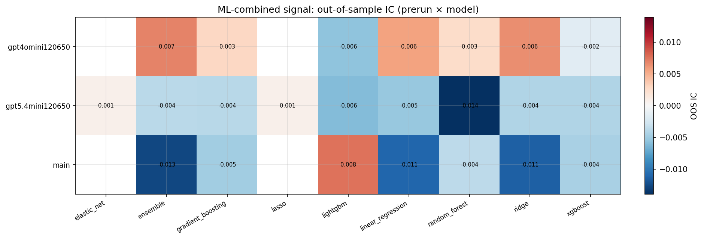

*ML-combined OOS IC (prerun × model)*

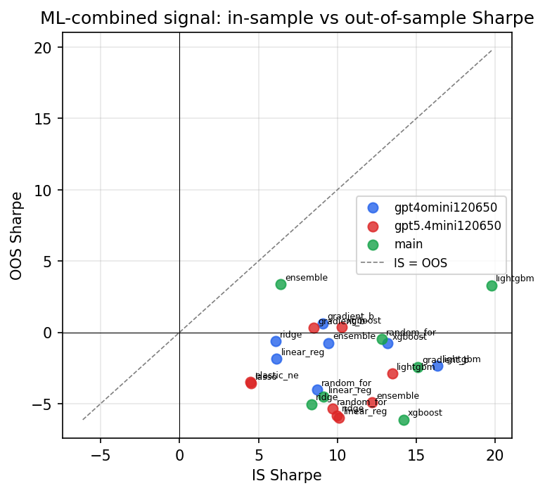

*IS vs OOS Sharpe (overfitting diagnostic)*

---
*Generated by `run_model_comparison.py`. Tables: `*.csv`; interactive: `comparison.ipynb`.*
