# Research-LLM factor comparison — `2025-03`

Comparing the **factor output of different research LLMs** on three axes (raw factor quality → factors as ML features → factors through the full agentic fund). The panel, IS/OOS split, horizon and model hyper-parameters are held identical across preruns — the *only* variable is the factor set.

## Preruns compared

| prerun | research_model | usable_factors | dropped_factors |
| --- | --- | --- | --- |
| gpt4omini120650 | gpt-4o-mini | 66 | 0 |
| gpt5.4mini120650 | gpt-5.4-mini | 69 | 0 |
| main | seed library | 78 | 10 |

> Dropped factors declare fields the current data doesn't have yet (e.g. fundamentals); they light up unchanged once that data is downloaded.

*Usable vs awaiting-data factors per research model*

## Key findings

- **Best ML-combined OOS Sharpe:** `gpt5.4mini120650` with `lightgbm` (OOS Sharpe = 2.530).
- **Mean OOS Sharpe across models, by research set:** `gpt5.4mini120650` = 0.598, `main` = -2.842, `gpt4omini120650` = -3.640.
- **Highest mean single-factor |IC| (h=6):** `gpt5.4mini120650` (mean |IC| = 0.0049).
- **Most diverse zoo (highest effective/raw factor ratio):** `gpt5.4mini120650` (eff 46.2 of 69, ratio 0.67).
- **Best selection-deflated single-factor |IC|:** `gpt4omini120650` (deflated |IC| = 0.0134 from 64 factors tried).

## 1. Single-factor IC (raw factor quality)

Per-underlying time-series Spearman rank-IC of every researched factor, recomputed on the shared panel at horizons h=1, h=6, h=60. The per-underlying IC correlates each factor's value vector with the underlying's own forward-return vector (pooled across underlyings); the cross-sectional IC ranks across underlyings per timestamp.

| prerun | n_factors | mean_abs_ic_1 | mean_abs_ic_6 | mean_abs_ic_60 | mean_abs_icir_6 | best_factor_h6 | best_abs_ic_h6 |
| --- | --- | --- | --- | --- | --- | --- | --- |
| gpt4omini120650 | 66 | 0.0031 | 0.0035 | 0.0054 | 0.2199 | order_flow_volatility_spread | 0.0211 |
| gpt5.4mini120650 | 69 | 0.0036 | 0.0049 | 0.0078 | 0.238 | multiscale_liquidity_leadlag_reversal | 0.0128 |
| main | 78 | 0.0046 | 0.0032 | 0.0033 | 0.221 | alpha_071 | 0.0097 |

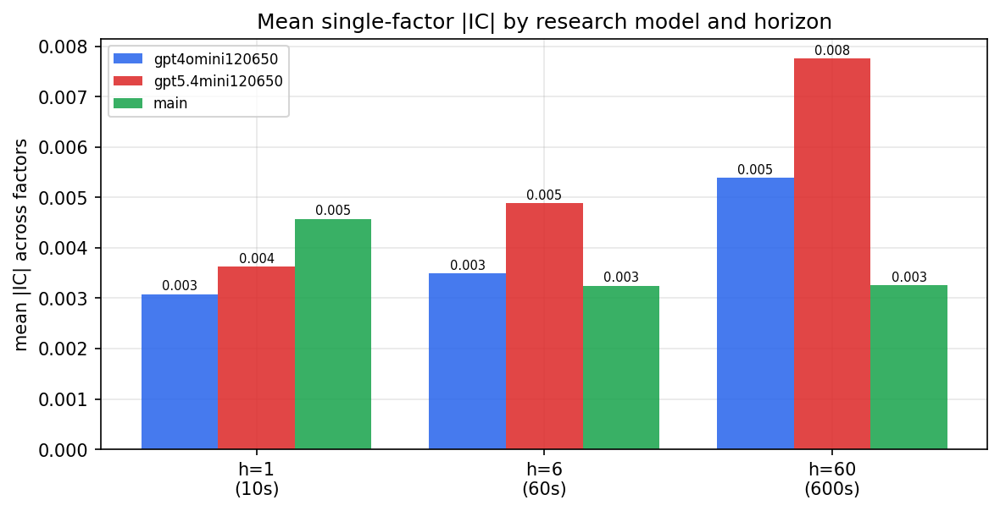

*Mean |IC| by research model and horizon*

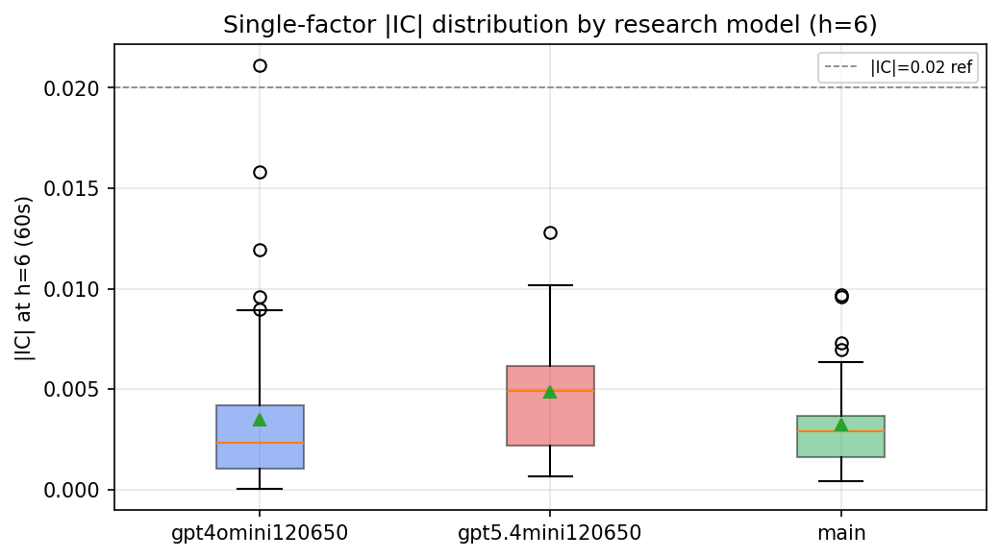

*Per-factor |IC| distribution by research model*

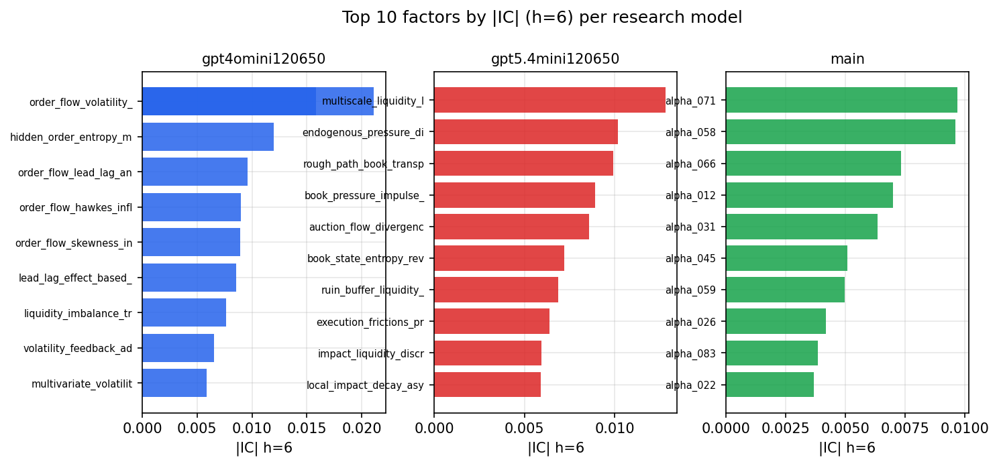

*Top factors by |IC| per research model*

## 2. Factor diversity & redundancy

Pairwise correlation of each zoo's *signals*. `eff_n_factors` is the effective number of independent factors (participation ratio of the correlation eigenvalues); `eff_ratio` and `redundancy` summarise how much unique information the zoo holds vs. how much is duplicated; `n_clusters` groups factors at |corr| ≥ 0.7.

| prerun | n_factors | eff_n_factors | eff_ratio | mean_abs_corr | n_clusters | redundancy |
| --- | --- | --- | --- | --- | --- | --- |
| gpt4omini120650 | 66 | 25.7781 | 0.3906 | 0.0527 | 51 | 0.6094 |
| gpt5.4mini120650 | 69 | 46.1665 | 0.6691 | 0.015 | 62 | 0.3309 |
| main | 78 | 42.5556 | 0.5456 | 0.0296 | 71 | 0.4544 |

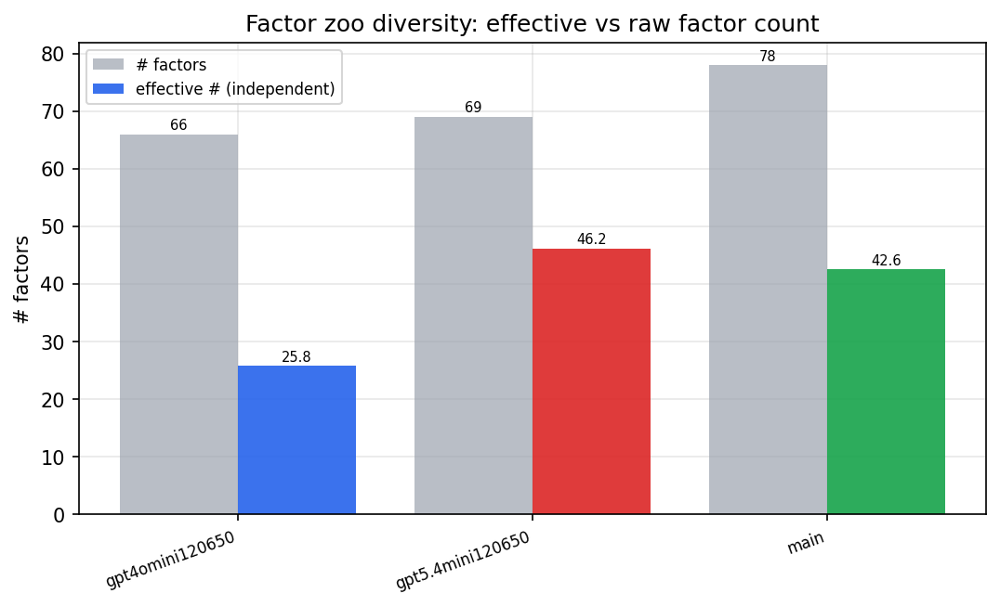

*Effective vs raw factor count per research model*

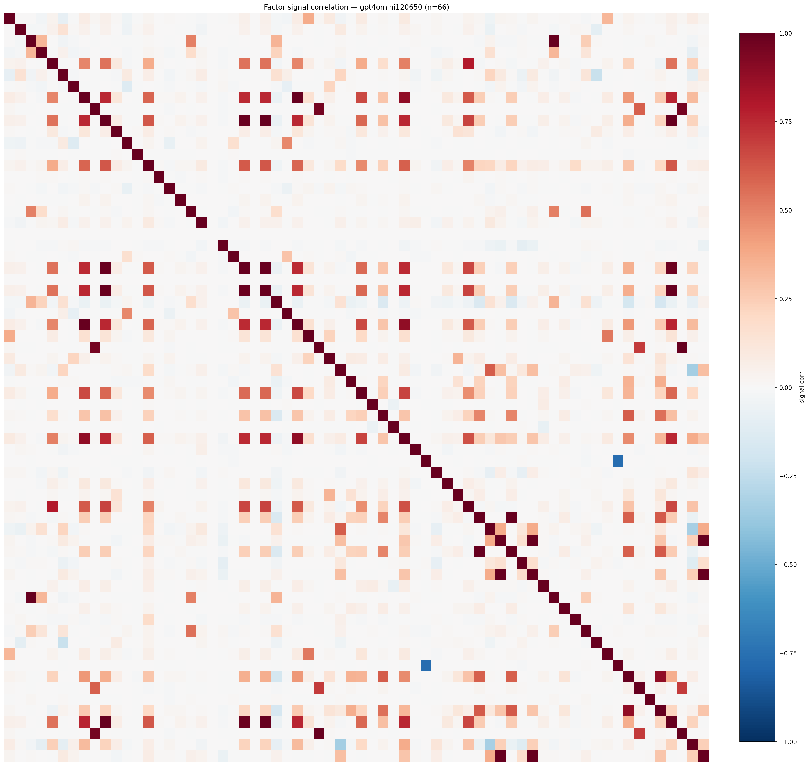

*Signal correlation matrix — gpt4omini120650*

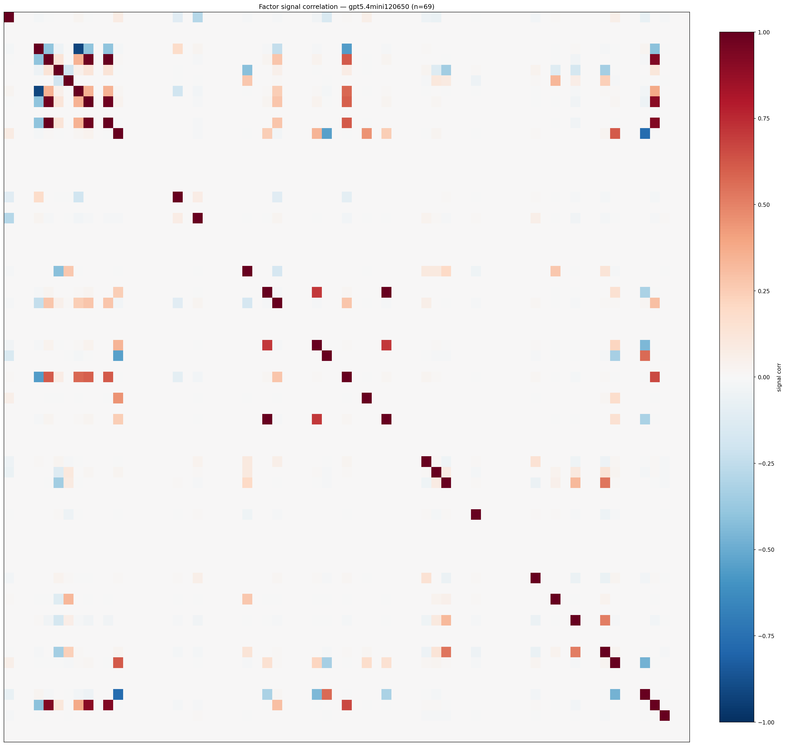

*Signal correlation matrix — gpt5.4mini120650*

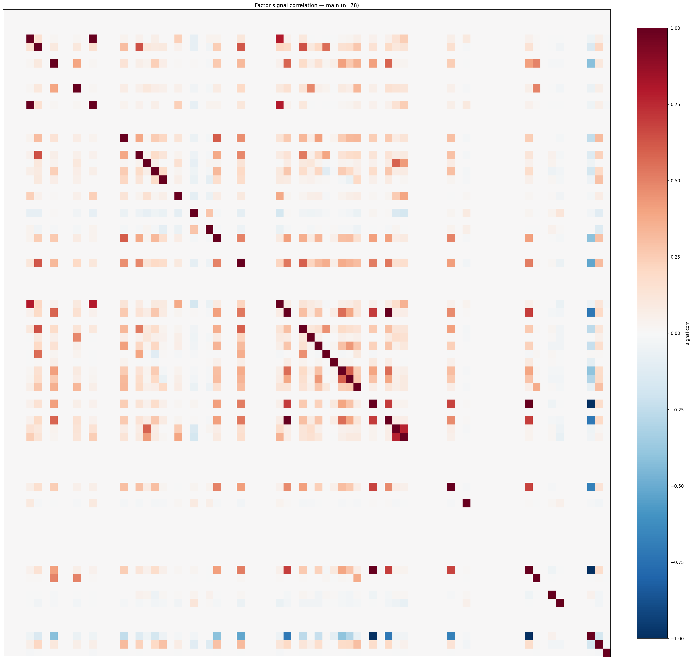

*Signal correlation matrix — main*

## 3. Deflation & model-based importance

`deflated_best_ic` haircuts each zoo's best |IC| for the number of factors tried (`ic_n_tested`) — a bigger zoo's best factor is more likely to be lucky. `lasso_n_nonzero` / `lasso_sparsity` show how many factors a sparse linear model actually keeps (model-view redundancy).

| prerun | best_ic | deflated_best_ic | deflated_best_t | ic_n_tested | ic_n_obs | lasso_n_nonzero | lasso_sparsity |
| --- | --- | --- | --- | --- | --- | --- | --- |
| gpt4omini120650 | 0.0211 | 0.0134 | 5.0214 | 64 | 140399 | 0 | 1.0 |
| gpt5.4mini120650 | 0.0128 | 0.0058 | 2.1823 | 31 | 140399 | 13 | 0.8116 |
| main | 0.0097 | 0.0025 | 0.9324 | 38 | 140399 | 0 | 1.0 |

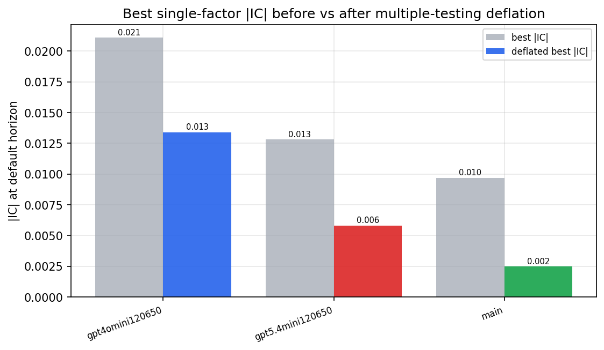

*Best |IC| before vs after multiple-testing deflation*

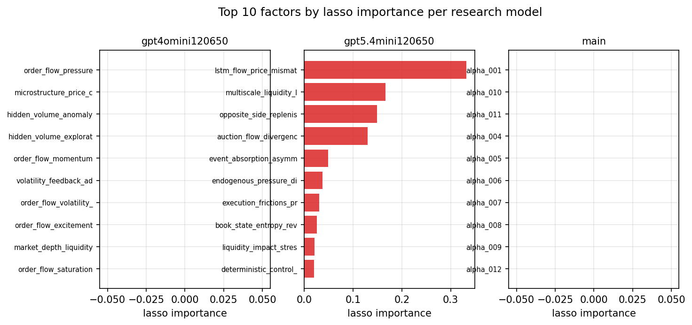

*Top factors by lasso importance per zoo*

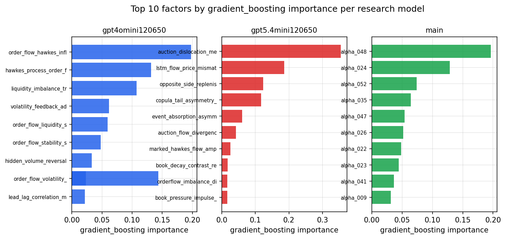

*Top factors by gradient_boosting importance per zoo*

## 4. ML-combined signal — per-underlying vectorised backtest

Each model combines a prerun's factors into ONE signal (fit `factors → forward return` on IS, predict per (bar, underlying)), then that combined signal is run through a simple vectorised backtest — `position(signal) × the underlying's own forward return` — on the held-out OOS tail (+ an equal-weight ensemble). No cross-sectional ranking.

> Config: position=**threshold** (t=1.0, z-score `expanding`), aggregation=**portfolio**, fit-standardise=**per_underlying**, horizon=6.

| prerun | model | n_factors_used | oos_ic | oos_sharpe | is_sharpe | oos_ann_return | oos_max_drawdown |
| --- | --- | --- | --- | --- | --- | --- | --- |
| gpt4omini120650 | linear_regression | 66 | 0.0153 | -1.1428 | 2.7733 | -0.1677 | -0.0435 |
| gpt4omini120650 | ridge | 66 | 0.0156 | -1.4927 | 2.5948 | -0.217 | -0.0425 |
| gpt4omini120650 | lasso | 66 | nan | nan | nan | nan | nan |
| gpt4omini120650 | elastic_net | 66 | nan | nan | nan | nan | nan |
| gpt4omini120650 | random_forest | 66 | 0.0098 | -4.7297 | 7.3805 | -0.4571 | -0.0517 |
| gpt4omini120650 | gradient_boosting | 66 | 0.0025 | -3.9137 | 9.0507 | -0.3254 | -0.0315 |
| gpt4omini120650 | xgboost | 66 | 0.0051 | -4.8689 | 9.9512 | -0.6054 | -0.0511 |
| gpt4omini120650 | lightgbm | 66 | -0.0053 | -5.6082 | 13.2768 | -0.4793 | -0.0445 |
| gpt4omini120650 | ensemble | 66 | 0.0128 | -3.726 | 11.0112 | -0.5501 | -0.0509 |
| gpt5.4mini120650 | linear_regression | 69 | 0.0026 | -0.3319 | 5.1718 | -0.0278 | -0.0299 |
| gpt5.4mini120650 | ridge | 69 | 0.0029 | 0.1595 | 5.7406 | 0.0133 | -0.0249 |
| gpt5.4mini120650 | lasso | 69 | nan | nan | nan | nan | nan |
| gpt5.4mini120650 | elastic_net | 69 | nan | nan | nan | nan | nan |
| gpt5.4mini120650 | random_forest | 69 | 0.0045 | -3.3911 | 10.6747 | -0.3643 | -0.0399 |
| gpt5.4mini120650 | gradient_boosting | 69 | -0.0046 | 0.6502 | 8.7907 | 0.0481 | -0.0139 |
| gpt5.4mini120650 | xgboost | 69 | 0.0011 | 2.1252 | 9.9847 | 0.1945 | -0.02 |
| gpt5.4mini120650 | lightgbm | 69 | 0.0006 | 2.5297 | 12.4524 | 0.2367 | -0.0185 |
| gpt5.4mini120650 | ensemble | 69 | 0.0072 | 2.4465 | 6.0263 | 0.0634 | -0.0034 |
| main | linear_regression | 78 | -0.0108 | -2.4293 | 6.8472 | -0.1855 | -0.0331 |
| main | ridge | 78 | -0.0123 | -2.6819 | 6.0209 | -0.2236 | -0.0381 |
| main | lasso | 78 | nan | nan | nan | nan | nan |
| main | elastic_net | 78 | nan | nan | nan | nan | nan |
| main | random_forest | 78 | -0.0108 | -3.8752 | 13.6885 | -0.4652 | -0.0498 |
| main | gradient_boosting | 78 | -0.0159 | -4.707 | 10.2565 | -0.1286 | -0.0139 |
| main | xgboost | 78 | -0.0106 | -3.091 | 13.4172 | -0.3367 | -0.0331 |
| main | lightgbm | 78 | -0.0209 | -5.0811 | 19.1111 | -0.5543 | -0.0489 |
| main | ensemble | 78 | -0.0131 | 1.9685 | 7.7962 | 0.0164 | -0.0021 |

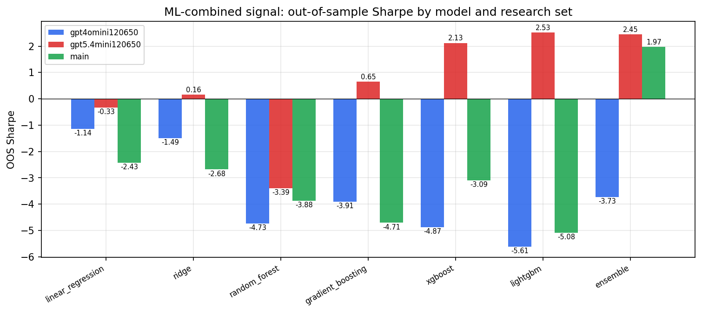

*ML-combined OOS Sharpe by model and research set*

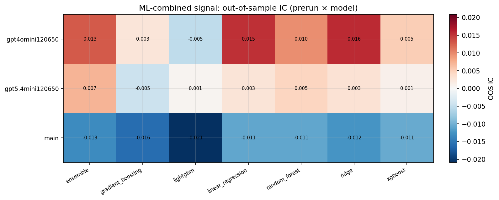

*ML-combined OOS IC (prerun × model)*

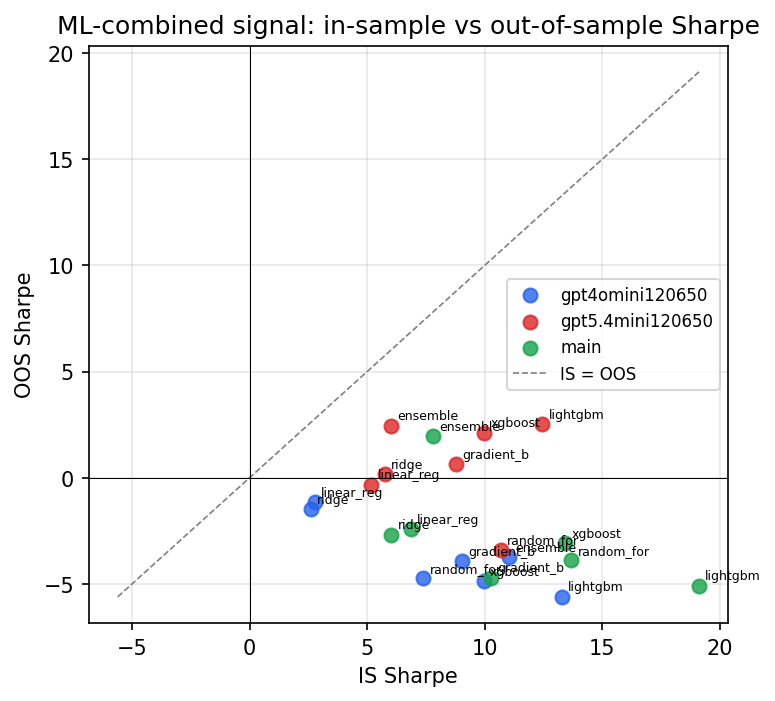

*IS vs OOS Sharpe (overfitting diagnostic)*

---
*Generated by `run_model_comparison.py`. Tables: `*.csv`; interactive: `comparison.ipynb`.*
