# Research-LLM factor comparison — `2025-04`

Comparing the **factor output of different research LLMs** on three axes (raw factor quality → factors as ML features → factors through the full agentic fund). The panel, IS/OOS split, horizon and model hyper-parameters are held identical across preruns — the *only* variable is the factor set.

## Preruns compared

| prerun | research_model | usable_factors | dropped_factors |
| --- | --- | --- | --- |
| gpt4omini120650 | gpt-4o-mini | 66 | 0 |
| gpt5.4mini120650 | gpt-5.4-mini | 69 | 0 |
| main | seed library | 78 | 10 |

> Dropped factors declare fields the current data doesn't have yet (e.g. fundamentals); they light up unchanged once that data is downloaded.

*Usable vs awaiting-data factors per research model*

## Key findings

- **Best ML-combined OOS Sharpe:** `gpt4omini120650` with `lightgbm` (OOS Sharpe = 4.769).
- **Mean OOS Sharpe across models, by research set:** `gpt5.4mini120650` = 1.970, `gpt4omini120650` = -0.192, `main` = -0.583.
- **Highest mean single-factor |IC| (h=6):** `gpt4omini120650` (mean |IC| = 0.0066).
- **Most diverse zoo (highest effective/raw factor ratio):** `gpt5.4mini120650` (eff 45.8 of 69, ratio 0.66).
- **Best selection-deflated single-factor |IC|:** `main` (deflated |IC| = 0.0131 from 38 factors tried).

## 1. Single-factor IC (raw factor quality)

Per-underlying time-series Spearman rank-IC of every researched factor, recomputed on the shared panel at horizons h=1, h=6, h=60. The per-underlying IC correlates each factor's value vector with the underlying's own forward-return vector (pooled across underlyings); the cross-sectional IC ranks across underlyings per timestamp.

| prerun | n_factors | mean_abs_ic_1 | mean_abs_ic_6 | mean_abs_ic_60 | mean_abs_icir_6 | best_factor_h6 | best_abs_ic_h6 |
| --- | --- | --- | --- | --- | --- | --- | --- |
| gpt4omini120650 | 66 | 0.0033 | 0.0066 | 0.0083 | 0.3959 | order_flow_drift_indicator | 0.0155 |
| gpt5.4mini120650 | 69 | 0.0024 | 0.0048 | 0.0079 | 0.284 | auction_flow_divergence_reversion | 0.0116 |
| main | 78 | 0.0037 | 0.0048 | 0.0036 | 0.2964 | alpha_066 | 0.0202 |

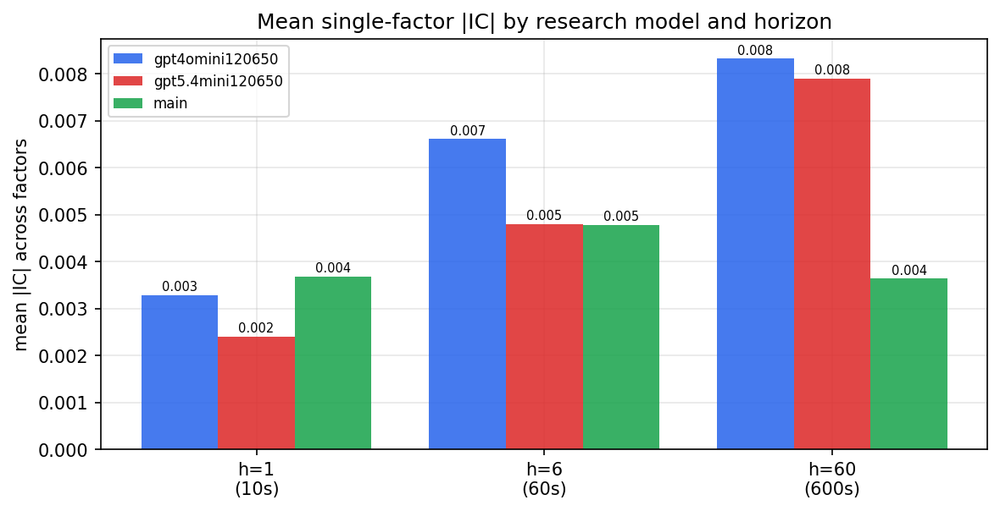

*Mean |IC| by research model and horizon*

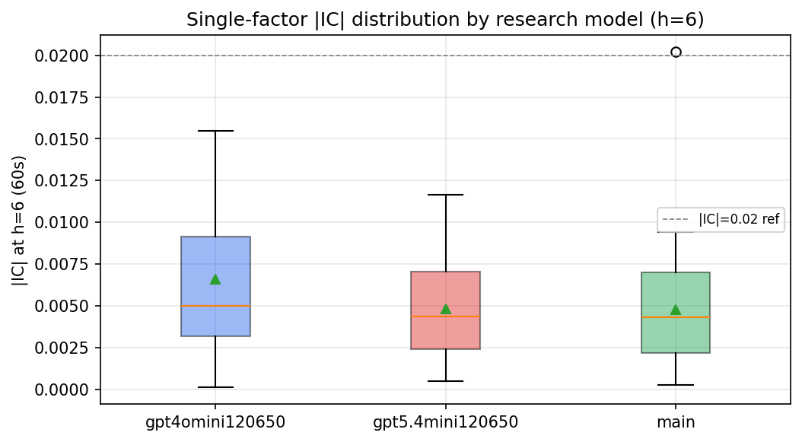

*Per-factor |IC| distribution by research model*

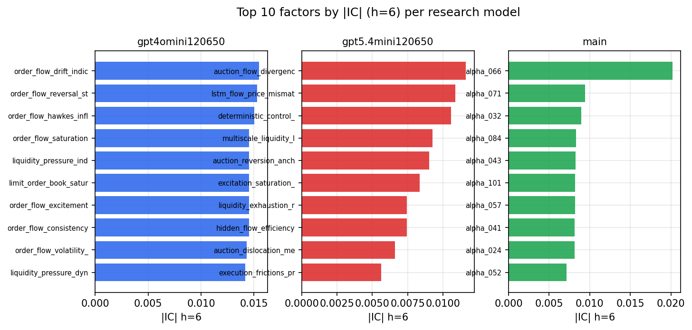

*Top factors by |IC| per research model*

## 2. Factor diversity & redundancy

Pairwise correlation of each zoo's *signals*. `eff_n_factors` is the effective number of independent factors (participation ratio of the correlation eigenvalues); `eff_ratio` and `redundancy` summarise how much unique information the zoo holds vs. how much is duplicated; `n_clusters` groups factors at |corr| ≥ 0.7.

| prerun | n_factors | eff_n_factors | eff_ratio | mean_abs_corr | n_clusters | redundancy |
| --- | --- | --- | --- | --- | --- | --- |
| gpt4omini120650 | 66 | 27.9594 | 0.4236 | 0.0489 | 54 | 0.5764 |
| gpt5.4mini120650 | 69 | 45.8075 | 0.6639 | 0.015 | 61 | 0.3361 |
| main | 78 | 43.063 | 0.5521 | 0.0291 | 72 | 0.4479 |

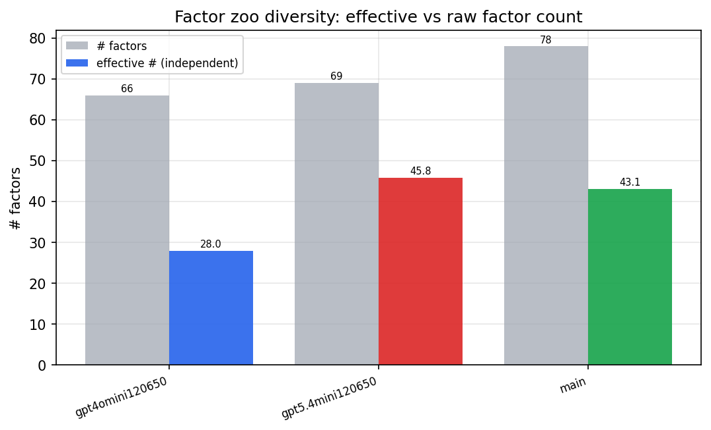

*Effective vs raw factor count per research model*

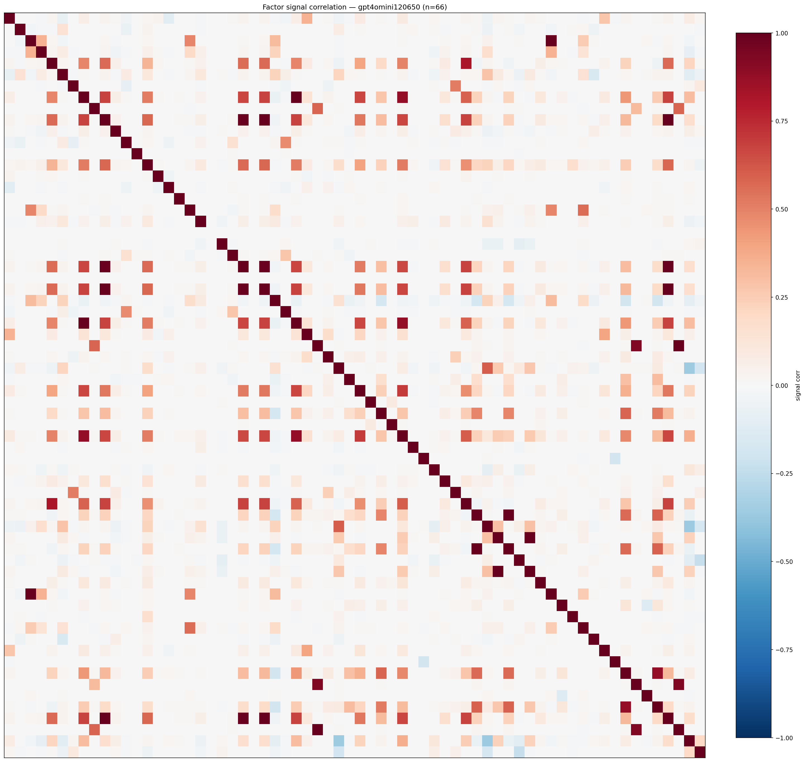

*Signal correlation matrix — gpt4omini120650*

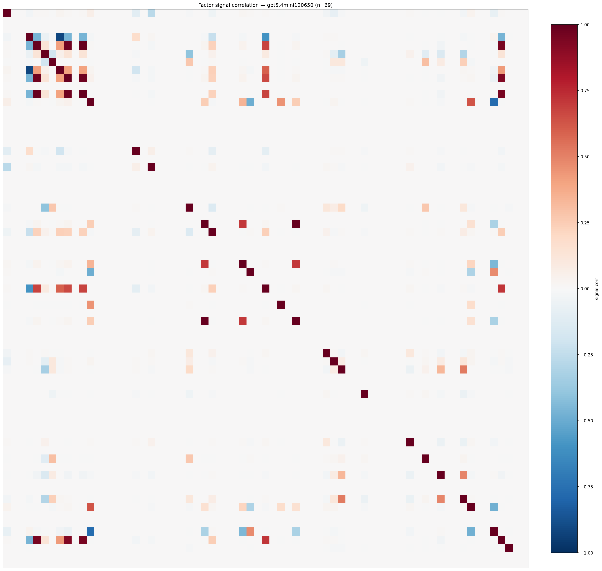

*Signal correlation matrix — gpt5.4mini120650*

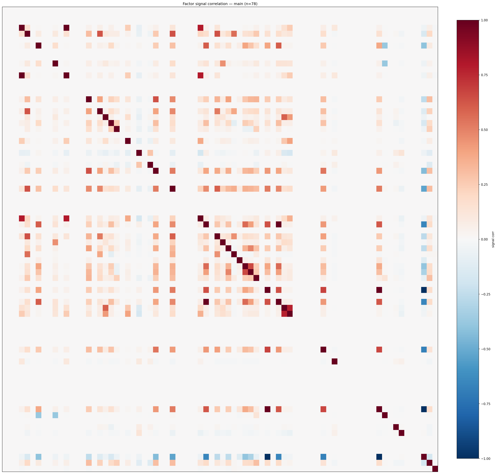

*Signal correlation matrix — main*

## 3. Deflation & model-based importance

`deflated_best_ic` haircuts each zoo's best |IC| for the number of factors tried (`ic_n_tested`) — a bigger zoo's best factor is more likely to be lucky. `lasso_n_nonzero` / `lasso_sparsity` show how many factors a sparse linear model actually keeps (model-view redundancy).

| prerun | best_ic | deflated_best_ic | deflated_best_t | ic_n_tested | ic_n_obs | lasso_n_nonzero | lasso_sparsity |
| --- | --- | --- | --- | --- | --- | --- | --- |
| gpt4omini120650 | 0.0155 | 0.0079 | 2.9682 | 64 | 142739 | 0 | 1.0 |
| gpt5.4mini120650 | 0.0116 | 0.0047 | 1.7762 | 31 | 142739 | 0 | 1.0 |
| main | 0.0202 | 0.0131 | 4.9332 | 38 | 142739 | 0 | 1.0 |

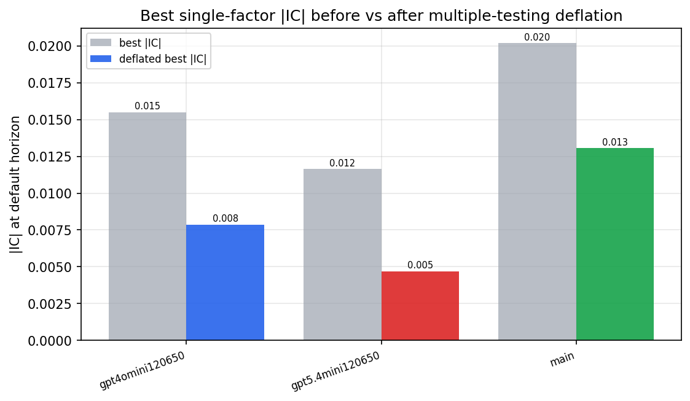

*Best |IC| before vs after multiple-testing deflation*

*Top factors by lasso importance per zoo*

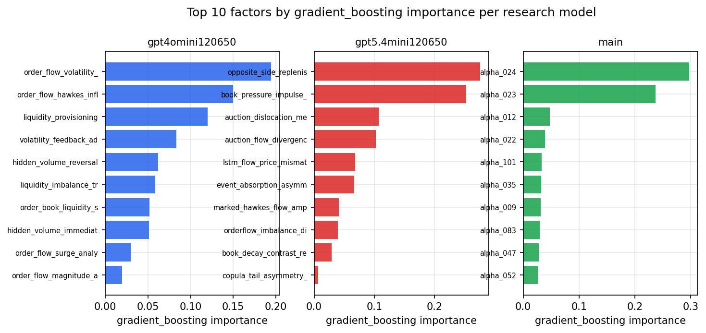

*Top factors by gradient_boosting importance per zoo*

## 4. ML-combined signal — per-underlying vectorised backtest

Each model combines a prerun's factors into ONE signal (fit `factors → forward return` on IS, predict per (bar, underlying)), then that combined signal is run through a simple vectorised backtest — `position(signal) × the underlying's own forward return` — on the held-out OOS tail (+ an equal-weight ensemble). No cross-sectional ranking.

> Config: position=**threshold** (t=1.0, z-score `expanding`), aggregation=**portfolio**, fit-standardise=**per_underlying**, horizon=6.

| prerun | model | n_factors_used | oos_ic | oos_sharpe | is_sharpe | oos_ann_return | oos_max_drawdown |
| --- | --- | --- | --- | --- | --- | --- | --- |
| gpt4omini120650 | linear_regression | 66 | 0.0005 | -0.2981 | 5.166 | -0.093 | -0.1619 |
| gpt4omini120650 | ridge | 66 | -0.0007 | -0.4304 | 5.0192 | -0.1354 | -0.1648 |
| gpt4omini120650 | lasso | 66 | -0.0153 | -3.7658 | 1.6145 | -1.1154 | -0.1665 |
| gpt4omini120650 | elastic_net | 66 | -0.0152 | -3.709 | 1.6074 | -1.0989 | -0.1653 |
| gpt4omini120650 | random_forest | 66 | -0.0061 | -1.1757 | 11.1307 | -0.3287 | -0.0877 |
| gpt4omini120650 | gradient_boosting | 66 | 0.0124 | 0.2682 | 8.791 | 0.0537 | -0.0719 |
| gpt4omini120650 | xgboost | 66 | -0.0003 | 3.0552 | 15.7335 | 0.7407 | -0.0589 |
| gpt4omini120650 | lightgbm | 66 | -0.0011 | 4.7685 | 27.2902 | 1.3652 | -0.053 |
| gpt4omini120650 | ensemble | 66 | -0.0065 | -0.4402 | 12.5111 | -0.1336 | -0.1382 |
| gpt5.4mini120650 | linear_regression | 69 | -0.0151 | 0.0501 | 4.4879 | 0.0157 | -0.1424 |
| gpt5.4mini120650 | ridge | 69 | -0.0161 | -0.3971 | 4.6493 | -0.1237 | -0.151 |
| gpt5.4mini120650 | lasso | 69 | nan | nan | nan | nan | nan |
| gpt5.4mini120650 | elastic_net | 69 | nan | nan | nan | nan | nan |
| gpt5.4mini120650 | random_forest | 69 | -0.013 | 3.3132 | 10.161 | 0.8873 | -0.0493 |
| gpt5.4mini120650 | gradient_boosting | 69 | 0.0036 | 0.8856 | 7.954 | 0.0878 | -0.0262 |
| gpt5.4mini120650 | xgboost | 69 | -0.0133 | 4.1083 | 15.0616 | 0.8776 | -0.0321 |
| gpt5.4mini120650 | lightgbm | 69 | -0.0068 | 3.1058 | 21.5935 | 0.7105 | -0.0451 |
| gpt5.4mini120650 | ensemble | 69 | -0.0127 | 2.7234 | 8.5611 | 0.4439 | -0.0462 |
| main | linear_regression | 78 | -0.0007 | 1.2007 | 7.8492 | 0.0606 | -0.0104 |
| main | ridge | 78 | 0.0044 | 1.8853 | 7.5953 | 0.095 | -0.0092 |
| main | lasso | 78 | nan | nan | nan | nan | nan |
| main | elastic_net | 78 | nan | nan | nan | nan | nan |
| main | random_forest | 78 | -0.0056 | -1.2969 | 16.6157 | -0.2756 | -0.0945 |
| main | gradient_boosting | 78 | -0.0066 | -2.1419 | 15.1886 | -0.4137 | -0.058 |
| main | xgboost | 78 | -0.0052 | -0.2868 | 22.1226 | -0.0603 | -0.0537 |
| main | lightgbm | 78 | 0.0008 | -1.1197 | 29.9548 | -0.2104 | -0.064 |
| main | ensemble | 78 | -0.0048 | -2.3249 | 14.0073 | -0.2613 | -0.0535 |

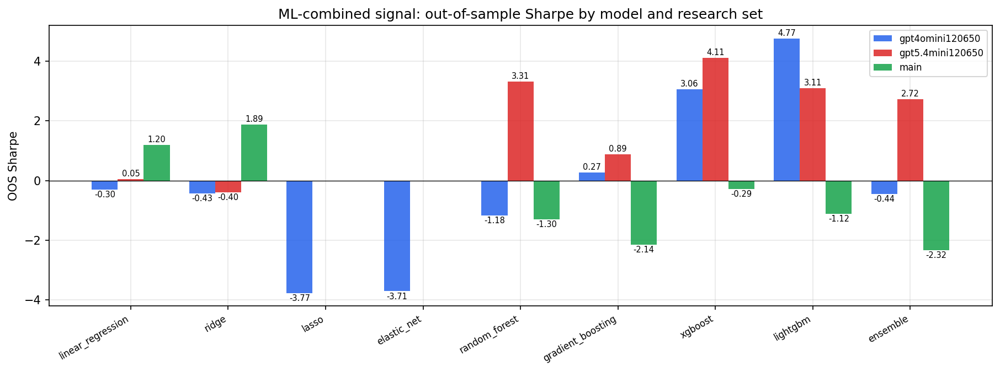

*ML-combined OOS Sharpe by model and research set*

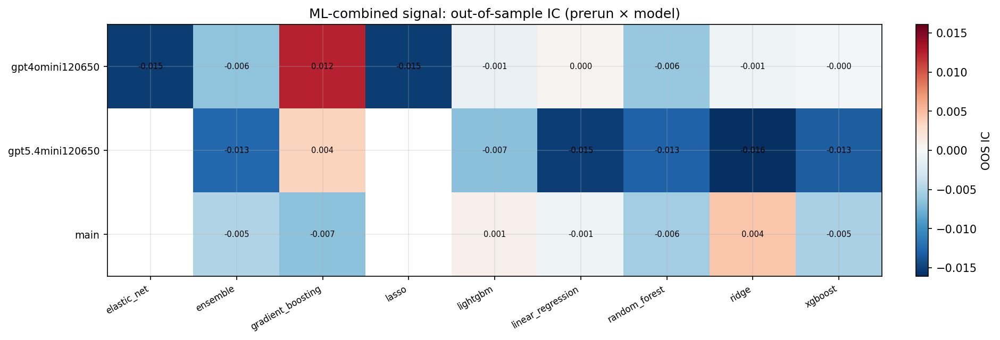

*ML-combined OOS IC (prerun × model)*

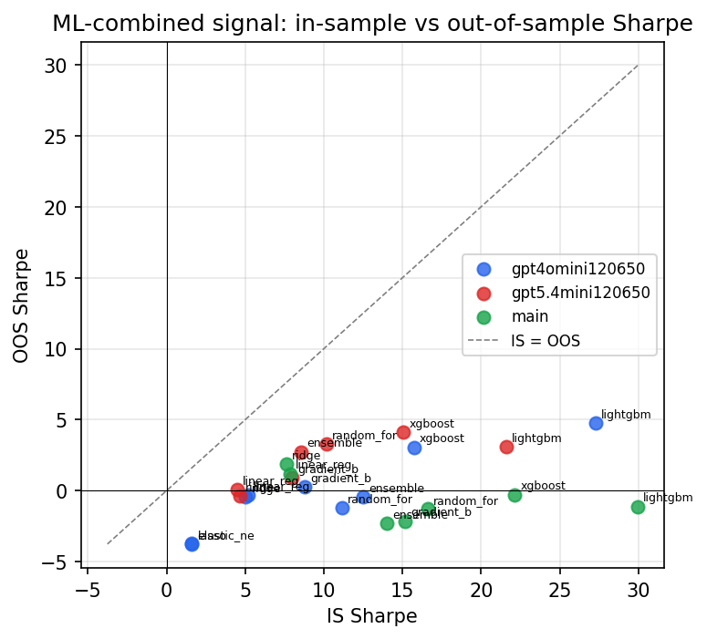

*IS vs OOS Sharpe (overfitting diagnostic)*

---
*Generated by `run_model_comparison.py`. Tables: `*.csv`; interactive: `comparison.ipynb`.*
