# Research-LLM factor comparison — `2025-06`

Comparing the **factor output of different research LLMs** on three axes (raw factor quality → factors as ML features → factors through the full agentic fund). The panel, IS/OOS split, horizon and model hyper-parameters are held identical across preruns — the *only* variable is the factor set.

## Preruns compared

| prerun | research_model | usable_factors | dropped_factors |
| --- | --- | --- | --- |
| gpt4omini120650 | gpt-4o-mini | 66 | 0 |
| gpt5.4mini120650 | gpt-5.4-mini | 69 | 0 |
| main | seed library | 78 | 10 |

> Dropped factors declare fields the current data doesn't have yet (e.g. fundamentals); they light up unchanged once that data is downloaded.

*Usable vs awaiting-data factors per research model*

## Key findings

- **Best ML-combined OOS Sharpe:** `main` with `xgboost` (OOS Sharpe = 4.108).
- **Mean OOS Sharpe across models, by research set:** `main` = -2.186, `gpt4omini120650` = -2.771, `gpt5.4mini120650` = -7.333.
- **Highest mean single-factor |IC| (h=6):** `gpt4omini120650` (mean |IC| = 0.0094).
- **Most diverse zoo (highest effective/raw factor ratio):** `gpt5.4mini120650` (eff 40.9 of 69, ratio 0.59).
- **Best selection-deflated single-factor |IC|:** `gpt5.4mini120650` (deflated |IC| = 0.0168 from 31 factors tried).

## 1. Single-factor IC (raw factor quality)

Per-underlying time-series Spearman rank-IC of every researched factor, recomputed on the shared panel at horizons h=1, h=6, h=60. The per-underlying IC correlates each factor's value vector with the underlying's own forward-return vector (pooled across underlyings); the cross-sectional IC ranks across underlyings per timestamp.

| prerun | n_factors | mean_abs_ic_1 | mean_abs_ic_6 | mean_abs_ic_60 | mean_abs_icir_6 | best_factor_h6 | best_abs_ic_h6 |
| --- | --- | --- | --- | --- | --- | --- | --- |
| gpt4omini120650 | 66 | 0.0059 | 0.0094 | 0.0114 | 0.5765 | order_flow_excitement | 0.0206 |
| gpt5.4mini120650 | 69 | 0.0036 | 0.0064 | 0.0064 | 0.5245 | lstm_flow_price_mismatch | 0.0237 |
| main | 78 | 0.0064 | 0.0072 | 0.0043 | 0.5539 | alpha_066 | 0.0165 |

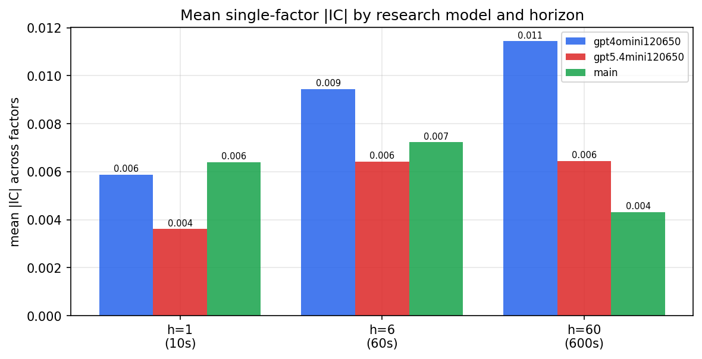

*Mean |IC| by research model and horizon*

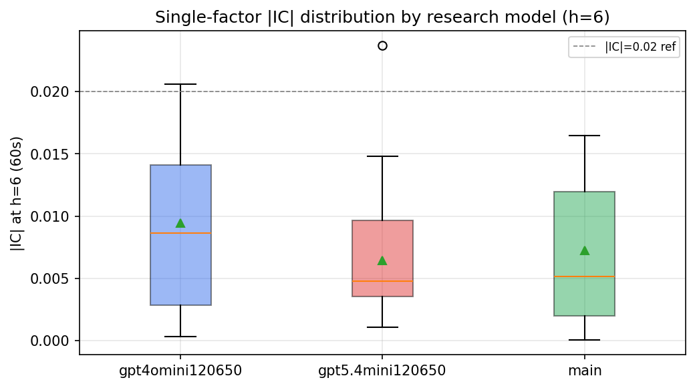

*Per-factor |IC| distribution by research model*

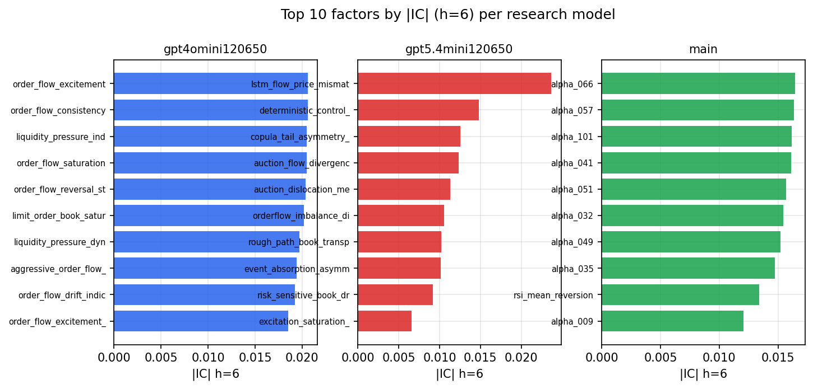

*Top factors by |IC| per research model*

## 2. Factor diversity & redundancy

Pairwise correlation of each zoo's *signals*. `eff_n_factors` is the effective number of independent factors (participation ratio of the correlation eigenvalues); `eff_ratio` and `redundancy` summarise how much unique information the zoo holds vs. how much is duplicated; `n_clusters` groups factors at |corr| ≥ 0.7.

| prerun | n_factors | eff_n_factors | eff_ratio | mean_abs_corr | n_clusters | redundancy |
| --- | --- | --- | --- | --- | --- | --- |
| gpt4omini120650 | 66 | 28.4828 | 0.4316 | 0.0492 | 52 | 0.5684 |
| gpt5.4mini120650 | 69 | 40.8528 | 0.5921 | 0.0173 | 60 | 0.4079 |
| main | 78 | 44.4193 | 0.5695 | 0.0275 | 72 | 0.4305 |

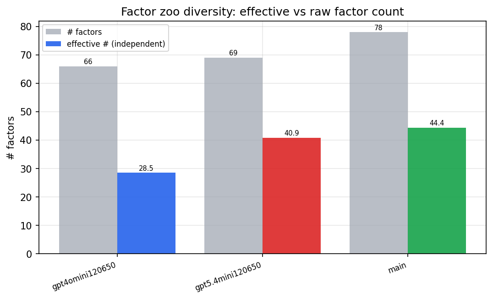

*Effective vs raw factor count per research model*

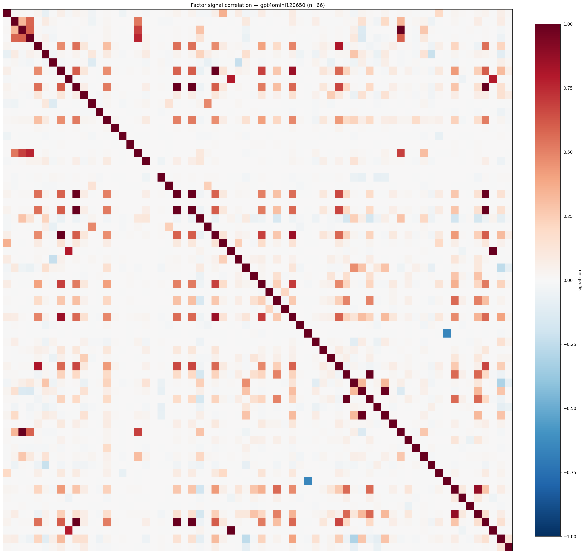

*Signal correlation matrix — gpt4omini120650*

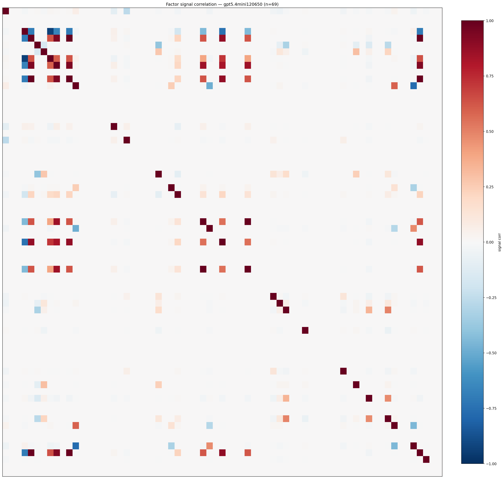

*Signal correlation matrix — gpt5.4mini120650*

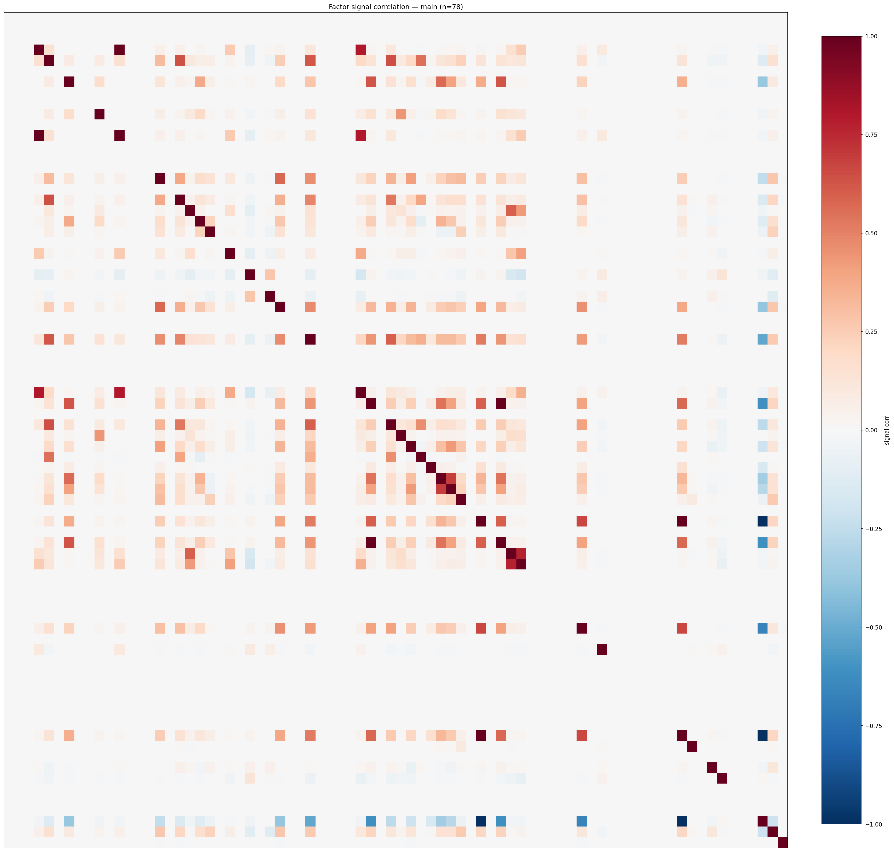

*Signal correlation matrix — main*

## 3. Deflation & model-based importance

`deflated_best_ic` haircuts each zoo's best |IC| for the number of factors tried (`ic_n_tested`) — a bigger zoo's best factor is more likely to be lucky. `lasso_n_nonzero` / `lasso_sparsity` show how many factors a sparse linear model actually keeps (model-view redundancy).

| prerun | best_ic | deflated_best_ic | deflated_best_t | ic_n_tested | ic_n_obs | lasso_n_nonzero | lasso_sparsity |
| --- | --- | --- | --- | --- | --- | --- | --- |
| gpt4omini120650 | 0.0206 | 0.0129 | 4.8882 | 64 | 142738 | 0 | 1.0 |
| gpt5.4mini120650 | 0.0237 | 0.0168 | 6.3286 | 31 | 142738 | 0 | 1.0 |
| main | 0.0165 | 0.0093 | 3.5218 | 38 | 142738 | 0 | 1.0 |

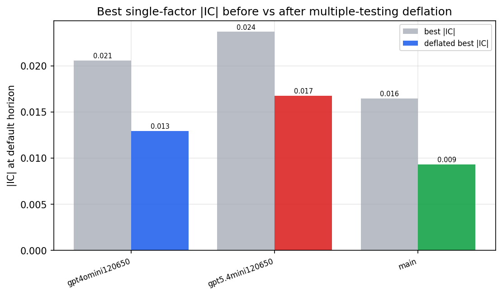

*Best |IC| before vs after multiple-testing deflation*

*Top factors by lasso importance per zoo*

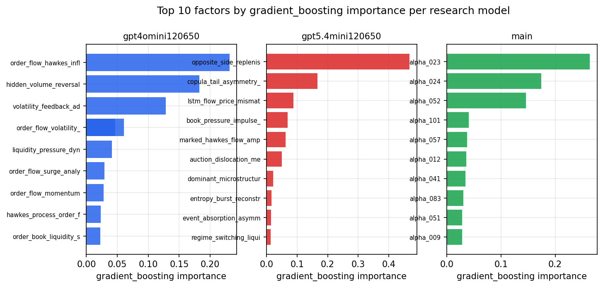

*Top factors by gradient_boosting importance per zoo*

## 4. ML-combined signal — per-underlying vectorised backtest

Each model combines a prerun's factors into ONE signal (fit `factors → forward return` on IS, predict per (bar, underlying)), then that combined signal is run through a simple vectorised backtest — `position(signal) × the underlying's own forward return` — on the held-out OOS tail (+ an equal-weight ensemble). No cross-sectional ranking.

> Config: position=**threshold** (t=1.0, z-score `expanding`), aggregation=**portfolio**, fit-standardise=**per_underlying**, horizon=6.

| prerun | model | n_factors_used | oos_ic | oos_sharpe | is_sharpe | oos_ann_return | oos_max_drawdown |
| --- | --- | --- | --- | --- | --- | --- | --- |
| gpt4omini120650 | linear_regression | 66 | -0.0092 | -4.4909 | 4.3157 | -0.2518 | -0.0263 |
| gpt4omini120650 | ridge | 66 | -0.0109 | -6.4021 | 5.0537 | -0.3765 | -0.0338 |
| gpt4omini120650 | lasso | 66 | nan | nan | nan | nan | nan |
| gpt4omini120650 | elastic_net | 66 | nan | nan | nan | nan | nan |
| gpt4omini120650 | random_forest | 66 | 0.0074 | -2.911 | 11.0059 | -0.1366 | -0.0227 |
| gpt4omini120650 | gradient_boosting | 66 | -0.0093 | -0.5254 | 10.7522 | -0.01 | -0.0091 |
| gpt4omini120650 | xgboost | 66 | 0.0001 | -1.6005 | 13.9603 | -0.058 | -0.0097 |
| gpt4omini120650 | lightgbm | 66 | 0.0067 | -1.9131 | 18.7801 | -0.0826 | -0.0134 |
| gpt4omini120650 | ensemble | 66 | -0.006 | -1.5518 | 14.6549 | -0.0494 | -0.0099 |
| gpt5.4mini120650 | linear_regression | 69 | 0.0017 | -6.1401 | 7.0949 | -0.2785 | -0.0234 |
| gpt5.4mini120650 | ridge | 69 | 0.0026 | -5.6865 | 7.3206 | -0.2523 | -0.0217 |
| gpt5.4mini120650 | lasso | 69 | nan | nan | nan | nan | nan |
| gpt5.4mini120650 | elastic_net | 69 | nan | nan | nan | nan | nan |
| gpt5.4mini120650 | random_forest | 69 | 0.0086 | -8.601 | 7.2519 | -0.4486 | -0.0366 |
| gpt5.4mini120650 | gradient_boosting | 69 | -0.018 | -7.625 | 9.3959 | -0.2743 | -0.0225 |
| gpt5.4mini120650 | xgboost | 69 | 0.0138 | -9.1589 | 12.3773 | -0.2994 | -0.0241 |
| gpt5.4mini120650 | lightgbm | 69 | 0.0134 | -4.9867 | 18.2646 | -0.1894 | -0.0163 |
| gpt5.4mini120650 | ensemble | 69 | 0.0021 | -9.1328 | 14.3335 | -0.4574 | -0.037 |
| main | linear_regression | 78 | -0.0 | -10.1685 | 11.5845 | -0.1037 | -0.0087 |
| main | ridge | 78 | 0.0017 | -6.6351 | 10.413 | -0.0763 | -0.0065 |
| main | lasso | 78 | nan | nan | nan | nan | nan |
| main | elastic_net | 78 | nan | nan | nan | nan | nan |
| main | random_forest | 78 | 0.002 | 3.0596 | 13.5039 | 0.0447 | -0.0048 |
| main | gradient_boosting | 78 | -0.0037 | 3.2142 | 16.8433 | 0.0128 | -0.0011 |
| main | xgboost | 78 | 0.0077 | 4.1084 | 19.2981 | 0.0382 | -0.0022 |
| main | lightgbm | 78 | -0.0005 | -5.3117 | 23.1789 | -0.042 | -0.0049 |
| main | ensemble | 78 | 0.002 | -3.5685 | 20.0005 | -0.012 | -0.0018 |

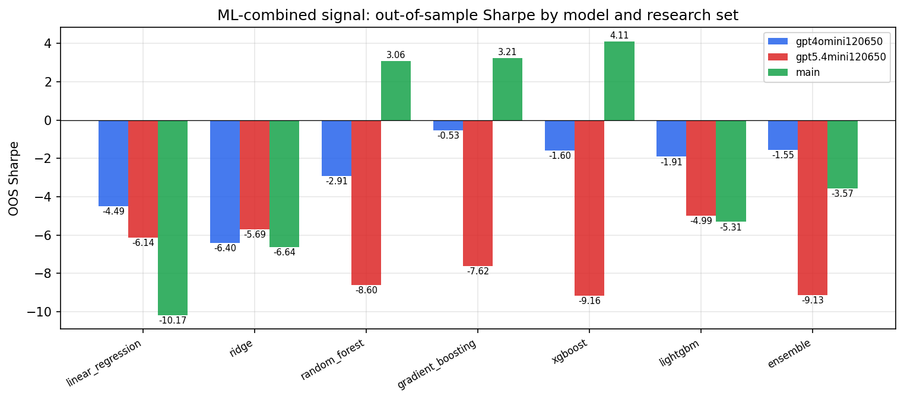

*ML-combined OOS Sharpe by model and research set*

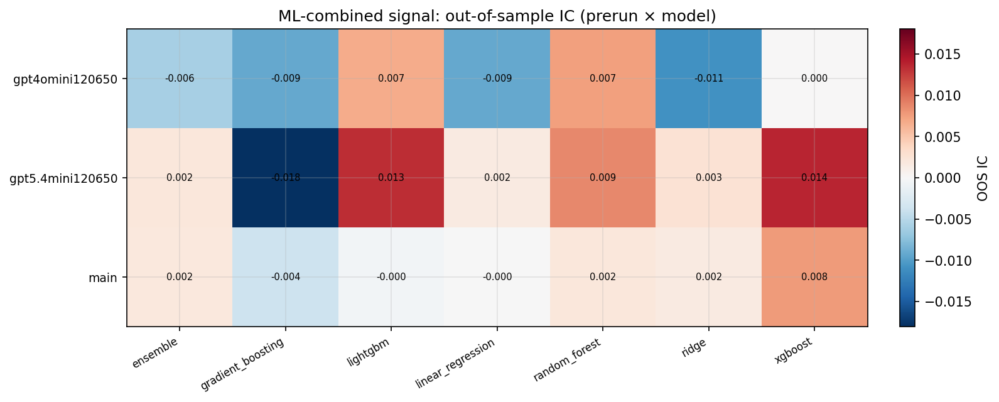

*ML-combined OOS IC (prerun × model)*

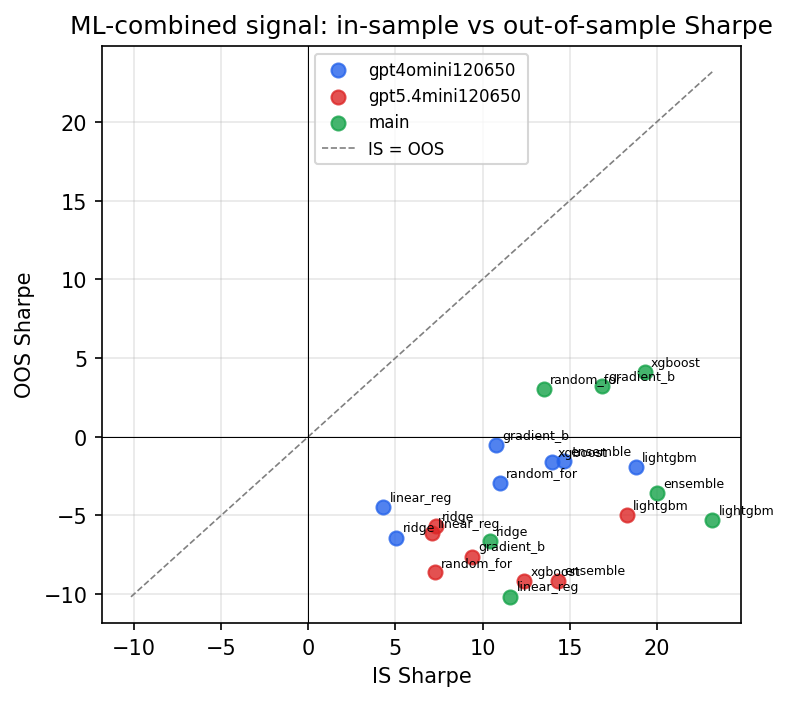

*IS vs OOS Sharpe (overfitting diagnostic)*

---
*Generated by `run_model_comparison.py`. Tables: `*.csv`; interactive: `comparison.ipynb`.*
