# Research-LLM factor comparison — `2025-07`

Comparing the **factor output of different research LLMs** on three axes (raw factor quality → factors as ML features → factors through the full agentic fund). The panel, IS/OOS split, horizon and model hyper-parameters are held identical across preruns — the *only* variable is the factor set.

## Preruns compared

| prerun | research_model | usable_factors | dropped_factors |
| --- | --- | --- | --- |
| gpt4omini120650 | gpt-4o-mini | 66 | 0 |
| gpt5.4mini120650 | gpt-5.4-mini | 69 | 0 |
| main | seed library | 78 | 10 |

> Dropped factors declare fields the current data doesn't have yet (e.g. fundamentals); they light up unchanged once that data is downloaded.

*Usable vs awaiting-data factors per research model*

## Key findings

- **Best ML-combined OOS Sharpe:** `main` with `ensemble` (OOS Sharpe = 8.243).
- **Mean OOS Sharpe across models, by research set:** `main` = 3.670, `gpt4omini120650` = 3.364, `gpt5.4mini120650` = 2.304.
- **Highest mean single-factor |IC| (h=6):** `main` (mean |IC| = 0.0094).
- **Most diverse zoo (highest effective/raw factor ratio):** `gpt5.4mini120650` (eff 40.8 of 69, ratio 0.59).
- **Best selection-deflated single-factor |IC|:** `gpt5.4mini120650` (deflated |IC| = 0.0169 from 24 factors tried).

## 1. Single-factor IC (raw factor quality)

Per-underlying time-series Spearman rank-IC of every researched factor, recomputed on the shared panel at horizons h=1, h=6, h=60. The per-underlying IC correlates each factor's value vector with the underlying's own forward-return vector (pooled across underlyings); the cross-sectional IC ranks across underlyings per timestamp.

| prerun | n_factors | mean_abs_ic_1 | mean_abs_ic_6 | mean_abs_ic_60 | mean_abs_icir_6 | best_factor_h6 | best_abs_ic_h6 |
| --- | --- | --- | --- | --- | --- | --- | --- |
| gpt4omini120650 | 66 | 0.0068 | 0.0088 | 0.0097 | 0.5385 | order_flow_excitement | 0.0189 |
| gpt5.4mini120650 | 69 | 0.0047 | 0.0073 | 0.0073 | 0.5103 | lstm_flow_price_mismatch | 0.0235 |
| main | 78 | 0.0088 | 0.0094 | 0.0052 | 0.6214 | alpha_084 | 0.0227 |

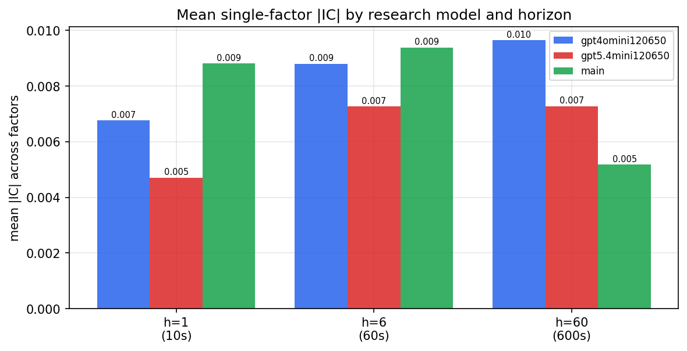

*Mean |IC| by research model and horizon*

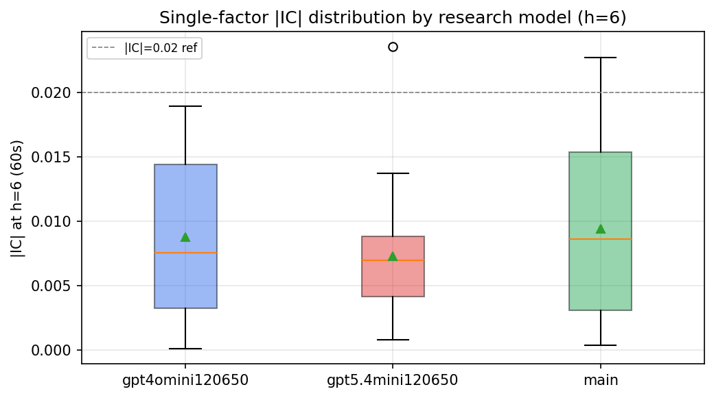

*Per-factor |IC| distribution by research model*

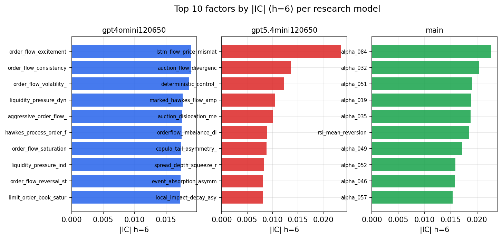

*Top factors by |IC| per research model*

## 2. Factor diversity & redundancy

Pairwise correlation of each zoo's *signals*. `eff_n_factors` is the effective number of independent factors (participation ratio of the correlation eigenvalues); `eff_ratio` and `redundancy` summarise how much unique information the zoo holds vs. how much is duplicated; `n_clusters` groups factors at |corr| ≥ 0.7.

| prerun | n_factors | eff_n_factors | eff_ratio | mean_abs_corr | n_clusters | redundancy |
| --- | --- | --- | --- | --- | --- | --- |
| gpt4omini120650 | 66 | 27.4695 | 0.4162 | 0.05 | 51 | 0.5838 |
| gpt5.4mini120650 | 69 | 40.7799 | 0.591 | 0.0187 | 60 | 0.409 |
| main | 78 | 43.3608 | 0.5559 | 0.0279 | 71 | 0.4441 |

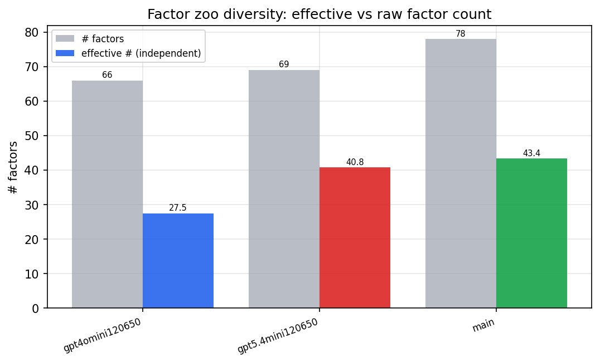

*Effective vs raw factor count per research model*

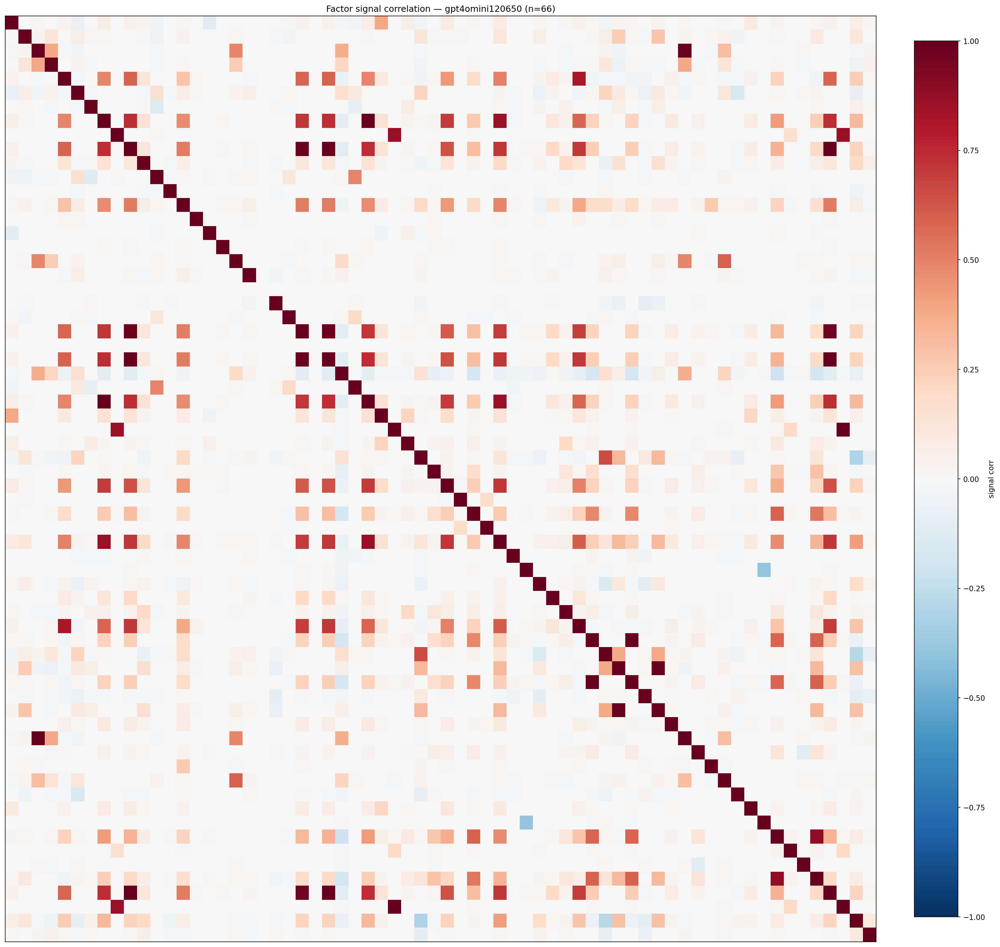

*Signal correlation matrix — gpt4omini120650*

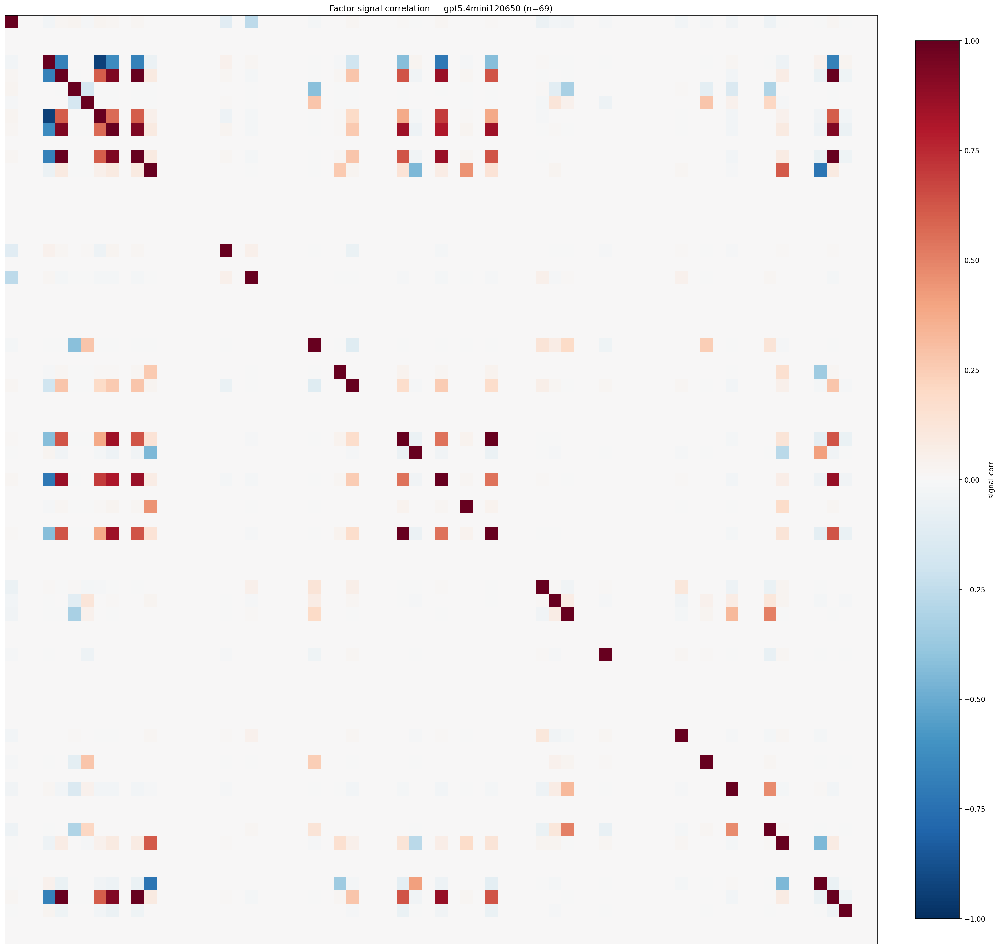

*Signal correlation matrix — gpt5.4mini120650*

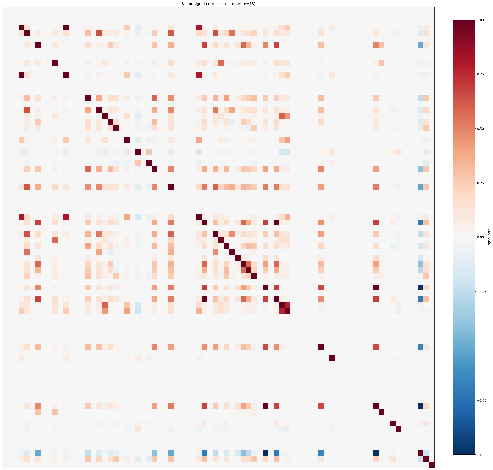

*Signal correlation matrix — main*

## 3. Deflation & model-based importance

`deflated_best_ic` haircuts each zoo's best |IC| for the number of factors tried (`ic_n_tested`) — a bigger zoo's best factor is more likely to be lucky. `lasso_n_nonzero` / `lasso_sparsity` show how many factors a sparse linear model actually keeps (model-view redundancy).

| prerun | best_ic | deflated_best_ic | deflated_best_t | ic_n_tested | ic_n_obs | lasso_n_nonzero | lasso_sparsity |
| --- | --- | --- | --- | --- | --- | --- | --- |
| gpt4omini120650 | 0.0189 | 0.0113 | 4.304 | 64 | 143999 | 0 | 1.0 |
| gpt5.4mini120650 | 0.0235 | 0.0169 | 6.4035 | 24 | 143999 | 5 | 0.9275 |
| main | 0.0227 | 0.0156 | 5.9147 | 38 | 143999 | 6 | 0.9231 |

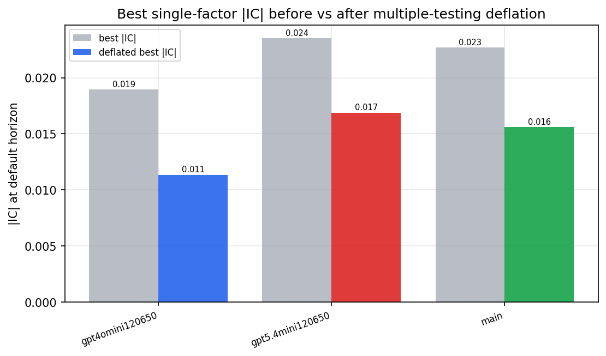

*Best |IC| before vs after multiple-testing deflation*

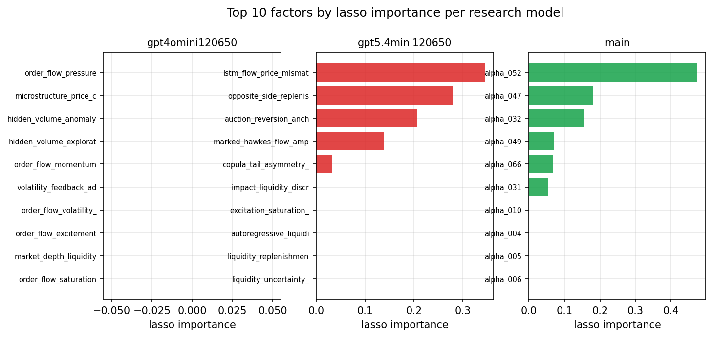

*Top factors by lasso importance per zoo*

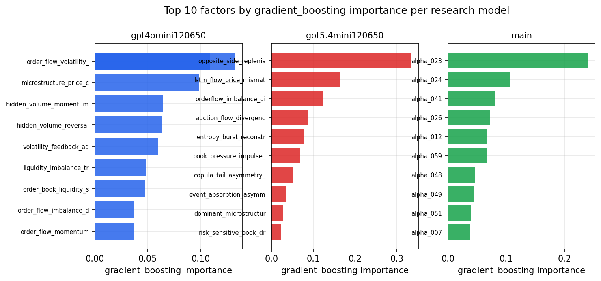

*Top factors by gradient_boosting importance per zoo*

## 4. ML-combined signal — per-underlying vectorised backtest

Each model combines a prerun's factors into ONE signal (fit `factors → forward return` on IS, predict per (bar, underlying)), then that combined signal is run through a simple vectorised backtest — `position(signal) × the underlying's own forward return` — on the held-out OOS tail (+ an equal-weight ensemble). No cross-sectional ranking.

> Config: position=**threshold** (t=1.0, z-score `expanding`), aggregation=**portfolio**, fit-standardise=**per_underlying**, horizon=6.

| prerun | model | n_factors_used | oos_ic | oos_sharpe | is_sharpe | oos_ann_return | oos_max_drawdown |
| --- | --- | --- | --- | --- | --- | --- | --- |
| gpt4omini120650 | linear_regression | 66 | -0.0015 | 3.0552 | 5.5403 | 0.1898 | -0.0094 |
| gpt4omini120650 | ridge | 66 | -0.0003 | 4.0546 | 5.5977 | 0.2536 | -0.0084 |
| gpt4omini120650 | lasso | 66 | nan | nan | nan | nan | nan |
| gpt4omini120650 | elastic_net | 66 | nan | nan | nan | nan | nan |
| gpt4omini120650 | random_forest | 66 | -0.0155 | 5.2395 | 7.6768 | 0.2748 | -0.0075 |
| gpt4omini120650 | gradient_boosting | 66 | 0.0055 | 4.5657 | 8.778 | 0.1088 | -0.0049 |
| gpt4omini120650 | xgboost | 66 | -0.0152 | 2.7925 | 10.5038 | 0.1075 | -0.006 |
| gpt4omini120650 | lightgbm | 66 | 0.0005 | 2.2133 | 12.427 | 0.0924 | -0.0082 |
| gpt4omini120650 | ensemble | 66 | -0.0026 | 1.6268 | 10.5287 | 0.0895 | -0.0095 |
| gpt5.4mini120650 | linear_regression | 69 | 0.0075 | -1.8518 | 5.8181 | -0.0868 | -0.0164 |
| gpt5.4mini120650 | ridge | 69 | 0.0099 | -1.127 | 4.6799 | -0.0527 | -0.0152 |
| gpt5.4mini120650 | lasso | 69 | 0.0175 | -0.4203 | 3.6676 | -0.0246 | -0.0179 |
| gpt5.4mini120650 | elastic_net | 69 | 0.0175 | -0.4203 | 3.6676 | -0.0246 | -0.0179 |
| gpt5.4mini120650 | random_forest | 69 | 0.0185 | 6.1471 | 7.066 | 0.3038 | -0.0047 |
| gpt5.4mini120650 | gradient_boosting | 69 | 0.0063 | 2.7989 | 7.5984 | 0.0554 | -0.0029 |
| gpt5.4mini120650 | xgboost | 69 | 0.0158 | 4.9626 | 9.7522 | 0.1878 | -0.0059 |
| gpt5.4mini120650 | lightgbm | 69 | 0.0168 | 7.7519 | 13.1925 | 0.2947 | -0.0034 |
| gpt5.4mini120650 | ensemble | 69 | 0.0173 | 2.8987 | 9.8438 | 0.1426 | -0.0115 |
| main | linear_regression | 78 | 0.0123 | 6.2269 | 6.8019 | 0.1963 | -0.0047 |
| main | ridge | 78 | 0.0156 | 4.1737 | 6.8634 | 0.1368 | -0.0071 |
| main | lasso | 78 | 0.0167 | 3.3929 | 1.4357 | 0.0897 | -0.0064 |
| main | elastic_net | 78 | 0.0167 | 3.3929 | 1.4357 | 0.0897 | -0.0064 |
| main | random_forest | 78 | 0.0175 | 6.1057 | 9.6108 | 0.1078 | -0.0051 |
| main | gradient_boosting | 78 | 0.0077 | -0.3459 | 12.1098 | -0.0082 | -0.0087 |
| main | xgboost | 78 | 0.0086 | 3.5083 | 14.6684 | 0.0731 | -0.0041 |
| main | lightgbm | 78 | 0.0065 | -1.665 | 15.9934 | -0.0283 | -0.0045 |
| main | ensemble | 78 | 0.0181 | 8.2435 | 11.612 | 0.1458 | -0.0025 |

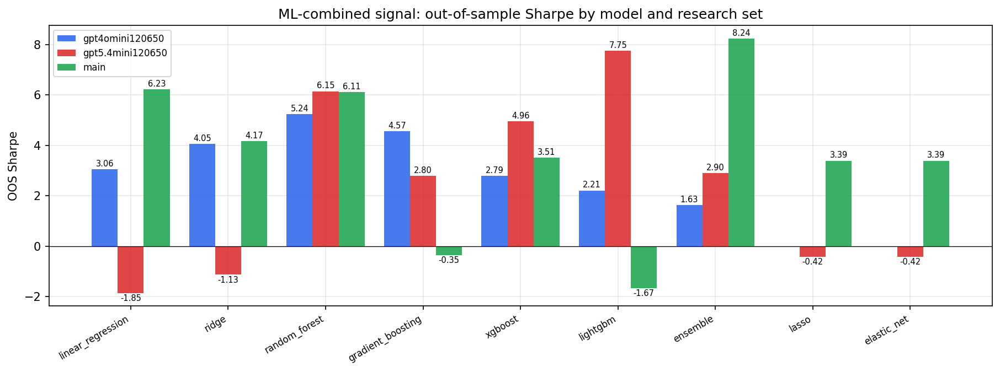

*ML-combined OOS Sharpe by model and research set*

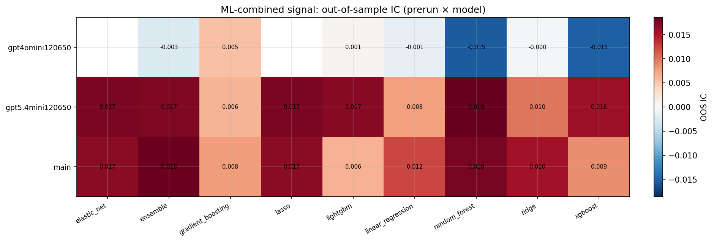

*ML-combined OOS IC (prerun × model)*

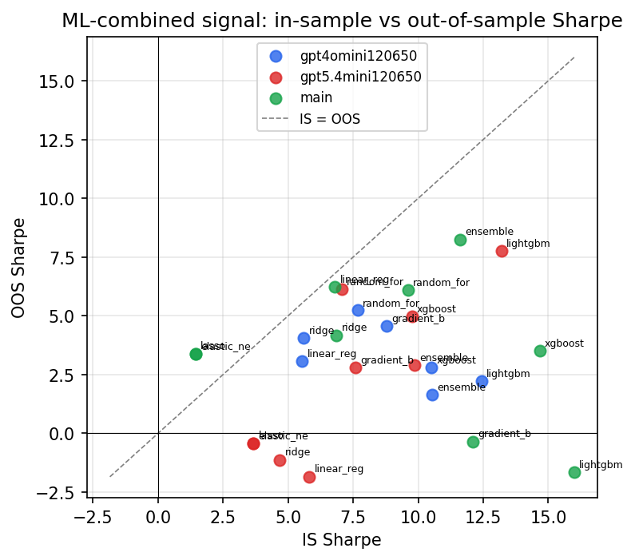

*IS vs OOS Sharpe (overfitting diagnostic)*

---
*Generated by `run_model_comparison.py`. Tables: `*.csv`; interactive: `comparison.ipynb`.*
