# Research-LLM factor comparison — `2025-08`

Comparing the **factor output of different research LLMs** on three axes (raw factor quality → factors as ML features → factors through the full agentic fund). The panel, IS/OOS split, horizon and model hyper-parameters are held identical across preruns — the *only* variable is the factor set.

## Preruns compared

| prerun | research_model | usable_factors | dropped_factors |
| --- | --- | --- | --- |
| gpt4omini120650 | gpt-4o-mini | 66 | 0 |
| gpt5.4mini120650 | gpt-5.4-mini | 69 | 0 |
| main | seed library | 78 | 10 |

> Dropped factors declare fields the current data doesn't have yet (e.g. fundamentals); they light up unchanged once that data is downloaded.

*Usable vs awaiting-data factors per research model*

## Key findings

- **Best ML-combined OOS Sharpe:** `gpt5.4mini120650` with `lightgbm` (OOS Sharpe = 3.299).
- **Mean OOS Sharpe across models, by research set:** `gpt4omini120650` = 2.009, `gpt5.4mini120650` = 1.310, `main` = 0.494.
- **Highest mean single-factor |IC| (h=6):** `gpt4omini120650` (mean |IC| = 0.0089).
- **Most diverse zoo (highest effective/raw factor ratio):** `gpt5.4mini120650` (eff 42.4 of 69, ratio 0.61).
- **Best selection-deflated single-factor |IC|:** `gpt5.4mini120650` (deflated |IC| = 0.0144 from 31 factors tried).

## 1. Single-factor IC (raw factor quality)

Per-underlying time-series Spearman rank-IC of every researched factor, recomputed on the shared panel at horizons h=1, h=6, h=60. The per-underlying IC correlates each factor's value vector with the underlying's own forward-return vector (pooled across underlyings); the cross-sectional IC ranks across underlyings per timestamp.

| prerun | n_factors | mean_abs_ic_1 | mean_abs_ic_6 | mean_abs_ic_60 | mean_abs_icir_6 | best_factor_h6 | best_abs_ic_h6 |
| --- | --- | --- | --- | --- | --- | --- | --- |
| gpt4omini120650 | 66 | 0.0062 | 0.0089 | 0.0068 | 0.5084 | order_flow_volatility_surge | 0.0204 |
| gpt5.4mini120650 | 69 | 0.0031 | 0.0059 | 0.0062 | 0.6132 | lstm_flow_price_mismatch | 0.0212 |
| main | 78 | 0.008 | 0.0083 | 0.0047 | 0.5243 | alpha_084 | 0.0183 |

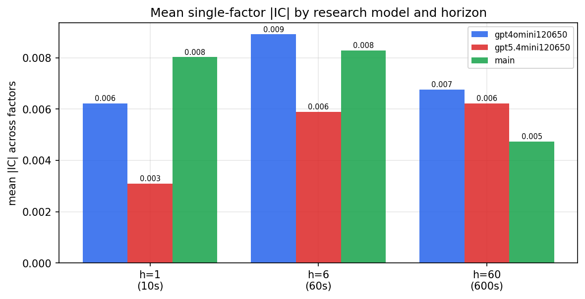

*Mean |IC| by research model and horizon*

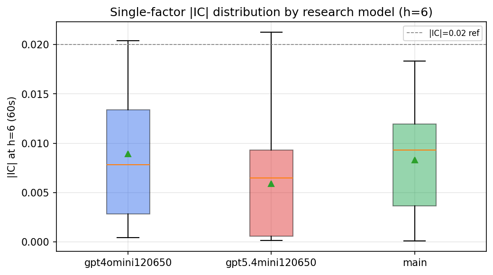

*Per-factor |IC| distribution by research model*

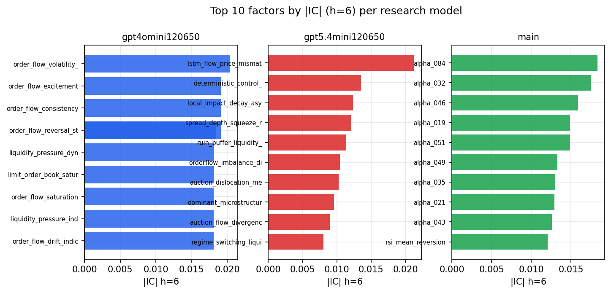

*Top factors by |IC| per research model*

## 2. Factor diversity & redundancy

Pairwise correlation of each zoo's *signals*. `eff_n_factors` is the effective number of independent factors (participation ratio of the correlation eigenvalues); `eff_ratio` and `redundancy` summarise how much unique information the zoo holds vs. how much is duplicated; `n_clusters` groups factors at |corr| ≥ 0.7.

| prerun | n_factors | eff_n_factors | eff_ratio | mean_abs_corr | n_clusters | redundancy |
| --- | --- | --- | --- | --- | --- | --- |
| gpt4omini120650 | 66 | 27.0719 | 0.4102 | 0.0511 | 49 | 0.5898 |
| gpt5.4mini120650 | 69 | 42.4208 | 0.6148 | 0.0167 | 60 | 0.3852 |
| main | 78 | 42.7156 | 0.5476 | 0.0286 | 70 | 0.4524 |

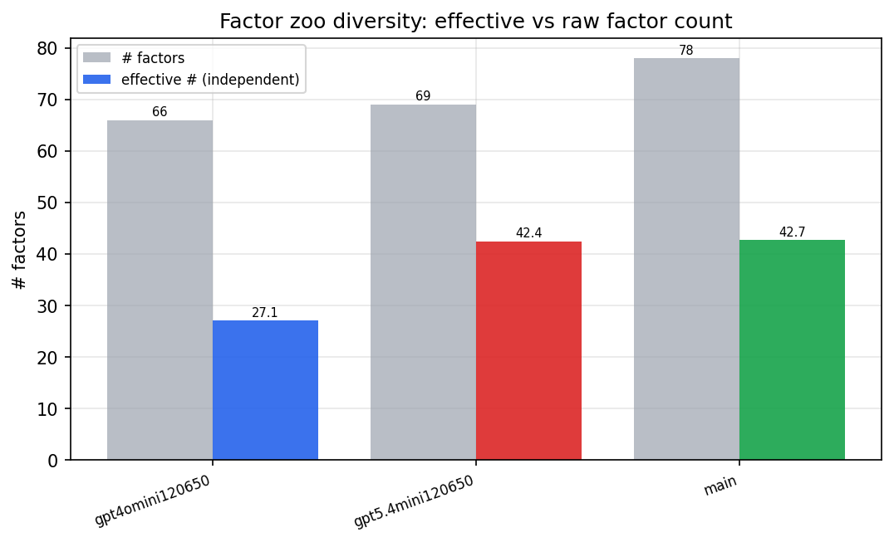

*Effective vs raw factor count per research model*

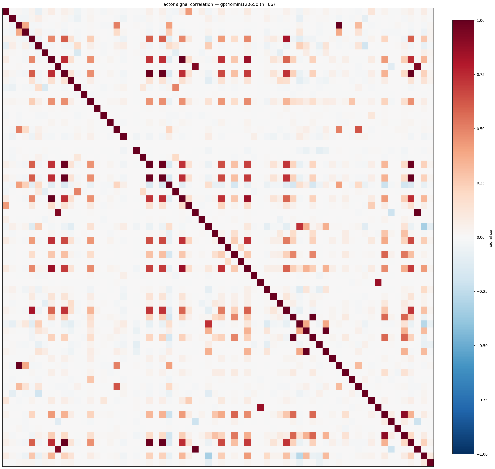

*Signal correlation matrix — gpt4omini120650*

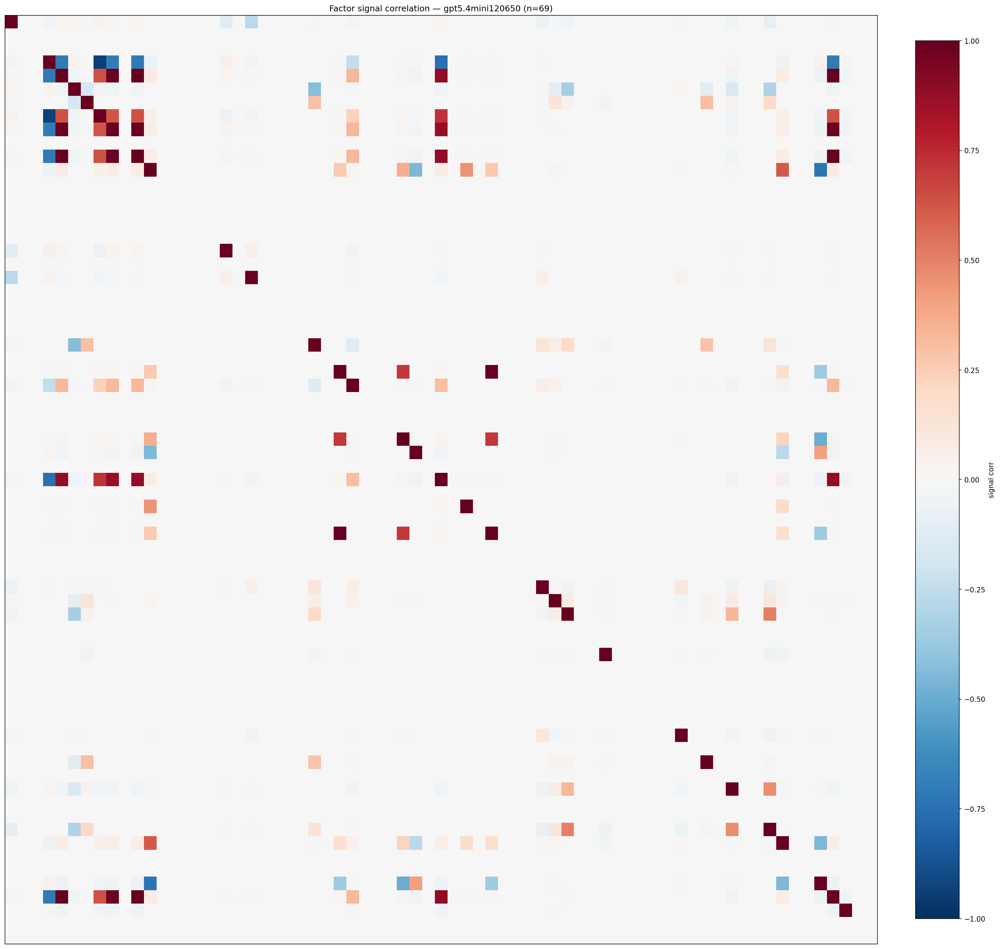

*Signal correlation matrix — gpt5.4mini120650*

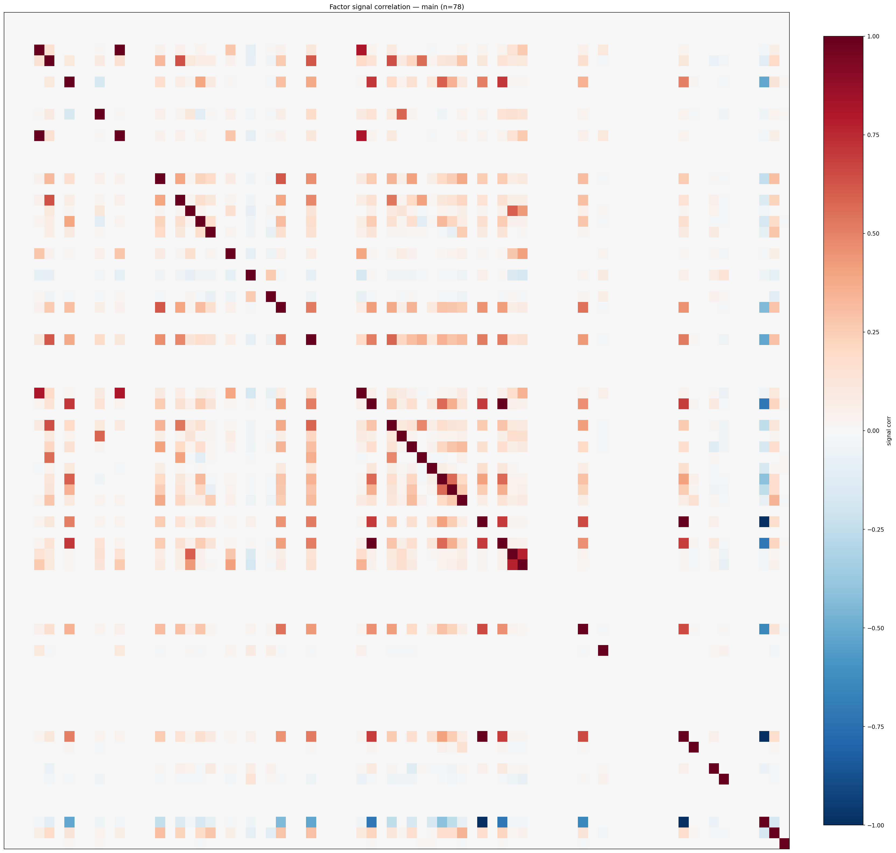

*Signal correlation matrix — main*

## 3. Deflation & model-based importance

`deflated_best_ic` haircuts each zoo's best |IC| for the number of factors tried (`ic_n_tested`) — a bigger zoo's best factor is more likely to be lucky. `lasso_n_nonzero` / `lasso_sparsity` show how many factors a sparse linear model actually keeps (model-view redundancy).

| prerun | best_ic | deflated_best_ic | deflated_best_t | ic_n_tested | ic_n_obs | lasso_n_nonzero | lasso_sparsity |
| --- | --- | --- | --- | --- | --- | --- | --- |
| gpt4omini120650 | 0.0204 | 0.0129 | 4.9246 | 64 | 146339 | 9 | 0.8636 |
| gpt5.4mini120650 | 0.0212 | 0.0144 | 5.5054 | 31 | 146339 | 0 | 1.0 |
| main | 0.0183 | 0.0113 | 4.3182 | 38 | 146339 | 0 | 1.0 |

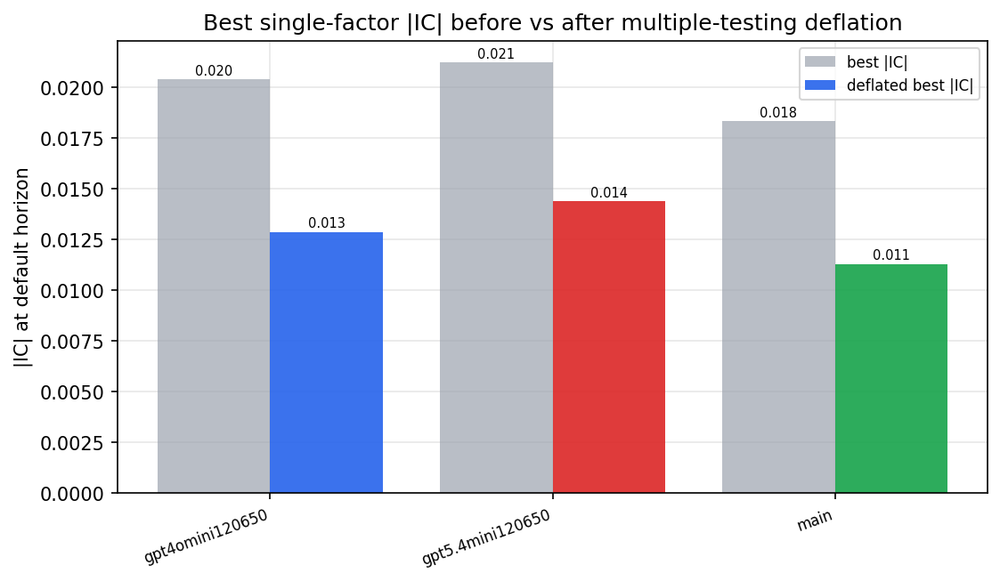

*Best |IC| before vs after multiple-testing deflation*

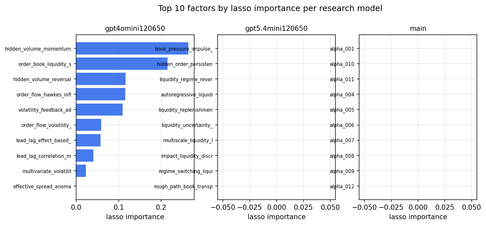

*Top factors by lasso importance per zoo*

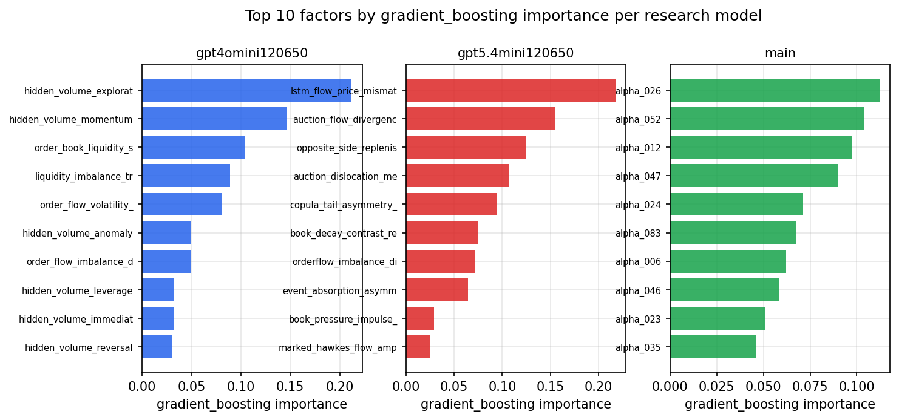

*Top factors by gradient_boosting importance per zoo*

## 4. ML-combined signal — per-underlying vectorised backtest

Each model combines a prerun's factors into ONE signal (fit `factors → forward return` on IS, predict per (bar, underlying)), then that combined signal is run through a simple vectorised backtest — `position(signal) × the underlying's own forward return` — on the held-out OOS tail (+ an equal-weight ensemble). No cross-sectional ranking.

> Config: position=**threshold** (t=1.0, z-score `expanding`), aggregation=**portfolio**, fit-standardise=**per_underlying**, horizon=6.

| prerun | model | n_factors_used | oos_ic | oos_sharpe | is_sharpe | oos_ann_return | oos_max_drawdown |
| --- | --- | --- | --- | --- | --- | --- | --- |
| gpt4omini120650 | linear_regression | 66 | 0.0015 | 1.023 | 6.1123 | 0.0652 | -0.032 |
| gpt4omini120650 | ridge | 66 | 0.0036 | 1.1321 | 6.08 | 0.0722 | -0.0326 |
| gpt4omini120650 | lasso | 66 | 0.0149 | 2.2884 | 6.444 | 0.1388 | -0.0252 |
| gpt4omini120650 | elastic_net | 66 | 0.0152 | 2.4414 | 6.3183 | 0.1481 | -0.025 |
| gpt4omini120650 | random_forest | 66 | 0.0064 | 2.3591 | 9.1059 | 0.1383 | -0.0216 |
| gpt4omini120650 | gradient_boosting | 66 | 0.0084 | 2.0533 | 10.7556 | 0.0973 | -0.0168 |
| gpt4omini120650 | xgboost | 66 | 0.0079 | 2.3021 | 12.988 | 0.1171 | -0.0176 |
| gpt4omini120650 | lightgbm | 66 | 0.0076 | 2.329 | 19.0409 | 0.1217 | -0.0158 |
| gpt4omini120650 | ensemble | 66 | 0.0116 | 2.149 | 12.1113 | 0.1257 | -0.0254 |
| gpt5.4mini120650 | linear_regression | 69 | -0.0068 | -1.0752 | 8.4556 | -0.0563 | -0.0108 |
| gpt5.4mini120650 | ridge | 69 | -0.0065 | -2.1105 | 7.7994 | -0.0992 | -0.0105 |
| gpt5.4mini120650 | lasso | 69 | nan | nan | nan | nan | nan |
| gpt5.4mini120650 | elastic_net | 69 | nan | nan | nan | nan | nan |
| gpt5.4mini120650 | random_forest | 69 | -0.0018 | 1.5332 | 8.4859 | 0.0919 | -0.0196 |
| gpt5.4mini120650 | gradient_boosting | 69 | 0.0036 | 2.3319 | 10.7976 | 0.0919 | -0.0141 |
| gpt5.4mini120650 | xgboost | 69 | -0.0029 | 2.427 | 13.5894 | 0.1311 | -0.0166 |
| gpt5.4mini120650 | lightgbm | 69 | 0.0003 | 3.2986 | 18.7145 | 0.1557 | -0.013 |
| gpt5.4mini120650 | ensemble | 69 | -0.0059 | 2.7681 | 13.8326 | 0.1427 | -0.0144 |
| main | linear_regression | 78 | 0.0022 | 0.6633 | 9.5344 | 0.0018 | -0.0008 |
| main | ridge | 78 | 0.0015 | 0.6633 | 9.4508 | 0.0018 | -0.0008 |
| main | lasso | 78 | -0.0138 | 0.8916 | 6.5183 | 0.0023 | -0.0006 |
| main | elastic_net | 78 | -0.0145 | 1.5809 | 6.3834 | 0.0038 | -0.0006 |
| main | random_forest | 78 | 0.0111 | 2.9536 | 15.7216 | 0.1057 | -0.0064 |
| main | gradient_boosting | 78 | 0.0114 | -2.5096 | 14.1614 | -0.0465 | -0.008 |
| main | xgboost | 78 | 0.0163 | -0.6093 | 19.135 | -0.0191 | -0.0115 |
| main | lightgbm | 78 | 0.0119 | 2.0311 | 25.578 | 0.0541 | -0.0082 |
| main | ensemble | 78 | 0.0132 | -1.2219 | 21.1068 | -0.028 | -0.0104 |

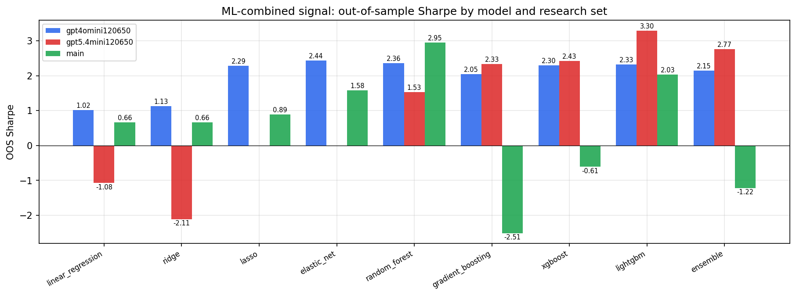

*ML-combined OOS Sharpe by model and research set*

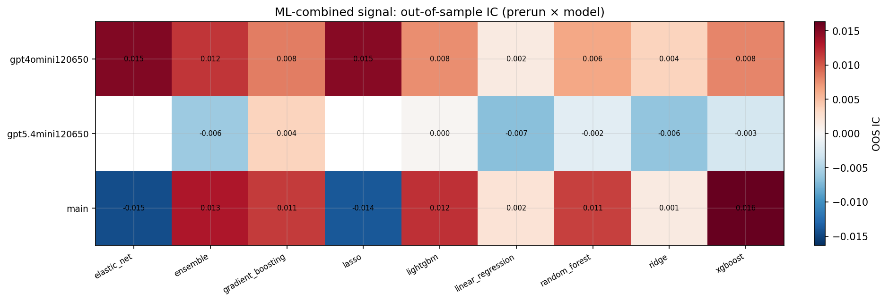

*ML-combined OOS IC (prerun × model)*

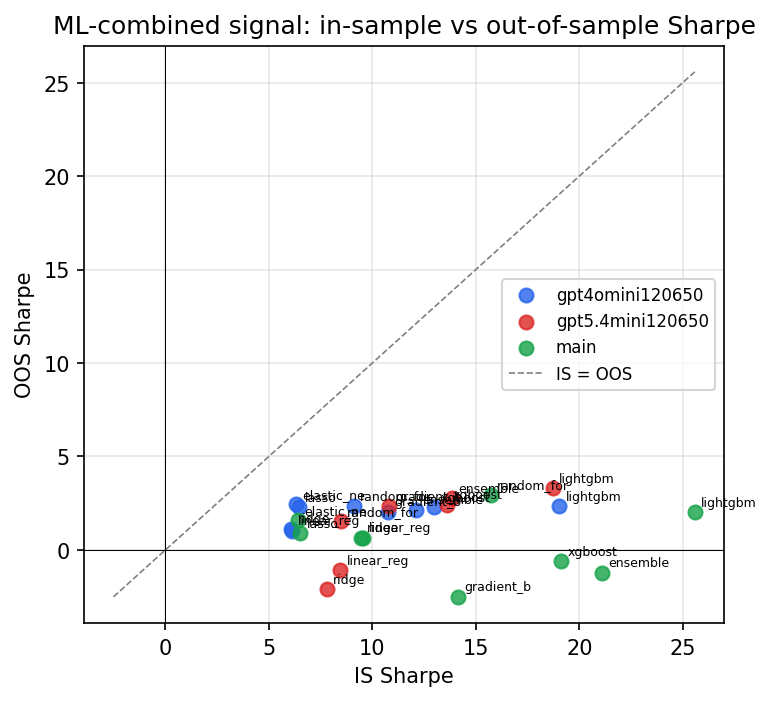

*IS vs OOS Sharpe (overfitting diagnostic)*

---
*Generated by `run_model_comparison.py`. Tables: `*.csv`; interactive: `comparison.ipynb`.*
