# Research-LLM factor comparison — `2025-09`

Comparing the **factor output of different research LLMs** on three axes (raw factor quality → factors as ML features → factors through the full agentic fund). The panel, IS/OOS split, horizon and model hyper-parameters are held identical across preruns — the *only* variable is the factor set.

## Preruns compared

| prerun | research_model | usable_factors | dropped_factors |
| --- | --- | --- | --- |
| gpt4omini120650 | gpt-4o-mini | 66 | 0 |
| gpt5.4mini120650 | gpt-5.4-mini | 69 | 0 |
| main | seed library | 78 | 10 |

> Dropped factors declare fields the current data doesn't have yet (e.g. fundamentals); they light up unchanged once that data is downloaded.

*Usable vs awaiting-data factors per research model*

## Key findings

- **Best ML-combined OOS Sharpe:** `gpt5.4mini120650` with `lightgbm` (OOS Sharpe = 7.609).
- **Mean OOS Sharpe across models, by research set:** `gpt4omini120650` = 3.446, `gpt5.4mini120650` = 1.901, `main` = -4.166.
- **Highest mean single-factor |IC| (h=6):** `gpt4omini120650` (mean |IC| = 0.0063).
- **Most diverse zoo (highest effective/raw factor ratio):** `gpt5.4mini120650` (eff 44.6 of 69, ratio 0.65).
- **Best selection-deflated single-factor |IC|:** `gpt5.4mini120650` (deflated |IC| = 0.0070 from 31 factors tried).

## 1. Single-factor IC (raw factor quality)

Per-underlying time-series Spearman rank-IC of every researched factor, recomputed on the shared panel at horizons h=1, h=6, h=60. The per-underlying IC correlates each factor's value vector with the underlying's own forward-return vector (pooled across underlyings); the cross-sectional IC ranks across underlyings per timestamp.

| prerun | n_factors | mean_abs_ic_1 | mean_abs_ic_6 | mean_abs_ic_60 | mean_abs_icir_6 | best_factor_h6 | best_abs_ic_h6 |
| --- | --- | --- | --- | --- | --- | --- | --- |
| gpt4omini120650 | 66 | 0.0043 | 0.0063 | 0.0066 | 0.3804 | order_flow_volatility_surge | 0.0143 |
| gpt5.4mini120650 | 69 | 0.0028 | 0.0052 | 0.0067 | 0.2918 | liquidity_impact_stress_ratio | 0.0138 |
| main | 78 | 0.0062 | 0.0052 | 0.0047 | 0.3106 | alpha_071 | 0.0138 |

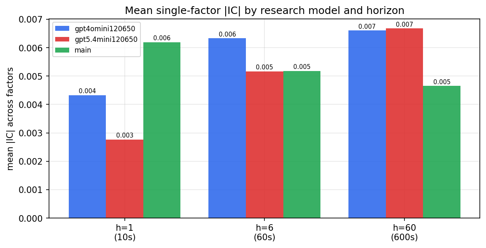

*Mean |IC| by research model and horizon*

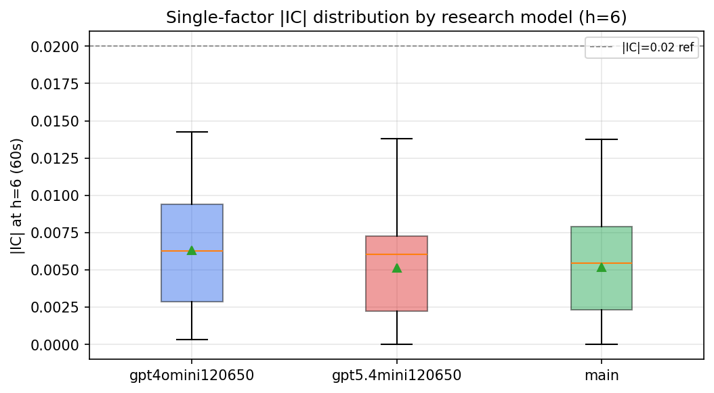

*Per-factor |IC| distribution by research model*

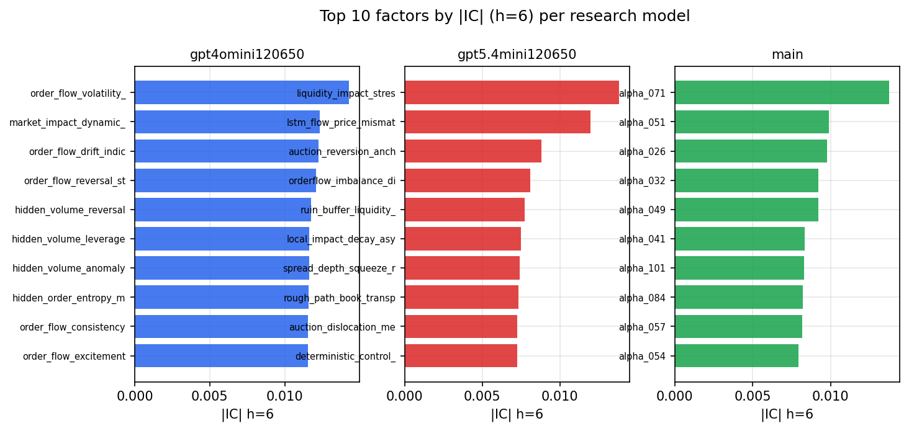

*Top factors by |IC| per research model*

## 2. Factor diversity & redundancy

Pairwise correlation of each zoo's *signals*. `eff_n_factors` is the effective number of independent factors (participation ratio of the correlation eigenvalues); `eff_ratio` and `redundancy` summarise how much unique information the zoo holds vs. how much is duplicated; `n_clusters` groups factors at |corr| ≥ 0.7.

| prerun | n_factors | eff_n_factors | eff_ratio | mean_abs_corr | n_clusters | redundancy |
| --- | --- | --- | --- | --- | --- | --- |
| gpt4omini120650 | 66 | 27.3115 | 0.4138 | 0.0503 | 50 | 0.5862 |
| gpt5.4mini120650 | 69 | 44.617 | 0.6466 | 0.0141 | 62 | 0.3534 |
| main | 78 | 42.3759 | 0.5433 | 0.0282 | 70 | 0.4567 |

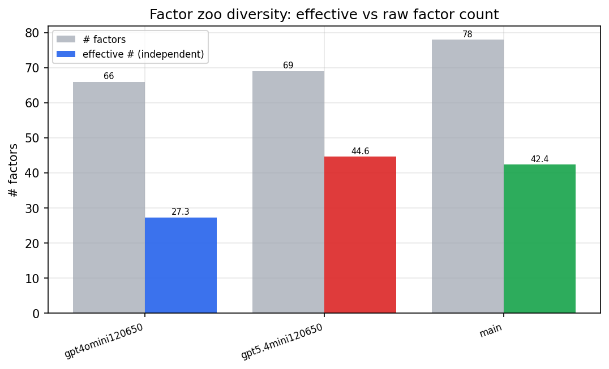

*Effective vs raw factor count per research model*

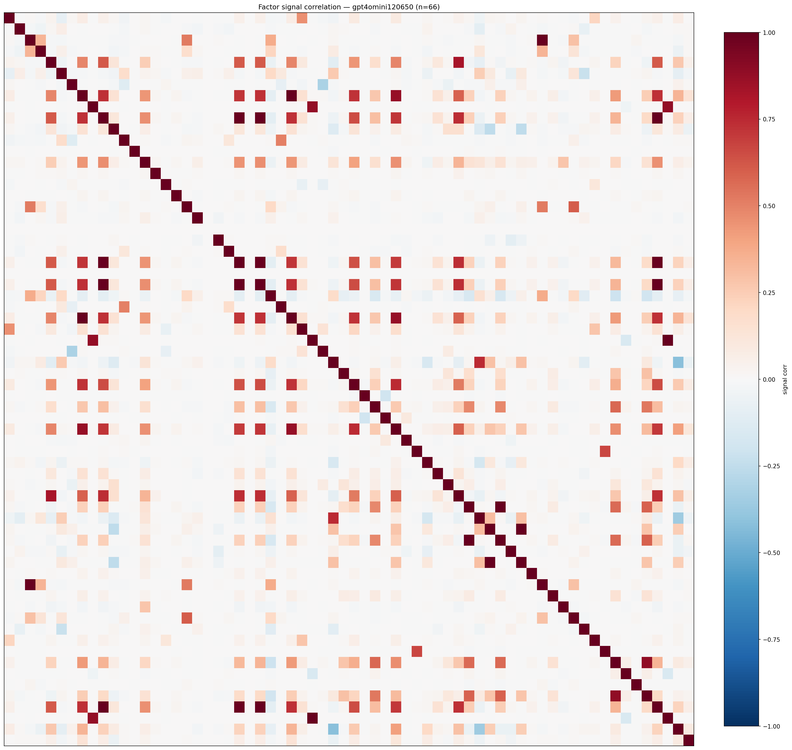

*Signal correlation matrix — gpt4omini120650*

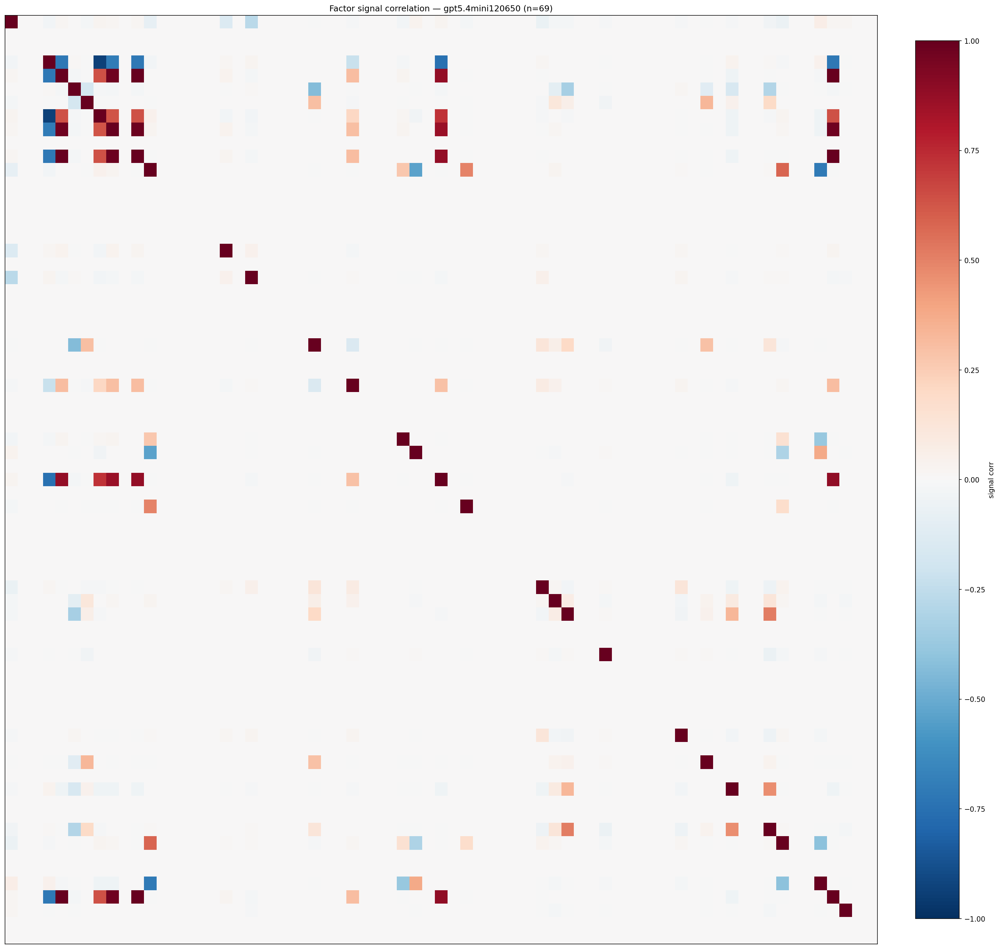

*Signal correlation matrix — gpt5.4mini120650*

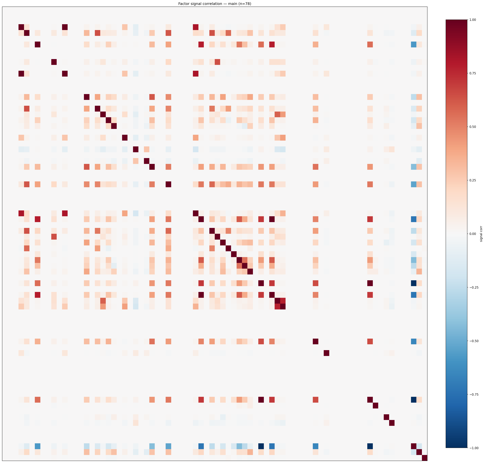

*Signal correlation matrix — main*

## 3. Deflation & model-based importance

`deflated_best_ic` haircuts each zoo's best |IC| for the number of factors tried (`ic_n_tested`) — a bigger zoo's best factor is more likely to be lucky. `lasso_n_nonzero` / `lasso_sparsity` show how many factors a sparse linear model actually keeps (model-view redundancy).

| prerun | best_ic | deflated_best_ic | deflated_best_t | ic_n_tested | ic_n_obs | lasso_n_nonzero | lasso_sparsity |
| --- | --- | --- | --- | --- | --- | --- | --- |
| gpt4omini120650 | 0.0143 | 0.0068 | 2.6219 | 64 | 148679 | 0 | 1.0 |
| gpt5.4mini120650 | 0.0138 | 0.007 | 2.7023 | 31 | 148679 | 0 | 1.0 |
| main | 0.0138 | 0.0068 | 2.6047 | 38 | 148679 | 0 | 1.0 |

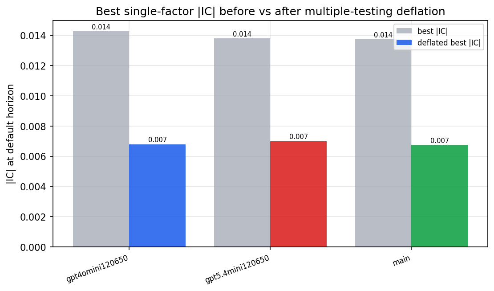

*Best |IC| before vs after multiple-testing deflation*

*Top factors by lasso importance per zoo*

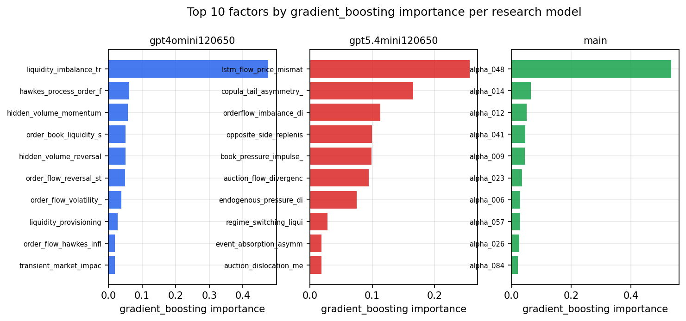

*Top factors by gradient_boosting importance per zoo*

## 4. ML-combined signal — per-underlying vectorised backtest

Each model combines a prerun's factors into ONE signal (fit `factors → forward return` on IS, predict per (bar, underlying)), then that combined signal is run through a simple vectorised backtest — `position(signal) × the underlying's own forward return` — on the held-out OOS tail (+ an equal-weight ensemble). No cross-sectional ranking.

> Config: position=**threshold** (t=1.0, z-score `expanding`), aggregation=**portfolio**, fit-standardise=**per_underlying**, horizon=6.

| prerun | model | n_factors_used | oos_ic | oos_sharpe | is_sharpe | oos_ann_return | oos_max_drawdown |
| --- | --- | --- | --- | --- | --- | --- | --- |
| gpt4omini120650 | linear_regression | 66 | -0.0027 | 3.2432 | 7.1349 | 0.1837 | -0.0099 |
| gpt4omini120650 | ridge | 66 | -0.0038 | 4.3565 | 7.2983 | 0.2462 | -0.0089 |
| gpt4omini120650 | lasso | 66 | nan | nan | nan | nan | nan |
| gpt4omini120650 | elastic_net | 66 | nan | nan | nan | nan | nan |
| gpt4omini120650 | random_forest | 66 | 0.0037 | 5.5921 | 10.4662 | 0.3243 | -0.0095 |
| gpt4omini120650 | gradient_boosting | 66 | 0.0016 | -0.0706 | 9.652 | -0.002 | -0.007 |
| gpt4omini120650 | xgboost | 66 | 0.0012 | 4.5651 | 13.8003 | 0.2277 | -0.0115 |
| gpt4omini120650 | lightgbm | 66 | -0.0056 | 1.7423 | 20.7983 | 0.0643 | -0.0076 |
| gpt4omini120650 | ensemble | 66 | 0.003 | 4.6941 | 14.1611 | 0.2597 | -0.009 |
| gpt5.4mini120650 | linear_regression | 69 | -0.0055 | 0.0335 | 3.2845 | 0.002 | -0.0119 |
| gpt5.4mini120650 | ridge | 69 | -0.0055 | 0.6197 | 3.4316 | 0.0372 | -0.0112 |
| gpt5.4mini120650 | lasso | 69 | -0.0055 | -1.0273 | 2.7704 | -0.0585 | -0.0124 |
| gpt5.4mini120650 | elastic_net | 69 | -0.0052 | -1.0755 | 2.5663 | -0.0612 | -0.0123 |
| gpt5.4mini120650 | random_forest | 69 | 0.0071 | 1.8417 | 8.8386 | 0.0628 | -0.0078 |
| gpt5.4mini120650 | gradient_boosting | 69 | 0.0034 | 1.3534 | 6.9582 | 0.0225 | -0.004 |
| gpt5.4mini120650 | xgboost | 69 | 0.0089 | 5.1216 | 9.8989 | 0.1895 | -0.007 |
| gpt5.4mini120650 | lightgbm | 69 | 0.0075 | 7.6094 | 16.936 | 0.3149 | -0.0027 |
| gpt5.4mini120650 | ensemble | 69 | -0.0031 | 2.6359 | 8.2402 | 0.1426 | -0.0105 |
| main | linear_regression | 78 | -0.0021 | -3.164 | 10.0676 | -0.0059 | -0.0007 |
| main | ridge | 78 | -0.0021 | -3.164 | 10.6157 | -0.0059 | -0.0007 |
| main | lasso | 78 | nan | nan | nan | nan | nan |
| main | elastic_net | 78 | nan | nan | nan | nan | nan |
| main | random_forest | 78 | -0.0039 | -5.6959 | 11.8678 | -0.1923 | -0.0237 |
| main | gradient_boosting | 78 | -0.0029 | 0.5125 | 10.4695 | 0.0049 | -0.0024 |
| main | xgboost | 78 | 0.001 | -5.5052 | 14.9687 | -0.1661 | -0.0184 |
| main | lightgbm | 78 | 0.003 | -3.8979 | 24.3719 | -0.0862 | -0.0091 |
| main | ensemble | 78 | -0.0079 | -8.2478 | 17.7242 | -0.2239 | -0.0209 |

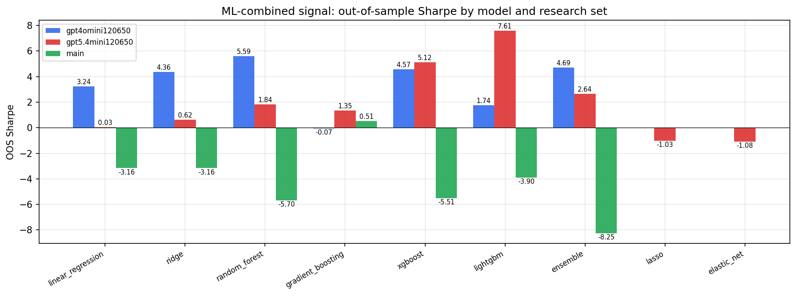

*ML-combined OOS Sharpe by model and research set*

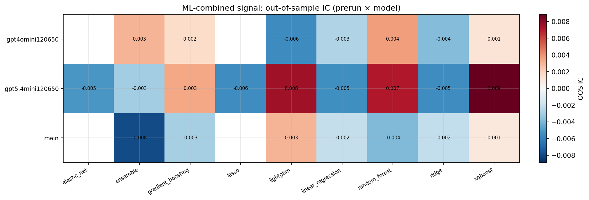

*ML-combined OOS IC (prerun × model)*

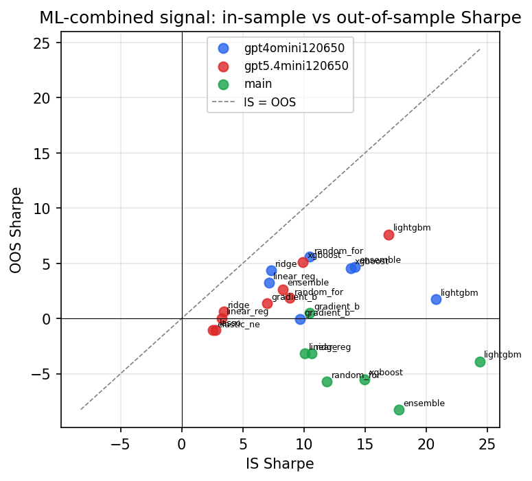

*IS vs OOS Sharpe (overfitting diagnostic)*

---
*Generated by `run_model_comparison.py`. Tables: `*.csv`; interactive: `comparison.ipynb`.*
