# Research-LLM factor comparison — `2025-11`

Comparing the **factor output of different research LLMs** on three axes (raw factor quality → factors as ML features → factors through the full agentic fund). The panel, IS/OOS split, horizon and model hyper-parameters are held identical across preruns — the *only* variable is the factor set.

## Preruns compared

| prerun | research_model | usable_factors | dropped_factors |
| --- | --- | --- | --- |
| gpt4omini120650 | gpt-4o-mini | 66 | 0 |
| gpt5.4mini120650 | gpt-5.4-mini | 69 | 0 |
| main | seed library | 78 | 10 |

> Dropped factors declare fields the current data doesn't have yet (e.g. fundamentals); they light up unchanged once that data is downloaded.

*Usable vs awaiting-data factors per research model*

## Key findings

- **Best ML-combined OOS Sharpe:** `main` with `linear_regression` (OOS Sharpe = 8.613).
- **Mean OOS Sharpe across models, by research set:** `main` = 2.273, `gpt5.4mini120650` = 0.380, `gpt4omini120650` = -2.147.
- **Highest mean single-factor |IC| (h=6):** `gpt5.4mini120650` (mean |IC| = 0.0055).
- **Most diverse zoo (highest effective/raw factor ratio):** `gpt5.4mini120650` (eff 38.4 of 69, ratio 0.56).
- **Best selection-deflated single-factor |IC|:** `gpt5.4mini120650` (deflated |IC| = 0.0077 from 31 factors tried).

## 1. Single-factor IC (raw factor quality)

Per-underlying time-series Spearman rank-IC of every researched factor, recomputed on the shared panel at horizons h=1, h=6, h=60. The per-underlying IC correlates each factor's value vector with the underlying's own forward-return vector (pooled across underlyings); the cross-sectional IC ranks across underlyings per timestamp.

| prerun | n_factors | mean_abs_ic_1 | mean_abs_ic_6 | mean_abs_ic_60 | mean_abs_icir_6 | best_factor_h6 | best_abs_ic_h6 |
| --- | --- | --- | --- | --- | --- | --- | --- |
| gpt4omini120650 | 66 | 0.0039 | 0.0041 | 0.0086 | 0.2331 | hidden_volume_exploration | 0.0145 |
| gpt5.4mini120650 | 69 | 0.004 | 0.0055 | 0.0087 | 0.2933 | multiscale_liquidity_leadlag_reversal | 0.0146 |
| main | 78 | 0.0073 | 0.0044 | 0.006 | 0.2755 | alpha_071 | 0.0142 |

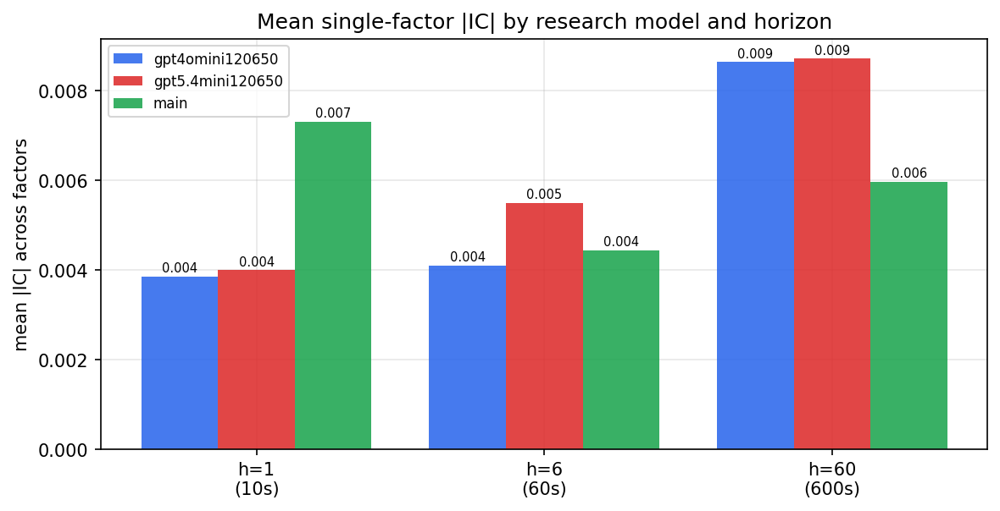

*Mean |IC| by research model and horizon*

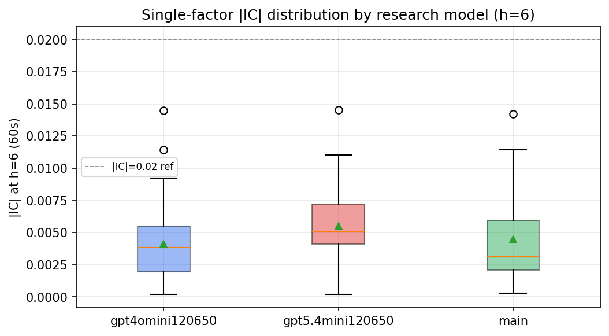

*Per-factor |IC| distribution by research model*

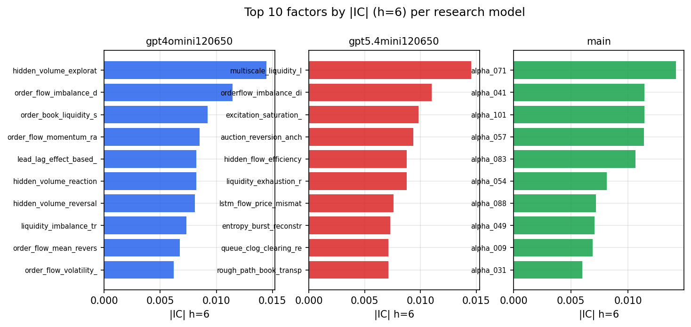

*Top factors by |IC| per research model*

## 2. Factor diversity & redundancy

Pairwise correlation of each zoo's *signals*. `eff_n_factors` is the effective number of independent factors (participation ratio of the correlation eigenvalues); `eff_ratio` and `redundancy` summarise how much unique information the zoo holds vs. how much is duplicated; `n_clusters` groups factors at |corr| ≥ 0.7.

| prerun | n_factors | eff_n_factors | eff_ratio | mean_abs_corr | n_clusters | redundancy |
| --- | --- | --- | --- | --- | --- | --- |
| gpt4omini120650 | 66 | 26.9951 | 0.409 | 0.0511 | 50 | 0.591 |
| gpt5.4mini120650 | 69 | 38.3582 | 0.5559 | 0.0182 | 60 | 0.4441 |
| main | 78 | 43.089 | 0.5524 | 0.0281 | 71 | 0.4476 |

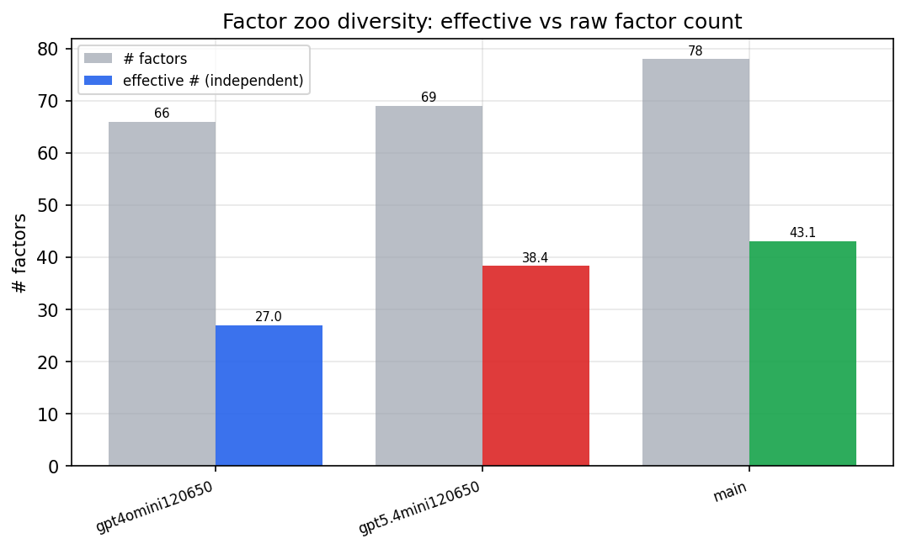

*Effective vs raw factor count per research model*

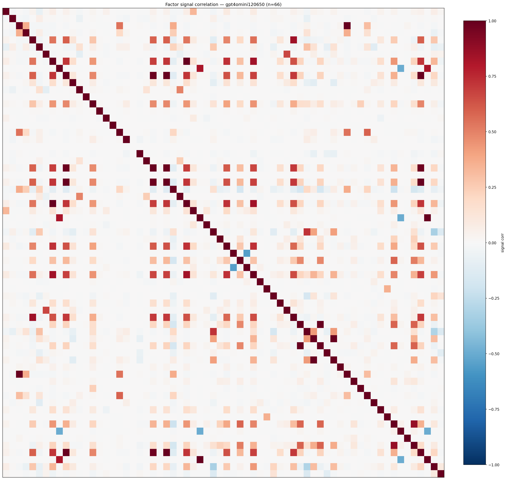

*Signal correlation matrix — gpt4omini120650*

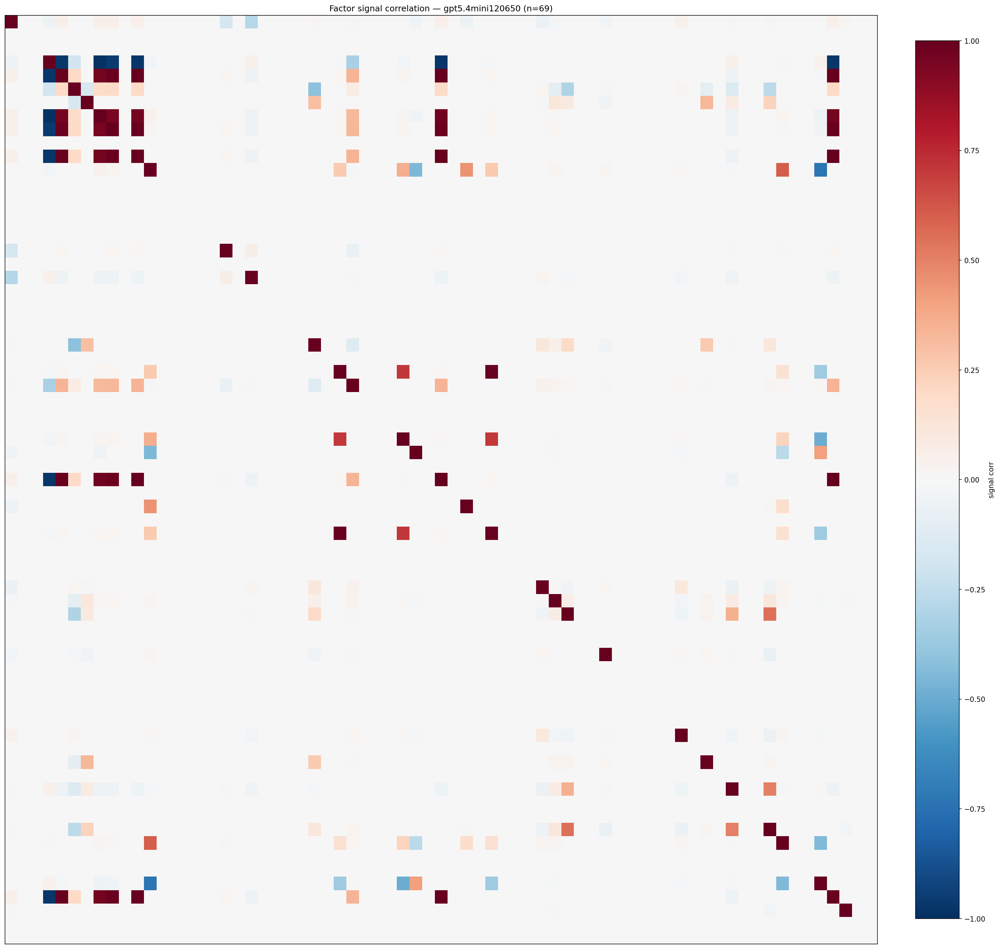

*Signal correlation matrix — gpt5.4mini120650*

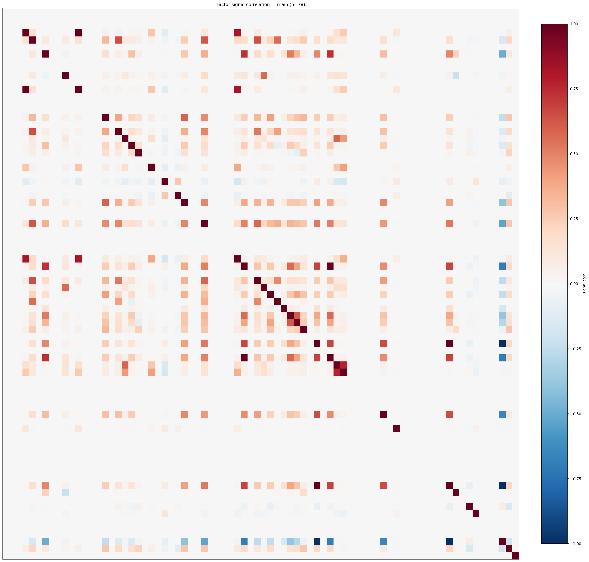

*Signal correlation matrix — main*

## 3. Deflation & model-based importance

`deflated_best_ic` haircuts each zoo's best |IC| for the number of factors tried (`ic_n_tested`) — a bigger zoo's best factor is more likely to be lucky. `lasso_n_nonzero` / `lasso_sparsity` show how many factors a sparse linear model actually keeps (model-view redundancy).

| prerun | best_ic | deflated_best_ic | deflated_best_t | ic_n_tested | ic_n_obs | lasso_n_nonzero | lasso_sparsity |
| --- | --- | --- | --- | --- | --- | --- | --- |
| gpt4omini120650 | 0.0145 | 0.0069 | 2.6551 | 64 | 146339 | 0 | 1.0 |
| gpt5.4mini120650 | 0.0146 | 0.0077 | 2.9468 | 31 | 146339 | 0 | 1.0 |
| main | 0.0142 | 0.0072 | 2.7376 | 38 | 146339 | 0 | 1.0 |

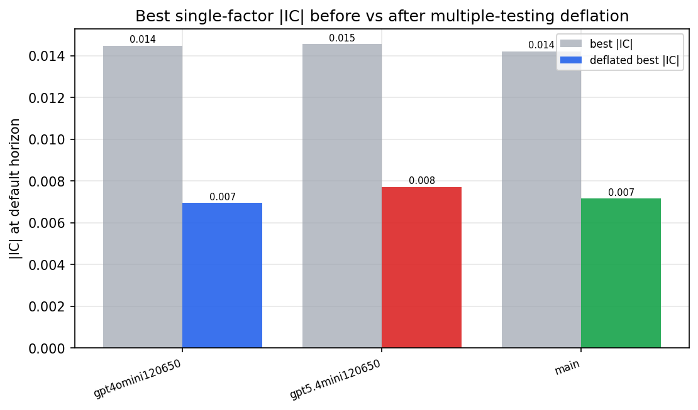

*Best |IC| before vs after multiple-testing deflation*

*Top factors by lasso importance per zoo*

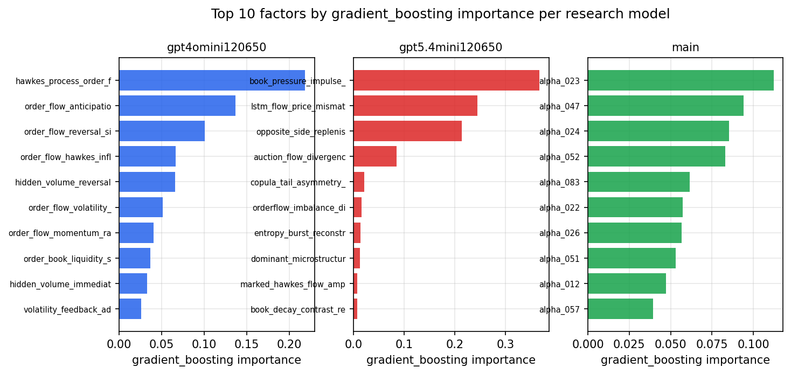

*Top factors by gradient_boosting importance per zoo*

## 4. ML-combined signal — per-underlying vectorised backtest

Each model combines a prerun's factors into ONE signal (fit `factors → forward return` on IS, predict per (bar, underlying)), then that combined signal is run through a simple vectorised backtest — `position(signal) × the underlying's own forward return` — on the held-out OOS tail (+ an equal-weight ensemble). No cross-sectional ranking.

> Config: position=**threshold** (t=1.0, z-score `expanding`), aggregation=**portfolio**, fit-standardise=**per_underlying**, horizon=6.

| prerun | model | n_factors_used | oos_ic | oos_sharpe | is_sharpe | oos_ann_return | oos_max_drawdown |
| --- | --- | --- | --- | --- | --- | --- | --- |
| gpt4omini120650 | linear_regression | 66 | -0.0173 | -2.1615 | 7.557 | -0.2991 | -0.0543 |
| gpt4omini120650 | ridge | 66 | -0.0178 | -2.0237 | 6.6599 | -0.2845 | -0.0525 |
| gpt4omini120650 | lasso | 66 | -0.0147 | -2.8483 | 6.8704 | -0.3886 | -0.059 |
| gpt4omini120650 | elastic_net | 66 | -0.014 | -2.8116 | 6.5613 | -0.3846 | -0.0597 |
| gpt4omini120650 | random_forest | 66 | -0.0235 | -4.1481 | 8.0657 | -0.3848 | -0.0401 |
| gpt4omini120650 | gradient_boosting | 66 | -0.0181 | -0.884 | 10.5597 | -0.0572 | -0.0205 |
| gpt4omini120650 | xgboost | 66 | -0.0122 | -0.4636 | 12.4354 | -0.0363 | -0.03 |
| gpt4omini120650 | lightgbm | 66 | -0.0083 | -2.2439 | 16.8469 | -0.1297 | -0.0234 |
| gpt4omini120650 | ensemble | 66 | -0.0179 | -1.7377 | 9.2181 | -0.2248 | -0.0492 |
| gpt5.4mini120650 | linear_regression | 69 | -0.0006 | 1.7437 | 6.4728 | 0.1795 | -0.0356 |
| gpt5.4mini120650 | ridge | 69 | -0.0005 | 1.5647 | 6.5357 | 0.1605 | -0.0351 |
| gpt5.4mini120650 | lasso | 69 | 0.0031 | 2.2987 | 6.1016 | 0.2362 | -0.0321 |
| gpt5.4mini120650 | elastic_net | 69 | 0.003 | 1.7829 | 6.2063 | 0.1832 | -0.0343 |
| gpt5.4mini120650 | random_forest | 69 | -0.0077 | 0.9257 | 8.791 | 0.0839 | -0.0337 |
| gpt5.4mini120650 | gradient_boosting | 69 | 0.0011 | -2.0649 | 9.9744 | -0.1055 | -0.018 |
| gpt5.4mini120650 | xgboost | 69 | -0.0099 | -3.3294 | 12.1665 | -0.2 | -0.029 |
| gpt5.4mini120650 | lightgbm | 69 | 0.0006 | -1.911 | 18.7785 | -0.1087 | -0.0262 |
| gpt5.4mini120650 | ensemble | 69 | 0.0024 | 2.4079 | 10.2957 | 0.2292 | -0.0326 |
| main | linear_regression | 78 | -0.0032 | 8.6134 | 12.1452 | 0.0424 | -0.0006 |
| main | ridge | 78 | -0.0041 | 8.4411 | 11.8689 | 0.0464 | -0.0007 |
| main | lasso | 78 | -0.0136 | 3.3614 | 3.7324 | 0.3119 | -0.024 |
| main | elastic_net | 78 | -0.0139 | 2.4386 | 5.9109 | 0.2206 | -0.0228 |
| main | random_forest | 78 | 0.0052 | 0.9143 | 15.5761 | 0.057 | -0.0241 |
| main | gradient_boosting | 78 | 0.0045 | -3.9215 | 17.7183 | -0.2965 | -0.0325 |
| main | xgboost | 78 | 0.0099 | 2.3102 | 20.7973 | 0.1923 | -0.0256 |
| main | lightgbm | 78 | 0.0042 | -0.9756 | 24.6501 | -0.0721 | -0.0299 |
| main | ensemble | 78 | -0.0044 | -0.7275 | 18.7034 | -0.0632 | -0.0413 |

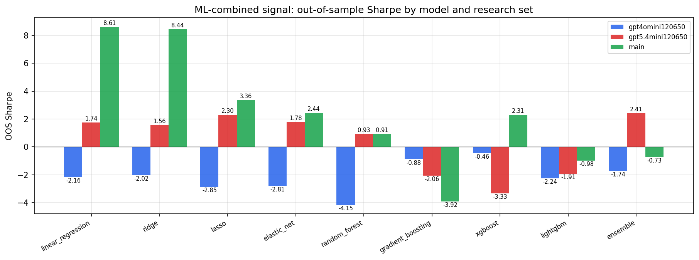

*ML-combined OOS Sharpe by model and research set*

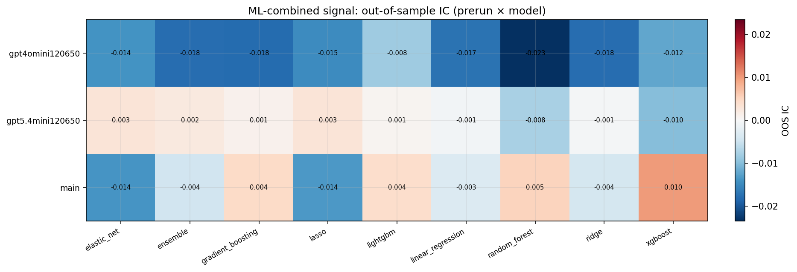

*ML-combined OOS IC (prerun × model)*

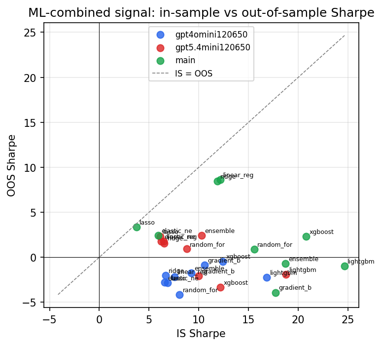

*IS vs OOS Sharpe (overfitting diagnostic)*

---
*Generated by `run_model_comparison.py`. Tables: `*.csv`; interactive: `comparison.ipynb`.*
