# Research-LLM factor comparison — `2025-12`

Comparing the **factor output of different research LLMs** on three axes (raw factor quality → factors as ML features → factors through the full agentic fund). The panel, IS/OOS split, horizon and model hyper-parameters are held identical across preruns — the *only* variable is the factor set.

## Preruns compared

| prerun | research_model | usable_factors | dropped_factors |
| --- | --- | --- | --- |
| gpt4omini120650 | gpt-4o-mini | 66 | 0 |
| gpt5.4mini120650 | gpt-5.4-mini | 69 | 0 |
| main | seed library | 78 | 10 |

> Dropped factors declare fields the current data doesn't have yet (e.g. fundamentals); they light up unchanged once that data is downloaded.

*Usable vs awaiting-data factors per research model*

## Key findings

- **Best ML-combined OOS Sharpe:** `gpt5.4mini120650` with `gradient_boosting` (OOS Sharpe = 4.776).
- **Mean OOS Sharpe across models, by research set:** `gpt5.4mini120650` = 1.961, `gpt4omini120650` = 1.549, `main` = -2.826.
- **Highest mean single-factor |IC| (h=6):** `gpt5.4mini120650` (mean |IC| = 0.0054).
- **Most diverse zoo (highest effective/raw factor ratio):** `gpt5.4mini120650` (eff 38.4 of 69, ratio 0.56).
- **Best selection-deflated single-factor |IC|:** `gpt5.4mini120650` (deflated |IC| = 0.0096 from 31 factors tried).

## 1. Single-factor IC (raw factor quality)

Per-underlying time-series Spearman rank-IC of every researched factor, recomputed on the shared panel at horizons h=1, h=6, h=60. The per-underlying IC correlates each factor's value vector with the underlying's own forward-return vector (pooled across underlyings); the cross-sectional IC ranks across underlyings per timestamp.

| prerun | n_factors | mean_abs_ic_1 | mean_abs_ic_6 | mean_abs_ic_60 | mean_abs_icir_6 | best_factor_h6 | best_abs_ic_h6 |
| --- | --- | --- | --- | --- | --- | --- | --- |
| gpt4omini120650 | 66 | 0.0052 | 0.0053 | 0.0072 | 0.297 | hidden_volume_exploration | 0.016 |
| gpt5.4mini120650 | 69 | 0.0043 | 0.0054 | 0.0064 | 0.2629 | queue_clog_clearing_reversion | 0.0164 |
| main | 78 | 0.0081 | 0.0047 | 0.005 | 0.3569 | alpha_046 | 0.0119 |

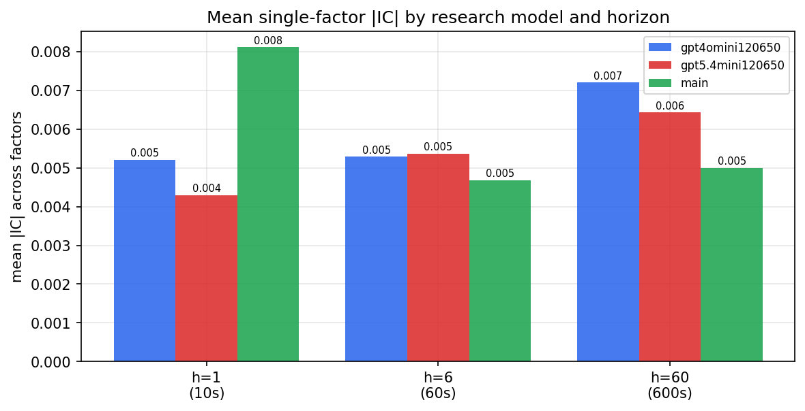

*Mean |IC| by research model and horizon*

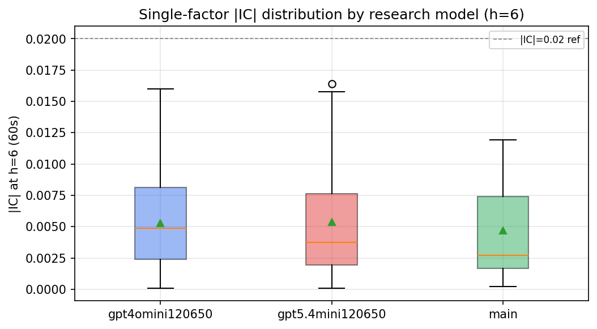

*Per-factor |IC| distribution by research model*

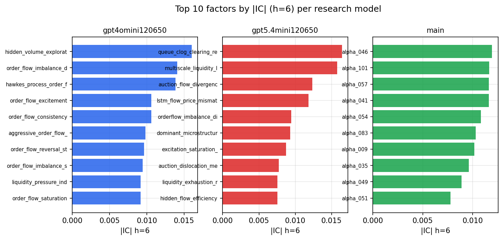

*Top factors by |IC| per research model*

## 2. Factor diversity & redundancy

Pairwise correlation of each zoo's *signals*. `eff_n_factors` is the effective number of independent factors (participation ratio of the correlation eigenvalues); `eff_ratio` and `redundancy` summarise how much unique information the zoo holds vs. how much is duplicated; `n_clusters` groups factors at |corr| ≥ 0.7.

| prerun | n_factors | eff_n_factors | eff_ratio | mean_abs_corr | n_clusters | redundancy |
| --- | --- | --- | --- | --- | --- | --- |
| gpt4omini120650 | 66 | 26.5982 | 0.403 | 0.0537 | 50 | 0.597 |
| gpt5.4mini120650 | 69 | 38.4427 | 0.5571 | 0.0186 | 60 | 0.4429 |
| main | 78 | 42.7154 | 0.5476 | 0.0287 | 72 | 0.4524 |

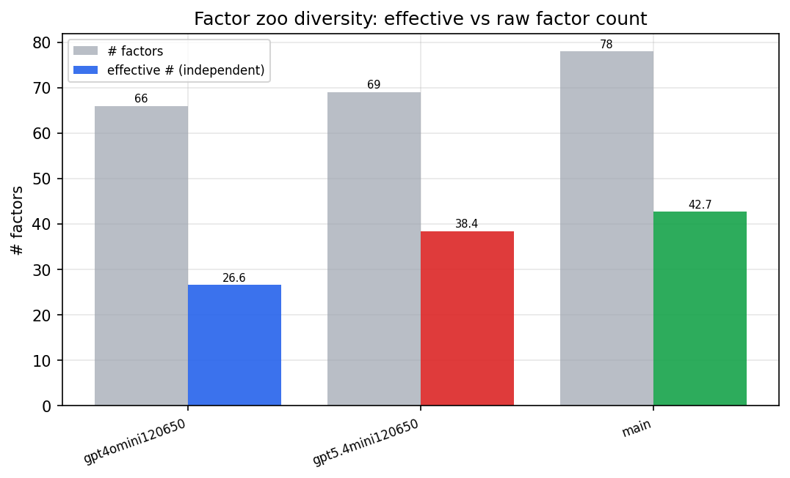

*Effective vs raw factor count per research model*

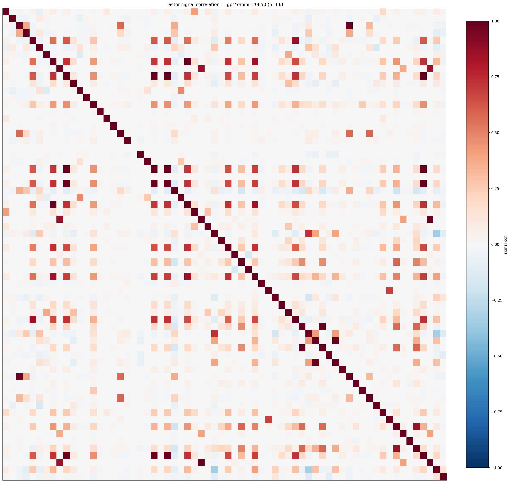

*Signal correlation matrix — gpt4omini120650*

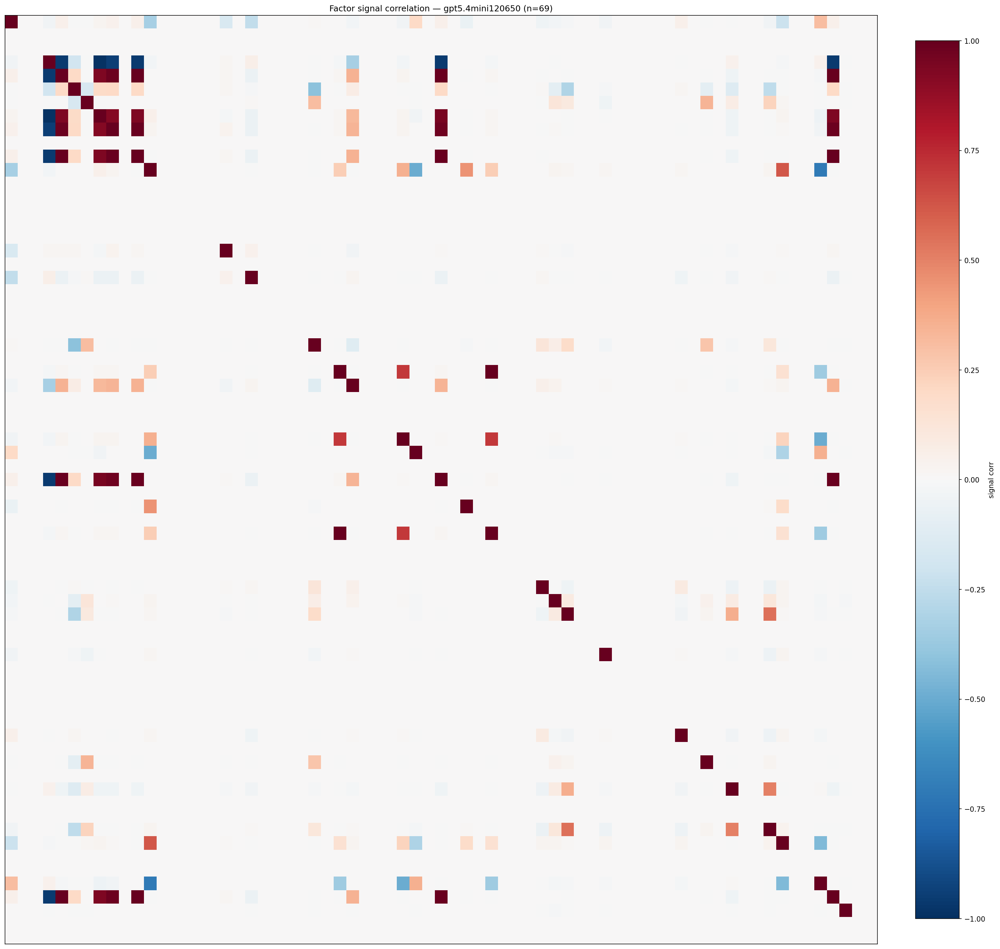

*Signal correlation matrix — gpt5.4mini120650*

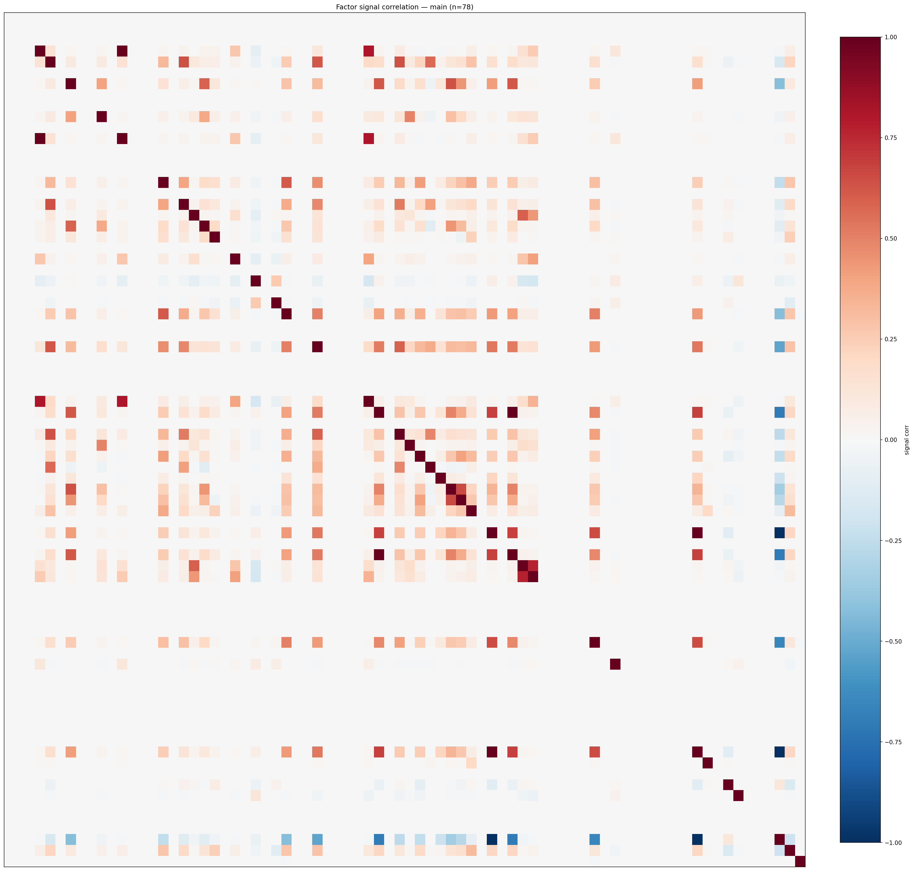

*Signal correlation matrix — main*

## 3. Deflation & model-based importance

`deflated_best_ic` haircuts each zoo's best |IC| for the number of factors tried (`ic_n_tested`) — a bigger zoo's best factor is more likely to be lucky. `lasso_n_nonzero` / `lasso_sparsity` show how many factors a sparse linear model actually keeps (model-view redundancy).

| prerun | best_ic | deflated_best_ic | deflated_best_t | ic_n_tested | ic_n_obs | lasso_n_nonzero | lasso_sparsity |
| --- | --- | --- | --- | --- | --- | --- | --- |
| gpt4omini120650 | 0.016 | 0.0085 | 3.2689 | 64 | 147599 | 4 | 0.9394 |
| gpt5.4mini120650 | 0.0164 | 0.0096 | 3.6841 | 31 | 147599 | 4 | 0.942 |
| main | 0.0119 | 0.0049 | 1.8897 | 38 | 147599 | 15 | 0.8077 |

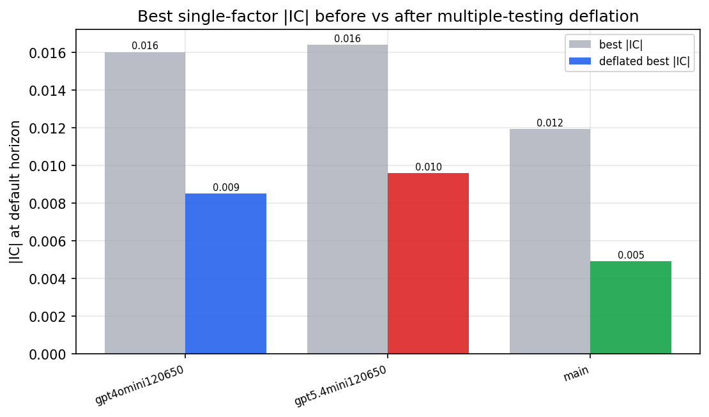

*Best |IC| before vs after multiple-testing deflation*

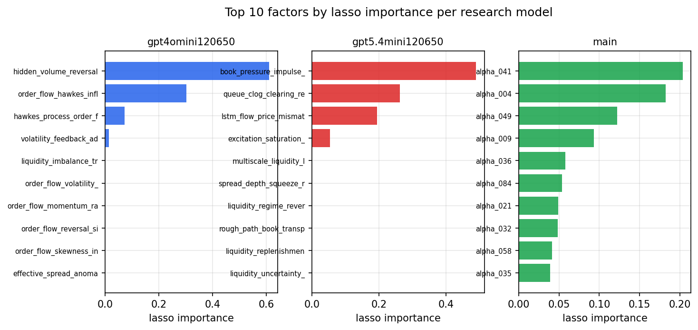

*Top factors by lasso importance per zoo*

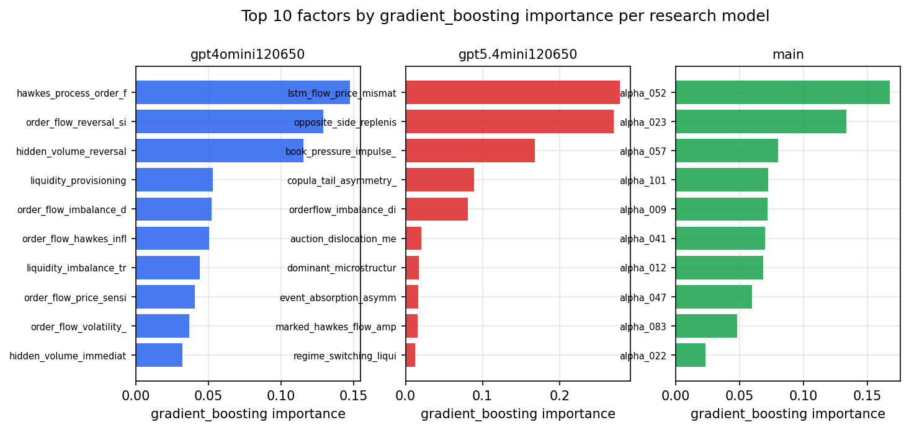

*Top factors by gradient_boosting importance per zoo*

## 4. ML-combined signal — per-underlying vectorised backtest

Each model combines a prerun's factors into ONE signal (fit `factors → forward return` on IS, predict per (bar, underlying)), then that combined signal is run through a simple vectorised backtest — `position(signal) × the underlying's own forward return` — on the held-out OOS tail (+ an equal-weight ensemble). No cross-sectional ranking.

> Config: position=**threshold** (t=1.0, z-score `expanding`), aggregation=**portfolio**, fit-standardise=**per_underlying**, horizon=6.

| prerun | model | n_factors_used | oos_ic | oos_sharpe | is_sharpe | oos_ann_return | oos_max_drawdown |
| --- | --- | --- | --- | --- | --- | --- | --- |
| gpt4omini120650 | linear_regression | 66 | 0.0134 | 3.0289 | 5.4781 | 0.2404 | -0.0115 |
| gpt4omini120650 | ridge | 66 | 0.0174 | 2.3781 | 4.3494 | 0.1905 | -0.0129 |
| gpt4omini120650 | lasso | 66 | 0.0102 | 2.0566 | 2.0317 | 0.1125 | -0.0109 |
| gpt4omini120650 | elastic_net | 66 | 0.0102 | 2.0566 | 2.0317 | 0.1125 | -0.0109 |
| gpt4omini120650 | random_forest | 66 | 0.0004 | -0.0257 | 10.301 | -0.0021 | -0.0222 |
| gpt4omini120650 | gradient_boosting | 66 | 0.0029 | 3.2549 | 9.597 | 0.1588 | -0.0096 |
| gpt4omini120650 | xgboost | 66 | 0.0043 | 0.8777 | 13.4979 | 0.0592 | -0.0105 |
| gpt4omini120650 | lightgbm | 66 | 0.0028 | -0.7122 | 19.2523 | -0.0466 | -0.0175 |
| gpt4omini120650 | ensemble | 66 | 0.0151 | 1.0292 | 11.4831 | 0.0753 | -0.0157 |
| gpt5.4mini120650 | linear_regression | 69 | -0.0032 | 0.5381 | 8.0891 | 0.041 | -0.0152 |
| gpt5.4mini120650 | ridge | 69 | -0.0032 | 0.4607 | 8.1379 | 0.0351 | -0.0153 |
| gpt5.4mini120650 | lasso | 69 | 0.0061 | 0.4883 | 6.4889 | 0.0392 | -0.0164 |
| gpt5.4mini120650 | elastic_net | 69 | 0.0061 | 0.5482 | 6.5423 | 0.0441 | -0.0162 |
| gpt5.4mini120650 | random_forest | 69 | 0.0037 | 2.4141 | 8.4746 | 0.1577 | -0.008 |
| gpt5.4mini120650 | gradient_boosting | 69 | -0.0034 | 4.7756 | 10.9508 | 0.1948 | -0.0041 |
| gpt5.4mini120650 | xgboost | 69 | 0.0019 | 3.449 | 12.6172 | 0.2148 | -0.0067 |
| gpt5.4mini120650 | lightgbm | 69 | -0.0008 | 4.1216 | 20.098 | 0.2168 | -0.0055 |
| gpt5.4mini120650 | ensemble | 69 | 0.0004 | 0.8508 | 11.7345 | 0.062 | -0.013 |
| main | linear_regression | 78 | 0.0017 | 0.359 | 10.5565 | 0.0186 | -0.0138 |
| main | ridge | 78 | 0.0001 | -0.1765 | 10.0759 | -0.0093 | -0.0171 |
| main | lasso | 78 | -0.001 | -5.8742 | 6.378 | -0.2521 | -0.0255 |
| main | elastic_net | 78 | -0.001 | -5.8742 | 6.378 | -0.2521 | -0.0255 |
| main | random_forest | 78 | -0.0014 | -3.4041 | 15.4475 | -0.1294 | -0.0164 |
| main | gradient_boosting | 78 | 0.0012 | -1.157 | 15.454 | -0.0227 | -0.0061 |
| main | xgboost | 78 | -0.0045 | -3.0177 | 21.7402 | -0.0961 | -0.0134 |
| main | lightgbm | 78 | -0.0023 | -2.6317 | 27.5924 | -0.0605 | -0.0085 |
| main | ensemble | 78 | -0.0005 | -3.6605 | 19.8368 | -0.17 | -0.0219 |

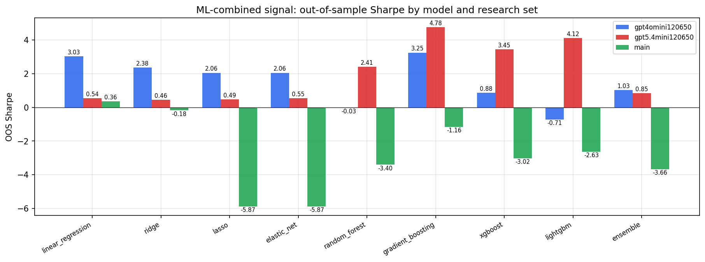

*ML-combined OOS Sharpe by model and research set*

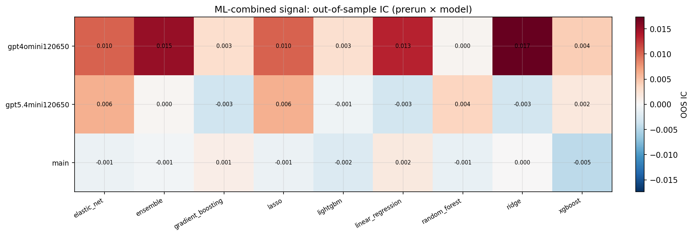

*ML-combined OOS IC (prerun × model)*

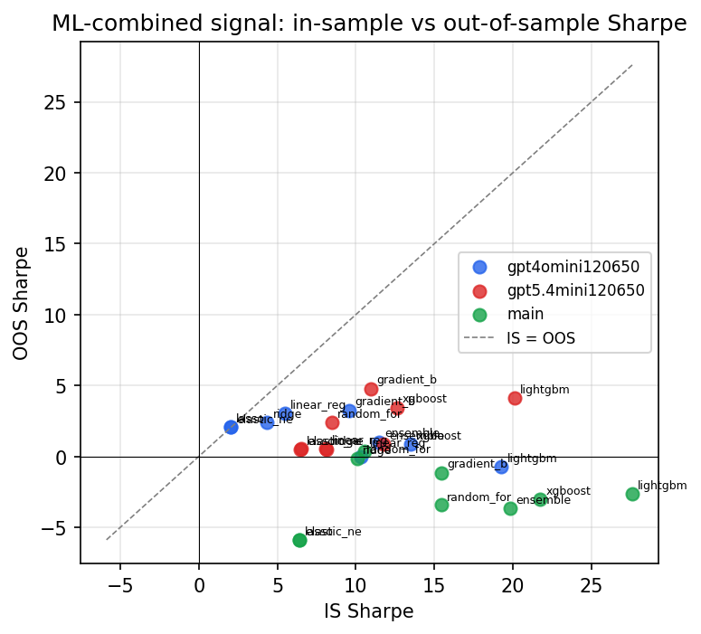

*IS vs OOS Sharpe (overfitting diagnostic)*

---
*Generated by `run_model_comparison.py`. Tables: `*.csv`; interactive: `comparison.ipynb`.*
