# Research-LLM factor comparison — `2026-01`

Comparing the **factor output of different research LLMs** on three axes (raw factor quality → factors as ML features → factors through the full agentic fund). The panel, IS/OOS split, horizon and model hyper-parameters are held identical across preruns — the *only* variable is the factor set.

## Preruns compared

| prerun | research_model | usable_factors | dropped_factors |
| --- | --- | --- | --- |
| gpt4omini120650 | gpt-4o-mini | 66 | 0 |
| gpt5.4mini120650 | gpt-5.4-mini | 69 | 0 |
| main | seed library | 78 | 10 |

> Dropped factors declare fields the current data doesn't have yet (e.g. fundamentals); they light up unchanged once that data is downloaded.

*Usable vs awaiting-data factors per research model*

## Key findings

- **Best ML-combined OOS Sharpe:** `gpt5.4mini120650` with `random_forest` (OOS Sharpe = 6.772).
- **Mean OOS Sharpe across models, by research set:** `gpt5.4mini120650` = 2.718, `main` = 2.124, `gpt4omini120650` = 0.156.
- **Highest mean single-factor |IC| (h=6):** `main` (mean |IC| = 0.0051).
- **Most diverse zoo (highest effective/raw factor ratio):** `gpt5.4mini120650` (eff 39.4 of 69, ratio 0.57).
- **Best selection-deflated single-factor |IC|:** `main` (deflated |IC| = 0.0071 from 38 factors tried).

## 1. Single-factor IC (raw factor quality)

Per-underlying time-series Spearman rank-IC of every researched factor, recomputed on the shared panel at horizons h=1, h=6, h=60. The per-underlying IC correlates each factor's value vector with the underlying's own forward-return vector (pooled across underlyings); the cross-sectional IC ranks across underlyings per timestamp.

| prerun | n_factors | mean_abs_ic_1 | mean_abs_ic_6 | mean_abs_ic_60 | mean_abs_icir_6 | best_factor_h6 | best_abs_ic_h6 |
| --- | --- | --- | --- | --- | --- | --- | --- |
| gpt4omini120650 | 66 | 0.0057 | 0.0035 | 0.0056 | 0.219 | hidden_volume_exploration | 0.0105 |
| gpt5.4mini120650 | 69 | 0.0044 | 0.0035 | 0.0063 | 0.2456 | rough_path_book_transport | 0.0104 |
| main | 78 | 0.0091 | 0.0051 | 0.0036 | 0.3504 | alpha_046 | 0.0143 |

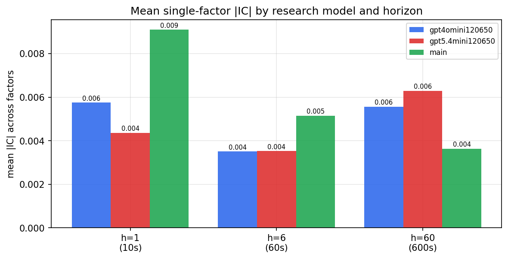

*Mean |IC| by research model and horizon*

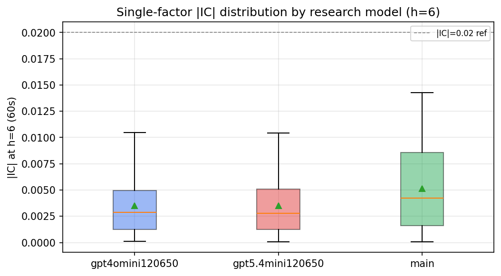

*Per-factor |IC| distribution by research model*

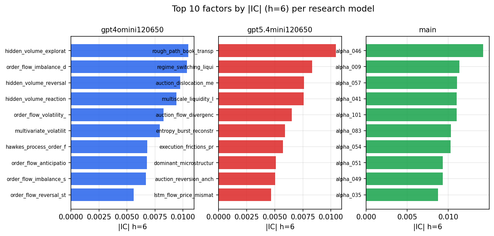

*Top factors by |IC| per research model*

## 2. Factor diversity & redundancy

Pairwise correlation of each zoo's *signals*. `eff_n_factors` is the effective number of independent factors (participation ratio of the correlation eigenvalues); `eff_ratio` and `redundancy` summarise how much unique information the zoo holds vs. how much is duplicated; `n_clusters` groups factors at |corr| ≥ 0.7.

| prerun | n_factors | eff_n_factors | eff_ratio | mean_abs_corr | n_clusters | redundancy |
| --- | --- | --- | --- | --- | --- | --- |
| gpt4omini120650 | 66 | 26.6159 | 0.4033 | 0.0516 | 48 | 0.5967 |
| gpt5.4mini120650 | 69 | 39.4438 | 0.5716 | 0.0175 | 60 | 0.4284 |
| main | 78 | 42.4039 | 0.5436 | 0.0285 | 71 | 0.4564 |

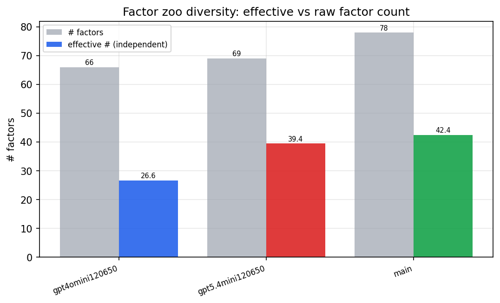

*Effective vs raw factor count per research model*

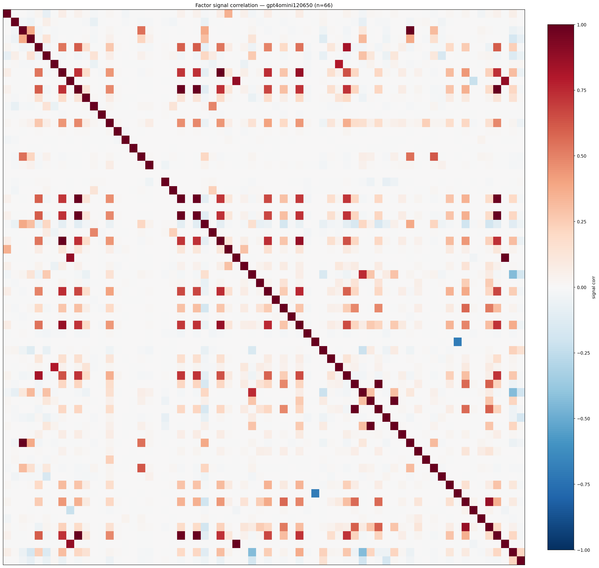

*Signal correlation matrix — gpt4omini120650*

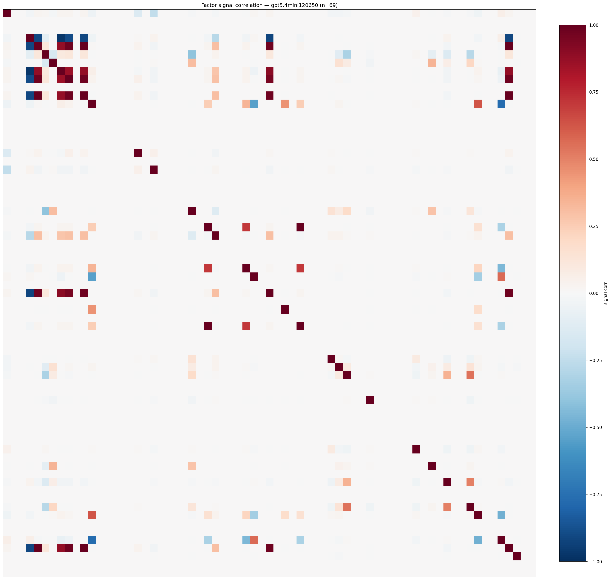

*Signal correlation matrix — gpt5.4mini120650*

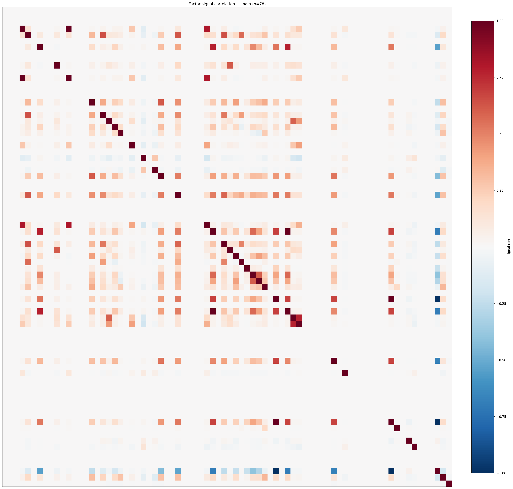

*Signal correlation matrix — main*

## 3. Deflation & model-based importance

`deflated_best_ic` haircuts each zoo's best |IC| for the number of factors tried (`ic_n_tested`) — a bigger zoo's best factor is more likely to be lucky. `lasso_n_nonzero` / `lasso_sparsity` show how many factors a sparse linear model actually keeps (model-view redundancy).

| prerun | best_ic | deflated_best_ic | deflated_best_t | ic_n_tested | ic_n_obs | lasso_n_nonzero | lasso_sparsity |
| --- | --- | --- | --- | --- | --- | --- | --- |
| gpt4omini120650 | 0.0105 | 0.0028 | 1.0421 | 64 | 140579 | 0 | 1.0 |
| gpt5.4mini120650 | 0.0104 | 0.0034 | 1.2899 | 31 | 140579 | 0 | 1.0 |
| main | 0.0143 | 0.0071 | 2.6505 | 38 | 140579 | 0 | 1.0 |

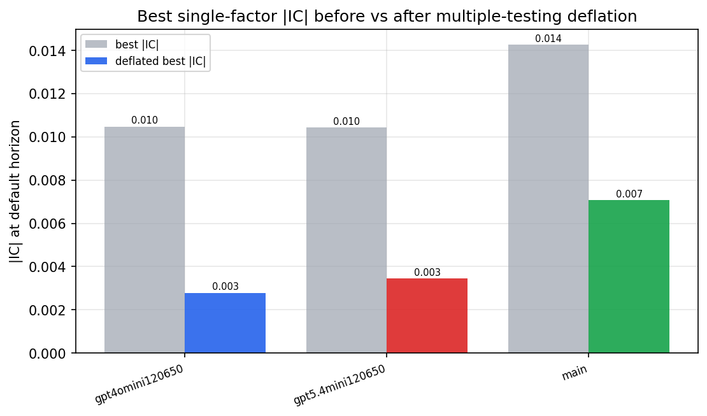

*Best |IC| before vs after multiple-testing deflation*

*Top factors by lasso importance per zoo*

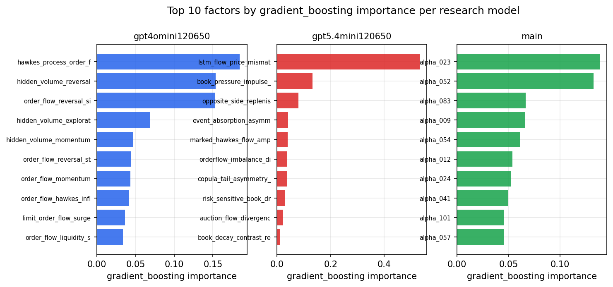

*Top factors by gradient_boosting importance per zoo*

## 4. ML-combined signal — per-underlying vectorised backtest

Each model combines a prerun's factors into ONE signal (fit `factors → forward return` on IS, predict per (bar, underlying)), then that combined signal is run through a simple vectorised backtest — `position(signal) × the underlying's own forward return` — on the held-out OOS tail (+ an equal-weight ensemble). No cross-sectional ranking.

> Config: position=**threshold** (t=1.0, z-score `expanding`), aggregation=**portfolio**, fit-standardise=**per_underlying**, horizon=6.

| prerun | model | n_factors_used | oos_ic | oos_sharpe | is_sharpe | oos_ann_return | oos_max_drawdown |
| --- | --- | --- | --- | --- | --- | --- | --- |
| gpt4omini120650 | linear_regression | 66 | 0.0076 | -1.0282 | 6.8157 | -0.0664 | -0.0196 |
| gpt4omini120650 | ridge | 66 | 0.0072 | -0.2149 | 6.6143 | -0.0137 | -0.019 |
| gpt4omini120650 | lasso | 66 | nan | nan | nan | nan | nan |
| gpt4omini120650 | elastic_net | 66 | nan | nan | nan | nan | nan |
| gpt4omini120650 | random_forest | 66 | 0.0 | -1.4296 | 14.4718 | -0.0913 | -0.0258 |
| gpt4omini120650 | gradient_boosting | 66 | 0.0051 | -4.1837 | 10.3722 | -0.1409 | -0.0181 |
| gpt4omini120650 | xgboost | 66 | 0.0102 | 1.1585 | 16.4738 | 0.041 | -0.0081 |
| gpt4omini120650 | lightgbm | 66 | 0.0085 | 5.3823 | 25.9157 | 0.3093 | -0.0084 |
| gpt4omini120650 | ensemble | 66 | 0.0112 | 1.406 | 17.7944 | 0.0847 | -0.0209 |
| gpt5.4mini120650 | linear_regression | 69 | -0.0028 | 0.4339 | 4.6751 | 0.0319 | -0.0166 |
| gpt5.4mini120650 | ridge | 69 | -0.0027 | 0.4543 | 4.6915 | 0.0335 | -0.0165 |
| gpt5.4mini120650 | lasso | 69 | nan | nan | nan | nan | nan |
| gpt5.4mini120650 | elastic_net | 69 | nan | nan | nan | nan | nan |
| gpt5.4mini120650 | random_forest | 69 | -0.0025 | 6.7725 | 8.207 | 0.3541 | -0.0076 |
| gpt5.4mini120650 | gradient_boosting | 69 | 0.0107 | 5.3386 | 10.14 | 0.0867 | -0.0029 |
| gpt5.4mini120650 | xgboost | 69 | -0.0061 | 1.7204 | 14.3422 | 0.0512 | -0.0055 |
| gpt5.4mini120650 | lightgbm | 69 | -0.0016 | 1.5058 | 21.9214 | 0.0528 | -0.0078 |
| gpt5.4mini120650 | ensemble | 69 | -0.002 | 2.8033 | 14.9542 | 0.1575 | -0.007 |
| main | linear_regression | 78 | 0.0003 | 1.1 | 7.0678 | 0.0458 | -0.0137 |
| main | ridge | 78 | 0.0009 | 0.6018 | 7.116 | 0.0248 | -0.0142 |
| main | lasso | 78 | nan | nan | nan | nan | nan |
| main | elastic_net | 78 | nan | nan | nan | nan | nan |
| main | random_forest | 78 | 0.0039 | 3.8 | 12.3648 | 0.1349 | -0.0058 |
| main | gradient_boosting | 78 | 0.0004 | 0.3304 | 11.7629 | 0.0063 | -0.0085 |
| main | xgboost | 78 | -0.0034 | 4.2942 | 17.9551 | 0.1237 | -0.0058 |
| main | lightgbm | 78 | 0.0001 | 2.1232 | 25.1425 | 0.049 | -0.0049 |
| main | ensemble | 78 | 0.0006 | 2.6198 | 17.9344 | 0.0841 | -0.0129 |

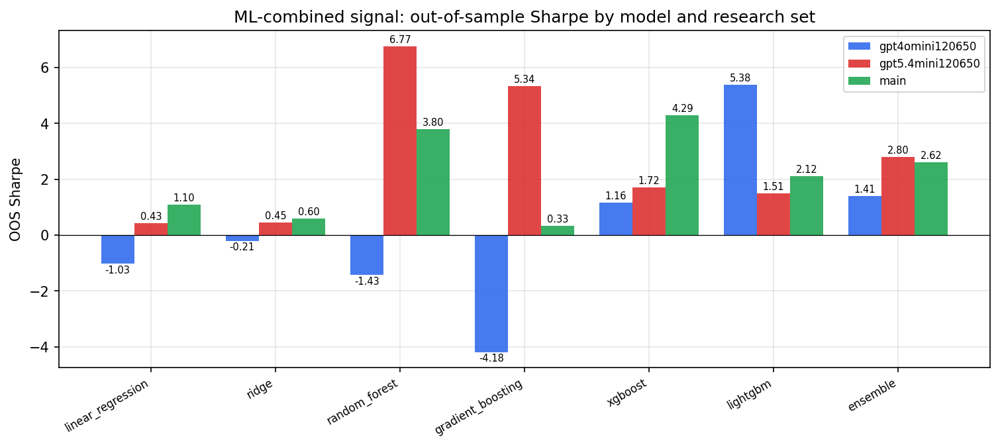

*ML-combined OOS Sharpe by model and research set*

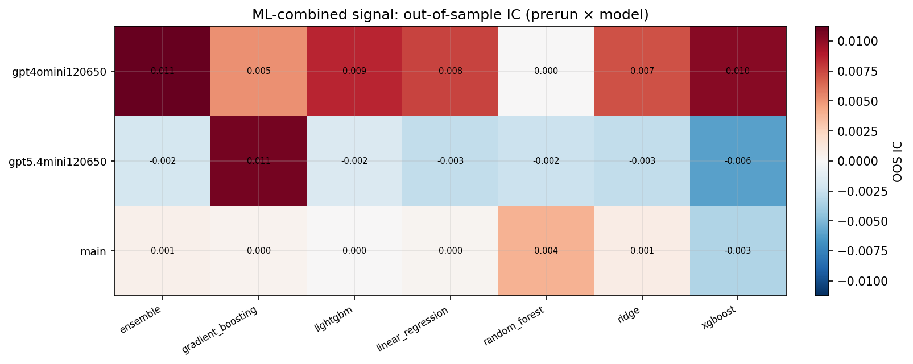

*ML-combined OOS IC (prerun × model)*

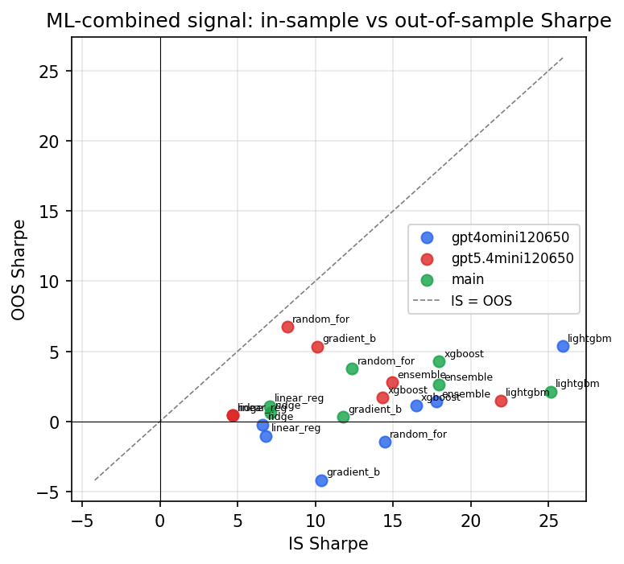

*IS vs OOS Sharpe (overfitting diagnostic)*

---
*Generated by `run_model_comparison.py`. Tables: `*.csv`; interactive: `comparison.ipynb`.*
