# Research-LLM factor comparison — `2026-02`

Comparing the **factor output of different research LLMs** on three axes (raw factor quality → factors as ML features → factors through the full agentic fund). The panel, IS/OOS split, horizon and model hyper-parameters are held identical across preruns — the *only* variable is the factor set.

## Preruns compared

| prerun | research_model | usable_factors | dropped_factors |
| --- | --- | --- | --- |
| gpt4omini120650 | gpt-4o-mini | 66 | 0 |
| gpt5.4mini120650 | gpt-5.4-mini | 69 | 0 |
| main | seed library | 78 | 10 |

> Dropped factors declare fields the current data doesn't have yet (e.g. fundamentals); they light up unchanged once that data is downloaded.

*Usable vs awaiting-data factors per research model*

## Key findings

- **Best ML-combined OOS Sharpe:** `gpt4omini120650` with `elastic_net` (OOS Sharpe = 4.640).
- **Mean OOS Sharpe across models, by research set:** `gpt4omini120650` = 2.722, `gpt5.4mini120650` = 0.100, `main` = -0.502.
- **Highest mean single-factor |IC| (h=6):** `main` (mean |IC| = 0.0064).
- **Most diverse zoo (highest effective/raw factor ratio):** `gpt5.4mini120650` (eff 53.1 of 69, ratio 0.77).
- **Best selection-deflated single-factor |IC|:** `main` (deflated |IC| = 0.0084 from 38 factors tried).

## 1. Single-factor IC (raw factor quality)

Per-underlying time-series Spearman rank-IC of every researched factor, recomputed on the shared panel at horizons h=1, h=6, h=60. The per-underlying IC correlates each factor's value vector with the underlying's own forward-return vector (pooled across underlyings); the cross-sectional IC ranks across underlyings per timestamp.

| prerun | n_factors | mean_abs_ic_1 | mean_abs_ic_6 | mean_abs_ic_60 | mean_abs_icir_6 | best_factor_h6 | best_abs_ic_h6 |
| --- | --- | --- | --- | --- | --- | --- | --- |
| gpt4omini120650 | 66 | 0.0067 | 0.0048 | 0.0044 | 0.3008 | hidden_volume_reversal_strength | 0.013 |
| gpt5.4mini120650 | 69 | 0.0047 | 0.0044 | 0.0054 | 0.2673 | liquidity_impact_stress_ratio | 0.0106 |
| main | 78 | 0.0106 | 0.0064 | 0.0024 | 0.4265 | alpha_051 | 0.0156 |

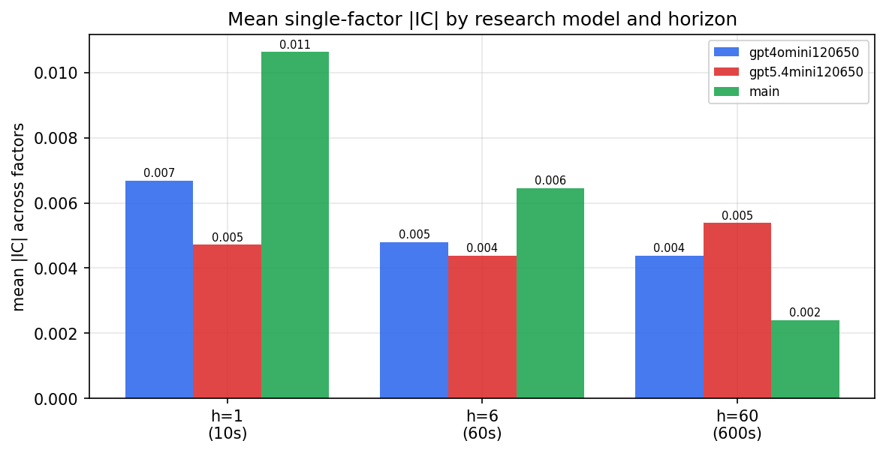

*Mean |IC| by research model and horizon*

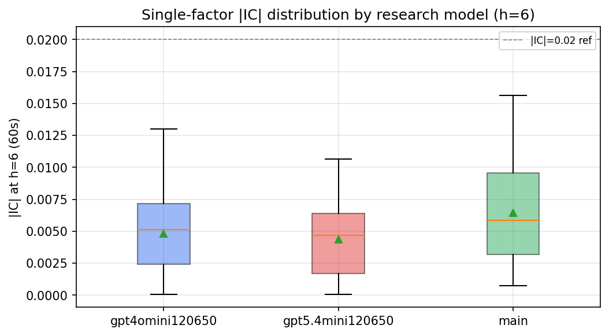

*Per-factor |IC| distribution by research model*

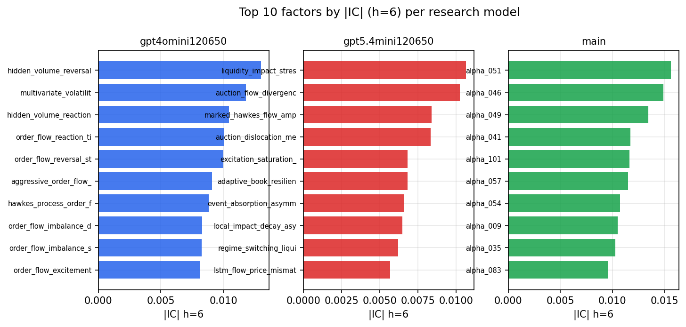

*Top factors by |IC| per research model*

## 2. Factor diversity & redundancy

Pairwise correlation of each zoo's *signals*. `eff_n_factors` is the effective number of independent factors (participation ratio of the correlation eigenvalues); `eff_ratio` and `redundancy` summarise how much unique information the zoo holds vs. how much is duplicated; `n_clusters` groups factors at |corr| ≥ 0.7.

| prerun | n_factors | eff_n_factors | eff_ratio | mean_abs_corr | n_clusters | redundancy |
| --- | --- | --- | --- | --- | --- | --- |
| gpt4omini120650 | 66 | 26.702 | 0.4046 | 0.0513 | 51 | 0.5954 |
| gpt5.4mini120650 | 69 | 53.1426 | 0.7702 | 0.0108 | 64 | 0.2298 |
| main | 78 | 42.1474 | 0.5404 | 0.0288 | 71 | 0.4596 |

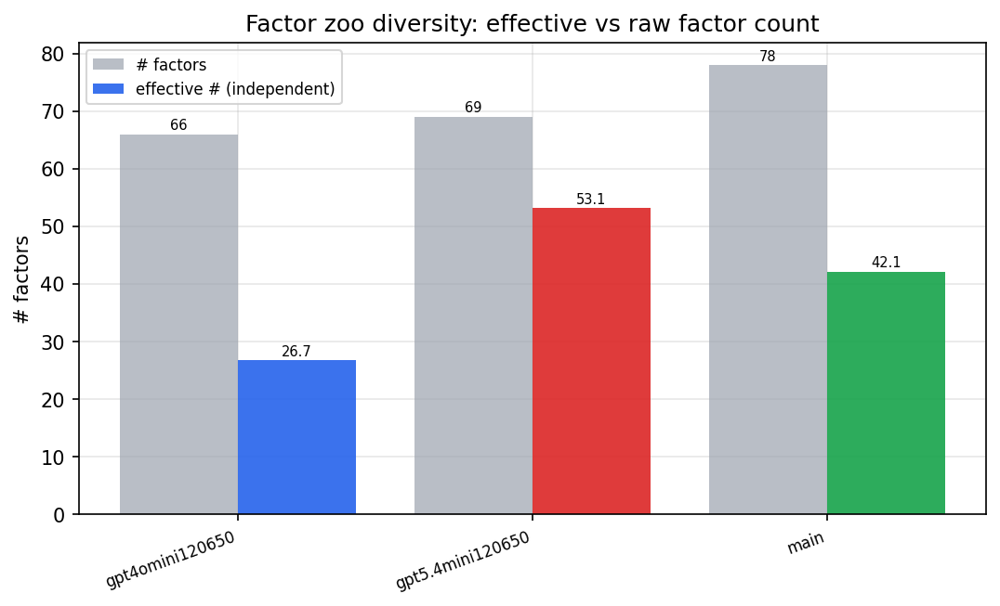

*Effective vs raw factor count per research model*

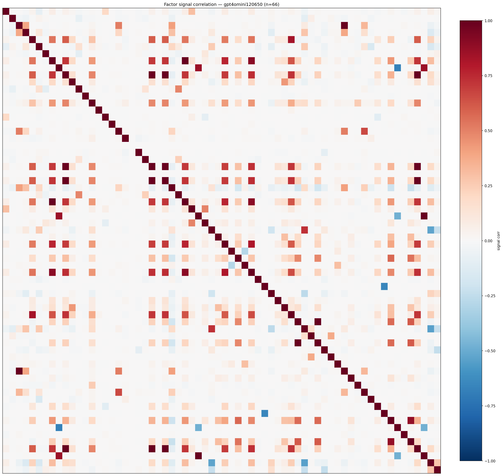

*Signal correlation matrix — gpt4omini120650*

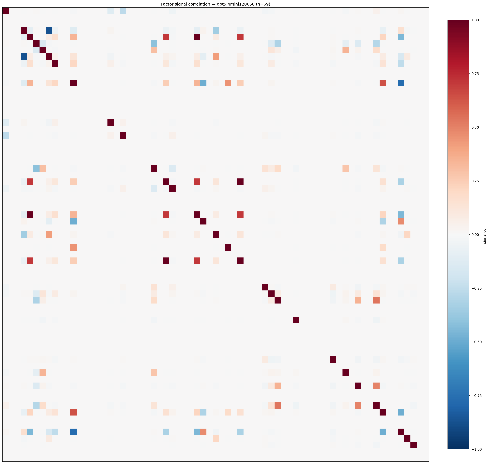

*Signal correlation matrix — gpt5.4mini120650*

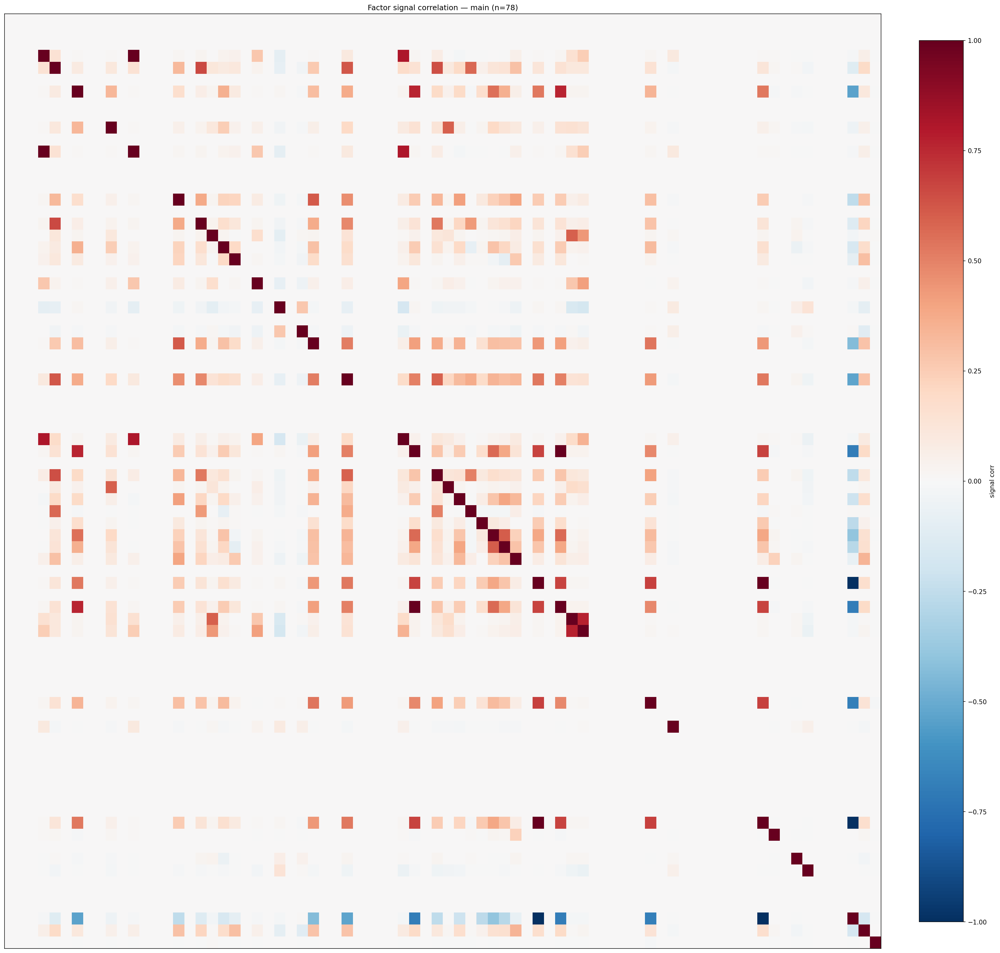

*Signal correlation matrix — main*

## 3. Deflation & model-based importance

`deflated_best_ic` haircuts each zoo's best |IC| for the number of factors tried (`ic_n_tested`) — a bigger zoo's best factor is more likely to be lucky. `lasso_n_nonzero` / `lasso_sparsity` show how many factors a sparse linear model actually keeps (model-view redundancy).

| prerun | best_ic | deflated_best_ic | deflated_best_t | ic_n_tested | ic_n_obs | lasso_n_nonzero | lasso_sparsity |
| --- | --- | --- | --- | --- | --- | --- | --- |
| gpt4omini120650 | 0.013 | 0.0054 | 2.0148 | 64 | 141659 | 0 | 1.0 |
| gpt5.4mini120650 | 0.0106 | 0.0037 | 1.3933 | 30 | 141659 | 0 | 1.0 |
| main | 0.0156 | 0.0084 | 3.1768 | 38 | 141659 | 0 | 1.0 |

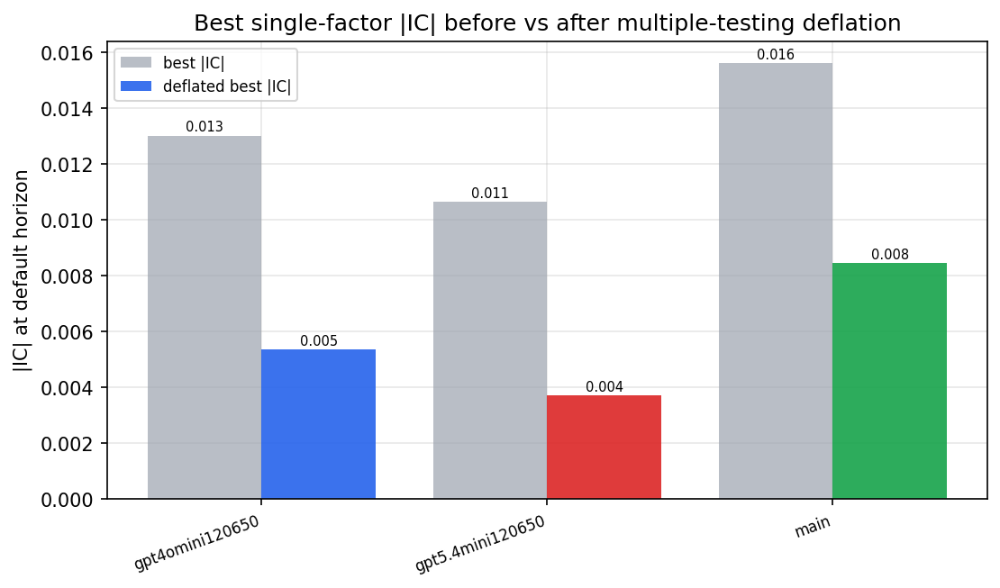

*Best |IC| before vs after multiple-testing deflation*

*Top factors by lasso importance per zoo*

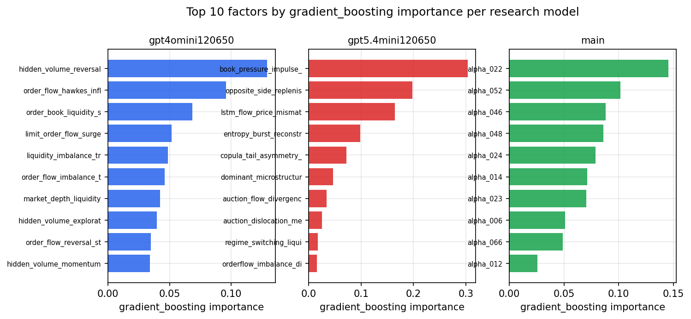

*Top factors by gradient_boosting importance per zoo*

## 4. ML-combined signal — per-underlying vectorised backtest

Each model combines a prerun's factors into ONE signal (fit `factors → forward return` on IS, predict per (bar, underlying)), then that combined signal is run through a simple vectorised backtest — `position(signal) × the underlying's own forward return` — on the held-out OOS tail (+ an equal-weight ensemble). No cross-sectional ranking.

> Config: position=**threshold** (t=1.0, z-score `expanding`), aggregation=**portfolio**, fit-standardise=**per_underlying**, horizon=6.

| prerun | model | n_factors_used | oos_ic | oos_sharpe | is_sharpe | oos_ann_return | oos_max_drawdown |
| --- | --- | --- | --- | --- | --- | --- | --- |
| gpt4omini120650 | linear_regression | 66 | 0.0078 | 3.7671 | 5.072 | 0.2959 | -0.0174 |
| gpt4omini120650 | ridge | 66 | 0.0096 | 3.7918 | 5.3295 | 0.3152 | -0.0189 |
| gpt4omini120650 | lasso | 66 | 0.0074 | 4.5582 | 4.0826 | 0.3498 | -0.0221 |
| gpt4omini120650 | elastic_net | 66 | 0.0081 | 4.6398 | 3.9876 | 0.3656 | -0.022 |
| gpt4omini120650 | random_forest | 66 | -0.0138 | 1.1727 | 8.7154 | 0.0494 | -0.0089 |
| gpt4omini120650 | gradient_boosting | 66 | 0.019 | 3.7941 | 10.3049 | 0.0761 | -0.0046 |
| gpt4omini120650 | xgboost | 66 | -0.0154 | 0.9096 | 13.0613 | 0.0406 | -0.0144 |
| gpt4omini120650 | lightgbm | 66 | -0.0119 | -0.4298 | 19.3343 | -0.0232 | -0.0246 |
| gpt4omini120650 | ensemble | 66 | 0.0052 | 2.2951 | 11.958 | 0.138 | -0.0196 |
| gpt5.4mini120650 | linear_regression | 69 | 0.0049 | -1.301 | 2.2436 | -0.1049 | -0.0234 |
| gpt5.4mini120650 | ridge | 69 | 0.0057 | -1.7033 | 2.4463 | -0.1427 | -0.0274 |
| gpt5.4mini120650 | lasso | 69 | 0.0052 | 0.1215 | 2.847 | 0.011 | -0.0182 |
| gpt5.4mini120650 | elastic_net | 69 | 0.0054 | -0.3413 | 2.9321 | -0.0306 | -0.0186 |
| gpt5.4mini120650 | random_forest | 69 | 0.0138 | -0.2058 | 7.4026 | -0.0108 | -0.0162 |
| gpt5.4mini120650 | gradient_boosting | 69 | 0.0163 | 3.3588 | 9.4257 | 0.0831 | -0.0041 |
| gpt5.4mini120650 | xgboost | 69 | 0.0083 | 0.9093 | 11.0263 | 0.0335 | -0.0103 |
| gpt5.4mini120650 | lightgbm | 69 | 0.0044 | -0.0805 | 17.5989 | -0.0023 | -0.0065 |
| gpt5.4mini120650 | ensemble | 69 | 0.0065 | 0.1421 | 9.7507 | 0.0099 | -0.0143 |
| main | linear_regression | 78 | -0.0032 | -2.9274 | 10.3219 | -0.1826 | -0.0203 |
| main | ridge | 78 | -0.0079 | -4.4938 | 10.8964 | -0.2944 | -0.0284 |
| main | lasso | 78 | nan | nan | nan | nan | nan |
| main | elastic_net | 78 | nan | nan | nan | nan | nan |
| main | random_forest | 78 | 0.0011 | -1.4038 | 17.3602 | -0.0699 | -0.0163 |
| main | gradient_boosting | 78 | 0.0053 | 3.1137 | 18.8888 | 0.1236 | -0.0142 |
| main | xgboost | 78 | 0.0068 | 1.2555 | 21.0027 | 0.0627 | -0.0179 |
| main | lightgbm | 78 | 0.008 | 2.3698 | 30.3617 | 0.1096 | -0.0135 |
| main | ensemble | 78 | 0.002 | -1.4289 | 20.8884 | -0.0761 | -0.0179 |

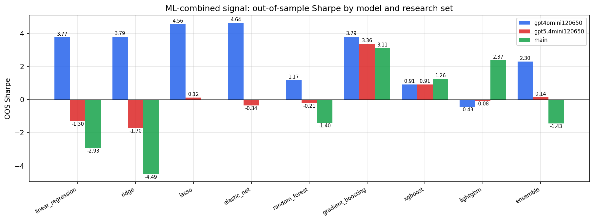

*ML-combined OOS Sharpe by model and research set*

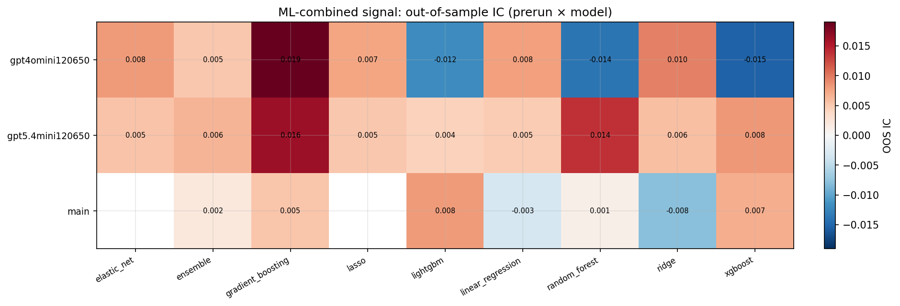

*ML-combined OOS IC (prerun × model)*

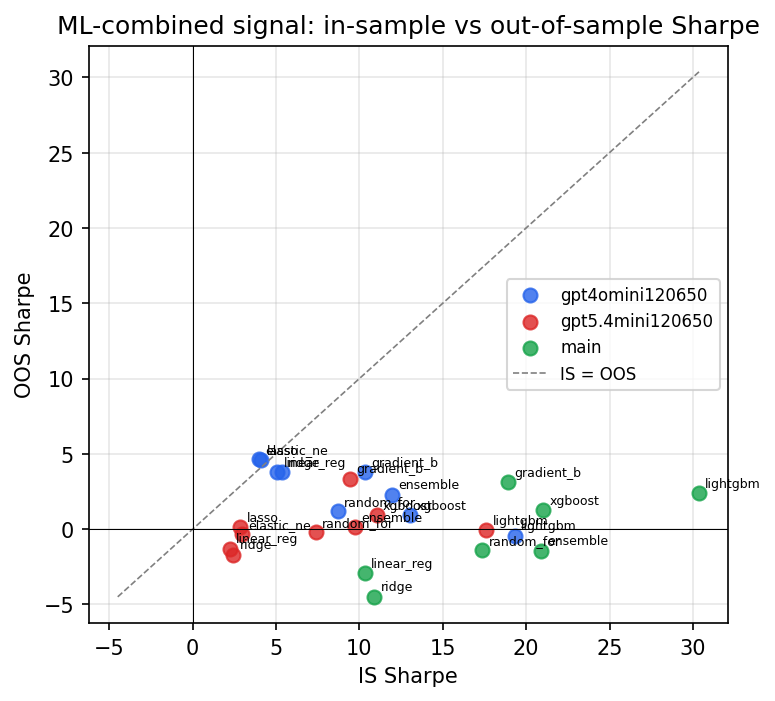

*IS vs OOS Sharpe (overfitting diagnostic)*

---
*Generated by `run_model_comparison.py`. Tables: `*.csv`; interactive: `comparison.ipynb`.*
