# Research-LLM factor comparison — `2026-03`

Comparing the **factor output of different research LLMs** on three axes (raw factor quality → factors as ML features → factors through the full agentic fund). The panel, IS/OOS split, horizon and model hyper-parameters are held identical across preruns — the *only* variable is the factor set.

## Preruns compared

| prerun | research_model | usable_factors | dropped_factors |
| --- | --- | --- | --- |
| gpt4omini120650 | gpt-4o-mini | 66 | 0 |
| gpt5.4mini120650 | gpt-5.4-mini | 69 | 0 |
| main | seed library | 78 | 10 |

> Dropped factors declare fields the current data doesn't have yet (e.g. fundamentals); they light up unchanged once that data is downloaded.

*Usable vs awaiting-data factors per research model*

## Key findings

- **Best ML-combined OOS Sharpe:** `gpt5.4mini120650` with `xgboost` (OOS Sharpe = 5.043).
- **Mean OOS Sharpe across models, by research set:** `gpt5.4mini120650` = 4.112, `gpt4omini120650` = 0.770, `main` = -0.779.
- **Highest mean single-factor |IC| (h=6):** `main` (mean |IC| = 0.0068).
- **Most diverse zoo (highest effective/raw factor ratio):** `gpt5.4mini120650` (eff 53.0 of 69, ratio 0.77).
- **Best selection-deflated single-factor |IC|:** `main` (deflated |IC| = 0.0086 from 38 factors tried).

## 1. Single-factor IC (raw factor quality)

Per-underlying time-series Spearman rank-IC of every researched factor, recomputed on the shared panel at horizons h=1, h=6, h=60. The per-underlying IC correlates each factor's value vector with the underlying's own forward-return vector (pooled across underlyings); the cross-sectional IC ranks across underlyings per timestamp.

| prerun | n_factors | mean_abs_ic_1 | mean_abs_ic_6 | mean_abs_ic_60 | mean_abs_icir_6 | best_factor_h6 | best_abs_ic_h6 |
| --- | --- | --- | --- | --- | --- | --- | --- |
| gpt4omini120650 | 66 | 0.008 | 0.0047 | 0.0055 | 0.2867 | order_flow_skewness_indicator | 0.0157 |
| gpt5.4mini120650 | 69 | 0.0047 | 0.0038 | 0.0058 | 0.2532 | marked_hawkes_flow_amplification | 0.011 |
| main | 78 | 0.0138 | 0.0068 | 0.003 | 0.3693 | alpha_041 | 0.0158 |

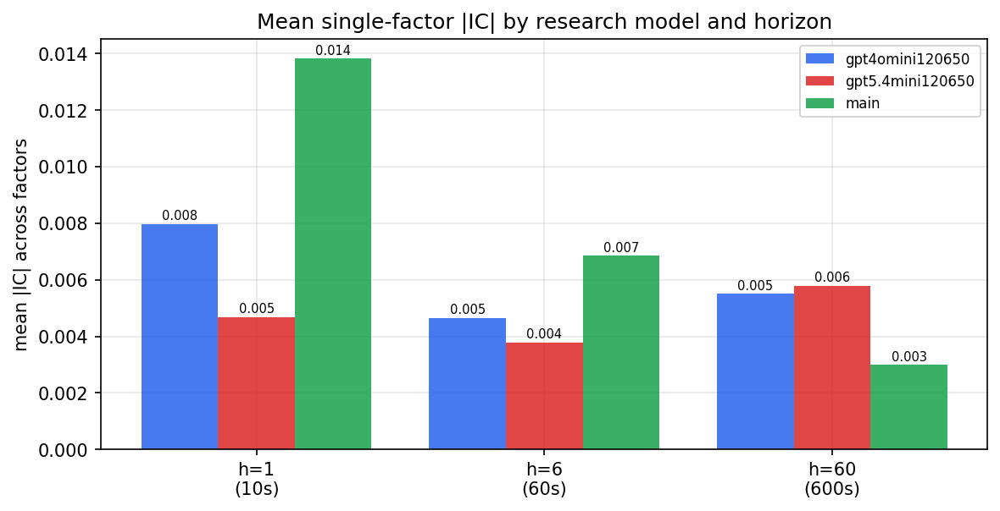

*Mean |IC| by research model and horizon*

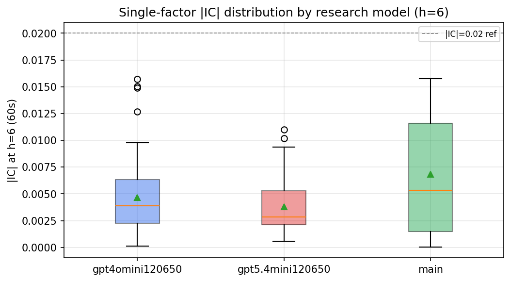

*Per-factor |IC| distribution by research model*

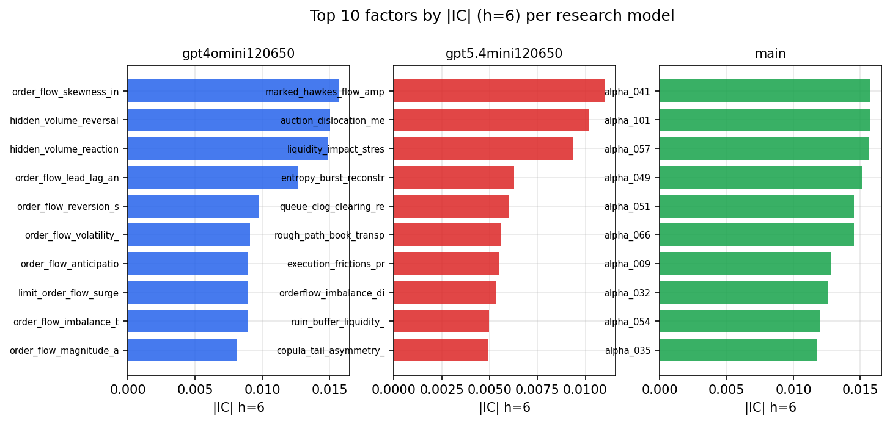

*Top factors by |IC| per research model*

## 2. Factor diversity & redundancy

Pairwise correlation of each zoo's *signals*. `eff_n_factors` is the effective number of independent factors (participation ratio of the correlation eigenvalues); `eff_ratio` and `redundancy` summarise how much unique information the zoo holds vs. how much is duplicated; `n_clusters` groups factors at |corr| ≥ 0.7.

| prerun | n_factors | eff_n_factors | eff_ratio | mean_abs_corr | n_clusters | redundancy |
| --- | --- | --- | --- | --- | --- | --- |
| gpt4omini120650 | 66 | 26.1325 | 0.3959 | 0.0528 | 51 | 0.6041 |
| gpt5.4mini120650 | 69 | 52.9807 | 0.7678 | 0.0112 | 64 | 0.2322 |
| main | 78 | 41.8902 | 0.5371 | 0.0294 | 71 | 0.4629 |

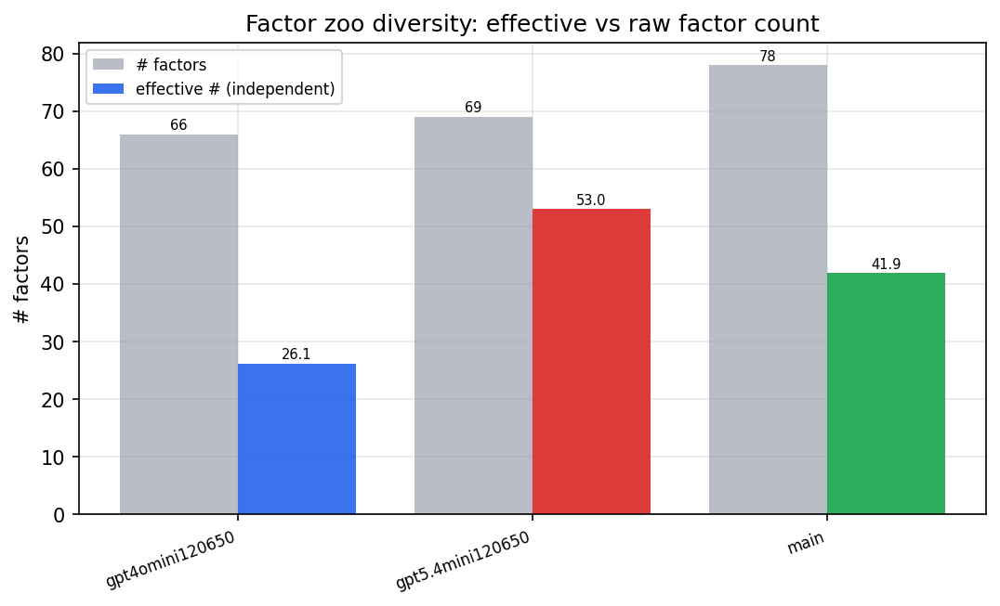

*Effective vs raw factor count per research model*

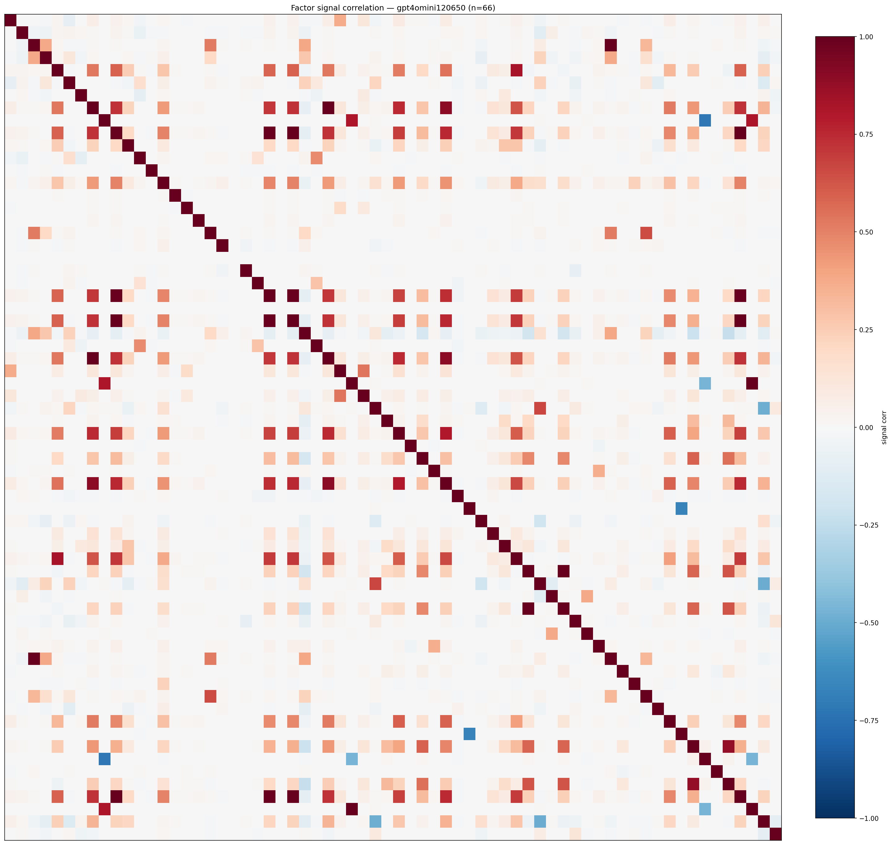

*Signal correlation matrix — gpt4omini120650*

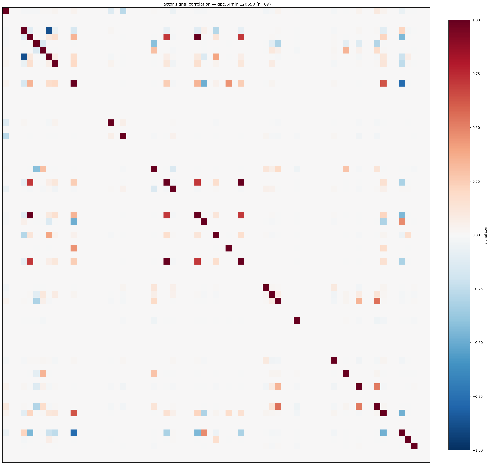

*Signal correlation matrix — gpt5.4mini120650*

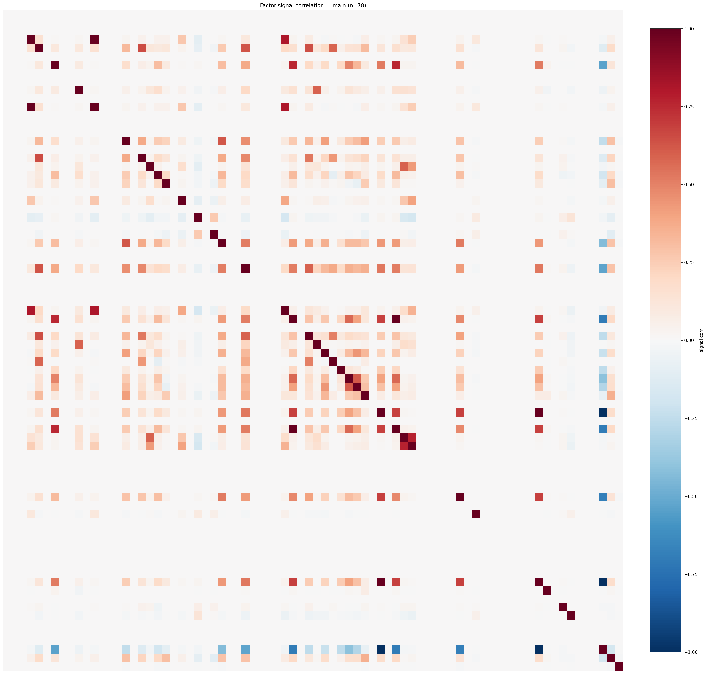

*Signal correlation matrix — main*

## 3. Deflation & model-based importance

`deflated_best_ic` haircuts each zoo's best |IC| for the number of factors tried (`ic_n_tested`) — a bigger zoo's best factor is more likely to be lucky. `lasso_n_nonzero` / `lasso_sparsity` show how many factors a sparse linear model actually keeps (model-view redundancy).

| prerun | best_ic | deflated_best_ic | deflated_best_t | ic_n_tested | ic_n_obs | lasso_n_nonzero | lasso_sparsity |
| --- | --- | --- | --- | --- | --- | --- | --- |
| gpt4omini120650 | 0.0157 | 0.0081 | 3.0501 | 64 | 142739 | 0 | 1.0 |
| gpt5.4mini120650 | 0.011 | 0.0041 | 1.5544 | 30 | 142739 | 0 | 1.0 |
| main | 0.0158 | 0.0086 | 3.2629 | 38 | 142739 | 0 | 1.0 |

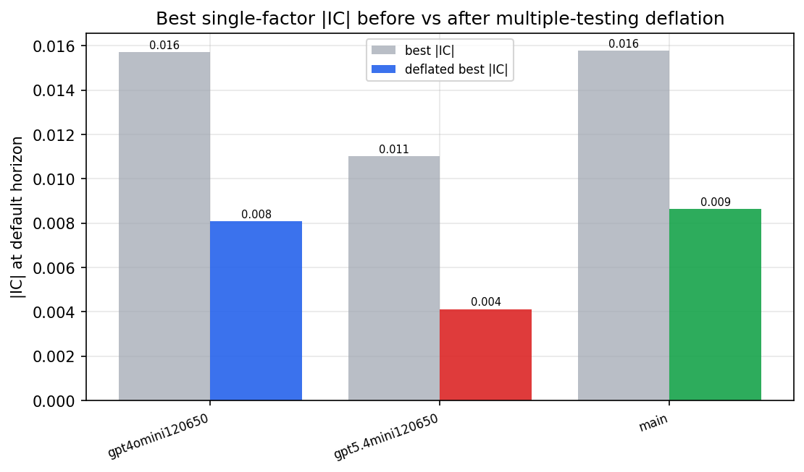

*Best |IC| before vs after multiple-testing deflation*

*Top factors by lasso importance per zoo*

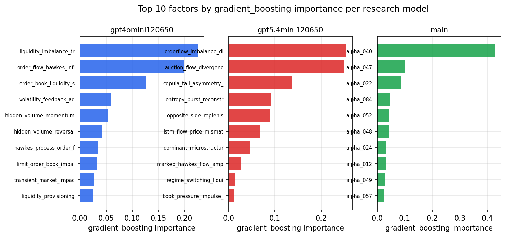

*Top factors by gradient_boosting importance per zoo*

## 4. ML-combined signal — per-underlying vectorised backtest

Each model combines a prerun's factors into ONE signal (fit `factors → forward return` on IS, predict per (bar, underlying)), then that combined signal is run through a simple vectorised backtest — `position(signal) × the underlying's own forward return` — on the held-out OOS tail (+ an equal-weight ensemble). No cross-sectional ranking.

> Config: position=**threshold** (t=1.0, z-score `expanding`), aggregation=**portfolio**, fit-standardise=**per_underlying**, horizon=6.

| prerun | model | n_factors_used | oos_ic | oos_sharpe | is_sharpe | oos_ann_return | oos_max_drawdown |
| --- | --- | --- | --- | --- | --- | --- | --- |
| gpt4omini120650 | linear_regression | 66 | 0.0023 | 1.2556 | 5.6706 | 0.1567 | -0.0243 |
| gpt4omini120650 | ridge | 66 | 0.0018 | 0.6791 | 4.6974 | 0.0857 | -0.0267 |
| gpt4omini120650 | lasso | 66 | nan | nan | nan | nan | nan |
| gpt4omini120650 | elastic_net | 66 | nan | nan | nan | nan | nan |
| gpt4omini120650 | random_forest | 66 | 0.0051 | -1.0418 | 12.4591 | -0.128 | -0.0416 |
| gpt4omini120650 | gradient_boosting | 66 | 0.0017 | 0.313 | 10.7137 | 0.0205 | -0.0166 |
| gpt4omini120650 | xgboost | 66 | -0.0044 | 2.2816 | 15.5524 | 0.221 | -0.0229 |
| gpt4omini120650 | lightgbm | 66 | 0.0042 | 1.4621 | 24.3481 | 0.146 | -0.022 |
| gpt4omini120650 | ensemble | 66 | 0.0043 | 0.4381 | 10.1924 | 0.0394 | -0.0266 |
| gpt5.4mini120650 | linear_regression | 69 | 0.0099 | 4.3779 | 6.2795 | 0.5364 | -0.0175 |
| gpt5.4mini120650 | ridge | 69 | 0.0109 | 4.3128 | 6.2642 | 0.5325 | -0.0188 |
| gpt5.4mini120650 | lasso | 69 | nan | nan | nan | nan | nan |
| gpt5.4mini120650 | elastic_net | 69 | nan | nan | nan | nan | nan |
| gpt5.4mini120650 | random_forest | 69 | 0.0063 | 4.0998 | 12.8123 | 0.3482 | -0.0128 |
| gpt5.4mini120650 | gradient_boosting | 69 | 0.0051 | 4.9667 | 11.1211 | 0.1169 | -0.003 |
| gpt5.4mini120650 | xgboost | 69 | -0.002 | 5.0431 | 19.1437 | 0.4632 | -0.0093 |
| gpt5.4mini120650 | lightgbm | 69 | 0.0032 | 3.1422 | 25.9147 | 0.3126 | -0.018 |
| gpt5.4mini120650 | ensemble | 69 | 0.0111 | 2.8414 | 9.7834 | 0.0984 | -0.0043 |
| main | linear_regression | 78 | 0.0112 | -4.0553 | 11.272 | -0.0654 | -0.0084 |
| main | ridge | 78 | 0.0092 | -3.0817 | 10.8471 | -0.0504 | -0.0077 |
| main | lasso | 78 | nan | nan | nan | nan | nan |
| main | elastic_net | 78 | nan | nan | nan | nan | nan |
| main | random_forest | 78 | 0.0057 | 3.8314 | 21.1673 | 0.1458 | -0.0069 |
| main | gradient_boosting | 78 | 0.0004 | -0.0959 | 23.6141 | -0.0033 | -0.0082 |
| main | xgboost | 78 | 0.0001 | 2.9027 | 26.9115 | 0.1083 | -0.0081 |
| main | lightgbm | 78 | 0.0044 | -1.898 | 40.646 | -0.0785 | -0.0158 |
| main | ensemble | 78 | 0.0073 | -3.0544 | 16.8134 | -0.0488 | -0.0057 |

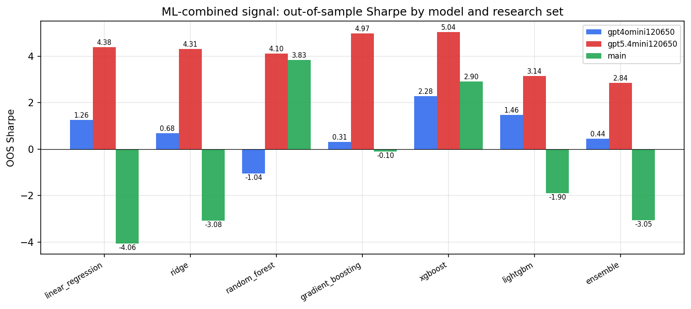

*ML-combined OOS Sharpe by model and research set*

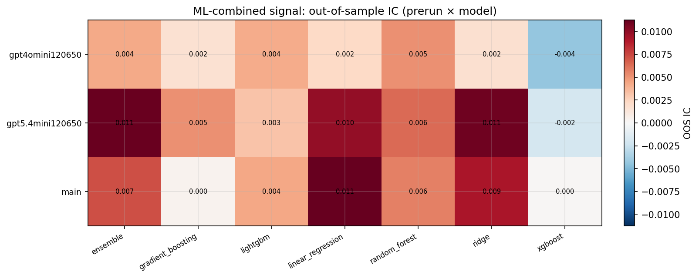

*ML-combined OOS IC (prerun × model)*

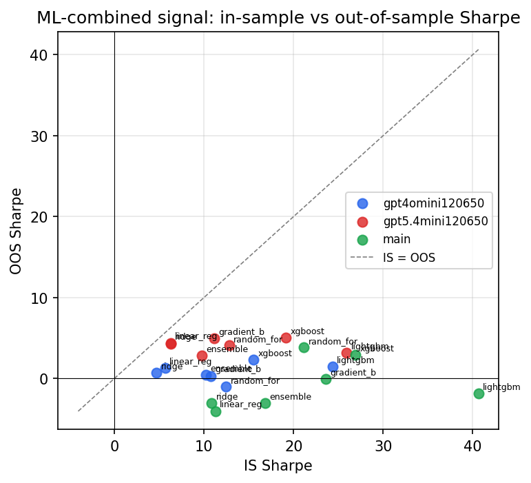

*IS vs OOS Sharpe (overfitting diagnostic)*

---
*Generated by `run_model_comparison.py`. Tables: `*.csv`; interactive: `comparison.ipynb`.*
