# Research-LLM factor comparison — `2026-04`

Comparing the **factor output of different research LLMs** on three axes (raw factor quality → factors as ML features → factors through the full agentic fund). The panel, IS/OOS split, horizon and model hyper-parameters are held identical across preruns — the *only* variable is the factor set.

## Preruns compared

| prerun | research_model | usable_factors | dropped_factors |
| --- | --- | --- | --- |
| gpt4omini120650 | gpt-4o-mini | 66 | 0 |
| gpt5.4mini120650 | gpt-5.4-mini | 69 | 0 |
| main | seed library | 78 | 10 |

> Dropped factors declare fields the current data doesn't have yet (e.g. fundamentals); they light up unchanged once that data is downloaded.

*Usable vs awaiting-data factors per research model*

## Key findings

- **Best ML-combined OOS Sharpe:** `main` with `linear_regression` (OOS Sharpe = 2.438).
- **Mean OOS Sharpe across models, by research set:** `main` = -1.416, `gpt5.4mini120650` = -2.689, `gpt4omini120650` = -3.715.
- **Highest mean single-factor |IC| (h=6):** `main` (mean |IC| = 0.0063).
- **Most diverse zoo (highest effective/raw factor ratio):** `gpt5.4mini120650` (eff 53.5 of 69, ratio 0.78).
- **Best selection-deflated single-factor |IC|:** `main` (deflated |IC| = 0.0075 from 38 factors tried).

## 1. Single-factor IC (raw factor quality)

Per-underlying time-series Spearman rank-IC of every researched factor, recomputed on the shared panel at horizons h=1, h=6, h=60. The per-underlying IC correlates each factor's value vector with the underlying's own forward-return vector (pooled across underlyings); the cross-sectional IC ranks across underlyings per timestamp.

| prerun | n_factors | mean_abs_ic_1 | mean_abs_ic_6 | mean_abs_ic_60 | mean_abs_icir_6 | best_factor_h6 | best_abs_ic_h6 |
| --- | --- | --- | --- | --- | --- | --- | --- |
| gpt4omini120650 | 66 | 0.0073 | 0.0043 | 0.0066 | 0.2843 | order_flow_skewness_indicator | 0.0145 |
| gpt5.4mini120650 | 69 | 0.0051 | 0.0031 | 0.0082 | 0.1902 | marked_hawkes_flow_amplification | 0.0141 |
| main | 78 | 0.0123 | 0.0063 | 0.003 | 0.3694 | alpha_084 | 0.0146 |

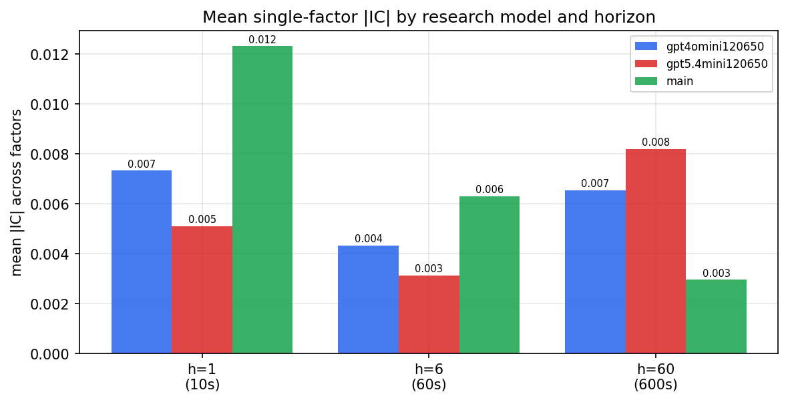

*Mean |IC| by research model and horizon*

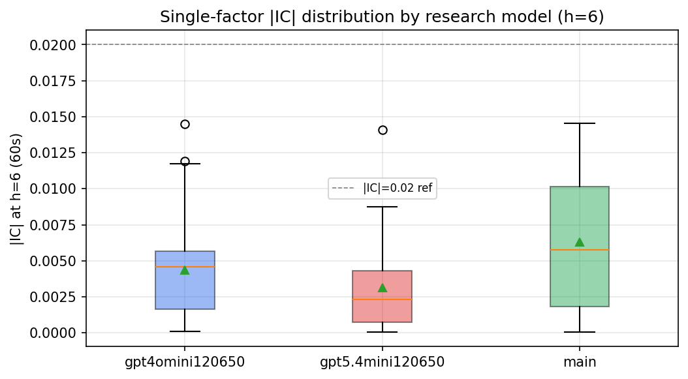

*Per-factor |IC| distribution by research model*

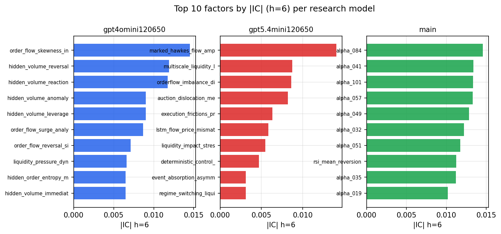

*Top factors by |IC| per research model*

## 2. Factor diversity & redundancy

Pairwise correlation of each zoo's *signals*. `eff_n_factors` is the effective number of independent factors (participation ratio of the correlation eigenvalues); `eff_ratio` and `redundancy` summarise how much unique information the zoo holds vs. how much is duplicated; `n_clusters` groups factors at |corr| ≥ 0.7.

| prerun | n_factors | eff_n_factors | eff_ratio | mean_abs_corr | n_clusters | redundancy |
| --- | --- | --- | --- | --- | --- | --- |
| gpt4omini120650 | 66 | 27.4799 | 0.4164 | 0.0493 | 52 | 0.5836 |
| gpt5.4mini120650 | 69 | 53.4868 | 0.7752 | 0.0103 | 64 | 0.2248 |
| main | 78 | 42.4438 | 0.5442 | 0.0288 | 71 | 0.4558 |

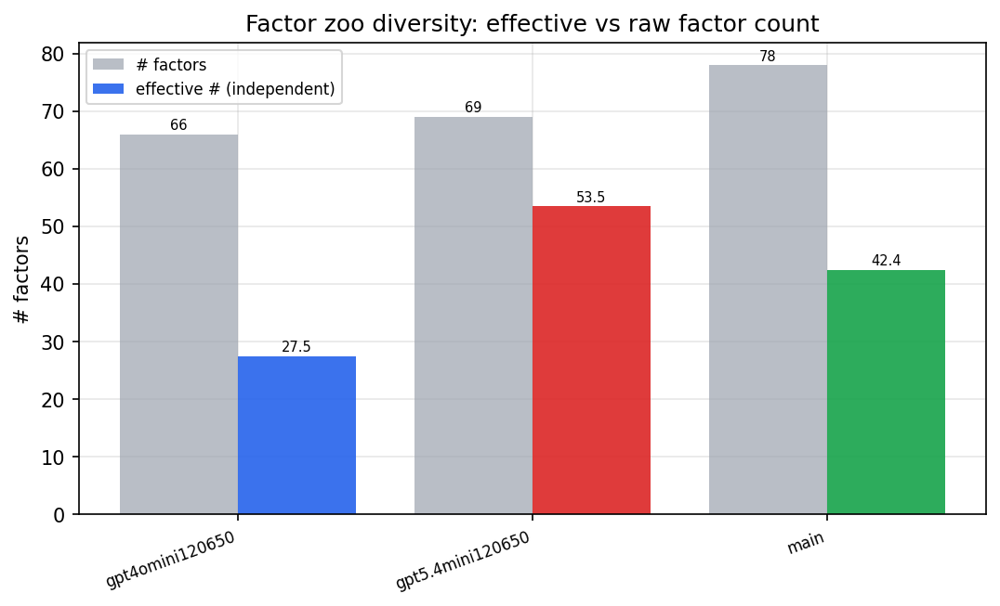

*Effective vs raw factor count per research model*

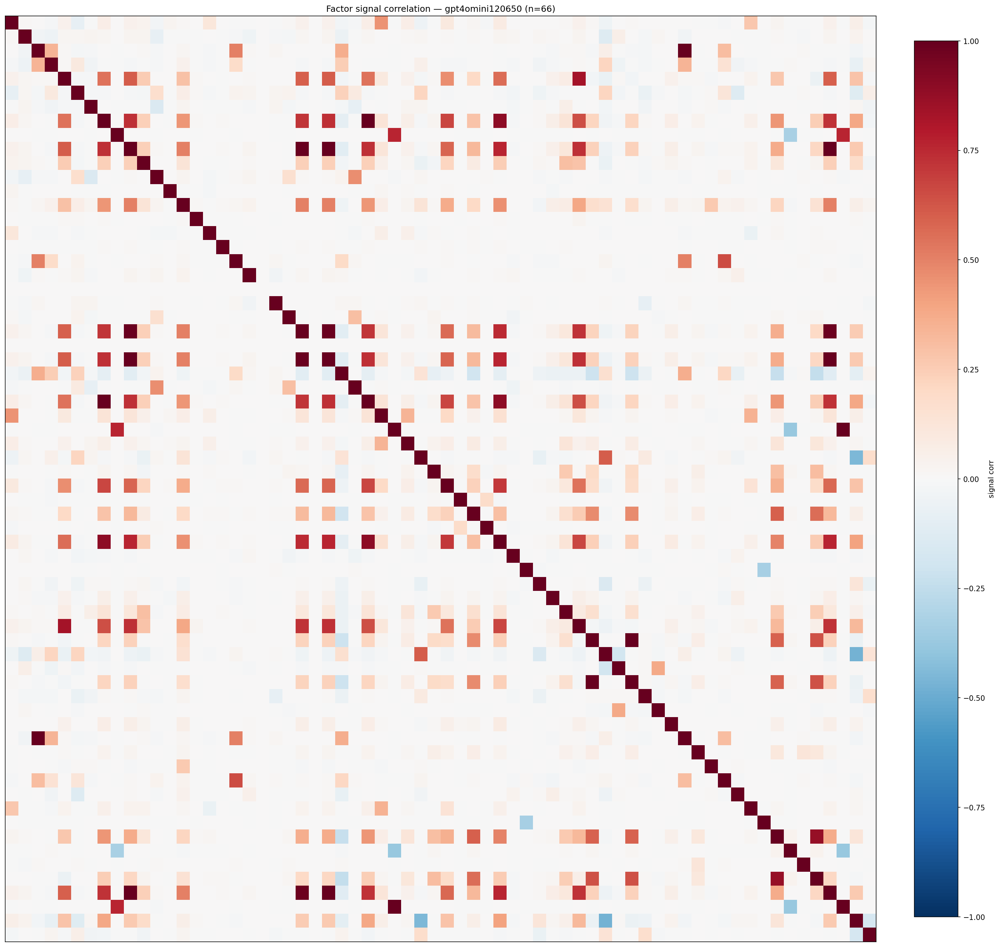

*Signal correlation matrix — gpt4omini120650*

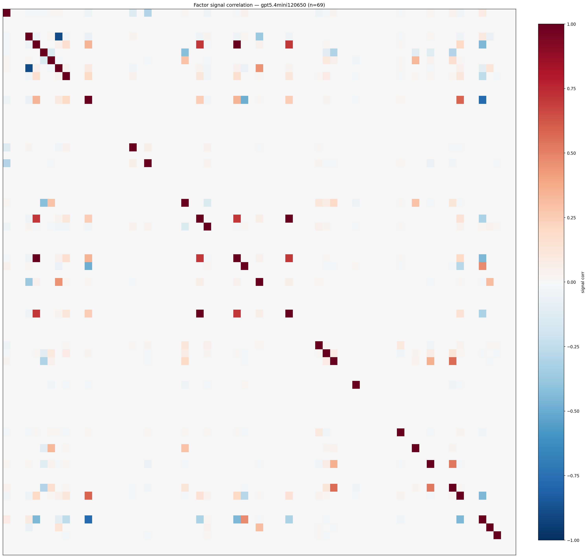

*Signal correlation matrix — gpt5.4mini120650*

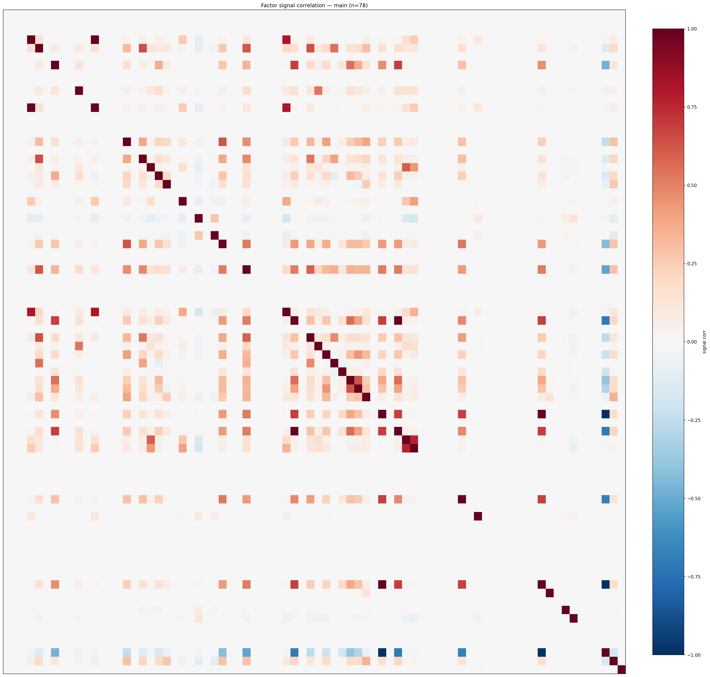

*Signal correlation matrix — main*

## 3. Deflation & model-based importance

`deflated_best_ic` haircuts each zoo's best |IC| for the number of factors tried (`ic_n_tested`) — a bigger zoo's best factor is more likely to be lucky. `lasso_n_nonzero` / `lasso_sparsity` show how many factors a sparse linear model actually keeps (model-view redundancy).

| prerun | best_ic | deflated_best_ic | deflated_best_t | ic_n_tested | ic_n_obs | lasso_n_nonzero | lasso_sparsity |
| --- | --- | --- | --- | --- | --- | --- | --- |
| gpt4omini120650 | 0.0145 | 0.0069 | 2.6432 | 64 | 145079 | 0 | 1.0 |
| gpt5.4mini120650 | 0.0141 | 0.0072 | 2.75 | 30 | 145079 | 0 | 1.0 |
| main | 0.0146 | 0.0075 | 2.8486 | 38 | 145079 | 2 | 0.9744 |

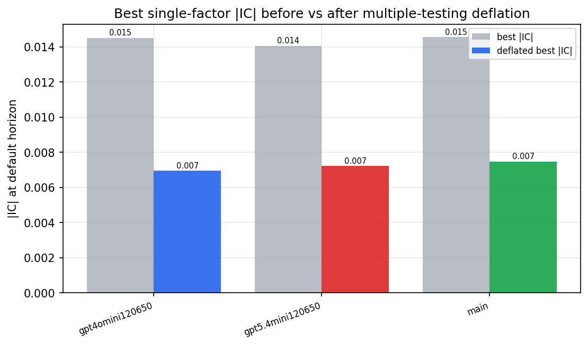

*Best |IC| before vs after multiple-testing deflation*

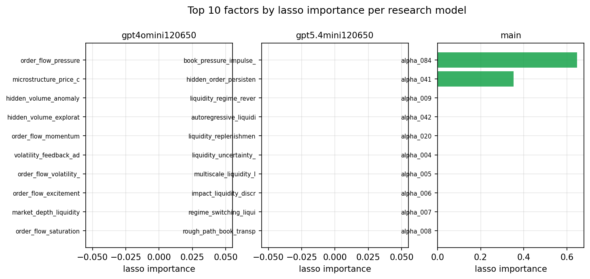

*Top factors by lasso importance per zoo*

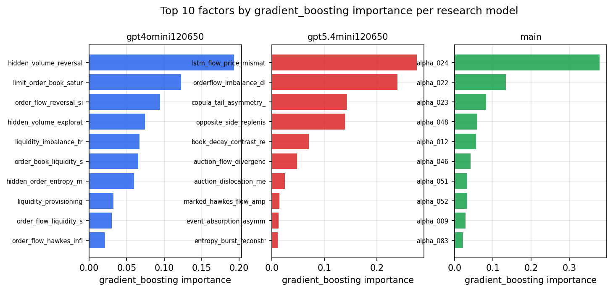

*Top factors by gradient_boosting importance per zoo*

## 4. ML-combined signal — per-underlying vectorised backtest

Each model combines a prerun's factors into ONE signal (fit `factors → forward return` on IS, predict per (bar, underlying)), then that combined signal is run through a simple vectorised backtest — `position(signal) × the underlying's own forward return` — on the held-out OOS tail (+ an equal-weight ensemble). No cross-sectional ranking.

> Config: position=**threshold** (t=1.0, z-score `expanding`), aggregation=**portfolio**, fit-standardise=**per_underlying**, horizon=6.

| prerun | model | n_factors_used | oos_ic | oos_sharpe | is_sharpe | oos_ann_return | oos_max_drawdown |
| --- | --- | --- | --- | --- | --- | --- | --- |
| gpt4omini120650 | linear_regression | 66 | -0.0013 | -1.3864 | 2.3242 | -0.163 | -0.0447 |
| gpt4omini120650 | ridge | 66 | 0.0013 | -1.1813 | 1.5391 | -0.1388 | -0.0434 |
| gpt4omini120650 | lasso | 66 | nan | nan | nan | nan | nan |
| gpt4omini120650 | elastic_net | 66 | nan | nan | nan | nan | nan |
| gpt4omini120650 | random_forest | 66 | -0.0042 | -7.4256 | 11.7624 | -0.6801 | -0.0697 |
| gpt4omini120650 | gradient_boosting | 66 | -0.0022 | -4.7048 | 11.6411 | -0.5062 | -0.0596 |
| gpt4omini120650 | xgboost | 66 | -0.0106 | -3.6043 | 14.4 | -0.5041 | -0.0628 |
| gpt4omini120650 | lightgbm | 66 | -0.0028 | -3.405 | 19.2318 | -0.4872 | -0.0591 |
| gpt4omini120650 | ensemble | 66 | -0.0046 | -4.2986 | 14.7148 | -0.5417 | -0.0694 |
| gpt5.4mini120650 | linear_regression | 69 | -0.0184 | -3.6132 | 5.4372 | -0.4306 | -0.0587 |
| gpt5.4mini120650 | ridge | 69 | -0.018 | -3.7295 | 5.6823 | -0.4479 | -0.0592 |
| gpt5.4mini120650 | lasso | 69 | nan | nan | nan | nan | nan |
| gpt5.4mini120650 | elastic_net | 69 | nan | nan | nan | nan | nan |
| gpt5.4mini120650 | random_forest | 69 | 0.0032 | -1.1781 | 11.7333 | -0.1328 | -0.044 |
| gpt5.4mini120650 | gradient_boosting | 69 | -0.0063 | -3.686 | 12.6207 | -0.2286 | -0.034 |
| gpt5.4mini120650 | xgboost | 69 | -0.0058 | -2.9138 | 15.4074 | -0.3631 | -0.0522 |
| gpt5.4mini120650 | lightgbm | 69 | 0.0042 | -1.6428 | 20.25 | -0.1765 | -0.0427 |
| gpt5.4mini120650 | ensemble | 69 | -0.0111 | -2.0599 | 5.6648 | -0.1546 | -0.0266 |
| main | linear_regression | 78 | 0.0062 | 2.4379 | 10.9075 | 0.1449 | -0.0088 |
| main | ridge | 78 | 0.009 | 0.7795 | 9.6937 | 0.0469 | -0.0098 |
| main | lasso | 78 | 0.006 | -5.6698 | 9.5179 | -0.1887 | -0.0178 |
| main | elastic_net | 78 | 0.006 | -5.6698 | 9.5179 | -0.1887 | -0.0178 |
| main | random_forest | 78 | 0.0002 | -0.9467 | 13.9257 | -0.032 | -0.0143 |
| main | gradient_boosting | 78 | -0.0039 | -3.1297 | 11.5114 | -0.0376 | -0.0047 |
| main | xgboost | 78 | -0.0042 | 1.442 | 20.2266 | 0.0374 | -0.0079 |
| main | lightgbm | 78 | -0.0019 | 0.0938 | 31.6625 | 0.0027 | -0.0117 |
| main | ensemble | 78 | 0.0059 | -2.0837 | 18.2958 | -0.0768 | -0.0142 |

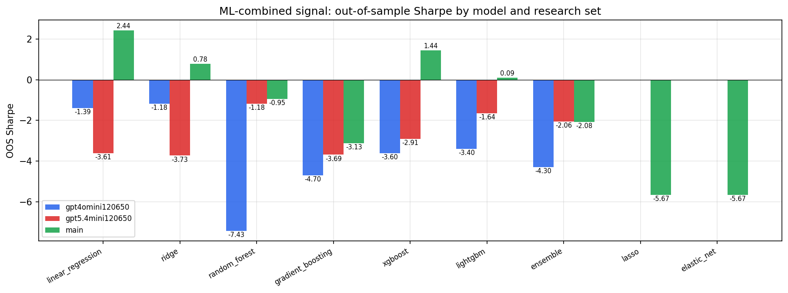

*ML-combined OOS Sharpe by model and research set*

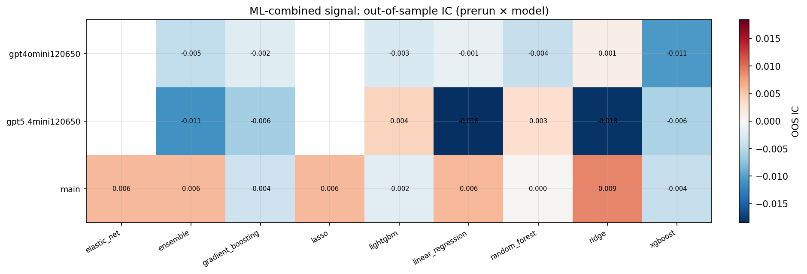

*ML-combined OOS IC (prerun × model)*

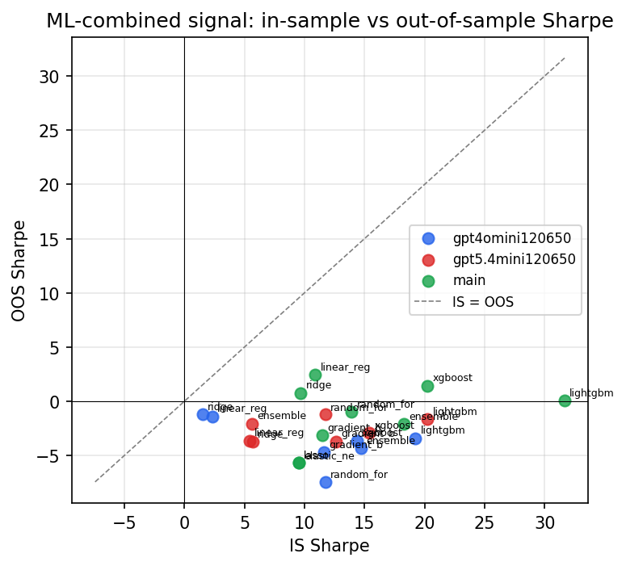

*IS vs OOS Sharpe (overfitting diagnostic)*

---
*Generated by `run_model_comparison.py`. Tables: `*.csv`; interactive: `comparison.ipynb`.*
