# Research-LLM factor comparison — `2026-05`

Comparing the **factor output of different research LLMs** on three axes (raw factor quality → factors as ML features → factors through the full agentic fund). The panel, IS/OOS split, horizon and model hyper-parameters are held identical across preruns — the *only* variable is the factor set.

## Preruns compared

| prerun | research_model | usable_factors | dropped_factors |
| --- | --- | --- | --- |
| gpt4omini120650 | gpt-4o-mini | 66 | 0 |
| gpt5.4mini120650 | gpt-5.4-mini | 69 | 0 |
| main | seed library | 78 | 10 |

> Dropped factors declare fields the current data doesn't have yet (e.g. fundamentals); they light up unchanged once that data is downloaded.

*Usable vs awaiting-data factors per research model*

## Key findings

- **Best ML-combined OOS Sharpe:** `gpt4omini120650` with `ridge` (OOS Sharpe = 8.268).
- **Mean OOS Sharpe across models, by research set:** `gpt4omini120650` = 5.148, `gpt5.4mini120650` = 3.297, `main` = 2.737.
- **Highest mean single-factor |IC| (h=6):** `gpt5.4mini120650` (mean |IC| = 0.0058).
- **Most diverse zoo (highest effective/raw factor ratio):** `gpt5.4mini120650` (eff 44.7 of 69, ratio 0.65).
- **Best selection-deflated single-factor |IC|:** `gpt5.4mini120650` (deflated |IC| = 0.0161 from 31 factors tried).

## 1. Single-factor IC (raw factor quality)

Per-underlying time-series Spearman rank-IC of every researched factor, recomputed on the shared panel at horizons h=1, h=6, h=60. The per-underlying IC correlates each factor's value vector with the underlying's own forward-return vector (pooled across underlyings); the cross-sectional IC ranks across underlyings per timestamp.

| prerun | n_factors | mean_abs_ic_1 | mean_abs_ic_6 | mean_abs_ic_60 | mean_abs_icir_6 | best_factor_h6 | best_abs_ic_h6 |
| --- | --- | --- | --- | --- | --- | --- | --- |
| gpt4omini120650 | 66 | 0.0065 | 0.0053 | 0.0097 | 0.2869 | order_flow_skewness_indicator | 0.0148 |
| gpt5.4mini120650 | 69 | 0.0047 | 0.0058 | 0.0087 | 0.2064 | multiscale_liquidity_leadlag_reversal | 0.023 |
| main | 78 | 0.0103 | 0.0047 | 0.0048 | 0.2566 | alpha_052 | 0.0108 |

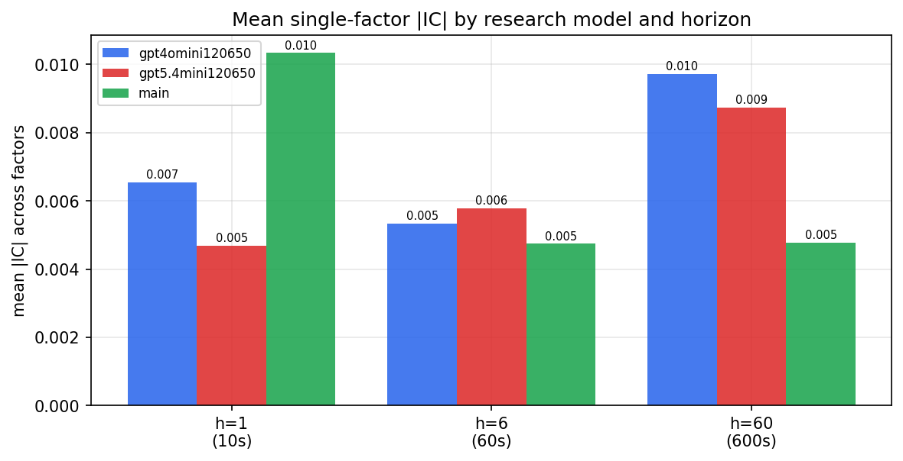

*Mean |IC| by research model and horizon*

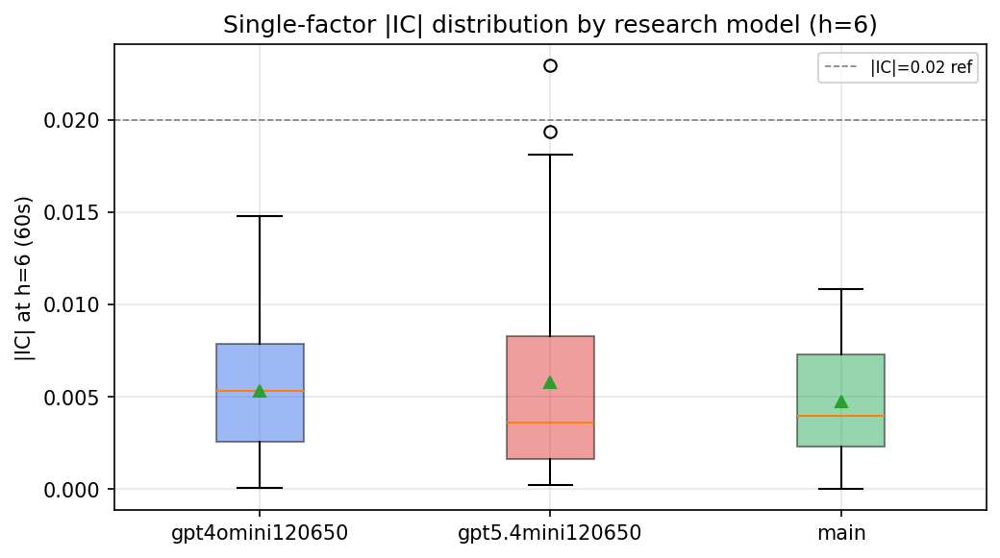

*Per-factor |IC| distribution by research model*

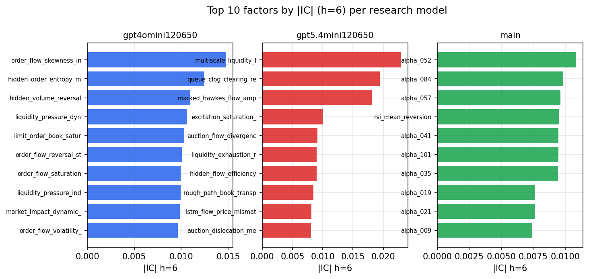

*Top factors by |IC| per research model*

## 2. Factor diversity & redundancy

Pairwise correlation of each zoo's *signals*. `eff_n_factors` is the effective number of independent factors (participation ratio of the correlation eigenvalues); `eff_ratio` and `redundancy` summarise how much unique information the zoo holds vs. how much is duplicated; `n_clusters` groups factors at |corr| ≥ 0.7.

| prerun | n_factors | eff_n_factors | eff_ratio | mean_abs_corr | n_clusters | redundancy |
| --- | --- | --- | --- | --- | --- | --- |
| gpt4omini120650 | 66 | 26.1264 | 0.3959 | 0.0524 | 50 | 0.6041 |
| gpt5.4mini120650 | 69 | 44.6641 | 0.6473 | 0.0149 | 61 | 0.3527 |
| main | 78 | 42.5482 | 0.5455 | 0.0289 | 71 | 0.4545 |

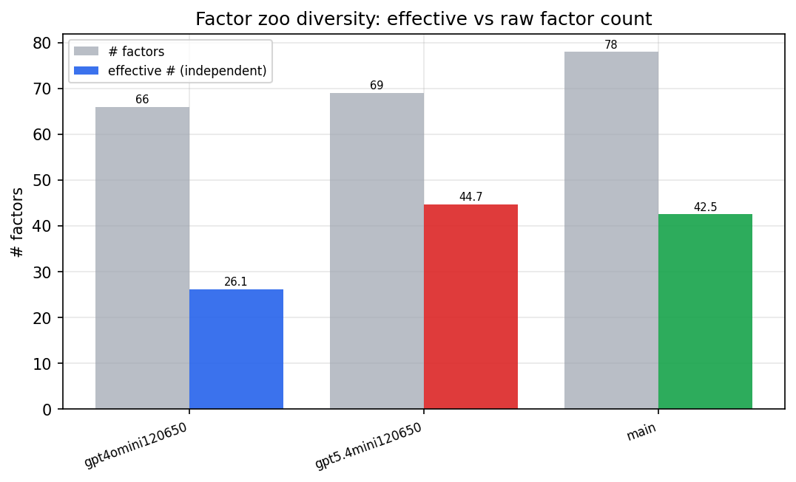

*Effective vs raw factor count per research model*

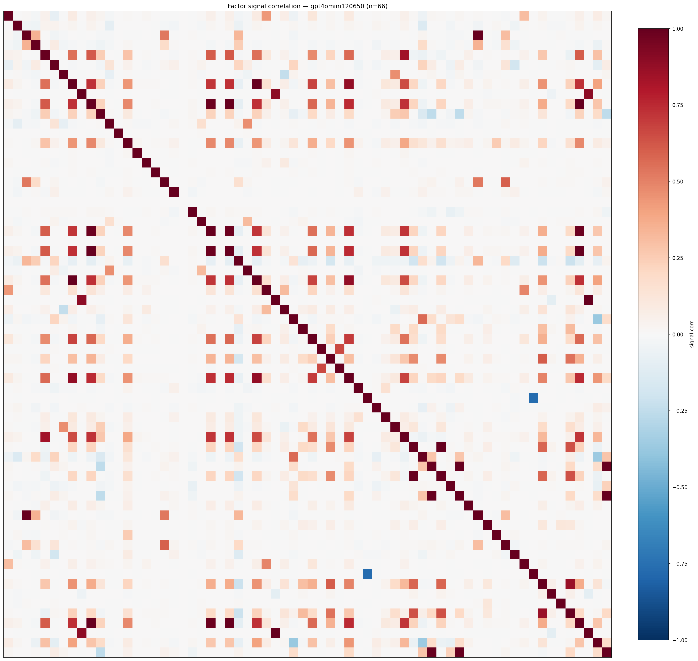

*Signal correlation matrix — gpt4omini120650*

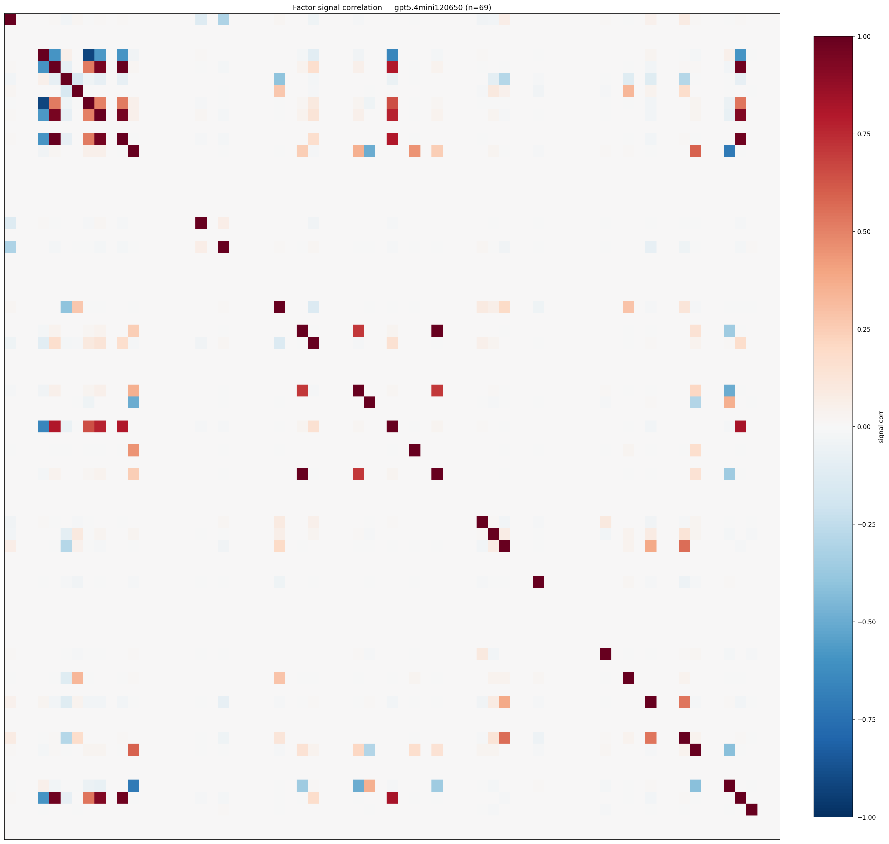

*Signal correlation matrix — gpt5.4mini120650*

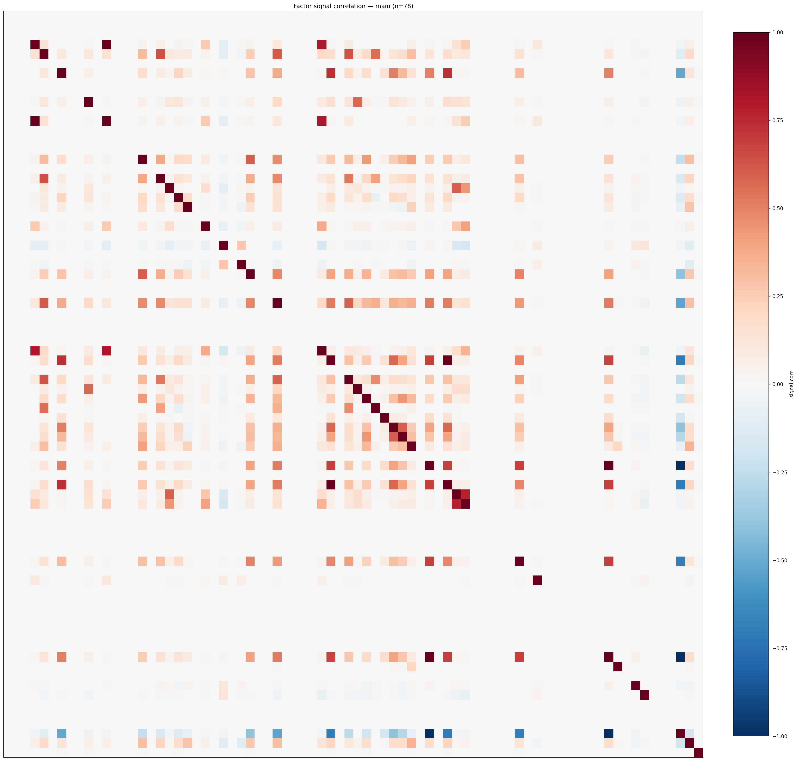

*Signal correlation matrix — main*

## 3. Deflation & model-based importance

`deflated_best_ic` haircuts each zoo's best |IC| for the number of factors tried (`ic_n_tested`) — a bigger zoo's best factor is more likely to be lucky. `lasso_n_nonzero` / `lasso_sparsity` show how many factors a sparse linear model actually keeps (model-view redundancy).

| prerun | best_ic | deflated_best_ic | deflated_best_t | ic_n_tested | ic_n_obs | lasso_n_nonzero | lasso_sparsity |
| --- | --- | --- | --- | --- | --- | --- | --- |
| gpt4omini120650 | 0.0148 | 0.0073 | 2.7951 | 64 | 147419 | 0 | 1.0 |
| gpt5.4mini120650 | 0.023 | 0.0161 | 6.191 | 31 | 147419 | 10 | 0.8551 |
| main | 0.0108 | 0.0038 | 1.4674 | 38 | 147419 | 8 | 0.8974 |

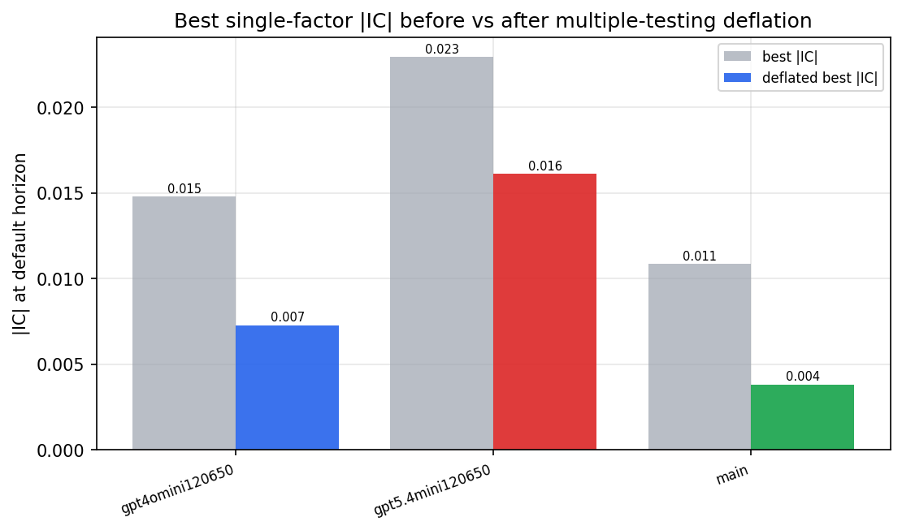

*Best |IC| before vs after multiple-testing deflation*

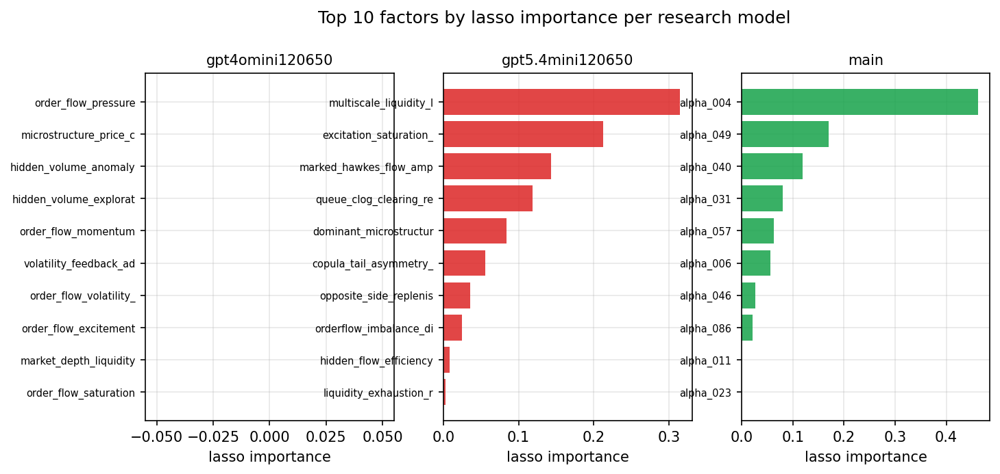

*Top factors by lasso importance per zoo*

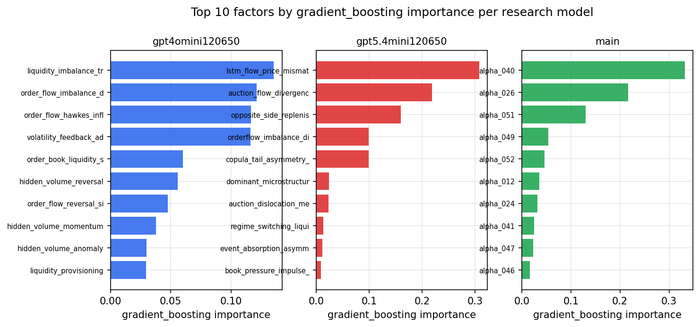

*Top factors by gradient_boosting importance per zoo*

## 4. ML-combined signal — per-underlying vectorised backtest

Each model combines a prerun's factors into ONE signal (fit `factors → forward return` on IS, predict per (bar, underlying)), then that combined signal is run through a simple vectorised backtest — `position(signal) × the underlying's own forward return` — on the held-out OOS tail (+ an equal-weight ensemble). No cross-sectional ranking.

> Config: position=**threshold** (t=1.0, z-score `expanding`), aggregation=**portfolio**, fit-standardise=**per_underlying**, horizon=6.

| prerun | model | n_factors_used | oos_ic | oos_sharpe | is_sharpe | oos_ann_return | oos_max_drawdown |
| --- | --- | --- | --- | --- | --- | --- | --- |
| gpt4omini120650 | linear_regression | 66 | 0.0008 | 7.5103 | 6.9869 | 0.2377 | -0.0031 |
| gpt4omini120650 | ridge | 66 | 0.0001 | 8.2681 | 6.9601 | 0.2673 | -0.0027 |
| gpt4omini120650 | lasso | 66 | nan | nan | nan | nan | nan |
| gpt4omini120650 | elastic_net | 66 | nan | nan | nan | nan | nan |
| gpt4omini120650 | random_forest | 66 | 0.0127 | 4.698 | 9.3421 | 0.367 | -0.0163 |
| gpt4omini120650 | gradient_boosting | 66 | 0.0058 | 7.0091 | 7.1152 | 0.2019 | -0.0037 |
| gpt4omini120650 | xgboost | 66 | -0.0065 | 3.5973 | 10.9326 | 0.1673 | -0.0083 |
| gpt4omini120650 | lightgbm | 66 | -0.0103 | 0.2374 | 13.3333 | 0.015 | -0.0145 |
| gpt4omini120650 | ensemble | 66 | 0.0043 | 4.7153 | 9.3763 | 0.1593 | -0.0056 |
| gpt5.4mini120650 | linear_regression | 69 | 0.0035 | 6.6339 | 1.4842 | 0.0932 | -0.0015 |
| gpt5.4mini120650 | ridge | 69 | 0.0033 | 6.5888 | 0.8537 | 0.0888 | -0.0012 |
| gpt5.4mini120650 | lasso | 69 | -0.001 | 4.3064 | 2.1385 | 0.0482 | -0.0003 |
| gpt5.4mini120650 | elastic_net | 69 | -0.0013 | 4.344 | 0.9711 | 0.0486 | -0.0003 |
| gpt5.4mini120650 | random_forest | 69 | 0.0163 | 2.5484 | 6.5858 | 0.102 | -0.0114 |
| gpt5.4mini120650 | gradient_boosting | 69 | 0.0031 | 3.5916 | 5.9684 | 0.0605 | -0.003 |
| gpt5.4mini120650 | xgboost | 69 | 0.0103 | 1.9829 | 8.3175 | 0.0482 | -0.0077 |
| gpt5.4mini120650 | lightgbm | 69 | 0.0107 | -0.7194 | 12.5204 | -0.0308 | -0.013 |
| gpt5.4mini120650 | ensemble | 69 | 0.0072 | 0.4002 | 10.817 | 0.0123 | -0.0127 |
| main | linear_regression | 78 | -0.0025 | 3.4858 | 4.5454 | 0.1089 | -0.0064 |
| main | ridge | 78 | -0.0033 | 2.4688 | 4.3421 | 0.0763 | -0.0055 |
| main | lasso | 78 | nan | nan | nan | nan | nan |
| main | elastic_net | 78 | nan | nan | nan | nan | nan |
| main | random_forest | 78 | 0.0092 | 5.5231 | 7.1664 | 0.1946 | -0.0103 |
| main | gradient_boosting | 78 | 0.0088 | -0.0923 | 5.7845 | -0.0021 | -0.0064 |
| main | xgboost | 78 | 0.0079 | 3.9669 | 9.1635 | 0.1235 | -0.0082 |
| main | lightgbm | 78 | 0.0046 | 3.748 | 13.9003 | 0.0706 | -0.0029 |
| main | ensemble | 78 | 0.0008 | 0.0586 | 3.2403 | 0.0001 | -0.0003 |

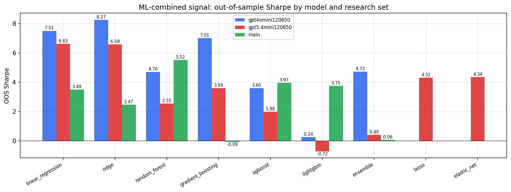

*ML-combined OOS Sharpe by model and research set*

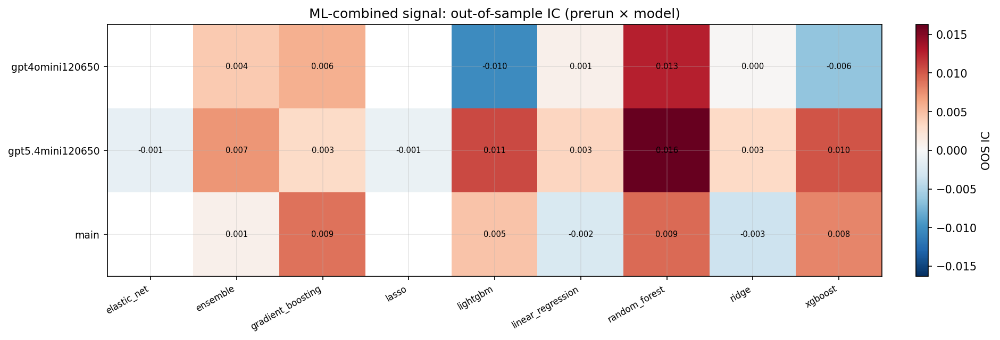

*ML-combined OOS IC (prerun × model)*

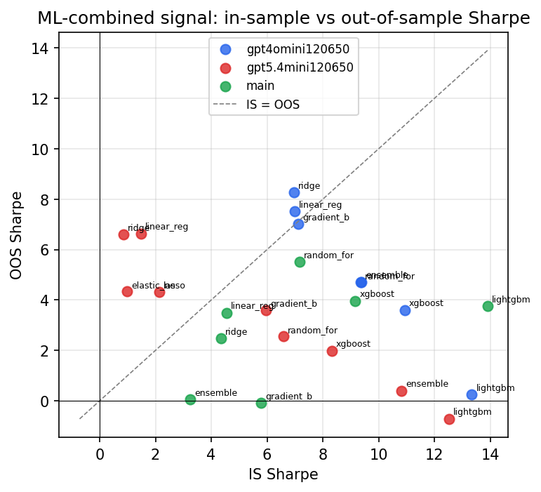

*IS vs OOS Sharpe (overfitting diagnostic)*

---
*Generated by `run_model_comparison.py`. Tables: `*.csv`; interactive: `comparison.ipynb`.*
