# Research-LLM factor comparison — `2026-06`

Comparing the **factor output of different research LLMs** on three axes (raw factor quality → factors as ML features → factors through the full agentic fund). The panel, IS/OOS split, horizon and model hyper-parameters are held identical across preruns — the *only* variable is the factor set.

## Preruns compared

| prerun | research_model | usable_factors | dropped_factors |
| --- | --- | --- | --- |
| gpt4omini120650 | gpt-4o-mini | 66 | 0 |
| gpt5.4mini120650 | gpt-5.4-mini | 69 | 0 |
| main | seed library | 78 | 10 |

> Dropped factors declare fields the current data doesn't have yet (e.g. fundamentals); they light up unchanged once that data is downloaded.

*Usable vs awaiting-data factors per research model*

## Key findings

- **Best ML-combined OOS Sharpe:** `gpt5.4mini120650` with `xgboost` (OOS Sharpe = 26.226).
- **Mean OOS Sharpe across models, by research set:** `gpt5.4mini120650` = 14.867, `main` = -4.810, `gpt4omini120650` = -6.050.
- **Highest mean single-factor |IC| (h=6):** `gpt4omini120650` (mean |IC| = 0.0075).
- **Most diverse zoo (highest effective/raw factor ratio):** `gpt5.4mini120650` (eff 43.4 of 69, ratio 0.63).
- **Best selection-deflated single-factor |IC|:** `gpt4omini120650` (deflated |IC| = 0.0153 from 64 factors tried).

## 1. Single-factor IC (raw factor quality)

Per-underlying time-series Spearman rank-IC of every researched factor, recomputed on the shared panel at horizons h=1, h=6, h=60. The per-underlying IC correlates each factor's value vector with the underlying's own forward-return vector (pooled across underlyings); the cross-sectional IC ranks across underlyings per timestamp.

| prerun | n_factors | mean_abs_ic_1 | mean_abs_ic_6 | mean_abs_ic_60 | mean_abs_icir_6 | best_factor_h6 | best_abs_ic_h6 |
| --- | --- | --- | --- | --- | --- | --- | --- |
| gpt4omini120650 | 66 | 0.005 | 0.0075 | 0.0152 | 0.2921 | order_flow_volatility_surge | 0.0245 |
| gpt5.4mini120650 | 69 | 0.0058 | 0.0074 | 0.012 | 0.3469 | liquidity_impact_stress_ratio | 0.0171 |
| main | 78 | 0.0075 | 0.0046 | 0.0047 | 0.2178 | alpha_052 | 0.0156 |

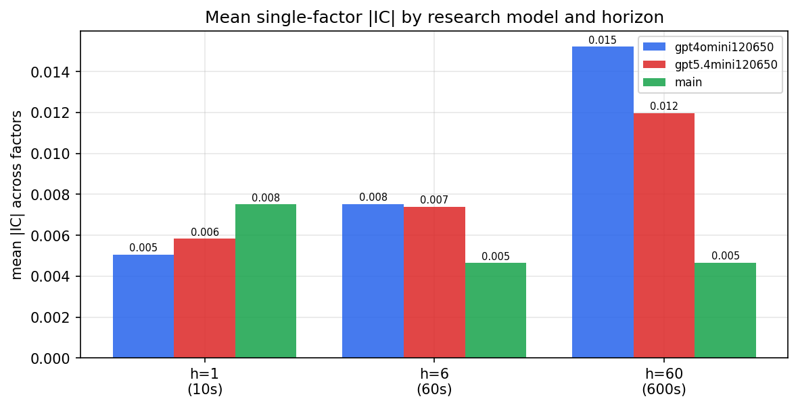

*Mean |IC| by research model and horizon*

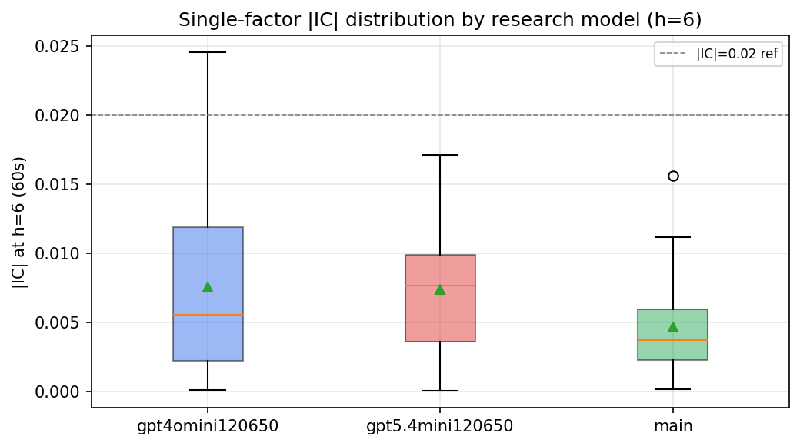

*Per-factor |IC| distribution by research model*

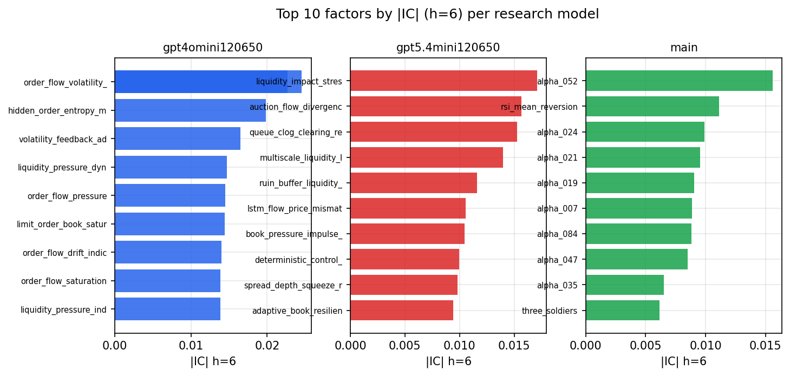

*Top factors by |IC| per research model*

## 2. Factor diversity & redundancy

Pairwise correlation of each zoo's *signals*. `eff_n_factors` is the effective number of independent factors (participation ratio of the correlation eigenvalues); `eff_ratio` and `redundancy` summarise how much unique information the zoo holds vs. how much is duplicated; `n_clusters` groups factors at |corr| ≥ 0.7.

| prerun | n_factors | eff_n_factors | eff_ratio | mean_abs_corr | n_clusters | redundancy |
| --- | --- | --- | --- | --- | --- | --- |
| gpt4omini120650 | 66 | 27.0625 | 0.41 | 0.0509 | 52 | 0.59 |
| gpt5.4mini120650 | 69 | 43.4028 | 0.629 | 0.0159 | 61 | 0.371 |
| main | 78 | 43.3503 | 0.5558 | 0.0282 | 72 | 0.4442 |

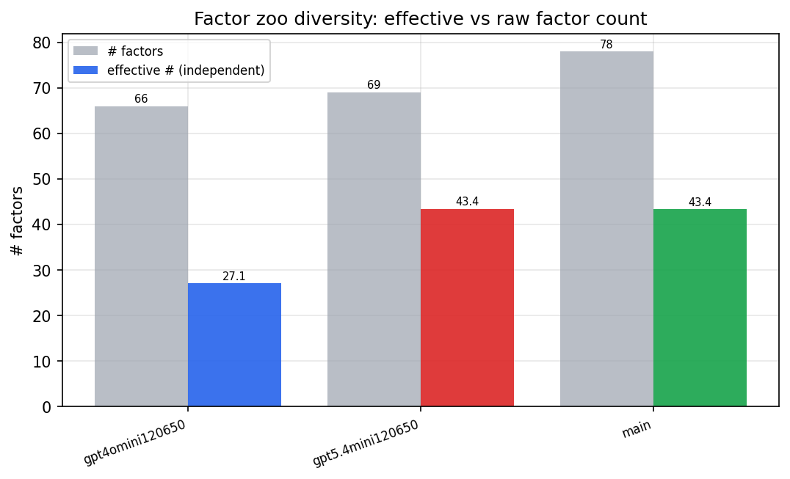

*Effective vs raw factor count per research model*

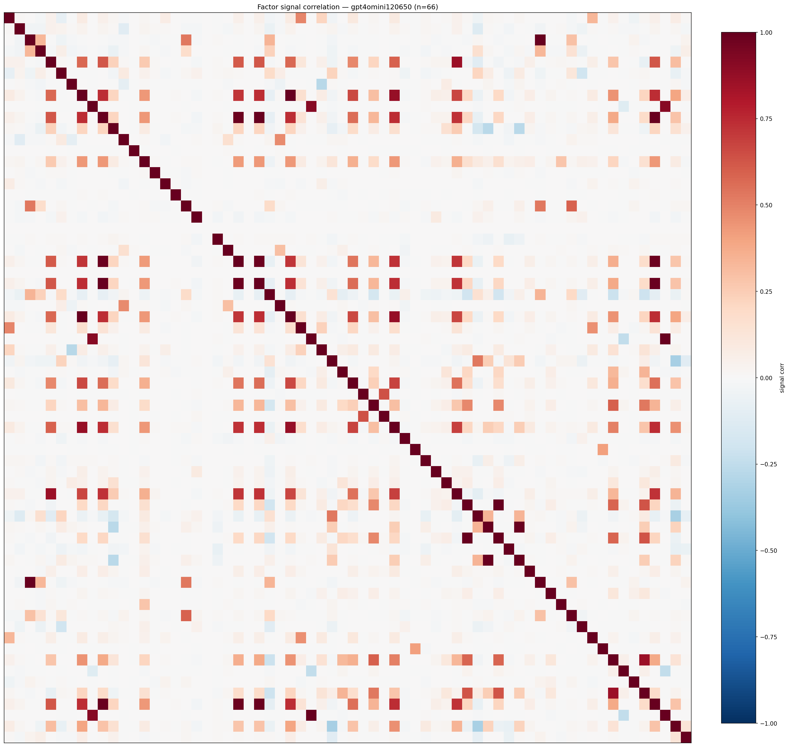

*Signal correlation matrix — gpt4omini120650*

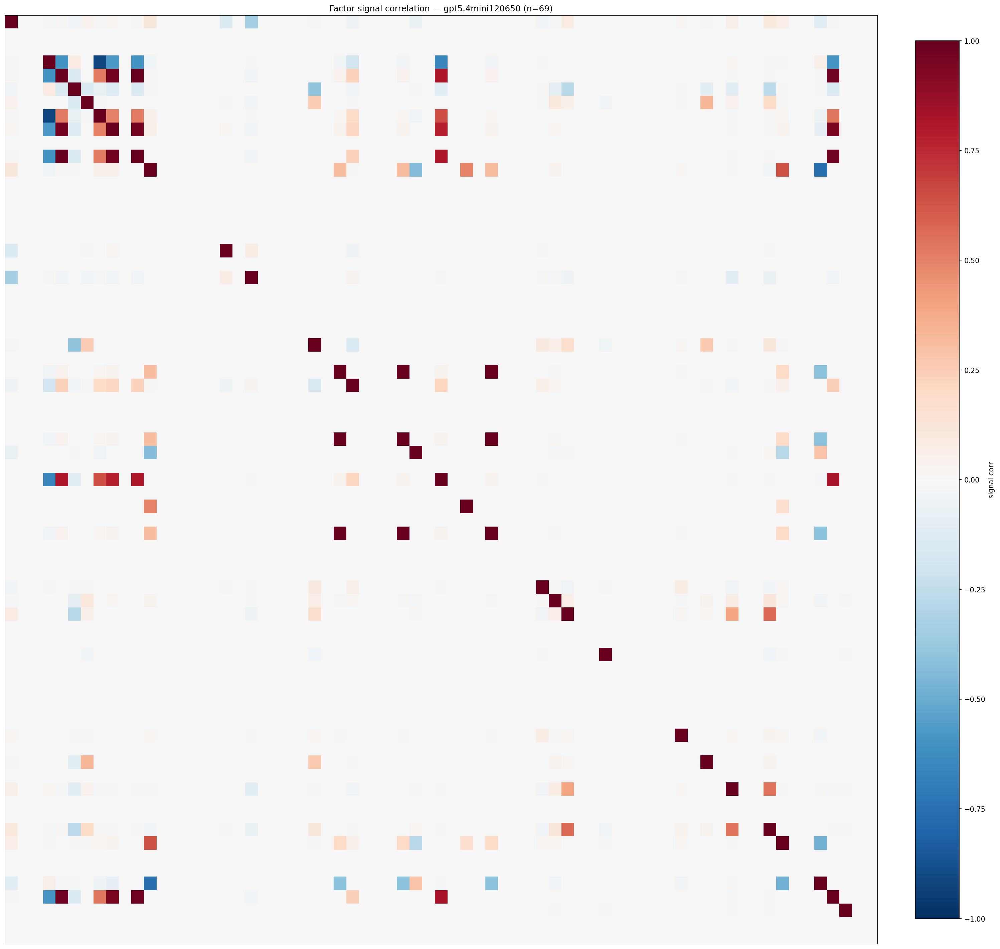

*Signal correlation matrix — gpt5.4mini120650*

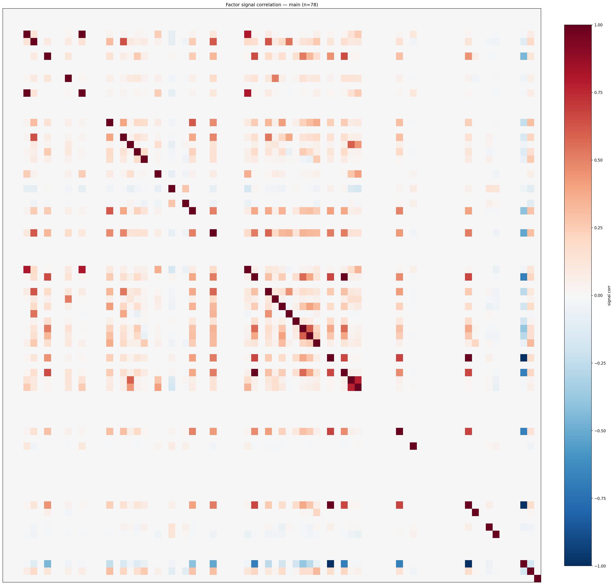

*Signal correlation matrix — main*

## 3. Deflation & model-based importance

`deflated_best_ic` haircuts each zoo's best |IC| for the number of factors tried (`ic_n_tested`) — a bigger zoo's best factor is more likely to be lucky. `lasso_n_nonzero` / `lasso_sparsity` show how many factors a sparse linear model actually keeps (model-view redundancy).

| prerun | best_ic | deflated_best_ic | deflated_best_t | ic_n_tested | ic_n_obs | lasso_n_nonzero | lasso_sparsity |
| --- | --- | --- | --- | --- | --- | --- | --- |
| gpt4omini120650 | 0.0245 | 0.0153 | 4.8099 | 64 | 98279 | 0 | 1.0 |
| gpt5.4mini120650 | 0.0171 | 0.0087 | 2.7418 | 31 | 98279 | 0 | 1.0 |
| main | 0.0156 | 0.007 | 2.1955 | 38 | 98279 | 0 | 1.0 |

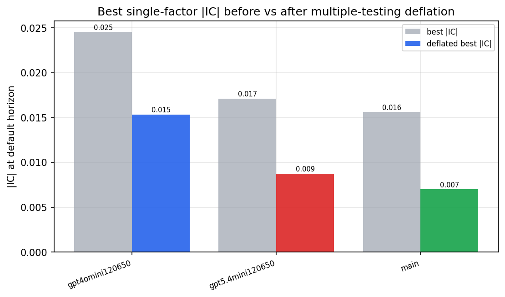

*Best |IC| before vs after multiple-testing deflation*

*Top factors by lasso importance per zoo*

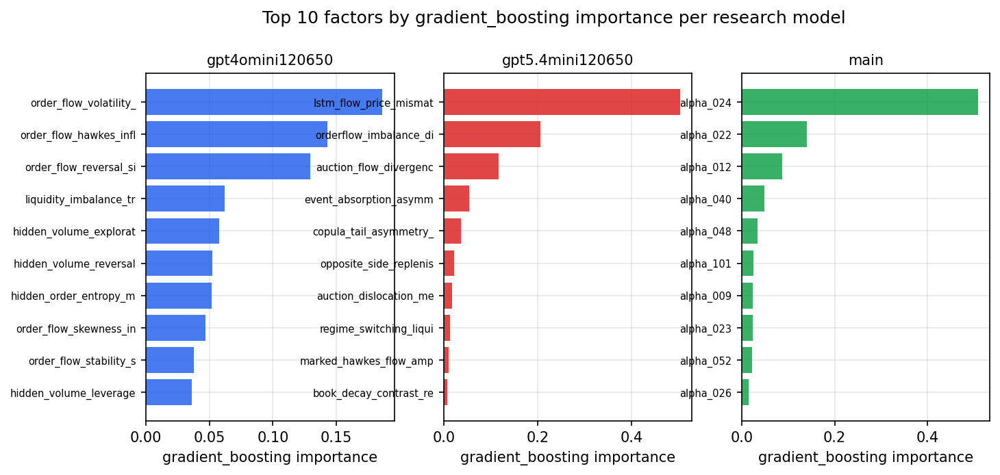

*Top factors by gradient_boosting importance per zoo*

## 4. ML-combined signal — per-underlying vectorised backtest

Each model combines a prerun's factors into ONE signal (fit `factors → forward return` on IS, predict per (bar, underlying)), then that combined signal is run through a simple vectorised backtest — `position(signal) × the underlying's own forward return` — on the held-out OOS tail (+ an equal-weight ensemble). No cross-sectional ranking.

> Config: position=**threshold** (t=1.0, z-score `expanding`), aggregation=**portfolio**, fit-standardise=**per_underlying**, horizon=6.

| prerun | model | n_factors_used | oos_ic | oos_sharpe | is_sharpe | oos_ann_return | oos_max_drawdown |
| --- | --- | --- | --- | --- | --- | --- | --- |
| gpt4omini120650 | linear_regression | 66 | 0.0 | -17.9321 | 5.5791 | -0.7789 | -0.0049 |
| gpt4omini120650 | ridge | 66 | 0.0004 | -17.3646 | 5.7183 | -0.7799 | -0.0048 |
| gpt4omini120650 | lasso | 66 | nan | nan | nan | nan | nan |
| gpt4omini120650 | elastic_net | 66 | nan | nan | nan | nan | nan |
| gpt4omini120650 | random_forest | 66 | 0.0336 | -1.8573 | 7.4608 | -0.0408 | -0.0008 |
| gpt4omini120650 | gradient_boosting | 66 | -0.0322 | 7.8514 | 6.4291 | 0.0842 | -0.0004 |
| gpt4omini120650 | xgboost | 66 | 0.0006 | -13.1612 | 8.7291 | -0.0881 | -0.0005 |
| gpt4omini120650 | lightgbm | 66 | 0.0115 | 13.0502 | 12.3246 | 0.0794 | -0.0002 |
| gpt4omini120650 | ensemble | 66 | 0.0038 | -12.9382 | 9.5059 | -0.3612 | -0.0015 |
| gpt5.4mini120650 | linear_regression | 69 | 0.0127 | -0.0943 | 4.6916 | -0.0032 | -0.002 |
| gpt5.4mini120650 | ridge | 69 | 0.014 | 6.4191 | 4.777 | 0.1906 | -0.0017 |
| gpt5.4mini120650 | lasso | 69 | nan | nan | nan | nan | nan |
| gpt5.4mini120650 | elastic_net | 69 | nan | nan | nan | nan | nan |
| gpt5.4mini120650 | random_forest | 69 | 0.0453 | 23.7423 | 6.0326 | 0.8477 | -0.0008 |
| gpt5.4mini120650 | gradient_boosting | 69 | 0.078 | -0.2892 | 5.0345 | -0.0028 | -0.0004 |
| gpt5.4mini120650 | xgboost | 69 | 0.0548 | 26.2261 | 7.1984 | 0.2873 | -0.0003 |
| gpt5.4mini120650 | lightgbm | 69 | 0.012 | 25.2854 | 11.5609 | 0.3107 | -0.0004 |
| gpt5.4mini120650 | ensemble | 69 | 0.032 | 22.7803 | 9.0245 | 0.6263 | -0.0008 |
| main | linear_regression | 78 | 0.0167 | 3.0232 | 8.2331 | 0.1211 | -0.0029 |
| main | ridge | 78 | 0.0151 | -0.3395 | 8.335 | -0.0136 | -0.003 |
| main | lasso | 78 | nan | nan | nan | nan | nan |
| main | elastic_net | 78 | nan | nan | nan | nan | nan |
| main | random_forest | 78 | -0.0154 | -4.3122 | 11.0273 | -0.1355 | -0.0028 |
| main | gradient_boosting | 78 | -0.0191 | -15.9966 | 9.0528 | -0.3369 | -0.0022 |
| main | xgboost | 78 | -0.029 | -3.6624 | 12.0468 | -0.0846 | -0.0017 |
| main | lightgbm | 78 | -0.0221 | -2.3205 | 14.708 | -0.0419 | -0.0009 |
| main | ensemble | 78 | -0.0036 | -10.065 | 13.404 | -0.2965 | -0.0039 |

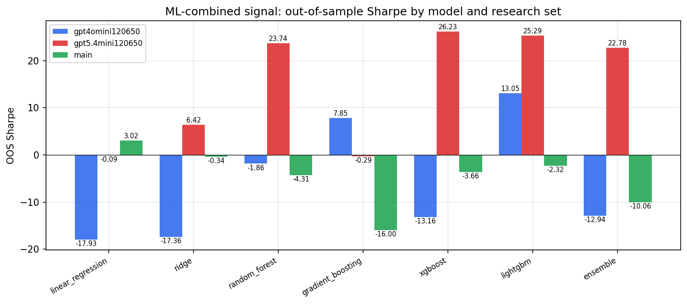

*ML-combined OOS Sharpe by model and research set*

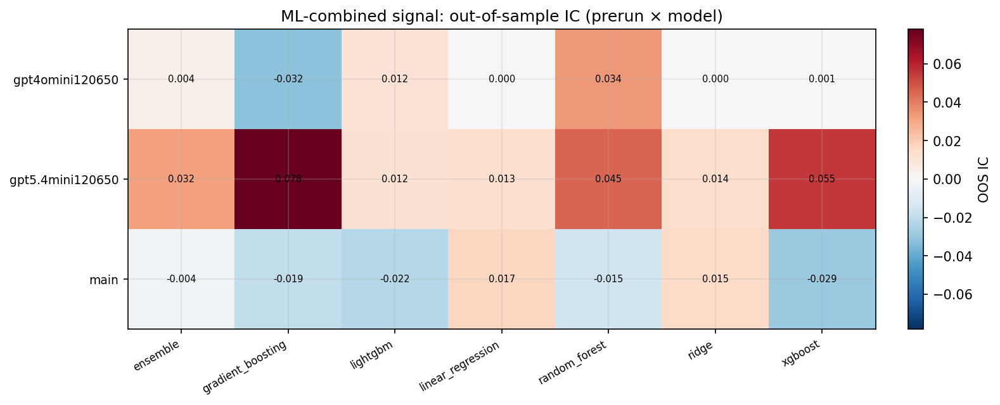

*ML-combined OOS IC (prerun × model)*

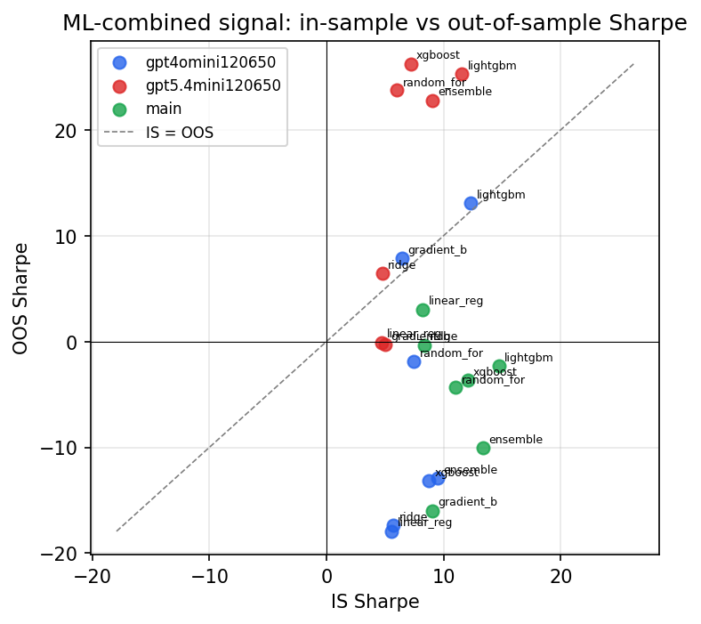

*IS vs OOS Sharpe (overfitting diagnostic)*

---
*Generated by `run_model_comparison.py`. Tables: `*.csv`; interactive: `comparison.ipynb`.*
