# Research-LLM factor comparison — `2024-03`

Comparing the **factor output of different research LLMs** on three axes (raw factor quality → factors as ML features → factors through the full agentic fund). The panel, IS/OOS split, horizon and model hyper-parameters are held identical across preruns — the *only* variable is the factor set.

## Preruns compared

| prerun | research_model | usable_factors | dropped_factors |
| --- | --- | --- | --- |
| gpt4omini120650 | gpt-4o-mini | 66 | 0 |
| gpt5.4mini120650 | gpt-5.4-mini | 69 | 0 |
| main | seed library | 77 | 11 |

> Dropped factors declare fields the current data doesn't have yet (e.g. fundamentals); they light up unchanged once that data is downloaded.

*Usable vs awaiting-data factors per research model*

## Key findings

- **Best ML-combined OOS Sharpe:** `gpt5.4mini120650` with `random_forest` (OOS Sharpe = 29.616).
- **Mean OOS Sharpe across models, by research set:** `gpt5.4mini120650` = 20.858, `gpt4omini120650` = 11.941, `main` = 1.690.
- **Highest mean single-factor |IC| (h=6):** `gpt4omini120650` (mean |IC| = 0.0327).
- **Most diverse zoo (highest effective/raw factor ratio):** `gpt5.4mini120650` (eff 56.8 of 69, ratio 0.82).
- **Best selection-deflated single-factor |IC|:** `gpt5.4mini120650` (deflated |IC| = 0.1164 from 29 factors tried).

## 1. Single-factor IC (raw factor quality)

Per-underlying time-series Spearman rank-IC of every researched factor, recomputed on the shared panel at horizons h=1, h=6, h=60. The per-underlying IC correlates each factor's value vector with the underlying's own forward-return vector (pooled across underlyings); the cross-sectional IC ranks across underlyings per timestamp.

| prerun | n_factors | mean_abs_ic_1 | mean_abs_ic_6 | mean_abs_ic_60 | mean_abs_icir_6 | best_factor_h6 | best_abs_ic_h6 |
| --- | --- | --- | --- | --- | --- | --- | --- |
| gpt4omini120650 | 66 | 0.022 | 0.0327 | 0.0298 | 1.1301 | hawkes_process_order_flow_indicator | 0.1209 |
| gpt5.4mini120650 | 69 | 0.0134 | 0.0221 | 0.0235 | 1.1439 | lstm_flow_price_mismatch | 0.1233 |
| main | 77 | 0.0187 | 0.015 | 0.0179 | 0.3576 | alpha_059 | 0.0887 |

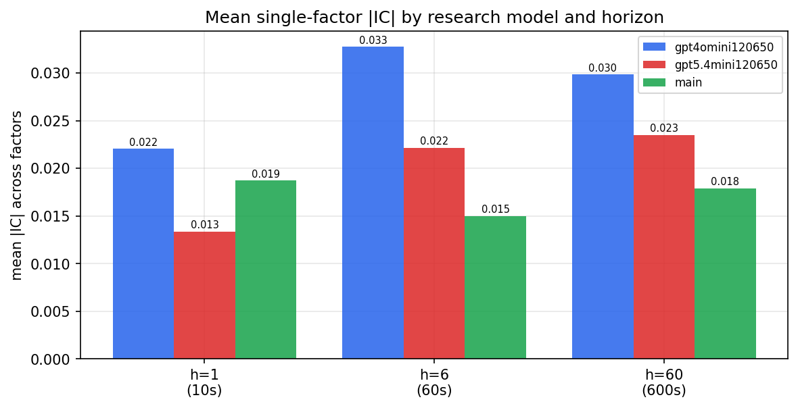

*Mean |IC| by research model and horizon*

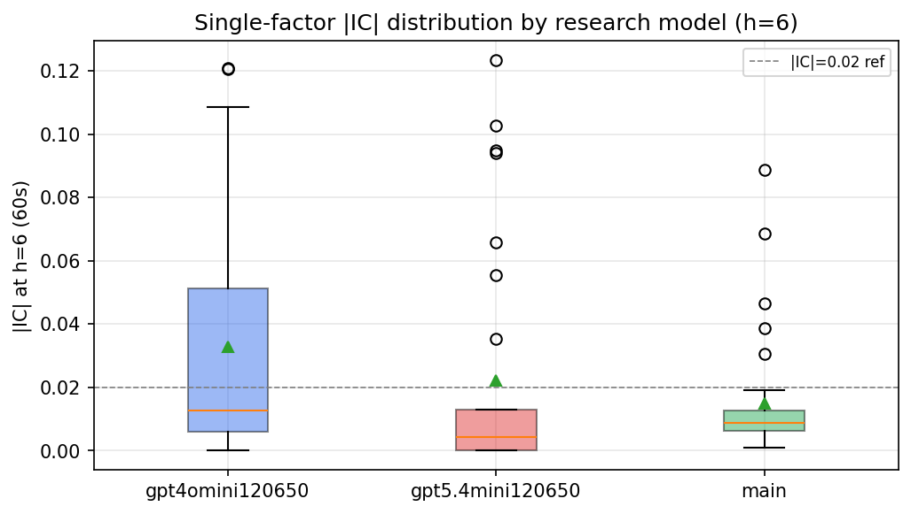

*Per-factor |IC| distribution by research model*

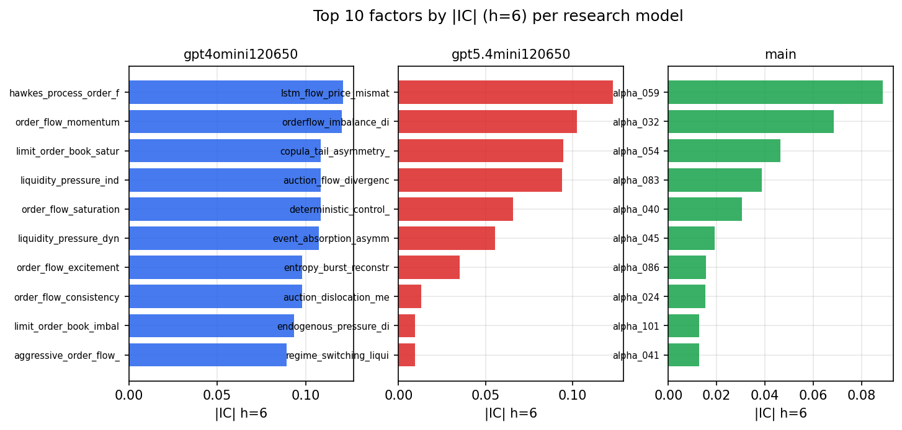

*Top factors by |IC| per research model*

## 2. Factor diversity & redundancy

Pairwise correlation of each zoo's *signals*. `eff_n_factors` is the effective number of independent factors (participation ratio of the correlation eigenvalues); `eff_ratio` and `redundancy` summarise how much unique information the zoo holds vs. how much is duplicated; `n_clusters` groups factors at |corr| ≥ 0.7.

| prerun | n_factors | eff_n_factors | eff_ratio | mean_abs_corr | n_clusters | redundancy |
| --- | --- | --- | --- | --- | --- | --- |
| gpt4omini120650 | 66 | 36.1119 | 0.5472 | 0.0385 | 56 | 0.4528 |
| gpt5.4mini120650 | 69 | 56.7973 | 0.8231 | 0.0088 | 65 | 0.1769 |
| main | 77 | 31.8654 | 0.4138 | 0.0441 | 63 | 0.5862 |

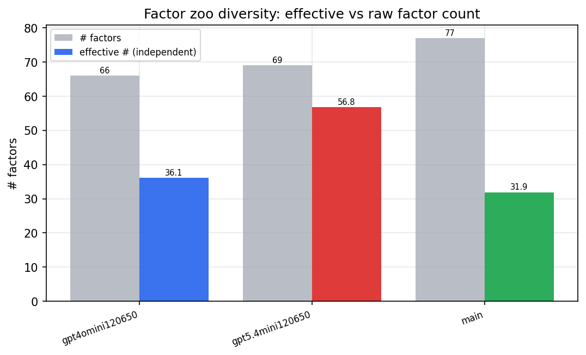

*Effective vs raw factor count per research model*

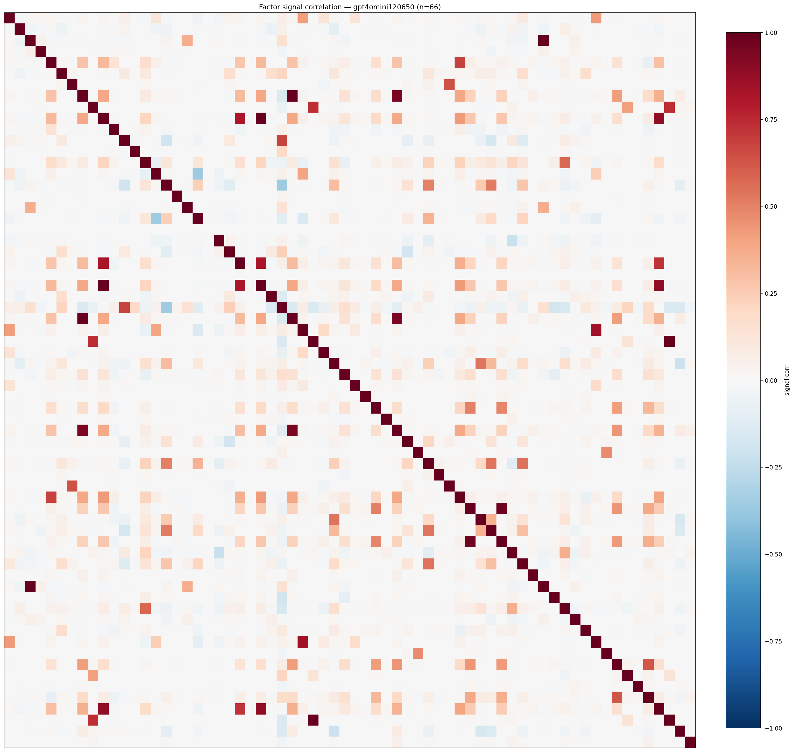

*Signal correlation matrix — gpt4omini120650*

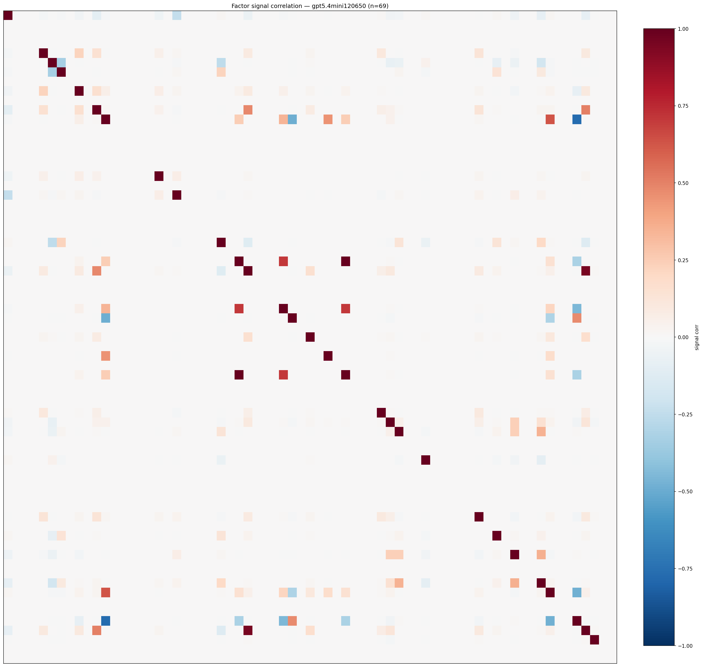

*Signal correlation matrix — gpt5.4mini120650*

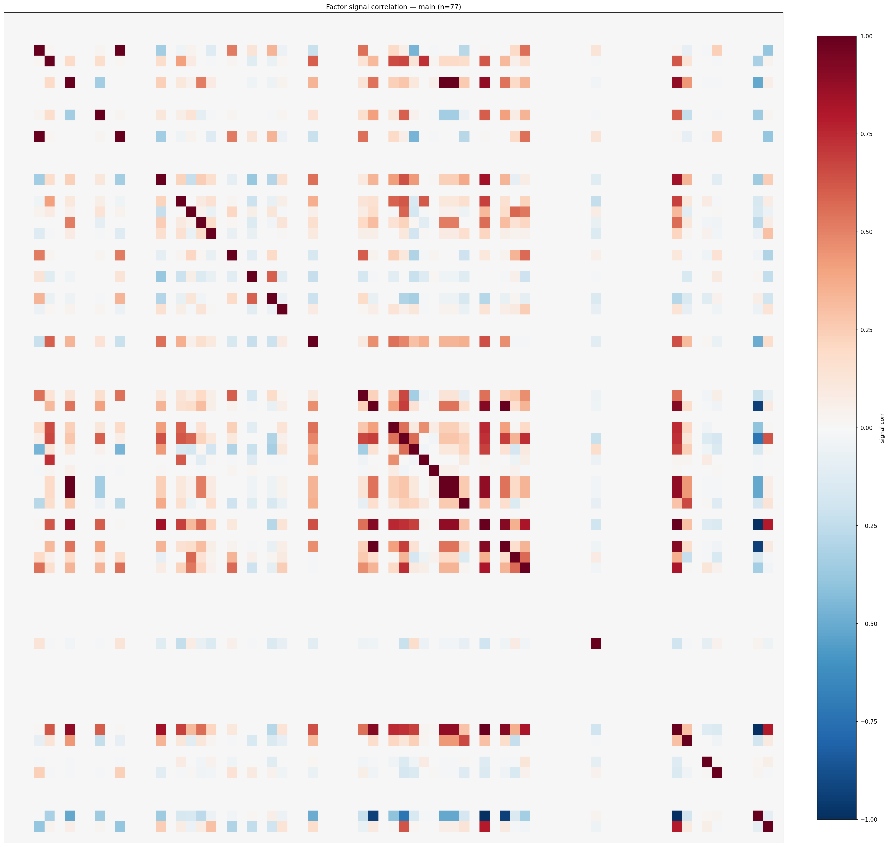

*Signal correlation matrix — main*

## 3. Deflation & model-based importance

`deflated_best_ic` haircuts each zoo's best |IC| for the number of factors tried (`ic_n_tested`) — a bigger zoo's best factor is more likely to be lucky. `lasso_n_nonzero` / `lasso_sparsity` show how many factors a sparse linear model actually keeps (model-view redundancy).

| prerun | best_ic | deflated_best_ic | deflated_best_t | ic_n_tested | ic_n_obs | lasso_n_nonzero | lasso_sparsity |
| --- | --- | --- | --- | --- | --- | --- | --- |
| gpt4omini120650 | 0.1209 | 0.1133 | 42.8044 | 64 | 142739 | 7 | 0.8939 |
| gpt5.4mini120650 | 0.1233 | 0.1164 | 43.9712 | 29 | 142739 | 9 | 0.8696 |
| main | 0.0887 | 0.0816 | 30.8218 | 36 | 142739 | 2 | 0.974 |

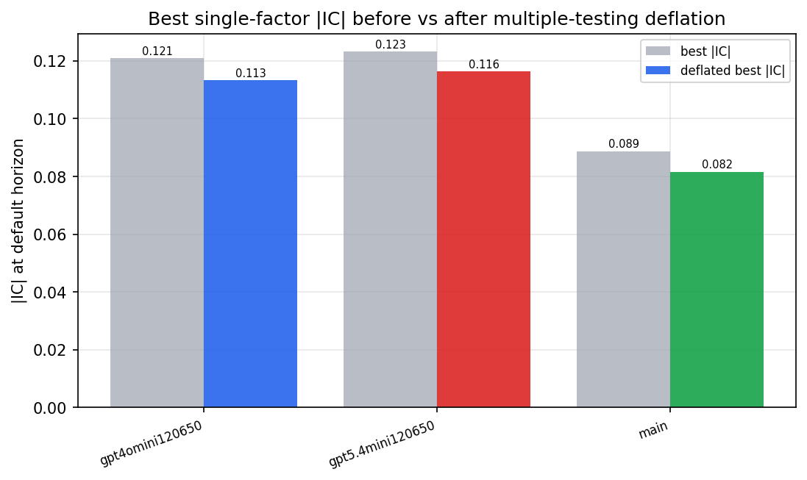

*Best |IC| before vs after multiple-testing deflation*

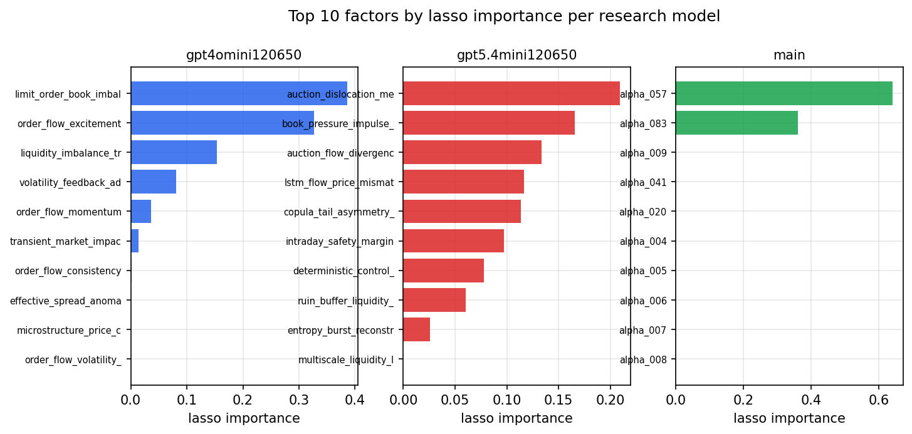

*Top factors by lasso importance per zoo*

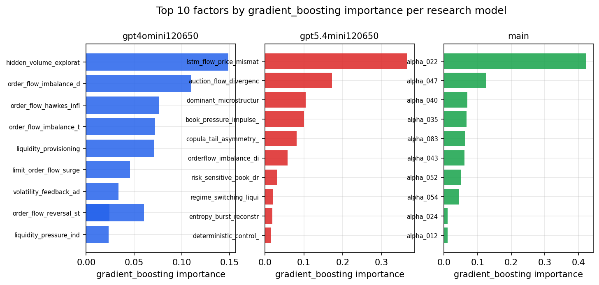

*Top factors by gradient_boosting importance per zoo*

## 4. ML-combined signal — per-underlying vectorised backtest

Each model combines a prerun's factors into ONE signal (fit `factors → forward return` on IS, predict per (bar, underlying)), then that combined signal is run through a simple vectorised backtest — `position(signal) × the underlying's own forward return` — on the held-out OOS tail (+ an equal-weight ensemble). No cross-sectional ranking.

> Config: position=**threshold** (t=1.0, z-score `expanding`), aggregation=**portfolio**, fit-standardise=**per_underlying**, horizon=6.

| prerun | model | n_factors_used | oos_ic | oos_sharpe | is_sharpe | oos_ann_return | oos_max_drawdown |
| --- | --- | --- | --- | --- | --- | --- | --- |
| gpt4omini120650 | linear_regression | 66 | 0.1063 | 12.4281 | 19.2906 | 0.0508 | -0.0005 |
| gpt4omini120650 | ridge | 66 | 0.1057 | 13.0891 | 19.8424 | 0.0557 | -0.0006 |
| gpt4omini120650 | lasso | 66 | 0.1093 | 22.2718 | 22.4632 | 0.0959 | -0.0005 |
| gpt4omini120650 | elastic_net | 66 | 0.1082 | 22.6742 | 23.0114 | 0.1003 | -0.0006 |
| gpt4omini120650 | random_forest | 66 | 0.1124 | 19.226 | 17.8813 | 0.0978 | -0.0004 |
| gpt4omini120650 | gradient_boosting | 66 | 0.1162 | -0.2381 | 8.6845 | -0.0005 | -0.0006 |
| gpt4omini120650 | xgboost | 66 | 0.1271 | 1.2804 | 13.1309 | 0.0041 | -0.001 |
| gpt4omini120650 | lightgbm | 66 | 0.1271 | 0.0616 | 16.5959 | 0.0002 | -0.0009 |
| gpt4omini120650 | ensemble | 66 | 0.1174 | 16.6796 | 20.6732 | 0.0756 | -0.0006 |
| gpt5.4mini120650 | linear_regression | 69 | 0.1019 | 22.6763 | 19.344 | 0.0985 | -0.0003 |
| gpt5.4mini120650 | ridge | 69 | 0.1018 | 24.1004 | 19.6336 | 0.1061 | -0.0003 |
| gpt5.4mini120650 | lasso | 69 | 0.1035 | 24.7248 | 22.6453 | 0.1053 | -0.0004 |
| gpt5.4mini120650 | elastic_net | 69 | 0.104 | 26.3413 | 22.3669 | 0.1112 | -0.0004 |
| gpt5.4mini120650 | random_forest | 69 | 0.1637 | 29.6163 | 27.3424 | 0.1597 | -0.0007 |
| gpt5.4mini120650 | gradient_boosting | 69 | 0.1495 | 0.1114 | 9.751 | 0.0001 | -0.0004 |
| gpt5.4mini120650 | xgboost | 69 | 0.1703 | 17.7496 | 20.0905 | 0.051 | -0.0003 |
| gpt5.4mini120650 | lightgbm | 69 | 0.1678 | 14.5753 | 19.4948 | 0.0431 | -0.0003 |
| gpt5.4mini120650 | ensemble | 69 | 0.1413 | 27.8268 | 23.7727 | 0.1351 | -0.0006 |
| main | linear_regression | 77 | 0.0099 | 1.616 | 7.5684 | 0.008 | -0.0017 |
| main | ridge | 77 | 0.0116 | 2.0356 | 7.3252 | 0.0104 | -0.0019 |
| main | lasso | 77 | nan | nan | nan | nan | nan |
| main | elastic_net | 77 | nan | nan | nan | nan | nan |
| main | random_forest | 77 | 0.0147 | 0.0944 | 9.6214 | 0.0004 | -0.0015 |
| main | gradient_boosting | 77 | 0.0181 | -1.9805 | 10.3435 | -0.0052 | -0.0015 |
| main | xgboost | 77 | 0.0184 | -0.1267 | 12.5268 | -0.0005 | -0.0017 |
| main | lightgbm | 77 | 0.0217 | 7.4157 | 15.7029 | 0.0202 | -0.0004 |
| main | ensemble | 77 | 0.0098 | 2.7726 | 12.4176 | 0.0121 | -0.0018 |

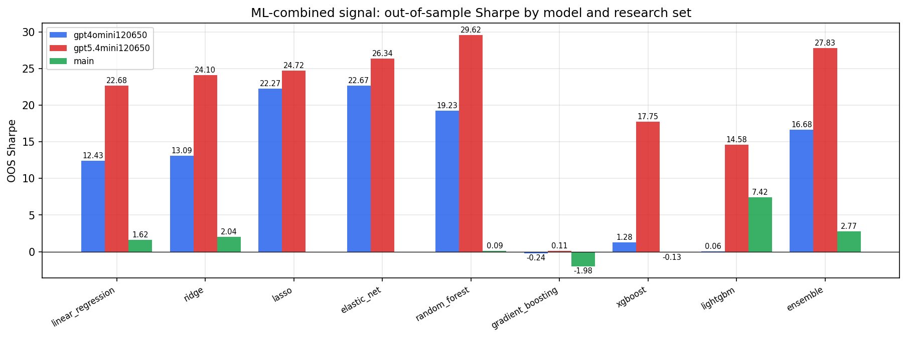

*ML-combined OOS Sharpe by model and research set*

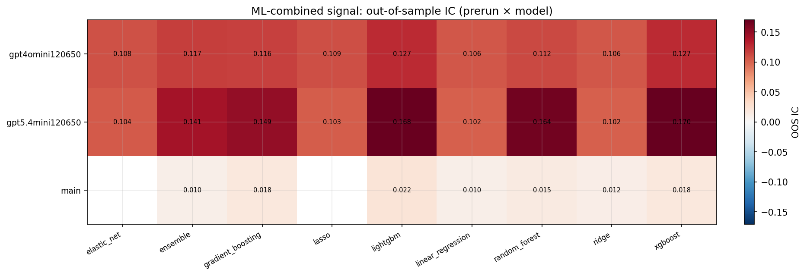

*ML-combined OOS IC (prerun × model)*

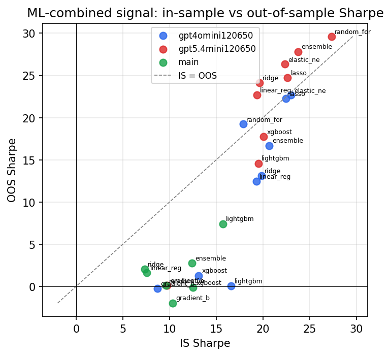

*IS vs OOS Sharpe (overfitting diagnostic)*

---
*Generated by `run_model_comparison.py`. Tables: `*.csv`; interactive: `comparison.ipynb`.*
