# Research-LLM factor comparison — `2024-04`

Comparing the **factor output of different research LLMs** on three axes (raw factor quality → factors as ML features → factors through the full agentic fund). The panel, IS/OOS split, horizon and model hyper-parameters are held identical across preruns — the *only* variable is the factor set.

## Preruns compared

| prerun | research_model | usable_factors | dropped_factors |
| --- | --- | --- | --- |
| gpt4omini120650 | gpt-4o-mini | 66 | 0 |
| gpt5.4mini120650 | gpt-5.4-mini | 69 | 0 |
| main | seed library | 77 | 11 |

> Dropped factors declare fields the current data doesn't have yet (e.g. fundamentals); they light up unchanged once that data is downloaded.

*Usable vs awaiting-data factors per research model*

## Key findings

- **Best ML-combined OOS Sharpe:** `gpt5.4mini120650` with `random_forest` (OOS Sharpe = 25.024).
- **Mean OOS Sharpe across models, by research set:** `gpt4omini120650` = 7.101, `gpt5.4mini120650` = 5.999, `main` = -1.549.
- **Highest mean single-factor |IC| (h=6):** `gpt4omini120650` (mean |IC| = 0.0303).
- **Most diverse zoo (highest effective/raw factor ratio):** `gpt5.4mini120650` (eff 57.3 of 69, ratio 0.83).
- **Best selection-deflated single-factor |IC|:** `gpt4omini120650` (deflated |IC| = 0.1159 from 64 factors tried).

## 1. Single-factor IC (raw factor quality)

Per-underlying time-series Spearman rank-IC of every researched factor, recomputed on the shared panel at horizons h=1, h=6, h=60. The per-underlying IC correlates each factor's value vector with the underlying's own forward-return vector (pooled across underlyings); the cross-sectional IC ranks across underlyings per timestamp.

| prerun | n_factors | mean_abs_ic_1 | mean_abs_ic_6 | mean_abs_ic_60 | mean_abs_icir_6 | best_factor_h6 | best_abs_ic_h6 |
| --- | --- | --- | --- | --- | --- | --- | --- |
| gpt4omini120650 | 66 | 0.019 | 0.0303 | 0.0291 | 1.0748 | order_flow_momentum | 0.1235 |
| gpt5.4mini120650 | 69 | 0.0128 | 0.0221 | 0.0236 | 1.0974 | lstm_flow_price_mismatch | 0.1112 |
| main | 77 | 0.0224 | 0.0154 | 0.016 | 0.3773 | alpha_054 | 0.0631 |

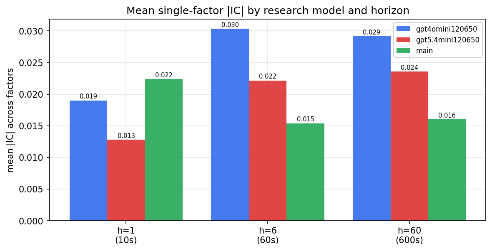

*Mean |IC| by research model and horizon*

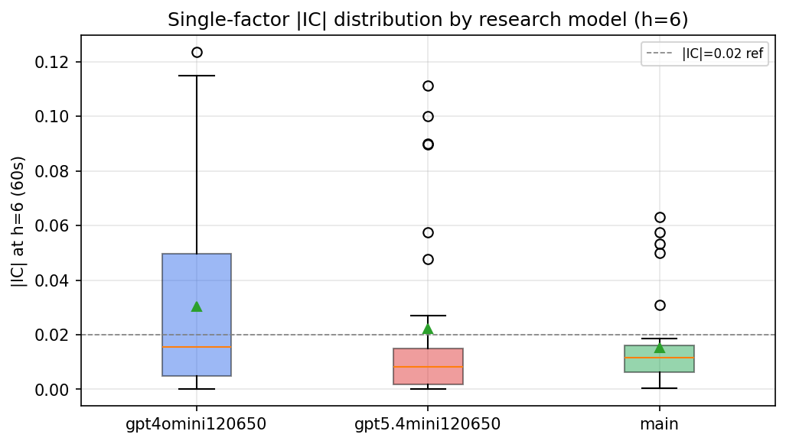

*Per-factor |IC| distribution by research model*

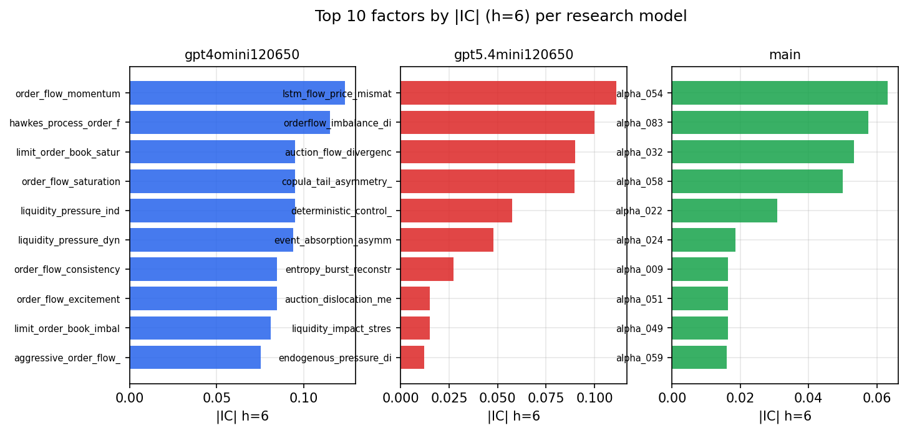

*Top factors by |IC| per research model*

## 2. Factor diversity & redundancy

Pairwise correlation of each zoo's *signals*. `eff_n_factors` is the effective number of independent factors (participation ratio of the correlation eigenvalues); `eff_ratio` and `redundancy` summarise how much unique information the zoo holds vs. how much is duplicated; `n_clusters` groups factors at |corr| ≥ 0.7.

| prerun | n_factors | eff_n_factors | eff_ratio | mean_abs_corr | n_clusters | redundancy |
| --- | --- | --- | --- | --- | --- | --- |
| gpt4omini120650 | 66 | 36.2038 | 0.5485 | 0.039 | 57 | 0.4515 |
| gpt5.4mini120650 | 69 | 57.2879 | 0.8303 | 0.0082 | 65 | 0.1697 |
| main | 77 | 32.7776 | 0.4257 | 0.0427 | 62 | 0.5743 |

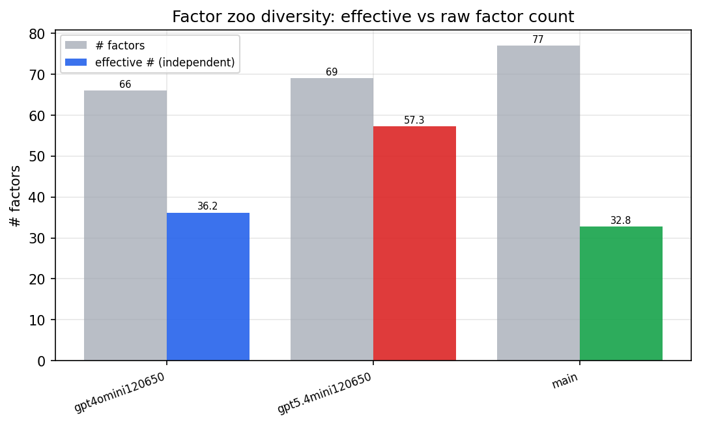

*Effective vs raw factor count per research model*

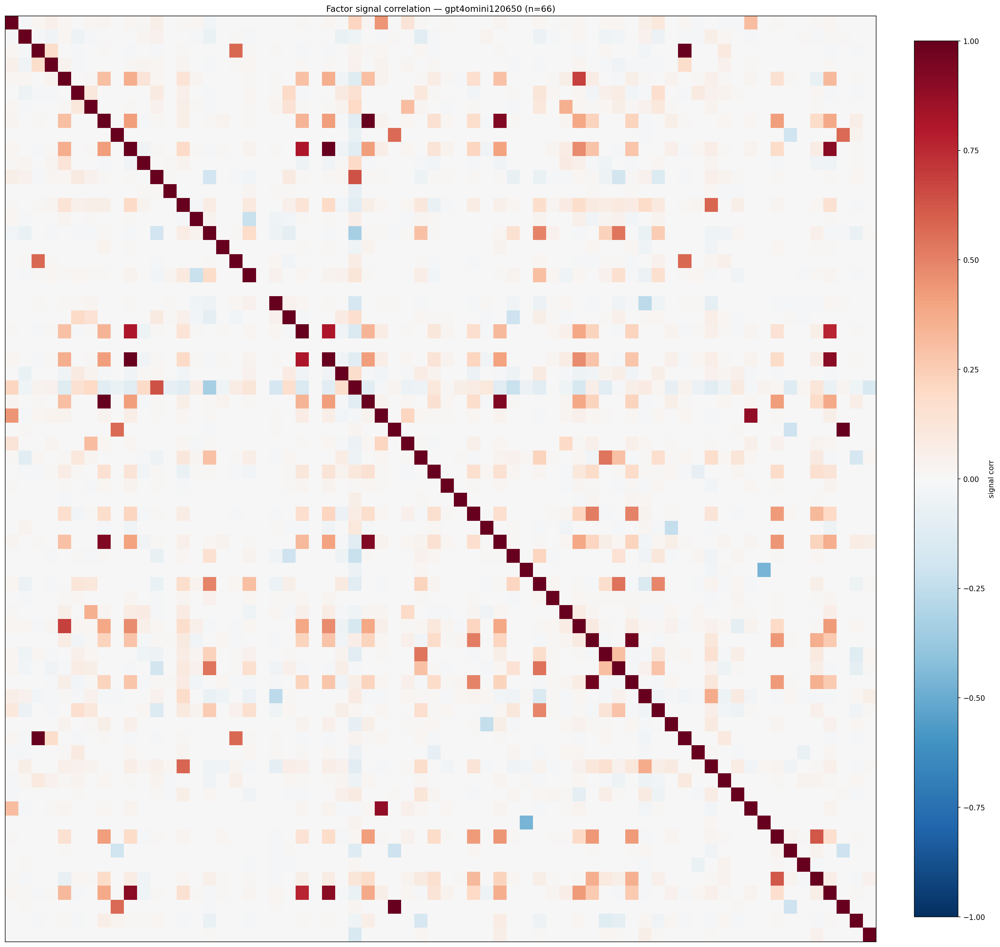

*Signal correlation matrix — gpt4omini120650*

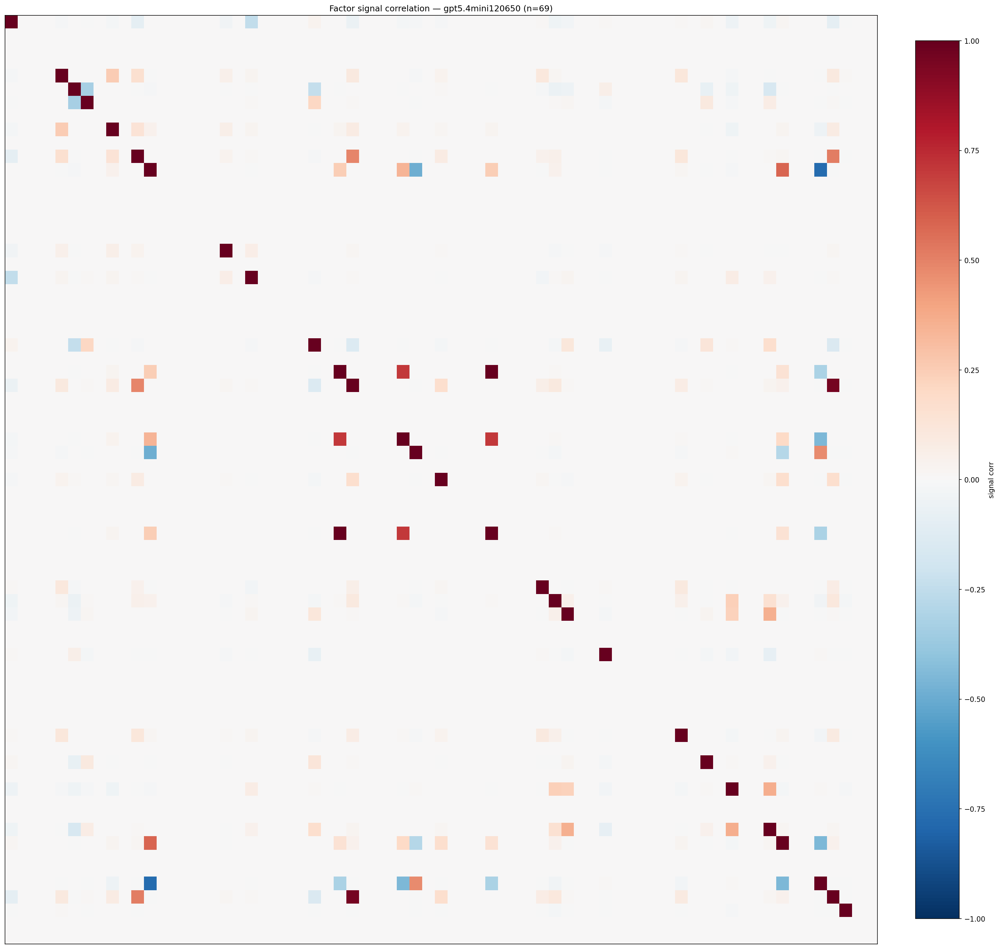

*Signal correlation matrix — gpt5.4mini120650*

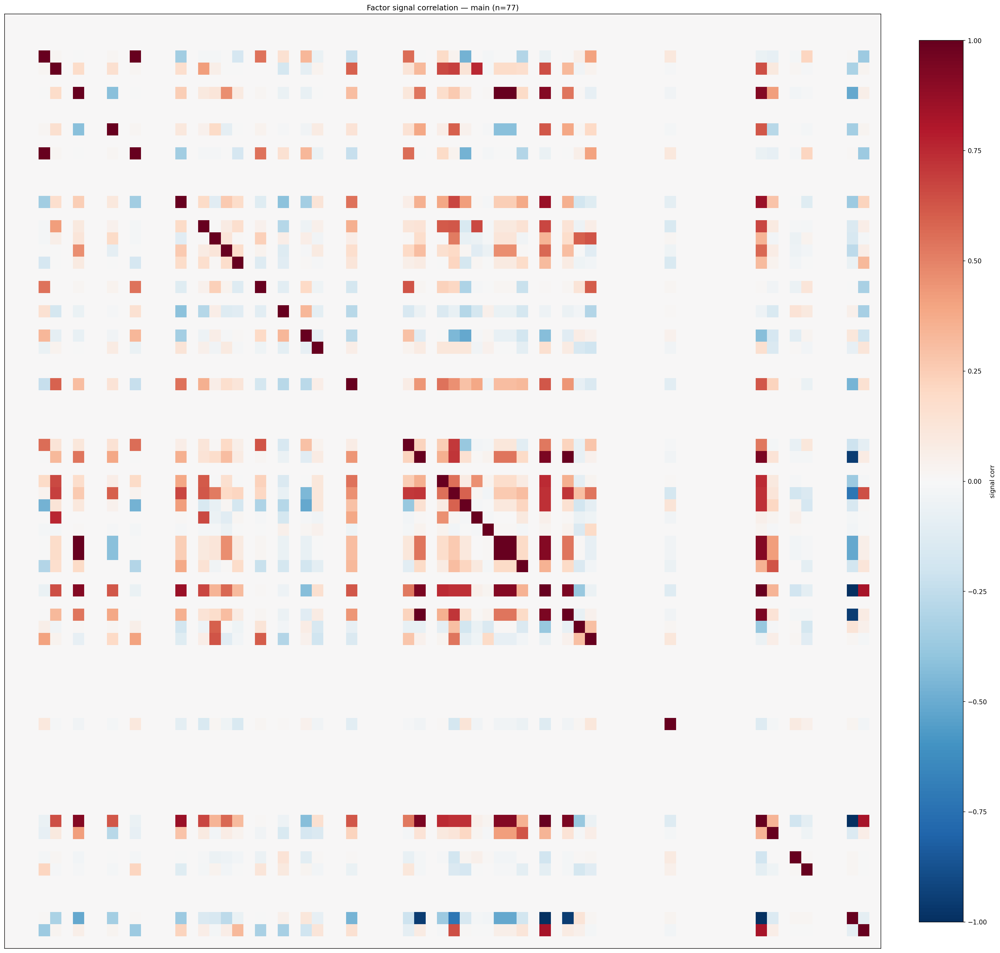

*Signal correlation matrix — main*

## 3. Deflation & model-based importance

`deflated_best_ic` haircuts each zoo's best |IC| for the number of factors tried (`ic_n_tested`) — a bigger zoo's best factor is more likely to be lucky. `lasso_n_nonzero` / `lasso_sparsity` show how many factors a sparse linear model actually keeps (model-view redundancy).

| prerun | best_ic | deflated_best_ic | deflated_best_t | ic_n_tested | ic_n_obs | lasso_n_nonzero | lasso_sparsity |
| --- | --- | --- | --- | --- | --- | --- | --- |
| gpt4omini120650 | 0.1235 | 0.1159 | 44.1428 | 64 | 145079 | 0 | 1.0 |
| gpt5.4mini120650 | 0.1112 | 0.1043 | 39.7448 | 29 | 145079 | 12 | 0.8261 |
| main | 0.0631 | 0.0561 | 21.3641 | 36 | 145079 | 0 | 1.0 |

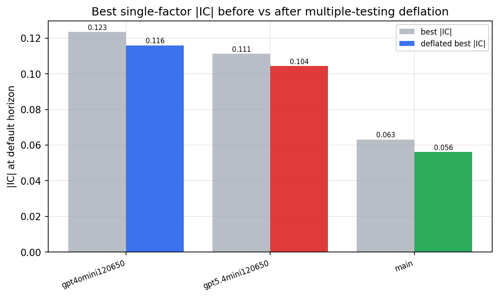

*Best |IC| before vs after multiple-testing deflation*

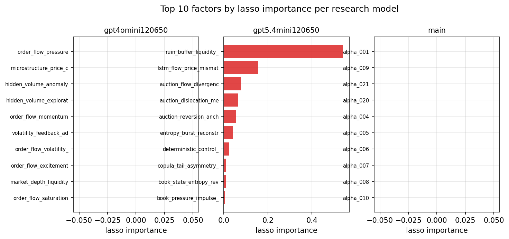

*Top factors by lasso importance per zoo*

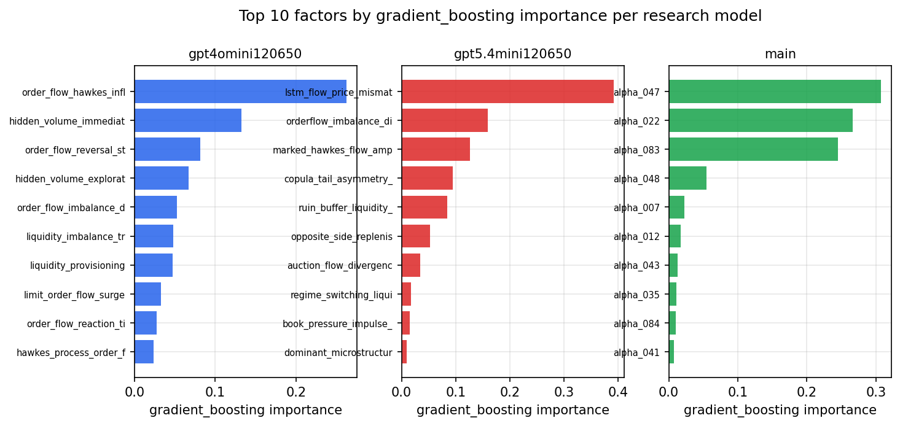

*Top factors by gradient_boosting importance per zoo*

## 4. ML-combined signal — per-underlying vectorised backtest

Each model combines a prerun's factors into ONE signal (fit `factors → forward return` on IS, predict per (bar, underlying)), then that combined signal is run through a simple vectorised backtest — `position(signal) × the underlying's own forward return` — on the held-out OOS tail (+ an equal-weight ensemble). No cross-sectional ranking.

> Config: position=**threshold** (t=1.0, z-score `expanding`), aggregation=**portfolio**, fit-standardise=**per_underlying**, horizon=6.

| prerun | model | n_factors_used | oos_ic | oos_sharpe | is_sharpe | oos_ann_return | oos_max_drawdown |
| --- | --- | --- | --- | --- | --- | --- | --- |
| gpt4omini120650 | linear_regression | 66 | 0.1144 | 13.7492 | 10.054 | 0.109 | -0.0006 |
| gpt4omini120650 | ridge | 66 | 0.1167 | 13.7785 | 9.7396 | 0.1095 | -0.0006 |
| gpt4omini120650 | lasso | 66 | nan | nan | nan | nan | nan |
| gpt4omini120650 | elastic_net | 66 | nan | nan | nan | nan | nan |
| gpt4omini120650 | random_forest | 66 | 0.1227 | 3.0252 | 8.6509 | 0.0296 | -0.0024 |
| gpt4omini120650 | gradient_boosting | 66 | 0.114 | 2.679 | 7.1664 | 0.0082 | -0.0005 |
| gpt4omini120650 | xgboost | 66 | 0.1425 | 4.1623 | 9.2277 | 0.0285 | -0.0013 |
| gpt4omini120650 | lightgbm | 66 | 0.1425 | 6.3726 | 12.0054 | 0.0363 | -0.0005 |
| gpt4omini120650 | ensemble | 66 | 0.1046 | 5.9407 | 9.5727 | 0.0359 | -0.0006 |
| gpt5.4mini120650 | linear_regression | 69 | 0.1181 | 7.6644 | 4.5267 | 0.0443 | -0.0008 |
| gpt5.4mini120650 | ridge | 69 | 0.1177 | 7.4498 | 4.4007 | 0.0478 | -0.0008 |
| gpt5.4mini120650 | lasso | 69 | nan | nan | nan | nan | nan |
| gpt5.4mini120650 | elastic_net | 69 | -0.0092 | -0.7867 | 3.021 | -0.0025 | -0.0007 |
| gpt5.4mini120650 | random_forest | 69 | 0.1643 | 25.0243 | 16.2546 | 0.2117 | -0.0006 |
| gpt5.4mini120650 | gradient_boosting | 69 | 0.1451 | 0.6053 | 6.3747 | 0.0022 | -0.0008 |
| gpt5.4mini120650 | xgboost | 69 | 0.1654 | -3.4694 | 8.0594 | -0.0107 | -0.0019 |
| gpt5.4mini120650 | lightgbm | 69 | 0.1762 | 3.8674 | 11.1206 | 0.0151 | -0.0011 |
| gpt5.4mini120650 | ensemble | 69 | 0.1464 | 7.6337 | 9.793 | 0.0447 | -0.0008 |
| main | linear_regression | 77 | -0.0066 | 1.6795 | 6.0835 | 0.0123 | -0.0018 |
| main | ridge | 77 | -0.0038 | 1.085 | 6.2992 | 0.0082 | -0.002 |
| main | lasso | 77 | nan | nan | nan | nan | nan |
| main | elastic_net | 77 | nan | nan | nan | nan | nan |
| main | random_forest | 77 | -0.0065 | -4.8066 | 8.4327 | -0.0404 | -0.0051 |
| main | gradient_boosting | 77 | -0.0063 | -1.9193 | 8.1979 | -0.0123 | -0.0025 |
| main | xgboost | 77 | -0.01 | -5.6007 | 9.948 | -0.0391 | -0.0044 |
| main | lightgbm | 77 | -0.0107 | -0.8412 | 10.4219 | -0.0033 | -0.001 |
| main | ensemble | 77 | -0.0113 | -0.4367 | 8.9185 | -0.0033 | -0.0027 |

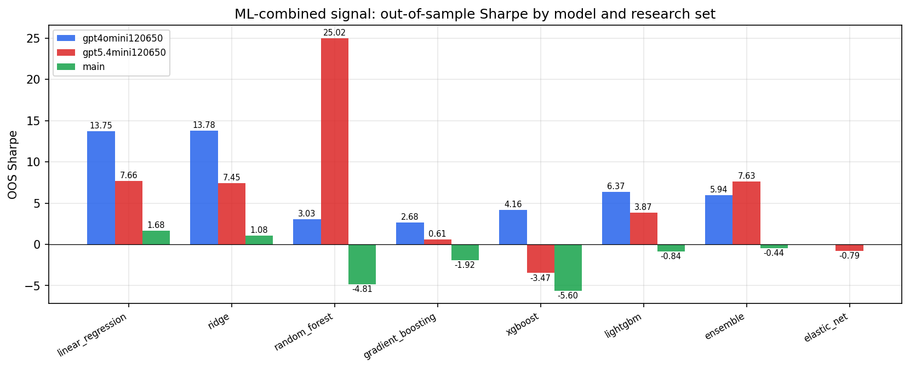

*ML-combined OOS Sharpe by model and research set*

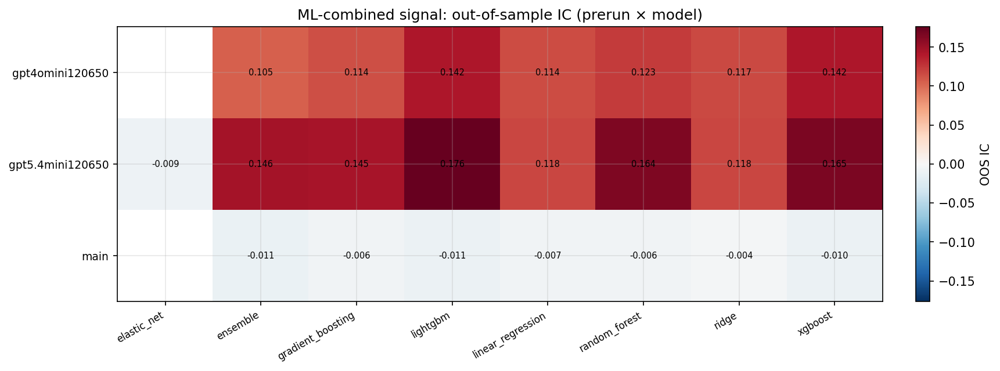

*ML-combined OOS IC (prerun × model)*

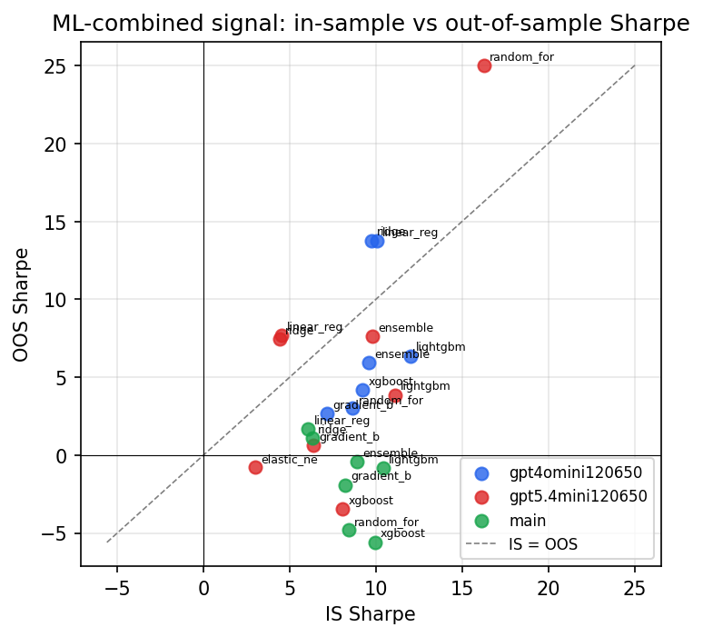

*IS vs OOS Sharpe (overfitting diagnostic)*

---
*Generated by `run_model_comparison.py`. Tables: `*.csv`; interactive: `comparison.ipynb`.*
