# Research-LLM factor comparison — `2024-05`

Comparing the **factor output of different research LLMs** on three axes (raw factor quality → factors as ML features → factors through the full agentic fund). The panel, IS/OOS split, horizon and model hyper-parameters are held identical across preruns — the *only* variable is the factor set.

## Preruns compared

| prerun | research_model | usable_factors | dropped_factors |
| --- | --- | --- | --- |
| gpt4omini120650 | gpt-4o-mini | 66 | 0 |
| gpt5.4mini120650 | gpt-5.4-mini | 69 | 0 |
| main | seed library | 77 | 11 |

> Dropped factors declare fields the current data doesn't have yet (e.g. fundamentals); they light up unchanged once that data is downloaded.

*Usable vs awaiting-data factors per research model*

## Key findings

- **Best ML-combined OOS Sharpe:** `gpt5.4mini120650` with `random_forest` (OOS Sharpe = 10.390).
- **Mean OOS Sharpe across models, by research set:** `gpt5.4mini120650` = 0.961, `gpt4omini120650` = -1.794, `main` = -2.585.
- **Highest mean single-factor |IC| (h=6):** `gpt4omini120650` (mean |IC| = 0.0279).
- **Most diverse zoo (highest effective/raw factor ratio):** `gpt5.4mini120650` (eff 61.0 of 69, ratio 0.88).
- **Best selection-deflated single-factor |IC|:** `gpt4omini120650` (deflated |IC| = 0.1013 from 64 factors tried).

## 1. Single-factor IC (raw factor quality)

Per-underlying time-series Spearman rank-IC of every researched factor, recomputed on the shared panel at horizons h=1, h=6, h=60. The per-underlying IC correlates each factor's value vector with the underlying's own forward-return vector (pooled across underlyings); the cross-sectional IC ranks across underlyings per timestamp.

| prerun | n_factors | mean_abs_ic_1 | mean_abs_ic_6 | mean_abs_ic_60 | mean_abs_icir_6 | best_factor_h6 | best_abs_ic_h6 |
| --- | --- | --- | --- | --- | --- | --- | --- |
| gpt4omini120650 | 66 | 0.0179 | 0.0279 | 0.0261 | 0.9804 | order_flow_momentum | 0.1087 |
| gpt5.4mini120650 | 69 | 0.015 | 0.0233 | 0.0241 | 0.9381 | lstm_flow_price_mismatch | 0.0982 |
| main | 77 | 0.0236 | 0.0179 | 0.0148 | 0.3967 | alpha_054 | 0.0892 |

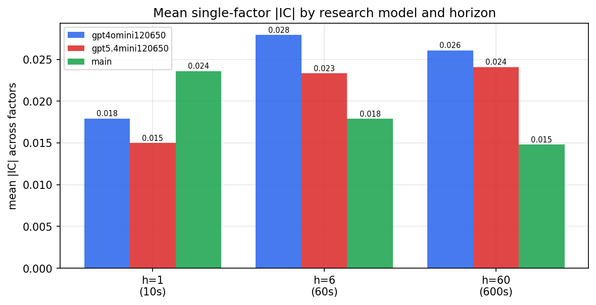

*Mean |IC| by research model and horizon*

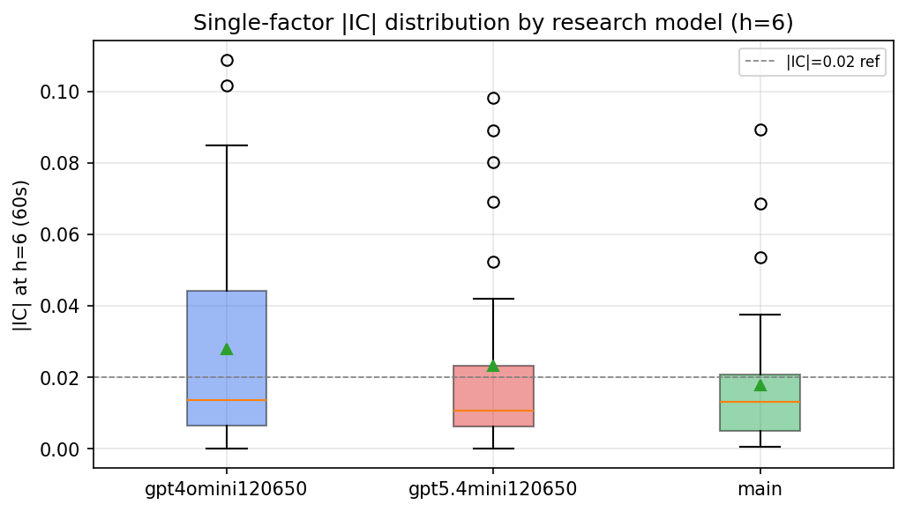

*Per-factor |IC| distribution by research model*

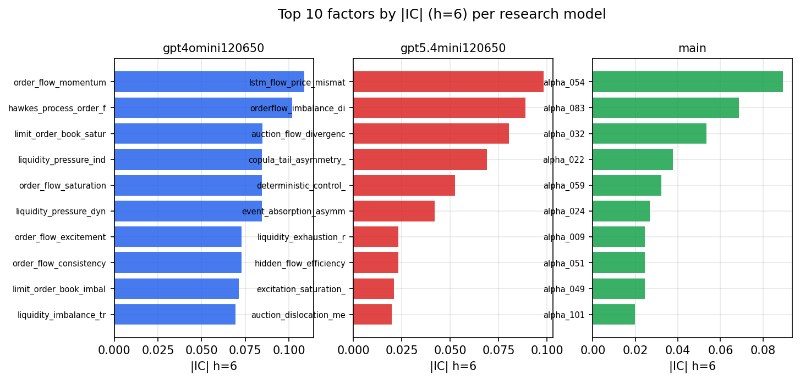

*Top factors by |IC| per research model*

## 2. Factor diversity & redundancy

Pairwise correlation of each zoo's *signals*. `eff_n_factors` is the effective number of independent factors (participation ratio of the correlation eigenvalues); `eff_ratio` and `redundancy` summarise how much unique information the zoo holds vs. how much is duplicated; `n_clusters` groups factors at |corr| ≥ 0.7.

| prerun | n_factors | eff_n_factors | eff_ratio | mean_abs_corr | n_clusters | redundancy |
| --- | --- | --- | --- | --- | --- | --- |
| gpt4omini120650 | 66 | 36.1437 | 0.5476 | 0.0379 | 56 | 0.4524 |
| gpt5.4mini120650 | 69 | 60.9815 | 0.8838 | 0.0068 | 68 | 0.1162 |
| main | 77 | 32.4663 | 0.4216 | 0.0433 | 58 | 0.5784 |

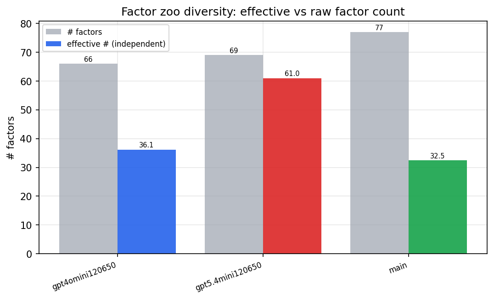

*Effective vs raw factor count per research model*

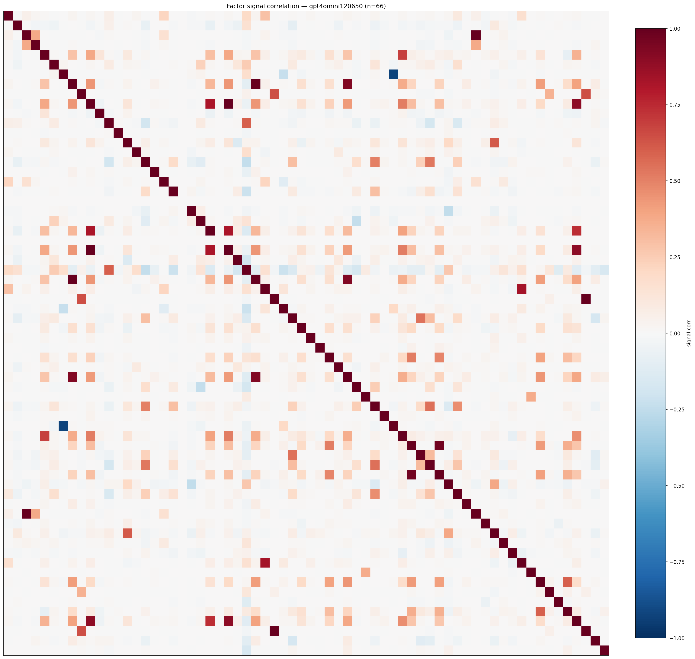

*Signal correlation matrix — gpt4omini120650*

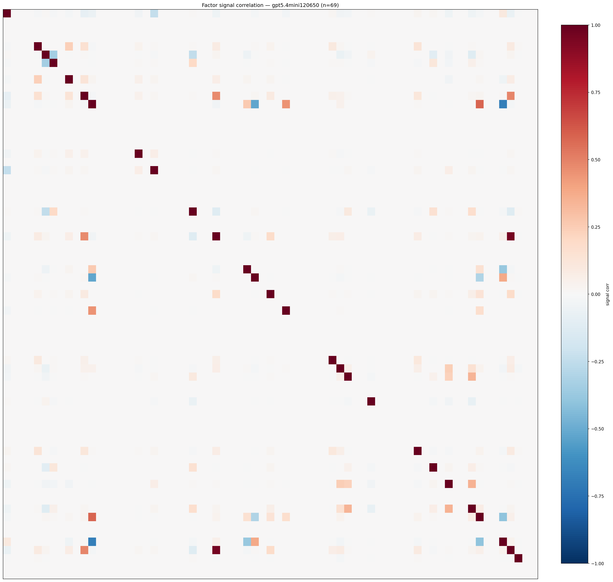

*Signal correlation matrix — gpt5.4mini120650*

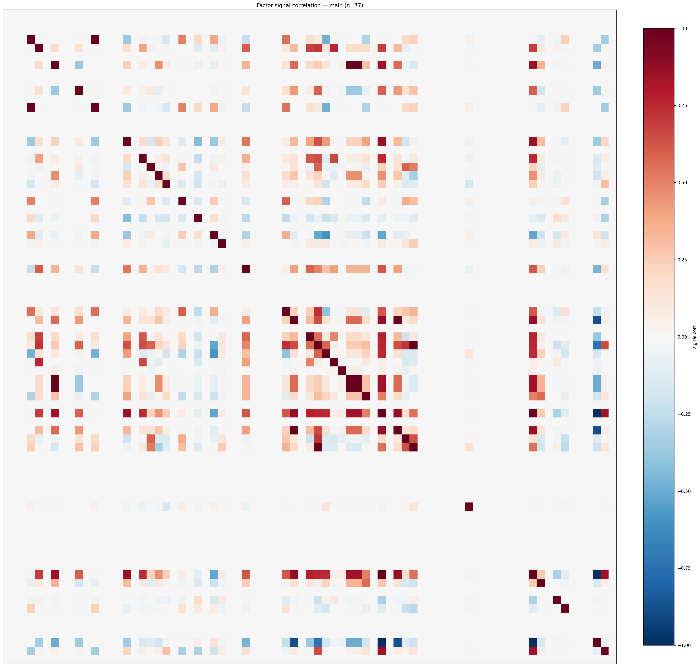

*Signal correlation matrix — main*

## 3. Deflation & model-based importance

`deflated_best_ic` haircuts each zoo's best |IC| for the number of factors tried (`ic_n_tested`) — a bigger zoo's best factor is more likely to be lucky. `lasso_n_nonzero` / `lasso_sparsity` show how many factors a sparse linear model actually keeps (model-view redundancy).

| prerun | best_ic | deflated_best_ic | deflated_best_t | ic_n_tested | ic_n_obs | lasso_n_nonzero | lasso_sparsity |
| --- | --- | --- | --- | --- | --- | --- | --- |
| gpt4omini120650 | 0.1087 | 0.1013 | 39.1971 | 64 | 149759 | 0 | 1.0 |
| gpt5.4mini120650 | 0.0982 | 0.0915 | 35.3991 | 29 | 149759 | 0 | 1.0 |
| main | 0.0892 | 0.0823 | 31.8589 | 36 | 149759 | 0 | 1.0 |

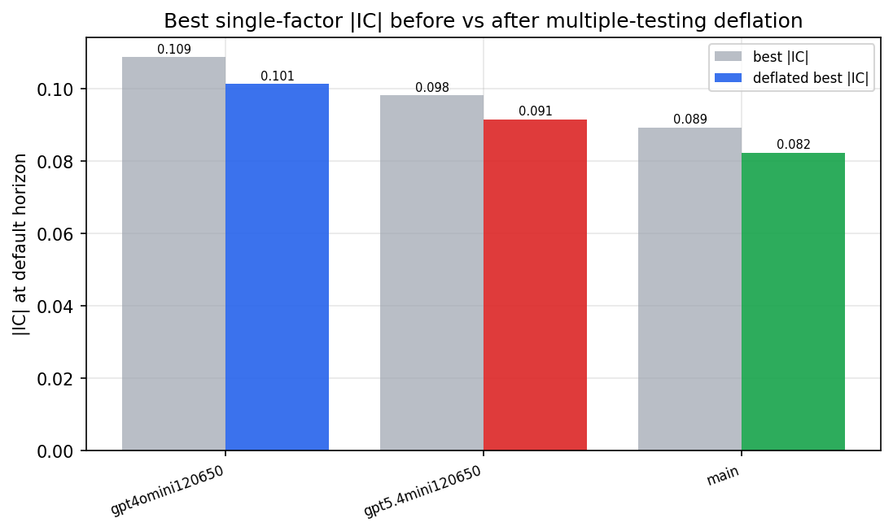

*Best |IC| before vs after multiple-testing deflation*

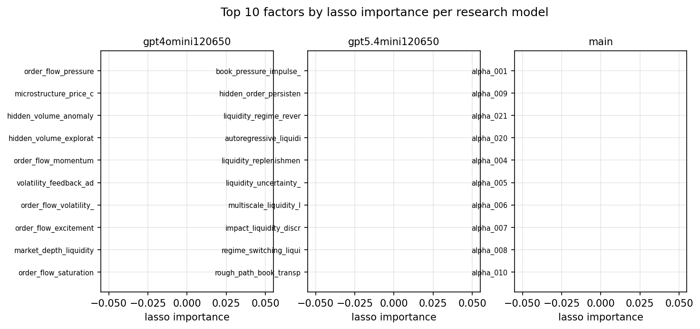

*Top factors by lasso importance per zoo*

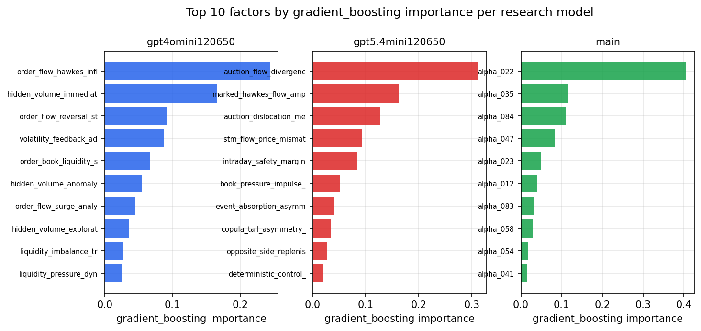

*Top factors by gradient_boosting importance per zoo*

## 4. ML-combined signal — per-underlying vectorised backtest

Each model combines a prerun's factors into ONE signal (fit `factors → forward return` on IS, predict per (bar, underlying)), then that combined signal is run through a simple vectorised backtest — `position(signal) × the underlying's own forward return` — on the held-out OOS tail (+ an equal-weight ensemble). No cross-sectional ranking.

> Config: position=**threshold** (t=1.0, z-score `expanding`), aggregation=**portfolio**, fit-standardise=**per_underlying**, horizon=6.

| prerun | model | n_factors_used | oos_ic | oos_sharpe | is_sharpe | oos_ann_return | oos_max_drawdown |
| --- | --- | --- | --- | --- | --- | --- | --- |
| gpt4omini120650 | linear_regression | 66 | 0.0779 | 0.5046 | 14.5055 | 0.0032 | -0.002 |
| gpt4omini120650 | ridge | 66 | 0.0792 | 0.7893 | 14.5178 | 0.0049 | -0.002 |
| gpt4omini120650 | lasso | 66 | 0.0763 | 3.0869 | 12.5611 | 0.0183 | -0.0017 |
| gpt4omini120650 | elastic_net | 66 | 0.0743 | 1.7448 | 11.8281 | 0.0094 | -0.0018 |
| gpt4omini120650 | random_forest | 66 | 0.0896 | -1.2774 | 9.7264 | -0.0072 | -0.0034 |
| gpt4omini120650 | gradient_boosting | 66 | 0.0839 | -6.0335 | 6.8795 | -0.0203 | -0.0022 |
| gpt4omini120650 | xgboost | 66 | 0.0834 | -7.0234 | 10.4469 | -0.0323 | -0.0032 |
| gpt4omini120650 | lightgbm | 66 | 0.0892 | -5.9616 | 12.6955 | -0.0247 | -0.0026 |
| gpt4omini120650 | ensemble | 66 | 0.0819 | -1.9782 | 14.0937 | -0.0108 | -0.0031 |
| gpt5.4mini120650 | linear_regression | 69 | 0.0839 | 3.5596 | 11.4411 | 0.0184 | -0.001 |
| gpt5.4mini120650 | ridge | 69 | 0.0828 | 3.692 | 11.7907 | 0.0193 | -0.001 |
| gpt5.4mini120650 | lasso | 69 | nan | nan | nan | nan | nan |
| gpt5.4mini120650 | elastic_net | 69 | nan | nan | nan | nan | nan |
| gpt5.4mini120650 | random_forest | 69 | 0.1192 | 10.3905 | 18.4522 | 0.0611 | -0.0007 |
| gpt5.4mini120650 | gradient_boosting | 69 | 0.1151 | -3.4015 | 6.7332 | -0.014 | -0.0016 |
| gpt5.4mini120650 | xgboost | 69 | 0.1211 | -3.2849 | 12.0622 | -0.0127 | -0.0012 |
| gpt5.4mini120650 | lightgbm | 69 | 0.1322 | -2.7803 | 12.4206 | -0.0141 | -0.0018 |
| gpt5.4mini120650 | ensemble | 69 | 0.1011 | -1.4516 | 9.3104 | -0.006 | -0.0014 |
| main | linear_regression | 77 | 0.0158 | -3.7593 | 5.8951 | -0.0308 | -0.0033 |
| main | ridge | 77 | 0.014 | -4.3905 | 5.8038 | -0.0363 | -0.0038 |
| main | lasso | 77 | nan | nan | nan | nan | nan |
| main | elastic_net | 77 | nan | nan | nan | nan | nan |
| main | random_forest | 77 | 0.0109 | -5.4219 | 7.7014 | -0.0444 | -0.0043 |
| main | gradient_boosting | 77 | 0.0206 | 1.3958 | 5.9558 | 0.0025 | -0.0003 |
| main | xgboost | 77 | 0.0146 | -3.6052 | 9.2468 | -0.0277 | -0.0024 |
| main | lightgbm | 77 | 0.0191 | 2.1506 | 11.4652 | 0.0065 | -0.0007 |
| main | ensemble | 77 | 0.0014 | -4.4635 | 9.056 | -0.0359 | -0.0033 |

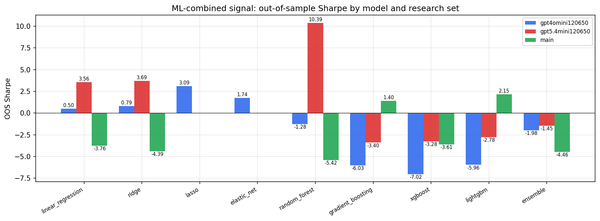

*ML-combined OOS Sharpe by model and research set*

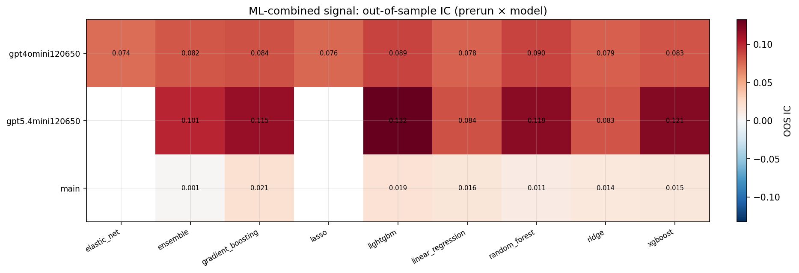

*ML-combined OOS IC (prerun × model)*

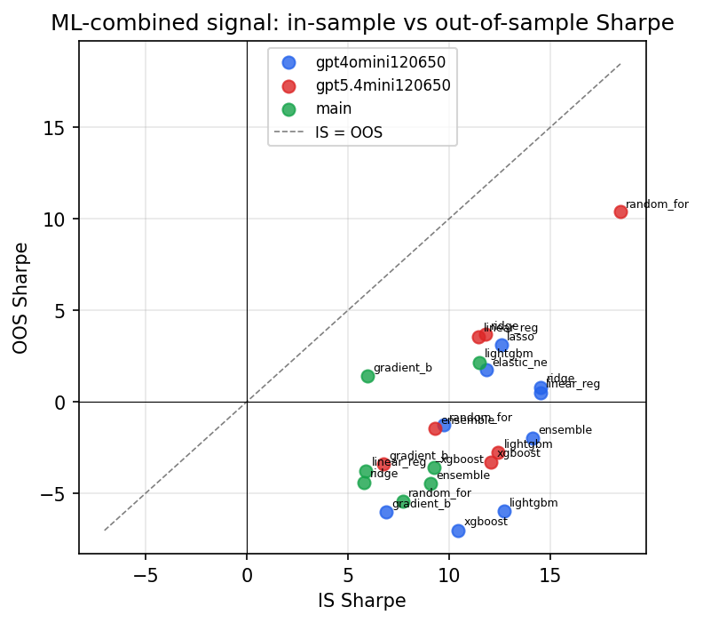

*IS vs OOS Sharpe (overfitting diagnostic)*

---
*Generated by `run_model_comparison.py`. Tables: `*.csv`; interactive: `comparison.ipynb`.*
