# Research-LLM factor comparison — `2024-08`

Comparing the **factor output of different research LLMs** on three axes (raw factor quality → factors as ML features → factors through the full agentic fund). The panel, IS/OOS split, horizon and model hyper-parameters are held identical across preruns — the *only* variable is the factor set.

## Preruns compared

| prerun | research_model | usable_factors | dropped_factors |
| --- | --- | --- | --- |
| gpt4omini120650 | gpt-4o-mini | 66 | 0 |
| gpt5.4mini120650 | gpt-5.4-mini | 69 | 0 |
| main | seed library | 77 | 11 |

> Dropped factors declare fields the current data doesn't have yet (e.g. fundamentals); they light up unchanged once that data is downloaded.

*Usable vs awaiting-data factors per research model*

## Key findings

- **Best ML-combined OOS Sharpe:** `gpt5.4mini120650` with `random_forest` (OOS Sharpe = 29.103).
- **Mean OOS Sharpe across models, by research set:** `gpt5.4mini120650` = 11.438, `main` = 5.093, `gpt4omini120650` = 3.526.
- **Highest mean single-factor |IC| (h=6):** `gpt4omini120650` (mean |IC| = 0.0348).
- **Most diverse zoo (highest effective/raw factor ratio):** `gpt5.4mini120650` (eff 57.2 of 69, ratio 0.83).
- **Best selection-deflated single-factor |IC|:** `gpt4omini120650` (deflated |IC| = 0.1305 from 64 factors tried).

## 1. Single-factor IC (raw factor quality)

Per-underlying time-series Spearman rank-IC of every researched factor, recomputed on the shared panel at horizons h=1, h=6, h=60. The per-underlying IC correlates each factor's value vector with the underlying's own forward-return vector (pooled across underlyings); the cross-sectional IC ranks across underlyings per timestamp.

| prerun | n_factors | mean_abs_ic_1 | mean_abs_ic_6 | mean_abs_ic_60 | mean_abs_icir_6 | best_factor_h6 | best_abs_ic_h6 |
| --- | --- | --- | --- | --- | --- | --- | --- |
| gpt4omini120650 | 66 | 0.0214 | 0.0348 | 0.0349 | 0.8757 | order_flow_momentum | 0.1381 |
| gpt5.4mini120650 | 69 | 0.0131 | 0.0256 | 0.0314 | 1.0067 | lstm_flow_price_mismatch | 0.1309 |
| main | 77 | 0.0168 | 0.0246 | 0.0257 | 0.4884 | alpha_058 | 0.1297 |

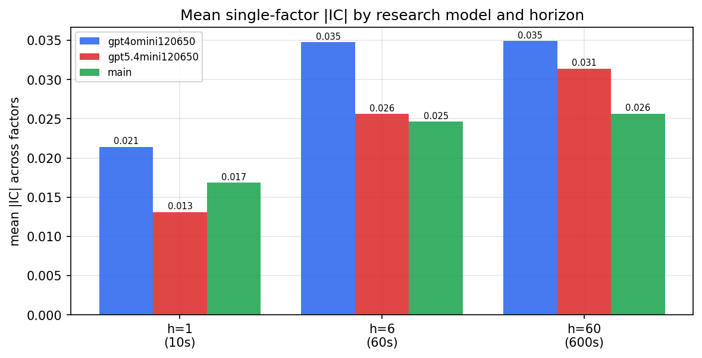

*Mean |IC| by research model and horizon*

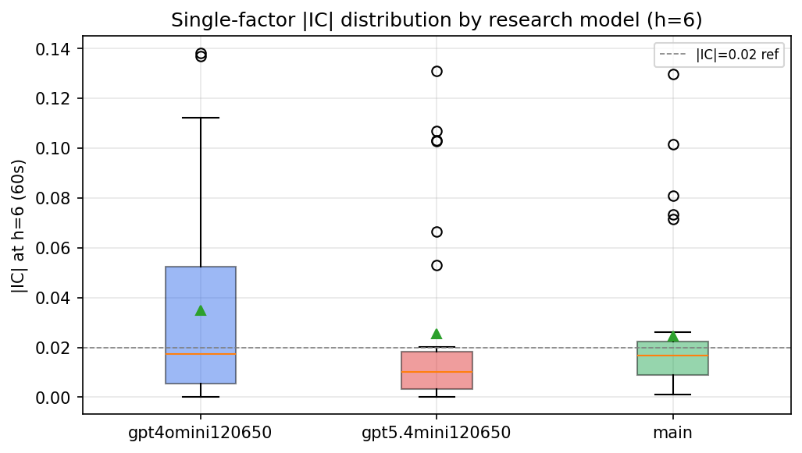

*Per-factor |IC| distribution by research model*

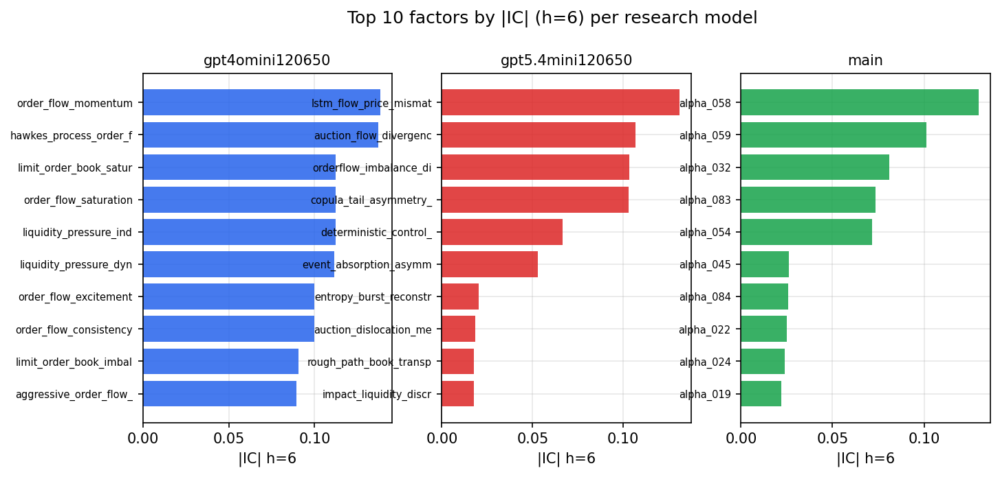

*Top factors by |IC| per research model*

## 2. Factor diversity & redundancy

Pairwise correlation of each zoo's *signals*. `eff_n_factors` is the effective number of independent factors (participation ratio of the correlation eigenvalues); `eff_ratio` and `redundancy` summarise how much unique information the zoo holds vs. how much is duplicated; `n_clusters` groups factors at |corr| ≥ 0.7.

| prerun | n_factors | eff_n_factors | eff_ratio | mean_abs_corr | n_clusters | redundancy |
| --- | --- | --- | --- | --- | --- | --- |
| gpt4omini120650 | 66 | 37.0889 | 0.562 | 0.0394 | 56 | 0.438 |
| gpt5.4mini120650 | 69 | 57.2416 | 0.8296 | 0.0083 | 65 | 0.1704 |
| main | 77 | 30.8072 | 0.4001 | 0.0455 | 57 | 0.5999 |

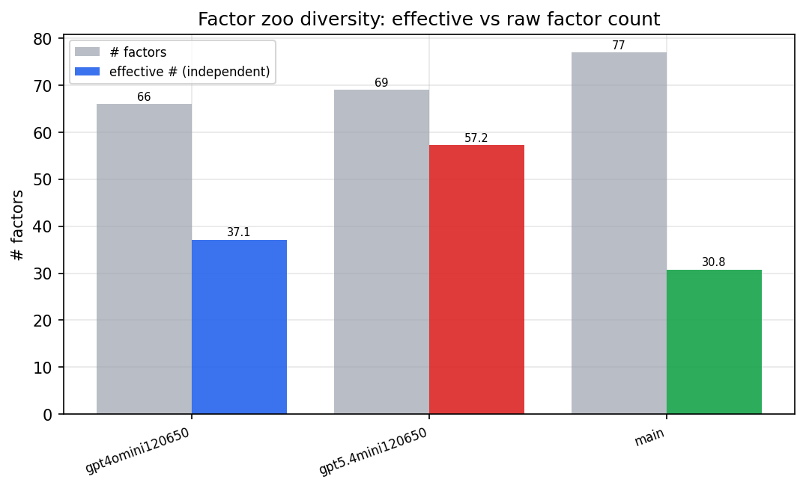

*Effective vs raw factor count per research model*

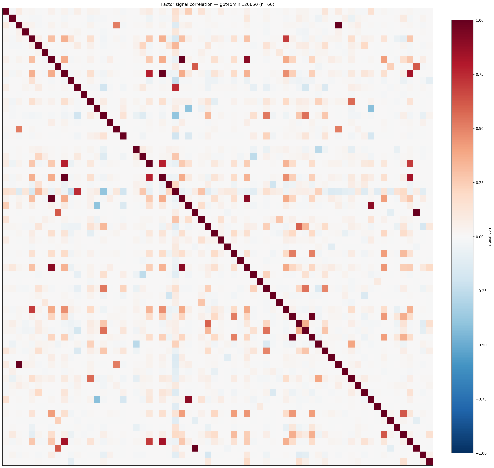

*Signal correlation matrix — gpt4omini120650*

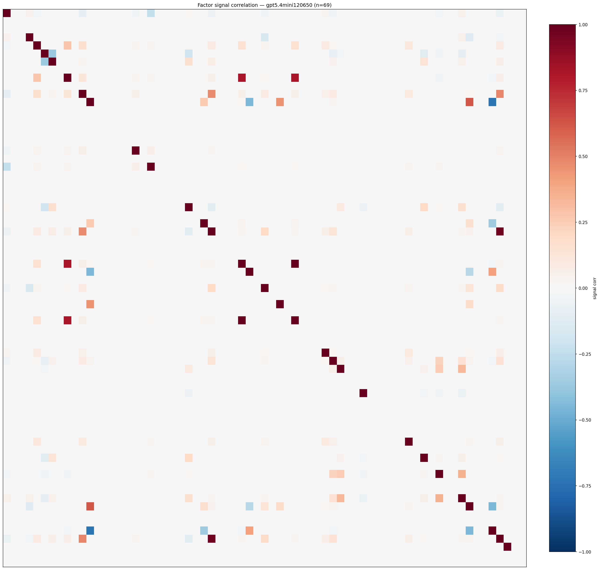

*Signal correlation matrix — gpt5.4mini120650*

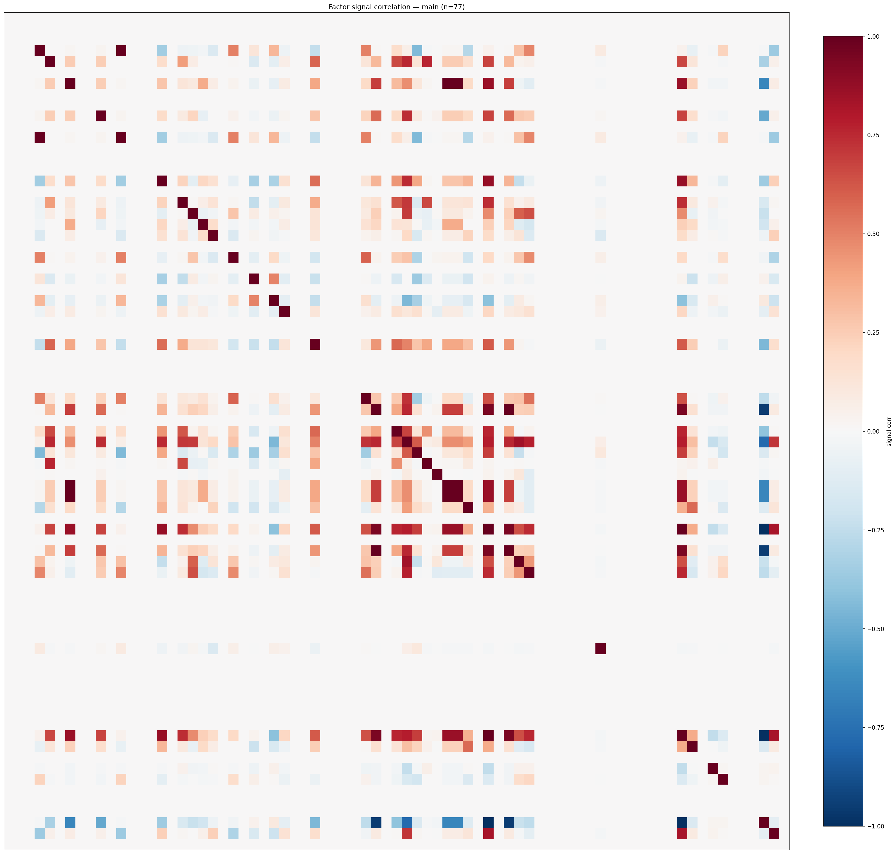

*Signal correlation matrix — main*

## 3. Deflation & model-based importance

`deflated_best_ic` haircuts each zoo's best |IC| for the number of factors tried (`ic_n_tested`) — a bigger zoo's best factor is more likely to be lucky. `lasso_n_nonzero` / `lasso_sparsity` show how many factors a sparse linear model actually keeps (model-view redundancy).

| prerun | best_ic | deflated_best_ic | deflated_best_t | ic_n_tested | ic_n_obs | lasso_n_nonzero | lasso_sparsity |
| --- | --- | --- | --- | --- | --- | --- | --- |
| gpt4omini120650 | 0.1381 | 0.1305 | 49.5378 | 64 | 143998 | 0 | 1.0 |
| gpt5.4mini120650 | 0.1309 | 0.124 | 47.0649 | 30 | 143998 | 0 | 1.0 |
| main | 0.1297 | 0.1226 | 46.5326 | 36 | 143998 | 4 | 0.9481 |

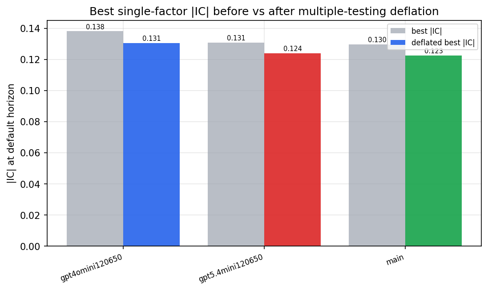

*Best |IC| before vs after multiple-testing deflation*

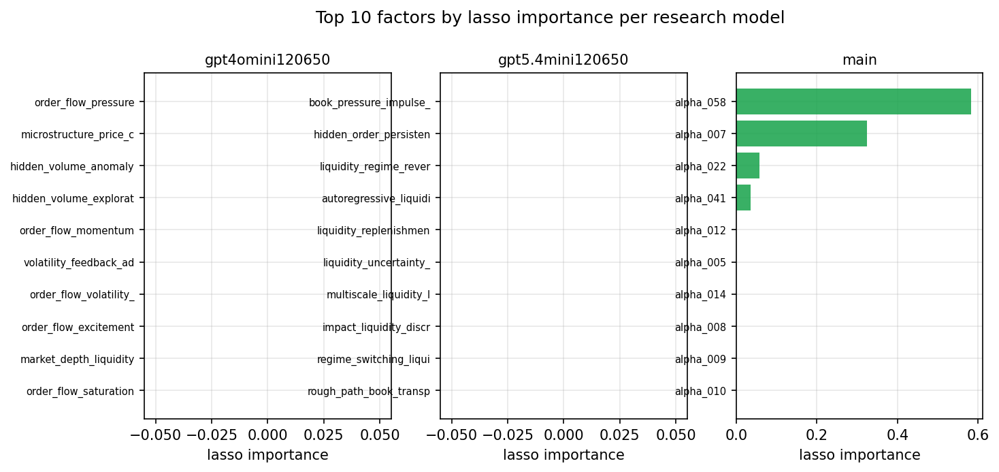

*Top factors by lasso importance per zoo*

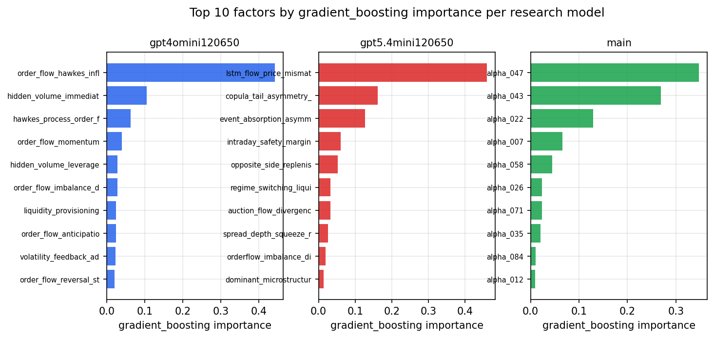

*Top factors by gradient_boosting importance per zoo*

## 4. ML-combined signal — per-underlying vectorised backtest

Each model combines a prerun's factors into ONE signal (fit `factors → forward return` on IS, predict per (bar, underlying)), then that combined signal is run through a simple vectorised backtest — `position(signal) × the underlying's own forward return` — on the held-out OOS tail (+ an equal-weight ensemble). No cross-sectional ranking.

> Config: position=**threshold** (t=1.0, z-score `expanding`), aggregation=**portfolio**, fit-standardise=**per_underlying**, horizon=6.

| prerun | model | n_factors_used | oos_ic | oos_sharpe | is_sharpe | oos_ann_return | oos_max_drawdown |
| --- | --- | --- | --- | --- | --- | --- | --- |
| gpt4omini120650 | linear_regression | 66 | 0.0698 | 7.0108 | 3.9534 | 0.0951 | -0.0008 |
| gpt4omini120650 | ridge | 66 | 0.0743 | 6.9074 | 3.5394 | 0.0933 | -0.0007 |
| gpt4omini120650 | lasso | 66 | nan | nan | nan | nan | nan |
| gpt4omini120650 | elastic_net | 66 | nan | nan | nan | nan | nan |
| gpt4omini120650 | random_forest | 66 | 0.1548 | 5.6654 | 6.5269 | 0.0578 | -0.0014 |
| gpt4omini120650 | gradient_boosting | 66 | 0.145 | -0.0243 | 6.5411 | -0.0001 | -0.0013 |
| gpt4omini120650 | xgboost | 66 | 0.1548 | 0.6527 | 7.0742 | 0.0032 | -0.001 |
| gpt4omini120650 | lightgbm | 66 | 0.1732 | -0.2201 | 10.368 | -0.0018 | -0.0025 |
| gpt4omini120650 | ensemble | 66 | 0.0407 | 4.692 | 8.2544 | 0.0597 | -0.0011 |
| gpt5.4mini120650 | linear_regression | 69 | 0.1854 | 18.8161 | 5.9756 | 0.1638 | -0.0004 |
| gpt5.4mini120650 | ridge | 69 | 0.1854 | 19.4406 | 6.0631 | 0.1702 | -0.0004 |
| gpt5.4mini120650 | lasso | 69 | nan | nan | nan | nan | nan |
| gpt5.4mini120650 | elastic_net | 69 | nan | nan | nan | nan | nan |
| gpt5.4mini120650 | random_forest | 69 | 0.1971 | 29.1033 | 16.6044 | 0.3436 | -0.0007 |
| gpt5.4mini120650 | gradient_boosting | 69 | 0.1885 | 0.0472 | 5.6336 | 0.0002 | -0.0011 |
| gpt5.4mini120650 | xgboost | 69 | 0.1956 | 2.9595 | 6.6533 | 0.0217 | -0.0006 |
| gpt5.4mini120650 | lightgbm | 69 | 0.212 | 3.6259 | 9.5607 | 0.0185 | -0.001 |
| gpt5.4mini120650 | ensemble | 69 | 0.1771 | 6.0767 | 7.359 | 0.0232 | -0.0009 |
| main | linear_regression | 77 | 0.0235 | 7.1906 | 6.5244 | 0.0415 | -0.0009 |
| main | ridge | 77 | 0.0223 | 7.4212 | 6.5758 | 0.0582 | -0.0015 |
| main | lasso | 77 | nan | nan | nan | nan | nan |
| main | elastic_net | 77 | nan | nan | nan | nan | nan |
| main | random_forest | 77 | 0.0224 | 6.4209 | 7.2511 | 0.0515 | -0.0011 |
| main | gradient_boosting | 77 | 0.0153 | -1.5686 | 6.8096 | -0.0044 | -0.0012 |
| main | xgboost | 77 | 0.0188 | 3.0168 | 7.7243 | 0.0078 | -0.0006 |
| main | lightgbm | 77 | 0.0211 | 5.3923 | 9.6793 | 0.034 | -0.0009 |
| main | ensemble | 77 | 0.0222 | 7.7791 | 7.972 | 0.0587 | -0.0012 |

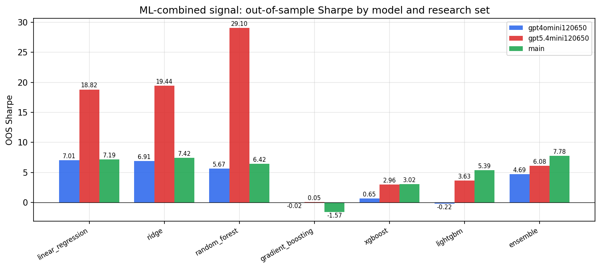

*ML-combined OOS Sharpe by model and research set*

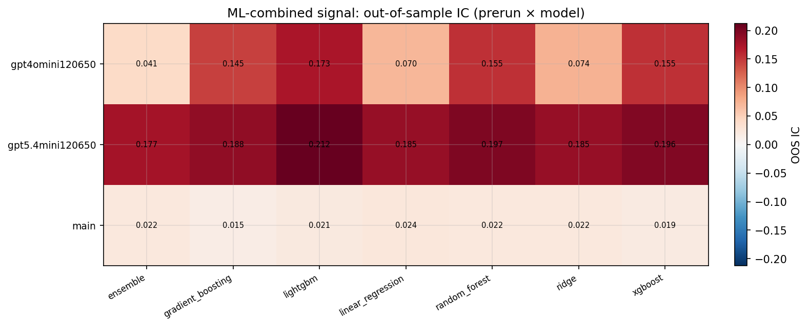

*ML-combined OOS IC (prerun × model)*

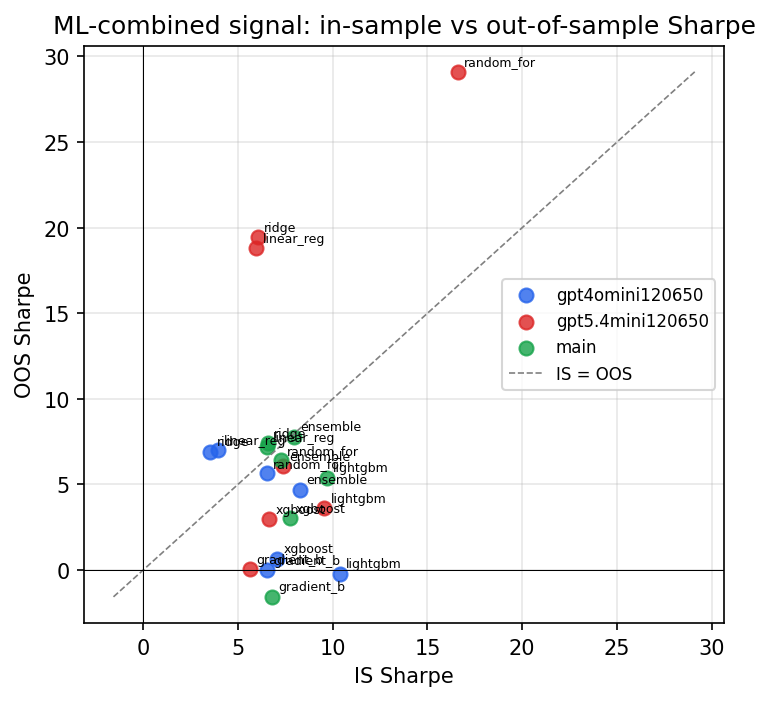

*IS vs OOS Sharpe (overfitting diagnostic)*

---
*Generated by `run_model_comparison.py`. Tables: `*.csv`; interactive: `comparison.ipynb`.*
