# Research-LLM factor comparison — `2024-09`

Comparing the **factor output of different research LLMs** on three axes (raw factor quality → factors as ML features → factors through the full agentic fund). The panel, IS/OOS split, horizon and model hyper-parameters are held identical across preruns — the *only* variable is the factor set.

## Preruns compared

| prerun | research_model | usable_factors | dropped_factors |
| --- | --- | --- | --- |
| gpt4omini120650 | gpt-4o-mini | 66 | 0 |
| gpt5.4mini120650 | gpt-5.4-mini | 69 | 0 |
| main | seed library | 77 | 11 |

> Dropped factors declare fields the current data doesn't have yet (e.g. fundamentals); they light up unchanged once that data is downloaded.

*Usable vs awaiting-data factors per research model*

## Key findings

- **Best ML-combined OOS Sharpe:** `gpt5.4mini120650` with `random_forest` (OOS Sharpe = 44.620).
- **Mean OOS Sharpe across models, by research set:** `gpt5.4mini120650` = 29.680, `gpt4omini120650` = 12.016, `main` = 6.260.
- **Highest mean single-factor |IC| (h=6):** `gpt4omini120650` (mean |IC| = 0.0417).
- **Most diverse zoo (highest effective/raw factor ratio):** `gpt5.4mini120650` (eff 56.9 of 69, ratio 0.82).
- **Best selection-deflated single-factor |IC|:** `gpt5.4mini120650` (deflated |IC| = 0.1442 from 29 factors tried).

## 1. Single-factor IC (raw factor quality)

Per-underlying time-series Spearman rank-IC of every researched factor, recomputed on the shared panel at horizons h=1, h=6, h=60. The per-underlying IC correlates each factor's value vector with the underlying's own forward-return vector (pooled across underlyings); the cross-sectional IC ranks across underlyings per timestamp.

| prerun | n_factors | mean_abs_ic_1 | mean_abs_ic_6 | mean_abs_ic_60 | mean_abs_icir_6 | best_factor_h6 | best_abs_ic_h6 |
| --- | --- | --- | --- | --- | --- | --- | --- |
| gpt4omini120650 | 66 | 0.024 | 0.0417 | 0.0394 | 1.1137 | hawkes_process_order_flow_indicator | 0.1517 |
| gpt5.4mini120650 | 69 | 0.0158 | 0.0292 | 0.0319 | 1.4373 | lstm_flow_price_mismatch | 0.151 |
| main | 77 | 0.0186 | 0.022 | 0.0236 | 0.4841 | alpha_058 | 0.0883 |

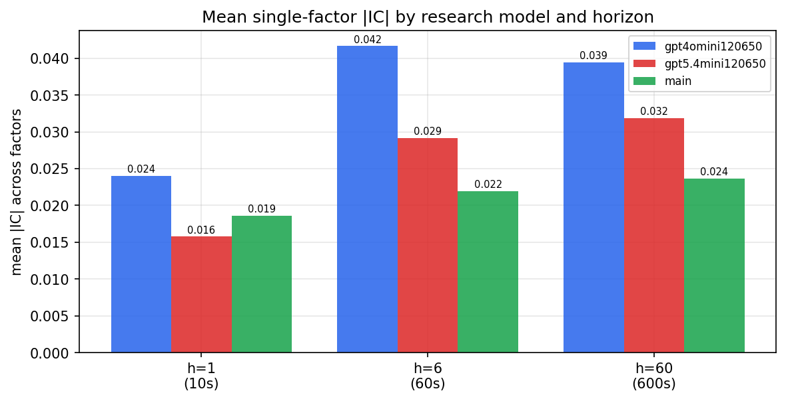

*Mean |IC| by research model and horizon*

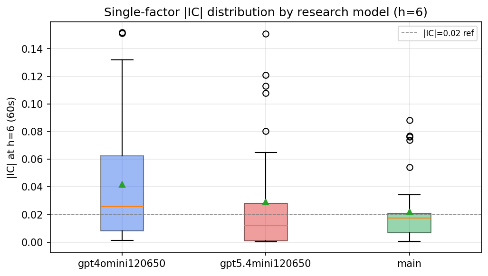

*Per-factor |IC| distribution by research model*

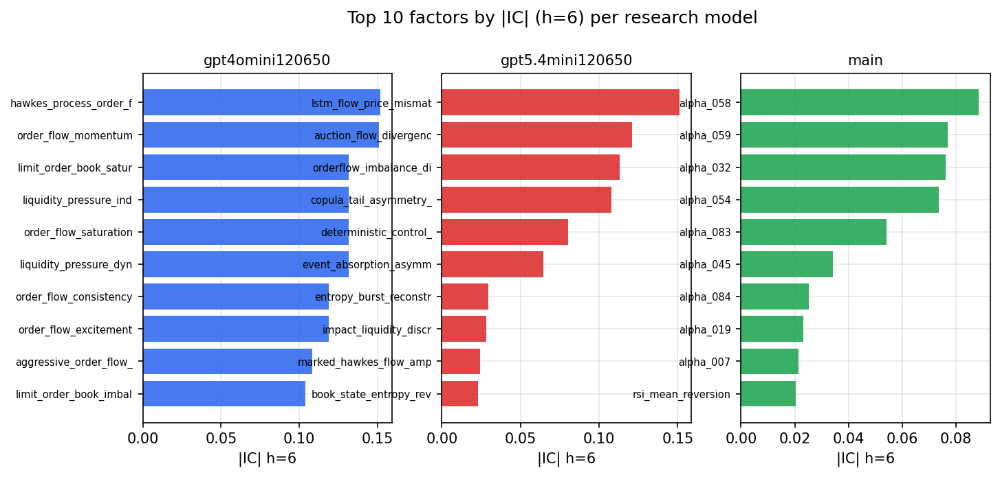

*Top factors by |IC| per research model*

## 2. Factor diversity & redundancy

Pairwise correlation of each zoo's *signals*. `eff_n_factors` is the effective number of independent factors (participation ratio of the correlation eigenvalues); `eff_ratio` and `redundancy` summarise how much unique information the zoo holds vs. how much is duplicated; `n_clusters` groups factors at |corr| ≥ 0.7.

| prerun | n_factors | eff_n_factors | eff_ratio | mean_abs_corr | n_clusters | redundancy |
| --- | --- | --- | --- | --- | --- | --- |
| gpt4omini120650 | 66 | 35.478 | 0.5375 | 0.0396 | 55 | 0.4625 |
| gpt5.4mini120650 | 69 | 56.9012 | 0.8247 | 0.0081 | 65 | 0.1753 |
| main | 77 | 32.3581 | 0.4202 | 0.0431 | 59 | 0.5798 |

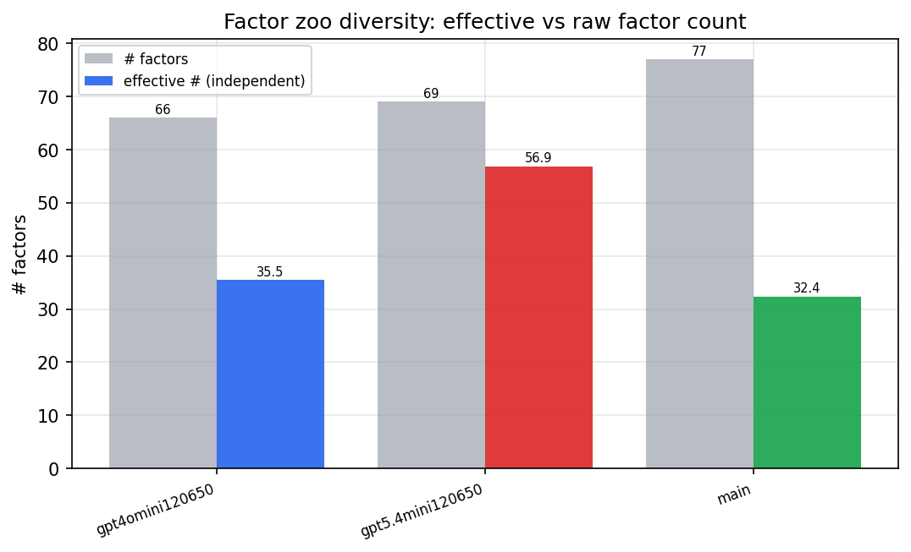

*Effective vs raw factor count per research model*

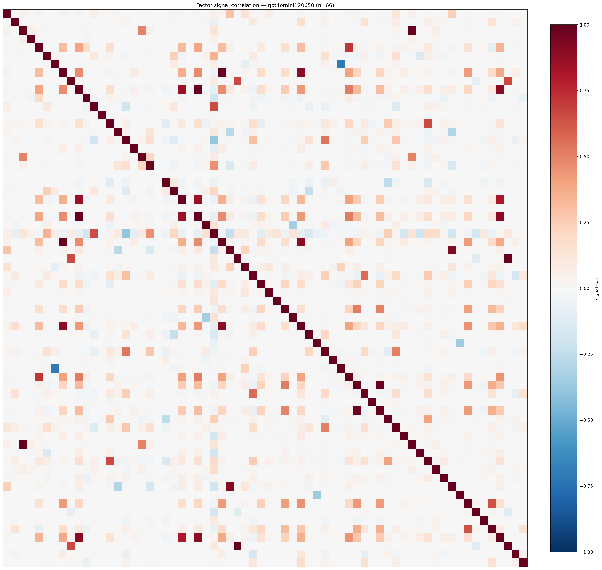

*Signal correlation matrix — gpt4omini120650*

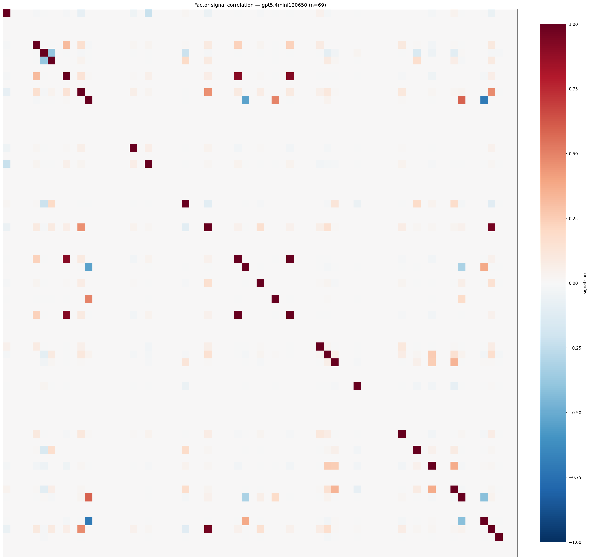

*Signal correlation matrix — gpt5.4mini120650*

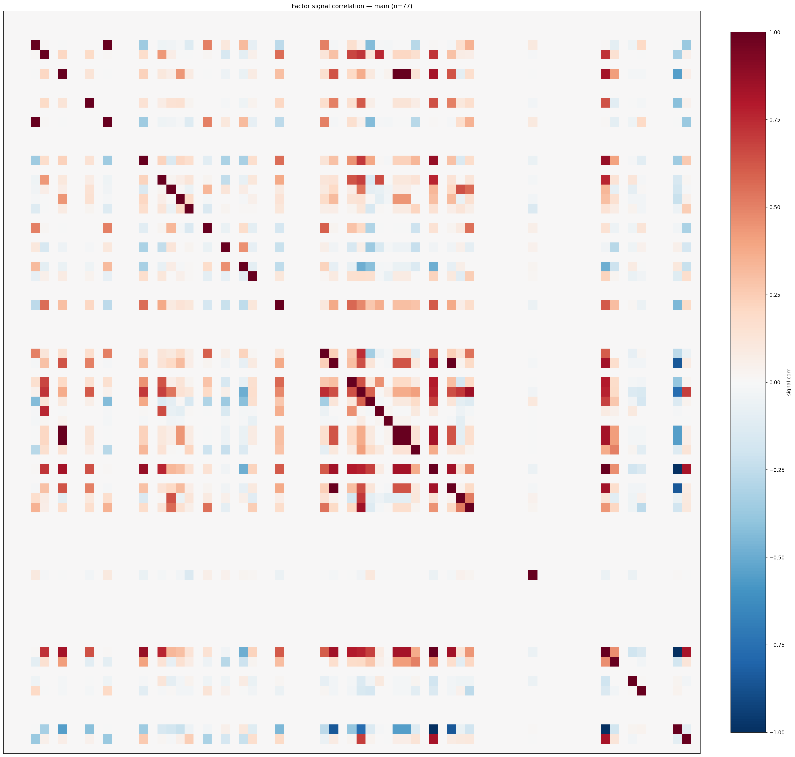

*Signal correlation matrix — main*

## 3. Deflation & model-based importance

`deflated_best_ic` haircuts each zoo's best |IC| for the number of factors tried (`ic_n_tested`) — a bigger zoo's best factor is more likely to be lucky. `lasso_n_nonzero` / `lasso_sparsity` show how many factors a sparse linear model actually keeps (model-view redundancy).

| prerun | best_ic | deflated_best_ic | deflated_best_t | ic_n_tested | ic_n_obs | lasso_n_nonzero | lasso_sparsity |
| --- | --- | --- | --- | --- | --- | --- | --- |
| gpt4omini120650 | 0.1517 | 0.1441 | 54.6917 | 64 | 143997 | 7 | 0.8939 |
| gpt5.4mini120650 | 0.151 | 0.1442 | 54.7021 | 29 | 143997 | 8 | 0.8841 |
| main | 0.0883 | 0.0812 | 30.8301 | 36 | 143997 | 11 | 0.8571 |

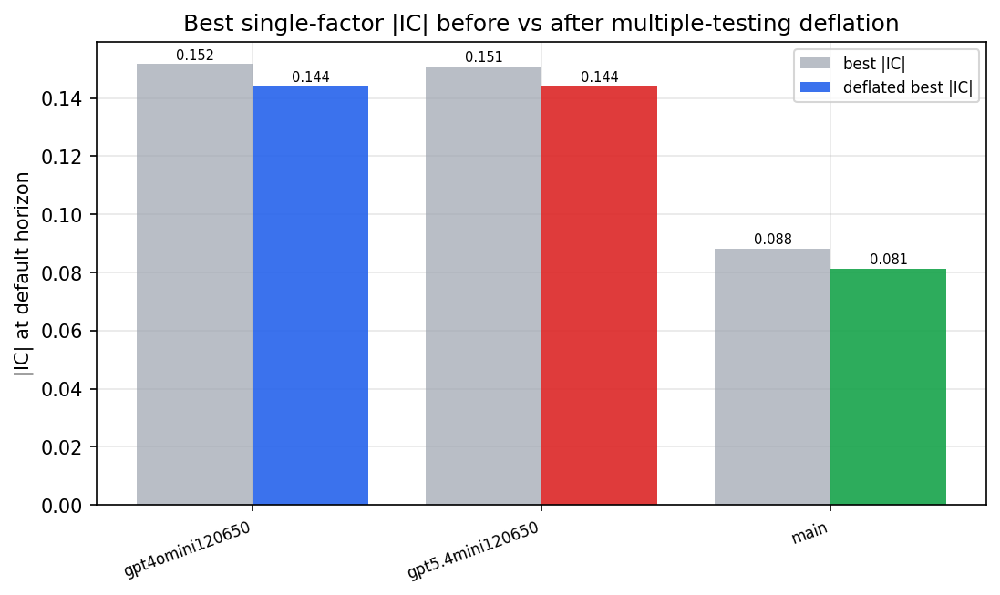

*Best |IC| before vs after multiple-testing deflation*

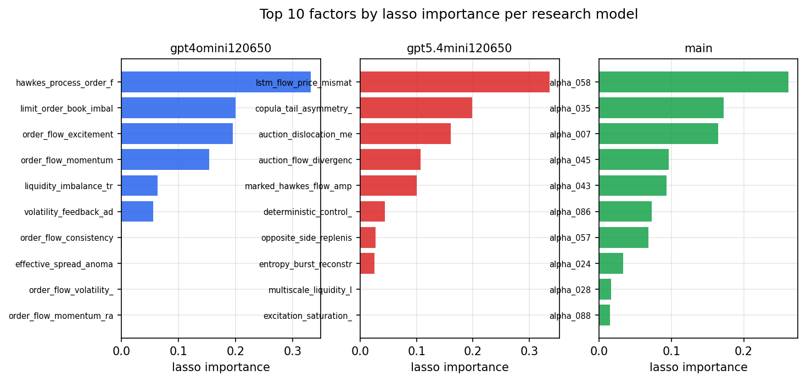

*Top factors by lasso importance per zoo*

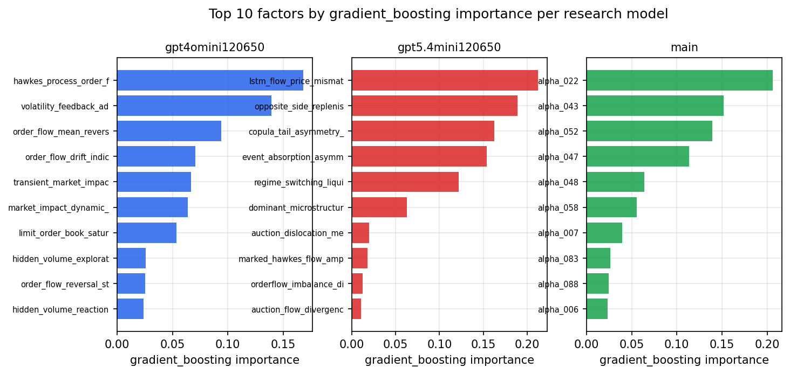

*Top factors by gradient_boosting importance per zoo*

## 4. ML-combined signal — per-underlying vectorised backtest

Each model combines a prerun's factors into ONE signal (fit `factors → forward return` on IS, predict per (bar, underlying)), then that combined signal is run through a simple vectorised backtest — `position(signal) × the underlying's own forward return` — on the held-out OOS tail (+ an equal-weight ensemble). No cross-sectional ranking.

> Config: position=**threshold** (t=1.0, z-score `expanding`), aggregation=**portfolio**, fit-standardise=**per_underlying**, horizon=6.

| prerun | model | n_factors_used | oos_ic | oos_sharpe | is_sharpe | oos_ann_return | oos_max_drawdown |
| --- | --- | --- | --- | --- | --- | --- | --- |
| gpt4omini120650 | linear_regression | 66 | 0.1824 | 14.1595 | 21.4179 | 0.0468 | -0.0002 |
| gpt4omini120650 | ridge | 66 | 0.1848 | 17.6453 | 21.8019 | 0.0468 | -0.0002 |
| gpt4omini120650 | lasso | 66 | 0.1921 | 17.008 | 20.886 | 0.0765 | -0.0008 |
| gpt4omini120650 | elastic_net | 66 | 0.1927 | 17.2123 | 21.0148 | 0.0776 | -0.0008 |
| gpt4omini120650 | random_forest | 66 | 0.1849 | 24.0752 | 18.6365 | 0.2024 | -0.001 |
| gpt4omini120650 | gradient_boosting | 66 | 0.1792 | 1.1633 | 9.4792 | 0.0051 | -0.0015 |
| gpt4omini120650 | xgboost | 66 | 0.1874 | 7.9499 | 11.1479 | 0.043 | -0.0009 |
| gpt4omini120650 | lightgbm | 66 | 0.1888 | 2.3316 | 11.7913 | 0.0098 | -0.001 |
| gpt4omini120650 | ensemble | 66 | 0.1871 | 6.603 | 12.7542 | 0.0319 | -0.0014 |
| gpt5.4mini120650 | linear_regression | 69 | 0.1737 | 33.227 | 16.935 | 0.2189 | -0.0009 |
| gpt5.4mini120650 | ridge | 69 | 0.1748 | 34.0815 | 16.4507 | 0.2288 | -0.0009 |
| gpt5.4mini120650 | lasso | 69 | 0.1761 | 32.9525 | 16.1877 | 0.2221 | -0.0009 |
| gpt5.4mini120650 | elastic_net | 69 | 0.1767 | 33.5333 | 16.3869 | 0.2272 | -0.0009 |
| gpt5.4mini120650 | random_forest | 69 | 0.2379 | 44.6201 | 27.6003 | 0.3864 | -0.001 |
| gpt5.4mini120650 | gradient_boosting | 69 | 0.2145 | -0.5394 | 9.4907 | -0.0018 | -0.0012 |
| gpt5.4mini120650 | xgboost | 69 | 0.2312 | 28.4648 | 15.1365 | 0.1494 | -0.0005 |
| gpt5.4mini120650 | lightgbm | 69 | 0.2343 | 18.0405 | 13.5498 | 0.0734 | -0.0003 |
| gpt5.4mini120650 | ensemble | 69 | 0.2102 | 42.7404 | 21.593 | 0.2878 | -0.0009 |
| main | linear_regression | 77 | 0.032 | 7.0421 | 7.799 | 0.0417 | -0.0008 |
| main | ridge | 77 | 0.0282 | 7.0031 | 8.8759 | 0.0421 | -0.0011 |
| main | lasso | 77 | 0.0198 | 6.6057 | 7.8922 | 0.0355 | -0.0008 |
| main | elastic_net | 77 | 0.0198 | 6.7758 | 7.9051 | 0.0367 | -0.0008 |
| main | random_forest | 77 | 0.0377 | 4.66 | 9.0708 | 0.0256 | -0.0015 |
| main | gradient_boosting | 77 | 0.0369 | 5.4558 | 9.0947 | 0.0328 | -0.0009 |
| main | xgboost | 77 | 0.0281 | 5.5476 | 9.3273 | 0.0288 | -0.0012 |
| main | lightgbm | 77 | 0.0353 | 5.6651 | 11.1012 | 0.0247 | -0.0007 |
| main | ensemble | 77 | 0.0314 | 7.5887 | 9.0449 | 0.0439 | -0.0008 |

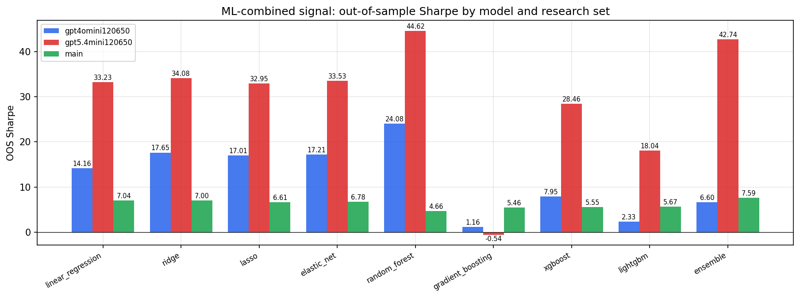

*ML-combined OOS Sharpe by model and research set*

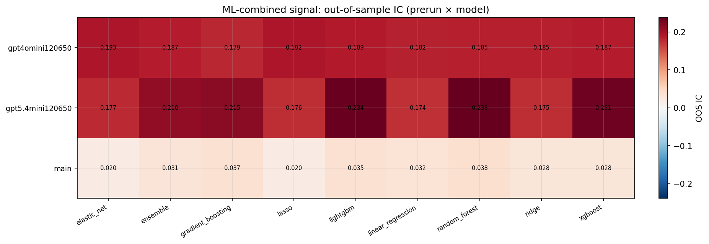

*ML-combined OOS IC (prerun × model)*

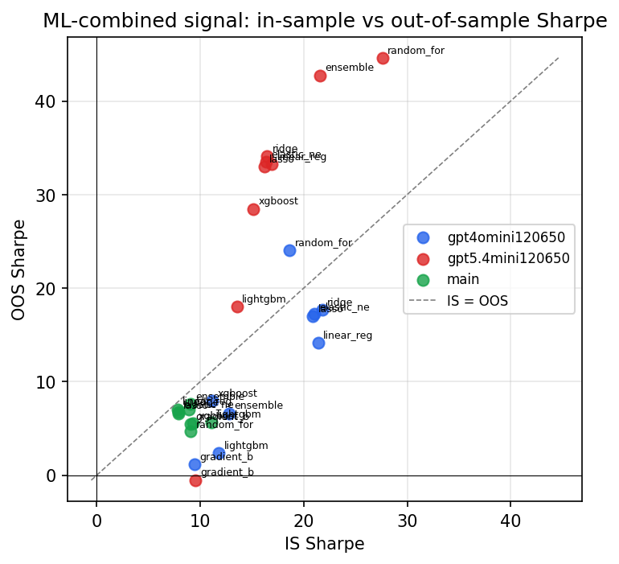

*IS vs OOS Sharpe (overfitting diagnostic)*

---
*Generated by `run_model_comparison.py`. Tables: `*.csv`; interactive: `comparison.ipynb`.*
