# Research-LLM factor comparison — `2024-10`

Comparing the **factor output of different research LLMs** on three axes (raw factor quality → factors as ML features → factors through the full agentic fund). The panel, IS/OOS split, horizon and model hyper-parameters are held identical across preruns — the *only* variable is the factor set.

## Preruns compared

| prerun | research_model | usable_factors | dropped_factors |
| --- | --- | --- | --- |
| gpt4omini120650 | gpt-4o-mini | 66 | 0 |
| gpt5.4mini120650 | gpt-5.4-mini | 69 | 0 |
| main | seed library | 77 | 11 |

> Dropped factors declare fields the current data doesn't have yet (e.g. fundamentals); they light up unchanged once that data is downloaded.

*Usable vs awaiting-data factors per research model*

## Key findings

- **Best ML-combined OOS Sharpe:** `gpt4omini120650` with `ensemble` (OOS Sharpe = 37.049).
- **Mean OOS Sharpe across models, by research set:** `gpt5.4mini120650` = 27.772, `gpt4omini120650` = 24.518, `main` = -1.795.
- **Highest mean single-factor |IC| (h=6):** `gpt4omini120650` (mean |IC| = 0.0451).
- **Most diverse zoo (highest effective/raw factor ratio):** `gpt5.4mini120650` (eff 57.4 of 69, ratio 0.83).
- **Best selection-deflated single-factor |IC|:** `gpt5.4mini120650` (deflated |IC| = 0.1568 from 29 factors tried).

## 1. Single-factor IC (raw factor quality)

Per-underlying time-series Spearman rank-IC of every researched factor, recomputed on the shared panel at horizons h=1, h=6, h=60. The per-underlying IC correlates each factor's value vector with the underlying's own forward-return vector (pooled across underlyings); the cross-sectional IC ranks across underlyings per timestamp.

| prerun | n_factors | mean_abs_ic_1 | mean_abs_ic_6 | mean_abs_ic_60 | mean_abs_icir_6 | best_factor_h6 | best_abs_ic_h6 |
| --- | --- | --- | --- | --- | --- | --- | --- |
| gpt4omini120650 | 66 | 0.0269 | 0.0451 | 0.042 | 1.5775 | order_flow_momentum | 0.1616 |
| gpt5.4mini120650 | 69 | 0.0171 | 0.0293 | 0.0318 | 1.5962 | lstm_flow_price_mismatch | 0.1636 |
| main | 77 | 0.0134 | 0.0173 | 0.02 | 0.4672 | alpha_032 | 0.0646 |

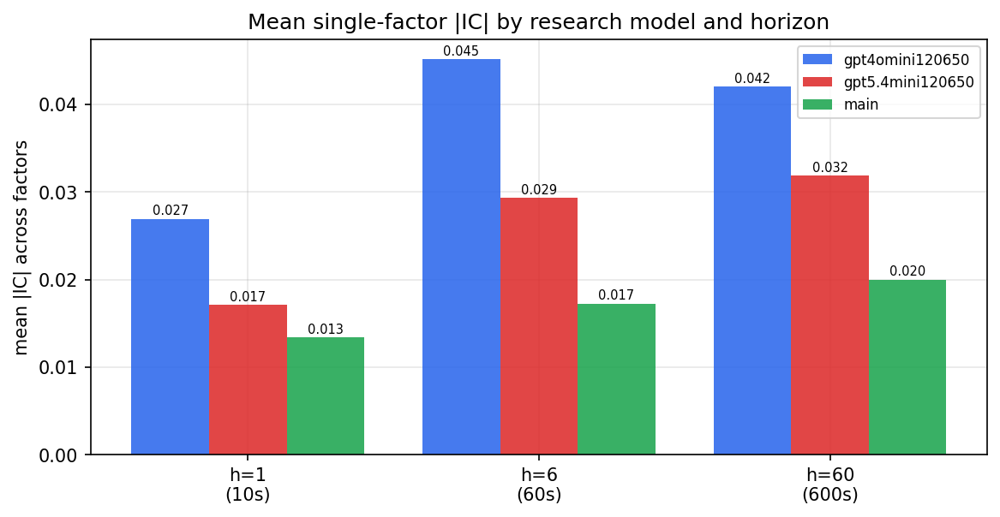

*Mean |IC| by research model and horizon*

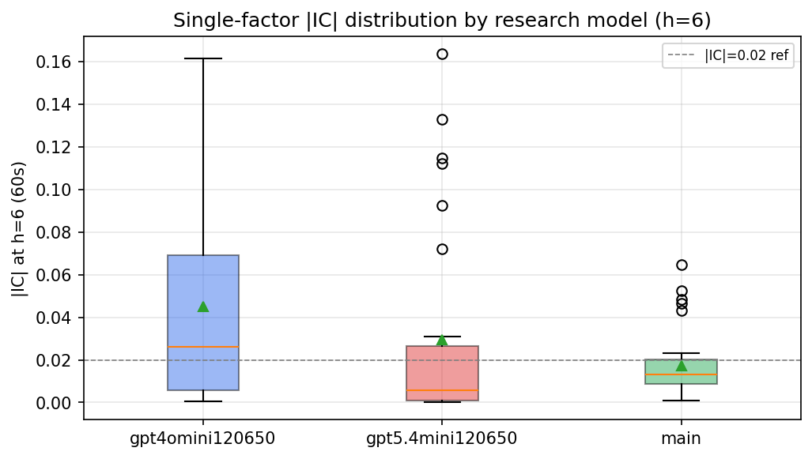

*Per-factor |IC| distribution by research model*

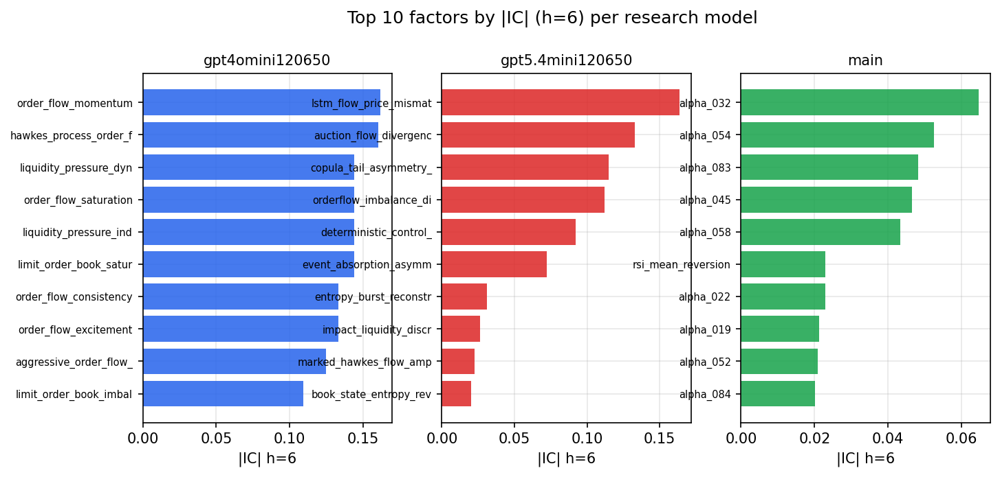

*Top factors by |IC| per research model*

## 2. Factor diversity & redundancy

Pairwise correlation of each zoo's *signals*. `eff_n_factors` is the effective number of independent factors (participation ratio of the correlation eigenvalues); `eff_ratio` and `redundancy` summarise how much unique information the zoo holds vs. how much is duplicated; `n_clusters` groups factors at |corr| ≥ 0.7.

| prerun | n_factors | eff_n_factors | eff_ratio | mean_abs_corr | n_clusters | redundancy |
| --- | --- | --- | --- | --- | --- | --- |
| gpt4omini120650 | 66 | 34.3087 | 0.5198 | 0.0407 | 56 | 0.4802 |
| gpt5.4mini120650 | 69 | 57.3732 | 0.8315 | 0.0076 | 66 | 0.1685 |
| main | 77 | 31.5043 | 0.4091 | 0.0449 | 58 | 0.5909 |

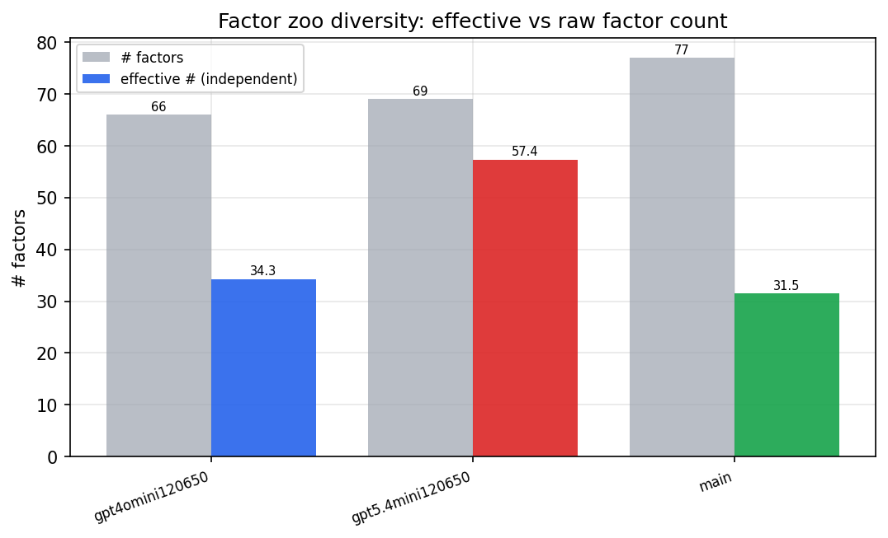

*Effective vs raw factor count per research model*

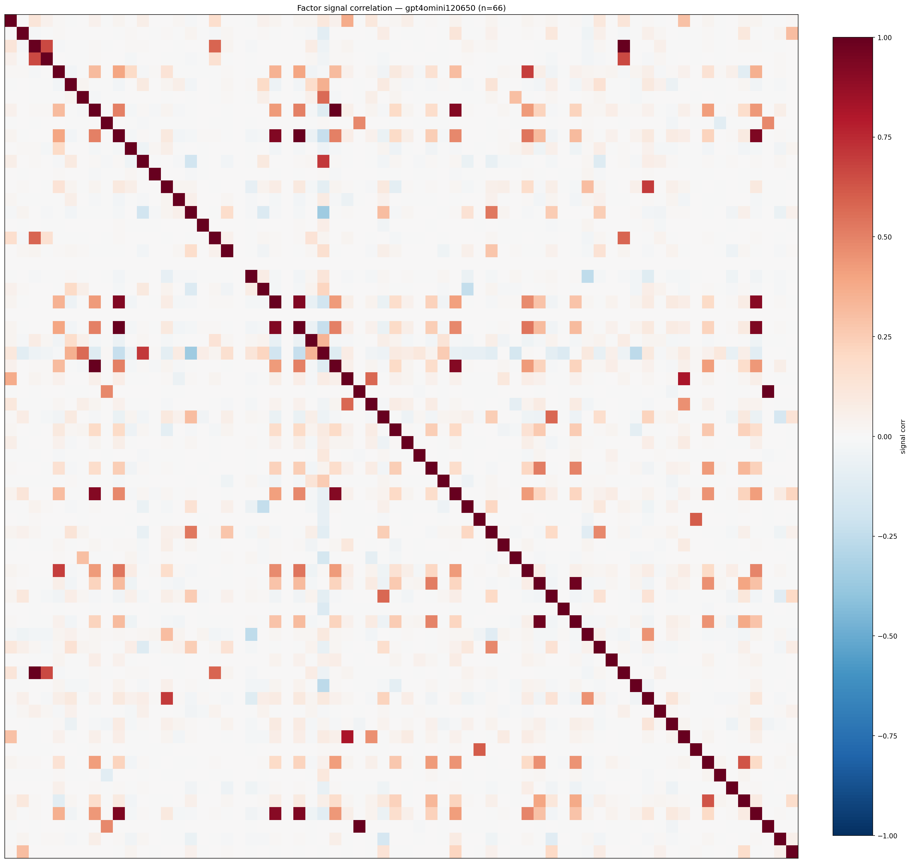

*Signal correlation matrix — gpt4omini120650*

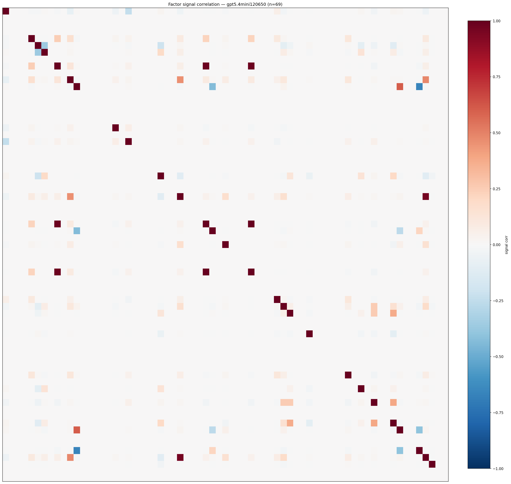

*Signal correlation matrix — gpt5.4mini120650*

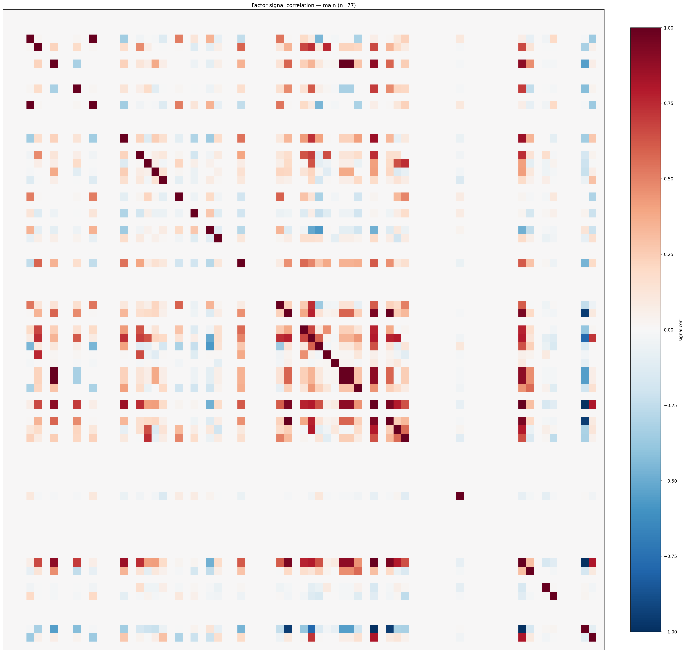

*Signal correlation matrix — main*

## 3. Deflation & model-based importance

`deflated_best_ic` haircuts each zoo's best |IC| for the number of factors tried (`ic_n_tested`) — a bigger zoo's best factor is more likely to be lucky. `lasso_n_nonzero` / `lasso_sparsity` show how many factors a sparse linear model actually keeps (model-view redundancy).

| prerun | best_ic | deflated_best_ic | deflated_best_t | ic_n_tested | ic_n_obs | lasso_n_nonzero | lasso_sparsity |
| --- | --- | --- | --- | --- | --- | --- | --- |
| gpt4omini120650 | 0.1616 | 0.154 | 59.1435 | 64 | 147417 | 2 | 0.9697 |
| gpt5.4mini120650 | 0.1636 | 0.1568 | 60.2057 | 29 | 147417 | 4 | 0.942 |
| main | 0.0646 | 0.0576 | 22.1082 | 36 | 147417 | 0 | 1.0 |

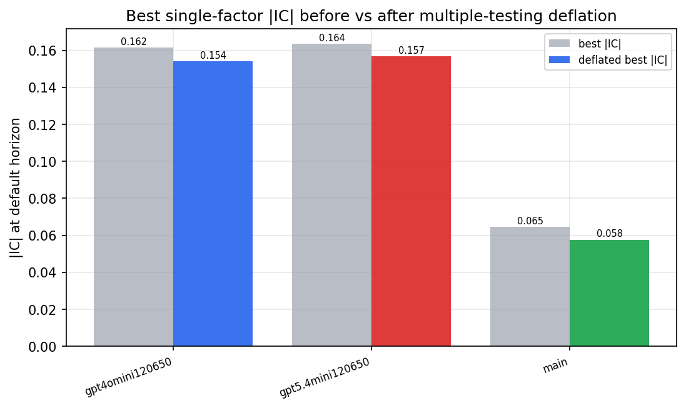

*Best |IC| before vs after multiple-testing deflation*

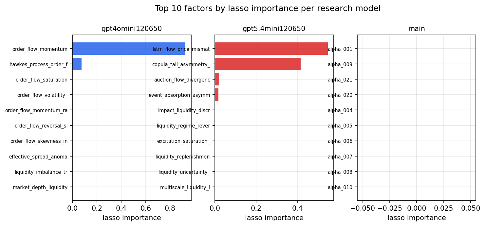

*Top factors by lasso importance per zoo*

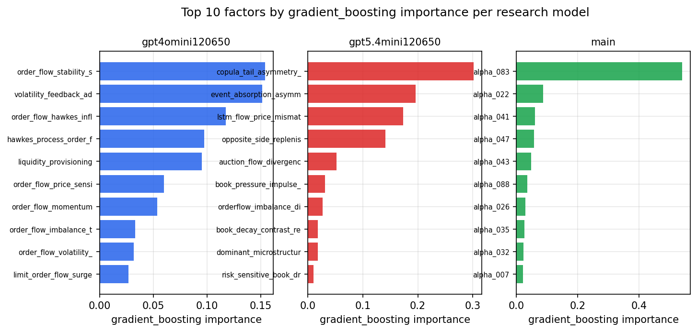

*Top factors by gradient_boosting importance per zoo*

## 4. ML-combined signal — per-underlying vectorised backtest

Each model combines a prerun's factors into ONE signal (fit `factors → forward return` on IS, predict per (bar, underlying)), then that combined signal is run through a simple vectorised backtest — `position(signal) × the underlying's own forward return` — on the held-out OOS tail (+ an equal-weight ensemble). No cross-sectional ranking.

> Config: position=**threshold** (t=1.0, z-score `expanding`), aggregation=**portfolio**, fit-standardise=**per_underlying**, horizon=6.

| prerun | model | n_factors_used | oos_ic | oos_sharpe | is_sharpe | oos_ann_return | oos_max_drawdown |
| --- | --- | --- | --- | --- | --- | --- | --- |
| gpt4omini120650 | linear_regression | 66 | 0.1961 | 35.3124 | 22.2786 | 0.2196 | -0.0005 |
| gpt4omini120650 | ridge | 66 | 0.1956 | 36.1533 | 22.8853 | 0.2278 | -0.0005 |
| gpt4omini120650 | lasso | 66 | 0.1707 | 25.9079 | 18.2869 | 0.2561 | -0.0003 |
| gpt4omini120650 | elastic_net | 66 | 0.1868 | 35.6506 | 21.2379 | 0.2615 | -0.0004 |
| gpt4omini120650 | random_forest | 66 | 0.1789 | 28.4727 | 22.0855 | 0.2446 | -0.0005 |
| gpt4omini120650 | gradient_boosting | 66 | 0.1834 | 0.6324 | 6.1992 | 0.0013 | -0.0004 |
| gpt4omini120650 | xgboost | 66 | 0.1877 | 13.3789 | 9.6759 | 0.0499 | -0.0005 |
| gpt4omini120650 | lightgbm | 66 | 0.1868 | 8.1064 | 13.053 | 0.0277 | -0.0005 |
| gpt4omini120650 | ensemble | 66 | 0.195 | 37.0487 | 19.8527 | 0.239 | -0.0006 |
| gpt5.4mini120650 | linear_regression | 69 | 0.174 | 30.7282 | 29.9208 | 0.2991 | -0.0005 |
| gpt5.4mini120650 | ridge | 69 | 0.1735 | 30.206 | 30.3263 | 0.2992 | -0.0007 |
| gpt5.4mini120650 | lasso | 69 | 0.1792 | 27.926 | 28.4068 | 0.3111 | -0.0005 |
| gpt5.4mini120650 | elastic_net | 69 | 0.1787 | 28.3531 | 30.502 | 0.3151 | -0.0005 |
| gpt5.4mini120650 | random_forest | 69 | 0.2287 | 34.5746 | 39.0492 | 0.3934 | -0.0005 |
| gpt5.4mini120650 | gradient_boosting | 69 | 0.1951 | 2.184 | 8.6407 | 0.0025 | -0.0003 |
| gpt5.4mini120650 | xgboost | 69 | 0.224 | 31.0304 | 31.7735 | 0.2879 | -0.0005 |
| gpt5.4mini120650 | lightgbm | 69 | 0.2223 | 28.9943 | 16.5714 | 0.1511 | -0.0003 |
| gpt5.4mini120650 | ensemble | 69 | 0.2071 | 35.949 | 30.1936 | 0.3548 | -0.0003 |
| main | linear_regression | 77 | 0.0187 | -4.7641 | 7.7009 | -0.0221 | -0.0025 |
| main | ridge | 77 | 0.0173 | -5.5595 | 6.9519 | -0.0259 | -0.0027 |
| main | lasso | 77 | nan | nan | nan | nan | nan |
| main | elastic_net | 77 | nan | nan | nan | nan | nan |
| main | random_forest | 77 | 0.0236 | -3.1233 | 11.9631 | -0.0199 | -0.0023 |
| main | gradient_boosting | 77 | 0.0221 | -0.2407 | 9.7588 | -0.0013 | -0.0012 |
| main | xgboost | 77 | 0.0252 | -0.1638 | 11.2932 | -0.0009 | -0.0012 |
| main | lightgbm | 77 | 0.021 | 1.5064 | 14.0718 | 0.0054 | -0.0009 |
| main | ensemble | 77 | 0.0191 | -0.2209 | 11.642 | -0.0011 | -0.0012 |

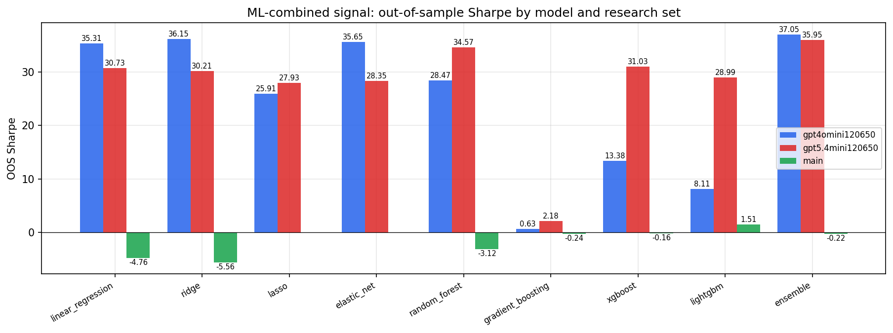

*ML-combined OOS Sharpe by model and research set*

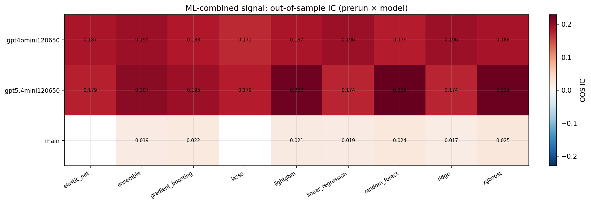

*ML-combined OOS IC (prerun × model)*

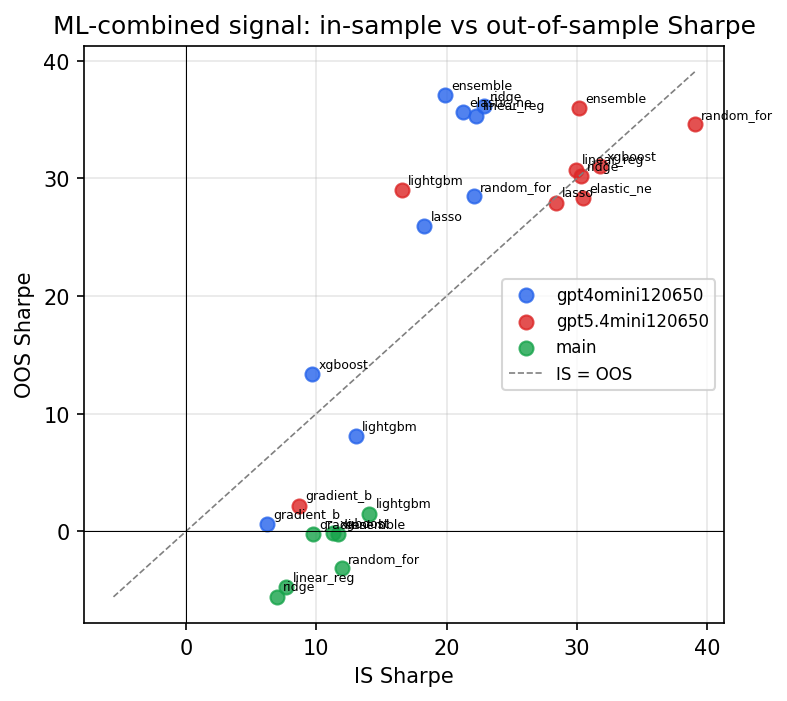

*IS vs OOS Sharpe (overfitting diagnostic)*

---
*Generated by `run_model_comparison.py`. Tables: `*.csv`; interactive: `comparison.ipynb`.*
