# Research-LLM factor comparison — `2024-11`

Comparing the **factor output of different research LLMs** on three axes (raw factor quality → factors as ML features → factors through the full agentic fund). The panel, IS/OOS split, horizon and model hyper-parameters are held identical across preruns — the *only* variable is the factor set.

## Preruns compared

| prerun | research_model | usable_factors | dropped_factors |
| --- | --- | --- | --- |
| gpt4omini120650 | gpt-4o-mini | 66 | 0 |
| gpt5.4mini120650 | gpt-5.4-mini | 69 | 0 |
| main | seed library | 77 | 11 |

> Dropped factors declare fields the current data doesn't have yet (e.g. fundamentals); they light up unchanged once that data is downloaded.

*Usable vs awaiting-data factors per research model*

## Key findings

- **Best ML-combined OOS Sharpe:** `gpt5.4mini120650` with `random_forest` (OOS Sharpe = 36.268).
- **Mean OOS Sharpe across models, by research set:** `gpt5.4mini120650` = 20.915, `gpt4omini120650` = 20.628, `main` = 1.054.
- **Highest mean single-factor |IC| (h=6):** `gpt4omini120650` (mean |IC| = 0.0462).
- **Most diverse zoo (highest effective/raw factor ratio):** `gpt5.4mini120650` (eff 56.7 of 69, ratio 0.82).
- **Best selection-deflated single-factor |IC|:** `gpt4omini120650` (deflated |IC| = 0.1590 from 64 factors tried).

## 1. Single-factor IC (raw factor quality)

Per-underlying time-series Spearman rank-IC of every researched factor, recomputed on the shared panel at horizons h=1, h=6, h=60. The per-underlying IC correlates each factor's value vector with the underlying's own forward-return vector (pooled across underlyings); the cross-sectional IC ranks across underlyings per timestamp.

| prerun | n_factors | mean_abs_ic_1 | mean_abs_ic_6 | mean_abs_ic_60 | mean_abs_icir_6 | best_factor_h6 | best_abs_ic_h6 |
| --- | --- | --- | --- | --- | --- | --- | --- |
| gpt4omini120650 | 66 | 0.0274 | 0.0462 | 0.0428 | 1.7652 | order_flow_momentum | 0.1666 |
| gpt5.4mini120650 | 69 | 0.0171 | 0.0335 | 0.0329 | 1.6581 | lstm_flow_price_mismatch | 0.1632 |
| main | 77 | 0.0138 | 0.0196 | 0.0238 | 0.5407 | alpha_059 | 0.0867 |

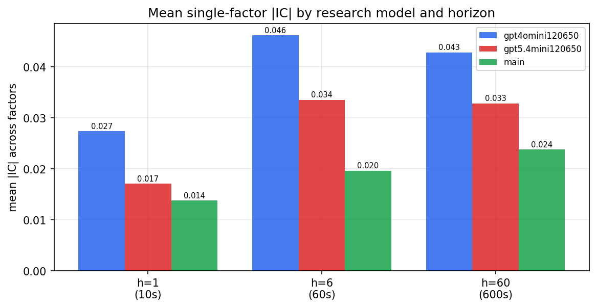

*Mean |IC| by research model and horizon*

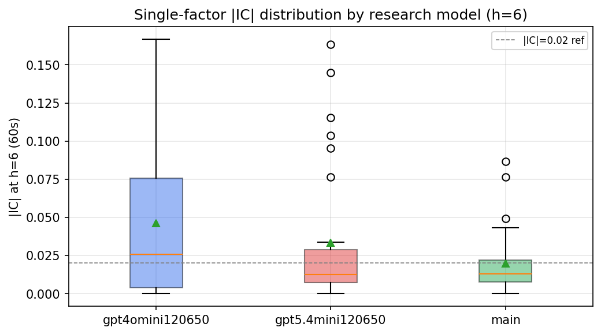

*Per-factor |IC| distribution by research model*

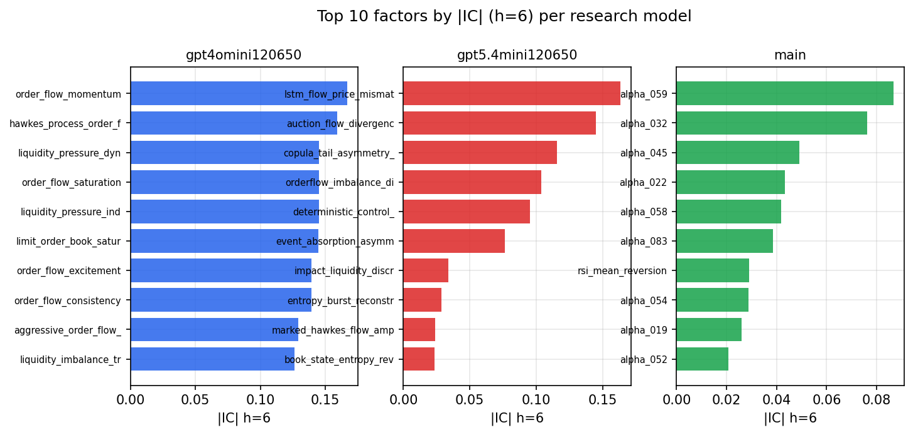

*Top factors by |IC| per research model*

## 2. Factor diversity & redundancy

Pairwise correlation of each zoo's *signals*. `eff_n_factors` is the effective number of independent factors (participation ratio of the correlation eigenvalues); `eff_ratio` and `redundancy` summarise how much unique information the zoo holds vs. how much is duplicated; `n_clusters` groups factors at |corr| ≥ 0.7.

| prerun | n_factors | eff_n_factors | eff_ratio | mean_abs_corr | n_clusters | redundancy |
| --- | --- | --- | --- | --- | --- | --- |
| gpt4omini120650 | 66 | 33.3837 | 0.5058 | 0.0395 | 55 | 0.4942 |
| gpt5.4mini120650 | 69 | 56.7408 | 0.8223 | 0.0084 | 65 | 0.1777 |
| main | 77 | 30.668 | 0.3983 | 0.0467 | 60 | 0.6017 |

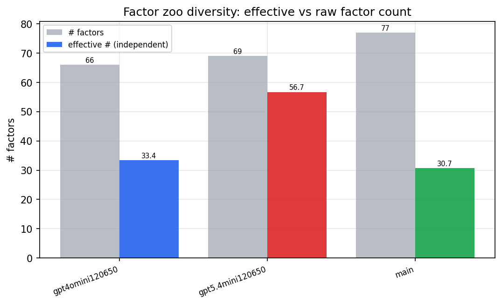

*Effective vs raw factor count per research model*

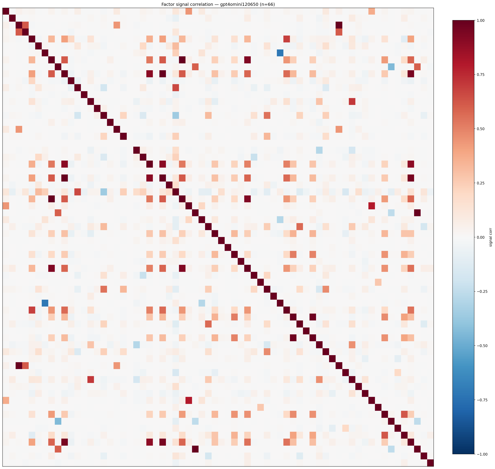

*Signal correlation matrix — gpt4omini120650*

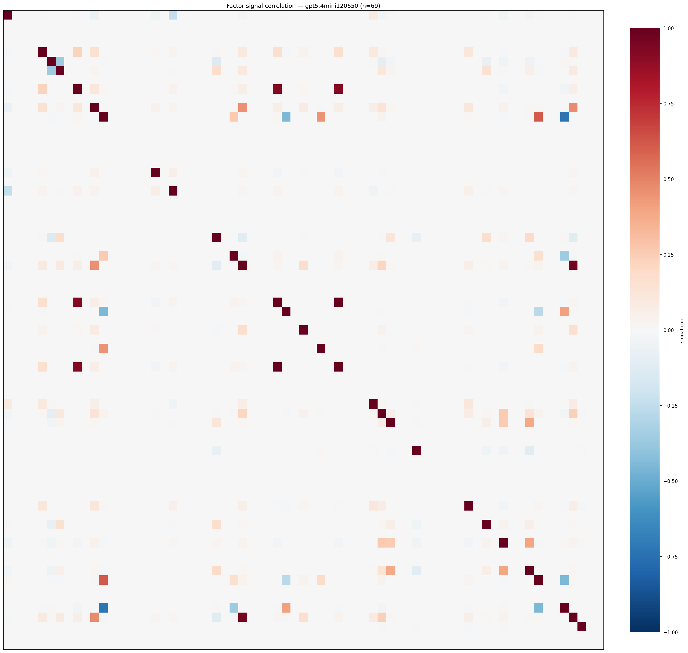

*Signal correlation matrix — gpt5.4mini120650*

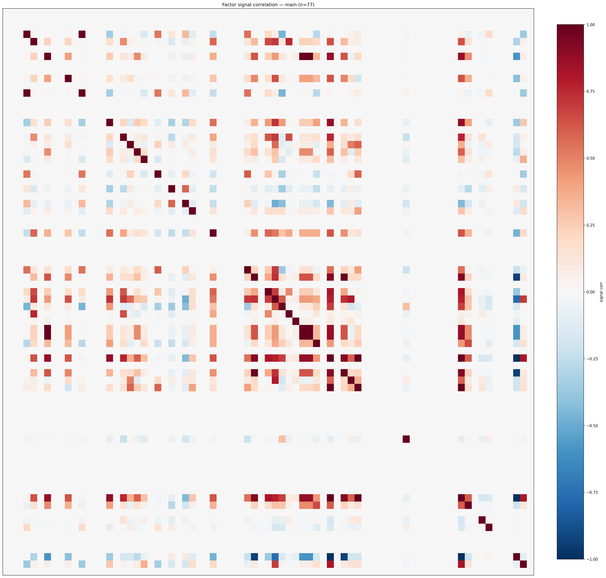

*Signal correlation matrix — main*

## 3. Deflation & model-based importance

`deflated_best_ic` haircuts each zoo's best |IC| for the number of factors tried (`ic_n_tested`) — a bigger zoo's best factor is more likely to be lucky. `lasso_n_nonzero` / `lasso_sparsity` show how many factors a sparse linear model actually keeps (model-view redundancy).

| prerun | best_ic | deflated_best_ic | deflated_best_t | ic_n_tested | ic_n_obs | lasso_n_nonzero | lasso_sparsity |
| --- | --- | --- | --- | --- | --- | --- | --- |
| gpt4omini120650 | 0.1666 | 0.159 | 60.3487 | 64 | 143998 | 17 | 0.7424 |
| gpt5.4mini120650 | 0.1632 | 0.1563 | 59.3289 | 29 | 143998 | 3 | 0.9565 |
| main | 0.0867 | 0.0796 | 30.207 | 36 | 143998 | 1 | 0.987 |

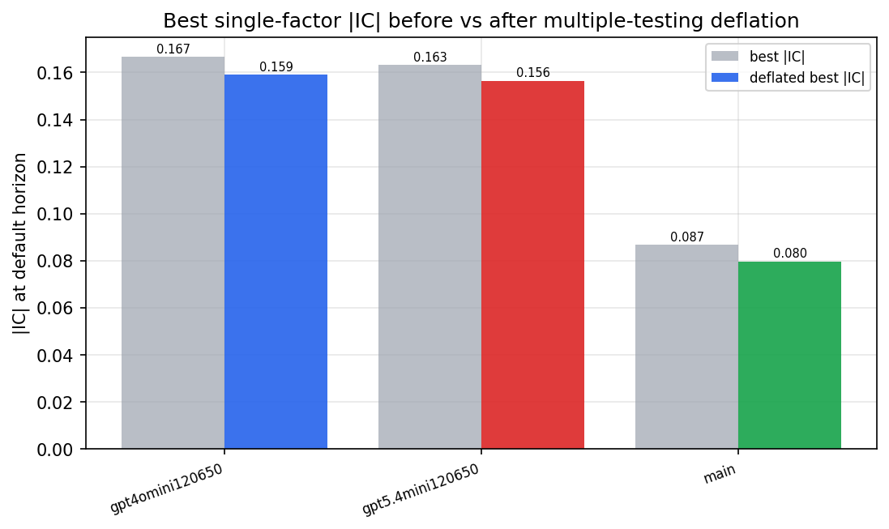

*Best |IC| before vs after multiple-testing deflation*

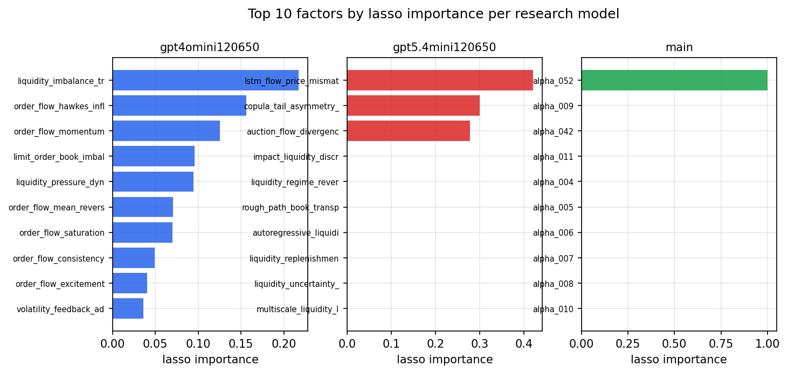

*Top factors by lasso importance per zoo*

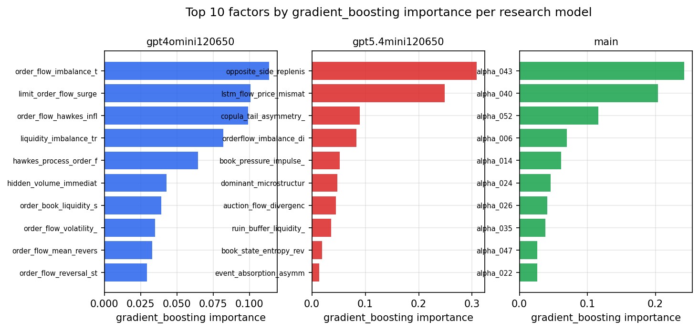

*Top factors by gradient_boosting importance per zoo*

## 4. ML-combined signal — per-underlying vectorised backtest

Each model combines a prerun's factors into ONE signal (fit `factors → forward return` on IS, predict per (bar, underlying)), then that combined signal is run through a simple vectorised backtest — `position(signal) × the underlying's own forward return` — on the held-out OOS tail (+ an equal-weight ensemble). No cross-sectional ranking.

> Config: position=**threshold** (t=1.0, z-score `expanding`), aggregation=**portfolio**, fit-standardise=**per_underlying**, horizon=6.

| prerun | model | n_factors_used | oos_ic | oos_sharpe | is_sharpe | oos_ann_return | oos_max_drawdown |
| --- | --- | --- | --- | --- | --- | --- | --- |
| gpt4omini120650 | linear_regression | 66 | 0.2327 | 31.2427 | 26.5998 | 0.3225 | -0.0014 |
| gpt4omini120650 | ridge | 66 | 0.2317 | 30.9093 | 26.2377 | 0.3195 | -0.0014 |
| gpt4omini120650 | lasso | 66 | 0.2282 | 30.1618 | 23.9235 | 0.3174 | -0.0014 |
| gpt4omini120650 | elastic_net | 66 | 0.2215 | 28.259 | 22.046 | 0.3002 | -0.0014 |
| gpt4omini120650 | random_forest | 66 | 0.2134 | 20.4091 | 19.3332 | 0.19 | -0.0014 |
| gpt4omini120650 | gradient_boosting | 66 | 0.2212 | 7.0055 | 9.5372 | 0.0127 | -0.0003 |
| gpt4omini120650 | xgboost | 66 | 0.2286 | 7.0519 | 16.4241 | 0.0422 | -0.0011 |
| gpt4omini120650 | lightgbm | 66 | 0.233 | 3.3675 | 16.9719 | 0.0194 | -0.0012 |
| gpt4omini120650 | ensemble | 66 | 0.2323 | 27.2489 | 24.0333 | 0.2703 | -0.0014 |
| gpt5.4mini120650 | linear_regression | 69 | 0.1919 | 19.8494 | 13.8531 | 0.1852 | -0.0012 |
| gpt5.4mini120650 | ridge | 69 | 0.1924 | 19.2332 | 13.5954 | 0.1703 | -0.0012 |
| gpt5.4mini120650 | lasso | 69 | 0.1975 | 23.3481 | 25.5426 | 0.2632 | -0.0017 |
| gpt5.4mini120650 | elastic_net | 69 | 0.1976 | 23.7656 | 26.2444 | 0.2752 | -0.0017 |
| gpt5.4mini120650 | random_forest | 69 | 0.2486 | 36.2682 | 33.207 | 0.413 | -0.0015 |
| gpt5.4mini120650 | gradient_boosting | 69 | 0.2241 | 0.3215 | 18.7189 | 0.0018 | -0.0011 |
| gpt5.4mini120650 | xgboost | 69 | 0.2486 | 21.4992 | 26.5338 | 0.1983 | -0.0011 |
| gpt5.4mini120650 | lightgbm | 69 | 0.2483 | 14.7796 | 20.6815 | 0.1051 | -0.0009 |
| gpt5.4mini120650 | ensemble | 69 | 0.226 | 29.1736 | 28.48 | 0.3123 | -0.0012 |
| main | linear_regression | 77 | 0.0169 | 4.442 | 5.3971 | 0.0068 | -0.0002 |
| main | ridge | 77 | 0.0169 | 4.442 | 5.3971 | 0.0068 | -0.0002 |
| main | lasso | 77 | 0.0243 | 5.6336 | 2.3074 | 0.0248 | -0.0008 |
| main | elastic_net | 77 | 0.0243 | 5.6336 | 2.3074 | 0.0248 | -0.0008 |
| main | random_forest | 77 | 0.0489 | 2.1248 | 12.1021 | 0.0155 | -0.0018 |
| main | gradient_boosting | 77 | 0.0393 | -4.7122 | 8.5451 | -0.0109 | -0.0011 |
| main | xgboost | 77 | 0.0436 | -5.3424 | 8.9797 | -0.0156 | -0.0014 |
| main | lightgbm | 77 | 0.0425 | -3.636 | 14.4218 | -0.0202 | -0.0027 |
| main | ensemble | 77 | 0.0402 | 0.9 | 11.2861 | 0.0041 | -0.0014 |

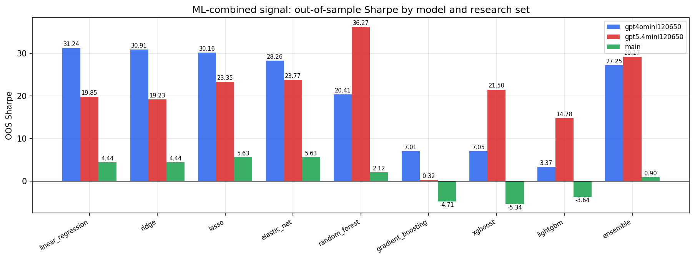

*ML-combined OOS Sharpe by model and research set*

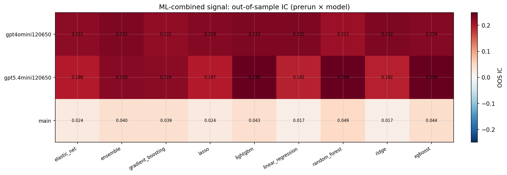

*ML-combined OOS IC (prerun × model)*

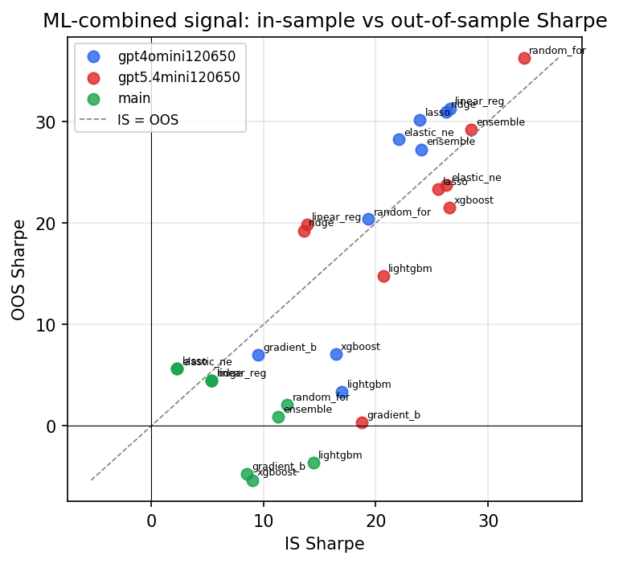

*IS vs OOS Sharpe (overfitting diagnostic)*

---
*Generated by `run_model_comparison.py`. Tables: `*.csv`; interactive: `comparison.ipynb`.*
