# Research-LLM factor comparison — `2024-12`

Comparing the **factor output of different research LLMs** on three axes (raw factor quality → factors as ML features → factors through the full agentic fund). The panel, IS/OOS split, horizon and model hyper-parameters are held identical across preruns — the *only* variable is the factor set.

## Preruns compared

| prerun | research_model | usable_factors | dropped_factors |
| --- | --- | --- | --- |
| gpt4omini120650 | gpt-4o-mini | 66 | 0 |
| gpt5.4mini120650 | gpt-5.4-mini | 69 | 0 |
| main | seed library | 77 | 11 |

> Dropped factors declare fields the current data doesn't have yet (e.g. fundamentals); they light up unchanged once that data is downloaded.

*Usable vs awaiting-data factors per research model*

## Key findings

- **Best ML-combined OOS Sharpe:** `gpt5.4mini120650` with `random_forest` (OOS Sharpe = 27.424).
- **Mean OOS Sharpe across models, by research set:** `gpt4omini120650` = 17.122, `gpt5.4mini120650` = 14.396, `main` = 0.758.
- **Highest mean single-factor |IC| (h=6):** `gpt4omini120650` (mean |IC| = 0.0442).
- **Most diverse zoo (highest effective/raw factor ratio):** `gpt5.4mini120650` (eff 56.9 of 69, ratio 0.82).
- **Best selection-deflated single-factor |IC|:** `gpt4omini120650` (deflated |IC| = 0.1503 from 64 factors tried).

## 1. Single-factor IC (raw factor quality)

Per-underlying time-series Spearman rank-IC of every researched factor, recomputed on the shared panel at horizons h=1, h=6, h=60. The per-underlying IC correlates each factor's value vector with the underlying's own forward-return vector (pooled across underlyings); the cross-sectional IC ranks across underlyings per timestamp.

| prerun | n_factors | mean_abs_ic_1 | mean_abs_ic_6 | mean_abs_ic_60 | mean_abs_icir_6 | best_factor_h6 | best_abs_ic_h6 |
| --- | --- | --- | --- | --- | --- | --- | --- |
| gpt4omini120650 | 66 | 0.0266 | 0.0442 | 0.0414 | 1.5152 | order_flow_momentum | 0.1578 |
| gpt5.4mini120650 | 69 | 0.018 | 0.0321 | 0.0345 | 1.6098 | lstm_flow_price_mismatch | 0.153 |
| main | 77 | 0.0134 | 0.0248 | 0.0297 | 0.6579 | alpha_032 | 0.1026 |

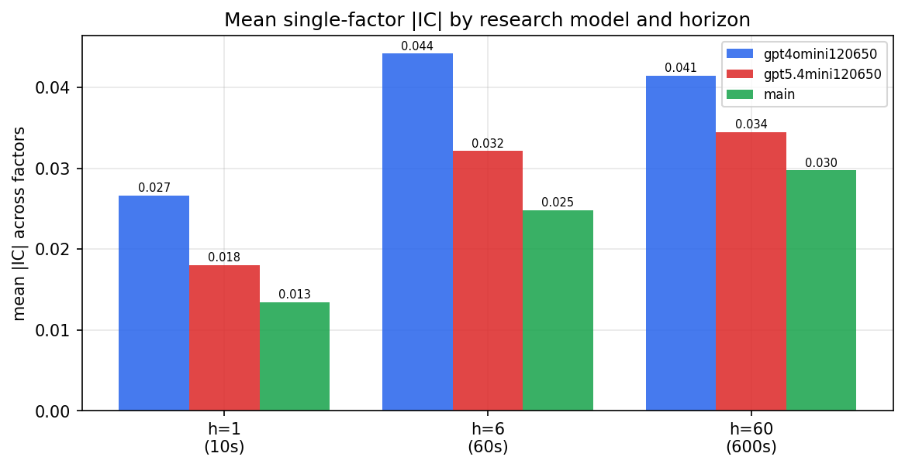

*Mean |IC| by research model and horizon*

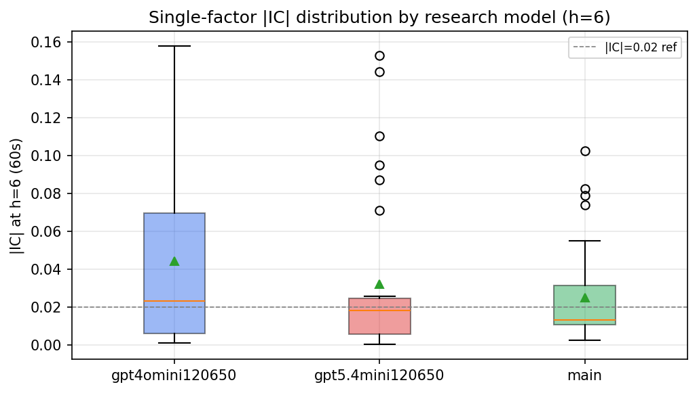

*Per-factor |IC| distribution by research model*

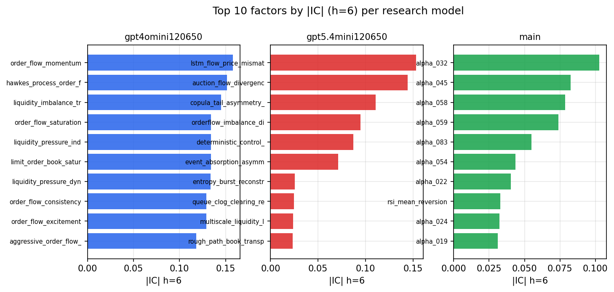

*Top factors by |IC| per research model*

## 2. Factor diversity & redundancy

Pairwise correlation of each zoo's *signals*. `eff_n_factors` is the effective number of independent factors (participation ratio of the correlation eigenvalues); `eff_ratio` and `redundancy` summarise how much unique information the zoo holds vs. how much is duplicated; `n_clusters` groups factors at |corr| ≥ 0.7.

| prerun | n_factors | eff_n_factors | eff_ratio | mean_abs_corr | n_clusters | redundancy |
| --- | --- | --- | --- | --- | --- | --- |
| gpt4omini120650 | 66 | 31.8669 | 0.4828 | 0.0433 | 56 | 0.5172 |
| gpt5.4mini120650 | 69 | 56.8653 | 0.8241 | 0.0089 | 65 | 0.1759 |
| main | 77 | 32.2187 | 0.4184 | 0.0432 | 60 | 0.5816 |

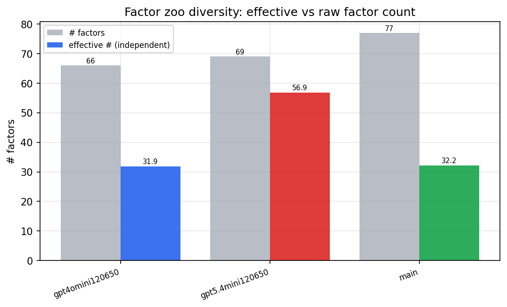

*Effective vs raw factor count per research model*

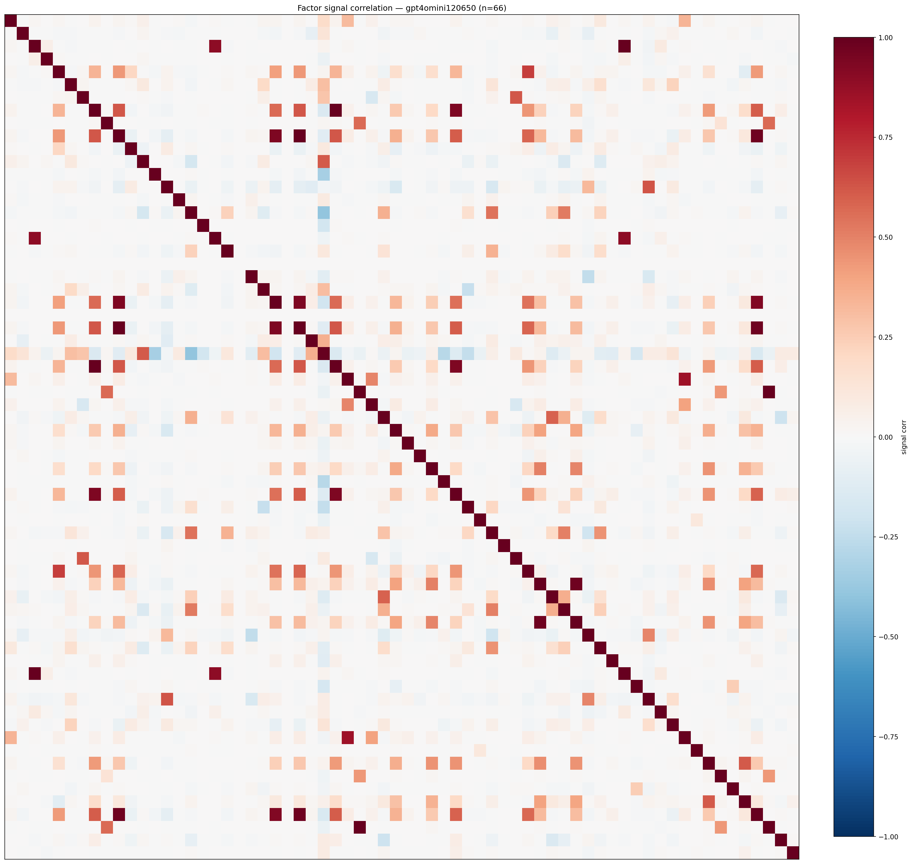

*Signal correlation matrix — gpt4omini120650*

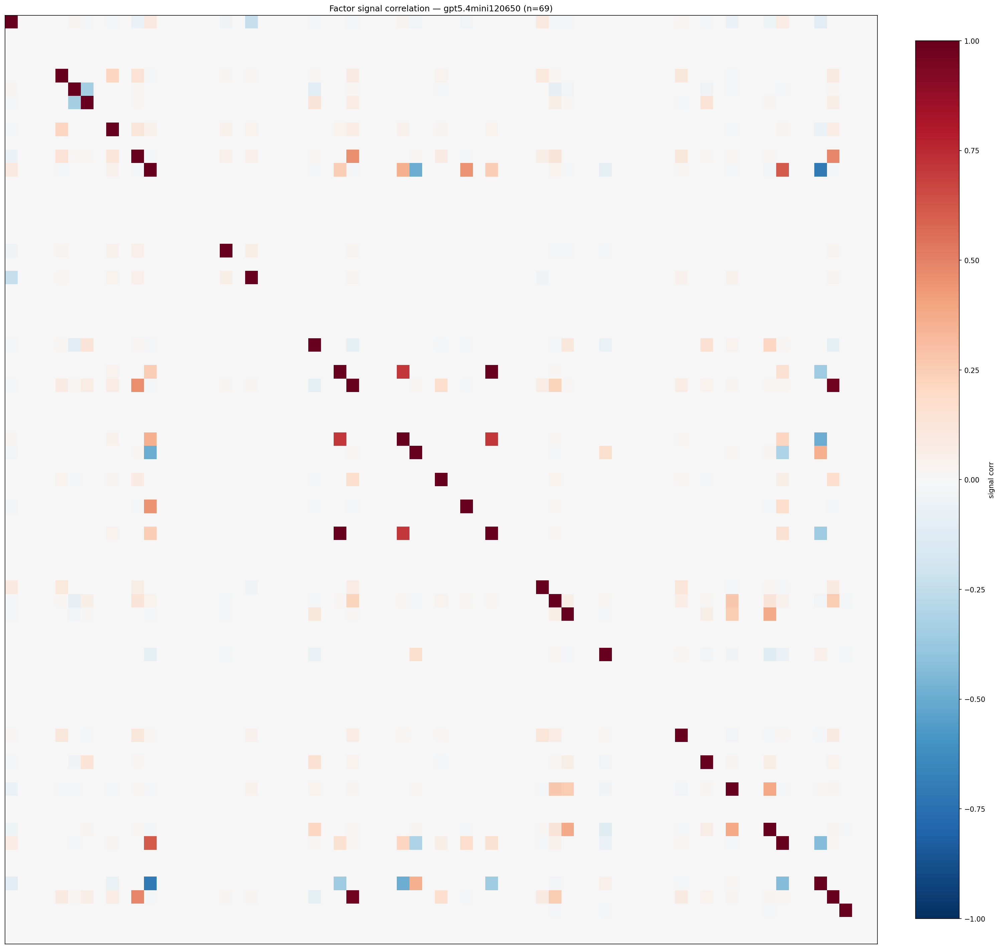

*Signal correlation matrix — gpt5.4mini120650*

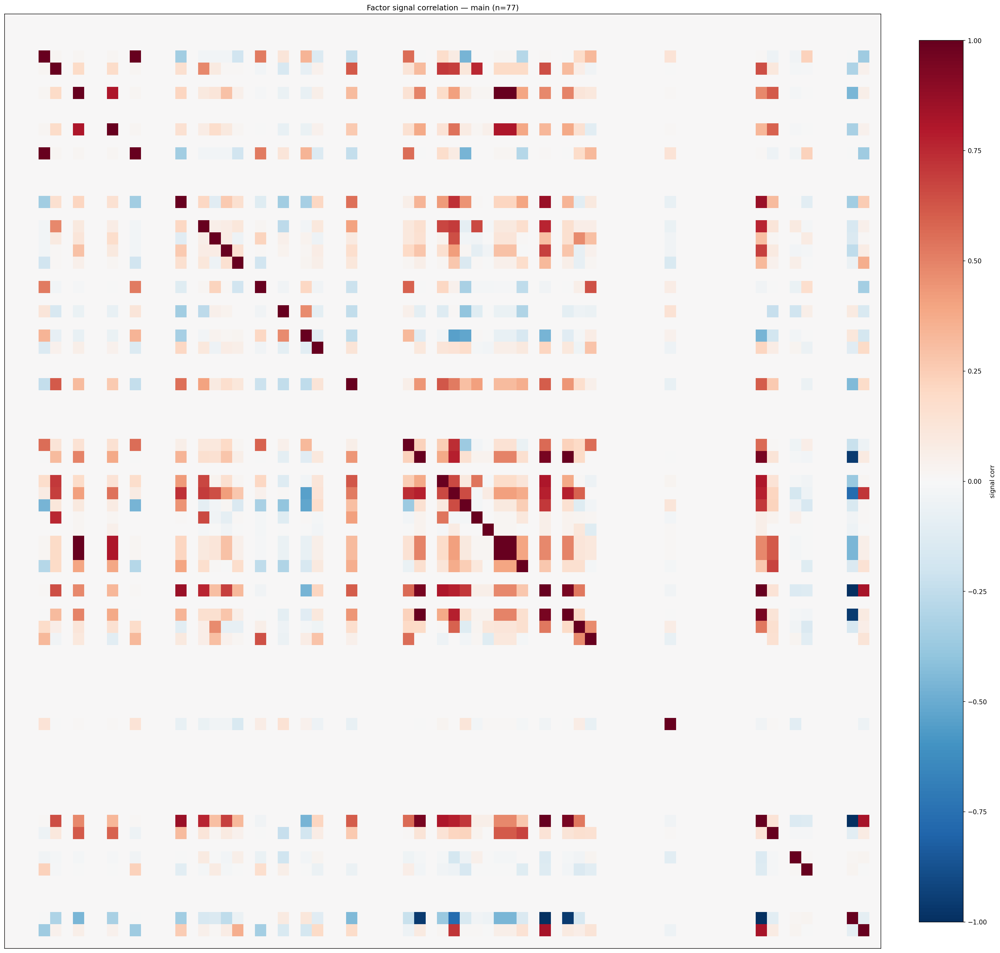

*Signal correlation matrix — main*

## 3. Deflation & model-based importance

`deflated_best_ic` haircuts each zoo's best |IC| for the number of factors tried (`ic_n_tested`) — a bigger zoo's best factor is more likely to be lucky. `lasso_n_nonzero` / `lasso_sparsity` show how many factors a sparse linear model actually keeps (model-view redundancy).

| prerun | best_ic | deflated_best_ic | deflated_best_t | ic_n_tested | ic_n_obs | lasso_n_nonzero | lasso_sparsity |
| --- | --- | --- | --- | --- | --- | --- | --- |
| gpt4omini120650 | 0.1578 | 0.1503 | 57.7504 | 64 | 147599 | 6 | 0.9091 |
| gpt5.4mini120650 | 0.153 | 0.1462 | 56.1787 | 29 | 147599 | 4 | 0.942 |
| main | 0.1026 | 0.0957 | 36.7492 | 36 | 147599 | 0 | 1.0 |

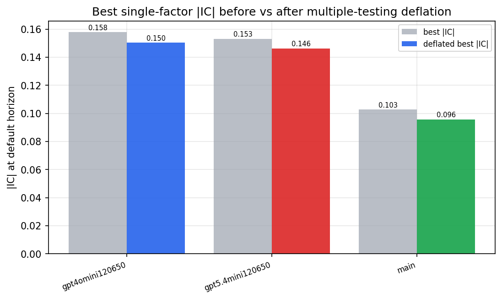

*Best |IC| before vs after multiple-testing deflation*

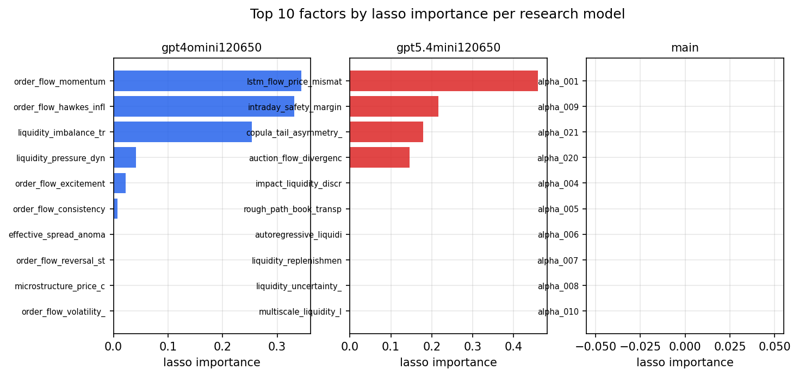

*Top factors by lasso importance per zoo*

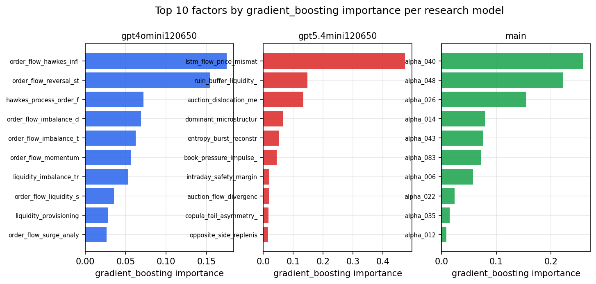

*Top factors by gradient_boosting importance per zoo*

## 4. ML-combined signal — per-underlying vectorised backtest

Each model combines a prerun's factors into ONE signal (fit `factors → forward return` on IS, predict per (bar, underlying)), then that combined signal is run through a simple vectorised backtest — `position(signal) × the underlying's own forward return` — on the held-out OOS tail (+ an equal-weight ensemble). No cross-sectional ranking.

> Config: position=**threshold** (t=1.0, z-score `expanding`), aggregation=**portfolio**, fit-standardise=**per_underlying**, horizon=6.

| prerun | model | n_factors_used | oos_ic | oos_sharpe | is_sharpe | oos_ann_return | oos_max_drawdown |
| --- | --- | --- | --- | --- | --- | --- | --- |
| gpt4omini120650 | linear_regression | 66 | 0.2018 | 21.3496 | 30.0232 | 0.2127 | -0.0014 |
| gpt4omini120650 | ridge | 66 | 0.2033 | 21.9136 | 29.8721 | 0.2202 | -0.0014 |
| gpt4omini120650 | lasso | 66 | 0.1978 | 22.1826 | 24.9436 | 0.2031 | -0.0014 |
| gpt4omini120650 | elastic_net | 66 | 0.2011 | 24.3652 | 26.7512 | 0.2238 | -0.0014 |
| gpt4omini120650 | random_forest | 66 | 0.1953 | 24.8309 | 23.5372 | 0.2359 | -0.0012 |
| gpt4omini120650 | gradient_boosting | 66 | 0.1923 | 3.4642 | 6.6066 | 0.0133 | -0.0004 |
| gpt4omini120650 | xgboost | 66 | 0.2008 | 6.9932 | 11.3363 | 0.0459 | -0.0005 |
| gpt4omini120650 | lightgbm | 66 | 0.1951 | 5.5413 | 12.6717 | 0.0351 | -0.0005 |
| gpt4omini120650 | ensemble | 66 | 0.205 | 23.453 | 25.1026 | 0.2069 | -0.0008 |
| gpt5.4mini120650 | linear_regression | 69 | 0.153 | 13.2715 | 20.0735 | 0.123 | -0.0016 |
| gpt5.4mini120650 | ridge | 69 | 0.1534 | 13.6803 | 20.4435 | 0.1267 | -0.0016 |
| gpt5.4mini120650 | lasso | 69 | 0.1557 | 11.5818 | 16.3202 | 0.1112 | -0.0019 |
| gpt5.4mini120650 | elastic_net | 69 | 0.1557 | 11.5818 | 16.3202 | 0.1112 | -0.0019 |
| gpt5.4mini120650 | random_forest | 69 | 0.1967 | 27.4241 | 29.1142 | 0.2251 | -0.001 |
| gpt5.4mini120650 | gradient_boosting | 69 | 0.1862 | 3.3073 | 9.9548 | 0.0083 | -0.0007 |
| gpt5.4mini120650 | xgboost | 69 | 0.1972 | 21.107 | 18.2798 | 0.1032 | -0.0007 |
| gpt5.4mini120650 | lightgbm | 69 | 0.1938 | 6.3379 | 12.9412 | 0.0284 | -0.0008 |
| gpt5.4mini120650 | ensemble | 69 | 0.181 | 21.2704 | 23.7673 | 0.1651 | -0.0011 |
| main | linear_regression | 77 | 0.038 | 2.2291 | 8.1563 | 0.0189 | -0.0021 |
| main | ridge | 77 | 0.0374 | 2.1063 | 10.6632 | 0.0188 | -0.0024 |
| main | lasso | 77 | nan | nan | nan | nan | nan |
| main | elastic_net | 77 | nan | nan | nan | nan | nan |
| main | random_forest | 77 | 0.0528 | 1.5419 | 12.4354 | 0.0186 | -0.003 |
| main | gradient_boosting | 77 | 0.0397 | -0.5344 | 10.1611 | -0.0042 | -0.002 |
| main | xgboost | 77 | 0.0437 | -0.6324 | 11.4901 | -0.0049 | -0.0022 |
| main | lightgbm | 77 | 0.0407 | -0.0417 | 11.6894 | -0.0003 | -0.0021 |
| main | ensemble | 77 | 0.044 | 0.6372 | 6.9784 | 0.0005 | -0.0002 |

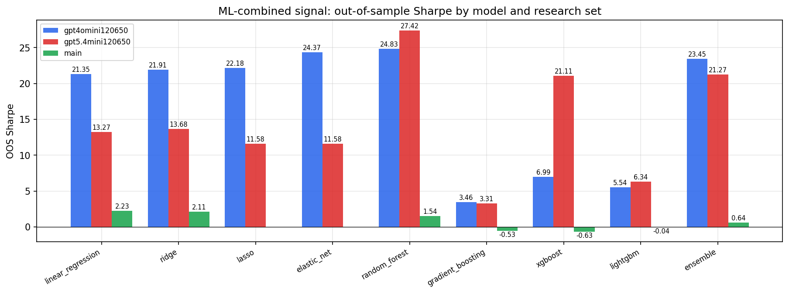

*ML-combined OOS Sharpe by model and research set*

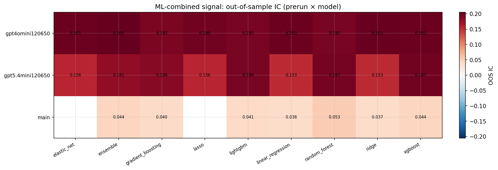

*ML-combined OOS IC (prerun × model)*

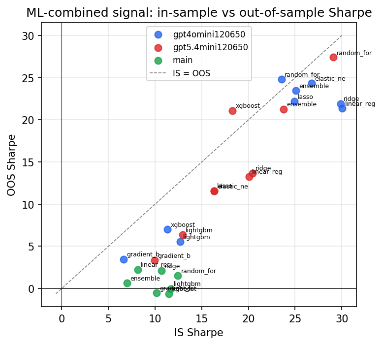

*IS vs OOS Sharpe (overfitting diagnostic)*

---
*Generated by `run_model_comparison.py`. Tables: `*.csv`; interactive: `comparison.ipynb`.*
