# Research-LLM factor comparison — `2025-01`

Comparing the **factor output of different research LLMs** on three axes (raw factor quality → factors as ML features → factors through the full agentic fund). The panel, IS/OOS split, horizon and model hyper-parameters are held identical across preruns — the *only* variable is the factor set.

## Preruns compared

| prerun | research_model | usable_factors | dropped_factors |
| --- | --- | --- | --- |
| gpt4omini120650 | gpt-4o-mini | 66 | 0 |
| gpt5.4mini120650 | gpt-5.4-mini | 69 | 0 |
| main | seed library | 77 | 11 |

> Dropped factors declare fields the current data doesn't have yet (e.g. fundamentals); they light up unchanged once that data is downloaded.

*Usable vs awaiting-data factors per research model*

## Key findings

- **Best ML-combined OOS Sharpe:** `gpt5.4mini120650` with `random_forest` (OOS Sharpe = 40.066).
- **Mean OOS Sharpe across models, by research set:** `gpt5.4mini120650` = 22.478, `gpt4omini120650` = 18.813, `main` = 5.862.
- **Highest mean single-factor |IC| (h=6):** `gpt4omini120650` (mean |IC| = 0.0445).
- **Most diverse zoo (highest effective/raw factor ratio):** `gpt5.4mini120650` (eff 56.6 of 69, ratio 0.82).
- **Best selection-deflated single-factor |IC|:** `gpt4omini120650` (deflated |IC| = 0.1519 from 64 factors tried).

## 1. Single-factor IC (raw factor quality)

Per-underlying time-series Spearman rank-IC of every researched factor, recomputed on the shared panel at horizons h=1, h=6, h=60. The per-underlying IC correlates each factor's value vector with the underlying's own forward-return vector (pooled across underlyings); the cross-sectional IC ranks across underlyings per timestamp.

| prerun | n_factors | mean_abs_ic_1 | mean_abs_ic_6 | mean_abs_ic_60 | mean_abs_icir_6 | best_factor_h6 | best_abs_ic_h6 |
| --- | --- | --- | --- | --- | --- | --- | --- |
| gpt4omini120650 | 66 | 0.0269 | 0.0445 | 0.0418 | 1.351 | liquidity_imbalance_trend | 0.1596 |
| gpt5.4mini120650 | 69 | 0.0168 | 0.0292 | 0.0325 | 1.4327 | auction_flow_divergence_reversion | 0.1432 |
| main | 77 | 0.0174 | 0.0251 | 0.0351 | 0.5649 | alpha_032 | 0.1008 |

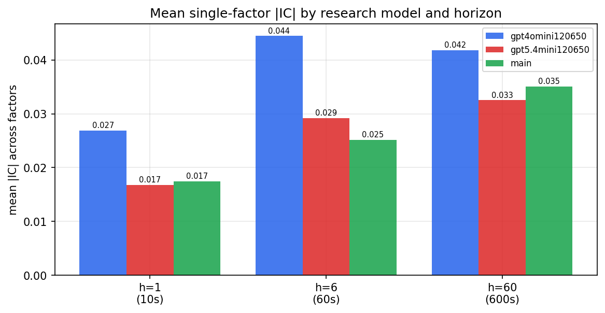

*Mean |IC| by research model and horizon*

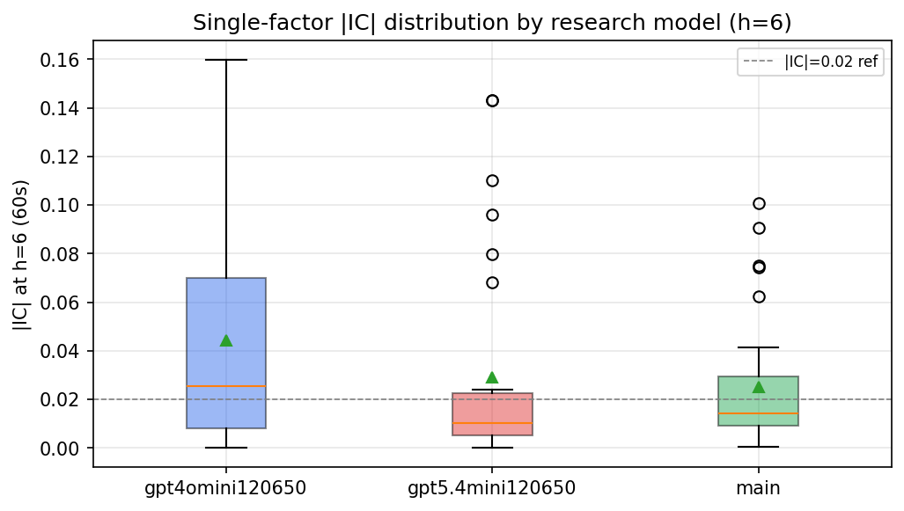

*Per-factor |IC| distribution by research model*

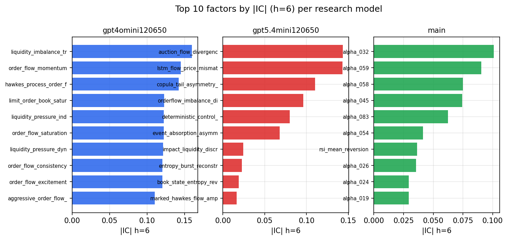

*Top factors by |IC| per research model*

## 2. Factor diversity & redundancy

Pairwise correlation of each zoo's *signals*. `eff_n_factors` is the effective number of independent factors (participation ratio of the correlation eigenvalues); `eff_ratio` and `redundancy` summarise how much unique information the zoo holds vs. how much is duplicated; `n_clusters` groups factors at |corr| ≥ 0.7.

| prerun | n_factors | eff_n_factors | eff_ratio | mean_abs_corr | n_clusters | redundancy |
| --- | --- | --- | --- | --- | --- | --- |
| gpt4omini120650 | 66 | 32.2603 | 0.4888 | 0.0439 | 56 | 0.5112 |
| gpt5.4mini120650 | 69 | 56.563 | 0.8198 | 0.0087 | 65 | 0.1802 |
| main | 77 | 33.2624 | 0.432 | 0.0434 | 58 | 0.568 |

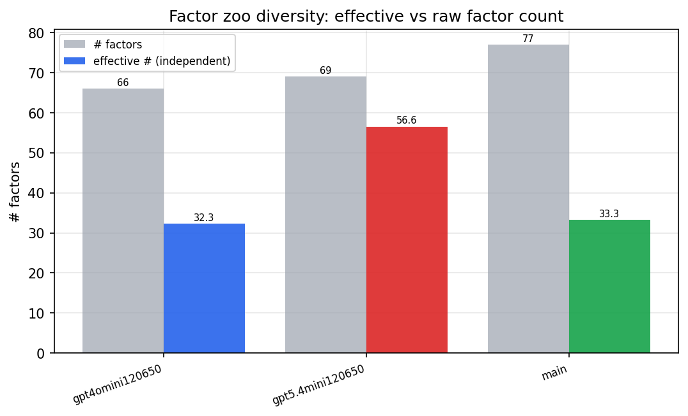

*Effective vs raw factor count per research model*

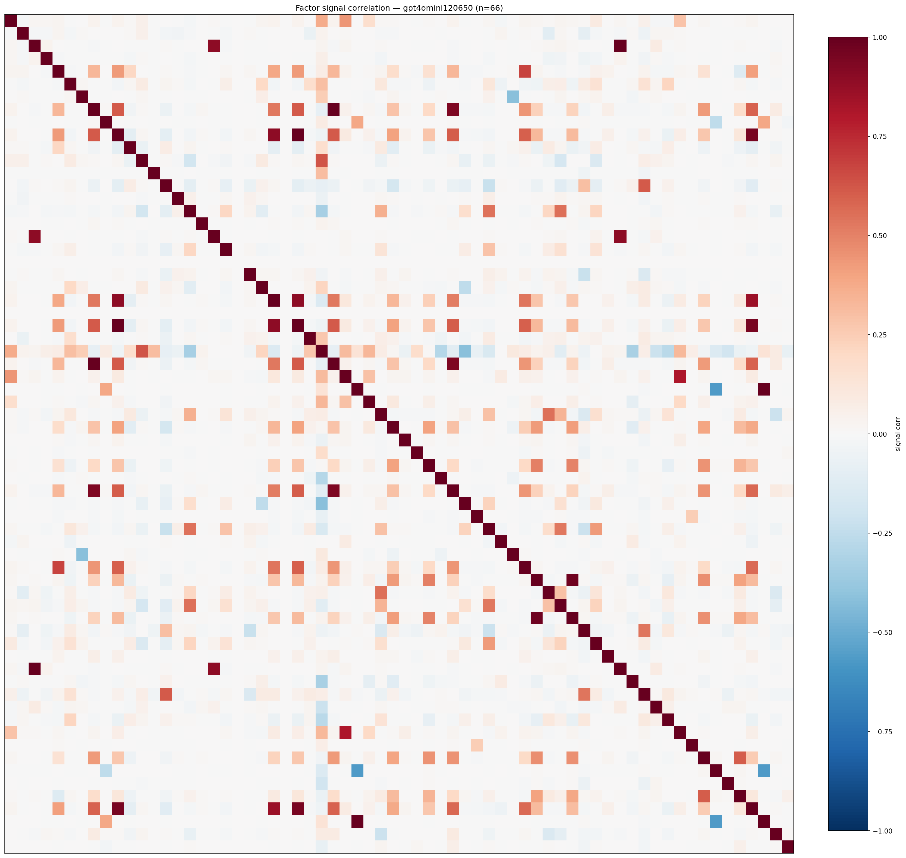

*Signal correlation matrix — gpt4omini120650*

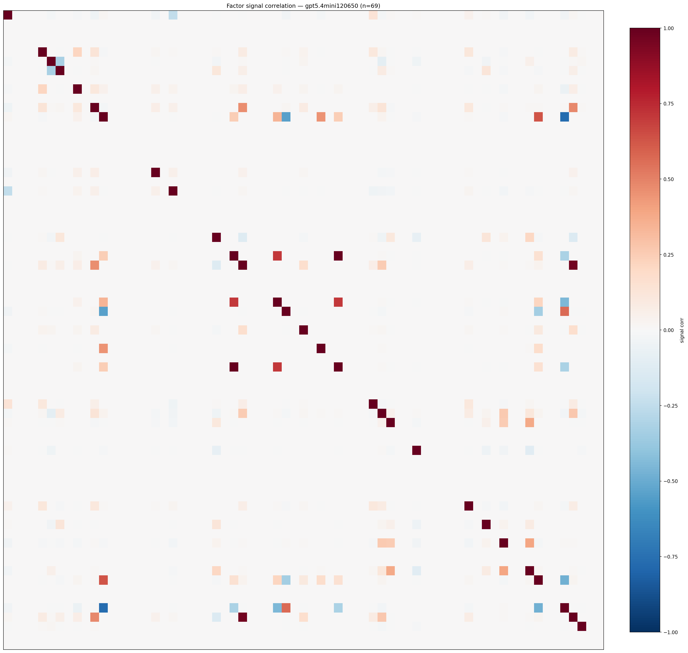

*Signal correlation matrix — gpt5.4mini120650*

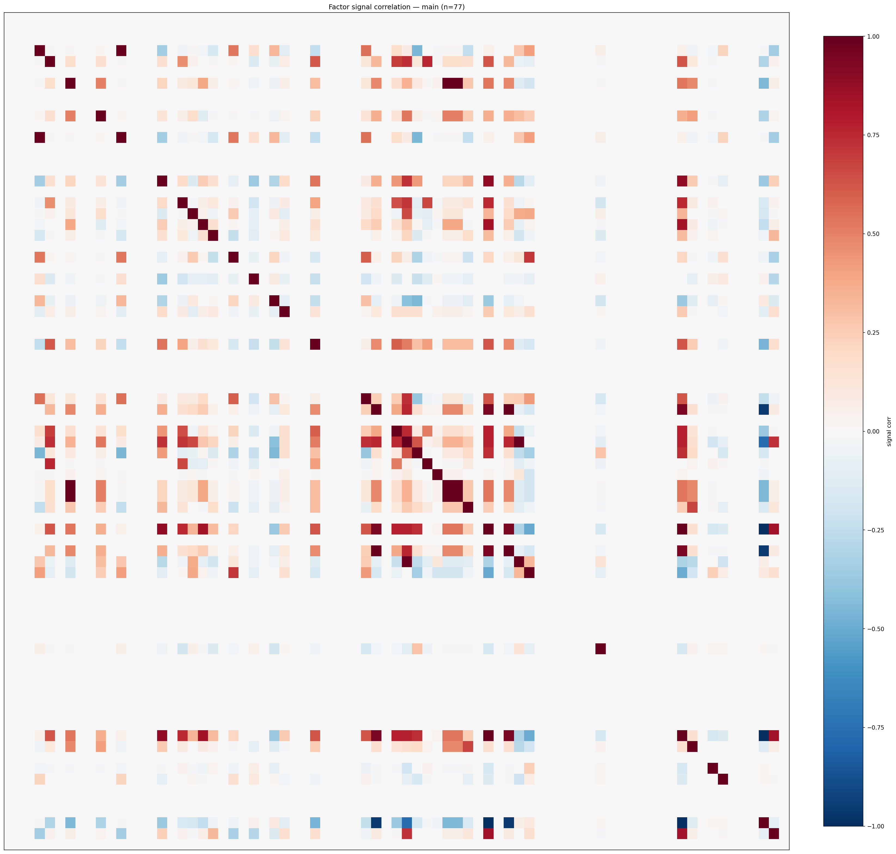

*Signal correlation matrix — main*

## 3. Deflation & model-based importance

`deflated_best_ic` haircuts each zoo's best |IC| for the number of factors tried (`ic_n_tested`) — a bigger zoo's best factor is more likely to be lucky. `lasso_n_nonzero` / `lasso_sparsity` show how many factors a sparse linear model actually keeps (model-view redundancy).

| prerun | best_ic | deflated_best_ic | deflated_best_t | ic_n_tested | ic_n_obs | lasso_n_nonzero | lasso_sparsity |
| --- | --- | --- | --- | --- | --- | --- | --- |
| gpt4omini120650 | 0.1596 | 0.1519 | 56.9653 | 64 | 140579 | 37 | 0.4394 |
| gpt5.4mini120650 | 0.1432 | 0.1363 | 51.1136 | 29 | 140579 | 9 | 0.8696 |
| main | 0.1008 | 0.0937 | 35.1218 | 36 | 140579 | 0 | 1.0 |

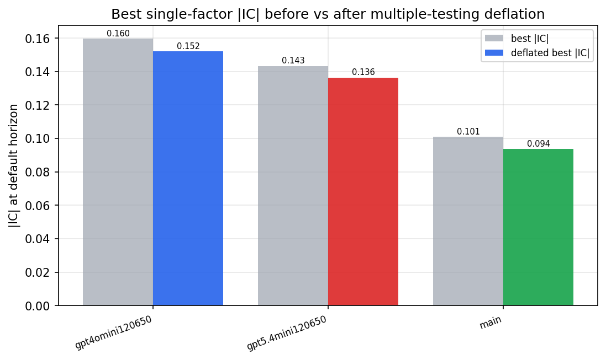

*Best |IC| before vs after multiple-testing deflation*

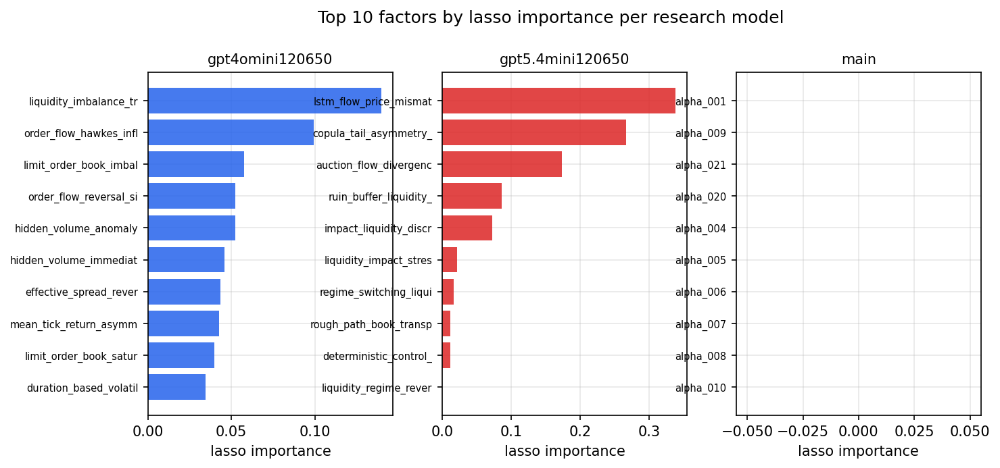

*Top factors by lasso importance per zoo*

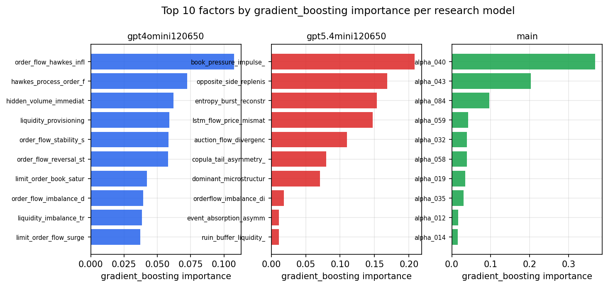

*Top factors by gradient_boosting importance per zoo*

## 4. ML-combined signal — per-underlying vectorised backtest

Each model combines a prerun's factors into ONE signal (fit `factors → forward return` on IS, predict per (bar, underlying)), then that combined signal is run through a simple vectorised backtest — `position(signal) × the underlying's own forward return` — on the held-out OOS tail (+ an equal-weight ensemble). No cross-sectional ranking.

> Config: position=**threshold** (t=1.0, z-score `expanding`), aggregation=**portfolio**, fit-standardise=**per_underlying**, horizon=6.

| prerun | model | n_factors_used | oos_ic | oos_sharpe | is_sharpe | oos_ann_return | oos_max_drawdown |
| --- | --- | --- | --- | --- | --- | --- | --- |
| gpt4omini120650 | linear_regression | 66 | 0.2032 | 19.7398 | 21.5522 | 0.0974 | -0.0002 |
| gpt4omini120650 | ridge | 66 | 0.2049 | 20.8574 | 22.0367 | 0.1037 | -0.0002 |
| gpt4omini120650 | lasso | 66 | 0.2065 | 22.0921 | 21.4054 | 0.0769 | -0.0004 |
| gpt4omini120650 | elastic_net | 66 | 0.2063 | 22.826 | 21.6755 | 0.08 | -0.0004 |
| gpt4omini120650 | random_forest | 66 | 0.1904 | 28.7641 | 22.0479 | 0.1939 | -0.0006 |
| gpt4omini120650 | gradient_boosting | 66 | 0.194 | 7.6183 | 10.9298 | 0.0104 | -0.0001 |
| gpt4omini120650 | xgboost | 66 | 0.1903 | 12.492 | 13.3122 | 0.0271 | -0.0002 |
| gpt4omini120650 | lightgbm | 66 | 0.1958 | 12.625 | 14.8445 | 0.0255 | -0.0003 |
| gpt4omini120650 | ensemble | 66 | 0.2072 | 22.3061 | 19.7866 | 0.0965 | -0.0004 |
| gpt5.4mini120650 | linear_regression | 69 | 0.1396 | 32.8189 | 15.53 | 0.1165 | -0.0002 |
| gpt5.4mini120650 | ridge | 69 | 0.1408 | 26.9046 | 12.5844 | 0.1207 | -0.0004 |
| gpt5.4mini120650 | lasso | 69 | 0.139 | 16.8515 | 7.0102 | 0.0574 | -0.0002 |
| gpt5.4mini120650 | elastic_net | 69 | 0.141 | 18.9356 | 6.4434 | 0.0672 | -0.0002 |
| gpt5.4mini120650 | random_forest | 69 | 0.196 | 40.0656 | 31.5906 | 0.2448 | -0.0006 |
| gpt5.4mini120650 | gradient_boosting | 69 | 0.1774 | 3.0265 | 11.2549 | 0.0061 | -0.0003 |
| gpt5.4mini120650 | xgboost | 69 | 0.1912 | 20.6418 | 15.8792 | 0.0524 | -0.0004 |
| gpt5.4mini120650 | lightgbm | 69 | 0.1939 | 10.9676 | 13.5147 | 0.0183 | -0.0003 |
| gpt5.4mini120650 | ensemble | 69 | 0.1769 | 32.0864 | 20.15 | 0.162 | -0.0005 |
| main | linear_regression | 77 | 0.0215 | 6.4693 | 9.8699 | 0.0381 | -0.0008 |
| main | ridge | 77 | 0.0248 | 7.2678 | 9.7324 | 0.043 | -0.0007 |
| main | lasso | 77 | 0.0151 | 8.7587 | 7.979 | 0.0436 | -0.0005 |
| main | elastic_net | 77 | 0.015 | 7.8498 | 8.5424 | 0.0415 | -0.0005 |
| main | random_forest | 77 | 0.0209 | 7.2069 | 12.0695 | 0.0447 | -0.0007 |
| main | gradient_boosting | 77 | 0.0188 | -1.2986 | 8.5643 | -0.0006 | -0.0001 |
| main | xgboost | 77 | 0.0164 | 3.6585 | 10.5734 | 0.0113 | -0.0004 |
| main | lightgbm | 77 | 0.0249 | 5.2259 | 10.7814 | 0.0153 | -0.0003 |
| main | ensemble | 77 | 0.0257 | 7.6211 | 11.3556 | 0.0415 | -0.0007 |

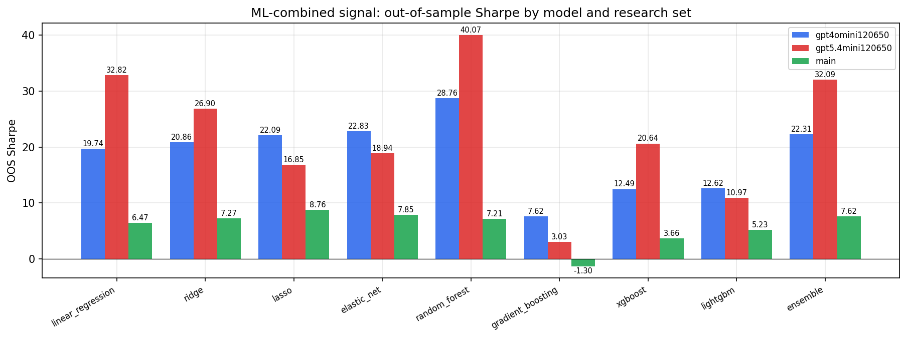

*ML-combined OOS Sharpe by model and research set*

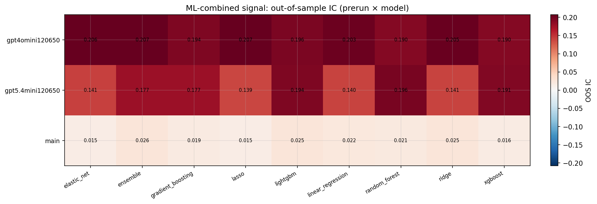

*ML-combined OOS IC (prerun × model)*

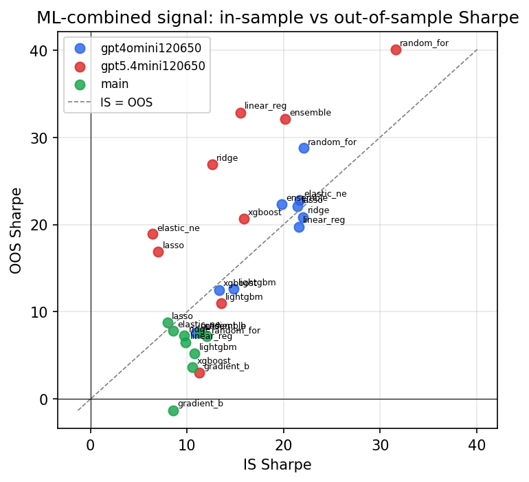

*IS vs OOS Sharpe (overfitting diagnostic)*

---
*Generated by `run_model_comparison.py`. Tables: `*.csv`; interactive: `comparison.ipynb`.*
