# Research-LLM factor comparison — `2025-02`

Comparing the **factor output of different research LLMs** on three axes (raw factor quality → factors as ML features → factors through the full agentic fund). The panel, IS/OOS split, horizon and model hyper-parameters are held identical across preruns — the *only* variable is the factor set.

## Preruns compared

| prerun | research_model | usable_factors | dropped_factors |
| --- | --- | --- | --- |
| gpt4omini120650 | gpt-4o-mini | 66 | 0 |
| gpt5.4mini120650 | gpt-5.4-mini | 69 | 0 |
| main | seed library | 77 | 11 |

> Dropped factors declare fields the current data doesn't have yet (e.g. fundamentals); they light up unchanged once that data is downloaded.

*Usable vs awaiting-data factors per research model*

## Key findings

- **Best ML-combined OOS Sharpe:** `gpt5.4mini120650` with `random_forest` (OOS Sharpe = 43.174).
- **Mean OOS Sharpe across models, by research set:** `gpt5.4mini120650` = 20.766, `gpt4omini120650` = 15.969, `main` = 2.612.
- **Highest mean single-factor |IC| (h=6):** `gpt4omini120650` (mean |IC| = 0.0359).
- **Most diverse zoo (highest effective/raw factor ratio):** `gpt5.4mini120650` (eff 55.4 of 69, ratio 0.80).
- **Best selection-deflated single-factor |IC|:** `main` (deflated |IC| = 0.2178 from 36 factors tried).

## 1. Single-factor IC (raw factor quality)

Per-underlying time-series Spearman rank-IC of every researched factor, recomputed on the shared panel at horizons h=1, h=6, h=60. The per-underlying IC correlates each factor's value vector with the underlying's own forward-return vector (pooled across underlyings); the cross-sectional IC ranks across underlyings per timestamp.

| prerun | n_factors | mean_abs_ic_1 | mean_abs_ic_6 | mean_abs_ic_60 | mean_abs_icir_6 | best_factor_h6 | best_abs_ic_h6 |
| --- | --- | --- | --- | --- | --- | --- | --- |
| gpt4omini120650 | 66 | 0.0229 | 0.0359 | 0.0364 | 1.1867 | liquidity_imbalance_trend | 0.1539 |
| gpt5.4mini120650 | 69 | 0.0141 | 0.0261 | 0.0303 | 1.193 | auction_flow_divergence_reversion | 0.1205 |
| main | 77 | 0.0175 | 0.025 | 0.0392 | 0.4025 | alpha_059 | 0.225 |

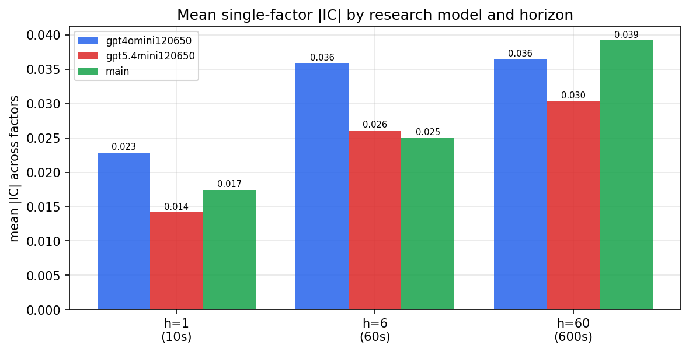

*Mean |IC| by research model and horizon*

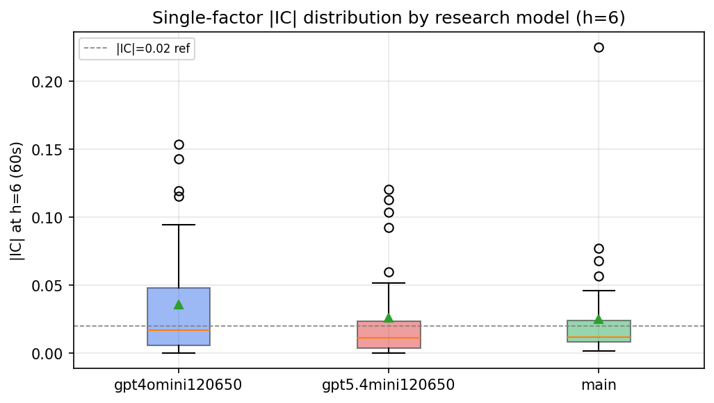

*Per-factor |IC| distribution by research model*

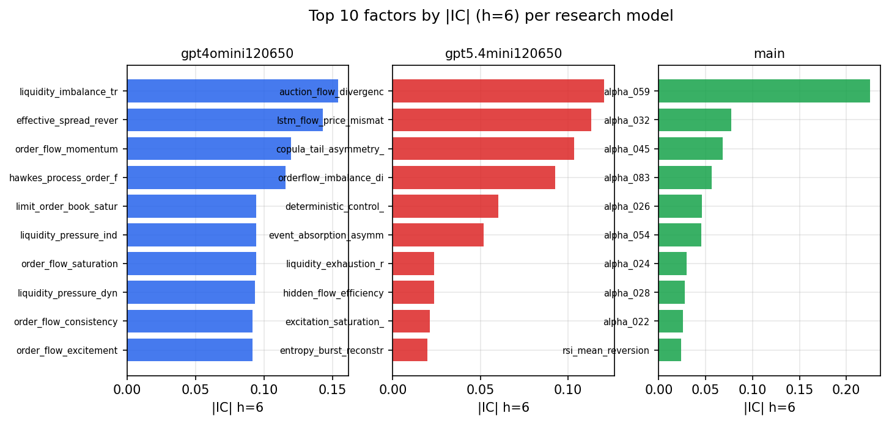

*Top factors by |IC| per research model*

## 2. Factor diversity & redundancy

Pairwise correlation of each zoo's *signals*. `eff_n_factors` is the effective number of independent factors (participation ratio of the correlation eigenvalues); `eff_ratio` and `redundancy` summarise how much unique information the zoo holds vs. how much is duplicated; `n_clusters` groups factors at |corr| ≥ 0.7.

| prerun | n_factors | eff_n_factors | eff_ratio | mean_abs_corr | n_clusters | redundancy |
| --- | --- | --- | --- | --- | --- | --- |
| gpt4omini120650 | 66 | 32.5948 | 0.4939 | 0.0448 | 56 | 0.5061 |
| gpt5.4mini120650 | 69 | 55.4363 | 0.8034 | 0.0088 | 65 | 0.1966 |
| main | 77 | 29.7252 | 0.386 | 0.0484 | 55 | 0.614 |

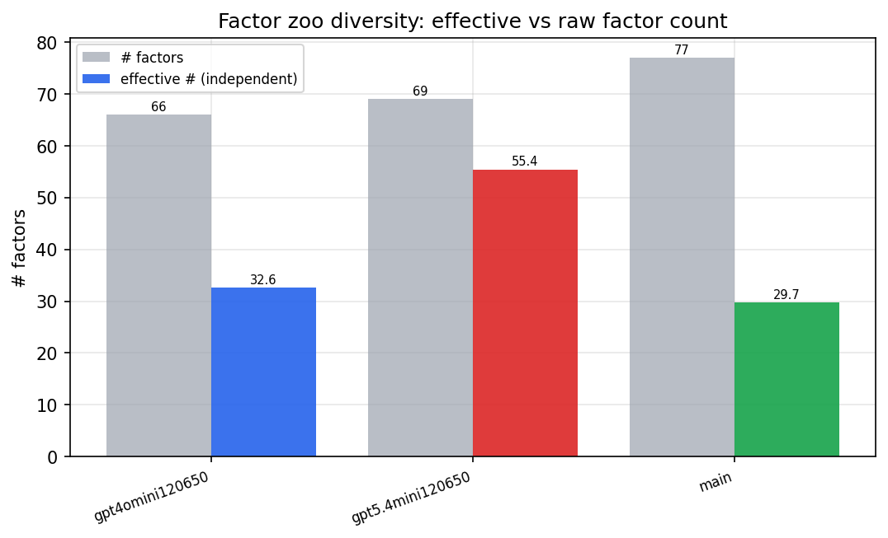

*Effective vs raw factor count per research model*

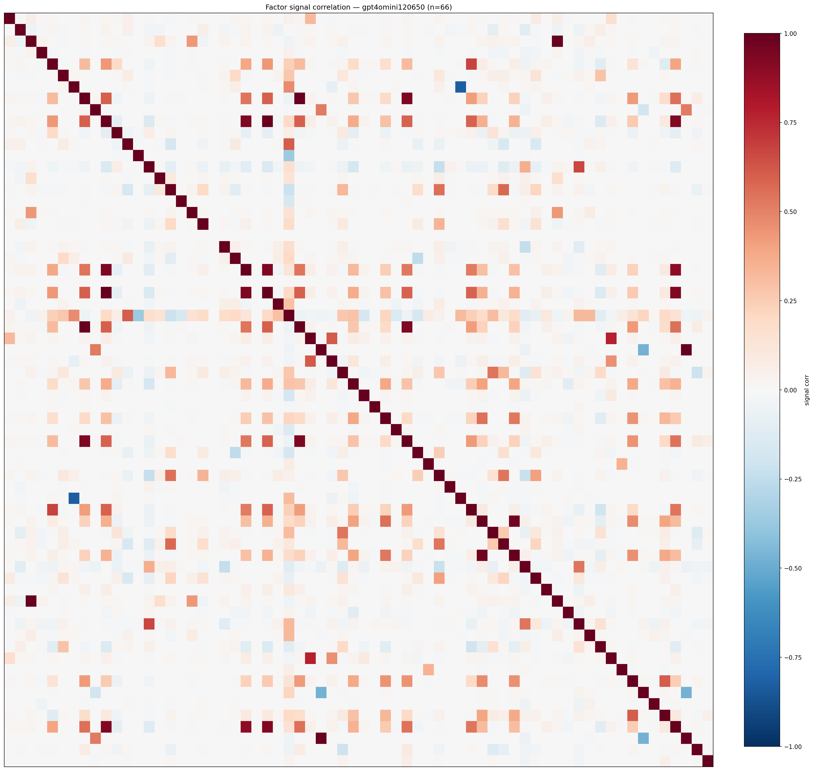

*Signal correlation matrix — gpt4omini120650*

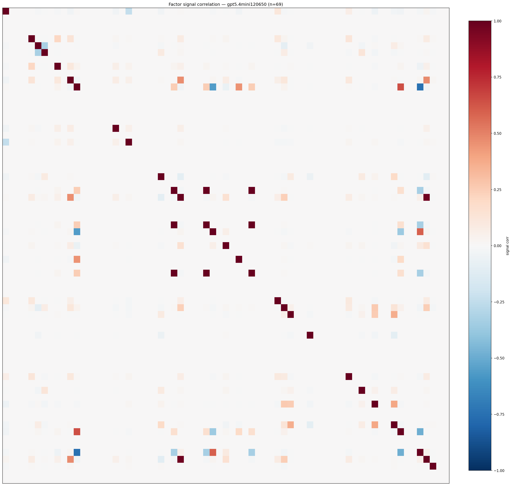

*Signal correlation matrix — gpt5.4mini120650*

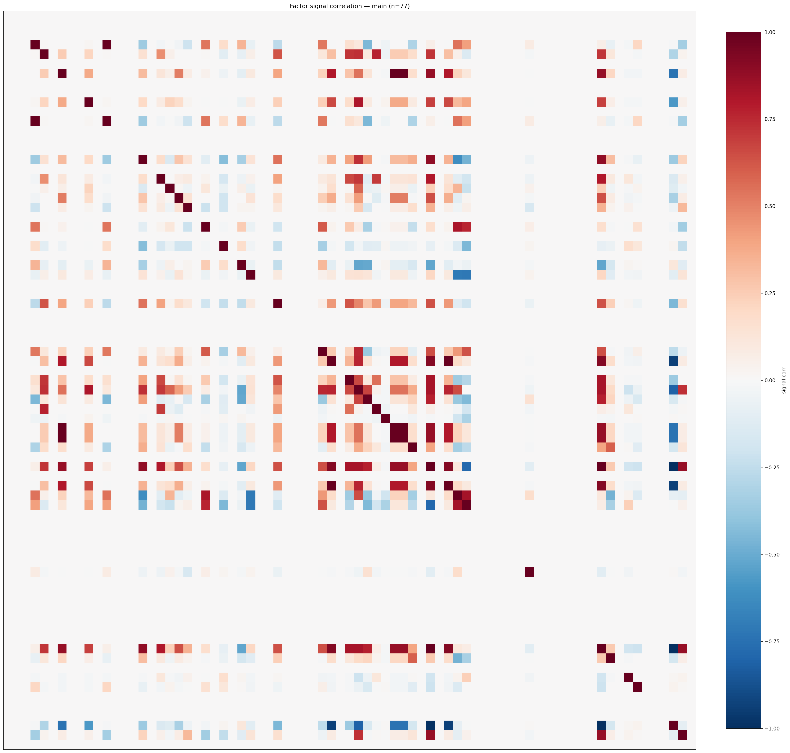

*Signal correlation matrix — main*

## 3. Deflation & model-based importance

`deflated_best_ic` haircuts each zoo's best |IC| for the number of factors tried (`ic_n_tested`) — a bigger zoo's best factor is more likely to be lucky. `lasso_n_nonzero` / `lasso_sparsity` show how many factors a sparse linear model actually keeps (model-view redundancy).

| prerun | best_ic | deflated_best_ic | deflated_best_t | ic_n_tested | ic_n_obs | lasso_n_nonzero | lasso_sparsity |
| --- | --- | --- | --- | --- | --- | --- | --- |
| gpt4omini120650 | 0.1539 | 0.1462 | 54.5562 | 64 | 139319 | 11 | 0.8333 |
| gpt5.4mini120650 | 0.1205 | 0.1135 | 42.3655 | 29 | 139319 | 5 | 0.9275 |
| main | 0.225 | 0.2178 | 81.2972 | 36 | 139319 | 0 | 1.0 |

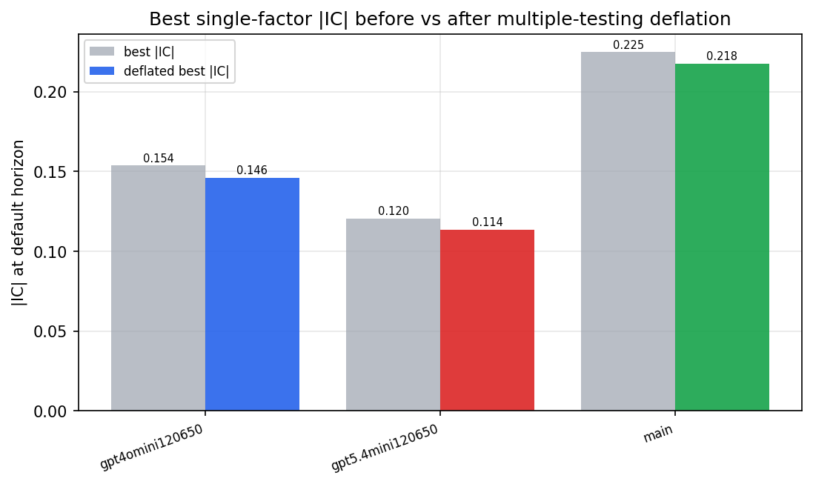

*Best |IC| before vs after multiple-testing deflation*

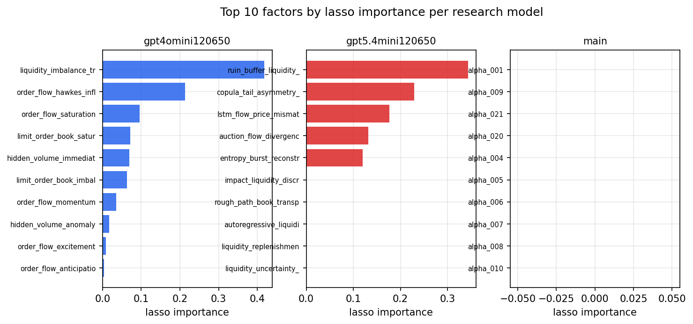

*Top factors by lasso importance per zoo*

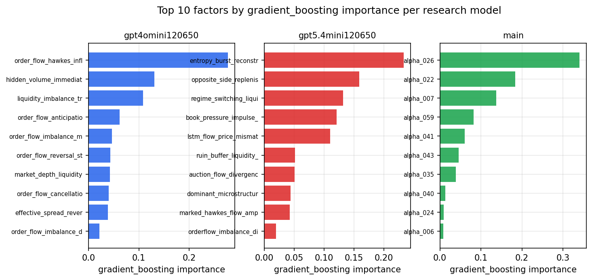

*Top factors by gradient_boosting importance per zoo*

## 4. ML-combined signal — per-underlying vectorised backtest

Each model combines a prerun's factors into ONE signal (fit `factors → forward return` on IS, predict per (bar, underlying)), then that combined signal is run through a simple vectorised backtest — `position(signal) × the underlying's own forward return` — on the held-out OOS tail (+ an equal-weight ensemble). No cross-sectional ranking.

> Config: position=**threshold** (t=1.0, z-score `expanding`), aggregation=**portfolio**, fit-standardise=**per_underlying**, horizon=6.

| prerun | model | n_factors_used | oos_ic | oos_sharpe | is_sharpe | oos_ann_return | oos_max_drawdown |
| --- | --- | --- | --- | --- | --- | --- | --- |
| gpt4omini120650 | linear_regression | 66 | 0.1501 | 22.1606 | 26.0734 | 0.1244 | -0.0005 |
| gpt4omini120650 | ridge | 66 | 0.15 | 22.6473 | 25.7132 | 0.1279 | -0.0005 |
| gpt4omini120650 | lasso | 66 | 0.157 | 21.2103 | 23.2907 | 0.1593 | -0.0013 |
| gpt4omini120650 | elastic_net | 66 | 0.1604 | 32.8117 | 23.4569 | 0.1725 | -0.0004 |
| gpt4omini120650 | random_forest | 66 | 0.1487 | 12.3896 | 17.2027 | 0.092 | -0.0009 |
| gpt4omini120650 | gradient_boosting | 66 | 0.1595 | 3.8155 | 8.4371 | 0.0206 | -0.0006 |
| gpt4omini120650 | xgboost | 66 | 0.1636 | 4.0379 | 9.9558 | 0.0214 | -0.0004 |
| gpt4omini120650 | lightgbm | 66 | 0.1692 | 4.8794 | 11.7758 | 0.0226 | -0.0004 |
| gpt4omini120650 | ensemble | 66 | 0.161 | 19.7686 | 22.5461 | 0.1361 | -0.0007 |
| gpt5.4mini120650 | linear_regression | 69 | 0.1215 | 24.5222 | 18.5301 | 0.0924 | -0.0003 |
| gpt5.4mini120650 | ridge | 69 | 0.1213 | 25.4456 | 20.5239 | 0.0965 | -0.0002 |
| gpt5.4mini120650 | lasso | 69 | 0.1246 | 20.7248 | 14.9031 | 0.082 | -0.0003 |
| gpt5.4mini120650 | elastic_net | 69 | 0.1245 | 21.3758 | 15.2953 | 0.0854 | -0.0003 |
| gpt5.4mini120650 | random_forest | 69 | 0.1698 | 43.1737 | 24.8665 | 0.2072 | -0.0002 |
| gpt5.4mini120650 | gradient_boosting | 69 | 0.14 | 4.2896 | 7.2553 | 0.007 | -0.0003 |
| gpt5.4mini120650 | xgboost | 69 | 0.1627 | 9.1159 | 9.2187 | 0.0179 | -0.0002 |
| gpt5.4mini120650 | lightgbm | 69 | 0.175 | 8.8481 | 9.9827 | 0.0178 | -0.0002 |
| gpt5.4mini120650 | ensemble | 69 | 0.1486 | 29.3999 | 16.7491 | 0.1319 | -0.0003 |
| main | linear_regression | 77 | 0.0288 | 3.9286 | 7.2091 | 0.0184 | -0.0011 |
| main | ridge | 77 | 0.0295 | 4.197 | 7.3309 | 0.0194 | -0.001 |
| main | lasso | 77 | nan | nan | nan | nan | nan |
| main | elastic_net | 77 | nan | nan | nan | nan | nan |
| main | random_forest | 77 | 0.0366 | 2.4 | 9.6957 | 0.0096 | -0.0011 |
| main | gradient_boosting | 77 | 0.0243 | 0.4341 | 6.4702 | 0.0005 | -0.0003 |
| main | xgboost | 77 | 0.029 | 2.5936 | 9.108 | 0.0042 | -0.0002 |
| main | lightgbm | 77 | 0.0375 | 2.7003 | 9.7133 | 0.0097 | -0.0009 |
| main | ensemble | 77 | 0.0332 | 2.028 | 10.1658 | 0.0083 | -0.0013 |

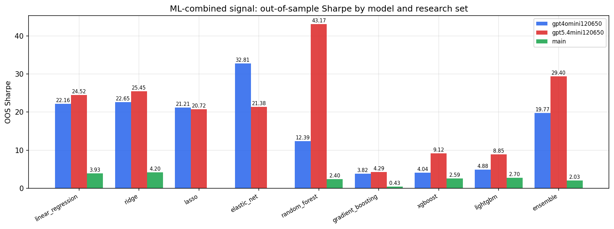

*ML-combined OOS Sharpe by model and research set*

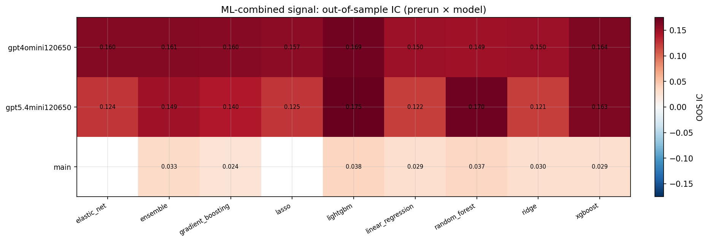

*ML-combined OOS IC (prerun × model)*

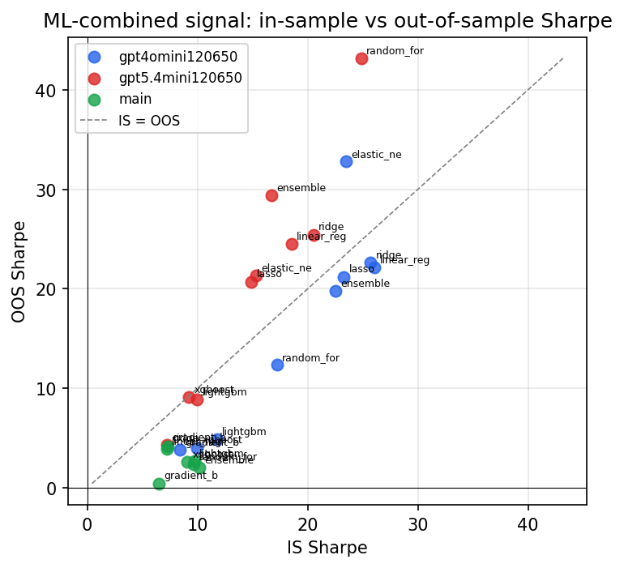

*IS vs OOS Sharpe (overfitting diagnostic)*

---
*Generated by `run_model_comparison.py`. Tables: `*.csv`; interactive: `comparison.ipynb`.*
